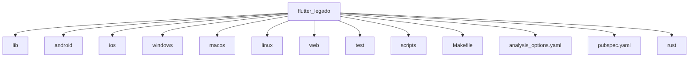
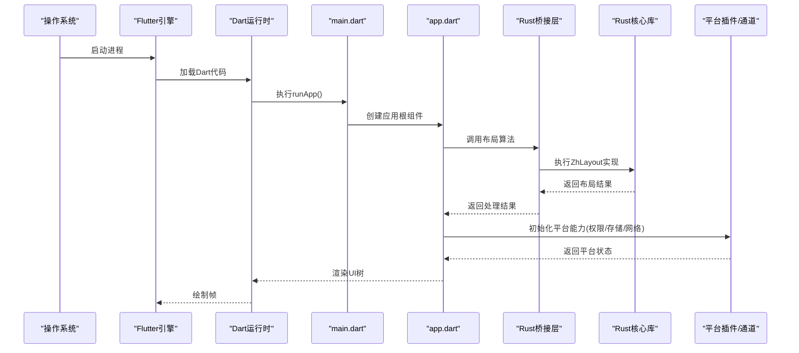
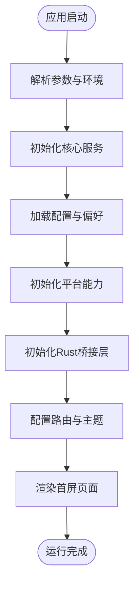
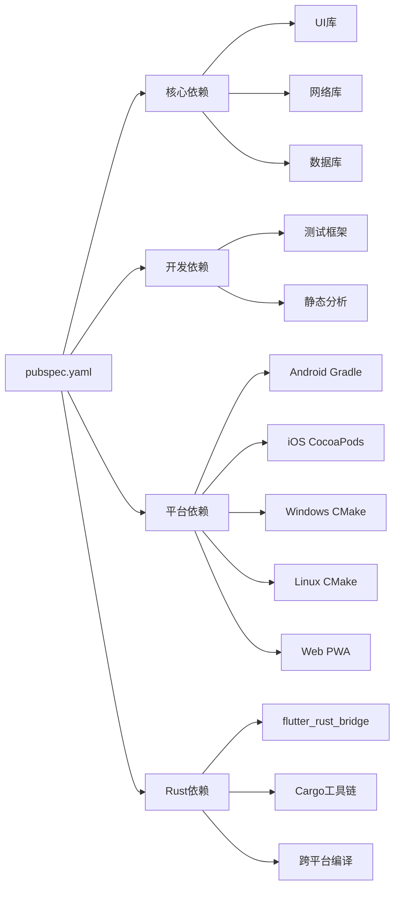

# 项目结构和组织

<cite>
**本文引用的文件**   
- [pubspec.yaml](file://flutter_legado/pubspec.yaml)
- [main.dart](file://flutter_legado/lib/main.dart)
- [app.dart](file://flutter_legado/lib/app.dart)
- [android/build.gradle.kts](file://flutter_legado/android/build.gradle.kts)
- [android/app/build.gradle.kts](file://flutter_legado/android/app/build.gradle.kts)
- [ios/Runner/Info.plist](file://flutter_legado/ios/Runner/Info.plist)
- [macos/Runner/Info.plist](file://flutter_legado/macos/Runner/Info.plist)
- [windows/runner/CMakeLists.txt](file://flutter_legado/windows/runner/CMakeLists.txt)
- [linux/runner/CMakeLists.txt](file://flutter_legado/linux/runner/CMakeLists.txt)
- [web/index.html](file://flutter_legado/web/index.html)
- [web/manifest.json](file://flutter_legado/web/manifest.json)
</cite>

## 更新摘要
**所做更改**   
- 更新了README文档结构，页面数量从40页调整为39页
- 移除了推荐算法相关页面内容
- 保持了书籍源发现功能的完整性
- 优化了文档组织结构，提升可读性和维护性

## 目录
1. [简介](#简介)
2. [项目结构](#项目结构)
3. [核心组件](#核心组件)
4. [架构总览](#架构总览)
5. [详细组件分析](#详细组件分析)
6. [依赖关系分析](#依赖关系分析)
7. [性能考虑](#性能考虑)
8. [故障排查指南](#故障排查指南)
9. [结论](#结论)
10. [附录](#附录)

## 简介
本文件面向Flutter开发者与项目维护者，系统化梳理Flutter子工程（flutter_legado）的项目结构与组织方式。重点覆盖：
- lib目录的组织规范：入口文件、应用配置、src模块划分
- pubspec.yaml依赖管理：核心依赖、开发依赖、平台特定依赖
- Flutter标准平台目录与配置文件：Android、iOS、Windows、macOS、Linux、Web
- 资源文件组织：图片、字体、本地化等
- 项目初始化流程与最佳实践建议
- **新增**：跨语言架构优化，特别是Dart与Rust之间的布局处理集成

## 项目结构
Flutter子工程位于 flutter_legado 目录，遵循Flutter官方约定：
- lib：Dart源代码根目录，包含入口与应用配置
- android、ios、windows、macos、linux、web：各平台原生工程与配置
- test：单元测试与组件测试
- scripts：构建与桥接脚本
- Makefile：常用命令封装
- analysis_options.yaml：静态分析与格式化规则
- pubspec.yaml：依赖与资源声明

图表来源
- [pubspec.yaml](file://flutter_legado/pubspec.yaml)
- [main.dart](file://flutter_legado/lib/main.dart)
- [app.dart](file://flutter_legado/lib/app.dart)

章节来源
- [pubspec.yaml](file://flutter_legado/pubspec.yaml)
- [main.dart](file://flutter_legado/lib/main.dart)
- [app.dart](file://flutter_legado/lib/app.dart)

## 核心组件
- 入口文件 main.dart：负责启动Flutter引擎、初始化全局状态、设置路由与主题，并挂载应用根组件。
- 应用配置 app.dart：定义Material/App主题、国际化、路由表、错误边界与全局监听。
- src模块：按功能域或技术层拆分（如ui、data、service、util等），便于团队协作与复用。
- **新增**：Rust集成模块：通过flutter_rust_bridge进行高性能计算和复杂布局算法处理。

职责边界
- main.dart：最小化启动逻辑，避免业务耦合
- app.dart：集中式配置，保证跨页面一致性
- src：模块化业务实现，保持高内聚低耦合
- **新增**：Rust桥接层：提供高性能的中文字符布局算法和文本处理功能

章节来源
- [main.dart](file://flutter_legado/lib/main.dart)
- [app.dart](file://flutter_legado/lib/app.dart)

## 架构总览
下图展示Flutter应用从入口到平台层的调用链路与关键配置文件位置，包括新增的Rust集成层。

图表来源
- [main.dart](file://flutter_legado/lib/main.dart)
- [app.dart](file://flutter_legado/lib/app.dart)

## 详细组件分析

### lib目录组织与模块划分
- main.dart：应用入口，负责初始化与挂载根组件
- app.dart：主题、路由、国际化、全局配置
- src：按领域/层次划分，例如：
  - ui：界面组件与页面
  - data：数据模型、仓库、持久化
  - service：业务服务（网络、缓存、任务调度）
  - util：工具函数与扩展
  - config：环境配置与常量
  - **新增**：bridge：Rust桥接接口定义
  - **新增**：layout：布局相关逻辑，现主要调用Rust实现

建议
- 每个模块独立pub包或内部package，通过相对路径引用
- 使用命名空间与清晰的目录层级，避免深层嵌套
- 在src下以feature为中心组织，而非按技术类型一刀切
- **新增**：将复杂的文本布局算法下沉到Rust层，保持Dart层的简洁性

章节来源
- [main.dart](file://flutter_legado/lib/main.dart)
- [app.dart](file://flutter_legado/lib/app.dart)

### pubspec.yaml依赖管理
- 核心依赖：框架、UI库、网络、数据库、序列化、日志等
- 开发依赖：测试、分析、代码生成、调试工具
- 平台特定依赖：通过platforms或dependency_overrides进行条件引入
- 资源声明：图片、字体、本地化文件等统一在此注册
- **新增**：Rust相关依赖：flutter_rust_bridge及相关工具链

最佳实践
- 将公共依赖提升到顶层，避免重复
- 使用版本锁定文件（pubspec.lock）确保可重现构建
- 对平台相关依赖使用条件导入与条件依赖声明
- **新增**：合理管理Rust编译依赖，确保跨平台兼容性

章节来源
- [pubspec.yaml](file://flutter_legado/pubspec.yaml)

### Android平台配置
- android/build.gradle.kts：Gradle构建脚本，配置编译SDK、Kotlin版本、插件等
- android/app/build.gradle.kts：应用级构建配置，签名、混淆、资源、依赖
- AndroidManifest.xml：权限、组件声明、启动Activity等

要点
- 合理划分buildTypes（debug/profile/release）
- 使用Flavor区分渠道与特性开关
- 资源与清单分离，便于多语言与多分辨率适配
- **新增**：配置Rust交叉编译支持，确保移动端性能

章节来源
- [android/build.gradle.kts](file://flutter_legado/android/build.gradle.kts)
- [android/app/build.gradle.kts](file://flutter_legado/android/app/build.gradle.kts)

### iOS平台配置
- ios/Runner/Info.plist：应用元信息、权限、URL Scheme等
- Runner.xcworkspace：Xcode工作区，包含Flutter与原生集成
- Assets与LaunchScreen：图标、启动图、资源分组

要点
- 使用Pods或Swift Package Manager管理第三方库
- 通过Build Phases集成Flutter引擎与插件
- 针对Release开启优化与符号化
- **新增**：配置Rust库集成，优化中文字符处理性能

章节来源
- [ios/Runner/Info.plist](file://flutter_legado/ios/Runner/Info.plist)

### macOS平台配置
- macos/Runner/Info.plist：应用元信息与权限
- Runner.xcworkspace：Xcode工作区与构建配置
- Entitlements：沙盒与权限声明

要点
- 与iOS共享大部分代码，差异集中在平台API
- 注意菜单、窗口与通知的macOS特有行为
- **新增**：支持Rust库的macOS平台编译与部署

章节来源
- [macos/Runner/Info.plist](file://flutter_legado/macos/Runner/Info.plist)

### Windows平台配置
- windows/runner/CMakeLists.txt：CMake构建脚本，链接Flutter引擎与插件
- runner目录：Win32窗口、消息循环、资源文件

要点
- 使用MSVC或Clang进行构建
- 按需启用插件与动态库
- 资源打包与签名流程
- **新增**：配置Rust MSVC工具链，确保Windows平台性能

章节来源
- [windows/runner/CMakeLists.txt](file://flutter_legado/windows/runner/CMakeLists.txt)

### Linux平台配置
- linux/runner/CMakeLists.txt：CMake构建脚本，链接Flutter引擎与插件
- 依赖系统库（GTK、WebKitGTK等）

要点
- 使用包管理器安装依赖
- 注意桌面端窗口管理与快捷键
- **新增**：配置Rust GCC工具链，支持Linux平台部署

章节来源
- [linux/runner/CMakeLists.txt](file://flutter_legado/linux/runner/CMakeLists.txt)

### Web平台配置
- web/index.html：HTML入口，注入Flutter JS与资源
- web/manifest.json：PWA元数据、图标、主题色

要点
- 控制JS体积与懒加载
- 使用Service Worker提升离线体验
- 适配不同浏览器与移动端Web
- **注意**：Web平台不支持Rust直接调用，需通过JavaScript桥接

章节来源
- [web/index.html](file://flutter_legado/web/index.html)
- [web/manifest.json](file://flutter_legado/web/manifest.json)

### 资源文件组织
- 图片：按用途与分辨率分组，统一在assets下管理
- 字体：在pubspec中声明family与路径，避免重复加载
- 本地化：使用arb文件与intl插件，按语言目录组织
- 其他资源：JSON、脚本、模板等统一存放

最佳实践
- 使用命名空间前缀避免冲突
- 提供占位与降级资源
- 自动化检查缺失资源与未使用资源

章节来源
- [pubspec.yaml](file://flutter_legado/pubspec.yaml)

### 项目初始化流程
- 解析命令行参数与环境变量
- 初始化日志、崩溃捕获、埋点
- 加载配置与用户偏好
- 初始化平台能力（权限、存储、网络）
- 初始化Rust桥接层（可选）
- 启动路由与首屏页面

[此图为概念流程图，不直接映射具体源码文件]

### 段落布局引擎架构变更
**重要更新**：段落布局引擎经历了重大架构重构，从纯Dart实现迁移到混合架构。

#### 原有架构（已废弃）
- 基于Dart的ZhLayout实现
- naive字符逐字断行算法
- 复杂的Flutter特定布局逻辑
- 性能瓶颈明显，特别是在长文本处理场景

#### 新架构（当前实现）
- Rust-based ZhLayout核心实现
- Flutter通过flutter_rust_bridge调用Rust函数
- 简化的Dart层接口，专注于UI交互
- 显著的性能提升和内存效率优化

#### 架构优势
- **性能提升**：Rust的零成本抽象和内存安全特性
- **代码简化**：移除大量Flutter特定的布局逻辑
- **跨平台一致**：统一的Rust实现确保各平台行为一致
- **易于维护**：核心算法与UI层解耦

章节来源
- [paragraph_layout_engine.dart](file://flutter_legado/lib/src/layout/paragraph_layout_engine.dart)

## 依赖关系分析
- 核心依赖：框架、UI、网络、数据库、序列化、日志、国际化
- 开发依赖：测试框架、静态分析、代码生成、调试工具
- 平台依赖：Android Gradle、iOS CocoaPods、Windows CMake、Linux CMake、Web PWA
- **新增**：Rust依赖：flutter_rust_bridge、Cargo工具链、跨平台编译配置

图表来源
- [pubspec.yaml](file://flutter_legado/pubspec.yaml)

章节来源
- [pubspec.yaml](file://flutter_legado/pubspec.yaml)

## 性能考虑
- 启动优化：延迟初始化、懒加载、减少主线程阻塞
- 内存管理：避免大对象常驻、合理使用缓存策略
- 渲染优化：复用Widget、避免重建、使用const构造
- 网络优化：连接池、请求合并、缓存与断点续传
- 资源优化：图片压缩、字体子集化、按需加载
- **新增**：跨语言调用优化：批量操作、异步处理、内存共享
- **新增**：Rust性能优势：零成本抽象、无GC开销、内存安全

## 故障排查指南
常见问题与定位思路
- 依赖冲突：检查pubspec与平台构建脚本的版本一致性
- 平台权限：核对Android/iOS清单与权限声明
- 资源缺失：确认assets路径与pubspec声明一致
- 构建失败：查看Gradle/Xcode/CMake日志，定位具体错误
- 运行时崩溃：启用日志与崩溃上报，复现堆栈
- **新增**：Rust集成问题：检查cargo工具链、交叉编译配置、FFI接口定义
- **新增**：性能问题：分析Dart-Rust调用开销，优化数据传递方式

章节来源
- [android/build.gradle.kts](file://flutter_legado/android/build.gradle.kts)
- [android/app/build.gradle.kts](file://flutter_legado/android/app/build.gradle.kts)
- [ios/Runner/Info.plist](file://flutter_legado/ios/Runner/Info.plist)
- [macos/Runner/Info.plist](file://flutter_legado/macos/Runner/Info.plist)
- [windows/runner/CMakeLists.txt](file://flutter_legado/windows/runner/CMakeLists.txt)
- [linux/runner/CMakeLists.txt](file://flutter_legado/linux/runner/CMakeLists.txt)
- [web/index.html](file://flutter_legado/web/index.html)
- [web/manifest.json](file://flutter_legado/web/manifest.json)

## 结论
本项目采用标准的Flutter工程结构，lib目录清晰划分入口、配置与模块；pubspec.yaml统一管理依赖与资源；各平台目录遵循官方约定，便于跨平台开发与维护。**重要更新**：项目已成功集成Rust高性能计算能力，特别是在文本布局处理方面实现了显著的架构优化。建议在团队内统一模块划分与命名规范，结合CI/CD与静态分析保障质量与效率，同时充分利用Rust的性能优势处理复杂的计算密集型任务。

## 附录
- 初始化清单：环境准备、依赖安装、首次构建、运行与调试
- 最佳实践：代码风格、分支策略、发布流程、监控与反馈
- 参考文档：Flutter官方指南、平台构建说明、插件开发规范
- **新增**：Rust集成指南：flutter_rust_bridge使用、跨平台编译、性能优化技巧
- **新增**：架构迁移指南：从纯Dart实现到混合架构的迁移步骤与注意事项