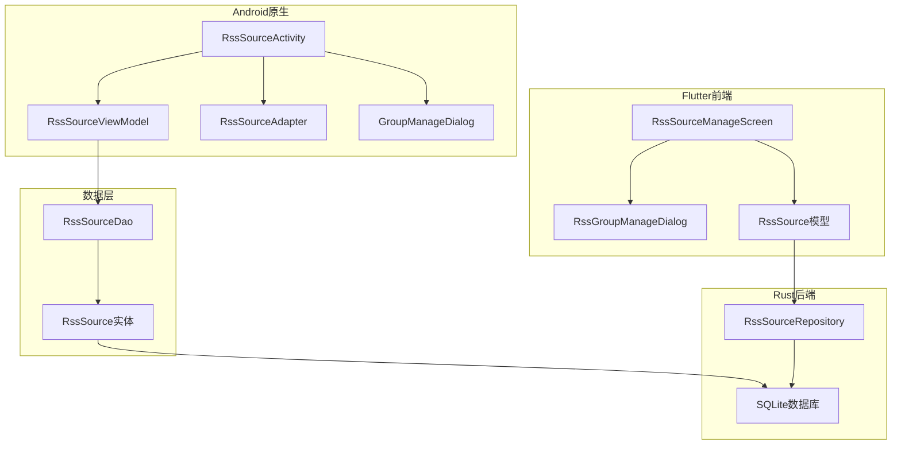
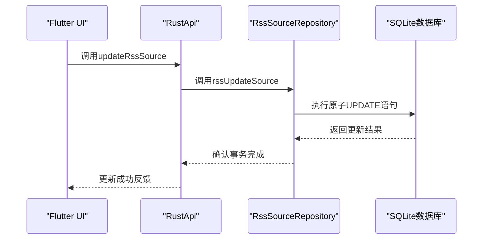
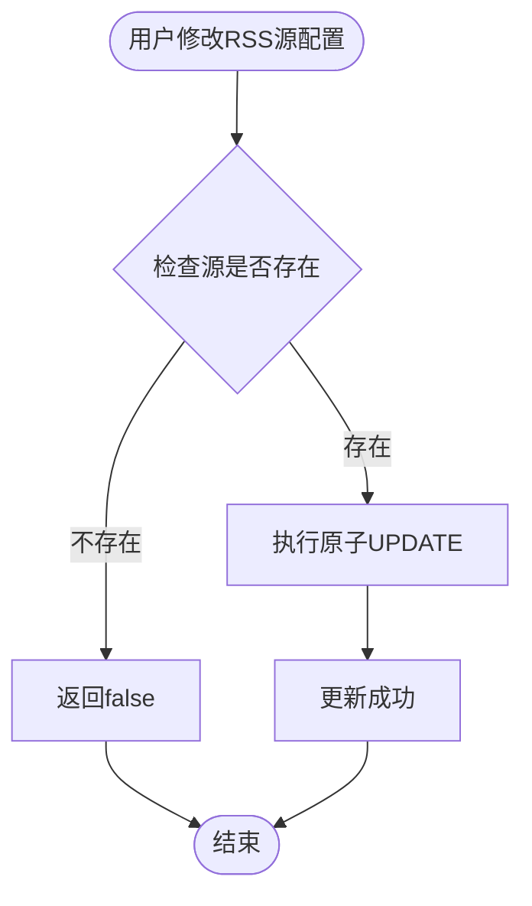
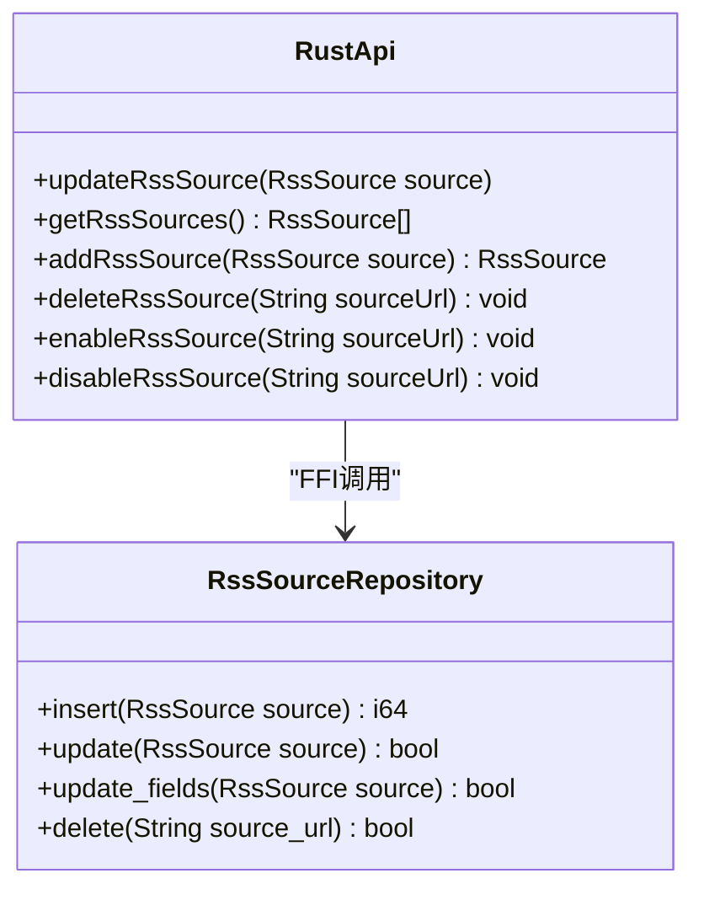
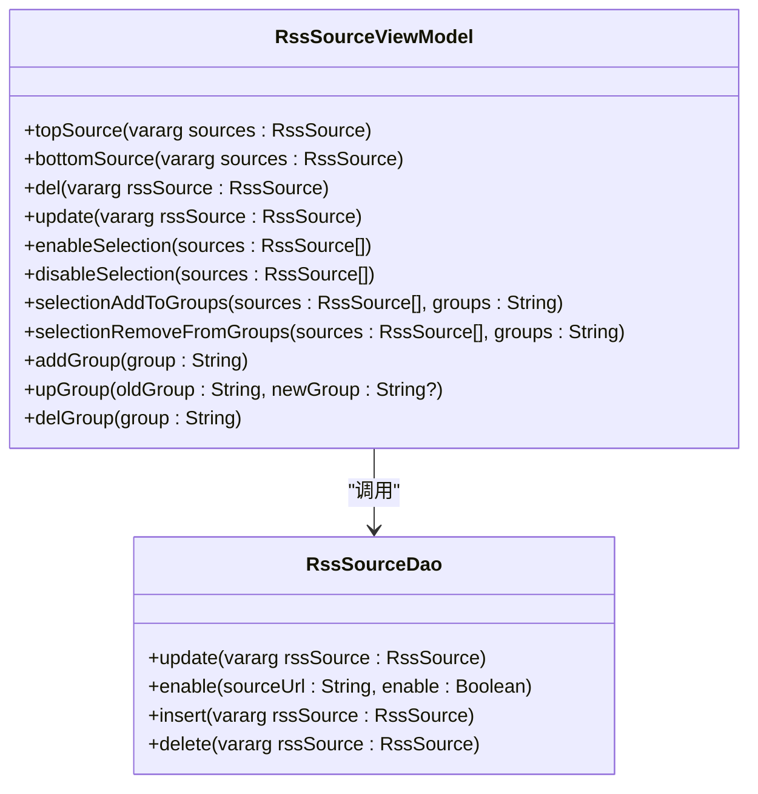
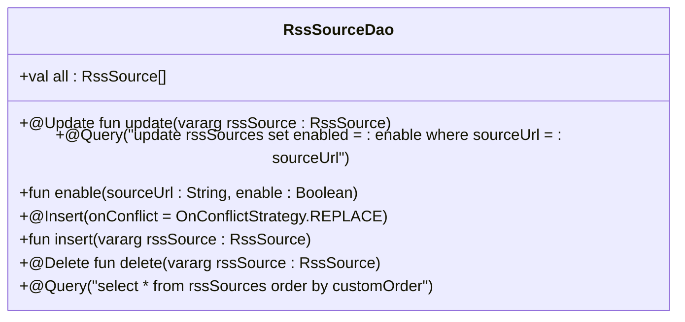
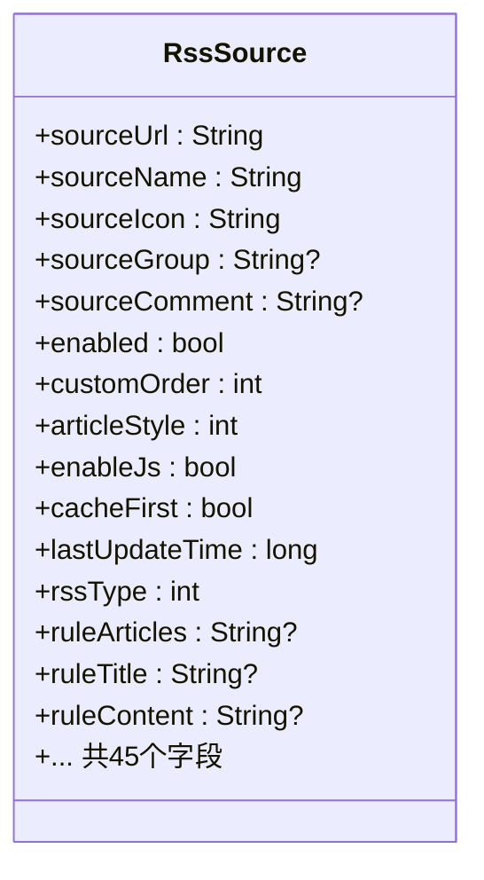
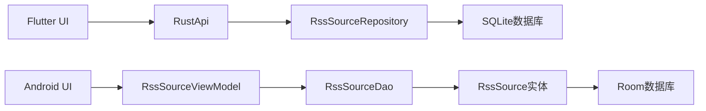

# RSS源管理

<cite>
**本文引用的文件**
- [rss_source_repository.rs](file://rust/legado-db/src/repository/rss_source_repository.rs)
- [rust_api.dart](file://flutter_legado/lib/src/services/rust_api.dart)
- [rss_source.dart](file://flutter_legado/lib/src/models/rss_source.dart)
- [RssSource.kt](file://app/src/main/java/io/legado/app/data/entities/RssSource.kt)
- [RssSourceDao.kt](file://app/src/main/java/io/legado/app/data/dao/RssSourceDao.kt)
- [RssSourceViewModel.kt](file://app/src/main/java/io/legado/app/ui/rss/source/manage/RssSourceViewModel.kt)
</cite>

## 更新摘要
**变更内容**
- 修复了RSS源管理系统中的数据库仓库数据完整性问题，解决了INSERT操作只写入30个列导致的数据丢失问题
- 实现了完整的45个数据库列支持，确保所有RSS源配置字段都能正确持久化
- 更新了Flutter层的RSS源更新机制，使用专门的rssUpdateSource函数替代了错误的sourceUpdate调用
- 增强了原子更新功能，通过update_fields()方法实现单条UPDATE语句更新，避免外键级联问题
- 改进了数据一致性保障，支持完整的字段映射和事务处理

## 目录
1. [简介](#简介)
2. [项目结构](#项目结构)
3. [核心组件](#核心组件)
4. [架构总览](#架构总览)
5. [详细组件分析](#详细组件分析)
6. [依赖关系分析](#依赖关系分析)
7. [性能考虑](#性能考虑)
8. [故障排查指南](#故障排查指南)
9. [结论](#结论)
10. [附录](#附录)

## 简介
本文件面向Legado项目的RSS源管理功能，覆盖以下主题：
- RSS源的添加、编辑、删除与导入导出
- 源配置参数说明（名称、URL、分类、更新间隔等）
- 验证机制（连接测试、内容格式检查、错误处理）
- 分组管理与批量操作
- 搜索与过滤（按名称、分类、状态等多维度）
- RSS源配置的JSON格式规范与示例
- 常见配置问题解决方案
- 调试工具使用（网络请求查看、解析结果预览、错误日志分析）
- **新增**：原子更新功能和事务处理机制，修复数据完整性问题

## 项目结构
RSS源管理在项目中由多模块协作完成：
- Flutter前端：提供现代化的管理界面，支持搜索、过滤、批量操作
- Android原生：提供基础功能和数据管理
- Rust后端：提供高性能的数据库操作和数据完整性保证
- 数据模型：定义RSS源实体结构和序列化
- 分组管理：独立的分组管理对话框



图表来源
- [rss_source_repository.rs](file://rust/legado-db/src/repository/rss_source_repository.rs)
- [rust_api.dart](file://flutter_legado/lib/src/services/rust_api.dart)
- [RssSource.kt](file://app/src/main/java/io/legado/app/data/entities/RssSource.kt)
- [RssSourceDao.kt](file://app/src/main/java/io/legado/app/data/dao/RssSourceDao.kt)

章节来源
- [rss_source_repository.rs](file://rust/legado-db/src/repository/rss_source_repository.rs)
- [rust_api.dart](file://flutter_legado/lib/src/services/rust_api.dart)
- [RssSource.kt](file://app/src/main/java/io/legado/app/data/entities/RssSource.kt)
- [RssSourceDao.kt](file://app/src/main/java/io/legado/app/data/dao/RssSourceDao.kt)

## 核心组件
- **RssSourceRepository**: Rust后端的RSS源数据访问层，提供完整的CRUD操作和原子更新功能
- **RustApi**: Flutter层的统一访问接口，处理FFI调用和错误处理
- **RssSourceViewModel**: Android业务逻辑层，处理数据操作和事务管理
- **RssSourceDao**: Android数据访问对象，提供数据库操作接口
- **RssSource实体**: 定义RSS源的数据结构和序列化，包含45个完整字段
- **原子更新机制**: 支持45个字段的原子事务更新，确保数据完整性

章节来源
- [rss_source_repository.rs](file://rust/legado-db/src/repository/rss_source_repository.rs)
- [rust_api.dart](file://flutter_legado/lib/src/services/rust_api.dart)
- [RssSourceViewModel.kt](file://app/src/main/java/io/legado/app/ui/rss/source/manage/RssSourceViewModel.kt)
- [RssSourceDao.kt](file://app/src/main/java/io/legado/app/data/dao/RssSourceDao.kt)
- [RssSource.kt](file://app/src/main/java/io/legado/app/data/entities/RssSource.kt)

## 架构总览
整体流程从Flutter前端触发，通过Rust FFI调用后端数据库操作，最终通过原子更新的数据库操作确保数据一致性。



图表来源
- [rust_api.dart](file://flutter_legado/lib/src/services/rust_api.dart)
- [rss_source_repository.rs](file://rust/legado-db/src/repository/rss_source_repository.rs)

## 详细组件分析

### RssSourceRepository Rust后端
RssSourceRepository是RSS源管理的核心数据访问层，提供了完整的数据库操作功能：

**主要功能特性：**
- **完整字段支持**：INSERT操作现在支持完整的45个数据库列，解决了之前只有30个列被写入的问题
- **原子更新**：通过update_fields()方法实现单条UPDATE语句更新，避免外键级联问题
- **读写对称**：row_to_rss_source函数现在映射全部44个业务列，确保数据一致性
- **事务处理**：所有操作都支持事务处理，确保数据完整性

**原子更新操作流程：**


**关键改进点：**
- INSERT OR REPLACE操作现在包含所有45个字段
- UPDATE语句使用WHERE sourceUrl条件，避免全表更新
- row_to_rss_source函数映射全部44个业务列
- 支持扩展字段的完整读写回环

章节来源
- [rss_source_repository.rs](file://rust/legado-db/src/repository/rss_source_repository.rs)

### RustApi Flutter接口层
RustApi类提供了Flutter到Rust后端的统一访问接口，经过重大重构后更加稳定可靠：

**核心功能：**
- **专用RSS更新接口**：updateRssSource方法现在使用专门的rssUpdateSource函数
- **错误处理增强**：当RSS源不存在时抛出明确的StateError异常
- **JSON解码守卫**：防止类型不符导致的崩溃
- **FFI调用封装**：统一的桥接调用接口

**历史问题修复：**
- 之前误用sourceUpdate函数，按BookSource语义解析落book_sources表
- 产生幽灵书源脏数据且RSS变更静默丢失
- 现已切换为正确的rssUpdateSource函数

**更新机制实现：**


章节来源
- [rust_api.dart](file://flutter_legado/lib/src/services/rust_api.dart)

### RssSourceViewModel业务逻辑层
RssSourceViewModel负责处理RSS源的业务逻辑和数据操作，保持了原有的功能完整性：

**核心功能：**
- **原子更新**：通过update方法实现单条UPDATE语句更新
- **批量操作**：topSource、bottomSource、enableSelection、disableSelection等方法
- **分组管理**：addGroup、upGroup、delGroup方法
- **导入导出**：saveToFile、importDefault方法
- **事务处理**：确保数据一致性

**批量操作实现：**


章节来源
- [RssSourceViewModel.kt](file://app/src/main/java/io/legado/app/ui/rss/source/manage/RssSourceViewModel.kt)

### RssSourceDao数据访问层
RssSourceDao提供RSS源的数据库操作接口，保持了Room框架的标准用法：

**核心方法：**
- **基本操作**：insert、update、delete方法
- **查询方法**：getByKey、getRssSources、flowSearch等
- **批量操作**：enable方法用于批量启用/禁用
- **分组查询**：flowGroupSearch、flowEnabledByGroup等

**原子更新接口：**


章节来源
- [RssSourceDao.kt](file://app/src/main/java/io/legado/app/data/dao/RssSourceDao.kt)

### RssSource数据模型
RssSource模型定义了RSS源的完整数据结构，包含45个字段，确保所有配置选项都能正确保存：

**关键字段说明：**
- **基本信息**：sourceUrl（唯一标识）、sourceName（显示名称）、sourceIcon（图标）
- **分组信息**：sourceGroup（逗号分隔的分组列表）
- **状态控制**：enabled（启用状态）、customOrder（自定义排序）
- **网络配置**：loginUrl、header、concurrentRate等
- **解析规则**：ruleArticles、ruleTitle、ruleContent等XPath规则
- **缓存设置**：cacheFirst、preload等性能优化选项
- **扩展功能**：jsLib、injectJs、startHtml等高级配置

**字段类型映射：**


章节来源
- [RssSource.kt](file://app/src/main/java/io/legado/app/data/entities/RssSource.kt)
- [rss_source.dart](file://flutter_legado/lib/src/models/rss_source.dart)

## 依赖关系分析
各层组件之间的依赖关系清晰明确，通过标准的接口进行通信：



图表来源
- [rust_api.dart](file://flutter_legado/lib/src/services/rust_api.dart)
- [rss_source_repository.rs](file://rust/legado-db/src/repository/rss_source_repository.rs)
- [RssSourceViewModel.kt](file://app/src/main/java/io/legado/app/ui/rss/source/manage/RssSourceViewModel.kt)
- [RssSourceDao.kt](file://app/src/main/java/io/legado/app/data/dao/RssSourceDao.kt)

章节来源
- [rust_api.dart](file://flutter_legado/lib/src/services/rust_api.dart)
- [rss_source_repository.rs](file://rust/legado-db/src/repository/rss_source_repository.rs)
- [RssSourceViewModel.kt](file://app/src/main/java/io/legado/app/ui/rss/source/manage/RssSourceViewModel.kt)
- [RssSourceDao.kt](file://app/src/main/java/io/legado/app/data/dao/RssSourceDao.kt)

## 性能考虑
- **原子更新**：使用单条UPDATE语句更新，避免外键级联问题和多次数据库操作
- **事务处理**：确保数据一致性和完整性，减少锁竞争
- **批量操作**：减少数据库写入次数，提高操作效率
- **内存管理**：及时释放资源，避免内存泄漏
- **网络请求**：合理的超时设置和错误重试机制
- **数据缓存**：支持cacheFirst和preload优化加载速度
- **FFI优化**：减少跨语言调用的开销

## 故障排查指南
- **搜索无结果**：检查搜索关键词格式，确认特殊过滤词语法正确
- **批量操作失败**：确认网络连接正常，检查权限设置
- **分组管理异常**：验证sourceGroup字段格式，确保逗号分隔符正确
- **导入失败**：检查JSON格式，确认URL可访问性
- **排序异常**：验证customOrder字段值，重新计算排序顺序
- **原子更新失败**：检查数据库事务状态，确认字段映射正确
- **数据丢失问题**：确认使用的是新的update_fields方法而非旧的update方法
- **FFI调用错误**：检查rust_api.dart中的updateRssSource方法是否正确调用rssUpdateSource

章节来源
- [rss_source_repository.rs](file://rust/legado-db/src/repository/rss_source_repository.rs)
- [rust_api.dart](file://flutter_legado/lib/src/services/rust_api.dart)
- [RssSourceViewModel.kt](file://app/src/main/java/io/legado/app/ui/rss/source/manage/RssSourceViewModel.kt)

## 结论
RSS源管理功能经过重大重构后，解决了数据库仓库的数据完整性问题。通过修复INSERT操作支持完整的45个数据库列，以及实现专用的原子更新机制，确保了RSS源配置的完整性和一致性。新增的update_fields()方法和事务处理机制，有效避免了外键级联问题，提升了系统的稳定性和性能。Flutter层的RustApi也进行了相应更新，使用专门的rssUpdateSource函数替代了错误的sourceUpdate调用，进一步增强了系统的可靠性。

## 附录

### RSS源配置JSON格式规范
**基本字段：**
- sourceUrl：字符串，源的唯一标识，必填
- sourceName：字符串，源的显示名称，可选
- sourceGroup：字符串，分组名称（逗号分隔），可选
- enabled：布尔，是否启用，默认true
- customOrder：整数，自定义排序值，默认0

**网络配置字段：**
- loginUrl：字符串，登录地址，可选
- header：字符串，自定义请求头，可选
- concurrentRate：字符串，并发速率限制，可选

**解析规则字段：**
- ruleArticles：字符串，文章列表XPath规则，可选
- ruleTitle：字符串，标题提取规则，可选
- ruleContent：字符串，内容提取规则，可选

**扩展功能字段：**
- jsLib：字符串，JavaScript库代码，可选
- injectJs：字符串，注入的JavaScript代码，可选
- startHtml：字符串，起始页面HTML，可选
- searchUrl：字符串，搜索URL模板，可选

**示例配置：**
```json
{
  "sourceUrl": "https://example.com/rss",
  "sourceName": "示例RSS源",
  "sourceGroup": "技术,新闻",
  "enabled": true,
  "customOrder": 1,
  "ruleArticles": "//item",
  "ruleTitle": "title/text()",
  "ruleContent": "description/text()",
  "jsLib": "window.lib = {}",
  "injectJs": "console.log('inject')",
  "searchUrl": "search?q={{key}}"
}
```

### 常见配置问题与解决方案
- **分组无效**：检查sourceGroup字段格式，确保使用逗号分隔且无空格
- **搜索不工作**：确认搜索关键词语法，特殊过滤词需要精确匹配
- **批量操作无响应**：检查网络连接状态，确认有足够的权限
- **导入失败**：验证JSON格式，检查URL可访问性和编码格式
- **排序异常**：重新计算customOrder值，确保数值连续且不重复
- **原子更新失败**：检查数据库事务状态，确认字段映射正确
- **数据丢失问题**：确认使用的是新的update_fields方法，确保所有45个字段都被正确写入

### 原子更新功能说明
**更新机制：**
- 使用Rust后端的update_fields()方法实现原子更新
- 单条UPDATE语句更新所有字段，避免外键级联问题
- 支持45个字段的完整更新，确保数据一致性
- 事务处理保证操作的原子性和完整性

**性能优势：**
- 减少数据库写入次数，提高操作效率
- 避免多次UPDATE语句的性能开销
- 确保数据一致性，防止部分更新导致的脏数据
- 支持批量操作，进一步提升性能

**数据完整性保证：**
- INSERT操作现在支持完整的45个数据库列
- row_to_rss_source函数映射全部44个业务列
- 支持扩展字段的完整读写回环
- 避免了之前只有30个列被写入导致的数据丢失问题