# RSS源管理

<cite>
**本文引用的文件**
- [rss_source.rs](file://rust/legado-core/src/models/rss_source.rs)
- [rss.rs](file://rust/legado-net/src/rss.rs)
- [verification.rs](file://rust/legado-net/src/verification.rs)
- [source_checker.rs](file://rust/legado-net/src/source_checker.rs)
- [rss_source_repository.rs](file://rust/legado-db/src/repository/rss_source_repository.rs)
- [rss_article_repository.rs](file://rust/legado-db/src/repository/rss_article_repository.rs)
- [rss_star_repository.rs](file://rust/legado-db/src/repository/rss_star_repository.rs)
- [rss.rs (FFI)](file://rust/legado-ffi/src/api/rss.rs)
- [rss_star_api.rs](file://rust/legado-ffi/src/api/rss_star_api.rs)
- [rss_source_edit_config.ts](file://modules/web/src/config/rssSourceEditConfig.ts)
- [SourceEditor.vue](file://modules/web/src/views/SourceEditor.vue)
- [SourceList.vue](file://modules/web/src/components/SourceList.vue)
- [SourceJson.vue](file://modules/web/src/components/SourceJson.vue)
- [SourceDebug.vue](file://modules/web/src/components/SourceDebug.vue)
- [sourceRouter.ts](file://modules/web/src/router/sourceRouter.ts)
- [sourceStore.ts](file://modules/web/src/store/sourceStore.ts)
- [connectionStore.ts](file://modules/web/src/store/connectionStore.ts)
</cite>

## 目录
1. [简介](#简介)
2. [项目结构](#项目结构)
3. [核心组件](#核心组件)
4. [架构总览](#架构总览)
5. [详细组件分析](#详细组件分析)
6. [依赖关系分析](#依赖关系分析)
7. [性能考虑](#性能考虑)
8. [故障排查指南](#故障排查指南)
9. [结论](#结论)
10. [附录](#附录)

## 简介
本文件面向Legado项目的RSS源管理功能，覆盖以下主题：
- RSS源的添加、编辑、删除与导入导出
- 源配置参数说明（名称、URL、分类、更新间隔等）
- 验证机制（连接测试、内容格式检查、错误处理）
- 分组管理与批量操作
- 搜索与过滤（按名称、分类、状态等多维度）
- RSS源配置的JSON格式规范与示例
- 常见配置问题解决方案
- 调试工具使用（网络请求查看、解析结果预览、错误日志分析）

## 项目结构
RSS源管理在项目中由多模块协作完成：
- Rust核心模型与仓库：定义RSS源数据模型、持久化与CRUD接口
- Rust网络层：负责RSS抓取、校验、重试与错误处理
- FFI桥接层：对外暴露API供前端调用
- Web前端：提供可视化编辑、导入导出、调试与列表管理界面

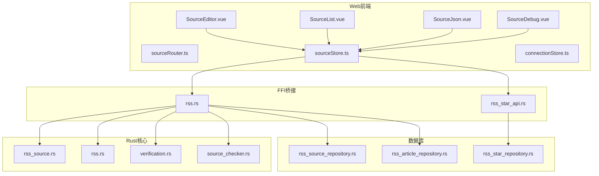

图表来源
- [SourceEditor.vue](file://modules/web/src/views/SourceEditor.vue)
- [SourceList.vue](file://modules/web/src/components/SourceList.vue)
- [SourceJson.vue](file://modules/web/src/components/SourceJson.vue)
- [SourceDebug.vue](file://modules/web/src/components/SourceDebug.vue)
- [sourceRouter.ts](file://modules/web/src/router/sourceRouter.ts)
- [sourceStore.ts](file://modules/web/src/store/sourceStore.ts)
- [connectionStore.ts](file://modules/web/src/store/connectionStore.ts)
- [rss.rs (FFI)](file://rust/legado-ffi/src/api/rss.rs)
- [rss_star_api.rs](file://rust/legado-ffi/src/api/rss_star_api.rs)
- [rss_source.rs](file://rust/legado-core/src/models/rss_source.rs)
- [rss.rs](file://rust/legado-net/src/rss.rs)
- [verification.rs](file://rust/legado-net/src/verification.rs)
- [source_checker.rs](file://rust/legado-net/src/source_checker.rs)
- [rss_source_repository.rs](file://rust/legado-db/src/repository/rss_source_repository.rs)
- [rss_article_repository.rs](file://rust/legado-db/src/repository/rss_article_repository.rs)
- [rss_star_repository.rs](file://rust/legado-db/src/repository/rss_star_repository.rs)

章节来源
- [rss_source.rs](file://rust/legado-core/src/models/rss_source.rs)
- [rss.rs](file://rust/legado-net/src/rss.rs)
- [verification.rs](file://rust/legado-net/src/verification.rs)
- [source_checker.rs](file://rust/legado-net/src/source_checker.rs)
- [rss_source_repository.rs](file://rust/legado-db/src/repository/rss_source_repository.rs)
- [rss_article_repository.rs](file://rust/legado-db/src/repository/rss_article_repository.rs)
- [rss_star_repository.rs](file://rust/legado-db/src/repository/rss_star_repository.rs)
- [rss.rs (FFI)](file://rust/legado-ffi/src/api/rss.rs)
- [rss_star_api.rs](file://rust/legado-ffi/src/api/rss_star_api.rs)
- [rssSourceEditConfig.ts](file://modules/web/src/config/rssSourceEditConfig.ts)
- [SourceEditor.vue](file://modules/web/src/views/SourceEditor.vue)
- [SourceList.vue](file://modules/web/src/components/SourceList.vue)
- [SourceJson.vue](file://modules/web/src/components/SourceJson.vue)
- [SourceDebug.vue](file://modules/web/src/components/SourceDebug.vue)
- [sourceRouter.ts](file://modules/web/src/router/sourceRouter.ts)
- [sourceStore.ts](file://modules/web/src/store/sourceStore.ts)
- [connectionStore.ts](file://modules/web/src/store/connectionStore.ts)

## 核心组件
- 数据模型与持久化
  - RSS源实体定义与字段约束位于核心模型模块
  - 源、文章、收藏的仓储接口提供增删改查与批量操作能力
- 网络与校验
  - RSS抓取、解析、重试与错误封装
  - 连接测试与内容格式校验
  - 源健康检查与可用性判定
- 前端交互
  - 编辑器、列表、JSON导入导出、调试面板
  - 路由与状态管理，统一调用FFI API

章节来源
- [rss_source.rs](file://rust/legado-core/src/models/rss_source.rs)
- [rss_source_repository.rs](file://rust/legado-db/src/repository/rss_source_repository.rs)
- [rss_article_repository.rs](file://rust/legado-db/src/repository/rss_article_repository.rs)
- [rss_star_repository.rs](file://rust/legado-db/src/repository/rss_star_repository.rs)
- [rss.rs](file://rust/legado-net/src/rss.rs)
- [verification.rs](file://rust/legado-net/src/verification.rs)
- [source_checker.rs](file://rust/legado-net/src/source_checker.rs)
- [rssSourceEditConfig.ts](file://modules/web/src/config/rssSourceEditConfig.ts)
- [SourceEditor.vue](file://modules/web/src/views/SourceEditor.vue)
- [SourceList.vue](file://modules/web/src/components/SourceList.vue)
- [SourceJson.vue](file://modules/web/src/components/SourceJson.vue)
- [SourceDebug.vue](file://modules/web/src/components/SourceDebug.vue)
- [sourceRouter.ts](file://modules/web/src/router/sourceRouter.ts)
- [sourceStore.ts](file://modules/web/src/store/sourceStore.ts)
- [connectionStore.ts](file://modules/web/src/store/connectionStore.ts)

## 架构总览
整体流程从前端触发，经FFI桥接进入Rust核心，最终访问数据库与网络层。

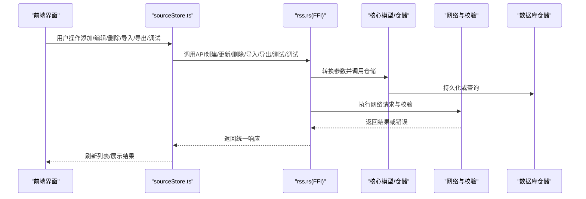

图表来源
- [sourceStore.ts](file://modules/web/src/store/sourceStore.ts)
- [rss.rs (FFI)](file://rust/legado-ffi/src/api/rss.rs)
- [rss_source_repository.rs](file://rust/legado-db/src/repository/rss_source_repository.rs)
- [rss.rs](file://rust/legado-net/src/rss.rs)
- [verification.rs](file://rust/legado-net/src/verification.rs)

## 详细组件分析

### 数据模型与字段说明
- RSS源实体包含名称、URL、分类、更新间隔、启用状态等关键配置项
- 字段用于控制抓取策略、排序与显示、以及任务调度
- 仓储层提供分页、条件查询与批量操作

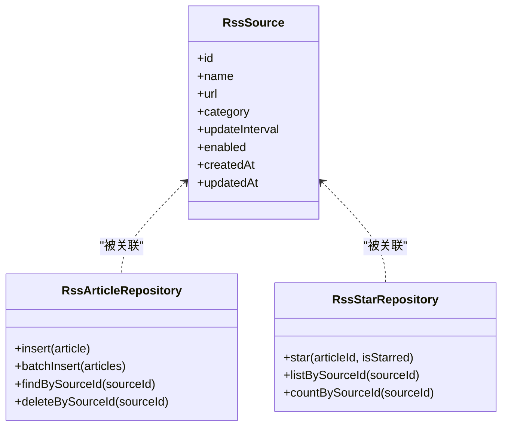

图表来源
- [rss_source.rs](file://rust/legado-core/src/models/rss_source.rs)
- [rss_article_repository.rs](file://rust/legado-db/src/repository/rss_article_repository.rs)
- [rss_star_repository.rs](file://rust/legado-db/src/repository/rss_star_repository.rs)

章节来源
- [rss_source.rs](file://rust/legado-core/src/models/rss_source.rs)
- [rss_article_repository.rs](file://rust/legado-db/src/repository/rss_article_repository.rs)
- [rss_star_repository.rs](file://rust/legado-db/src/repository/rss_star_repository.rs)

### 网络抓取与校验
- 抓取流程包括HTTP请求、响应解码、RSS/Atom解析、条目抽取
- 校验环节涵盖连接测试、内容格式检查、错误码与异常处理
- 支持重试策略与超时控制

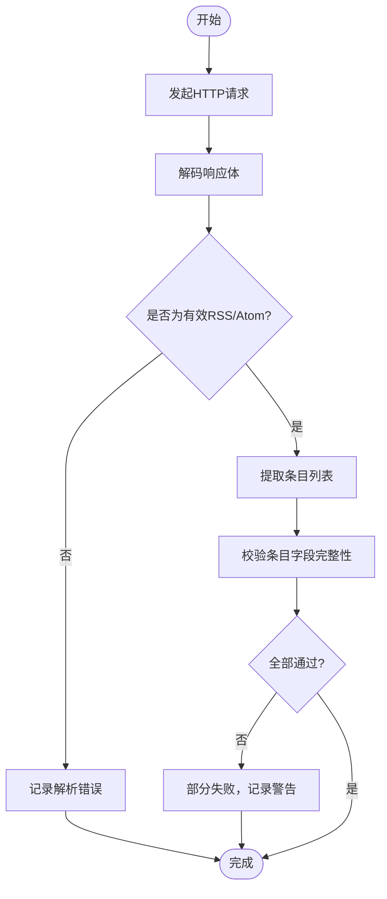

图表来源
- [rss.rs](file://rust/legado-net/src/rss.rs)
- [verification.rs](file://rust/legado-net/src/verification.rs)

章节来源
- [rss.rs](file://rust/legado-net/src/rss.rs)
- [verification.rs](file://rust/legado-net/src/verification.rs)

### 源健康检查
- 定期检测源可达性与响应质量
- 根据失败次数与延迟调整抓取频率或标记不可用

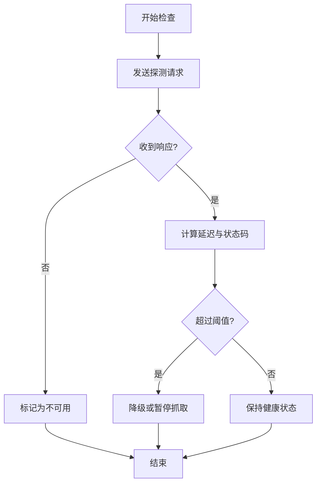

图表来源
- [source_checker.rs](file://rust/legado-net/src/source_checker.rs)

章节来源
- [source_checker.rs](file://rust/legado-net/src/source_checker.rs)

### 前端编辑器与表单配置
- 编辑器提供可视化字段输入与校验提示
- 表单配置定义字段类型、默认值、必填与正则校验规则
- 支持切换至JSON模式进行高级编辑

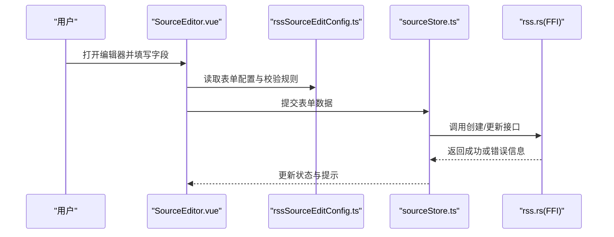

图表来源
- [SourceEditor.vue](file://modules/web/src/views/SourceEditor.vue)
- [rssSourceEditConfig.ts](file://modules/web/src/config/rssSourceEditConfig.ts)
- [sourceStore.ts](file://modules/web/src/store/sourceStore.ts)
- [rss.rs (FFI)](file://rust/legado-ffi/src/api/rss.rs)

章节来源
- [SourceEditor.vue](file://modules/web/src/views/SourceEditor.vue)
- [rssSourceEditConfig.ts](file://modules/web/src/config/rssSourceEditConfig.ts)
- [sourceStore.ts](file://modules/web/src/store/sourceStore.ts)
- [rss.rs (FFI)](file://rust/legado-ffi/src/api/rss.rs)

### 列表管理与批量操作
- 列表页支持分页、排序、筛选与多选
- 批量启用/禁用、批量删除、批量导入导出
- 支持按名称、分类、状态等多维度筛选

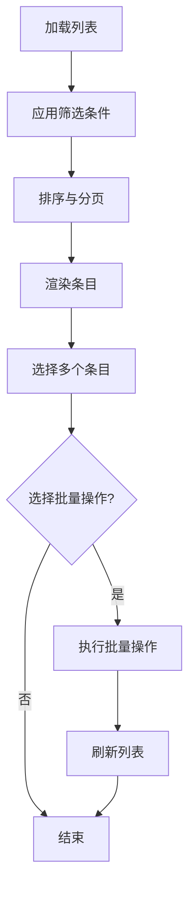

图表来源
- [SourceList.vue](file://modules/web/src/components/SourceList.vue)
- [sourceStore.ts](file://modules/web/src/store/sourceStore.ts)

章节来源
- [SourceList.vue](file://modules/web/src/components/SourceList.vue)
- [sourceStore.ts](file://modules/web/src/store/sourceStore.ts)

### JSON导入导出
- 支持将单个或多个RSS源配置导出为JSON
- 支持从JSON批量导入，自动去重与冲突处理
- 导入前进行格式校验与字段映射

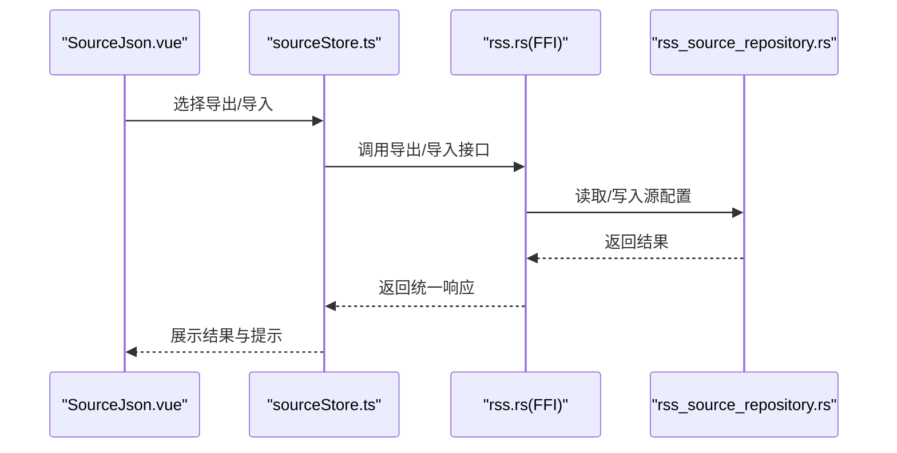

图表来源
- [SourceJson.vue](file://modules/web/src/components/SourceJson.vue)
- [sourceStore.ts](file://modules/web/src/store/sourceStore.ts)
- [rss.rs (FFI)](file://rust/legado-ffi/src/api/rss.rs)
- [rss_source_repository.rs](file://rust/legado-db/src/repository/rss_source_repository.rs)

章节来源
- [SourceJson.vue](file://modules/web/src/components/SourceJson.vue)
- [sourceStore.ts](file://modules/web/src/store/sourceStore.ts)
- [rss.rs (FFI)](file://rust/legado-ffi/src/api/rss.rs)
- [rss_source_repository.rs](file://rust/legado-db/src/repository/rss_source_repository.rs)

### 调试工具
- 网络请求查看：记录请求URL、方法、头、响应体与耗时
- 解析结果预览：展示解析后的条目结构与字段映射
- 错误日志分析：聚合错误类型、堆栈与上下文信息

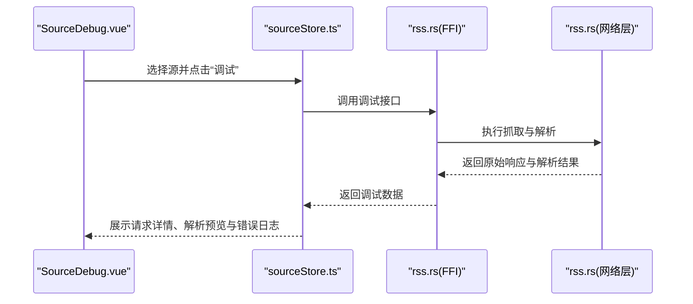

图表来源
- [SourceDebug.vue](file://modules/web/src/components/SourceDebug.vue)
- [sourceStore.ts](file://modules/web/src/store/sourceStore.ts)
- [rss.rs (FFI)](file://rust/legado-ffi/src/api/rss.rs)
- [rss.rs](file://rust/legado-net/src/rss.rs)

章节来源
- [SourceDebug.vue](file://modules/web/src/components/SourceDebug.vue)
- [sourceStore.ts](file://modules/web/src/store/sourceStore.ts)
- [rss.rs (FFI)](file://rust/legado-ffi/src/api/rss.rs)
- [rss.rs](file://rust/legado-net/src/rss.rs)

### 收藏与分组管理
- 收藏功能用于快速定位重要条目
- 分组管理支持按分类、标签组织源与条目
- 批量操作可跨分组移动或复制

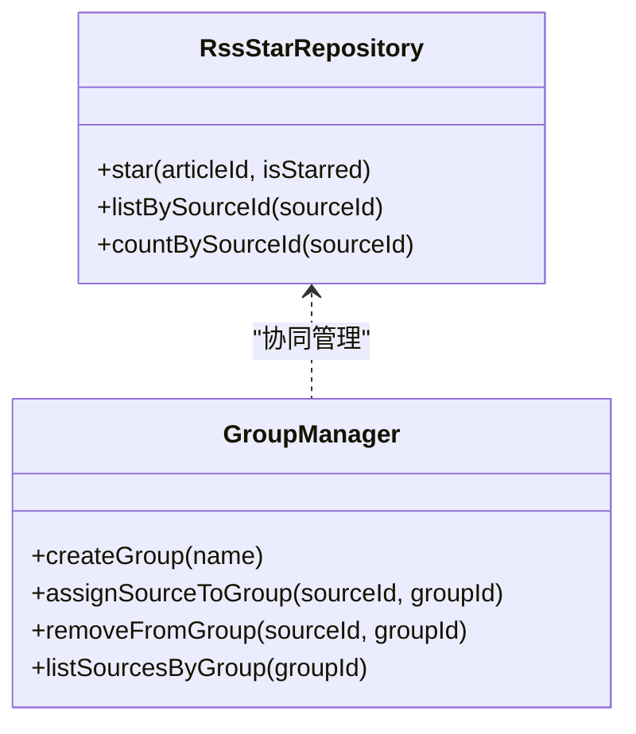

图表来源
- [rss_star_repository.rs](file://rust/legado-db/src/repository/rss_star_repository.rs)

章节来源
- [rss_star_repository.rs](file://rust/legado-db/src/repository/rss_star_repository.rs)

## 依赖关系分析
- 前端依赖store与FFI接口，store依赖网络与本地缓存
- FFI层依赖核心模型与仓储，仓储依赖数据库
- 网络层依赖HTTP客户端、解析器与校验工具

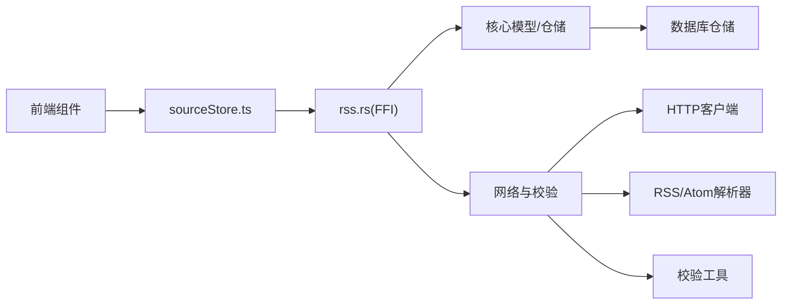

图表来源
- [sourceStore.ts](file://modules/web/src/store/sourceStore.ts)
- [rss.rs (FFI)](file://rust/legado-ffi/src/api/rss.rs)
- [rss_source_repository.rs](file://rust/legado-db/src/repository/rss_source_repository.rs)
- [rss.rs](file://rust/legado-net/src/rss.rs)
- [verification.rs](file://rust/legado-net/src/verification.rs)

章节来源
- [sourceStore.ts](file://modules/web/src/store/sourceStore.ts)
- [rss.rs (FFI)](file://rust/legado-ffi/src/api/rss.rs)
- [rss_source_repository.rs](file://rust/legado-db/src/repository/rss_source_repository.rs)
- [rss.rs](file://rust/legado-net/src/rss.rs)
- [verification.rs](file://rust/legado-net/src/verification.rs)

## 性能考虑
- 抓取并发与限流：避免对同一源频繁请求，合理设置更新间隔
- 解析优化：增量解析与缓存已存在条目，减少重复处理
- 内存与IO：大响应体分块处理，及时释放资源
- 重试与退避：指数退避与最大重试次数限制

[本节为通用指导，不直接分析具体文件]

## 故障排查指南
- 连接失败：检查URL有效性、代理与SSL配置、防火墙与DNS
- 解析错误：确认RSS/Atom格式正确，检查编码与字符集
- 权限与认证：确保必要的Cookie、Token或鉴权头已配置
- 性能问题：观察响应时间与重试次数，调整间隔与并发
- 错误日志：通过调试面板查看请求详情与解析结果，定位问题根因

章节来源
- [verification.rs](file://rust/legado-net/src/verification.rs)
- [source_checker.rs](file://rust/legado-net/src/source_checker.rs)
- [SourceDebug.vue](file://modules/web/src/components/SourceDebug.vue)

## 结论
RSS源管理在Legado中由清晰的分层架构支撑：前端提供易用界面，FFI桥接统一接口，Rust核心实现数据模型与业务逻辑，网络层负责抓取与校验，仓储层保障持久化。通过完善的验证、调试与批量操作能力，用户可以高效地维护与管理RSS源。

[本节为总结性内容，不直接分析具体文件]

## 附录

### RSS源配置JSON格式规范
- 基本字段
  - name：字符串，源名称，必填
  - url：字符串，RSS/Atom地址，必填
  - category：字符串，分类标签，可选
  - updateInterval：整数，更新间隔（秒），可选
  - enabled：布尔，是否启用，可选
  - headers：对象，自定义请求头，可选
  - userAgent：字符串，用户代理，可选
  - timeout：整数，超时毫秒数，可选
  - retryCount：整数，重试次数，可选
  - filterRules：数组，过滤规则，可选
  - sortField：字符串，排序字段，可选
  - sortOrder：字符串，升序/降序，可选
- 示例
  - 一个最小可用配置包含name、url与enabled
  - 高级配置可加入headers、filterRules与sortField

[本节为概念性说明，不直接分析具体文件]

### 常见配置问题与解决方案
- URL无效或无法访问：更换可用地址或检查网络环境
- 编码错误：指定正确的字符集或使用自动检测
- 反爬限制：增加User-Agent与必要请求头，降低请求频率
- 解析失败：核对RSS/Atom结构，修正XPath或JSONPath规则
- 性能瓶颈：增大超时与重试上限，合理设置更新间隔

[本节为通用指导，不直接分析具体文件]