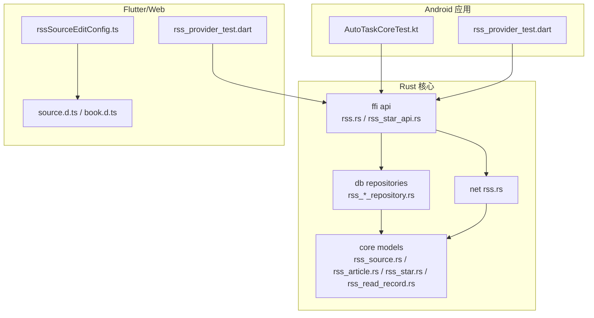
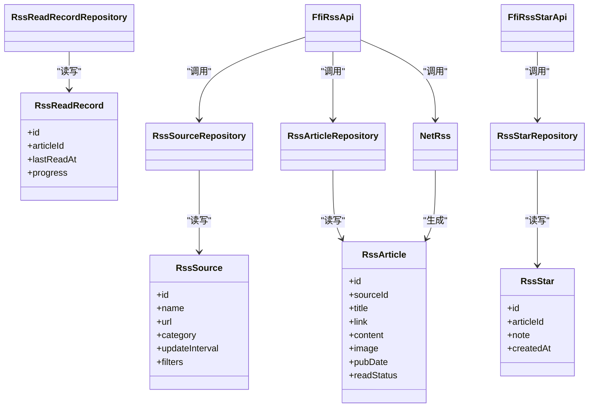
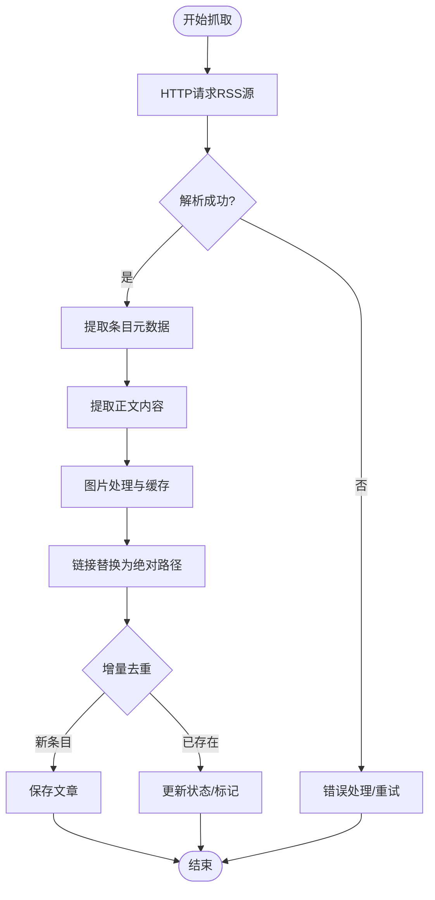
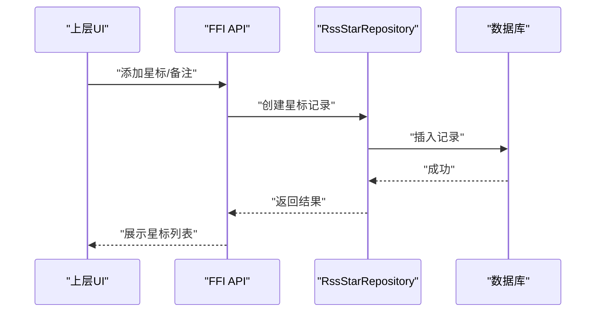
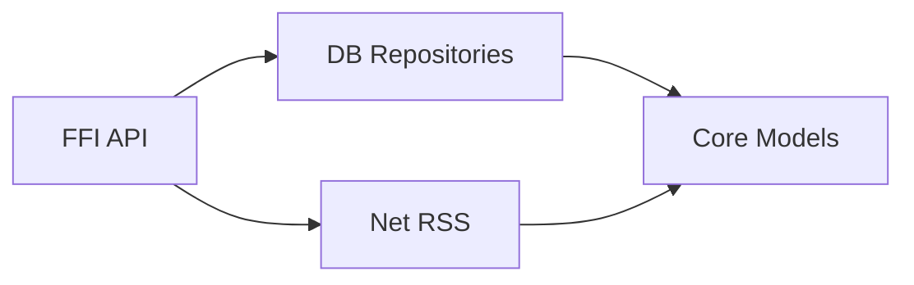

# RSS订阅系统

<cite>
**本文档引用的文件**   
- [rss_source_repository.rs](file://rust/legado-db/src/repository/rss_source_repository.rs)
- [rss_article_repository.rs](file://rust/legado-db/src/repository/rss_article_repository.rs)
- [rss_star_repository.rs](file://rust/legado-db/src/repository/rss_star_repository.rs)
- [rss_read_record_repository.rs](file://rust/legado-db/src/repository/rss_read_record_repository.rs)
- [rss.rs (net)](file://rust/legado-net/src/rss.rs)
- [rss.rs (ffi api)](file://rust/legado-ffi/src/api/rss.rs)
- [rss_star_api.rs](file://rust/legado-ffi/src/api/rss_star_api.rs)
- [rss_source_repository.rs (model)](file://rust/legado-core/src/models/rss_source.rs)
- [rss_article_repository.rs (model)](file://rust/legado-core/src/models/rss_article.rs)
- [rss_star_repository.rs (model)](file://rust/legado-core/src/models/rss_star.rs)
- [rss_read_record_repository.rs (model)](file://rust/legado-core/src/models/rss_read_record.rs)
- [auto_task_core_test.kt](file://app/src/test/java/io/legado/app/model/AutoTaskCoreTest.kt)
- [rss_provider_test.dart](file://flutter_legado/test/unit/rss_provider_test.dart)
- [rssSourceEditConfig.ts](file://modules/web/src/config/rssSourceEditConfig.ts)
- [source.d.ts](file://modules/web/src/source.d.ts)
- [book.d.ts](file://modules/web/src/book.d.ts)
</cite>

## 目录
1. [简介](#简介)
2. [项目结构](#项目结构)
3. [核心组件](#核心组件)
4. [架构总览](#架构总览)
5. [详细组件分析](#详细组件分析)
6. [依赖关系分析](#依赖关系分析)
7. [性能考量](#性能考量)
8. [故障排查指南](#故障排查指南)
9. [结论](#结论)
10. [附录](#附录)

## 简介
本文件面向RSS订阅系统的开发者与高级用户，系统性阐述RSS源管理、内容抓取与解析、阅读体验优化、收藏与分享、自动更新机制以及源开发与调试等关键能力。文档基于仓库中的Rust核心库、Android应用层与Flutter前端配置进行综合分析，提供从数据模型到网络抓取、从UI配置到后台任务的端到端说明，并给出可视化架构图与流程图，帮助读者快速理解与上手。

## 项目结构
RSS相关能力横跨多个模块：
- Rust核心库（legado-core、legado-db、legado-net、legado-ffi）负责数据模型、持久化、网络抓取与FFI暴露。
- Android应用层（app）包含测试与集成点，验证自动任务调度与RSS行为。
- Flutter前端（flutter_legado）提供单元测试与Web侧的RSS源编辑配置。
- Web编辑器（modules/web）提供RSS源编辑界面与类型定义。

图表来源
- [auto_task_core_test.kt](file://app/src/test/java/io/legado/app/model/AutoTaskCoreTest.kt)
- [rss_provider_test.dart](file://flutter_legado/test/unit/rss_provider_test.dart)
- [rss_source_repository.rs](file://rust/legado-db/src/repository/rss_source_repository.rs)
- [rss_article_repository.rs](file://rust/legado-db/src/repository/rss_article_repository.rs)
- [rss_star_repository.rs](file://rust/legado-db/src/repository/rss_star_repository.rs)
- [rss_read_record_repository.rs](file://rust/legado-db/src/repository/rss_read_record_repository.rs)
- [rss.rs (net)](file://rust/legado-net/src/rss.rs)
- [rss.rs (ffi api)](file://rust/legado-ffi/src/api/rss.rs)
- [rss_star_api.rs](file://rust/legado-ffi/src/api/rss_star_api.rs)
- [rss_source_repository.rs (model)](file://rust/legado-core/src/models/rss_source.rs)
- [rss_article_repository.rs (model)](file://rust/legado-core/src/models/rss_article.rs)
- [rss_star_repository.rs (model)](file://rust/legado-core/src/models/rss_star.rs)
- [rss_read_record_repository.rs (model)](file://rust/legado-core/src/models/rss_read_record.rs)
- [rssSourceEditConfig.ts](file://modules/web/src/config/rssSourceEditConfig.ts)
- [source.d.ts](file://modules/web/src/source.d.ts)
- [book.d.ts](file://modules/web/src/book.d.ts)

章节来源
- [auto_task_core_test.kt](file://app/src/test/java/io/legado/app/model/AutoTaskCoreTest.kt)
- [rss_provider_test.dart](file://flutter_legado/test/unit/rss_provider_test.dart)
- [rssSourceEditConfig.ts](file://modules/web/src/config/rssSourceEditConfig.ts)
- [source.d.ts](file://modules/web/src/source.d.ts)
- [book.d.ts](file://modules/web/src/book.d.ts)

## 核心组件
- RSS源模型与持久化
  - 源信息、文章、星标、阅读记录四类实体在core中定义，由db层的对应Repository实现CRUD与查询。
- 网络抓取与解析
  - net层提供RSS抓取能力，负责HTTP请求、XML解析、内容提取与图片处理、链接替换等。
- FFI接口
  - ffi层将RSS能力暴露给上层（Android/Flutter），包括源管理、文章列表、星标管理等API。
- 前端配置与类型
  - Web侧提供RSS源编辑配置与类型定义，便于可视化编辑与校验。

章节来源
- [rss_source_repository.rs (model)](file://rust/legado-core/src/models/rss_source.rs)
- [rss_article_repository.rs (model)](file://rust/legado-core/src/models/rss_article.rs)
- [rss_star_repository.rs (model)](file://rust/legado-core/src/models/rss_star.rs)
- [rss_read_record_repository.rs (model)](file://rust/legado-core/src/models/rss_read_record.rs)
- [rss_source_repository.rs](file://rust/legado-db/src/repository/rss_source_repository.rs)
- [rss_article_repository.rs](file://rust/legado-db/src/repository/rss_article_repository.rs)
- [rss_star_repository.rs](file://rust/legado-db/src/repository/rss_star_repository.rs)
- [rss_read_record_repository.rs](file://rust/legado-db/src/repository/rss_read_record_repository.rs)
- [rss.rs (net)](file://rust/legado-net/src/rss.rs)
- [rss.rs (ffi api)](file://rust/legado-ffi/src/api/rss.rs)
- [rss_star_api.rs](file://rust/legado-ffi/src/api/rss_star_api.rs)
- [rssSourceEditConfig.ts](file://modules/web/src/config/rssSourceEditConfig.ts)
- [source.d.ts](file://modules/web/src/source.d.ts)
- [book.d.ts](file://modules/web/src/book.d.ts)

## 架构总览
整体采用分层架构：上层通过FFI调用Rust核心能力；核心层由模型、数据库、网络与工具组成；上层UI（Android/Flutter/Web）通过配置与测试驱动功能使用。

图表来源
- [rss_source_repository.rs (model)](file://rust/legado-core/src/models/rss_source.rs)
- [rss_article_repository.rs (model)](file://rust/legado-core/src/models/rss_article.rs)
- [rss_star_repository.rs (model)](file://rust/legado-core/src/models/rss_star.rs)
- [rss_read_record_repository.rs (model)](file://rust/legado-core/src/models/rss_read_record.rs)
- [rss_source_repository.rs](file://rust/legado-db/src/repository/rss_source_repository.rs)
- [rss_article_repository.rs](file://rust/legado-db/src/repository/rss_article_repository.rs)
- [rss_star_repository.rs](file://rust/legado-db/src/repository/rss_star_repository.rs)
- [rss_read_record_repository.rs](file://rust/legado-db/src/repository/rss_read_record_repository.rs)
- [rss.rs (net)](file://rust/legado-net/src/rss.rs)
- [rss.rs (ffi api)](file://rust/legado-ffi/src/api/rss.rs)
- [rss_star_api.rs](file://rust/legado-ffi/src/api/rss_star_api.rs)

## 详细组件分析

### RSS源管理与分类
- 功能要点
  - 添加/编辑/删除RSS源，支持名称、URL、分类、更新频率、内容过滤规则等配置。
  - 分类用于聚合与筛选，提升浏览效率。
- 数据流
  - UI通过FFI调用Rust API，写入源信息至数据库；后续抓取任务读取配置执行增量更新。
- 关键点
  - 更新频率决定定时任务间隔；过滤规则用于文章入库前筛选。

章节来源
- [rss_source_repository.rs](file://rust/legado-db/src/repository/rss_source_repository.rs)
- [rss_source_repository.rs (model)](file://rust/legado-core/src/models/rss_source.rs)
- [rssSourceEditConfig.ts](file://modules/web/src/config/rssSourceEditConfig.ts)
- [source.d.ts](file://modules/web/src/source.d.ts)

### 内容抓取与解析算法
- 流程概述
  - 发起HTTP请求获取RSS XML或HTML；解析条目元数据（标题、链接、发布时间等）；提取正文内容；处理图片资源与相对链接替换；去重与增量更新。
- 数据处理步骤
  - XML解析：定位条目节点，抽取字段。
  - 内容提取：清洗HTML，保留必要标签，去除广告与脚本。
  - 图片处理：下载或缓存图片，统一为绝对路径或本地缓存地址。
  - 链接替换：将相对路径转换为可访问的绝对链接。
- 增量与冲突
  - 基于时间戳或唯一标识判断新增与更新；冲突时按策略合并或覆盖。

图表来源
- [rss.rs (net)](file://rust/legado-net/src/rss.rs)
- [rss_article_repository.rs](file://rust/legado-db/src/repository/rss_article_repository.rs)
- [rss_article_repository.rs (model)](file://rust/legado-core/src/models/rss_article.rs)

章节来源
- [rss.rs (net)](file://rust/legado-net/src/rss.rs)
- [rss_article_repository.rs](file://rust/legado-db/src/repository/rss_article_repository.rs)
- [rss_article_repository.rs (model)](file://rust/legado-core/src/models/rss_article.rs)

### 文章阅读体验优化
- 渲染与排版
  - 对正文进行HTML清洗与样式注入，适配移动端阅读。
- 字体与主题
  - 支持字体选择与主题切换，提升可读性与个性化。
- 离线阅读
  - 文章内容与图片缓存至本地，断网仍可阅读。
- 交互增强
  - 进度记录、跳转、搜索与高亮等。

章节来源
- [rss_article_repository.rs](file://rust/legado-db/src/repository/rss_article_repository.rs)
- [rss_article_repository.rs (model)](file://rust/legado-core/src/models/rss_article.rs)
- [book.d.ts](file://modules/web/src/book.d.ts)

### 收藏与分享
- 星标管理
  - 对文章添加星标，支持备注与时间戳，便于回顾与检索。
- 笔记记录
  - 为收藏项附加笔记，形成个人知识卡片。
- 社交分享
  - 将文章链接或摘要分享至社交平台（由上层UI实现）。

图表来源
- [rss_star_api.rs](file://rust/legado-ffi/src/api/rss_star_api.rs)
- [rss_star_repository.rs](file://rust/legado-db/src/repository/rss_star_repository.rs)
- [rss_star_repository.rs (model)](file://rust/legado-core/src/models/rss_star.rs)

章节来源
- [rss_star_api.rs](file://rust/legado-ffi/src/api/rss_star_api.rs)
- [rss_star_repository.rs](file://rust/legado-db/src/repository/rss_star_repository.rs)
- [rss_star_repository.rs (model)](file://rust/legado-core/src/models/rss_star.rs)

### 自动更新机制
- 定时检查
  - 基于配置的更新频率触发后台任务，周期性拉取RSS源。
- 增量更新
  - 仅拉取新增或变更条目，减少带宽与存储压力。
- 冲突检测
  - 当同一文章出现多版本时，依据策略合并或覆盖。
- 任务管理
  - 任务队列、失败重试与日志记录保障稳定性。

章节来源
- [auto_task_core_test.kt](file://app/src/test/java/io/legado/app/model/AutoTaskCoreTest.kt)
- [rss_source_repository.rs](file://rust/legado-db/src/repository/rss_source_repository.rs)
- [rss.rs (net)](file://rust/legado-net/src/rss.rs)

### RSS源开发与调试
- 源格式规范
  - 遵循标准RSS/Atom格式，确保条目字段完整与链接有效。
- 测试工具
  - 使用Flutter单元测试与Web编辑器进行配置校验与预览。
- 常见问题排查
  - 网络超时、编码问题、HTML结构变化导致解析失败；可通过日志与测试用例定位。

章节来源
- [rss_provider_test.dart](file://flutter_legado/test/unit/rss_provider_test.dart)
- [rssSourceEditConfig.ts](file://modules/web/src/config/rssSourceEditConfig.ts)
- [source.d.ts](file://modules/web/src/source.d.ts)

## 依赖关系分析
- 组件耦合
  - FFI层依赖db与net层；db层依赖core模型；net层依赖core模型与通用网络工具。
- 外部依赖
  - HTTP客户端、XML解析器、HTML清洗库、图片缓存与存储。
- 潜在循环依赖
  - 通过分层与接口隔离避免循环引用。

图表来源
- [rss.rs (ffi api)](file://rust/legado-ffi/src/api/rss.rs)
- [rss_star_api.rs](file://rust/legado-ffi/src/api/rss_star_api.rs)
- [rss_source_repository.rs](file://rust/legado-db/src/repository/rss_source_repository.rs)
- [rss_article_repository.rs](file://rust/legado-db/src/repository/rss_article_repository.rs)
- [rss_star_repository.rs](file://rust/legado-db/src/repository/rss_star_repository.rs)
- [rss_read_record_repository.rs](file://rust/legado-db/src/repository/rss_read_record_repository.rs)
- [rss.rs (net)](file://rust/legado-net/src/rss.rs)
- [rss_source_repository.rs (model)](file://rust/legado-core/src/models/rss_source.rs)
- [rss_article_repository.rs (model)](file://rust/legado-core/src/models/rss_article.rs)
- [rss_star_repository.rs (model)](file://rust/legado-core/src/models/rss_star.rs)
- [rss_read_record_repository.rs (model)](file://rust/legado-core/src/models/rss_read_record.rs)

章节来源
- [rss.rs (ffi api)](file://rust/legado-ffi/src/api/rss.rs)
- [rss_star_api.rs](file://rust/legado-ffi/src/api/rss_star_api.rs)
- [rss_source_repository.rs](file://rust/legado-db/src/repository/rss_source_repository.rs)
- [rss_article_repository.rs](file://rust/legado-db/src/repository/rss_article_repository.rs)
- [rss_star_repository.rs](file://rust/legado-db/src/repository/rss_star_repository.rs)
- [rss_read_record_repository.rs](file://rust/legado-db/src/repository/rss_read_record_repository.rs)
- [rss.rs (net)](file://rust/legado-net/src/rss.rs)
- [rss_source_repository.rs (model)](file://rust/legado-core/src/models/rss_source.rs)
- [rss_article_repository.rs (model)](file://rust/legado-core/src/models/rss_article.rs)
- [rss_star_repository.rs (model)](file://rust/legado-core/src/models/rss_star.rs)
- [rss_read_record_repository.rs (model)](file://rust/legado-core/src/models/rss_read_record.rs)

## 性能考量
- 抓取与解析
  - 使用连接池与并发控制限制请求速率；对大体积内容进行分块处理与延迟加载。
- 存储与缓存
  - 图片与正文按需缓存，设置TTL与清理策略；索引关键字段加速检索。
- 增量更新
  - 基于ETag或Last-Modified减少无效传输；批量写入降低IO开销。
- 内存与CPU
  - 避免全量加载，采用流式解析与分页显示；压缩与去重减少内存占用。

[本节为通用指导，不直接分析具体文件]

## 故障排查指南
- 常见问题
  - 网络异常：检查代理、SSL配置与超时设置。
  - 解析失败：确认HTML结构与XPath/正则规则匹配；处理编码问题。
  - 图片缺失：验证CDN可达性与跨域策略；启用本地缓存。
  - 重复条目：核对唯一键与时间戳逻辑；调整去重阈值。
- 调试手段
  - 启用日志与抓包；使用Web编辑器与单元测试验证源配置。
  - 查看自动任务执行记录与错误堆栈。

章节来源
- [auto_task_core_test.kt](file://app/src/test/java/io/legado/app/model/AutoTaskCoreTest.kt)
- [rss_provider_test.dart](file://flutter_legado/test/unit/rss_provider_test.dart)
- [rssSourceEditConfig.ts](file://modules/web/src/config/rssSourceEditConfig.ts)

## 结论
RSS订阅系统在多层架构下实现了完整的源管理、抓取解析、阅读优化、收藏分享与自动更新能力。通过清晰的职责划分与稳定的FFI接口，上层应用可灵活扩展与集成。建议在生产环境强化监控与容错，持续优化解析规则与缓存策略，以提升用户体验与系统稳定性。

[本节为总结性内容，不直接分析具体文件]

## 附录
- RSS源示例与配置方法
  - 在Web编辑器中填写源名称、URL、分类与更新频率；编写过滤规则以限定内容范围。
  - 使用单元测试验证抓取与解析结果，逐步完善规则。
- 最佳实践
  - 保持源格式稳定；定期清理无用源与缓存；合理设置更新频率以避免过载。

章节来源
- [rssSourceEditConfig.ts](file://modules/web/src/config/rssSourceEditConfig.ts)
- [source.d.ts](file://modules/web/src/source.d.ts)
- [rss_provider_test.dart](file://flutter_legado/test/unit/rss_provider_test.dart)