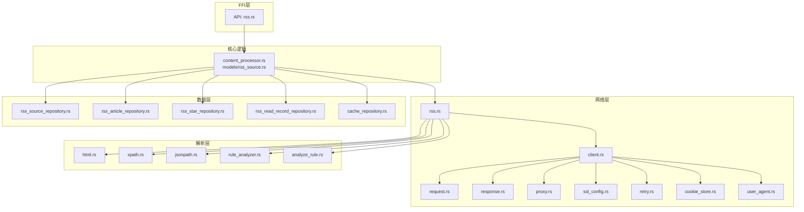
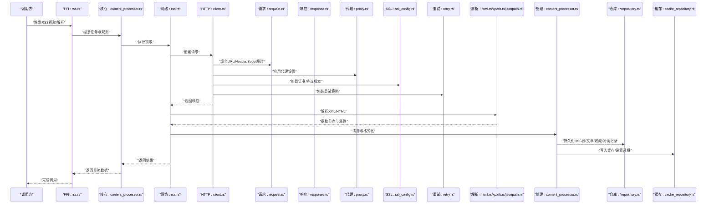
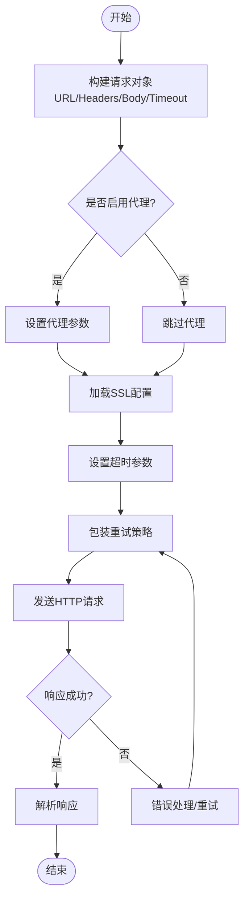
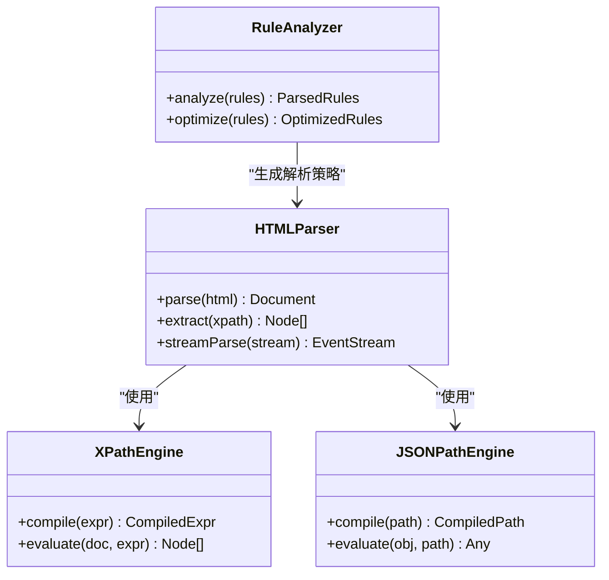
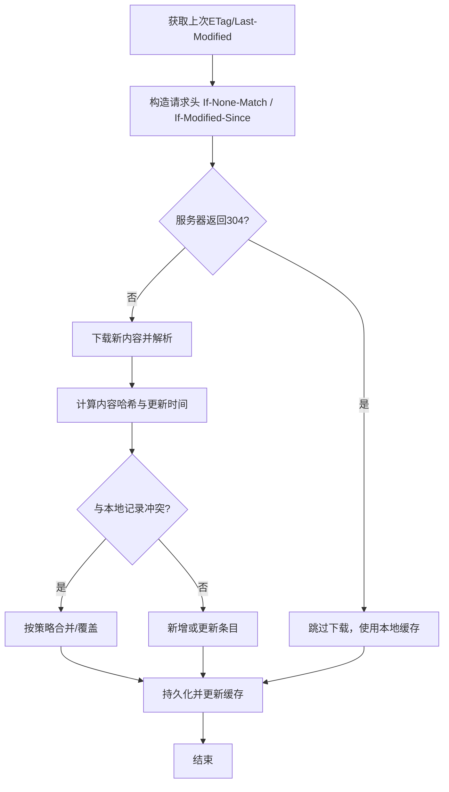
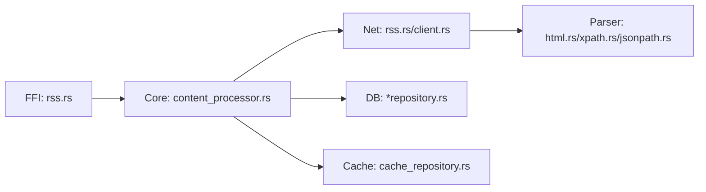

# 内容抓取与解析

<cite>
**本文引用的文件**   
- [rss.rs](file://rust/legado-net/src/rss.rs)
- [client.rs](file://rust/legado-net/src/client.rs)
- [request.rs](file://rust/legado-net/src/request.rs)
- [response.rs](file://rust/legado-net/src/response.rs)
- [proxy.rs](file://rust/legado-net/src/proxy.rs)
- [ssl_config.rs](file://rust/legado-net/src/ssl_config.rs)
- [retry.rs](file://rust/legado-net/src/retry.rs)
- [cookie_store.rs](file://rust/legado-net/src/cookie_store.rs)
- [user_agent.rs](file://rust/legado-net/src/user_agent.rs)
- [verification.rs](file://rust/legado-net/src/verification.rs)
- [rss_source_repository.rs](file://rust/legado-db/src/repository/rss_source_repository.rs)
- [rss_article_repository.rs](file://rust/legado-db/src/repository/rss_article_repository.rs)
- [rss_star_repository.rs](file://rust/legado-db/src/repository/rss_star_repository.rs)
- [rss_read_record_repository.rs](file://rust/legado-db/src/repository/rss_read_record_repository.rs)
- [rss.rs (ffi)](file://rust/legado-ffi/src/api/rss.rs)
- [rss_source.rs (model)](file://rust/legado-core/src/models/rss_source.rs)
- [content_processor.rs](file://rust/legado-core/src/content_processor.rs)
- [html.rs (parser)](file://rust/legado-parser/src/html.rs)
- [analyze_rule.rs](file://rust/legado-parser/src/analyze_rule.rs)
- [xpath.rs](file://rust/legado-parser/src/xpath.rs)
- [jsonpath.rs](file://rust/legado-parser/src/jsonpath.rs)
- [rule_analyzer.rs](file://rust/legado-parser/src/rule_analyzer.rs)
- [cache_api.rs](file://rust/legado-ffi/src/api/cache_api.rs)
- [cache_repository.rs](file://rust/legado-db/src/repository/cache_repository.rs)
</cite>

## 目录
1. [简介](#简介)
2. [项目结构](#项目结构)
3. [核心组件](#核心组件)
4. [架构总览](#架构总览)
5. [详细组件分析](#详细组件分析)
6. [依赖关系分析](#依赖关系分析)
7. [性能考量](#性能考量)
8. [故障排查指南](#故障排查指南)
9. [结论](#结论)
10. [附录](#附录)

## 简介
本文件围绕RSS内容的抓取与解析，系统性阐述网络请求构建、代理与SSL配置、超时与重试、XML/HTML解析算法、内容提取规则、数据清洗与处理、增量更新机制（ETag/Last-Modified）、缓存策略以及错误处理与重试等关键实现。文档面向不同技术背景的读者，提供从高层架构到代码级细节的渐进式说明，并辅以图示帮助理解。

## 项目结构
本项目采用多模块设计：
- Rust网络层（legado-net）：负责HTTP客户端、请求/响应封装、代理、SSL、Cookie、速率限制、重试、RSS抓取等。
- Rust解析层（legado-parser）：提供HTML/XPath/JSONPath/规则分析等解析能力。
- Rust核心逻辑（legado-core）：包含内容处理器、模型定义等。
- Rust数据库访问（legado-db）：提供RSS源、文章、收藏、阅读记录、缓存等仓库接口。
- FFI桥接（legado-ffi）：对外暴露API，供上层调用。

图表来源 
- [rss.rs (ffi)](file://rust/legado-ffi/src/api/rss.rs)
- [content_processor.rs](file://rust/legado-core/src/content_processor.rs)
- [rss_source.rs (model)](file://rust/legado-core/src/models/rss_source.rs)
- [rss.rs](file://rust/legado-net/src/rss.rs)
- [client.rs](file://rust/legado-net/src/client.rs)
- [request.rs](file://rust/legado-net/src/request.rs)
- [response.rs](file://rust/legado-net/src/response.rs)
- [proxy.rs](file://rust/legado-net/src/proxy.rs)
- [ssl_config.rs](file://rust/legado-net/src/ssl_config.rs)
- [retry.rs](file://rust/legado-net/src/retry.rs)
- [cookie_store.rs](file://rust/legado-net/src/cookie_store.rs)
- [user_agent.rs](file://rust/legado-net/src/user_agent.rs)
- [html.rs (parser)](file://rust/legado-parser/src/html.rs)
- [xpath.rs](file://rust/legado-parser/src/xpath.rs)
- [jsonpath.rs](file://rust/legado-parser/src/jsonpath.rs)
- [rule_analyzer.rs](file://rust/legado-parser/src/rule_analyzer.rs)
- [analyze_rule.rs](file://rust/legado-parser/src/analyze_rule.rs)
- [rss_source_repository.rs](file://rust/legado-db/src/repository/rss_source_repository.rs)
- [rss_article_repository.rs](file://rust/legado-db/src/repository/rss_article_repository.rs)
- [rss_star_repository.rs](file://rust/legado-db/src/repository/rss_star_repository.rs)
- [rss_read_record_repository.rs](file://rust/legado-db/src/repository/rss_read_record_repository.rs)
- [cache_repository.rs](file://rust/legado-db/src/repository/cache_repository.rs)

章节来源
- [rss.rs](file://rust/legado-net/src/rss.rs)
- [client.rs](file://rust/legado-net/src/client.rs)
- [request.rs](file://rust/legado-net/src/request.rs)
- [response.rs](file://rust/legado-net/src/response.rs)
- [proxy.rs](file://rust/legado-net/src/proxy.rs)
- [ssl_config.rs](file://rust/legado-net/src/ssl_config.rs)
- [retry.rs](file://rust/legado-net/src/retry.rs)
- [cookie_store.rs](file://rust/legado-net/src/cookie_store.rs)
- [user_agent.rs](file://rust/legado-net/src/user_agent.rs)
- [verification.rs](file://rust/legado-net/src/verification.rs)
- [rss_source_repository.rs](file://rust/legado-db/src/repository/rss_source_repository.rs)
- [rss_article_repository.rs](file://rust/legado-db/src/repository/rss_article_repository.rs)
- [rss_star_repository.rs](file://rust/legado-db/src/repository/rss_star_repository.rs)
- [rss_read_record_repository.rs](file://rust/legado-db/src/repository/rss_read_record_repository.rs)
- [rss.rs (ffi)](file://rust/legado-ffi/src/api/rss.rs)
- [rss_source.rs (model)](file://rust/legado-core/src/models/rss_source.rs)
- [content_processor.rs](file://rust/legado-core/src/content_processor.rs)
- [html.rs (parser)](file://rust/legado-parser/src/html.rs)
- [analyze_rule.rs](file://rust/legado-parser/src/analyze_rule.rs)
- [xpath.rs](file://rust/legado-parser/src/xpath.rs)
- [jsonpath.rs](file://rust/legado-parser/src/jsonpath.rs)
- [rule_analyzer.rs](file://rust/legado-parser/src/rule_analyzer.rs)
- [cache_api.rs](file://rust/legado-ffi/src/api/cache_api.rs)
- [cache_repository.rs](file://rust/legado-db/src/repository/cache_repository.rs)

## 核心组件
- 网络客户端与请求构建：统一封装HTTP请求参数（URL模板、Header、Body、方法、超时、重定向策略），支持代理、SSL自定义、User-Agent设置、Cookie持久化与校验。
- RSS抓取器：根据RSS源配置发起请求，获取Feed或列表页，进行增量判断（ETag/Last-Modified），下载并解析内容。
- 解析引擎：基于DOM/流式解析与XPath/JSONPath规则匹配，提取标题、作者、发布时间、正文、图片链接等字段。
- 内容处理器：对HTML进行格式化、图片下载与替换、链接规范化、编码转换、去噪与清洗。
- 数据仓库：RSS源、文章、收藏、阅读记录、缓存等持久化操作。
- FFI API：对外暴露RSS抓取、解析、存储等能力。

章节来源
- [client.rs](file://rust/legado-net/src/client.rs)
- [request.rs](file://rust/legado-net/src/request.rs)
- [response.rs](file://rust/legado-net/src/response.rs)
- [proxy.rs](file://rust/legado-net/src/proxy.rs)
- [ssl_config.rs](file://rust/legado-net/src/ssl_config.rs)
- [user_agent.rs](file://rust/legado-net/src/user_agent.rs)
- [cookie_store.rs](file://rust/legado-net/src/cookie_store.rs)
- [verification.rs](file://rust/legado-net/src/verification.rs)
- [rss.rs](file://rust/legado-net/src/rss.rs)
- [html.rs (parser)](file://rust/legado-parser/src/html.rs)
- [xpath.rs](file://rust/legado-parser/src/xpath.rs)
- [jsonpath.rs](file://rust/legado-parser/src/jsonpath.rs)
- [rule_analyzer.rs](file://rust/legado-parser/src/rule_analyzer.rs)
- [analyze_rule.rs](file://rust/legado-parser/src/analyze_rule.rs)
- [content_processor.rs](file://rust/legado-core/src/content_processor.rs)
- [rss_source_repository.rs](file://rust/legado-db/src/repository/rss_source_repository.rs)
- [rss_article_repository.rs](file://rust/legado-db/src/repository/rss_article_repository.rs)
- [rss_star_repository.rs](file://rust/legado-db/src/repository/rss_star_repository.rs)
- [rss_read_record_repository.rs](file://rust/legado-db/src/repository/rss_read_record_repository.rs)
- [cache_repository.rs](file://rust/legado-db/src/repository/cache_repository.rs)
- [rss.rs (ffi)](file://rust/legado-ffi/src/api/rss.rs)

## 架构总览
下图展示了从FFI调用到网络请求、解析、清洗、存储的完整流程，以及增量更新与缓存的交互。

图表来源 
- [rss.rs (ffi)](file://rust/legado-ffi/src/api/rss.rs)
- [content_processor.rs](file://rust/legado-core/src/content_processor.rs)
- [rss.rs](file://rust/legado-net/src/rss.rs)
- [client.rs](file://rust/legado-net/src/client.rs)
- [request.rs](file://rust/legado-net/src/request.rs)
- [response.rs](file://rust/legado-net/src/response.rs)
- [proxy.rs](file://rust/legado-net/src/proxy.rs)
- [ssl_config.rs](file://rust/legado-net/src/ssl_config.rs)
- [retry.rs](file://rust/legado-net/src/retry.rs)
- [html.rs (parser)](file://rust/legado-parser/src/html.rs)
- [xpath.rs](file://rust/legado-parser/src/xpath.rs)
- [jsonpath.rs](file://rust/legado-parser/src/jsonpath.rs)
- [rss_source_repository.rs](file://rust/legado-db/src/repository/rss_source_repository.rs)
- [rss_article_repository.rs](file://rust/legado-db/src/repository/rss_article_repository.rs)
- [rss_star_repository.rs](file://rust/legado-db/src/repository/rss_star_repository.rs)
- [rss_read_record_repository.rs](file://rust/legado-db/src/repository/rss_read_record_repository.rs)
- [cache_repository.rs](file://rust/legado-db/src/repository/cache_repository.rs)

## 详细组件分析

### 网络层实现（HTTP请求、代理、SSL、超时、重试）
- 请求构建：通过请求对象统一设置目标URL、HTTP方法、头部（含User-Agent、Accept、Referer等）、请求体、超时时间、重定向策略。
- 代理设置：支持HTTP/HTTPS/SOCKS代理，按域名或全局策略生效，可动态切换。
- SSL配置：自定义证书链、协议版本、加密套件，支持跳过验证（调试模式）与严格校验（生产模式）。
- 超时与重试：连接超时、读取超时、整体超时；指数退避重试，支持条件重试（如网络抖动、临时错误码）。
- Cookie与校验：持久化Cookie，自动携带与更新；可选验证码识别与登录态维持。

图表来源 
- [client.rs](file://rust/legado-net/src/client.rs)
- [request.rs](file://rust/legado-net/src/request.rs)
- [response.rs](file://rust/legado-net/src/response.rs)
- [proxy.rs](file://rust/legado-net/src/proxy.rs)
- [ssl_config.rs](file://rust/legado-net/src/ssl_config.rs)
- [retry.rs](file://rust/legado-net/src/retry.rs)
- [cookie_store.rs](file://rust/legado-net/src/cookie_store.rs)
- [user_agent.rs](file://rust/legado-net/src/user_agent.rs)
- [verification.rs](file://rust/legado-net/src/verification.rs)

章节来源
- [client.rs](file://rust/legado-net/src/client.rs)
- [request.rs](file://rust/legado-net/src/request.rs)
- [response.rs](file://rust/legado-net/src/response.rs)
- [proxy.rs](file://rust/legado-net/src/proxy.rs)
- [ssl_config.rs](file://rust/legado-net/src/ssl_config.rs)
- [retry.rs](file://rust/legado-net/src/retry.rs)
- [cookie_store.rs](file://rust/legado-net/src/cookie_store.rs)
- [user_agent.rs](file://rust/legado-net/src/user_agent.rs)
- [verification.rs](file://rust/legado-net/src/verification.rs)

### XML/HTML解析算法与内存优化
- DOM解析：将XML/HTML载入为文档树，便于XPath查询与节点遍历。适合中小规模文档。
- 流式解析：针对大文档使用事件驱动解析，降低内存占用，提升吞吐。
- 规则匹配：XPath表达式定位元素与属性；JSONPath用于JSON片段；规则分析器预编译与缓存常用路径。
- 内存优化：分块读取、按需解析、释放中间结构、避免重复拷贝。

图表来源 
- [html.rs (parser)](file://rust/legado-parser/src/html.rs)
- [xpath.rs](file://rust/legado-parser/src/xpath.rs)
- [jsonpath.rs](file://rust/legado-parser/src/jsonpath.rs)
- [rule_analyzer.rs](file://rust/legado-parser/src/rule_analyzer.rs)
- [analyze_rule.rs](file://rust/legado-parser/src/analyze_rule.rs)

章节来源
- [html.rs (parser)](file://rust/legado-parser/src/html.rs)
- [xpath.rs](file://rust/legado-parser/src/xpath.rs)
- [jsonpath.rs](file://rust/legado-parser/src/jsonpath.rs)
- [rule_analyzer.rs](file://rust/legado-parser/src/rule_analyzer.rs)
- [analyze_rule.rs](file://rust/legado-parser/src/analyze_rule.rs)

### 内容提取规则（标题、作者、发布时间、正文、图片）
- 标题：优先取feed条目title或页面h1/h2，回退至meta title。
- 作者：取author、creator、pubAuthor等字段，缺失时留空。
- 发布时间：解析ISO8601或常见日期格式，统一转换为标准时间戳。
- 正文：提取article/main/div[post]等容器，清理脚本与样式，保留必要标签。
- 图片：收集img src、data-src、background-image等，转为绝对URL，去重与过滤无效资源。

章节来源
- [rss.rs](file://rust/legado-net/src/rss.rs)
- [html.rs (parser)](file://rust/legado-parser/src/html.rs)
- [xpath.rs](file://rust/legado-parser/src/xpath.rs)
- [analyze_rule.rs](file://rust/legado-parser/src/analyze_rule.rs)

### 内容清洗与处理（HTML格式化、图片下载、链接替换、编码转换）
- HTML格式化：去除无用标签与属性，规范化缩进与换行，修复闭合标签。
- 图片下载：异步批量下载，本地缓存哈希命名，替换src为本地路径或CDN地址。
- 链接替换：相对路径转绝对路径，跟踪短链解析，替换防盗链域名。
- 编码转换：检测并统一UTF-8，处理BOM与乱码，兼容GB系列编码。

章节来源
- [content_processor.rs](file://rust/legado-core/src/content_processor.rs)
- [html.rs (parser)](file://rust/legado-parser/src/html.rs)

### 增量更新机制（ETag、Last-Modified、冲突解决）
- ETag：若服务端返回ETag，下次请求携带If-None-Match，未变更则直接返回304。
- Last-Modified：若存在Last-Modified，下次请求携带If-Modified-Since，未变更则304。
- 冲突解决：以唯一标识（如URL+版本号）合并新旧条目，保留最新修改时间与内容哈希，避免重复插入。

图表来源 
- [rss.rs](file://rust/legado-net/src/rss.rs)
- [response.rs](file://rust/legado-net/src/response.rs)
- [rss_article_repository.rs](file://rust/legado-db/src/repository/rss_article_repository.rs)

章节来源
- [rss.rs](file://rust/legado-net/src/rss.rs)
- [response.rs](file://rust/legado-net/src/response.rs)
- [rss_article_repository.rs](file://rust/legado-db/src/repository/rss_article_repository.rs)

### 内容缓存策略（本地存储、过期时间、空间管理）
- 缓存类型：文本内容、图片、解析中间结果。
- 过期策略：TTL（秒/分钟/小时），按资源大小与访问频率调整。
- 空间管理：LRU淘汰、容量上限、定期清理过期与低优先级资源。
- 一致性：缓存键包含URL、版本、ETag/Last-Modified，确保一致性。

章节来源
- [cache_repository.rs](file://rust/legado-db/src/repository/cache_repository.rs)
- [cache_api.rs](file://rust/legado-ffi/src/api/cache_api.rs)

### 解析错误的处理与重试机制
- 错误分类：网络错误（超时、DNS失败、SSL握手失败）、解析错误（XML/HTML畸形、XPath不匹配）、业务错误（权限不足、反爬拦截）。
- 重试策略：指数退避、最大重试次数、条件重试（仅对可恢复错误）。
- 降级策略：回退到备用源、使用缓存内容、提示用户检查网络与配置。

章节来源
- [retry.rs](file://rust/legado-net/src/retry.rs)
- [client.rs](file://rust/legado-net/src/client.rs)
- [verification.rs](file://rust/legado-net/src/verification.rs)

## 依赖关系分析
- 组件耦合：
  - FFI依赖核心逻辑，核心逻辑依赖网络层与解析层，数据层由核心逻辑调用。
  - 网络层内部模块高内聚：请求构建、代理、SSL、重试相互独立，通过客户端组合。
- 外部依赖：
  - HTTP库、TLS库、XML/HTML解析库、SQLite/Room（Android）或Rust SQLite。
- 潜在循环依赖：
  - 通过分层与接口隔离避免循环；解析层不反向依赖网络层。

图表来源 
- [rss.rs (ffi)](file://rust/legado-ffi/src/api/rss.rs)
- [content_processor.rs](file://rust/legado-core/src/content_processor.rs)
- [rss.rs](file://rust/legado-net/src/rss.rs)
- [client.rs](file://rust/legado-net/src/client.rs)
- [html.rs (parser)](file://rust/legado-parser/src/html.rs)
- [xpath.rs](file://rust/legado-parser/src/xpath.rs)
- [jsonpath.rs](file://rust/legado-parser/src/jsonpath.rs)
- [rss_source_repository.rs](file://rust/legado-db/src/repository/rss_source_repository.rs)
- [rss_article_repository.rs](file://rust/legado-db/src/repository/rss_article_repository.rs)
- [rss_star_repository.rs](file://rust/legado-db/src/repository/rss_star_repository.rs)
- [rss_read_record_repository.rs](file://rust/legado-db/src/repository/rss_read_record_repository.rs)
- [cache_repository.rs](file://rust/legado-db/src/repository/cache_repository.rs)

章节来源
- [rss.rs (ffi)](file://rust/legado-ffi/src/api/rss.rs)
- [content_processor.rs](file://rust/legado-core/src/content_processor.rs)
- [rss.rs](file://rust/legado-net/src/rss.rs)
- [client.rs](file://rust/legado-net/src/client.rs)
- [html.rs (parser)](file://rust/legado-parser/src/html.rs)
- [xpath.rs](file://rust/legado-parser/src/xpath.rs)
- [jsonpath.rs](file://rust/legado-parser/src/jsonpath.rs)
- [rss_source_repository.rs](file://rust/legado-db/src/repository/rss_source_repository.rs)
- [rss_article_repository.rs](file://rust/legado-db/src/repository/rss_article_repository.rs)
- [rss_star_repository.rs](file://rust/legado-db/src/repository/rss_star_repository.rs)
- [rss_read_record_repository.rs](file://rust/legado-db/src/repository/rss_read_record_repository.rs)
- [cache_repository.rs](file://rust/legado-db/src/repository/cache_repository.rs)

## 性能考量
- 网络层：
  - 连接池复用、Keep-Alive、并发限制与队列控制。
  - 压缩传输（gzip/brotli）与分块下载。
- 解析层：
  - 流式解析大文档，减少内存峰值。
  - XPath/JSONPath预编译与缓存，避免重复解析。
- 存储层：
  - 批量写入事务，减少IO开销。
  - 索引优化（URL、更新时间、唯一键）。
- 缓存层：
  - TTL与LRU结合，热点内容常驻内存。
  - 图片与媒体资源本地化与去重。

## 故障排查指南
- 网络问题：
  - 检查代理配置与SSL证书有效性。
  - 查看超时与重试日志，确认是否频繁触发。
- 解析问题：
  - 验证XPath/JSONPath表达式是否正确。
  - 检查HTML结构变化导致的匹配失败。
- 数据一致性问题：
  - 核对ETag/Last-Modified是否被正确传递与比较。
  - 检查冲突合并策略是否符合预期。
- 缓存问题：
  - 确认缓存键生成规则与过期策略。
  - 监控存储空间与淘汰行为。

章节来源
- [retry.rs](file://rust/legado-net/src/retry.rs)
- [client.rs](file://rust/legado-net/src/client.rs)
- [verification.rs](file://rust/legado-net/src/verification.rs)
- [html.rs (parser)](file://rust/legado-parser/src/html.rs)
- [xpath.rs](file://rust/legado-parser/src/xpath.rs)
- [jsonpath.rs](file://rust/legado-parser/src/jsonpath.rs)
- [rss.rs](file://rust/legado-net/src/rss.rs)
- [cache_repository.rs](file://rust/legado-db/src/repository/cache_repository.rs)

## 结论
本系统在网络层、解析层、核心逻辑与数据层之间形成了清晰的分层与职责划分，实现了高效的RSS抓取与解析能力。通过增量更新与缓存策略，显著降低了带宽与存储压力，提升了用户体验。未来可在解析规则可视化、智能反爬对抗、跨平台适配等方面持续优化。

## 附录
- 术语表：
  - ETag：实体标签，用于资源版本校验。
  - Last-Modified：最后修改时间，用于条件请求。
  - XPath：XML/HTML路径语言，用于节点选择。
  - JSONPath：JSON路径语言，用于数据提取。
- 最佳实践：
  - 合理设置超时与重试，避免雪崩效应。
  - 使用流式解析处理大文档，控制内存占用。
  - 缓存键设计需考虑版本与内容变化。
  - 增量更新优先使用ETag/Last-Modified，减少不必要下载。