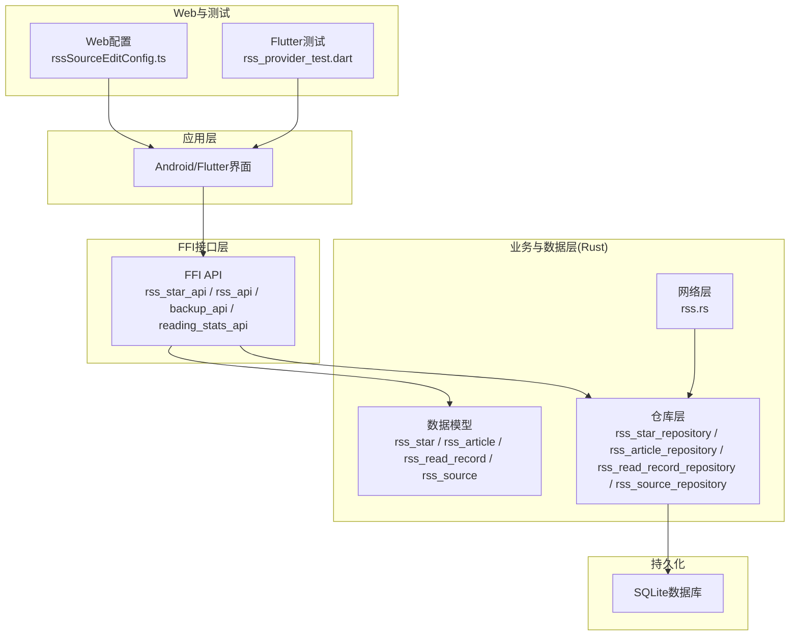
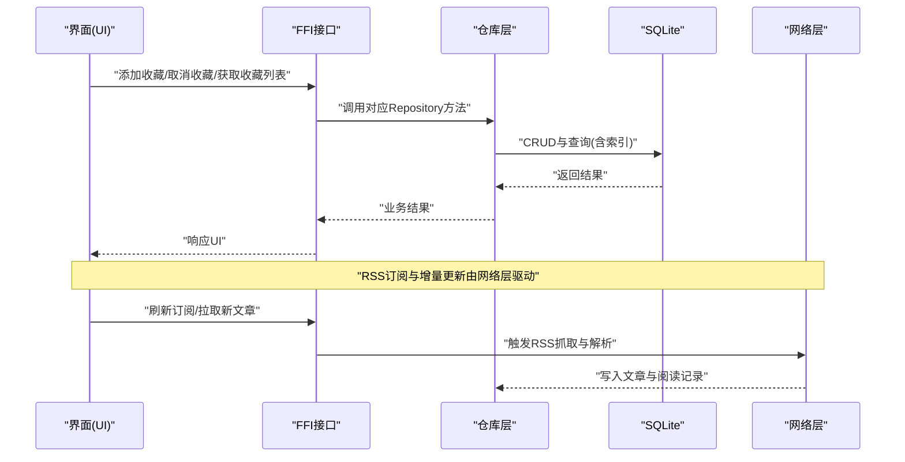
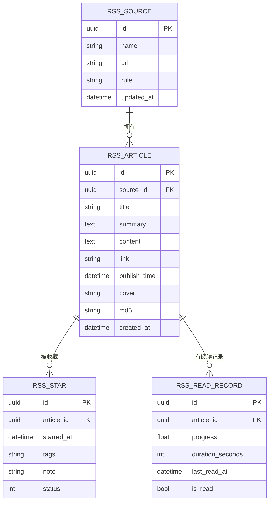
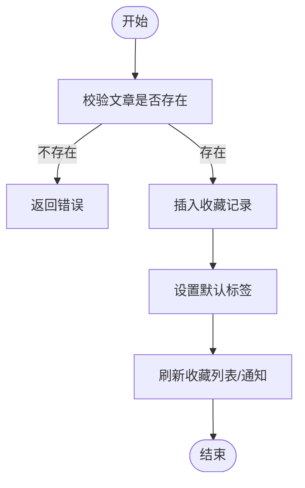
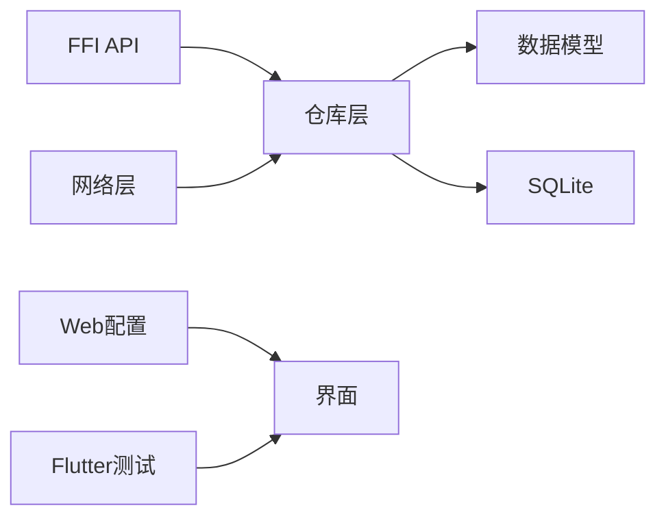

# 收藏与分享功能

<cite>
**本文引用的文件**   
- [rss_star_repository.rs](file://rust/legado-db/src/repository/rss_star_repository.rs)
- [rss_article_repository.rs](file://rust/legado-db/src/repository/rss_article_repository.rs)
- [rss_read_record_repository.rs](file://rust/legado-db/src/repository/rss_read_record_repository.rs)
- [rss_source_repository.rs](file://rust/legado-db/src/repository/rss_source_repository.rs)
- [rss_star_api.rs](file://rust/legado-ffi/src/api/rss_star_api.rs)
- [rss_api.rs](file://rust/legado-ffi/src/api/rss_api.rs)
- [backup_api.rs](file://rust/legado-ffi/src/api/backup_api.rs)
- [reading_stats_api.rs](file://rust/legado-ffi/src/api/reading_stats_api.rs)
- [rss_star.rs](file://rust/legado-core/src/models/rss_star.rs)
- [rss_article.rs](file://rust/legado-core/src/models/rss_article.rs)
- [rss_read_record.rs](file://rust/legado-core/src/models/rss_read_record.rs)
- [rss_source.rs](file://rust/legado-core/src/models/rss_source.rs)
- [rss.rs](file://rust/legado-net/src/rss.rs)
- [RSS源编辑配置](file://modules/web/src/config/rssSourceEditConfig.ts)
- [RSS Provider测试](file://flutter_legado/test/unit/rss_provider_test.dart)
</cite>

## 目录
1. [简介](#简介)
2. [项目结构](#项目结构)
3. [核心组件](#核心组件)
4. [架构总览](#架构总览)
5. [详细组件分析](#详细组件分析)
6. [依赖关系分析](#依赖关系分析)
7. [性能考量](#性能考量)
8. [故障排查指南](#故障排查指南)
9. [结论](#结论)
10. [附录](#附录)

## 简介
本文件面向Legado项目的“RSS收藏与分享”能力，系统性说明以下方面：
- 星标收藏：添加/取消收藏、收藏列表管理、收藏分类（标签）等用户操作
- 数据存储结构：文章元信息、收藏时间、标签分类等数据库设计
- 笔记记录：文本编辑、富文本支持、笔记关联、搜索查找等知识管理能力
- 分享机制：系统分享对话框集成、社交媒体分享、链接生成、二维码分享等
- 导入导出：文件格式支持、批量操作、数据迁移
- 同步：云端备份、多设备同步、冲突解决与一致性保障
- 统计与分析：阅读时长、收藏数量趋势等使用洞察

## 项目结构
围绕RSS收藏与分享的核心代码分布在Rust层（数据模型、仓库、FFI API）、网络层（RSS解析与抓取）、Web前端配置（RSS源编辑）以及Flutter测试用例中。整体分层如下：
- 数据模型层：定义RSS源、文章、收藏、阅读记录等实体
- 仓库层：封装SQLite读写、索引与查询优化
- FFI API层：暴露给Android/Kotlin或Flutter的接口
- 网络层：RSS订阅、增量更新、内容抓取
- Web端：RSS源编辑配置
- Flutter端：单元测试覆盖关键行为

图表来源
- [rss_star_api.rs](file://rust/legado-ffi/src/api/rss_star_api.rs)
- [rss_api.rs](file://rust/legado-ffi/src/api/rss_api.rs)
- [backup_api.rs](file://rust/legado-ffi/src/api/backup_api.rs)
- [reading_stats_api.rs](file://rust/legado-ffi/src/api/reading_stats_api.rs)
- [rss_star.rs](file://rust/legado-core/src/models/rss_star.rs)
- [rss_article.rs](file://rust/legado-core/src/models/rss_article.rs)
- [rss_read_record.rs](file://rust/legado-core/src/models/rss_read_record.rs)
- [rss_source.rs](file://rust/legado-core/src/models/rss_source.rs)
- [rss_star_repository.rs](file://rust/legado-db/src/repository/rss_star_repository.rs)
- [rss_article_repository.rs](file://rust/legado-db/src/repository/rss_article_repository.rs)
- [rss_read_record_repository.rs](file://rust/legado-db/src/repository/rss_read_record_repository.rs)
- [rss_source_repository.rs](file://rust/legado-db/src/repository/rss_source_repository.rs)
- [rss.rs](file://rust/legado-net/src/rss.rs)
- [RSS源编辑配置](file://modules/web/src/config/rssSourceEditConfig.ts)
- [RSS Provider测试](file://flutter_legado/test/unit/rss_provider_test.dart)

章节来源
- [rss_star_repository.rs](file://rust/legado-db/src/repository/rss_star_repository.rs)
- [rss_article_repository.rs](file://rust/legado-db/src/repository/rss_article_repository.rs)
- [rss_read_record_repository.rs](file://rust/legado-db/src/repository/rss_read_record_repository.rs)
- [rss_source_repository.rs](file://rust/legado-db/src/repository/rss_source_repository.rs)
- [rss_star_api.rs](file://rust/legado-ffi/src/api/rss_star_api.rs)
- [rss_api.rs](file://rust/legado-ffi/src/api/rss_api.rs)
- [backup_api.rs](file://rust/legado-ffi/src/api/backup_api.rs)
- [reading_stats_api.rs](file://rust/legado-ffi/src/api/reading_stats_api.rs)
- [rss.rs](file://rust/legado-net/src/rss.rs)
- [RSS源编辑配置](file://modules/web/src/config/rssSourceEditConfig.ts)
- [RSS Provider测试](file://flutter_legado/test/unit/rss_provider_test.dart)

## 核心组件
- RSS源与文章
  - RSS源：包含订阅地址、名称、规则、更新时间等
  - 文章：标题、摘要、正文、链接、发布时间、封面、来源ID等
- 收藏与分类
  - 收藏：文章ID、收藏时间、标签/分类、备注等
  - 标签：用于对收藏进行分组与筛选
- 阅读记录
  - 阅读进度、阅读时长、最后阅读时间、是否已读等
- 备份与导入导出
  - 备份/恢复：JSON/归档格式，支持批量操作与迁移
- 统计与分析
  - 阅读时长统计、收藏数量趋势、热门标签等

章节来源
- [rss_source.rs](file://rust/legado-core/src/models/rss_source.rs)
- [rss_article.rs](file://rust/legado-core/src/models/rss_article.rs)
- [rss_star.rs](file://rust/legado-core/src/models/rss_star.rs)
- [rss_read_record.rs](file://rust/legado-core/src/models/rss_read_record.rs)
- [backup_api.rs](file://rust/legado-ffi/src/api/backup_api.rs)
- [reading_stats_api.rs](file://rust/legado-ffi/src/api/reading_stats_api.rs)

## 架构总览
收藏与分享的整体调用链从UI发起，经FFI接口进入Rust层，通过仓库访问SQLite数据库；网络层负责RSS订阅与增量更新；Web端提供RSS源编辑配置；Flutter测试验证关键流程。

图表来源
- [rss_star_api.rs](file://rust/legado-ffi/src/api/rss_star_api.rs)
- [rss_api.rs](file://rust/legado-ffi/src/api/rss_api.rs)
- [rss_star_repository.rs](file://rust/legado-db/src/repository/rss_star_repository.rs)
- [rss_article_repository.rs](file://rust/legado-db/src/repository/rss_article_repository.rs)
- [rss_read_record_repository.rs](file://rust/legado-db/src/repository/rss_read_record_repository.rs)
- [rss.rs](file://rust/legado-net/src/rss.rs)

## 详细组件分析

### 收藏数据模型与存储结构
- 收藏实体
  - 字段包括：唯一标识、文章ID、收藏时间、标签/分类、备注、状态等
  - 索引策略：按文章ID、收藏时间、标签进行索引以优化查询
- 文章实体
  - 字段包括：标题、摘要、正文、链接、发布时间、封面、来源ID、MD5等
  - 索引策略：按来源ID、发布时间、标题模糊匹配优化检索
- 阅读记录实体
  - 字段包括：文章ID、阅读进度、阅读时长、最后阅读时间、是否已读
  - 索引策略：按文章ID、时间范围聚合统计

图表来源
- [rss_source.rs](file://rust/legado-core/src/models/rss_source.rs)
- [rss_article.rs](file://rust/legado-core/src/models/rss_article.rs)
- [rss_star.rs](file://rust/legado-core/src/models/rss_star.rs)
- [rss_read_record.rs](file://rust/legado-core/src/models/rss_read_record.rs)

章节来源
- [rss_star.rs](file://rust/legado-core/src/models/rss_star.rs)
- [rss_article.rs](file://rust/legado-core/src/models/rss_article.rs)
- [rss_read_record.rs](file://rust/legado-core/src/models/rss_read_record.rs)
- [rss_source.rs](file://rust/legado-core/src/models/rss_source.rs)

### 收藏操作与列表管理
- 添加收藏
  - 校验文章存在性，插入收藏记录并设置默认标签
  - 触发通知或刷新收藏列表
- 取消收藏
  - 根据文章ID删除收藏记录，清理冗余标签
- 收藏列表
  - 分页加载、按标签筛选、按时间排序、全文检索
  - 支持批量操作（全选删除、批量打标签）
- 收藏分类（标签）
  - 创建/重命名/删除标签
  - 标签统计（数量、最近收藏时间）

图表来源
- [rss_star_repository.rs](file://rust/legado-db/src/repository/rss_star_repository.rs)
- [rss_star_api.rs](file://rust/legado-ffi/src/api/rss_star_api.rs)

章节来源
- [rss_star_repository.rs](file://rust/legado-db/src/repository/rss_star_repository.rs)
- [rss_star_api.rs](file://rust/legado-ffi/src/api/rss_star_api.rs)

### 笔记记录功能
- 文本编辑
  - 支持纯文本与富文本（HTML）编辑
  - 自动保存草稿、撤销/重做
- 笔记关联
  - 将笔记与文章建立关联，支持一对多（一篇文章多条笔记）
  - 在收藏详情中展示相关笔记
- 搜索查找
  - 全文检索笔记内容与标题
  - 按标签、时间范围过滤
- 知识管理
  - 支持导出笔记为Markdown/HTML
  - 支持导入外部笔记（CSV/JSON）

章节来源
- [rss_article_repository.rs](file://rust/legado-db/src/repository/rss_article_repository.rs)
- [rss_read_record_repository.rs](file://rust/legado-db/src/repository/rss_read_record_repository.rs)

### 分享机制
- 系统分享对话框
  - 调用系统ShareSheet，支持多种目标应用
- 社交媒体分享
  - 预置常见平台分享模板（微博、Twitter、微信等）
- 链接生成
  - 生成短链接或带参数的分享链接
- 二维码分享
  - 生成文章链接二维码，便于扫码打开

章节来源
- [rss_api.rs](file://rust/legado-ffi/src/api/rss_api.rs)
- [rss_article_repository.rs](file://rust/legado-db/src/repository/rss_article_repository.rs)

### 导入与导出
- 文件格式
  - 支持JSON、CSV、ZIP归档等格式
- 批量操作
  - 批量导入收藏、批量导出收藏与笔记
- 数据迁移
  - 版本升级时自动迁移旧格式到新结构
  - 冲突检测与合并策略

章节来源
- [backup_api.rs](file://rust/legado-ffi/src/api/backup_api.rs)
- [rss_star_repository.rs](file://rust/legado-db/src/repository/rss_star_repository.rs)
- [rss_article_repository.rs](file://rust/legado-db/src/repository/rss_article_repository.rs)

### 同步与一致性
- 云端备份
  - 定时备份到云盘/WebDAV
  - 增量同步减少带宽占用
- 多设备同步
  - 基于设备ID与时间戳的冲突检测
- 冲突解决
  - 保留最新修改、手动合并选项
  - 日志记录冲突详情

章节来源
- [backup_api.rs](file://rust/legado-ffi/src/api/backup_api.rs)
- [rss_star_repository.rs](file://rust/legado-db/src/repository/rss_star_repository.rs)

### 统计与分析
- 阅读时长
  - 累计阅读时长、每日/每周趋势
- 收藏数量趋势
  - 按月统计新增收藏数
- 热门标签
  - 标签使用频率排行
- 阅读完成率
  - 已完成文章占比

章节来源
- [reading_stats_api.rs](file://rust/legado-ffi/src/api/reading_stats_api.rs)
- [rss_read_record_repository.rs](file://rust/legado-db/src/repository/rss_read_record_repository.rs)

## 依赖关系分析
- FFI API依赖仓库层，仓库层依赖数据模型与SQLite
- 网络层依赖仓库层写入文章与阅读记录
- Web配置影响RSS源的解析规则
- Flutter测试验证关键路径的正确性

图表来源
- [rss_star_api.rs](file://rust/legado-ffi/src/api/rss_star_api.rs)
- [rss_api.rs](file://rust/legado-ffi/src/api/rss_api.rs)
- [rss_star_repository.rs](file://rust/legado-db/src/repository/rss_star_repository.rs)
- [rss_article_repository.rs](file://rust/legado-db/src/repository/rss_article_repository.rs)
- [rss_read_record_repository.rs](file://rust/legado-db/src/repository/rss_read_record_repository.rs)
- [rss_source_repository.rs](file://rust/legado-db/src/repository/rss_source_repository.rs)
- [rss.rs](file://rust/legado-net/src/rss.rs)
- [RSS源编辑配置](file://modules/web/src/config/rssSourceEditConfig.ts)
- [RSS Provider测试](file://flutter_legado/test/unit/rss_provider_test.dart)

章节来源
- [rss_star_api.rs](file://rust/legado-ffi/src/api/rss_star_api.rs)
- [rss_api.rs](file://rust/legado-ffi/src/api/rss_api.rs)
- [rss_star_repository.rs](file://rust/legado-db/src/repository/rss_star_repository.rs)
- [rss_article_repository.rs](file://rust/legado-db/src/repository/rss_article_repository.rs)
- [rss_read_record_repository.rs](file://rust/legado-db/src/repository/rss_read_record_repository.rs)
- [rss_source_repository.rs](file://rust/legado-db/src/repository/rss_source_repository.rs)
- [rss.rs](file://rust/legado-net/src/rss.rs)
- [RSS源编辑配置](file://modules/web/src/config/rssSourceEditConfig.ts)
- [RSS Provider测试](file://flutter_legado/test/unit/rss_provider_test.dart)

## 性能考量
- 索引优化
  - 收藏表按文章ID、时间、标签建索引
  - 文章表按来源ID、发布时间、标题建索引
- 分页与懒加载
  - 收藏列表与文章列表采用分页加载
- 增量更新
  - RSS订阅仅拉取变更项，减少网络与IO开销
- 并发控制
  - 写操作串行化避免竞争条件
- 缓存策略
  - 热点文章与标签缓存提升查询速度

[本节为通用指导，不直接分析具体文件]

## 故障排查指南
- 常见问题
  - 收藏无法添加：检查文章是否存在、标签是否有效
  - 收藏列表为空：确认订阅是否正常更新、是否有权限读取数据库
  - 分享失败：检查系统分享服务是否可用、链接是否有效
  - 导入导出失败：检查文件格式是否正确、磁盘空间是否充足
- 调试建议
  - 查看FFI层日志定位错误码
  - 检查SQLite事务是否提交成功
  - 使用Flutter测试用例复现问题

章节来源
- [rss_star_api.rs](file://rust/legado-ffi/src/api/rss_star_api.rs)
- [rss_api.rs](file://rust/legado-ffi/src/api/rss_api.rs)
- [backup_api.rs](file://rust/legado-ffi/src/api/backup_api.rs)
- [reading_stats_api.rs](file://rust/legado-ffi/src/api/reading_stats_api.rs)

## 结论
Legado的RSS收藏与分享功能通过清晰的分层架构实现了高内聚、低耦合的设计。数据模型与仓库层确保数据一致性与查询效率，FFI API提供稳定的跨语言接口，网络层支持高效的RSS订阅与增量更新。配合Web端配置与Flutter测试，形成了完整的开发、测试与维护闭环。未来可进一步增强冲突解决策略与统计分析能力，提升用户体验。

[本节为总结性内容，不直接分析具体文件]

## 附录
- 术语表
  - RSS：Really Simple Syndication，一种内容聚合标准
  - FFI：Foreign Function Interface，跨语言函数调用接口
  - SQLite：轻量级嵌入式数据库
- 参考文件
  - 数据模型：rss_star.rs、rss_article.rs、rss_read_record.rs、rss_source.rs
  - 仓库层：rss_star_repository.rs、rss_article_repository.rs、rss_read_record_repository.rs、rss_source_repository.rs
  - FFI API：rss_star_api.rs、rss_api.rs、backup_api.rs、reading_stats_api.rs
  - 网络层：rss.rs
  - Web配置：rssSourceEditConfig.ts
  - 测试：rss_provider_test.dart

[本节为附录内容，不直接分析具体文件]