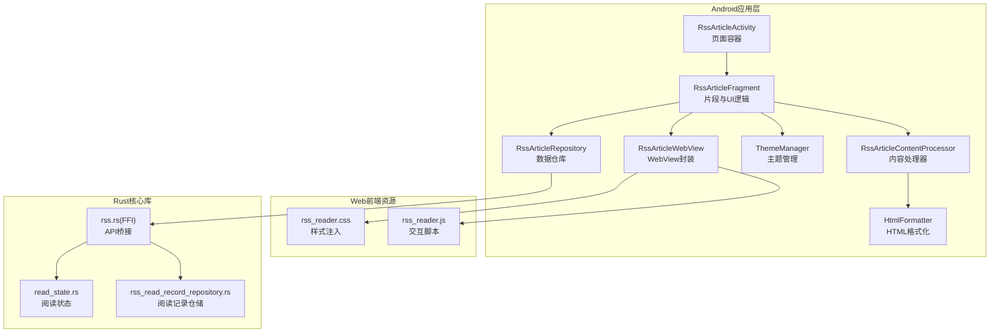
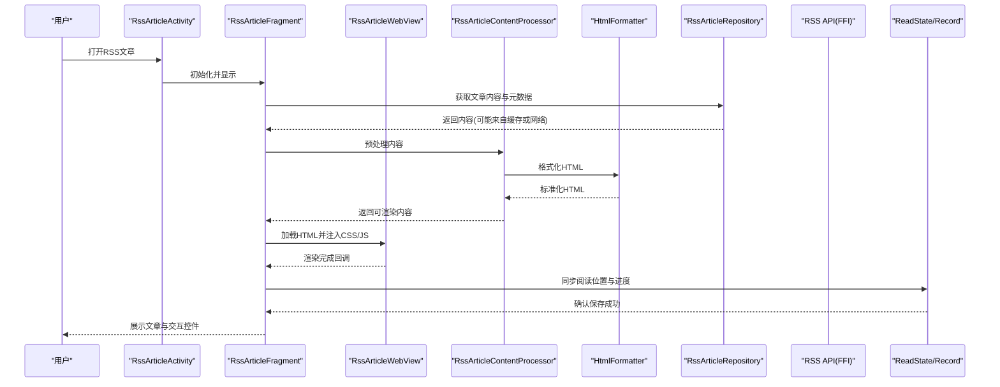
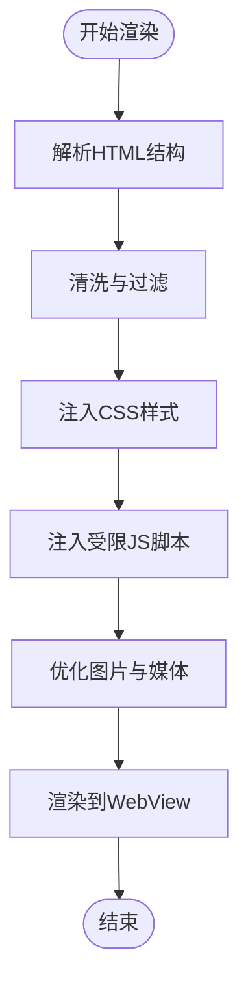
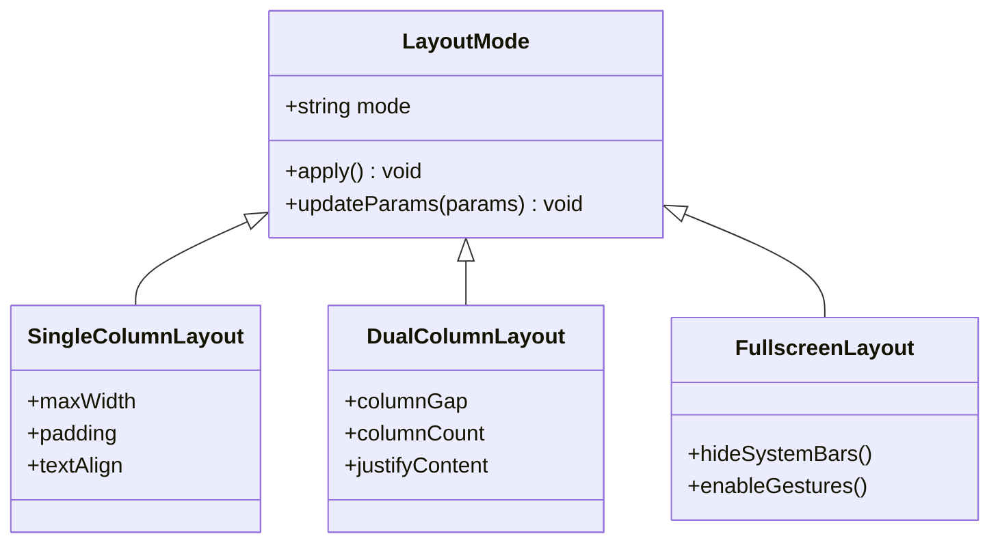
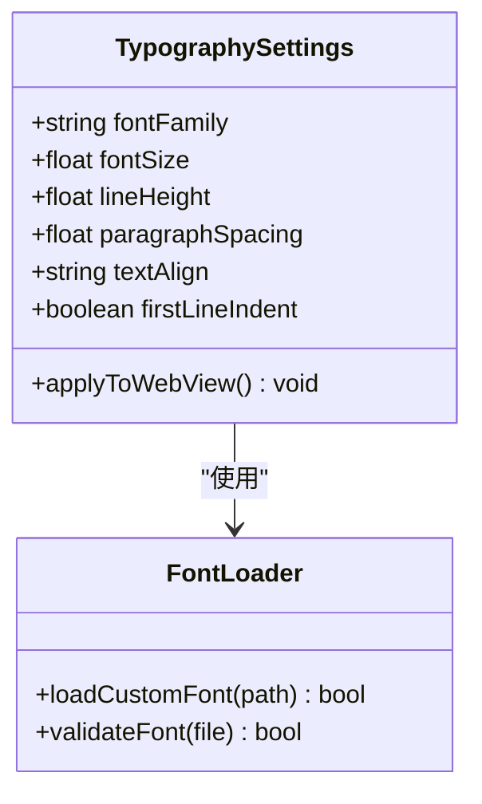
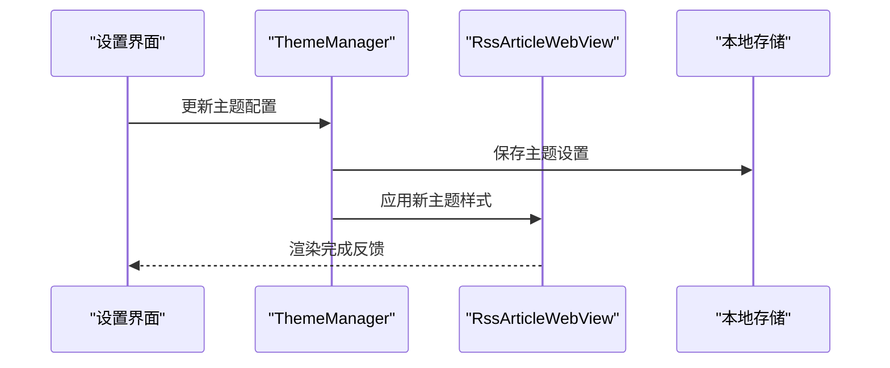
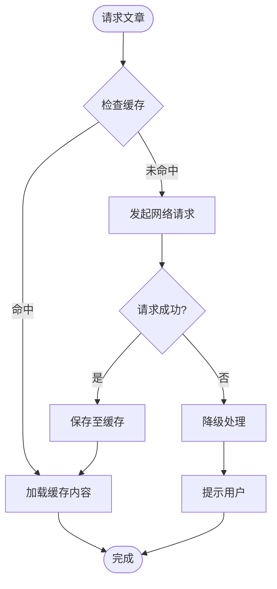
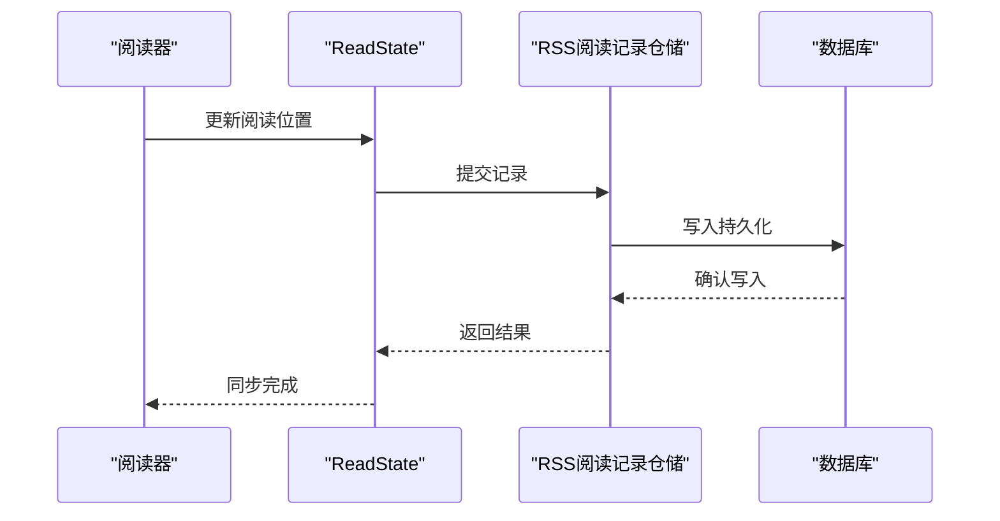
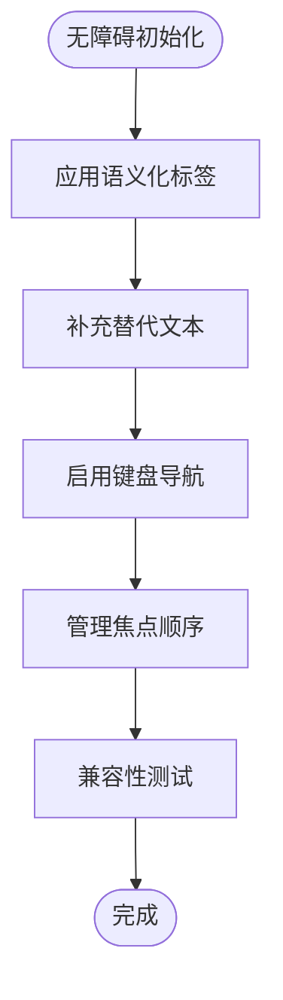
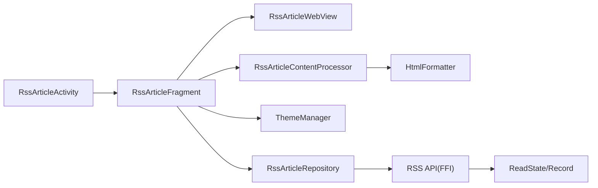

# 文章阅读体验

<cite>
**本文档引用的文件**
- [app/src/main/java/io/legado/app/ui/rss/RssArticleActivity.kt](file://app/src/main/java/io/legado/app/ui/rss/RssArticleActivity.kt)
- [app/src/main/java/io/legado/app/ui/rss/RssArticleFragment.kt](file://app/src/main/java/io/legado/app/ui/rss/RssArticleFragment.kt)
- [app/src/main/java/io/legado/app/ui/rss/RssArticleWebView.kt](file://app/src/main/java/io/legado/app/ui/rss/RssArticleWebView.kt)
- [app/src/main/java/io/legado/app/help/RssArticleContentProcessor.kt](file://app/src/main/java/io/legado/app/help/RssArticleContentProcessor.kt)
- [app/src/main/java/io/legado/app/model/rss/RssArticleRepository.kt](file://app/src/main/java/io/legado/app/model/rss/RssArticleRepository.kt)
- [app/src/main/java/io/legado/app/utils/HtmlFormatter.kt](file://app/src/main/java/io/legado/app/utils/HtmlFormatter.kt)
- [app/src/main/java/io/legado/app/ui/theme/ThemeManager.kt](file://app/src/main/java/io/legado/app/ui/theme/ThemeManager.kt)
- [app/src/main/java/io/legado/app/data/entity/RssArticleEntity.kt](file://app/src/main/java/io/legado/app/data/entity/RssArticleEntity.kt)
- [app/src/main/res/layout/activity_rss_article.xml](file://app/src/main/res/layout/activity_rss_article.xml)
- [app/src/main/res/layout/fragment_rss_article.xml](file://app/src/main/res/layout/fragment_rss_article.xml)
- [app/src/main/assets/web/css/rss_reader.css](file://app/src/main/assets/web/css/rss_reader.css)
- [app/src/main/assets/web/js/rss_reader.js](file://app/src/main/assets/web/js/rss_reader.js)
- [modules/web/src/components/ReadSettings.vue](file://modules/web/src/components/ReadSettings.vue)
- [rust/legado-core/src/read_state.rs](file://rust/legado-core/src/read_state.rs)
- [rust/legado-db/src/repository/rss_read_record_repository.rs](file://rust/legado-db/src/repository/rss_read_record_repository.rs)
- [rust/legado-ffi/src/api/rss.rs](file://rust/legado-ffi/src/api/rss.rs)
</cite>

## 目录
1. [简介](#简介)
2. [项目结构](#项目结构)
3. [核心组件](#核心组件)
4. [架构总览](#架构总览)
5. [详细组件分析](#详细组件分析)
6. [依赖关系分析](#依赖关系分析)
7. [性能考虑](#性能考虑)
8. [故障排查指南](#故障排查指南)
9. [结论](#结论)
10. [附录](#附录)（如有需要）

## 简介
本文件围绕RSS文章阅读体验进行系统化说明，涵盖文章内容渲染引擎、界面布局模式、字体与排版设置、主题系统、离线阅读支持、阅读进度保存与恢复以及无障碍访问等关键方面。文档面向不同技术背景的读者，既提供高层概览，也深入到具体实现细节，帮助理解Legado在RSS阅读方面的设计与落地。

## 项目结构
RSS阅读相关代码主要分布在Android应用层、Web前端资源与Rust核心库三部分：
- Android应用层负责页面容器、WebView集成、内容处理、主题与配置管理、数据持久化接口调用等。
- Web前端资源提供阅读器样式与脚本，用于HTML解析后的样式注入与交互增强。
- Rust核心库提供读取状态、阅读记录、缓存与网络请求等底层能力，并通过FFI暴露给上层。

**图表来源**
- [app/src/main/java/io/legado/app/ui/rss/RssArticleActivity.kt](file://app/src/main/java/io/legado/app/ui/rss/RssArticleActivity.kt)
- [app/src/main/java/io/legado/app/ui/rss/RssArticleFragment.kt](file://app/src/main/java/io/legado/app/ui/rss/RssArticleFragment.kt)
- [app/src/main/java/io/legado/app/ui/rss/RssArticleWebView.kt](file://app/src/main/java/io/legado/app/ui/rss/RssArticleWebView.kt)
- [app/src/main/java/io/legado/app/help/RssArticleContentProcessor.kt](file://app/src/main/java/io/legado/app/help/RssArticleContentProcessor.kt)
- [app/src/main/java/io/legado/app/utils/HtmlFormatter.kt](file://app/src/main/java/io/legado/app/utils/HtmlFormatter.kt)
- [app/src/main/java/io/legado/app/ui/theme/ThemeManager.kt](file://app/src/main/java/io/legado/app/ui/theme/ThemeManager.kt)
- [app/src/main/java/io/legado/app/model/rss/RssArticleRepository.kt](file://app/src/main/java/io/legado/app/model/rss/RssArticleRepository.kt)
- [app/src/main/assets/web/css/rss_reader.css](file://app/src/main/assets/web/css/rss_reader.css)
- [app/src/main/assets/web/js/rss_reader.js](file://app/src/main/assets/web/js/rss_reader.js)
- [rust/legado-core/src/read_state.rs](file://rust/legado-core/src/read_state.rs)
- [rust/legado-db/src/repository/rss_read_record_repository.rs](file://rust/legado-db/src/repository/rss_read_record_repository.rs)
- [rust/legado-ffi/src/api/rss.rs](file://rust/legado-ffi/src/api/rss.rs)

**章节来源**
- [app/src/main/java/io/legado/app/ui/rss/RssArticleActivity.kt](file://app/src/main/java/io/legado/app/ui/rss/RssArticleActivity.kt)
- [app/src/main/java/io/legado/app/ui/rss/RssArticleFragment.kt](file://app/src/main/java/io/legado/app/ui/rss/RssArticleFragment.kt)
- [app/src/main/java/io/legado/app/ui/rss/RssArticleWebView.kt](file://app/src/main/java/io/legado/app/ui/rss/RssArticleWebView.kt)
- [app/src/main/java/io/legado/app/help/RssArticleContentProcessor.kt](file://app/src/main/java/io/legado/app/help/RssArticleContentProcessor.kt)
- [app/src/main/java/io/legado/app/utils/HtmlFormatter.kt](file://app/src/main/java/io/legado/app/utils/HtmlFormatter.kt)
- [app/src/main/java/io/legado/app/ui/theme/ThemeManager.kt](file://app/src/main/java/io/legado/app/ui/theme/ThemeManager.kt)
- [app/src/main/java/io/legado/app/model/rss/RssArticleRepository.kt](file://app/src/main/java/io/legado/app/model/rss/RssArticleRepository.kt)
- [app/src/main/assets/web/css/rss_reader.css](file://app/src/main/assets/web/css/rss_reader.css)
- [app/src/main/assets/web/js/rss_reader.js](file://app/src/main/assets/web/js/rss_reader.js)
- [rust/legado-core/src/read_state.rs](file://rust/legado-core/src/read_state.rs)
- [rust/legado-db/src/repository/rss_read_record_repository.rs](file://rust/legado-db/src/repository/rss_read_record_repository.rs)
- [rust/legado-ffi/src/api/rss.rs](file://rust/legado-ffi/src/api/rss.rs)

## 核心组件
- RssArticleActivity：作为RSS文章页面的入口，负责生命周期管理与导航控制。
- RssArticleFragment：承载文章阅读界面的UI逻辑，包括布局切换、设置面板、进度同步等。
- RssArticleWebView：对WebView的封装，负责加载HTML内容、注入CSS/JS、执行安全限制与事件桥接。
- RssArticleContentProcessor：对原始内容进行清洗、转换与增强，确保在不同设备上的可读性。
- HtmlFormatter：统一HTML输出格式，处理图片、链接、表格等元素的标准化。
- ThemeManager：管理明暗主题、自定义颜色方案与背景设置，并实时应用到WebView。
- RssArticleRepository：数据仓库，负责RSS文章的增删改查、缓存与同步状态管理。
- ReadState与RSS阅读记录仓储：持久化阅读位置、书签与历史，保证跨会话恢复。
- Web前端资源（css/js）：为阅读器提供样式与交互增强，如字体选择、行间距调整、全屏切换等。

**章节来源**
- [app/src/main/java/io/legado/app/ui/rss/RssArticleActivity.kt](file://app/src/main/java/io/legado/app/ui/rss/RssArticleActivity.kt)
- [app/src/main/java/io/legado/app/ui/rss/RssArticleFragment.kt](file://app/src/main/java/io/legado/app/ui/rss/RssArticleFragment.kt)
- [app/src/main/java/io/legado/app/ui/rss/RssArticleWebView.kt](file://app/src/main/java/io/legado/app/ui/rss/RssArticleWebView.kt)
- [app/src/main/java/io/legado/app/help/RssArticleContentProcessor.kt](file://app/src/main/java/io/legado/app/help/RssArticleContentProcessor.kt)
- [app/src/main/java/io/legado/app/utils/HtmlFormatter.kt](file://app/src/main/java/io/legado/app/utils/HtmlFormatter.kt)
- [app/src/main/java/io/legado/app/ui/theme/ThemeManager.kt](file://app/src/main/java/io/legado/app/ui/theme/ThemeManager.kt)
- [app/src/main/java/io/legado/app/model/rss/RssArticleRepository.kt](file://app/src/main/java/io/legado/app/model/rss/RssArticleRepository.kt)
- [rust/legado-core/src/read_state.rs](file://rust/legado-core/src/read_state.rs)
- [rust/legado-db/src/repository/rss_read_record_repository.rs](file://rust/legado-db/src/repository/rss_read_record_repository.rs)
- [app/src/main/assets/web/css/rss_reader.css](file://app/src/main/assets/web/css/rss_reader.css)
- [app/src/main/assets/web/js/rss_reader.js](file://app/src/main/assets/web/js/rss_reader.js)

## 架构总览
整体架构采用分层设计：Android层负责UI与业务编排，Web资源提供渲染增强，Rust核心库提供稳定高效的底层能力。通过FFI将读写状态、记录与缓存等能力暴露给上层，形成清晰的数据流与控制流。

**图表来源**
- [app/src/main/java/io/legado/app/ui/rss/RssArticleActivity.kt](file://app/src/main/java/io/legado/app/ui/rss/RssArticleActivity.kt)
- [app/src/main/java/io/legado/app/ui/rss/RssArticleFragment.kt](file://app/src/main/java/io/legado/app/ui/rss/RssArticleFragment.kt)
- [app/src/main/java/io/legado/app/ui/rss/RssArticleWebView.kt](file://app/src/main/java/io/legado/app/ui/rss/RssArticleWebView.kt)
- [app/src/main/java/io/legado/app/help/RssArticleContentProcessor.kt](file://app/src/main/java/io/legado/app/help/RssArticleContentProcessor.kt)
- [app/src/main/java/io/legado/app/utils/HtmlFormatter.kt](file://app/src/main/java/io/legado/app/utils/HtmlFormatter.kt)
- [app/src/main/java/io/legado/app/model/rss/RssArticleRepository.kt](file://app/src/main/java/io/legado/app/model/rss/RssArticleRepository.kt)
- [rust/legado-ffi/src/api/rss.rs](file://rust/legado-ffi/src/api/rss.rs)
- [rust/legado-core/src/read_state.rs](file://rust/legado-core/src/read_state.rs)
- [rust/legado-db/src/repository/rss_read_record_repository.rs](file://rust/legado-db/src/repository/rss_read_record_repository.rs)

## 详细组件分析

### 文章内容渲染引擎
- HTML解析与清洗：通过内容处理器对原始HTML进行结构化清洗，去除无关脚本与样式，保留核心文本与媒体元素。
- CSS样式应用：注入统一的阅读器样式，覆盖默认样式，确保一致的阅读体验；支持动态主题切换与自定义颜色。
- JavaScript执行限制：启用沙箱模式，仅允许必要的交互脚本运行，禁用危险API，防止恶意行为影响阅读稳定性。
- 图片与媒体优化：自动适配图片尺寸，启用懒加载与预加载策略，减少首屏加载时间。

**图表来源**
- [app/src/main/java/io/legado/app/help/RssArticleContentProcessor.kt](file://app/src/main/java/io/legado/app/help/RssArticleContentProcessor.kt)
- [app/src/main/java/io/legado/app/utils/HtmlFormatter.kt](file://app/src/main/java/io/legado/app/utils/HtmlFormatter.kt)
- [app/src/main/assets/web/css/rss_reader.css](file://app/src/main/assets/web/css/rss_reader.css)
- [app/src/main/assets/web/js/rss_reader.js](file://app/src/main/assets/web/js/rss_reader.js)

**章节来源**
- [app/src/main/java/io/legado/app/help/RssArticleContentProcessor.kt](file://app/src/main/java/io/legado/app/help/RssArticleContentProcessor.kt)
- [app/src/main/java/io/legado/app/utils/HtmlFormatter.kt](file://app/src/main/java/io/legado/app/utils/HtmlFormatter.kt)
- [app/src/main/assets/web/css/rss_reader.css](file://app/src/main/assets/web/css/rss_reader.css)
- [app/src/main/assets/web/js/rss_reader.js](file://app/src/main/assets/web/js/rss_reader.js)

### 阅读界面布局
- 单栏模式：适合手机竖屏阅读，最大化文本区域，减少干扰。
- 双栏模式：适合平板或横屏场景，提升信息密度与对比阅读体验。
- 全屏模式：隐藏系统栏与部分UI，沉浸阅读，支持手势翻页与快捷菜单。
- 布局切换：通过设置面板或手势触发，实时更新布局参数并持久化。

**图表来源**
- [app/src/main/res/layout/activity_rss_article.xml](file://app/src/main/res/layout/activity_rss_article.xml)
- [app/src/main/res/layout/fragment_rss_article.xml](file://app/src/main/res/layout/fragment_rss_article.xml)

**章节来源**
- [app/src/main/res/layout/activity_rss_article.xml](file://app/src/main/res/layout/activity_rss_article.xml)
- [app/src/main/res/layout/fragment_rss_article.xml](file://app/src/main/res/layout/fragment_rss_article.xml)

### 字体与排版设置
- 字体选择：支持系统字体与自定义字体文件，提供预览与即时生效。
- 字号调整：按百分比或固定值调整，保持比例一致性。
- 行间距与段落间距：独立调节，提升长文阅读舒适度。
- 对齐与缩进：支持左对齐、两端对齐与首行缩进，满足不同排版需求。

**图表来源**
- [modules/web/src/components/ReadSettings.vue](file://modules/web/src/components/ReadSettings.vue)
- [app/src/main/assets/web/css/rss_reader.css](file://app/src/main/assets/web/css/rss_reader.css)

**章节来源**
- [modules/web/src/components/ReadSettings.vue](file://modules/web/src/components/ReadSettings.vue)
- [app/src/main/assets/web/css/rss_reader.css](file://app/src/main/assets/web/css/rss_reader.css)

### 主题系统
- 明暗主题切换：根据系统或用户偏好自动切换，提供平滑过渡动画。
- 自定义颜色方案：支持主色、背景色、文字色与链接色的自定义，实时预览。
- 背景设置：纯色、渐变或图片背景，支持透明度与模糊效果。
- 主题持久化：设置项保存到本地，重启后恢复。

**图表来源**
- [app/src/main/java/io/legado/app/ui/theme/ThemeManager.kt](file://app/src/main/java/io/legado/app/ui/theme/ThemeManager.kt)
- [app/src/main/assets/web/css/rss_reader.css](file://app/src/main/assets/web/css/rss_reader.css)

**章节来源**
- [app/src/main/java/io/legado/app/ui/theme/ThemeManager.kt](file://app/src/main/java/io/legado/app/ui/theme/ThemeManager.kt)
- [app/src/main/assets/web/css/rss_reader.css](file://app/src/main/assets/web/css/rss_reader.css)

### 离线阅读支持
- 内容缓存：优先从本地缓存加载，失败时回退到网络请求，支持TTL与容量控制。
- 图片预加载：根据滚动预测预加载后续图片，提升流畅度。
- 同步状态管理：记录下载进度与完整性校验，支持断点续传与冲突解决。
- 离线可用性：无网络时仍可阅读已缓存内容，并提供刷新提示。

**图表来源**
- [app/src/main/java/io/legado/app/model/rss/RssArticleRepository.kt](file://app/src/main/java/io/legado/app/model/rss/RssArticleRepository.kt)
- [app/src/main/assets/web/js/rss_reader.js](file://app/src/main/assets/web/js/rss_reader.js)

**章节来源**
- [app/src/main/java/io/legado/app/model/rss/RssArticleRepository.kt](file://app/src/main/java/io/legado/app/model/rss/RssArticleRepository.kt)
- [app/src/main/assets/web/js/rss_reader.js](file://app/src/main/assets/web/js/rss_reader.js)

### 阅读进度保存与恢复
- 位置记忆：记录当前页码、滚动偏移与时间戳，定期保存。
- 书签管理：支持添加、删除与跳转书签，书签与位置关联。
- 阅读历史：记录阅读时间与顺序，支持快速回溯。
- 数据持久化：通过Rust仓储层写入数据库，保证一致性与性能。

**图表来源**
- [rust/legado-core/src/read_state.rs](file://rust/legado-core/src/read_state.rs)
- [rust/legado-db/src/repository/rss_read_record_repository.rs](file://rust/legado-db/src/repository/rss_read_record_repository.rs)
- [rust/legado-ffi/src/api/rss.rs](file://rust/legado-ffi/src/api/rss.rs)

**章节来源**
- [rust/legado-core/src/read_state.rs](file://rust/legado-core/src/read_state.rs)
- [rust/legado-db/src/repository/rss_read_record_repository.rs](file://rust/legado-db/src/repository/rss_read_record_repository.rs)
- [rust/legado-ffi/src/api/rss.rs](file://rust/legado-ffi/src/api/rss.rs)

### 无障碍访问与屏幕阅读器兼容
- 语义化标签：使用合适的HTML语义元素，提升屏幕阅读器识别度。
- 替代文本：为图片与媒体提供描述性alt文本。
- 键盘导航：支持Tab键与方向键操作，确保无鼠标可用。
- 焦点管理：合理设置焦点顺序与可见性，避免混乱。

**章节来源**
- [app/src/main/assets/web/css/rss_reader.css](file://app/src/main/assets/web/css/rss_reader.css)
- [app/src/main/assets/web/js/rss_reader.js](file://app/src/main/assets/web/js/rss_reader.js)

## 依赖关系分析
各组件之间的依赖关系清晰，遵循单一职责与低耦合原则：
- Activity与Fragment解耦，Fragment专注UI逻辑。
- WebView封装独立，屏蔽平台差异。
- 内容处理器与格式化器协作，确保输出质量。
- 主题管理器与WebView通信，实现动态样式更新。
- 数据仓库与Rust仓储通过FFI交互，保证性能与一致性。

**图表来源**
- [app/src/main/java/io/legado/app/ui/rss/RssArticleActivity.kt](file://app/src/main/java/io/legado/app/ui/rss/RssArticleActivity.kt)
- [app/src/main/java/io/legado/app/ui/rss/RssArticleFragment.kt](file://app/src/main/java/io/legado/app/ui/rss/RssArticleFragment.kt)
- [app/src/main/java/io/legado/app/ui/rss/RssArticleWebView.kt](file://app/src/main/java/io/legado/app/ui/rss/RssArticleWebView.kt)
- [app/src/main/java/io/legado/app/help/RssArticleContentProcessor.kt](file://app/src/main/java/io/legado/app/help/RssArticleContentProcessor.kt)
- [app/src/main/java/io/legado/app/utils/HtmlFormatter.kt](file://app/src/main/java/io/legado/app/utils/HtmlFormatter.kt)
- [app/src/main/java/io/legado/app/ui/theme/ThemeManager.kt](file://app/src/main/java/io/legado/app/ui/theme/ThemeManager.kt)
- [app/src/main/java/io/legado/app/model/rss/RssArticleRepository.kt](file://app/src/main/java/io/legado/app/model/rss/RssArticleRepository.kt)
- [rust/legado-ffi/src/api/rss.rs](file://rust/legado-ffi/src/api/rss.rs)
- [rust/legado-core/src/read_state.rs](file://rust/legado-core/src/read_state.rs)

**章节来源**
- [app/src/main/java/io/legado/app/ui/rss/RssArticleActivity.kt](file://app/src/main/java/io/legado/app/ui/rss/RssArticleActivity.kt)
- [app/src/main/java/io/legado/app/ui/rss/RssArticleFragment.kt](file://app/src/main/java/io/legado/app/ui/rss/RssArticleFragment.kt)
- [app/src/main/java/io/legado/app/ui/rss/RssArticleWebView.kt](file://app/src/main/java/io/legado/app/ui/rss/RssArticleWebView.kt)
- [app/src/main/java/io/legado/app/help/RssArticleContentProcessor.kt](file://app/src/main/java/io/legado/app/help/RssArticleContentProcessor.kt)
- [app/src/main/java/io/legado/app/utils/HtmlFormatter.kt](file://app/src/main/java/io/legado/app/utils/HtmlFormatter.kt)
- [app/src/main/java/io/legado/app/ui/theme/ThemeManager.kt](file://app/src/main/java/io/legado/app/ui/theme/ThemeManager.kt)
- [app/src/main/java/io/legado/app/model/rss/RssArticleRepository.kt](file://app/src/main/java/io/legado/app/model/rss/RssArticleRepository.kt)
- [rust/legado-ffi/src/api/rss.rs](file://rust/legado-ffi/src/api/rss.rs)
- [rust/legado-core/src/read_state.rs](file://rust/legado-core/src/read_state.rs)

## 性能考虑
- 渲染优化：使用增量更新与虚拟滚动，减少重绘与回流。
- 内存管理：及时释放大对象与图片缓存，避免OOM。
- 网络优化：启用压缩与连接复用，降低延迟与带宽消耗。
- 异步处理：所有耗时操作异步执行，避免阻塞UI线程。
- 缓存策略：合理设置TTL与命中率监控，平衡新鲜度与性能。

[本节为通用指导，不直接分析具体文件]

## 故障排查指南
- 渲染异常：检查HTML清洗规则与CSS注入是否完整，确认WebView配置正确。
- 主题失效：验证ThemeManager是否正确传递样式参数，检查CSS变量替换。
- 进度丢失：确认ReadState与仓储层通信是否正常，检查数据库写入权限。
- 离线失败：查看缓存策略与网络回退逻辑，确认TTL与完整性校验。
- 无障碍问题：使用辅助工具测试屏幕阅读器兼容性，修正语义化标签。

**章节来源**
- [app/src/main/java/io/legado/app/help/RssArticleContentProcessor.kt](file://app/src/main/java/io/legado/app/help/RssArticleContentProcessor.kt)
- [app/src/main/java/io/legado/app/ui/theme/ThemeManager.kt](file://app/src/main/java/io/legado/app/ui/theme/ThemeManager.kt)
- [rust/legado-core/src/read_state.rs](file://rust/legado-core/src/read_state.rs)
- [rust/legado-db/src/repository/rss_read_record_repository.rs](file://rust/legado-db/src/repository/rss_read_record_repository.rs)

## 结论
Legado的RSS文章阅读体验通过分层架构与模块化设计，实现了高质量的HTML渲染、灵活的布局与主题定制、可靠的离线支持与完善的进度管理。同时，无障碍访问的考虑提升了产品的包容性与用户体验。未来可进一步优化渲染性能与缓存策略，以应对更大规模的内容与更复杂的交互需求。

[本节为总结性内容，不直接分析具体文件]

## 附录
- 数据模型参考：RssArticleEntity定义文章结构与字段。
- 布局文件参考：activity与fragment布局文件定义UI结构。
- 前端资源参考：CSS与JS文件提供样式与交互实现。

**章节来源**
- [app/src/main/java/io/legado/app/data/entity/RssArticleEntity.kt](file://app/src/main/java/io/legado/app/data/entity/RssArticleEntity.kt)
- [app/src/main/res/layout/activity_rss_article.xml](file://app/src/main/res/layout/activity_rss_article.xml)
- [app/src/main/res/layout/fragment_rss_article.xml](file://app/src/main/res/layout/fragment_rss_article.xml)
- [app/src/main/assets/web/css/rss_reader.css](file://app/src/main/assets/web/css/rss_reader.css)
- [app/src/main/assets/web/js/rss_reader.js](file://app/src/main/assets/web/js/rss_reader.js)