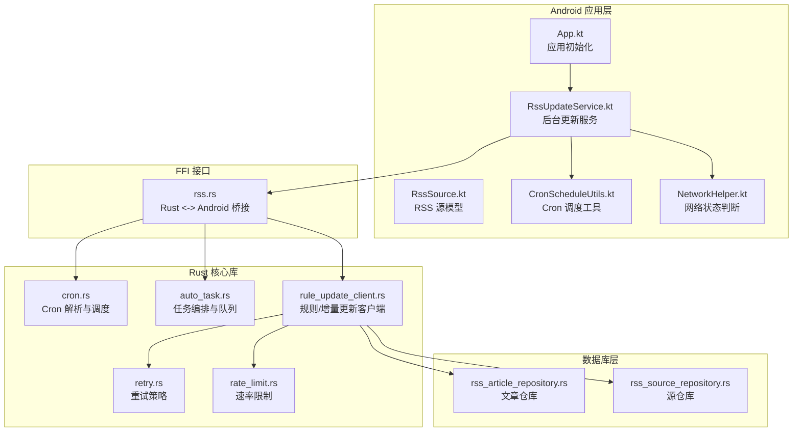
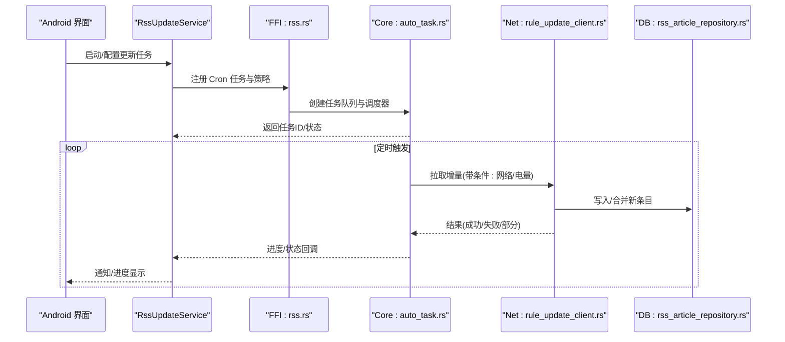
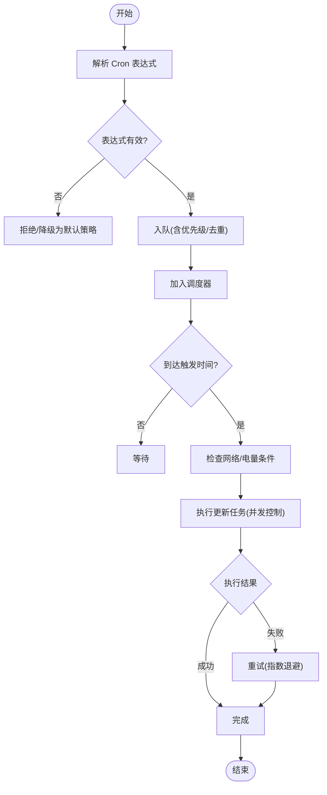
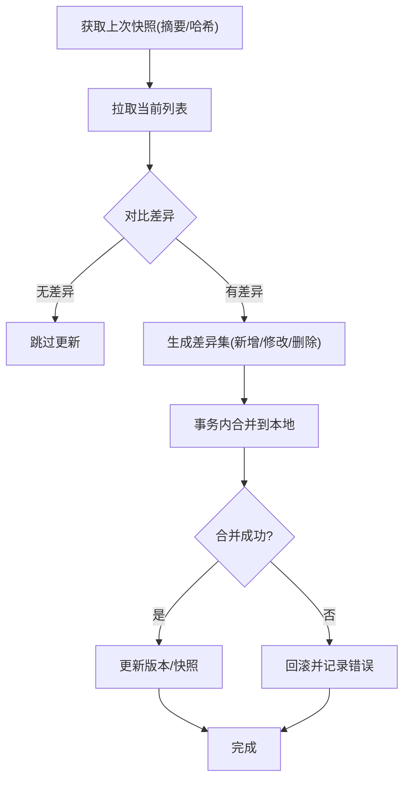
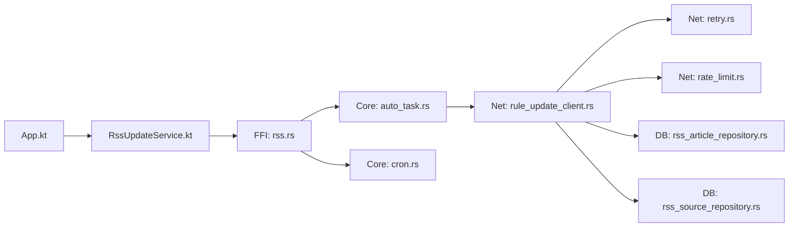

# 自动更新机制

<cite>
**本文引用的文件**   
- [app/src/main/java/io/legado/app/App.kt](file://app/src/main/java/io/legado/app/App.kt)
- [app/src/main/java/io/legado/app/service/RssUpdateService.kt](file://app/src/main/java/io/legado/app/service/RssUpdateService.kt)
- [app/src/main/java/io/legado/app/model/rss/RssSource.kt](file://app/src/main/java/io/legado/app/model/rss/RssSource.kt)
- [app/src/main/java/io/legado/app/data/dao/RssArticleDao.kt](file://app/src/main/java/io/legado/app/data/dao/RssArticleDao.kt)
- [app/src/main/java/io/legado/app/utils/CronScheduleUtils.kt](file://app/src/main/java/io/legado/app/utils/CronScheduleUtils.kt)
- [app/src/main/java/io/legado/app/help/NetworkHelper.kt](file://app/src/main/java/io/legado/app/help/NetworkHelper.kt)
- [modules/web/src/api/rss.ts](file://modules/web/src/api/rss.ts)
- [rust/legado-core/src/cron.rs](file://rust/legado-core/src/cron.rs)
- [rust/legado-core/src/auto_task.rs](file://rust/legado-core/src/auto_task.rs)
- [rust/legado-net/src/rule_update_client.rs](file://rust/legado-net/src/rule_update_client.rs)
- [rust/legado-net/src/retry.rs](file://rust/legado-net/src/retry.rs)
- [rust/legado-net/src/rate_limit.rs](file://rust/legado-net/src/rate_limit.rs)
- [rust/legado-db/src/repository/rss_article_repository.rs](file://rust/legado-db/src/repository/rss_article_repository.rs)
- [rust/legado-db/src/repository/rss_source_repository.rs](file://rust/legado-db/src/repository/rss_source_repository.rs)
- [rust/legado-ffi/src/api/rss.rs](file://rust/legado-ffi/src/api/rss.rs)
</cite>

## 目录
1. [简介](#简介)
2. [项目结构](#项目结构)
3. [核心组件](#核心组件)
4. [架构总览](#架构总览)
5. [详细组件分析](#详细组件分析)
6. [依赖关系分析](#依赖关系分析)
7. [性能考量](#性能考量)
8. [故障排查指南](#故障排查指南)
9. [结论](#结论)
10. [附录](#附录)

## 简介
本文件系统性阐述 Legado 的 RSS 自动更新机制，覆盖定时任务调度（Cron 表达式、任务队列与并发控制）、更新策略配置（频率、网络条件、电池优化适配）、增量更新算法（内容变化检测、差异合并、版本管理）、更新状态监控（进度、重试、通知）、资源管理（内存、磁盘、带宽限制）、冲突处理（数据合并、回滚、手动干预）以及日志记录与诊断工具。文档同时提供批量管理与批量操作能力说明，帮助开发者快速定位问题并优化系统性能。

## 项目结构
RSS 自动更新涉及 Android 应用层、Rust 核心库、数据库与网络模块：
- Android 应用层负责 UI 交互、服务启动、调度触发与用户反馈
- Rust 核心库实现 Cron 解析、任务编排、增量更新算法与并发控制
- 数据库层提供持久化与事务支持
- 网络层负责请求、重试、限速与规则更新客户端

**图示来源** 
- [app/src/main/java/io/legado/app/App.kt](file://app/src/main/java/io/legado/app/App.kt)
- [app/src/main/java/io/legado/app/service/RssUpdateService.kt](file://app/src/main/java/io/legado/app/service/RssUpdateService.kt)
- [app/src/main/java/io/legado/app/utils/CronScheduleUtils.kt](file://app/src/main/java/io/legado/app/utils/CronScheduleUtils.kt)
- [app/src/main/java/io/legado/app/help/NetworkHelper.kt](file://app/src/main/java/io/legado/app/help/NetworkHelper.kt)
- [rust/legado-core/src/cron.rs](file://rust/legado-core/src/cron.rs)
- [rust/legado-core/src/auto_task.rs](file://rust/legado-core/src/auto_task.rs)
- [rust/legado-net/src/rule_update_client.rs](file://rust/legado-net/src/rule_update_client.rs)
- [rust/legado-net/src/retry.rs](file://rust/legado-net/src/retry.rs)
- [rust/legado-net/src/rate_limit.rs](file://rust/legado-net/src/rate_limit.rs)
- [rust/legado-db/src/repository/rss_article_repository.rs](file://rust/legado-db/src/repository/rss_article_repository.rs)
- [rust/legado-db/src/repository/rss_source_repository.rs](file://rust/legado-db/src/repository/rss_source_repository.rs)
- [rust/legado-ffi/src/api/rss.rs](file://rust/legado-ffi/src/api/rss.rs)

**章节来源**
- [app/src/main/java/io/legado/app/App.kt](file://app/src/main/java/io/legado/app/App.kt)
- [app/src/main/java/io/legado/app/service/RssUpdateService.kt](file://app/src/main/java/io/legado/app/service/RssUpdateService.kt)
- [app/src/main/java/io/legado/app/utils/CronScheduleUtils.kt](file://app/src/main/java/io/legado/app/utils/CronScheduleUtils.kt)
- [app/src/main/java/io/legado/app/help/NetworkHelper.kt](file://app/src/main/java/io/legado/app/help/NetworkHelper.kt)
- [rust/legado-core/src/cron.rs](file://rust/legado-core/src/cron.rs)
- [rust/legado-core/src/auto_task.rs](file://rust/legado-core/src/auto_task.rs)
- [rust/legado-net/src/rule_update_client.rs](file://rust/legado-net/src/rule_update_client.rs)
- [rust/legado-net/src/retry.rs](file://rust/legado-net/src/retry.rs)
- [rust/legado-net/src/rate_limit.rs](file://rust/legado-net/src/rate_limit.rs)
- [rust/legado-db/src/repository/rss_article_repository.rs](file://rust/legado-db/src/repository/rss_article_repository.rs)
- [rust/legado-db/src/repository/rss_source_repository.rs](file://rust/legado-db/src/repository/rss_source_repository.rs)
- [rust/legado-ffi/src/api/rss.rs](file://rust/legado-ffi/src/api/rss.rs)

## 核心组件
- 定时任务调度器：基于 Cron 表达式解析与执行，支持多源并发调度与优先级队列
- 更新策略配置：可配置更新频率、网络条件（仅 Wi-Fi/移动网络）、电池优化适配（Doze 模式）
- 增量更新客户端：对比上次摘要/哈希，拉取差异并合并到本地数据库
- 任务队列与并发控制：限流、去重、失败重试、退避策略
- 状态监控与通知：进度回调、错误上报、失败通知
- 资源管理：内存水位控制、临时文件清理、网络带宽限制
- 冲突处理：数据合并策略、版本回滚、手动干预入口
- 日志与诊断：结构化日志、调试接口、批量操作 API

**章节来源**
- [rust/legado-core/src/cron.rs](file://rust/legado-core/src/cron.rs)
- [rust/legado-core/src/auto_task.rs](file://rust/legado-core/src/auto_task.rs)
- [rust/legado-net/src/rule_update_client.rs](file://rust/legado-net/src/rule_update_client.rs)
- [rust/legado-net/src/retry.rs](file://rust/legado-net/src/retry.rs)
- [rust/legado-net/src/rate_limit.rs](file://rust/legado-net/src/rate_limit.rs)
- [rust/legado-db/src/repository/rss_article_repository.rs](file://rust/legado-db/src/repository/rss_article_repository.rs)
- [rust/legado-db/src/repository/rss_source_repository.rs](file://rust/legado-db/src/repository/rss_source_repository.rs)
- [rust/legado-ffi/src/api/rss.rs](file://rust/legado-ffi/src/api/rss.rs)
- [app/src/main/java/io/legado/app/service/RssUpdateService.kt](file://app/src/main/java/io/legado/app/service/RssUpdateService.kt)
- [app/src/main/java/io/legado/app/utils/CronScheduleUtils.kt](file://app/src/main/java/io/legado/app/utils/CronScheduleUtils.kt)
- [app/src/main/java/io/legado/app/help/NetworkHelper.kt](file://app/src/main/java/io/legado/app/help/NetworkHelper.kt)

## 架构总览
整体流程从 Android 层触发调度，通过 FFI 调用 Rust 核心进行任务编排与网络更新，最终落库并反馈状态。

**图示来源** 
- [app/src/main/java/io/legado/app/service/RssUpdateService.kt](file://app/src/main/java/io/legado/app/service/RssUpdateService.kt)
- [rust/legado-ffi/src/api/rss.rs](file://rust/legado-ffi/src/api/rss.rs)
- [rust/legado-core/src/auto_task.rs](file://rust/legado-core/src/auto_task.rs)
- [rust/legado-net/src/rule_update_client.rs](file://rust/legado-net/src/rule_update_client.rs)
- [rust/legado-db/src/repository/rss_article_repository.rs](file://rust/legado-db/src/repository/rss_article_repository.rs)

## 详细组件分析

### 定时任务调度系统（Cron 表达式、任务队列、并发控制）
- Cron 解析与校验：支持标准 Cron 字段，包含分钟、小时、日、月、周几等；非法表达式将被拒绝或降级为默认策略
- 任务队列：按源维度组织任务，支持优先级、去重、延迟执行与取消
- 并发控制：全局并发上限、每源并发限制、背压与排队策略
- 电池优化适配：在 Doze/省电模式下降低频率或延后执行，避免唤醒风暴

**图示来源** 
- [rust/legado-core/src/cron.rs](file://rust/legado-core/src/cron.rs)
- [rust/legado-core/src/auto_task.rs](file://rust/legado-core/src/auto_task.rs)
- [app/src/main/java/io/legado/app/utils/CronScheduleUtils.kt](file://app/src/main/java/io/legado/app/utils/CronScheduleUtils.kt)

**章节来源**
- [rust/legado-core/src/cron.rs](file://rust/legado-core/src/cron.rs)
- [rust/legado-core/src/auto_task.rs](file://rust/legado-core/src/auto_task.rs)
- [app/src/main/java/io/legado/app/utils/CronScheduleUtils.kt](file://app/src/main/java/io/legado/app/utils/CronScheduleUtils.kt)

### 更新策略配置（频率、网络条件、电池优化）
- 更新频率：按源设置最小间隔、最大间隔、固定周期或动态调整
- 网络条件：仅 Wi-Fi、允许移动网络、无网络时跳过
- 电池优化：Doze 模式降频、白名单源例外、低电量保护
- 策略生效：运行时动态切换，持久化存储，失效回退策略

**章节来源**
- [app/src/main/java/io/legado/app/help/NetworkHelper.kt](file://app/src/main/java/io/legado/app/help/NetworkHelper.kt)
- [rust/legado-core/src/auto_task.rs](file://rust/legado-core/src/auto_task.rs)

### 增量更新算法（内容变化检测、差异合并、版本管理）
- 变化检测：基于摘要/ETag/时间戳/哈希对比，识别新增与变更
- 差异合并：按唯一键合并条目，保留最新元数据，去重与软删除标记
- 版本管理：维护源版本与条目版本，支持回滚与一致性校验
- 幂等性：重复拉取不产生副作用，保证最终一致

**图示来源** 
- [rust/legado-net/src/rule_update_client.rs](file://rust/legado-net/src/rule_update_client.rs)
- [rust/legado-db/src/repository/rss_article_repository.rs](file://rust/legado-db/src/repository/rss_article_repository.rs)

**章节来源**
- [rust/legado-net/src/rule_update_client.rs](file://rust/legado-net/src/rule_update_client.rs)
- [rust/legado-db/src/repository/rss_article_repository.rs](file://rust/legado-db/src/repository/rss_article_repository.rs)

### 更新状态监控（进度、错误重试、失败通知）
- 进度显示：按源/批次统计已处理数量、剩余量、成功率
- 错误重试：指数退避、抖动、熔断与降级
- 失败通知：推送/通知栏展示，支持一键重试与查看日志
- 回调通道：通过 FFI 将状态回传到 Android 层

**章节来源**
- [rust/legado-net/src/retry.rs](file://rust/legado-net/src/retry.rs)
- [rust/legado-ffi/src/api/rss.rs](file://rust/legado-ffi/src/api/rss.rs)
- [app/src/main/java/io/legado/app/service/RssUpdateService.kt](file://app/src/main/java/io/legado/app/service/RssUpdateService.kt)

### 资源管理策略（内存、磁盘、带宽）
- 内存控制：分页拉取、对象池复用、及时释放大对象
- 磁盘清理：临时文件 TTL、过期缓存清理、空间不足告警
- 带宽限制：全局与每源限速、峰值控制、拥塞自适应

**章节来源**
- [rust/legado-net/src/rate_limit.rs](file://rust/legado-net/src/rate_limit.rs)
- [rust/legado-core/src/auto_task.rs](file://rust/legado-core/src/auto_task.rs)

### 更新冲突处理（数据合并、版本回滚、手动干预）
- 数据合并：以唯一键为主键，冲突时采用“最新优先”或“字段级合并”
- 版本回滚：支持按版本号回滚至稳定快照
- 手动干预：提供暂停/恢复、强制刷新、忽略特定源的入口

**章节来源**
- [rust/legado-db/src/repository/rss_article_repository.rs](file://rust/legado-db/src/repository/rss_article_repository.rs)
- [rust/legado-db/src/repository/rss_source_repository.rs](file://rust/legado-db/src/repository/rss_source_repository.rs)

### 更新日志与诊断工具
- 结构化日志：记录任务生命周期、网络请求、合并结果与异常堆栈
- 诊断接口：导出日志、抓取快照、模拟失败场景
- 批量操作：批量启用/禁用、批量刷新、批量清理缓存

**章节来源**
- [rust/legado-ffi/src/api/rss.rs](file://rust/legado-ffi/src/api/rss.rs)
- [modules/web/src/api/rss.ts](file://modules/web/src/api/rss.ts)

## 依赖关系分析
Android 层通过 FFI 调用 Rust 核心，核心依赖网络与数据库模块，形成清晰的分层与解耦。

**图示来源** 
- [app/src/main/java/io/legado/app/App.kt](file://app/src/main/java/io/legado/app/App.kt)
- [app/src/main/java/io/legado/app/service/RssUpdateService.kt](file://app/src/main/java/io/legado/app/service/RssUpdateService.kt)
- [rust/legado-ffi/src/api/rss.rs](file://rust/legado-ffi/src/api/rss.rs)
- [rust/legado-core/src/auto_task.rs](file://rust/legado-core/src/auto_task.rs)
- [rust/legado-core/src/cron.rs](file://rust/legado-core/src/cron.rs)
- [rust/legado-net/src/rule_update_client.rs](file://rust/legado-net/src/rule_update_client.rs)
- [rust/legado-net/src/retry.rs](file://rust/legado-net/src/retry.rs)
- [rust/legado-net/src/rate_limit.rs](file://rust/legado-net/src/rate_limit.rs)
- [rust/legado-db/src/repository/rss_article_repository.rs](file://rust/legado-db/src/repository/rss_article_repository.rs)
- [rust/legado-db/src/repository/rss_source_repository.rs](file://rust/legado-db/src/repository/rss_source_repository.rs)

**章节来源**
- [app/src/main/java/io/legado/app/App.kt](file://app/src/main/java/io/legado/app/App.kt)
- [app/src/main/java/io/legado/app/service/RssUpdateService.kt](file://app/src/main/java/io/legado/app/service/RssUpdateService.kt)
- [rust/legado-ffi/src/api/rss.rs](file://rust/legado-ffi/src/api/rss.rs)
- [rust/legado-core/src/auto_task.rs](file://rust/legado-core/src/auto_task.rs)
- [rust/legado-core/src/cron.rs](file://rust/legado-core/src/cron.rs)
- [rust/legado-net/src/rule_update_client.rs](file://rust/legado-net/src/rule_update_client.rs)
- [rust/legado-net/src/retry.rs](file://rust/legado-net/src/retry.rs)
- [rust/legado-net/src/rate_limit.rs](file://rust/legado-net/src/rate_limit.rs)
- [rust/legado-db/src/repository/rss_article_repository.rs](file://rust/legado-db/src/repository/rss_article_repository.rs)
- [rust/legado-db/src/repository/rss_source_repository.rs](file://rust/legado-db/src/repository/rss_source_repository.rs)

## 性能考量
- 调度层面：合理设置 Cron 间隔，避免频繁唤醒；使用批处理减少 IO 次数
- 网络层面：启用压缩、连接复用、超时与重试退避；限制并发与带宽
- 数据层面：增量拉取、分页写入、事务合并；定期清理无用数据
- 内存层面：限制单次处理规模，及时释放大对象；避免内存泄漏
- 电池层面：Doze 模式适配，白名单策略，避免后台高功耗

[本节为通用指导，不直接分析具体文件]

## 故障排查指南
- 常见问题
  - Cron 表达式无效：检查语法与字段范围，确认是否被降级为默认策略
  - 网络条件不满足：确认 Wi-Fi/移动网络开关与运营商限制
  - 电池优化导致延迟：检查 Doze 白名单与后台运行权限
  - 增量未生效：核对摘要/ETag/时间戳是否正确保存与比对
  - 合并冲突：查看冲突策略与回滚点，必要时手动干预
- 诊断步骤
  - 查看任务日志与错误堆栈
  - 抓取快照与差异报告
  - 模拟失败与重试路径验证
  - 使用批量操作快速恢复

**章节来源**
- [rust/legado-net/src/retry.rs](file://rust/legado-net/src/retry.rs)
- [rust/legado-ffi/src/api/rss.rs](file://rust/legado-ffi/src/api/rss.rs)
- [app/src/main/java/io/legado/app/service/RssUpdateService.kt](file://app/src/main/java/io/legado/app/service/RssUpdateService.kt)

## 结论
Legado 的 RSS 自动更新机制通过分层架构与模块化设计，实现了可靠的定时调度、智能策略、增量同步与完善的监控诊断。结合资源管理与冲突处理，能够在复杂环境下保持稳定高效运行。建议在生产环境中合理配置 Cron 与策略参数，持续监控性能指标并及时优化。

[本节为总结性内容，不直接分析具体文件]

## 附录
- 术语表
  - Cron：一种时间表达式格式，用于描述周期性任务的执行时机
  - 增量更新：仅拉取与上次状态存在差异的数据
  - 幂等性：多次执行同一操作的结果与一次执行相同
- 最佳实践
  - 使用合理的 Cron 间隔与批大小
  - 开启重试与退避，避免雪崩
  - 定期清理缓存与临时文件
  - 对关键源设置白名单与更高优先级

[本节为补充信息，不直接分析具体文件]