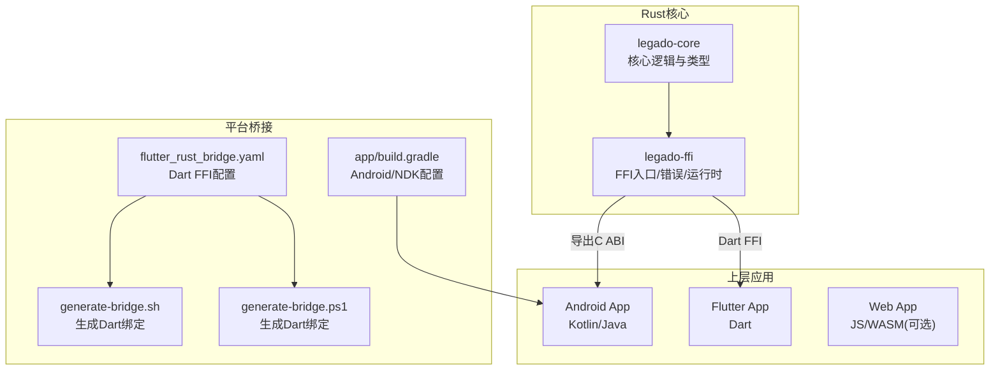
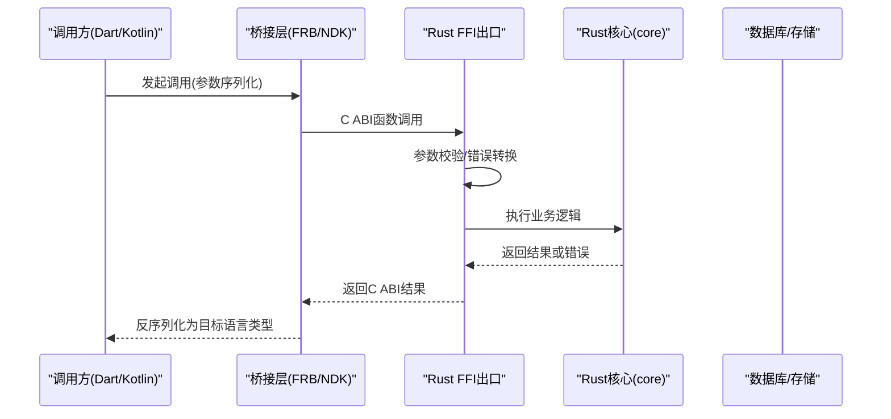
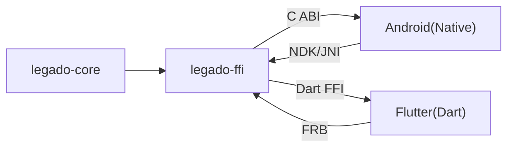

# FFI接口

<cite>
**本文引用的文件**   
- [rust/legado-ffi/src/lib.rs](file://rust/legado-ffi/src/lib.rs)
- [rust/legado-ffi/src/ffi.rs](file://rust/legado-ffi/src/ffi.rs)
- [rust/legado-ffi/src/bridge.rs](file://rust/legado-ffi/src/bridge.rs)
- [rust/legado-ffi/src/runtime.rs](file://rust/legado-ffi/src/runtime.rs)
- [rust/legado-ffi/src/db_state.rs](file://rust/legado-ffi/src/db_state.rs)
- [rust/legado-ffi/src/error.rs](file://rust/legado-ffi/src/error.rs)
- [rust/legado-core/src/lib.rs](file://rust/legado-core/src/lib.rs)
- [rust/legado-core/src/types.rs](file://rust/legado-core/src/types.rs)
- [rust/legado-core/src/error.rs](file://rust/legado-core/src/error.rs)
- [flutter_legado/flutter_rust_bridge.yaml](file://flutter_legado/flutter_rust_bridge.yaml)
- [flutter_legado/scripts/generate-bridge.sh](file://flutter_legado/scripts/generate-bridge.sh)
- [flutter_legado/scripts/generate-bridge.ps1](file://flutter_legado/scripts/generate-bridge.ps1)
- [app/build.gradle](file://app/build.gradle)
- [gradle.properties](file://gradle.properties)
- [Makefile](file://Makefile)
</cite>

## 目录
1. [简介](#简介)
2. [项目结构](#项目结构)
3. [核心组件](#核心组件)
4. [架构总览](#架构总览)
5. [详细组件分析](#详细组件分析)
6. [依赖关系分析](#依赖关系分析)
7. [性能考量](#性能考量)
8. [故障排查指南](#故障排查指南)
9. [结论](#结论)
10. [附录](#附录)

## 简介
本文件面向跨语言调用（FFI）的开发者与使用者，系统性说明Legado项目的FFI接口设计、实现与使用方式。内容涵盖：
- 跨语言调用机制：数据类型映射、内存管理与生命周期控制
- API设计原则：接口稳定性、错误处理与版本兼容性
- 桥接层实现：Kotlin FFI、Dart FFI与JNI接口的生成与管理
- 运行时环境管理：线程模型、协程支持与异常处理
- 使用示例：Android端、Flutter端与Web端的调用路径
- 性能优化建议与调试技巧

## 项目结构
本项目采用多模块Rust库作为核心能力，并通过FFI暴露给上层应用。关键目录与职责如下：
- rust/legado-ffi：对外FFI入口、类型定义、错误封装、运行时与数据库状态管理
- rust/legado-core：核心业务逻辑与通用类型
- flutter_legado：Flutter侧配置与桥接脚本
- app：Android工程，包含构建配置与Gradle集成
- Makefile：顶层构建编排

图表来源
- [rust/legado-core/src/lib.rs](file://rust/legado-core/src/lib.rs)
- [rust/legado-ffi/src/lib.rs](file://rust/legado-ffi/src/lib.rs)
- [flutter_legado/flutter_rust_bridge.yaml](file://flutter_legado/flutter_rust_bridge.yaml)
- [flutter_legado/scripts/generate-bridge.sh](file://flutter_legado/scripts/generate-bridge.sh)
- [flutter_legado/scripts/generate-bridge.ps1](file://flutter_legado/scripts/generate-bridge.ps1)
- [app/build.gradle](file://app/build.gradle)

章节来源
- [rust/legado-core/src/lib.rs](file://rust/legado-core/src/lib.rs)
- [rust/legado-ffi/src/lib.rs](file://rust/legado-ffi/src/lib.rs)
- [flutter_legado/flutter_rust_bridge.yaml](file://flutter_legado/flutter_rust_bridge.yaml)
- [app/build.gradle](file://app/build.gradle)

## 核心组件
- FFI入口与导出：集中定义对外C ABI函数，负责参数校验、错误转换与结果返回
- 错误体系：统一错误类型与消息传递，保证跨语言一致性
- 运行时管理：初始化、线程与协程上下文、资源清理
- 数据库状态：持久化连接与迁移状态的可见性管理
- 类型系统：基础类型、集合与字符串在Rust与宿主语言间的映射

章节来源
- [rust/legado-ffi/src/ffi.rs](file://rust/legado-ffi/src/ffi.rs)
- [rust/legado-ffi/src/error.rs](file://rust/legado-ffi/src/error.rs)
- [rust/legado-ffi/src/runtime.rs](file://rust/legado-ffi/src/runtime.rs)
- [rust/legado-ffi/src/db_state.rs](file://rust/legado-ffi/src/db_state.rs)
- [rust/legado-core/src/types.rs](file://rust/legado-core/src/types.rs)

## 架构总览
下图展示从上层应用到Rust核心的调用链路，包括Dart FFI与Android NDK/JNI两条路径。

图表来源
- [rust/legado-ffi/src/ffi.rs](file://rust/legado-ffi/src/ffi.rs)
- [rust/legado-core/src/lib.rs](file://rust/legado-core/src/lib.rs)
- [flutter_legado/flutter_rust_bridge.yaml](file://flutter_legado/flutter_rust_bridge.yaml)
- [app/build.gradle](file://app/build.gradle)

## 详细组件分析

### FFI入口与类型映射
- 设计要点
  - 所有对外函数以稳定C ABI暴露，避免符号名变化导致ABI不兼容
  - 输入输出尽量使用可拷贝、可序列化的基础类型；复杂对象通过ID或指针+长度传递
  - 字符串统一UTF-8编码，边界由桥接层负责分配与释放
- 类型映射策略
  - Rust整数/浮点 -> 对应平台原生整型/浮点
  - Rust String/Vec<u8> -> 宿主语言字符串/字节数组
  - 枚举与结构体 -> 扁平化字段或JSON序列化（视场景而定）
- 内存与生命周期
  - 跨边界数据一律显式分配/释放，避免悬垂指针
  - 长生命周期对象通过句柄/ID管理，由运行时统一回收

章节来源
- [rust/legado-ffi/src/ffi.rs](file://rust/legado-ffi/src/ffi.rs)
- [rust/legado-core/src/types.rs](file://rust/legado-core/src/types.rs)

### 错误处理与版本兼容
- 错误处理
  - 统一错误码与错误消息，确保跨语言一致的可观测性
  - 对可恢复错误提供重试提示，致命错误直接上抛
- 版本兼容
  - 对外ABI保持向后兼容，新增字段默认值填充
  - 通过版本号字段进行协议协商，拒绝不兼容请求

章节来源
- [rust/legado-ffi/src/error.rs](file://rust/legado-ffi/src/error.rs)
- [rust/legado-core/src/error.rs](file://rust/legado-core/src/error.rs)

### 运行时环境与线程模型
- 初始化与销毁
  - 进程级初始化一次完成，按需懒加载子模块
  - 显式释放外部资源，避免泄漏
- 线程与协程
  - 同步API阻塞当前线程；异步API通过回调或Future交由宿主调度
  - Android侧注意主线程限制，IO与CPU密集任务下沉到工作线程
- 异常处理
  - Rust侧panic被捕获并转换为错误码，避免崩溃传播到宿主

章节来源
- [rust/legado-ffi/src/runtime.rs](file://rust/legado-ffi/src/runtime.rs)
- [rust/legado-ffi/src/db_state.rs](file://rust/legado-ffi/src/db_state.rs)

### Dart FFI桥接（Flutter）
- 生成流程
  - 通过flutter_rust_bridge配置文件声明接口
  - 运行脚本生成Dart绑定与Rust侧包装代码
- 数据与内存
  - 自动处理基本类型与简单集合的编解码
  - 大对象建议使用流式接口或分块传输
- 线程与异常
  - Dart侧调用默认在主隔离执行，耗时操作需切换到后台隔离
  - 异常统一转为错误对象，便于上层捕获

章节来源
- [flutter_legado/flutter_rust_bridge.yaml](file://flutter_legado/flutter_rust_bridge.yaml)
- [flutter_legado/scripts/generate-bridge.sh](file://flutter_legado/scripts/generate-bridge.sh)
- [flutter_legado/scripts/generate-bridge.ps1](file://flutter_legado/scripts/generate-bridge.ps1)

### Kotlin FFI与JNI（Android）
- 构建与集成
  - Gradle配置NDK工具链与Rust编译产物链接
  - 通过C ABI或JNI中间层对接Kotlin
- 线程与协程
  - 将耗时任务放入Dispatchers.IO或自定义线程池
  - 回调返回至主线程更新UI
- 内存管理
  - 谨慎处理ByteBuffer与NativeMemory，避免越界访问
  - 及时释放Native资源，防止OOM

章节来源
- [app/build.gradle](file://app/build.gradle)
- [gradle.properties](file://gradle.properties)

### Web端调用（WASM/JS）
- 若使用WASM，可通过JS绑定调用Rust编译产物
- 注意浏览器沙箱限制与内存上限，合理拆分任务
- 使用异步API避免阻塞UI线程

章节来源
- [Makefile](file://Makefile)

## 依赖关系分析
- 模块内聚与耦合
  - legado-core提供领域能力，legado-ffi仅做适配与导出，低耦合高内聚
- 外部依赖
  - Flutter侧依赖FRB生成器；Android侧依赖NDK与Rust插件
- 潜在循环依赖
  - FFI不应反向依赖上层应用，避免闭环

图表来源
- [rust/legado-core/src/lib.rs](file://rust/legado-core/src/lib.rs)
- [rust/legado-ffi/src/lib.rs](file://rust/legado-ffi/src/lib.rs)
- [flutter_legado/flutter_rust_bridge.yaml](file://flutter_legado/flutter_rust_bridge.yaml)
- [app/build.gradle](file://app/build.gradle)

章节来源
- [rust/legado-core/src/lib.rs](file://rust/legado-core/src/lib.rs)
- [rust/legado-ffi/src/lib.rs](file://rust/legado-ffi/src/lib.rs)
- [flutter_legado/flutter_rust_bridge.yaml](file://flutter_legado/flutter_rust_bridge.yaml)
- [app/build.gradle](file://app/build.gradle)

## 性能考量
- 减少跨边界拷贝：优先使用零拷贝视图或引用计数共享
- 批量操作：合并多次小调用为单次批量接口
- 异步化：IO与CPU密集型任务异步执行，避免阻塞
- 缓存热点数据：在Rust侧维护短期缓存，降低重复计算
- 内存池：高频分配场景使用对象池或预分配缓冲区

## 故障排查指南
- 常见问题定位
  - 崩溃：检查Rust侧是否捕获panic并转换为错误码
  - 内存泄漏：确认跨边界分配的内存是否成对释放
  - 线程问题：确认调用是否在正确线程执行，避免主线程阻塞
- 调试技巧
  - 启用日志与追踪，记录关键路径的参数与返回值
  - 使用平台调试器（LLDB/Android Studio）附加Native进程
  - 最小化复现用例，隔离问题域

章节来源
- [rust/legado-ffi/src/error.rs](file://rust/legado-ffi/src/error.rs)
- [rust/legado-ffi/src/runtime.rs](file://rust/legado-ffi/src/runtime.rs)

## 结论
Legado的FFI方案以稳定的C ABI为核心，结合FRB与NDK/JNI分别服务Flutter与Android生态。通过统一的错误体系、清晰的内存与生命周期管理以及合理的线程模型，实现了高性能、可维护的跨语言调用。遵循本文的设计原则与实践建议，可在不同平台上获得一致的体验与良好的扩展性。

## 附录
- 构建与生成
  - 顶层Makefile用于协调各平台构建步骤
  - Flutter侧通过脚本生成Dart绑定
  - Android侧通过Gradle集成NDK与Rust

章节来源
- [Makefile](file://Makefile)
- [flutter_legado/scripts/generate-bridge.sh](file://flutter_legado/scripts/generate-bridge.sh)
- [flutter_legado/scripts/generate-bridge.ps1](file://flutter_legado/scripts/generate-bridge.ps1)
- [app/build.gradle](file://app/build.gradle)