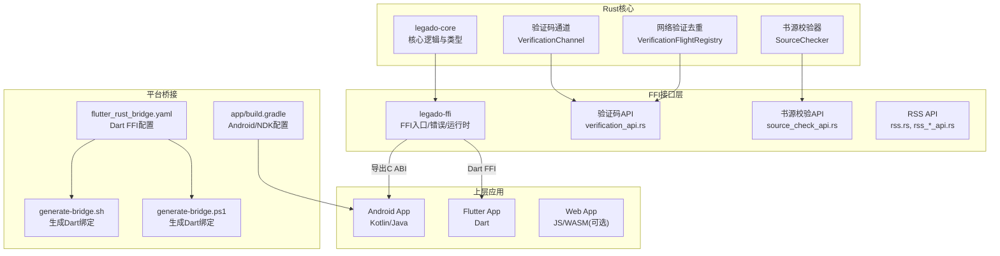
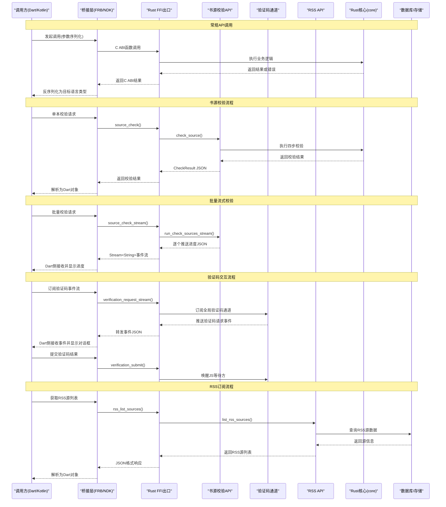
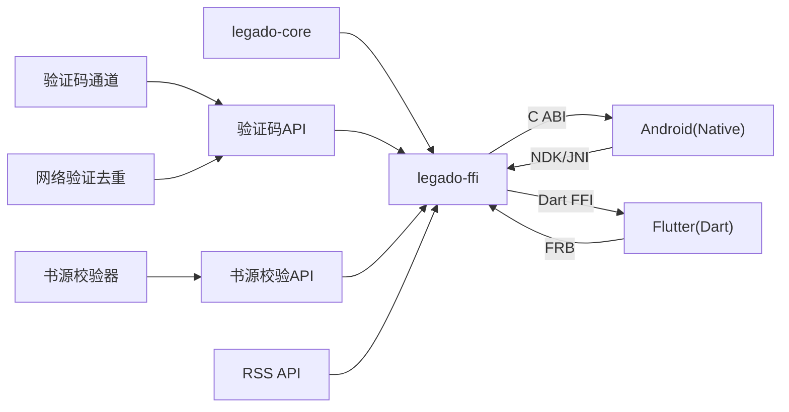

# FFI接口

<cite>
**本文引用的文件**   
- [rust/legado-ffi/src/lib.rs](file://rust/legado-ffi/src/lib.rs)
- [rust/legado-ffi/src/ffi.rs](file://rust/legado-ffi/src/ffi.rs)
- [rust/legado-ffi/src/bridge.rs](file://rust/legado-ffi/src/bridge.rs)
- [rust/legado-ffi/src/runtime.rs](file://rust/legado-ffi/src/runtime.rs)
- [rust/legado-ffi/src/db_state.rs](file://rust/legado-ffi/src/db_state.rs)
- [rust/legado-ffi/src/error.rs](file://rust/legado-ffi/src/error.rs)
- [rust/legado-core/src/lib.rs](file://rust/legado-core/src/lib.rs)
- [rust/legado-core/src/types.rs](file://rust/legado-core/src/types.rs)
- [rust/legado-core/src/error.rs](file://rust/legado-core/src/error.rs)
- [rust/legado-core/src/verification_channel.rs](file://rust/legado-core/src/verification_channel.rs)
- [rust/legado-core/src/models/book_source.rs](file://rust/legado-core/src/models/book_source.rs)
- [rust/legado-ffi/src/api/verification_api.rs](file://rust/legado-ffi/src/api/verification_api.rs)
- [rust/legado-ffi/src/api/source_check_api.rs](file://rust/legado-ffi/src/api/source_check_api.rs)
- [rust/legado-net/src/verification.rs](file://rust/legado-net/src/verification.rs)
- [rust/legado-ffi/src/api/rss.rs](file://rust/legado-ffi/src/api/rss.rs)
- [rust/legado-ffi/src/api/rss_read_record_api.rs](file://rust/legado-ffi/src/api/rss_read_record_api.rs)
- [rust/legado-ffi/src/api/rss_star_api.rs](file://rust/legado-ffi/src/api/rss_star_api.rs)
- [flutter_legado/flutter_rust_bridge.yaml](file://flutter_legado/flutter_rust_bridge.yaml)
- [flutter_legado/scripts/generate-bridge.sh](file://flutter_legado/scripts/generate-bridge.sh)
- [flutter_legado/scripts/generate-bridge.ps1](file://flutter_legado/scripts/generate-bridge.ps1)
- [app/build.gradle](file://app/build.gradle)
- [gradle.properties](file://gradle.properties)
- [Makefile](file://Makefile)
</cite>

## 更新摘要
**所做更改**   
- 新增书源校验FFI接口，包括单本校验、批量流式校验和取消操作
- 更新了FFI导出层，将新的书源校验方法暴露给上层应用
- 增强了跨语言调用机制，支持同步和异步两种校验模式
- 完善了错误处理和版本兼容性说明

## 目录
1. [简介](#简介)
2. [项目结构](#项目结构)
3. [核心组件](#核心组件)
4. [架构总览](#架构总览)
5. [详细组件分析](#详细组件分析)
6. [依赖关系分析](#依赖关系分析)
7. [性能考量](#性能考量)
8. [故障排查指南](#故障排查指南)
9. [结论](#结论)
10. [附录](#附录)

## 简介
本文件面向跨语言调用（FFI）的开发者与使用者，系统性说明Legado项目的FFI接口设计、实现与使用方式。内容涵盖：
- 跨语言调用机制：数据类型映射、内存管理与生命周期控制
- API设计原则：接口稳定性、错误处理与版本兼容性
- 桥接层实现：Kotlin FFI、Dart FFI与JNI接口的生成与管理
- 运行时环境管理：线程模型、协程支持与异常处理
- 使用示例：Android端、Flutter端与Web端的调用路径
- 性能优化建议与调试技巧

**更新** 本次更新新增了书源校验相关的FFI接口，包括单本校验、批量流式校验和取消操作，进一步完善了跨语言调用能力。

## 项目结构
本项目采用多模块Rust库作为核心能力，并通过FFI暴露给上层应用。关键目录与职责如下：
- rust/legado-ffi：对外FFI入口、类型定义、错误封装、运行时与数据库状态管理
- rust/legado-core：核心业务逻辑与通用类型，包含验证码通道实现
- flutter_legado：Flutter侧配置与桥接脚本
- app：Android工程，包含构建配置与Gradle集成
- Makefile：顶层构建编排

**图表来源**
- [rust/legado-core/src/verification_channel.rs:1-578](file://rust/legado-core/src/verification_channel.rs#L1-L578)
- [rust/legado-net/src/verification.rs:1-166](file://rust/legado-net/src/verification.rs#L1-L166)
- [rust/legado-ffi/src/api/verification_api.rs:1-258](file://rust/legado-ffi/src/api/verification_api.rs#L1-L258)
- [rust/legado-ffi/src/api/source_check_api.rs:1-500](file://rust/legado-ffi/src/api/source_check_api.rs#L1-L500)
- [rust/legado-ffi/src/api/rss.rs:1-192](file://rust/legado-ffi/src/api/rss.rs#L1-L192)

章节来源
- [rust/legado-core/src/lib.rs](file://rust/legado-core/src/lib.rs)
- [rust/legado-ffi/src/lib.rs](file://rust/legado-ffi/src/lib.rs)
- [flutter_legado/flutter_rust_bridge.yaml](file://flutter_legado/flutter_rust_bridge.yaml)
- [app/build.gradle](file://app/build.gradle)

## 核心组件
- FFI入口与导出：集中定义对外C ABI函数，负责参数校验、错误转换与结果返回
- 验证码交互通道：实现书源JS挂起等待与Flutter验证码对话框的事件桥接
- 书源校验API：提供单本校验、批量流式校验和取消操作，支持同步和异步两种模式
- RSS订阅API：提供RSS源的增删查与文章获取能力，以及已读记录和收藏管理
- 错误体系：统一错误类型与消息传递，保证跨语言一致性
- 运行时管理：初始化、线程与协程上下文、资源清理
- 数据库状态：持久化连接与迁移状态的可见性管理
- 类型系统：基础类型、集合与字符串在Rust与宿主语言间的映射

**更新** 新增了书源校验API核心组件，提供了完整的书源验证功能，包括单本校验、批量流式校验和取消操作。

章节来源
- [rust/legado-ffi/src/ffi.rs:243-283](file://rust/legado-ffi/src/ffi.rs#L243-L283)
- [rust/legado-ffi/src/api/verification_api.rs:1-258](file://rust/legado-ffi/src/api/verification_api.rs#L1-L258)
- [rust/legado-ffi/src/api/source_check_api.rs:1-500](file://rust/legado-ffi/src/api/source_check_api.rs#L1-L500)
- [rust/legado-ffi/src/api/rss.rs:1-192](file://rust/legado-ffi/src/api/rss.rs#L1-L192)
- [rust/legado-core/src/verification_channel.rs:1-578](file://rust/legado-core/src/verification_channel.rs#L1-L578)

## 架构总览
下图展示从上层应用到Rust核心的调用链路，包括Dart FFI与Android NDK/JNI两条路径，以及新增的书源校验、验证码通道和RSS API调用流程。

**图表来源**
- [rust/legado-ffi/src/ffi.rs:243-283](file://rust/legado-ffi/src/ffi.rs#L243-L283)
- [rust/legado-ffi/src/api/source_check_api.rs:85-93](file://rust/legado-ffi/src/api/source_check_api.rs#L85-L93)
- [rust/legado-ffi/src/api/verification_api.rs:52-84](file://rust/legado-ffi/src/api/verification_api.rs#L52-L84)
- [rust/legado-ffi/src/api/rss.rs:30-55](file://rust/legado-ffi/src/api/rss.rs#L30-L55)

## 详细组件分析

### FFI入口与类型映射
- 设计要点
  - 所有对外函数以稳定C ABI暴露，避免符号名变化导致ABI不兼容
  - 输入输出尽量使用可拷贝、可序列化的基础类型；复杂对象通过ID或指针+长度传递
  - 字符串统一UTF-8编码，边界由桥接层负责分配与释放
- 类型映射策略
  - Rust整数/浮点 -> 对应平台原生整型/浮点
  - Rust String/Vec<u8> -> 宿主语言字符串/字节数组
  - 枚举与结构体 -> 扁平化字段或JSON序列化（视场景而定）
- 内存与生命周期
  - 跨边界数据一律显式分配/释放，避免悬垂指针
  - 长生命周期对象通过句柄/ID管理，由运行时统一回收

章节来源
- [rust/legado-ffi/src/ffi.rs:1-100](file://rust/legado-ffi/src/ffi.rs#L1-L100)
- [rust/legado-core/src/types.rs](file://rust/legado-core/src/types.rs)

### 书源校验FFI接口
**新增** 书源校验API提供了完整的书源验证功能，包括单本校验、批量流式校验和取消操作。

- 核心功能
  - 单本校验：`source_check()` 对单个书源进行四步校验（搜索→详情→目录→正文 + 验证码/重定向检测）
  - 批量流式校验：`source_check_stream()` 串行逐个校验书源，实时回推进度
  - 取消操作：`source_check_cancel()` 中止正在进行的批量校验任务

- 校验配置
  - `keyword`：搜索关键词
  - `step_timeout_ms`：每步超时时间
  - `check_search/check_toc/check_content`：是否执行各步骤检查
  - `detect_captcha/detect_redirect`：是否检测验证码和重定向

- 进度数据结构
  - `index`：当前书源索引（从0开始）
  - `total`：待校验书源总数
  - `is_last`：是否为最后一条
  - `source_name`：书源名称
  - `result`：该书源的完整校验结果

- 线程模型
  - 单本校验：同步阻塞执行，内部使用tokio runtime
  - 批量校验：异步流式处理，按请求顺序串行执行
  - 取消机制：使用AtomicBool全局标志位，支持中断正在进行的操作

**更新** 书源校验完全对齐Kotlin `CheckSourceService`的语义，支持串行执行避免并发压力，并提供全局取消功能。

章节来源
- [rust/legado-ffi/src/api/source_check_api.rs:1-500](file://rust/legado-ffi/src/api/source_check_api.rs#L1-L500)
- [rust/legado-ffi/src/ffi.rs:198-241](file://rust/legado-ffi/src/ffi.rs#L198-L241)

### 验证码交互通道FFI接口
验证码交互通道实现了书源JS挂起等待与Flutter验证码对话框的事件桥接机制。

- 核心功能
  - 事件流订阅：`verification_request_stream()` 长期存活的事件流，推送验证码请求事件
  - 结果提交：`verification_submit()` 用户输入验证码后唤醒JS等待方
  - 取消处理：`verification_cancel()` UI关闭对话框时以空结果收尾
  - 状态查询：`verification_pending()` 获取当前进行中的验证码请求列表

- 事件数据结构
  - `key`：请求唯一标识（resultKey）
  - `source_url`：发起请求的书源URL
  - `source_name`：书源名称（FFI层按source_url补全）
  - `image_url`：验证码图片地址
  - `title`：对话框标题
  - `use_browser`：是否需要浏览器交互（桌面端恒false）
  - `created_at_ms`：请求创建时间戳

- 线程模型
  - JS工作线程：condvar阻塞等待，仅使用std同步原语
  - UI线程：submit/cancel无阻塞，condvar notify唤醒
  - 事件订阅：std::sync::mpsc跨线程接收请求事件

**更新** 验证码通道完全对齐Kotlin `SourceVerificationHelp`的挂起-唤醒机制，支持同书源并发请求的结果共享。

章节来源
- [rust/legado-ffi/src/api/verification_api.rs:1-258](file://rust/legado-ffi/src/api/verification_api.rs#L1-L258)
- [rust/legado-core/src/verification_channel.rs:1-578](file://rust/legado-core/src/verification_channel.rs#L1-L578)
- [rust/legado-net/src/verification.rs:1-166](file://rust/legado-net/src/verification.rs#L1-L166)

### RSS订阅API FFI接口
RSS订阅API提供了完整的RSS源管理和文章内容获取能力。

- RSS源管理
  - `rss_list_sources()`：获取所有RSS源列表
  - `rss_add_source()`：添加RSS源，返回源信息
  - `rss_delete_source()`：删除指定RSS源
  - `rss_fetch_articles()`：获取RSS源的文章列表

- 已读记录管理
  - `rss_mark_read()`：标记文章为已读
  - `rss_is_read()`：判断文章是否已读（按link匹配）
  - `rss_is_read_by_title()`：判断文章是否已读（按origin+title匹配）
  - `rss_clear_read_records()`：清空所有已读记录
  - `rss_read_record_count()`：获取已读记录总数
  - `rss_list_read_records()`：获取已读记录列表

- 收藏管理
  - `rss_star_list()`：获取所有RSS收藏
  - `rss_star_add()`：添加RSS收藏，返回收藏时间戳
  - `rss_star_delete()`：取消RSS收藏（按link删除）
  - `rss_star_is_starred()`：判断是否已收藏

- 数据模型
  - `RssArticle`：RSS文章项，包含标题、链接、描述、发布日期、图片URL等字段
  - `RssStarDto`：RSS收藏DTO，支持序列化传输

**更新** RSS API直接通过SQL操作数据库，无需额外的Repository层，简化了实现复杂度。

章节来源
- [rust/legado-ffi/src/api/rss.rs:1-192](file://rust/legado-ffi/src/api/rss.rs#L1-L192)
- [rust/legado-ffi/src/api/rss_read_record_api.rs:1-90](file://rust/legado-ffi/src/api/rss_read_record_api.rs#L1-L90)
- [rust/legado-ffi/src/api/rss_star_api.rs:1-127](file://rust/legado-ffi/src/api/rss_star_api.rs#L1-L127)

### 错误处理与版本兼容
- 错误处理
  - 统一错误码与错误消息，确保跨语言一致的可观测性
  - 对可恢复错误提供重试提示，致命错误直接上抛
- 版本兼容
  - 对外ABI保持向后兼容，新增字段默认值填充
  - 通过版本号字段进行协议协商，拒绝不兼容请求

章节来源
- [rust/legado-ffi/src/error.rs](file://rust/legado-ffi/src/error.rs)
- [rust/legado-core/src/error.rs](file://rust/legado-core/src/error.rs)

### 运行时环境与线程模型
- 初始化与销毁
  - 进程级初始化一次完成，按需懒加载子模块
  - 显式释放外部资源，避免泄漏
- 线程与协程
  - 同步API阻塞当前线程；异步API通过回调或Future交由宿主调度
  - Android侧注意主线程限制，IO与CPU密集任务下沉到工作线程
- 异常处理
  - Rust侧panic被捕获并转换为错误码，避免崩溃传播到宿主

章节来源
- [rust/legado-ffi/src/runtime.rs](file://rust/legado-ffi/src/runtime.rs)
- [rust/legado-ffi/src/db_state.rs](file://rust/legado-ffi/src/db_state.rs)

### Dart FFI桥接（Flutter）
- 生成流程
  - 通过flutter_rust_bridge配置文件声明接口
  - 运行脚本生成Dart绑定与Rust侧包装代码
- 数据与内存
  - 自动处理基本类型与简单集合的编解码
  - 大对象建议使用流式接口或分块传输
- 线程与异常
  - Dart侧调用默认在主隔离执行，耗时操作需切换到后台隔离
  - 异常统一转为错误对象，便于上层捕获

章节来源
- [flutter_legado/flutter_rust_bridge.yaml](file://flutter_legado/flutter_rust_bridge.yaml)
- [flutter_legado/scripts/generate-bridge.sh](file://flutter_legado/scripts/generate-bridge.sh)
- [flutter_legado/scripts/generate-bridge.ps1](file://flutter_legado/scripts/generate-bridge.ps1)

### Kotlin FFI与JNI（Android）
- 构建与集成
  - Gradle配置NDK工具链与Rust编译产物链接
  - 通过C ABI或JNI中间层对接Kotlin
- 线程与协程
  - 将耗时任务放入Dispatchers.IO或自定义线程池
  - 回调返回至主线程更新UI
- 内存管理
  - 谨慎处理ByteBuffer与NativeMemory，避免越界访问
  - 及时释放Native资源，防止OOM

章节来源
- [app/build.gradle](file://app/build.gradle)
- [gradle.properties](file://gradle.properties)

### Web端调用（WASM/JS）
- 若使用WASM，可通过JS绑定调用Rust编译产物
- 注意浏览器沙箱限制与内存上限，合理拆分任务
- 使用异步API避免阻塞UI线程

章节来源
- [Makefile](file://Makefile)

## 依赖关系分析
- 模块内聚与耦合
  - legado-core提供领域能力，legado-ffi仅做适配与导出，低耦合高内聚
  - 验证码通道独立于网络层，通过VerificationFlightRegistry实现并发去重
  - 书源校验器依赖网络层和数据库层，但通过FFI接口解耦
- 外部依赖
  - Flutter侧依赖FRB生成器；Android侧依赖NDK与Rust插件
- 潜在循环依赖
  - FFI不应反向依赖上层应用，避免闭环

**图表来源**
- [rust/legado-core/src/lib.rs](file://rust/legado-core/src/lib.rs)
- [rust/legado-ffi/src/lib.rs](file://rust/legado-ffi/src/lib.rs)
- [rust/legado-ffi/src/api/verification_api.rs:1-258](file://rust/legado-ffi/src/api/verification_api.rs#L1-L258)
- [rust/legado-ffi/src/api/source_check_api.rs:1-500](file://rust/legado-ffi/src/api/source_check_api.rs#L1-L500)
- [rust/legado-ffi/src/api/rss.rs:1-192](file://rust/legado-ffi/src/api/rss.rs#L1-L192)

章节来源
- [rust/legado-core/src/lib.rs](file://rust/legado-core/src/lib.rs)
- [rust/legado-ffi/src/lib.rs](file://rust/legado-ffi/src/lib.rs)
- [flutter_legado/flutter_rust_bridge.yaml](file://flutter_legado/flutter_rust_bridge.yaml)
- [app/build.gradle](file://app/build.gradle)

## 性能考量
- 减少跨边界拷贝：优先使用零拷贝视图或引用计数共享
- 批量操作：合并多次小调用为单次批量接口
- 异步化：IO与CPU密集型任务异步执行，避免阻塞
- 缓存热点数据：在Rust侧维护短期缓存，降低重复计算
- 内存池：高频分配场景使用对象池或预分配缓冲区
- 事件流优化：验证码通道使用阻塞接收避免空转，同时保证sink关闭能及时感知
- 书源校验优化：批量校验采用串行执行避免并发压力，支持全局取消提高响应性

**更新** 书源校验API采用了优化的串行执行模式和原子标志位取消机制，在保证数据一致性的同时提高了整体性能和用户体验。

## 故障排查指南
- 常见问题定位
  - 崩溃：检查Rust侧是否捕获panic并转换为错误码
  - 内存泄漏：确认跨边界分配的内存是否成对释放
  - 线程问题：确认调用是否在正确线程执行，避免主线程阻塞
  - 验证码通道：检查事件流是否正确订阅，key是否正确传递
  - 书源校验：确认校验配置参数正确，网络连接正常
  - RSS API：确认数据库连接状态，SQL语句语法正确性
- 调试技巧
  - 启用日志与追踪，记录关键路径的参数与返回值
  - 使用平台调试器（LLDB/Android Studio）附加Native进程
  - 最小化复现用例，隔离问题域
  - 验证码通道测试：使用pending_requests_json()查看当前进行中的请求
  - 书源校验测试：检查CheckProgress JSON结构完整性
  - RSS API测试：通过count()方法验证数据操作的正确性

**更新** 新增了书源校验相关的故障排查指导，帮助开发者快速定位校验失败、取消失效等问题。

章节来源
- [rust/legado-ffi/src/error.rs](file://rust/legado-ffi/src/error.rs)
- [rust/legado-ffi/src/runtime.rs](file://rust/legado-ffi/src/runtime.rs)
- [rust/legado-ffi/src/api/verification_api.rs:250-257](file://rust/legado-ffi/src/api/verification_api.rs#L250-L257)
- [rust/legado-ffi/src/api/source_check_api.rs:433-455](file://rust/legado-ffi/src/api/source_check_api.rs#L433-L455)

## 结论
Legado的FFI方案以稳定的C ABI为核心，结合FRB与NDK/JNI分别服务Flutter与Android生态。通过统一的错误体系、清晰的内存与生命周期管理以及合理的线程模型，实现了高性能、可维护的跨语言调用。本次更新新增的书源校验API进一步增强了FFI接口的功能完整性，为书源验证提供了完善的跨语言支持。遵循本文的设计原则与实践建议，可在不同平台上获得一致的体验与良好的扩展性。

## 附录
- 构建与生成
  - 顶层Makefile用于协调各平台构建步骤
  - Flutter侧通过脚本生成Dart绑定
  - Android侧通过Gradle集成NDK与Rust
- 新增API文档
  - 书源校验API：支持单本校验、批量流式校验和取消操作
  - 验证码通道API：支持事件流订阅、结果提交和取消操作
  - RSS订阅API：完整的RSS源管理、已读记录和收藏功能
  - 所有API均通过JSON字符串进行数据传输，确保跨语言兼容性

**更新** 新增了书源校验API的详细使用说明，包括校验配置参数、进度数据结构、线程模型和最佳实践。

章节来源
- [Makefile](file://Makefile)
- [flutter_legado/scripts/generate-bridge.sh](file://flutter_legado/scripts/generate-bridge.sh)
- [flutter_legado/scripts/generate-bridge.ps1](file://flutter_legado/scripts/generate-bridge.ps1)
- [app/build.gradle](file://app/build.gradle)
- [rust/legado-ffi/src/api/verification_api.rs:1-258](file://rust/legado-ffi/src/api/verification_api.rs#L1-L258)
- [rust/legado-ffi/src/api/source_check_api.rs:1-500](file://rust/legado-ffi/src/api/source_check_api.rs#L1-L500)
- [rust/legado-ffi/src/api/rss.rs:1-192](file://rust/legado-ffi/src/api/rss.rs#L1-L192)