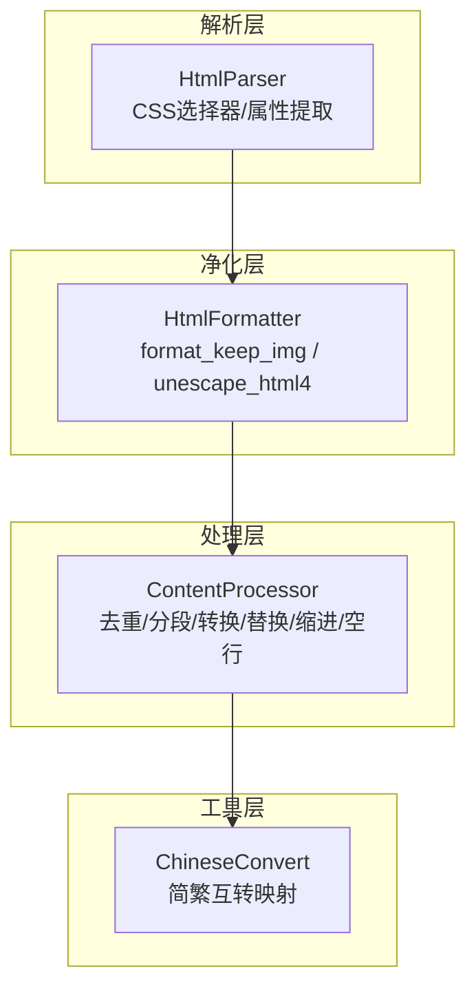
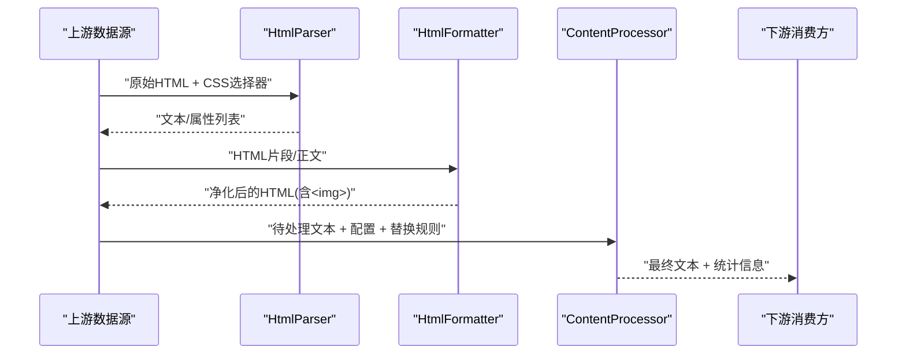
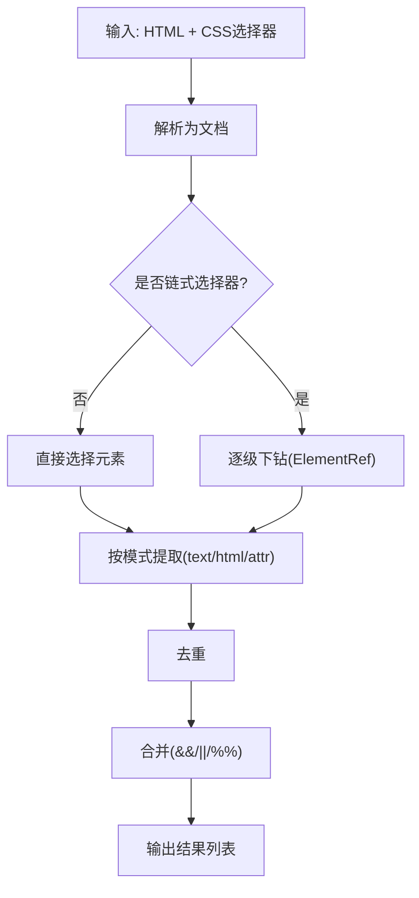
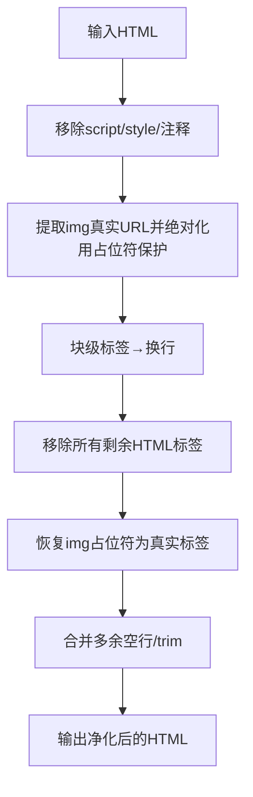
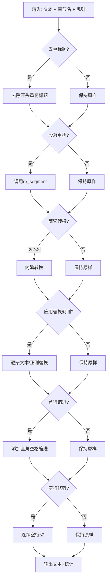
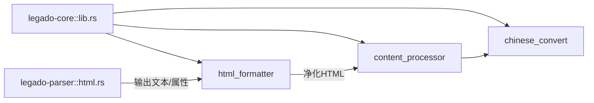

# HTML内容处理管道

<cite>
**本文引用的文件**   
- [html_formatter.rs](file://rust/legado-core/src/html_formatter.rs)
- [content_processor.rs](file://rust/legado-core/src/content_processor.rs)
- [html.rs](file://rust/legado-parser/src/html.rs)
- [lib.rs](file://rust/legado-core/src/lib.rs)
- [chinese_convert.rs](file://rust/legado-core/src/chinese_convert.rs)
</cite>

## 目录
1. [简介](#简介)
2. [项目结构](#项目结构)
3. [核心组件](#核心组件)
4. [架构总览](#架构总览)
5. [详细组件分析](#详细组件分析)
6. [依赖关系分析](#依赖关系分析)
7. [性能考量](#性能考量)
8. [故障排查指南](#故障排查指南)
9. [结论](#结论)

## 简介
本文件系统化梳理 Legado 项目中“HTML 内容处理管道”的实现与协作方式，覆盖从 HTML 解析、正文净化、实体反转义到文本后处理（去重标题、段落重排、简繁转换、替换规则、缩进与空行修剪）的完整链路。该管道由 Rust 层实现，核心位于 legado-core 与 legado-parser 两个 crate 中，既保证高性能，又避免循环依赖。

## 项目结构
- legado-parser：基于 scraper 的 HTML 解析器，提供 CSS 选择器查询、元素属性提取、链式选择器与结果合并等能力。
- legado-core：提供 HTML 正文净化器（保留 img、URL 绝对化、块级标签转换行、移除脚本样式注释）、HTML4 实体反转义、内容处理管线（去重标题、段落重排、简繁转换、替换规则、缩进、空行修剪）。
- 模块导出：legado-core 通过 lib.rs 统一暴露 html_formatter、content_processor、chinese_convert 等子模块。

图表来源
- [html.rs:1-120](file://rust/legado-parser/src/html.rs#L1-L120)
- [html_formatter.rs:1-120](file://rust/legado-core/src/html_formatter.rs#L1-L120)
- [content_processor.rs:1-120](file://rust/legado-core/src/content_processor.rs#L1-L120)
- [chinese_convert.rs:1-100](file://rust/legado-core/src/chinese_convert.rs#L1-L100)

章节来源
- [lib.rs:24-54](file://rust/legado-core/src/lib.rs#L24-L54)

## 核心组件
- HtmlParser（legado-parser）
  - 功能：解析 HTML，支持 CSS 选择器、链式选择器、@属性后缀、多组结果合并（&&、||、%%），返回文本或属性值列表。
  - 关键点：单次解析文档，逐级下钻；去重输出；错误时返回空集合或错误类型。
- HtmlFormatter（legado-core）
  - 功能：清理 HTML 但保留 ，处理懒加载属性（data-src/data-original/srcset），相对 URL 绝对化，块级标签转换行，移除其余标签，合并多余空行；并提供完整的 HTML4 实体反转义。
  - 关键点：预编译正则、占位符保护 img 标签、独立于 JS 引擎。
- ContentProcessor（legado-core）
  - 功能：编排内容后处理管线，包括去除重复标题、段落重排、简繁转换、应用替换规则（文本/正则）、首行缩进、去除多余空行；可返回统计信息。
  - 关键点：配置开关控制步骤；顺序固定且可观测；对无效正则安全跳过。
- ChineseConvert（legado-core）
  - 功能：内嵌常用汉字映射表，提供简体↔繁体转换，无外部依赖。

章节来源
- [html.rs:1-120](file://rust/legado-parser/src/html.rs#L1-L120)
- [html_formatter.rs:1-120](file://rust/legado-core/src/html_formatter.rs#L1-L120)
- [content_processor.rs:1-120](file://rust/legado-core/src/content_processor.rs#L1-L120)
- [chinese_convert.rs:1-100](file://rust/legado-core/src/chinese_convert.rs#L1-L100)

## 架构总览
下图展示从 HTML 输入到最终可读文本的端到端流程，以及各阶段的数据形态变化。

图表来源
- [html.rs:1-120](file://rust/legado-parser/src/html.rs#L1-L120)
- [html_formatter.rs:1-120](file://rust/legado-core/src/html_formatter.rs#L1-L120)
- [content_processor.rs:1-120](file://rust/legado-core/src/content_processor.rs#L1-L120)

## 详细组件分析

### HtmlParser（HTML 解析与选择）
- 能力要点
  - 单文档解析，多次选择复用 DOM，避免重复解析。
  - 支持链式选择器（多级下钻）与 @ 属性后缀（如 href、src、alt 等）。
  - 支持组合操作符 &&、||、%%（交叉合并），并自动去重。
  - 提供 get_text/get_elements/get_attr 三类接口。
- 关键流程
  - 解析选择器 → 拆分规则 → 逐级选择元素 → 按模式提取文本/HTML/属性 → 合并结果。

图表来源
- [html.rs:34-183](file://rust/legado-parser/src/html.rs#L34-L183)
- [html.rs:245-356](file://rust/legado-parser/src/html.rs#L245-L356)

章节来源
- [html.rs:1-120](file://rust/legado-parser/src/html.rs#L1-L120)
- [html.rs:184-356](file://rust/legado-parser/src/html.rs#L184-L356)

### HtmlFormatter（HTML 正文净化与实体反转义）
- 能力要点
  - format_keep_img：移除 script/style/注释，保留  并处理懒加载属性，相对 URL 绝对化，块级标签转换行，移除其他标签，合并空行。
  - unescape_html4：完整 HTML4 实体反转义（命名实体与数字实体）。
- 关键实现
  - 使用预编译正则提升性能。
  - 以占位符保护  标签，避免被后续 ALL_TAG_RE 误删。
  - 独立的 URL 绝对化逻辑，避免与 legado-parser 形成循环依赖。

图表来源
- [html_formatter.rs:67-96](file://rust/legado-core/src/html_formatter.rs#L67-L96)
- [html_formatter.rs:140-177](file://rust/legado-core/src/html_formatter.rs#L140-L177)
- [html_formatter.rs:226-278](file://rust/legado-core/src/html_formatter.rs#L226-L278)

章节来源
- [html_formatter.rs:1-120](file://rust/legado-core/src/html_formatter.rs#L1-L120)
- [html_formatter.rs:120-278](file://rust/legado-core/src/html_formatter.rs#L120-L278)

### ContentProcessor（内容处理管线）
- 能力要点
  - 可配置步骤：去重标题、段落重排、简繁转换、替换规则（文本/正则）、首行缩进、空行修剪。
  - 提供 process_with_stats 返回处理统计（原文长度、处理后长度、段落数、应用规则数）。
- 执行顺序
  - 去重标题 → 段落重排 → 简繁转换 → 替换规则 → 首行缩进 → 空行修剪。
- 健壮性
  - 无效正则跳过，空模式跳过，空章节名跳过。

图表来源
- [content_processor.rs:59-98](file://rust/legado-core/src/content_processor.rs#L59-L98)
- [content_processor.rs:125-224](file://rust/legado-core/src/content_processor.rs#L125-L224)

章节来源
- [content_processor.rs:1-120](file://rust/legado-core/src/content_processor.rs#L1-L120)
- [content_processor.rs:120-224](file://rust/legado-core/src/content_processor.rs#L120-L224)

### ChineseConvert（简繁转换）
- 能力要点
  - 内嵌常用字映射表，提供 t2s/s2t 双向转换。
  - 不依赖外部 crate，避免循环依赖。
- 在管线中的位置
  - 由 ContentProcessor 在“简繁转换”步骤调用。

章节来源
- [chinese_convert.rs:1-100](file://rust/legado-core/src/chinese_convert.rs#L1-L100)
- [content_processor.rs:146-163](file://rust/legado-core/src/content_processor.rs#L146-L163)

## 依赖关系分析
- 模块导出
  - legado-core 通过 lib.rs 暴露 html_formatter、content_processor、chinese_convert 等模块，供上层使用。
- 内部依赖
  - content_processor 依赖 chinese_convert 进行简繁转换。
  - html_formatter 自包含 URL 绝对化逻辑，避免反向依赖 legado-parser。
- 外部依赖
  - html.rs 使用 scraper 进行 HTML 解析与选择。
  - html_formatter.rs 与 content_processor.rs 使用 regex 进行文本处理。

图表来源
- [lib.rs:24-54](file://rust/legado-core/src/lib.rs#L24-L54)
- [content_processor.rs:146-163](file://rust/legado-core/src/content_processor.rs#L146-L163)
- [html.rs:1-120](file://rust/legado-parser/src/html.rs#L1-L120)

章节来源
- [lib.rs:24-54](file://rust/legado-core/src/lib.rs#L24-L54)

## 性能考量
- 正则预编译：html_formatter 与 content_processor 大量使用 LazyLock 预编译正则，减少重复编译开销。
- DOM 复用：HtmlParser 仅解析一次文档，链式选择器复用 ElementRef，避免重复解析。
- 字符串优化：占位符保护 img 标签，避免多次重建；空行修剪采用线性扫描。
- 可选步骤：ContentProcessor 允许关闭非必要步骤，降低处理成本。
- 建议
  - 批量处理时复用处理器实例与正则。
  - 大段 HTML 优先使用 HtmlParser 精准提取，再交给 HtmlFormatter 净化。
  - 替换规则尽量使用文本替换而非复杂正则，必要时缓存已编译的正则。

[本节为通用指导，无需源码引用]

## 故障排查指南
- 选择器无效
  - 现象：get_attr/get_text 返回错误或空结果。
  - 排查：检查 CSS 选择器语法；确认元素存在；确认链式选择器层级正确。
- 图片未显示
  - 现象：format_keep_img 后  缺失或链接错误。
  - 排查：确认 data-src/data-original/srcset/src 优先级；检查 base_url 是否正确；确认 URL 绝对化逻辑。
- 实体未还原
  - 现象：文本中出现 &amp; 等实体。
  - 排查：确保调用 unescape_html4；检查输入是否包含实体字符。
- 替换规则无效
  - 现象：正则替换不生效。
  - 排查：检查 is_regex 标志；确认正则语法有效；空模式会被跳过。
- 缩进异常
  - 现象：已有缩进的段落被重复添加。
  - 排查：确认 add_indent 对已有缩进的判断逻辑；避免重复调用。

章节来源
- [html.rs:217-243](file://rust/legado-parser/src/html.rs#L217-L243)
- [html_formatter.rs:140-177](file://rust/legado-core/src/html_formatter.rs#L140-L177)
- [content_processor.rs:165-183](file://rust/legado-core/src/content_processor.rs#L165-L183)

## 结论
Legado 的 HTML 内容处理管道以清晰的分层与严格的顺序编排，实现了从解析、净化到后处理的完整闭环。其设计兼顾性能与可维护性：预编译正则、DOM 复用、可选步骤、健壮的错误处理。建议在工程实践中遵循“先解析、再净化、后处理”的顺序，并根据场景灵活开启/关闭处理步骤，以获得最佳效果。