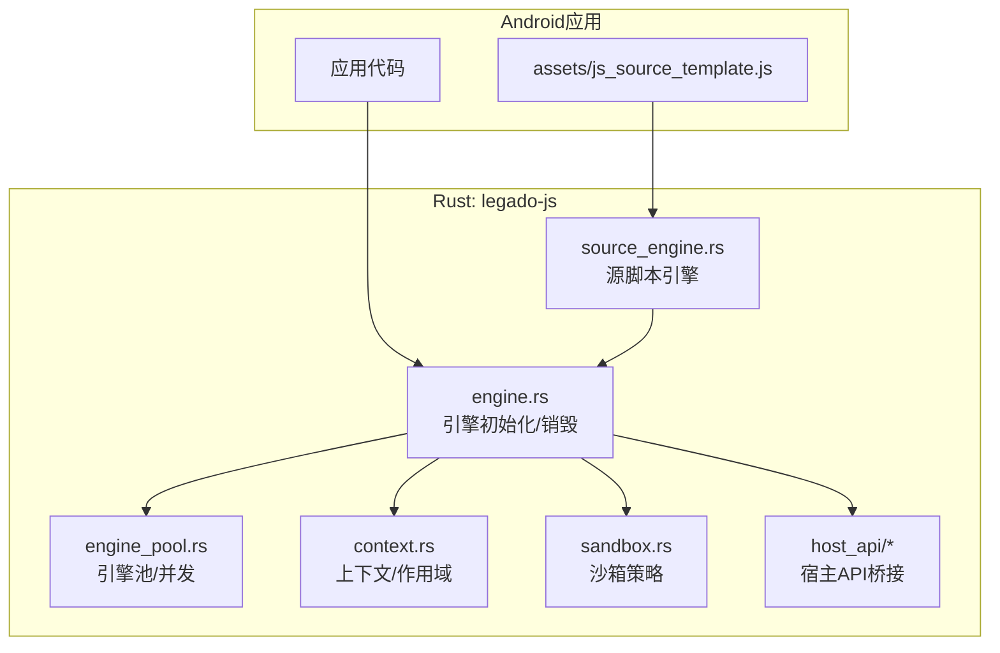
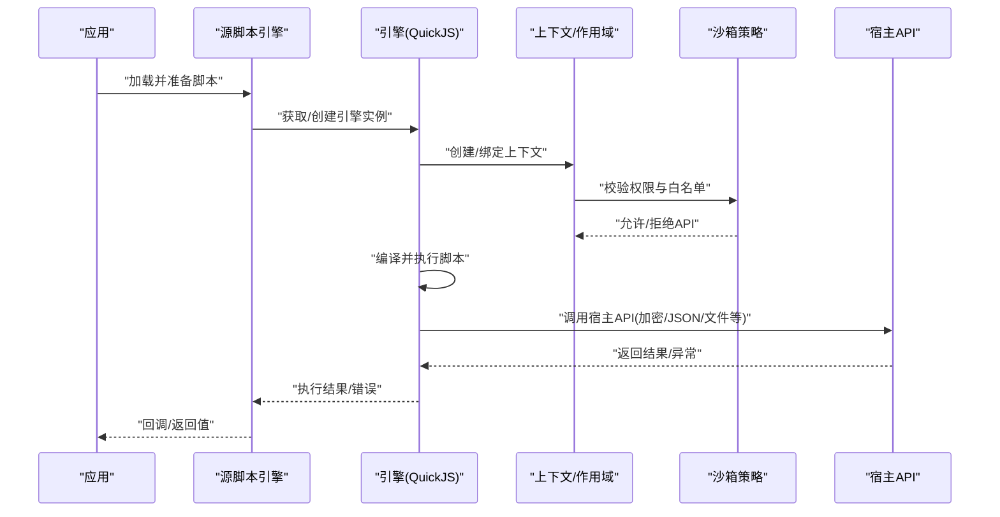
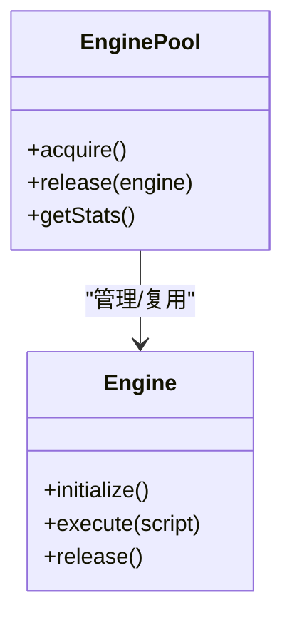
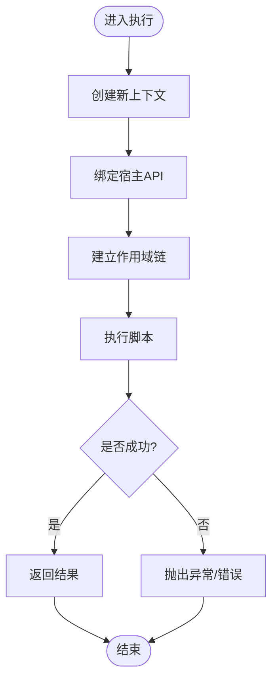
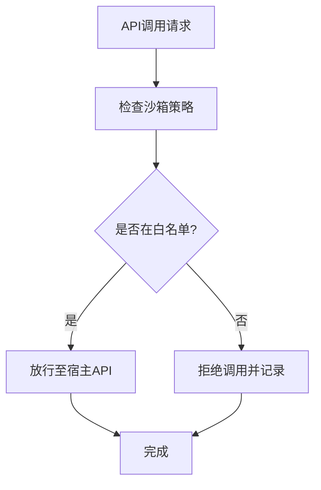
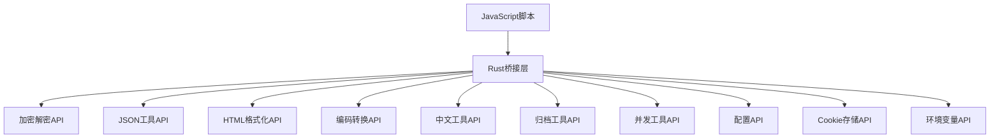
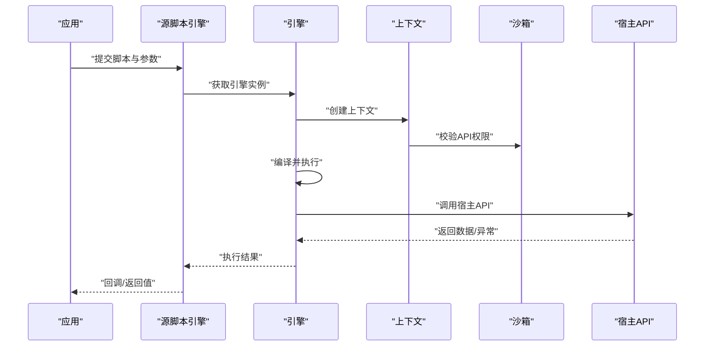
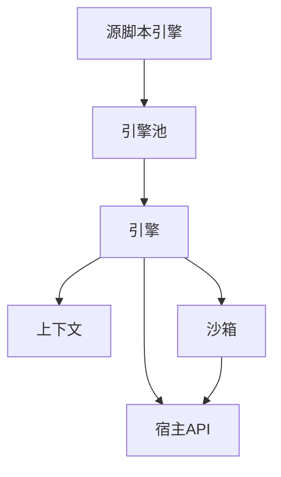

# JavaScript运行时

<cite>
**本文引用的文件**   
- [legado-js/src/lib.rs](file://rust/legado-js/src/lib.rs)
- [legado-js/src/engine.rs](file://rust/legado-js/src/engine.rs)
- [legado-js/src/engine_pool.rs](file://rust/legado-js/src/engine_pool.rs)
- [legado-js/src/context.rs](file://rust/legado-js/src/context.rs)
- [legado-js/src/sandbox.rs](file://rust/legado-js/src/sandbox.rs)
- [legado-js/src/scope.rs](file://rust/legado-js/src/scope.rs)
- [legado-js/src/source_engine.rs](file://rust/legado-js/src/source_engine.rs)
- [legado-js/src/host_api/mod.rs](file://rust/legado-js/src/host_api/mod.rs)
- [legado-js/src/host_api/crypto_api.rs](file://rust/legado-js/src/host_api/crypto_api.rs)
- [legado-js/src/host_api/file_utils.rs](file://rust/legado-js/src/host_api/file_utils.rs)
- [legado-js/src/host_api/concurrency_api.rs](file://rust/legado-js/src/host_api/concurrency_api.rs)
- [legado-js/src/host_api/config_api.rs](file://rust/legado-js/src/host_api/config_api.rs)
- [legado-js/src/host_api/misc_api.rs](file://rust/legado-js/src/host_api/misc_api.rs)
- [legado-js/src/host_api/json_utils.rs](file://rust/legado-js/src/host_api/json_utils.rs)
- [legado-js/src/host_api/html_format.rs](file://rust/legado-js/src/host_api/html_format.rs)
- [legado-js/src/host_api/encoding.rs](file://rust/legado-js/src/host_api/encoding.rs)
- [legado-js/src/host_api/chinese_utils.rs](file://rust/legado-js/src/host_api/chinese_utils.rs)
- [legado-js/src/host_api/archive_utils.rs](file://rust/legado-js/src/host_api/archive_utils.rs)
- [legado-js/src/host_api/env.rs](file://rust/legado-js/src/host_api/env.rs)
- [legado-js/src/host_api/cookie_store.rs](file://rust/legado-js/src/host_api/cookie_store.rs)
- [app/src/main/assets/js_source_template.js](file://app/src/main/assets/js_source_template.js)
</cite>

## 目录
1. [简介](#简介)
2. [项目结构](#项目结构)
3. [核心组件](#核心组件)
4. [架构总览](#架构总览)
5. [详细组件分析](#详细组件分析)
6. [依赖关系分析](#依赖关系分析)
7. [性能考量](#性能考量)
8. [故障排查指南](#故障排查指南)
9. [结论](#结论)
10. [附录](#附录)

## 简介
本文件面向Legado项目中JavaScript运行时的设计与实现，重点覆盖QuickJS引擎集成、脚本加载与执行环境、内存管理、沙箱安全机制（权限控制、API限制、资源隔离）、上下文管理（变量作用域、全局对象、内置函数扩展）、异步编程支持（Promise处理、回调机制、错误传播），以及宿主API参考（网络请求、文件操作、加密解密等）。文档同时提供脚本开发指南与安全最佳实践，帮助开发者在受限环境中编写健壮、安全的脚本。

## 项目结构
JavaScript运行时主要由Rust模块legado-js提供，负责QuickJS引擎封装、上下文与沙箱管理、宿主API桥接；Android端通过assets中的模板脚本提供示例与基础能力。关键目录与职责：
- Rust层（legado-js）：引擎生命周期、线程池、上下文隔离、沙箱策略、宿主API注册与调用桥接。
- Android层（assets）：脚本模板与示例，便于快速上手。

图表来源
- [legado-js/src/engine.rs](file://rust/legado-js/src/engine.rs)
- [legado-js/src/engine_pool.rs](file://rust/legado-js/src/engine_pool.rs)
- [legado-js/src/context.rs](file://rust/legado-js/src/context.rs)
- [legado-js/src/sandbox.rs](file://rust/legado-js/src/sandbox.rs)
- [legado-js/src/host_api/mod.rs](file://rust/legado-js/src/host_api/mod.rs)
- [legado-js/src/source_engine.rs](file://rust/legado-js/src/source_engine.rs)
- [app/src/main/assets/js_source_template.js](file://app/src/main/assets/js_source_template.js)

章节来源
- [legado-js/src/lib.rs](file://rust/legado-js/src/lib.rs)
- [legado-js/src/engine.rs](file://rust/legado-js/src/engine.rs)
- [legado-js/src/engine_pool.rs](file://rust/legado-js/src/engine_pool.rs)
- [legado-js/src/context.rs](file://rust/legado-js/src/context.rs)
- [legado-js/src/sandbox.rs](file://rust/legado-js/src/sandbox.rs)
- [legado-js/src/source_engine.rs](file://rust/legado-js/src/source_engine.rs)
- [app/src/main/assets/js_source_template.js](file://app/src/main/assets/js_source_template.js)

## 核心组件
- 引擎与引擎池：负责QuickJS实例的创建、配置、复用与并发调度，避免频繁创建销毁带来的开销。
- 上下文与作用域：为每个脚本或任务分配独立上下文，隔离变量与作用域，防止跨脚本污染。
- 沙箱策略：限制可访问的宿主API、文件系统路径、网络目标等，确保脚本在最小权限下运行。
- 宿主API桥接：将Rust侧能力（加密、JSON、HTML格式化、编码转换、并发工具、配置读写、Cookie存储等）暴露给JS。
- 源脚本引擎：针对“源脚本”场景的专用入口，统一加载、编译、执行流程。

章节来源
- [legado-js/src/engine.rs](file://rust/legado-js/src/engine.rs)
- [legado-js/src/engine_pool.rs](file://rust/legado-js/src/engine_pool.rs)
- [legado-js/src/context.rs](file://rust/legado-js/src/context.rs)
- [legado-js/src/sandbox.rs](file://rust/legado-js/src/sandbox.rs)
- [legado-js/src/host_api/mod.rs](file://rust/legado-js/src/host_api/mod.rs)
- [legado-js/src/source_engine.rs](file://rust/legado-js/src/source_engine.rs)

## 架构总览
下图展示从应用到QuickJS引擎及宿主API的整体交互流程，包括脚本加载、上下文隔离、沙箱校验、API调用与结果回传。

图表来源
- [legado-js/src/source_engine.rs](file://rust/legado-js/src/source_engine.rs)
- [legado-js/src/engine.rs](file://rust/legado-js/src/engine.rs)
- [legado-js/src/context.rs](file://rust/legado-js/src/context.rs)
- [legado-js/src/sandbox.rs](file://rust/legado-js/src/sandbox.rs)
- [legado-js/src/host_api/mod.rs](file://rust/legado-js/src/host_api/mod.rs)

## 详细组件分析

### 引擎与引擎池
- 引擎：封装QuickJS的初始化、配置、脚本编译与执行、异常捕获、内存释放。
- 引擎池：维护多个引擎实例，按并发需求分配，减少锁竞争与重复初始化成本。

图表来源
- [legado-js/src/engine.rs](file://rust/legado-js/src/engine.rs)
- [legado-js/src/engine_pool.rs](file://rust/legado-js/src/engine_pool.rs)

章节来源
- [legado-js/src/engine.rs](file://rust/legado-js/src/engine.rs)
- [legado-js/src/engine_pool.rs](file://rust/legado-js/src/engine_pool.rs)

### 上下文与作用域
- 上下文：为每个脚本任务创建独立的执行环境，包含全局对象、内置对象、宿主API映射。
- 作用域：支持局部变量隔离，避免跨脚本状态泄漏。

图表来源
- [legado-js/src/context.rs](file://rust/legado-js/src/context.rs)

章节来源
- [legado-js/src/context.rs](file://rust/legado-js/src/context.rs)

### 沙箱策略
- 权限控制：基于白名单限制可调用的宿主API集合。
- 资源隔离：限制文件系统访问范围、网络目标域名、内存使用上限等。
- 动态开关：根据脚本类型（如源脚本）启用不同策略。

图表来源
- [legado-js/src/sandbox.rs](file://rust/legado-js/src/sandbox.rs)
- [legado-js/src/host_api/mod.rs](file://rust/legado-js/src/host_api/mod.rs)

章节来源
- [legado-js/src/sandbox.rs](file://rust/legado-js/src/sandbox.rs)
- [legado-js/src/host_api/mod.rs](file://rust/legado-js/src/host_api/mod.rs)

### 宿主API桥接
- 加密解密：对称与非对称算法、哈希、摘要等。
- JSON工具：序列化/反序列化、路径查询。
- HTML格式化：清洗、转义、提取。
- 编码转换：UTF-8、GBK、Base64等。
- 中文工具：繁简转换、拼音等。
- 归档工具：压缩/解压常用格式。
- 并发工具：协程/任务调度、限流、超时。
- 配置读写：持久化键值对。
- Cookie存储：会话保持。
- 环境变量：读取系统/应用环境信息。

图表来源
- [legado-js/src/host_api/crypto_api.rs](file://rust/legado-js/src/host_api/crypto_api.rs)
- [legado-js/src/host_api/json_utils.rs](file://rust/legado-js/src/host_api/json_utils.rs)
- [legado-js/src/host_api/html_format.rs](file://rust/legado-js/src/host_api/html_format.rs)
- [legado-js/src/host_api/encoding.rs](file://rust/legado-js/src/host_api/encoding.rs)
- [legado-js/src/host_api/chinese_utils.rs](file://rust/legado-js/src/host_api/chinese_utils.rs)
- [legado-js/src/host_api/archive_utils.rs](file://rust/legado-js/src/host_api/archive_utils.rs)
- [legado-js/src/host_api/concurrency_api.rs](file://rust/legado-js/src/host_api/concurrency_api.rs)
- [legado-js/src/host_api/config_api.rs](file://rust/legado-js/src/host_api/config_api.rs)
- [legado-js/src/host_api/cookie_store.rs](file://rust/legado-js/src/host_api/cookie_store.rs)
- [legado-js/src/host_api/env.rs](file://rust/legado-js/src/host_api/env.rs)

章节来源
- [legado-js/src/host_api/mod.rs](file://rust/legado-js/src/host_api/mod.rs)
- [legado-js/src/host_api/crypto_api.rs](file://rust/legado-js/src/host_api/crypto_api.rs)
- [legado-js/src/host_api/json_utils.rs](file://rust/legado-js/src/host_api/json_utils.rs)
- [legado-js/src/host_api/html_format.rs](file://rust/legado-js/src/host_api/html_format.rs)
- [legado-js/src/host_api/encoding.rs](file://rust/legado-js/src/host_api/encoding.rs)
- [legado-js/src/host_api/chinese_utils.rs](file://rust/legado-js/src/host_api/chinese_utils.rs)
- [legado-js/src/host_api/archive_utils.rs](file://rust/legado-js/src/host_api/archive_utils.rs)
- [legado-js/src/host_api/concurrency_api.rs](file://rust/legado-js/src/host_api/concurrency_api.rs)
- [legado-js/src/host_api/config_api.rs](file://rust/legado-js/src/host_api/config_api.rs)
- [legado-js/src/host_api/cookie_store.rs](file://rust/legado-js/src/host_api/cookie_store.rs)
- [legado-js/src/host_api/env.rs](file://rust/legado-js/src/host_api/env.rs)

### 源脚本引擎
- 统一入口：负责脚本加载、编译、执行、错误收集与结果返回。
- 与上下文/沙箱协作：确保每次执行都在隔离且受控的环境中运行。

图表来源
- [legado-js/src/source_engine.rs](file://rust/legado-js/src/source_engine.rs)
- [legado-js/src/engine.rs](file://rust/legado-js/src/engine.rs)
- [legado-js/src/context.rs](file://rust/legado-js/src/context.rs)
- [legado-js/src/sandbox.rs](file://rust/legado-js/src/sandbox.rs)
- [legado-js/src/host_api/mod.rs](file://rust/legado-js/src/host_api/mod.rs)

章节来源
- [legado-js/src/source_engine.rs](file://rust/legado-js/src/source_engine.rs)

## 依赖关系分析
- 引擎依赖上下文与沙箱：执行前必须完成权限校验与环境绑定。
- 宿主API依赖沙箱白名单：仅允许被授权的API被调用。
- 源脚本引擎依赖引擎池：提高并发性能与资源利用率。

图表来源
- [legado-js/src/source_engine.rs](file://rust/legado-js/src/source_engine.rs)
- [legado-js/src/engine_pool.rs](file://rust/legado-js/src/engine_pool.rs)
- [legado-js/src/engine.rs](file://rust/legado-js/src/engine.rs)
- [legado-js/src/context.rs](file://rust/legado-js/src/context.rs)
- [legado-js/src/sandbox.rs](file://rust/legado-js/src/sandbox.rs)
- [legado-js/src/host_api/mod.rs](file://rust/legado-js/src/host_api/mod.rs)

章节来源
- [legado-js/src/source_engine.rs](file://rust/legado-js/src/source_engine.rs)
- [legado-js/src/engine_pool.rs](file://rust/legado-js/src/engine_pool.rs)
- [legado-js/src/engine.rs](file://rust/legado-js/src/engine.rs)
- [legado-js/src/context.rs](file://rust/legado-js/src/context.rs)
- [legado-js/src/sandbox.rs](file://rust/legado-js/src/sandbox.rs)
- [legado-js/src/host_api/mod.rs](file://rust/legado-js/src/host_api/mod.rs)

## 性能考量
- 引擎复用：通过引擎池减少创建/销毁开销，提升并发吞吐。
- 上下文隔离：避免共享状态导致的锁竞争与内存拷贝。
- 沙箱校验：尽量前置校验，减少无效API调用。
- I/O与CPU密集任务：通过宿主API的并发工具进行限流、超时与批量处理，避免阻塞主线程。
- 内存管理：及时释放引擎与上下文，避免长期持有导致内存增长。

[本节为通用指导，不直接分析具体文件]

## 故障排查指南
- 常见错误分类：
  - 权限错误：沙箱未授权API调用。
  - 上下文错误：作用域变量未定义或越界访问。
  - 执行错误：脚本语法错误或运行时异常。
  - 资源错误：文件/网络不可用或配额超限。
- 定位方法：
  - 查看引擎日志与异常堆栈。
  - 检查沙箱白名单配置。
  - 确认上下文初始化顺序与API绑定。
  - 验证宿主API输入参数与返回值类型。
- 修复建议：
  - 调整沙箱策略，按需开放API。
  - 增加参数校验与默认值。
  - 优化脚本逻辑，避免死循环与过度递归。
  - 合理设置超时与重试策略。

章节来源
- [legado-js/src/sandbox.rs](file://rust/legado-js/src/sandbox.rs)
- [legado-js/src/context.rs](file://rust/legado-js/src/context.rs)
- [legado-js/src/engine.rs](file://rust/legado-js/src/engine.rs)

## 结论
Legado的JavaScript运行时以QuickJS为核心，结合Rust提供的引擎池、上下文隔离与沙箱策略，构建了安全、高效、可扩展的执行环境。宿主API覆盖加密、JSON、HTML、编码、中文、归档、并发、配置、Cookie与环境等常用能力，满足脚本开发的多样化需求。通过严格的权限控制与资源隔离，确保脚本在受限环境中稳定运行。

[本节为总结性内容，不直接分析具体文件]

## 附录

### JavaScript API参考（宿主API）
- 加密解密：提供对称/非对称加密、哈希、摘要等能力，适用于数据保护与签名验证。
- JSON工具：支持序列化/反序列化与路径查询，便于数据处理与解析。
- HTML格式化：提供清洗、转义、提取等功能，用于内容处理与展示。
- 编码转换：支持多种字符集与Base64编解码，适配多语言与数据传输。
- 中文工具：繁简转换、拼音处理，提升中文内容处理能力。
- 归档工具：压缩/解压常见格式，便于资源管理与分发。
- 并发工具：协程/任务调度、限流、超时控制，提升脚本并发性能。
- 配置读写：持久化键值对，便于脚本配置与状态保存。
- Cookie存储：会话保持与状态同步，支持网络请求上下文。
- 环境变量：读取系统/应用环境信息，辅助调试与行为控制。

章节来源
- [legado-js/src/host_api/crypto_api.rs](file://rust/legado-js/src/host_api/crypto_api.rs)
- [legado-js/src/host_api/json_utils.rs](file://rust/legado-js/src/host_api/json_utils.rs)
- [legado-js/src/host_api/html_format.rs](file://rust/legado-js/src/host_api/html_format.rs)
- [legado-js/src/host_api/encoding.rs](file://rust/legado-js/src/host_api/encoding.rs)
- [legado-js/src/host_api/chinese_utils.rs](file://rust/legado-js/src/host_api/chinese_utils.rs)
- [legado-js/src/host_api/archive_utils.rs](file://rust/legado-js/src/host_api/archive_utils.rs)
- [legado-js/src/host_api/concurrency_api.rs](file://rust/legado-js/src/host_api/concurrency_api.rs)
- [legado-js/src/host_api/config_api.rs](file://rust/legado-js/src/host_api/config_api.rs)
- [legado-js/src/host_api/cookie_store.rs](file://rust/legado-js/src/host_api/cookie_store.rs)
- [legado-js/src/host_api/env.rs](file://rust/legado-js/src/host_api/env.rs)

### 脚本开发指南与安全最佳实践
- 开发指南：
  - 使用源脚本引擎提供的统一入口进行脚本加载与执行。
  - 利用上下文隔离避免变量污染，合理使用作用域。
  - 借助宿主API完成I/O、加密、JSON、HTML等常见任务。
- 安全最佳实践：
  - 严格遵循沙箱白名单，仅开放必要API。
  - 对用户输入进行校验与过滤，防止注入攻击。
  - 设置合理的超时与重试策略，避免长时间阻塞。
  - 定期清理上下文与引擎，避免内存泄漏。
  - 对敏感数据进行加密存储与传输。

章节来源
- [legado-js/src/source_engine.rs](file://rust/legado-js/src/source_engine.rs)
- [legado-js/src/sandbox.rs](file://rust/legado-js/src/sandbox.rs)
- [legado-js/src/context.rs](file://rust/legado-js/src/context.rs)
- [app/src/main/assets/js_source_template.js](file://app/src/main/assets/js_source_template.js)