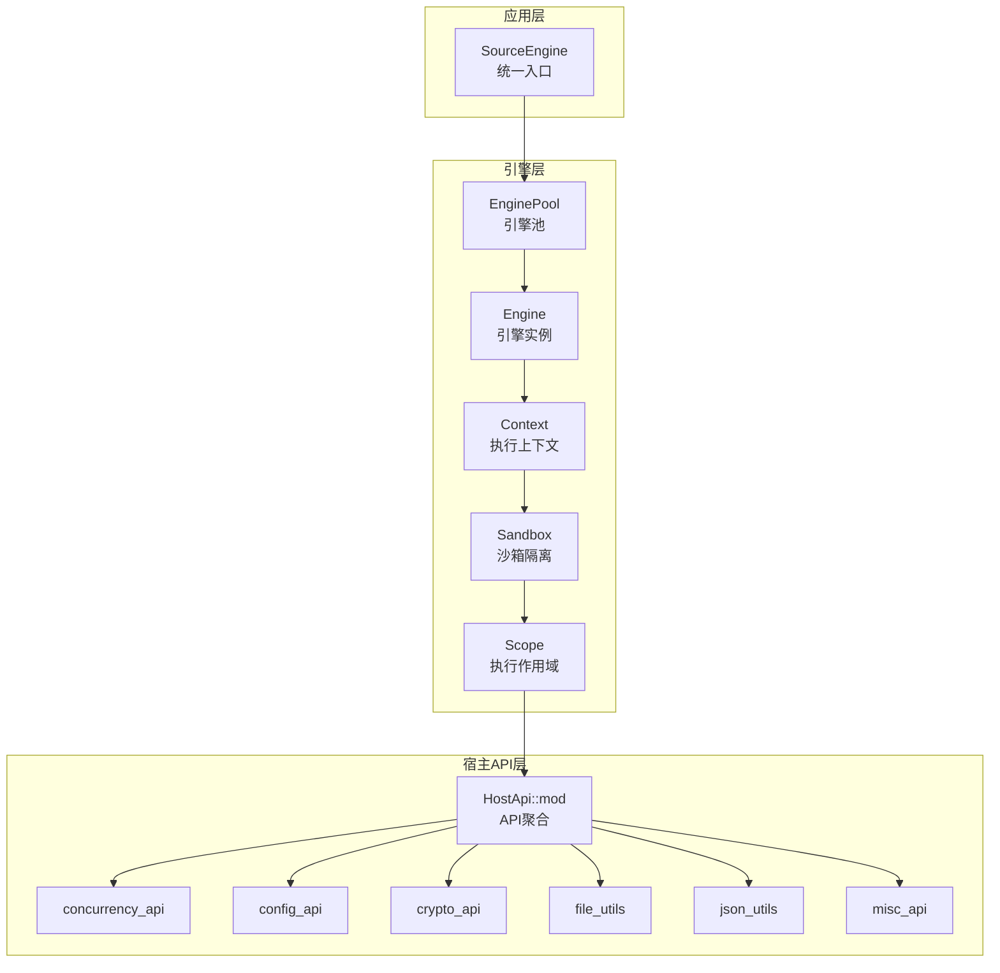
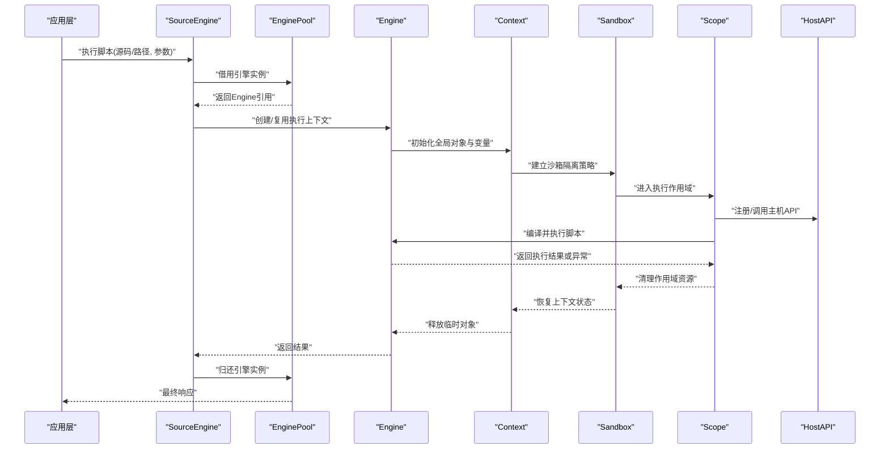
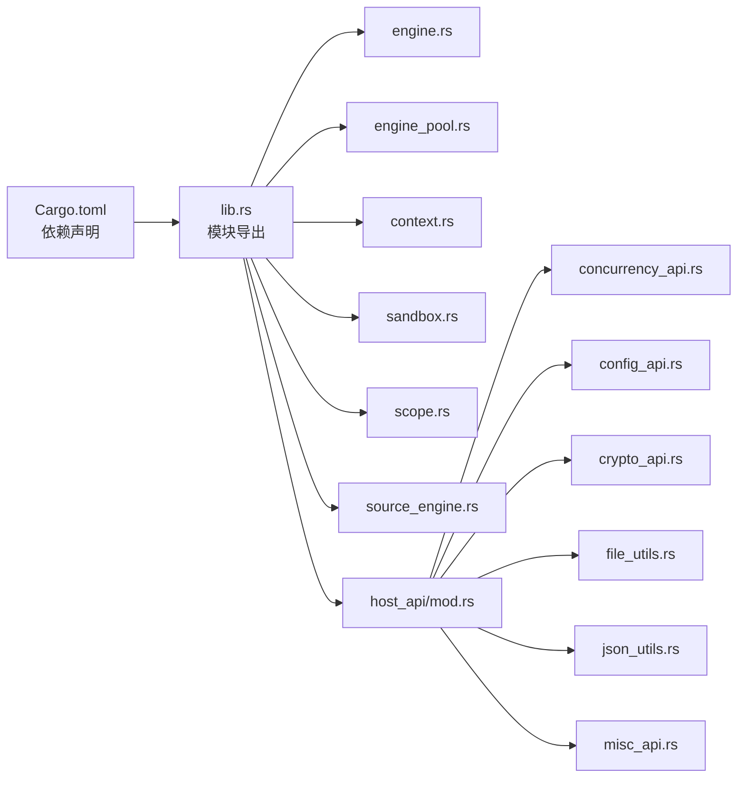

# QuickJS引擎集成

<cite>
**本文引用的文件**   
- [legado-js/src/lib.rs](file://rust/legado-js/src/lib.rs)
- [legado-js/src/engine.rs](file://rust/legado-js/src/engine.rs)
- [legado-js/src/engine_pool.rs](file://rust/legado-js/src/engine_pool.rs)
- [legado-js/src/context.rs](file://rust/legado-js/src/context.rs)
- [legado-js/src/sandbox.rs](file://rust/legado-js/src/sandbox.rs)
- [legado-js/src/scope.rs](file://rust/legado-js/src/scope.rs)
- [legado-js/src/source_engine.rs](file://rust/legado-js/src/source_engine.rs)
- [legado-js/src/host_api/mod.rs](file://rust/legado-js/src/host_api/mod.rs)
- [legado-js/src/host_api/concurrency_api.rs](file://rust/legado-js/src/host_api/concurrency_api.rs)
- [legado-js/src/host_api/config_api.rs](file://rust/legado-js/src/host_api/config_api.rs)
- [legado-js/src/host_api/crypto_api.rs](file://rust/legado-js/src/host_api/crypto_api.rs)
- [legado-js/src/host_api/file_utils.rs](file://rust/legado-js/src/host_api/file_utils.rs)
- [legado-js/src/host_api/json_utils.rs](file://rust/legado-js/src/host_api/json_utils.rs)
- [legado-js/src/host_api/misc_api.rs](file://rust/legado-js/src/host_api/misc_api.rs)
- [legado-js/Cargo.toml](file://rust/legado-js/Cargo.toml)
</cite>

## 目录
1. [简介](#简介)
2. [项目结构](#项目结构)
3. [核心组件](#核心组件)
4. [架构总览](#架构总览)
5. [详细组件分析](#详细组件分析)
6. [依赖关系分析](#依赖关系分析)
7. [性能考量](#性能考量)
8. [故障排查指南](#故障排查指南)
9. [结论](#结论)
10. [附录](#附录)

## 简介
本文件面向在Android应用中集成QuickJS脚本引擎的开发者，系统性阐述引擎初始化配置、内存池与线程安全策略、执行环境设置（全局对象、内置函数注册、扩展API绑定）、生命周期管理、引擎池化技术（连接复用、并发控制、资源隔离），以及配置选项与性能调优方法。文档同时提供常见问题诊断与解决方案，帮助读者在生产环境中稳定高效地使用QuickJS。

## 项目结构
legado-js模块是QuickJS集成的核心Rust实现，围绕“引擎实例”“上下文”“沙箱”“作用域”“主机API”“引擎池”等关键概念组织代码。整体采用分层设计：上层通过source_engine暴露统一接口；中层负责引擎创建、上下文构建与作用域管理；底层封装QuickJS交互与主机API绑定。

图表来源
- [legado-js/src/source_engine.rs](file://rust/legado-js/src/source_engine.rs)
- [legado-js/src/engine_pool.rs](file://rust/legado-js/src/engine_pool.rs)
- [legado-js/src/engine.rs](file://rust/legado-js/src/engine.rs)
- [legado-js/src/context.rs](file://rust/legado-js/src/context.rs)
- [legado-js/src/sandbox.rs](file://rust/legado-js/src/sandbox.rs)
- [legado-js/src/scope.rs](file://rust/legado-js/src/scope.rs)
- [legado-js/src/host_api/mod.rs](file://rust/legado-js/src/host_api/mod.rs)

章节来源
- [legado-js/src/lib.rs](file://rust/legado-js/src/lib.rs)
- [legado-js/Cargo.toml](file://rust/legado-js/Cargo.toml)

## 核心组件
- 引擎实例 Engine：封装QuickJS运行时实例，负责编译、执行脚本、异常捕获与资源释放。
- 执行上下文 Context：维护每个脚本执行的独立上下文，包含全局对象、变量与作用域链。
- 沙箱 Sandbox：限制脚本能力边界，隔离文件系统、网络、系统调用等敏感操作。
- 作用域 Scope：管理单次执行的生命周期，确保栈帧、临时对象正确回收。
- 主机API Host API：向脚本暴露的能力集合，包括并发、配置、加密、文件、JSON、通用工具等。
- 引擎池 EnginePool：管理多个Engine实例的创建、借用、归还与并发访问，提升吞吐并降低开销。
- 源引擎 SourceEngine：对外统一入口，屏蔽内部细节，提供脚本加载、执行、结果返回的高层API。

章节来源
- [legado-js/src/engine.rs](file://rust/legado-js/src/engine.rs)
- [legado-js/src/context.rs](file://rust/legado-js/src/context.rs)
- [legado-js/src/sandbox.rs](file://rust/legado-js/src/sandbox.rs)
- [legado-js/src/scope.rs](file://rust/legado-js/src/scope.rs)
- [legado-js/src/host_api/mod.rs](file://rust/legado-js/src/host_api/mod.rs)
- [legado-js/src/engine_pool.rs](file://rust/legado-js/src/engine_pool.rs)
- [legado-js/src/source_engine.rs](file://rust/legado-js/src/source_engine.rs)

## 架构总览
下图展示了从应用调用到脚本执行的完整流程，涵盖引擎池获取、上下文构建、沙箱隔离、作用域执行与结果返回。

图表来源
- [legado-js/src/source_engine.rs](file://rust/legado-js/src/source_engine.rs)
- [legado-js/src/engine_pool.rs](file://rust/legado-js/src/engine_pool.rs)
- [legado-js/src/engine.rs](file://rust/legado-js/src/engine.rs)
- [legado-js/src/context.rs](file://rust/legado-js/src/context.rs)
- [legado-js/src/sandbox.rs](file://rust/legado-js/src/sandbox.rs)
- [legado-js/src/scope.rs](file://rust/legado-js/src/scope.rs)
- [legado-js/src/host_api/mod.rs](file://rust/legado-js/src/host_api/mod.rs)

## 详细组件分析

### 引擎实例 Engine
- 职责：封装QuickJS运行时，提供脚本编译、执行、异常处理与资源释放。
- 关键点：
  - 内存管理：通过作用域与上下文协作，避免内存泄漏；必要时显式释放大对象。
  - 线程安全：Engine实例通常非线程共享，需通过EnginePool进行借用与归还。
  - 错误处理：将QuickJS异常转换为Rust错误类型，便于上层统一处理。
- 优化建议：
  - 预编译常用脚本片段，减少重复解析开销。
  - 合理设置超时与最大递归深度，防止恶意脚本占用资源。

章节来源
- [legado-js/src/engine.rs](file://rust/legado-js/src/engine.rs)

### 执行上下文 Context
- 职责：维护脚本执行的全局对象、变量与作用域链。
- 关键点：
  - 全局对象配置：注入宿主提供的API与常量，限制危险能力。
  - 变量隔离：不同上下文间数据不共享，保证安全性。
  - 生命周期：与Engine绑定，随Engine销毁而释放。
- 优化建议：
  - 复用Context以减少创建开销，但需注意状态污染风险。

章节来源
- [legado-js/src/context.rs](file://rust/legado-js/src/context.rs)

### 沙箱 Sandbox
- 职责：为脚本提供受限的执行环境，隔离敏感操作。
- 关键点：
  - 能力白名单：仅允许必要的API调用。
  - 资源限制：限制CPU、内存、I/O访问范围。
  - 动态策略：根据脚本来源或用户配置调整沙箱强度。
- 优化建议：
  - 使用最小权限原则，按需启用功能。

章节来源
- [legado-js/src/sandbox.rs](file://rust/legado-js/src/sandbox.rs)

### 作用域 Scope
- 职责：管理单次执行的作用域，确保临时对象及时回收。
- 关键点：
  - 栈帧管理：记录局部变量与函数调用链。
  - 自动清理：退出作用域时释放所有临时资源。
  - 异常安全：即使发生异常也能正确清理。
- 优化建议：
  - 避免长时间持有作用域引用，防止内存峰值过高。

章节来源
- [legado-js/src/scope.rs](file://rust/legado-js/src/scope.rs)

### 主机API Host API
- 职责：向脚本暴露宿主能力，如并发、配置、加密、文件、JSON、通用工具等。
- 关键点：
  - 模块化设计：按功能划分API模块，便于扩展与维护。
  - 类型安全：Rust类型与JS值之间安全转换。
  - 错误传播：将Rust错误转换为JS异常，便于脚本捕获。
- 优化建议：
  - 批量操作API，减少跨语言调用开销。

章节来源
- [legado-js/src/host_api/mod.rs](file://rust/legado-js/src/host_api/mod.rs)
- [legado-js/src/host_api/concurrency_api.rs](file://rust/legado-js/src/host_api/concurrency_api.rs)
- [legado-js/src/host_api/config_api.rs](file://rust/legado-js/src/host_api/config_api.rs)
- [legado-js/src/host_api/crypto_api.rs](file://rust/legado-js/src/host_api/crypto_api.rs)
- [legado-js/src/host_api/file_utils.rs](file://rust/legado-js/src/host_api/file_utils.rs)
- [legado-js/src/host_api/json_utils.rs](file://rust/legado-js/src/host_api/json_utils.rs)
- [legado-js/src/host_api/misc_api.rs](file://rust/legado-js/src/host_api/misc_api.rs)

### 引擎池 EnginePool
- 职责：管理多个Engine实例的创建、借用、归还与并发访问。
- 关键点：
  - 连接复用：避免频繁创建销毁Engine，提升性能。
  - 并发控制：使用锁或无锁队列保证线程安全。
  - 资源隔离：每个Engine独立，防止状态污染。
- 优化建议：
  - 根据CPU核数与负载动态调整池大小。
  - 监控池命中率与等待时间，优化配置。

章节来源
- [legado-js/src/engine_pool.rs](file://rust/legado-js/src/engine_pool.rs)

### 源引擎 SourceEngine
- 职责：对外统一入口，提供脚本加载、执行、结果返回的高层API。
- 关键点：
  - 抽象封装：隐藏EnginePool、Context、Sandbox等内部细节。
  - 错误处理：统一异常类型与日志记录。
  - 配置管理：支持运行时配置与持久化。
- 优化建议：
  - 缓存热点脚本与编译结果。
  - 异步执行长耗时任务，避免阻塞主线程。

章节来源
- [legado-js/src/source_engine.rs](file://rust/legado-js/src/source_engine.rs)

## 依赖关系分析
legado-js模块依赖Rust标准库与QuickJS绑定库，通过Cargo.toml声明依赖关系。各组件间耦合度低，遵循单一职责原则。

图表来源
- [legado-js/Cargo.toml](file://rust/legado-js/Cargo.toml)
- [legado-js/src/lib.rs](file://rust/legado-js/src/lib.rs)

章节来源
- [legado-js/Cargo.toml](file://rust/legado-js/Cargo.toml)
- [legado-js/src/lib.rs](file://rust/legado-js/src/lib.rs)

## 性能考量
- 内存池管理：
  - 使用EnginePool复用引擎实例，减少创建销毁开销。
  - 合理设置池大小，避免过多内存占用或竞争。
- 线程安全：
  - Engine实例非线程共享，通过池化与锁机制保证并发安全。
  - 避免在脚本中持有长时间引用，防止死锁。
- 执行优化：
  - 预编译脚本，减少解析与编译时间。
  - 批量API调用，减少跨语言调用开销。
- 资源限制：
  - 设置脚本执行超时与最大递归深度。
  - 限制内存使用与I/O操作频率。
- 监控与调优：
  - 收集执行时长、内存使用、错误率等指标。
  - 根据负载动态调整池大小与超时参数。

[本节为通用指导，无需特定文件来源]

## 故障排查指南
- 常见问题：
  - 脚本执行超时：检查是否陷入死循环或无限递归，适当增加超时阈值。
  - 内存泄漏：确认作用域是否正确释放，避免持有全局引用。
  - 线程冲突：确保Engine实例不被多线程共享，使用池化机制。
  - API未找到：检查主机API是否正确注册，名称是否匹配。
  - 沙箱限制：确认脚本所需能力是否在白名单内。
- 诊断步骤：
  - 启用详细日志，记录执行过程与异常堆栈。
  - 使用调试工具定位内存占用热点。
  - 逐步禁用API，缩小问题范围。
- 解决方案：
  - 优化脚本逻辑，避免复杂计算与频繁I/O。
  - 调整引擎池配置，平衡性能与资源占用。
  - 更新主机API版本，修复已知缺陷。

章节来源
- [legado-js/src/engine.rs](file://rust/legado-js/src/engine.rs)
- [legado-js/src/engine_pool.rs](file://rust/legado-js/src/engine_pool.rs)
- [legado-js/src/host_api/mod.rs](file://rust/legado-js/src/host_api/mod.rs)

## 结论
QuickJS引擎集成通过分层设计与池化技术，实现了高性能、高安全的脚本执行环境。开发者应关注内存管理、线程安全与资源限制，结合监控与调优手段，确保生产环境的稳定性与效率。通过合理的配置与最佳实践，可充分发挥QuickJS在移动端的优势。

[本节为总结性内容，无需特定文件来源]

## 附录
- 配置选项：
  - 引擎池大小：根据CPU核数与负载调整。
  - 执行超时：默认值建议1-5秒，长任务异步化。
  - 内存限制：根据设备内存与脚本复杂度设置。
  - 沙箱策略：最小权限原则，按需启用功能。
- 最佳实践：
  - 预编译热点脚本，缓存编译结果。
  - 使用异步API执行长耗时任务。
  - 定期清理无用对象，避免内存泄漏。
  - 监控关键指标，及时发现性能瓶颈。

[本节为补充信息，无需特定文件来源]