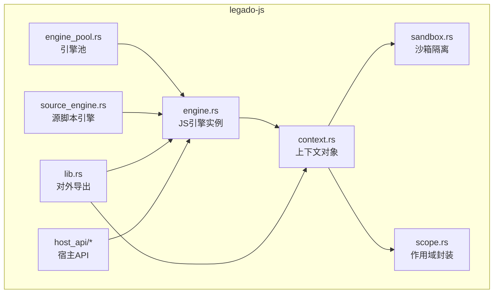
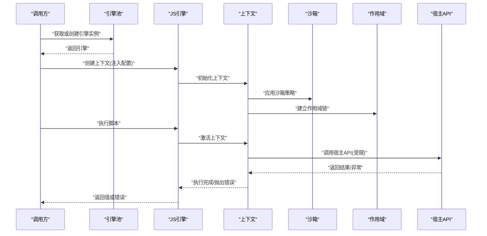
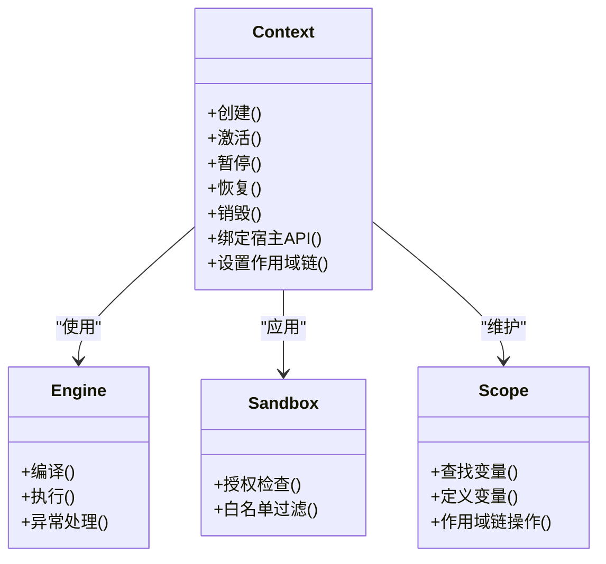
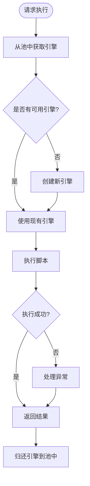
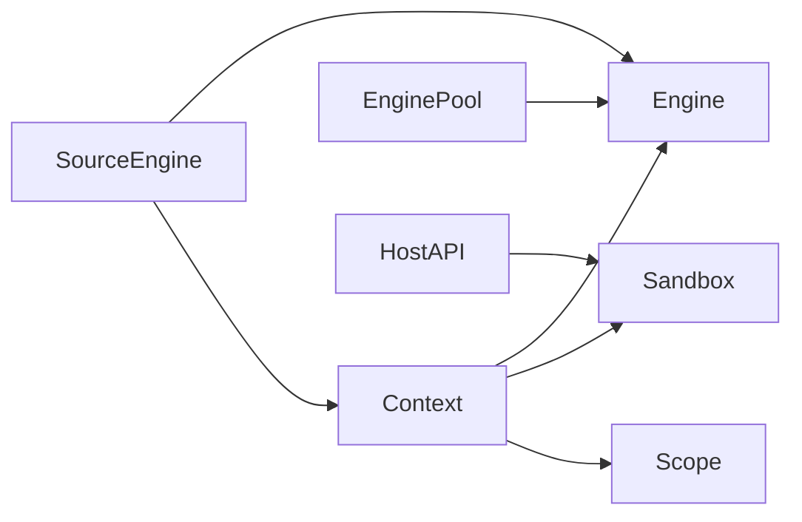

# 上下文管理

<cite>
**本文引用的文件**   
- [context.rs](file://rust/legado-js/src/context.rs)
- [engine.rs](file://rust/legado-js/src/engine.rs)
- [engine_pool.rs](file://rust/legado-js/src/engine_pool.rs)
- [sandbox.rs](file://rust/legado-js/src/sandbox.rs)
- [scope.rs](file://rust/legado-js/src/scope.rs)
- [source_engine.rs](file://rust/legado-js/src/source_engine.rs)
- [lib.rs](file://rust/legado-js/src/lib.rs)
- [concurrency_api.rs](file://rust/legado-js/src/host_api/concurrency_api.rs)
- [config_api.rs](file://rust/legado-js/src/host_api/config_api.rs)
- [misc_api.rs](file://rust/legado-js/src/host_api/misc_api.rs)
</cite>

## 目录
1. [简介](#简介)
2. [项目结构](#项目结构)
3. [核心组件](#核心组件)
4. [架构总览](#架构总览)
5. [详细组件分析](#详细组件分析)
6. [依赖关系分析](#依赖关系分析)
7. [性能考虑](#性能考虑)
8. [故障排查指南](#故障排查指南)
9. [结论](#结论)
10. [附录](#附录)

## 简介
本文件围绕 JavaScript 执行上下文管理进行系统化说明，覆盖以下主题：
- 执行上下文概念：作用域链、变量提升与闭包机制在引擎中的体现
- 上下文生命周期：创建、激活、暂停与恢复
- 变量作用域管理：局部变量、全局变量与模块级变量的存储与访问
- 上下文切换机制：协程支持、异步调用栈管理与状态保存/恢复
- 配置选项与性能优化技巧
- 调试技巧与常见问题排查

本项目通过 Rust 实现的 JS 引擎（Rhino）集成，结合沙箱隔离、作用域封装、引擎池化以及宿主 API 暴露，构建出稳定高效的脚本执行环境。

## 项目结构
JavaScript 上下文相关代码主要位于 Rust 子模块 legado-js 中，关键文件包括：
- 上下文与沙箱：context.rs、sandbox.rs、scope.rs
- 引擎与引擎池：engine.rs、engine_pool.rs
- 源脚本引擎：source_engine.rs
- 宿主 API：host_api/*（如 concurrency_api.rs、config_api.rs、misc_api.rs）
- 对外接口：lib.rs

图表来源
- [context.rs](file://rust/legado-js/src/context.rs)
- [sandbox.rs](file://rust/legado-js/src/sandbox.rs)
- [scope.rs](file://rust/legado-js/src/scope.rs)
- [engine.rs](file://rust/legado-js/src/engine.rs)
- [engine_pool.rs](file://rust/legado-js/src/engine_pool.rs)
- [source_engine.rs](file://rust/legado-js/src/source_engine.rs)
- [lib.rs](file://rust/legado-js/src/lib.rs)
- [concurrency_api.rs](file://rust/legado-js/src/host_api/concurrency_api.rs)
- [config_api.rs](file://rust/legado-js/src/host_api/config_api.rs)
- [misc_api.rs](file://rust/legado-js/src/host_api/misc_api.rs)

章节来源
- [context.rs](file://rust/legado-js/src/context.rs)
- [engine.rs](file://rust/legado-js/src/engine.rs)
- [engine_pool.rs](file://rust/legado-js/src/engine_pool.rs)
- [sandbox.rs](file://rust/legado-js/src/sandbox.rs)
- [scope.rs](file://rust/legado-js/src/scope.rs)
- [source_engine.rs](file://rust/legado-js/src/source_engine.rs)
- [lib.rs](file://rust/legado-js/src/lib.rs)

## 核心组件
- 上下文对象（Context）：封装一次脚本执行的运行环境，持有引擎实例、作用域链、全局对象、宿主 API 绑定等
- 沙箱（Sandbox）：限制脚本对宿主资源的访问范围，提供白名单能力与权限控制
- 作用域（Scope）：维护变量查找链，实现局部、模块与全局变量的隔离与可见性
- 引擎（Engine）：JS 引擎实例的包装，负责编译、执行与异常处理
- 引擎池（EnginePool）：复用引擎实例，降低创建开销，提高并发吞吐
- 源脚本引擎（SourceEngine）：面向“源”脚本的生命周期管理，包含缓存、预热与隔离策略
- 宿主 API（Host API）：向脚本暴露网络、IO、加密、并发等能力，同时受沙箱约束

章节来源
- [context.rs](file://rust/legado-js/src/context.rs)
- [sandbox.rs](file://rust/legado-js/src/sandbox.rs)
- [scope.rs](file://rust/legado-js/src/scope.rs)
- [engine.rs](file://rust/legado-js/src/engine.rs)
- [engine_pool.rs](file://rust/legado-js/src/engine_pool.rs)
- [source_engine.rs](file://rust/legado-js/src/source_engine.rs)
- [concurrency_api.rs](file://rust/legado-js/src/host_api/concurrency_api.rs)
- [config_api.rs](file://rust/legado-js/src/host_api/config_api.rs)
- [misc_api.rs](file://rust/legado-js/src/host_api/misc_api.rs)

## 架构总览
下图展示了从上层调用到 JS 引擎执行的关键路径，以及上下文、沙箱与作用域的协作方式。

图表来源
- [engine.rs](file://rust/legado-js/src/engine.rs)
- [context.rs](file://rust/legado-js/src/context.rs)
- [sandbox.rs](file://rust/legado-js/src/sandbox.rs)
- [scope.rs](file://rust/legado-js/src/scope.rs)
- [concurrency_api.rs](file://rust/legado-js/src/host_api/concurrency_api.rs)

## 详细组件分析

### 上下文对象（Context）
- 职责：封装一次脚本执行的环境，管理引擎实例、全局对象、作用域链、宿主 API 绑定、异常上下文信息
- 关键点：
  - 创建阶段：初始化引擎、注入配置、准备全局对象与宿主 API
  - 激活阶段：设置当前作用域链，绑定执行上下文
  - 暂停/恢复：在异步或协程场景下保存执行状态，以便后续恢复
  - 销毁阶段：释放资源、清理引用，避免内存泄漏

图表来源
- [context.rs](file://rust/legado-js/src/context.rs)
- [engine.rs](file://rust/legado-js/src/engine.rs)
- [sandbox.rs](file://rust/legado-js/src/sandbox.rs)
- [scope.rs](file://rust/legado-js/src/scope.rs)

章节来源
- [context.rs](file://rust/legado-js/src/context.rs)

### 沙箱（Sandbox）
- 职责：限制脚本对宿主能力的访问，确保安全性与稳定性
- 关键点：
  - 白名单机制：仅允许配置的 API 被调用
  - 参数校验：对传入参数进行类型与范围检查
  - 资源隔离：限制文件系统、网络、线程等敏感操作

章节来源
- [sandbox.rs](file://rust/legado-js/src/sandbox.rs)

### 作用域（Scope）
- 职责：维护变量查找链，实现局部、模块与全局变量的隔离与可见性
- 关键点：
  - 变量提升：在创建阶段预解析声明，影响变量可用时机
  - 闭包：捕获外层作用域变量，形成持久化的变量引用
  - 作用域链：按层级查找变量，保证命名空间隔离

章节来源
- [scope.rs](file://rust/legado-js/src/scope.rs)

### 引擎（Engine）与引擎池（EnginePool）
- 引擎：负责脚本编译与执行，处理异常与日志
- 引擎池：复用引擎实例，减少创建成本，支持并发执行

图表来源
- [engine.rs](file://rust/legado-js/src/engine.rs)
- [engine_pool.rs](file://rust/legado-js/src/engine_pool.rs)

章节来源
- [engine.rs](file://rust/legado-js/src/engine.rs)
- [engine_pool.rs](file://rust/legado-js/src/engine_pool.rs)

### 源脚本引擎（SourceEngine）
- 职责：为“源”脚本提供专用生命周期管理，包括缓存、预热、隔离与版本兼容
- 关键点：
  - 缓存策略：避免重复编译，提升启动速度
  - 预热机制：提前加载常用模块，减少首次延迟
  - 隔离策略：不同源的上下文互不干扰

章节来源
- [source_engine.rs](file://rust/legado-js/src/source_engine.rs)

### 宿主 API（Host API）
- 职责：向脚本暴露系统能力（如并发、配置、通用工具），同时受沙箱约束
- 关键点：
  - 并发 API：协程调度、任务队列、异步回调
  - 配置 API：读取/写入运行时配置
  - 通用工具：字符串、日期、加密等常用功能

章节来源
- [concurrency_api.rs](file://rust/legado-js/src/host_api/concurrency_api.rs)
- [config_api.rs](file://rust/legado-js/src/host_api/config_api.rs)
- [misc_api.rs](file://rust/legado-js/src/host_api/misc_api.rs)

## 依赖关系分析
- 上下文依赖引擎、沙箱与作用域，构成执行环境的核心三角
- 引擎池依赖引擎，提供复用与并发能力
- 源脚本引擎依赖引擎与上下文，提供高级生命周期管理
- 宿主 API 依赖沙箱，确保安全边界

图表来源
- [context.rs](file://rust/legado-js/src/context.rs)
- [engine.rs](file://rust/legado-js/src/engine.rs)
- [engine_pool.rs](file://rust/legado-js/src/engine_pool.rs)
- [sandbox.rs](file://rust/legado-js/src/sandbox.rs)
- [scope.rs](file://rust/legado-js/src/scope.rs)
- [source_engine.rs](file://rust/legado-js/src/source_engine.rs)
- [concurrency_api.rs](file://rust/legado-js/src/host_api/concurrency_api.rs)

章节来源
- [context.rs](file://rust/legado-js/src/context.rs)
- [engine.rs](file://rust/legado-js/src/engine.rs)
- [engine_pool.rs](file://rust/legado-js/src/engine_pool.rs)
- [sandbox.rs](file://rust/legado-js/src/sandbox.rs)
- [scope.rs](file://rust/legado-js/src/scope.rs)
- [source_engine.rs](file://rust/legado-js/src/source_engine.rs)
- [concurrency_api.rs](file://rust/legado-js/src/host_api/concurrency_api.rs)

## 性能考虑
- 引擎池化：复用引擎实例，减少创建与销毁开销
- 作用域最小化：仅在需要时创建作用域，避免不必要的变量提升与闭包捕获
- 沙箱白名单：限制 API 调用范围，减少安全检查成本
- 异步执行：利用协程与任务队列，避免阻塞主线程
- 缓存策略：对频繁使用的脚本进行编译缓存与预热

## 故障排查指南
- 常见错误：
  - 作用域未定义：检查变量提升与作用域链是否正确建立
  - 闭包泄漏：确认外层变量是否被意外保留
  - 沙箱拒绝：核对宿主 API 白名单与权限配置
  - 引擎耗尽：检查引擎池大小与回收策略
- 调试技巧：
  - 启用详细日志：记录上下文创建、激活、暂停与恢复过程
  - 断点调试：在关键 API 调用处设置断点，观察变量状态
  - 性能分析：监控引擎池命中率与脚本执行耗时

## 结论
本项目的 JavaScript 上下文管理通过上下文对象、沙箱隔离、作用域封装、引擎池化与宿主 API 暴露，构建了安全、高效、可扩展的脚本执行环境。合理配置与优化可显著提升性能与稳定性。

## 附录
- 术语表：
  - 执行上下文：脚本执行时的运行环境
  - 作用域链：变量查找的层级结构
  - 闭包：捕获外层作用域变量的函数
  - 协程：轻量级并发单元
  - 沙箱：限制脚本能力的隔离环境