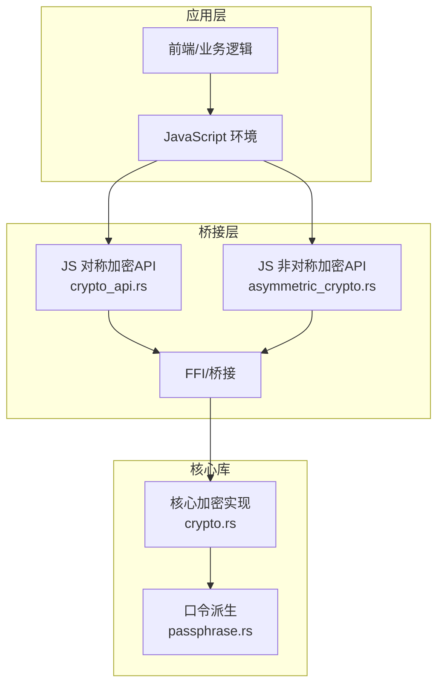
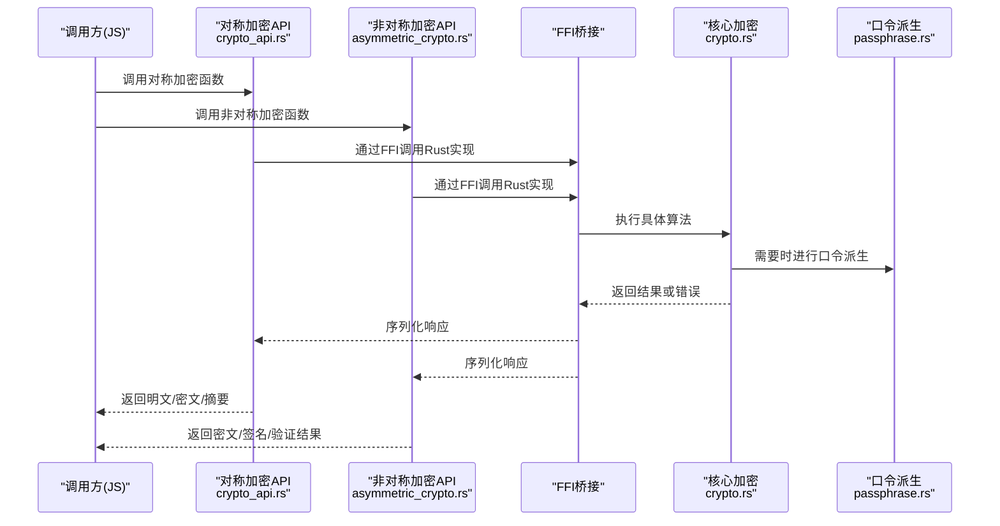
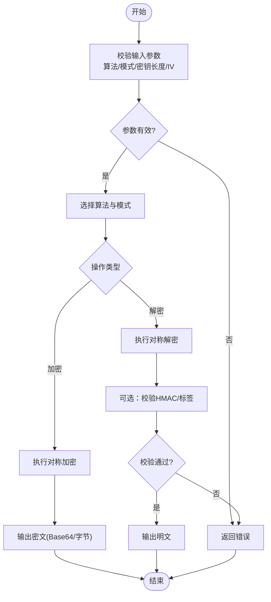
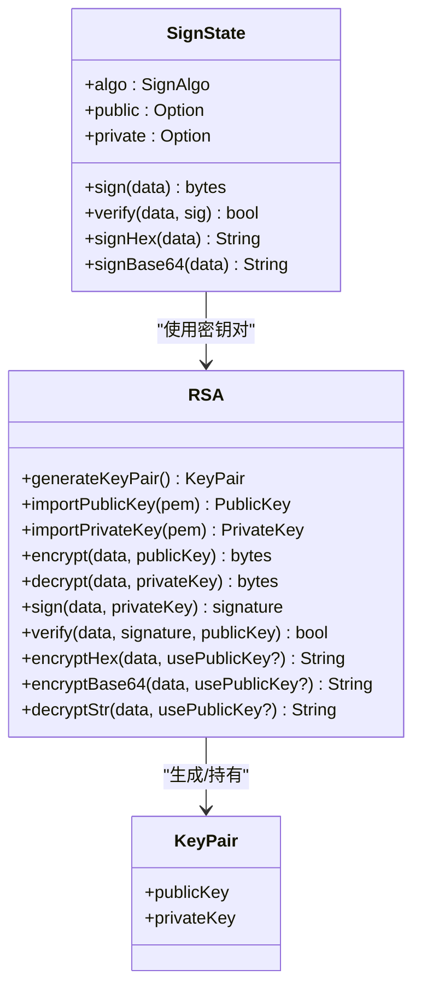
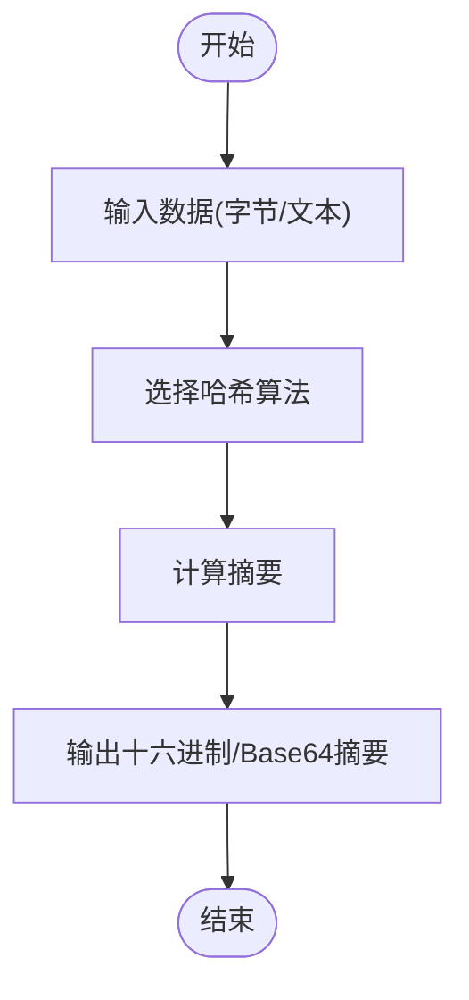
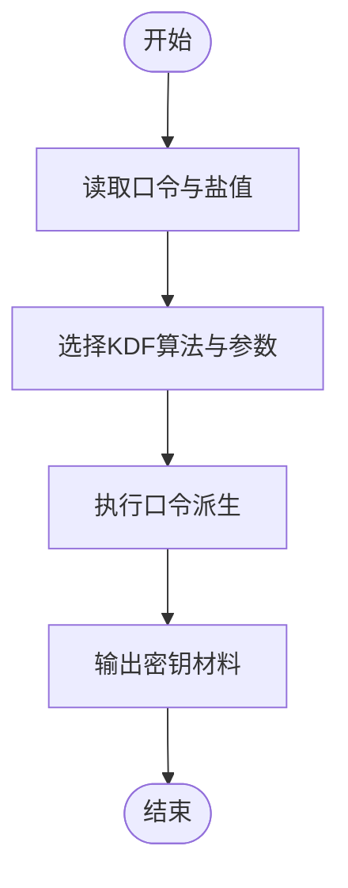
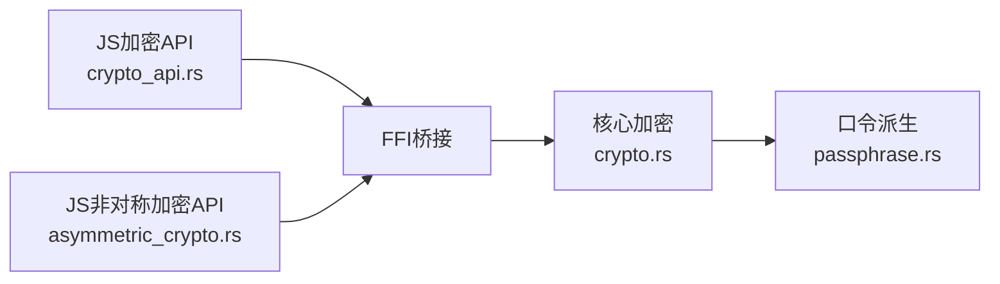

# 加密解密API

<cite>
**本文引用的文件**   
- [rust/legado-core/src/crypto.rs](file://rust/legado-core/src/crypto.rs)
- [rust/legado-js/src/host_api/crypto_api.rs](file://rust/legado-js/src/host_api/crypto_api.rs)
- [rust/legado-js/src/host_api/asymmetric_crypto.rs](file://rust/legado-js/src/host_api/asymmetric_crypto.rs)
- [rust/legado-core/src/passphrase.rs](file://rust/legado-core/src/passphrase.rs)
</cite>

## 更新摘要
**变更内容**   
- 新增完整的RSA非对称加密JS API实现，支持加密/解密、数字签名与验证、长文本分段处理
- 增强了现有加密API文档，包含新的非对称加密功能
- 添加了RSA密钥管理、填充模式支持和多种算法选择
- 完善了错误处理和输入验证机制

## 目录
1. [简介](#简介)
2. [项目结构](#项目结构)
3. [核心组件](#核心组件)
4. [架构总览](#架构总览)
5. [详细组件分析](#详细组件分析)
6. [依赖关系分析](#依赖关系分析)
7. [性能考虑](#性能考虑)
8. [故障排查指南](#故障排查指南)
9. [结论](#结论)
10. [附录：API参考与示例](#附录api参考与示例)

## 简介
本文件面向Legado项目的加密解密能力，系统性梳理对称加密（AES、DES等）、非对称加密（RSA密钥生成、签名验证、数据加解密）以及哈希算法（MD5、SHA系列）的实现与使用方式。文档同时提供完整的API参考、参数说明、常见安全场景示例与安全最佳实践建议，帮助开发者在密码存储、数据完整性校验、通信安全等场景中正确选用合适的算法与模式。

**更新** 新增了完整的RSA非对称加密JS API实现，支持长文本分段处理、多种填充模式和签名验证功能。

## 项目结构
本项目将加密能力主要实现于Rust层，并通过JS桥接暴露给上层脚本与调用方。关键位置如下：
- Rust核心库：crypto.rs 提供对称与非对称加密、哈希等基础能力
- JS宿主API：crypto_api.rs 将Rust能力暴露为JS可调用接口
- 非对称加密：asymmetric_crypto.rs 提供完整的RSA加密、签名和密钥管理功能
- 口令派生：passphrase.rs 用于从口令派生密钥材料

**图示来源** 
- [rust/legado-js/src/host_api/crypto_api.rs](file://rust/legado-js/src/host_api/crypto_api.rs)
- [rust/legado-js/src/host_api/asymmetric_crypto.rs](file://rust/legado-js/src/host_api/asymmetric_crypto.rs)
- [rust/legado-core/src/crypto.rs](file://rust/legado-core/src/crypto.rs)
- [rust/legado-core/src/passphrase.rs](file://rust/legado-core/src/passphrase.rs)

**章节来源**
- [rust/legado-core/src/crypto.rs](file://rust/legado-core/src/crypto.rs)
- [rust/legado-js/src/host_api/crypto_api.rs](file://rust/legado-js/src/host_api/crypto_api.rs)
- [rust/legado-js/src/host_api/asymmetric_crypto.rs](file://rust/legado-js/src/host_api/asymmetric_crypto.rs)
- [rust/legado-core/src/passphrase.rs](file://rust/legado-core/src/passphrase.rs)

## 核心组件
- 对称加密模块：提供AES、DES等常用块加密算法的加密与解密方法，支持不同工作模式与填充策略（如CBC、ECB等），并处理IV/盐值管理。
- 非对称加密模块：**新增** 提供RSA密钥对生成、公钥/私钥导入导出、数据加解密及数字签名与验签功能，支持长文本分段处理。
- 哈希模块：提供MD5、SHA-1/224/256/384/512等摘要计算，用于数据完整性校验与指纹生成。
- 口令派生：基于口令生成稳定且安全的密钥材料，便于用户口令到加密密钥的转换。

**更新** 非对称加密模块现已完整实现RSA功能，包括密钥管理、分段加解密和签名验证。

**章节来源**
- [rust/legado-core/src/crypto.rs](file://rust/legado-core/src/crypto.rs)
- [rust/legado-js/src/host_api/asymmetric_crypto.rs](file://rust/legado-js/src/host_api/asymmetric_crypto.rs)
- [rust/legado-core/src/passphrase.rs](file://rust/legado-core/src/passphrase.rs)

## 架构总览
下图展示从JS调用到Rust核心实现的端到端流程，包括参数校验、算法选择、数据编解码与错误返回。

**图示来源** 
- [rust/legado-js/src/host_api/crypto_api.rs](file://rust/legado-js/src/host_api/crypto_api.rs)
- [rust/legado-js/src/host_api/asymmetric_crypto.rs](file://rust/legado-js/src/host_api/asymmetric_crypto.rs)
- [rust/legado-core/src/crypto.rs](file://rust/legado-core/src/crypto.rs)
- [rust/legado-core/src/passphrase.rs](file://rust/legado-core/src/passphrase.rs)

## 详细组件分析

### 对称加密（AES、DES等）
- 支持的算法与模式：
  - AES：推荐CBC/GCM等模式，GCM提供认证加密；CBC需配合随机IV与HMAC校验
  - DES/3DES：出于安全性考虑，仅建议在兼容旧系统时使用，优先迁移至AES
- 输入输出：
  - 明文/密文通常以字节数组或Base64字符串形式传递
  - IV/盐值应随机生成并与密文一起存储或传输
- 典型用法：
  - 数据加密存储：使用AES-GCM或AES-CBC+HMAC
  - 通信载荷加密：结合会话密钥协商后使用对称加密

**图示来源** 
- [rust/legado-core/src/crypto.rs](file://rust/legado-core/src/crypto.rs)

**章节来源**
- [rust/legado-core/src/crypto.rs](file://rust/legado-core/src/crypto.rs)

### 非对称加密（RSA）**新增**
- **密钥管理**：
  - 生成RSA密钥对（公钥/私钥）
  - 支持PEM/DER格式的导入导出（PKCS#1、PKCS#8、X.509 SPKI）
  - 自动密钥生成：未提供密钥时自动生成1024位密钥对
- **数据加解密**：
  - 公钥加密、私钥解密（适合小数据量或会话密钥交换）
  - 私钥加密、公钥解密（Java Cipher反向用法）
  - 长文本分段处理：自动按块大小分块加密/解密
- **签名与验签**：
  - 私钥签名、公钥验签，确保数据来源与完整性
  - 支持多种哈希算法：MD5、SHA-1/224/256/384/512
- **填充模式**：
  - PKCS#1 v1.5：默认填充，兼容性最好
  - OAEP with SHA-1：更安全的填充方案
  - OAEP with SHA-256：最高安全级别
- **典型用法**：
  - 密钥交换：用对方公钥加密对称密钥
  - 数字签名：对消息摘要进行签名，接收方用公钥验签
  - 数据保护：对小数据进行直接加密

**图示来源** 
- [rust/legado-js/src/host_api/asymmetric_crypto.rs](file://rust/legado-js/src/host_api/asymmetric_crypto.rs)

**章节来源**
- [rust/legado-js/src/host_api/asymmetric_crypto.rs](file://rust/legado-js/src/host_api/asymmetric_crypto.rs)

### 哈希算法（MD5、SHA系列）
- 支持的算法：
  - MD5：仅用于兼容性，不建议用于安全场景
  - SHA-1/224/256/384/512：推荐使用SHA-256及以上
- 用途：
  - 数据完整性校验（如文件校验、传输校验）
  - 密码存储（需配合盐值与慢哈希，如PBKDF2/Argon2）
  - 数字签名中的摘要计算
- 典型用法：
  - 生成内容指纹
  - 校验下载文件的完整性
  - 与RSA结合进行数字签名

**图示来源** 
- [rust/legado-core/src/crypto.rs](file://rust/legado-core/src/crypto.rs)

**章节来源**
- [rust/legado-core/src/crypto.rs](file://rust/legado-core/src/crypto.rs)

### 口令派生（Passphrase）
- 目标：将人类可读口令转换为固定长度的密钥材料
- 方法：
  - 使用带盐值的慢哈希（如PBKDF2、scrypt、Argon2）
  - 迭代次数与内存参数根据设备性能调整
- 用途：
  - 用户口令到加密密钥的转换
  - 本地数据保护（如配置文件、缓存敏感信息）

**图示来源** 
- [rust/legado-core/src/passphrase.rs](file://rust/legado-core/src/passphrase.rs)

**章节来源**
- [rust/legado-core/src/passphrase.rs](file://rust/legado-core/src/passphrase.rs)

## 依赖关系分析
- JS层通过crypto_api.rs和asymmetric_crypto.rs暴露加密能力，内部调用FFI进入Rust核心库
- 核心库crypto.rs集中实现各类算法，必要时依赖passphrase.rs进行口令派生
- 外部依赖主要为Rust生态中的加密库（如aes、rsa、sha-*、md-5等），由Cargo.toml声明

**图示来源** 
- [rust/legado-js/src/host_api/crypto_api.rs](file://rust/legado-js/src/host_api/crypto_api.rs)
- [rust/legado-js/src/host_api/asymmetric_crypto.rs](file://rust/legado-js/src/host_api/asymmetric_crypto.rs)
- [rust/legado-core/src/crypto.rs](file://rust/legado-core/src/crypto.rs)
- [rust/legado-core/src/passphrase.rs](file://rust/legado-core/src/passphrase.rs)

**章节来源**
- [rust/legado-js/src/host_api/crypto_api.rs](file://rust/legado-js/src/host_api/crypto_api.rs)
- [rust/legado-js/src/host_api/asymmetric_crypto.rs](file://rust/legado-js/src/host_api/asymmetric_crypto.rs)
- [rust/legado-core/src/crypto.rs](file://rust/legado-core/src/crypto.rs)
- [rust/legado-core/src/passphrase.rs](file://rust/legado-core/src/passphrase.rs)

## 性能考虑
- 对称加密：
  - AES-GCM/CBC在移动端性能良好，注意避免频繁分配大对象
  - 合理设置分块大小与缓冲区，减少拷贝
- 非对称加密：
  - RSA运算开销较大，仅用于小数据或密钥交换
  - 批量操作时尽量复用上下文，避免重复初始化
  - 长文本分段处理：自动按块大小分块，避免内存溢出
- 哈希计算：
  - 流式计算大文件，避免一次性加载到内存
  - 选择合适的摘要长度与编码格式，平衡体积与可读性
- 口令派生：
  - 迭代次数与内存参数需权衡安全性与用户体验
  - 在后台线程执行，避免阻塞UI

**更新** 非对称加密现在支持长文本分段处理，自动处理大数据量的加密解密操作。

## 故障排查指南
- 常见问题：
  - 参数无效：密钥长度、模式、IV长度不符合要求
  - 编码问题：Base64/十六进制编码不一致导致解析失败
  - 版本兼容：旧系统使用DES/MD5导致的兼容性问题
  - 密钥格式：PEM/DER格式不正确或损坏
  - 分段错误：RSA长文本分段处理时的边界条件问题
- 排查步骤：
  - 检查输入参数的合法性与格式
  - 确认两端使用的算法、模式、填充一致
  - 打印中间结果（如IV、盐值、摘要）定位差异
  - 验证密钥对的匹配性和格式正确性
- 日志与调试：
  - 记录调用栈与关键参数（脱敏）
  - 使用最小复现用例快速定位问题
  - 检查分段处理的块大小和边界条件

**更新** 新增了RSA相关的故障排查指导，包括密钥格式验证和分段处理问题。

**章节来源**
- [rust/legado-js/src/host_api/crypto_api.rs](file://rust/legado-js/src/host_api/crypto_api.rs)
- [rust/legado-js/src/host_api/asymmetric_crypto.rs](file://rust/legado-js/src/host_api/asymmetric_crypto.rs)
- [rust/legado-core/src/crypto.rs](file://rust/legado-core/src/crypto.rs)

## 结论
Legado的加密解密API在Rust核心层提供了完善的对称、非对称与哈希能力，并通过JS桥接暴露给上层使用。**新增的RSA非对称加密功能**进一步增强了系统的安全性，支持完整的密钥管理、数字签名和长文本处理。遵循本文档的API参考与安全最佳实践，可在密码存储、数据完整性校验、通信安全等场景中构建健壮的安全方案。

**更新** 现在系统同时支持对称和非对称加密，为各种安全场景提供了全面的解决方案。

## 附录：API参考与示例

### API参考（概览）**更新**
- 对称加密
  - 加密：支持AES、DES等算法，指定模式与填充，输入明文与密钥，输出密文
  - 解密：输入密文、密钥与IV/盐值，输出明文
- 非对称加密（RSA）**新增**
  - 密钥生成：生成公钥/私钥对，支持PEM/DER格式
  - 数据加解密：公钥加密、私钥解密，支持长文本分段处理
  - 签名与验签：私钥签名、公钥验签，支持多种哈希算法
  - 格式化输出：支持Base64和十六进制编码
- 哈希
  - 计算摘要：支持MD5、SHA-1/224/256/384/512
  - 校验：对比两段数据的摘要是否一致
- 口令派生
  - 从口令与盐值派生密钥材料，供对称加密使用

**更新** 新增了完整的RSA非对称加密API，包括密钥管理、分段处理和多种输出格式。

**章节来源**
- [rust/legado-core/src/crypto.rs](file://rust/legado-core/src/crypto.rs)
- [rust/legado-js/src/host_api/crypto_api.rs](file://rust/legado-js/src/host_api/crypto_api.rs)
- [rust/legado-js/src/host_api/asymmetric_crypto.rs](file://rust/legado-js/src/host_api/asymmetric_crypto.rs)
- [rust/legado-core/src/passphrase.rs](file://rust/legado-core/src/passphrase.rs)

### 常见场景示例（概念性）**更新**
- 密码加密存储
  - 使用口令派生生成密钥，再用AES-GCM加密用户密码相关数据
  - 存储：密文、IV、盐值与算法标识
- 数据完整性校验
  - 发送方计算数据摘要（SHA-256），接收方重新计算并比对
- 通信安全**新增**
  - 使用RSA交换会话密钥，后续通信采用AES-GCM加密
  - 对重要数据进行数字签名，确保数据来源可信
- 文件保护**新增**
  - 使用RSA公钥加密小文件或配置数据
  - 对大文件使用对称加密，RSA仅用于加密对称密钥

[本节为概念性示例，不直接分析具体文件]

### 安全性考虑与最佳实践**更新**
- 算法选择：
  - 优先使用AES-GCM或AES-CBC+HMAC；避免使用DES、MD5用于安全场景
  - RSA密钥长度至少1024位，推荐使用2048位以上
  - 优先使用OAEP填充而非PKCS#1 v1.5
- 随机性与盐值：
  - 每次加密生成随机IV/盐值，并随密文存储
  - 使用安全的随机数生成器
- 密钥管理：
  - 避免硬编码密钥；使用安全存储与权限控制
  - 定期轮换密钥，建立密钥生命周期管理
  - 私钥严格保密，公钥可安全分发
- 性能与体验：
  - 口令派生参数按设备能力调优，避免卡顿
  - 合理使用分段处理，避免内存溢出
- 合规与审计：
  - 记录必要的审计日志（脱敏），定期审查密钥与算法配置
  - 遵循相关法律法规和安全标准

**更新** 新增了RSA相关的安全建议和最佳实践。

[本节为通用指导，不直接分析具体文件]