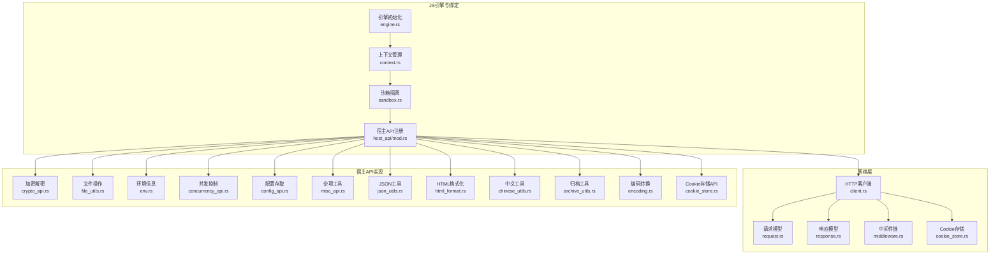
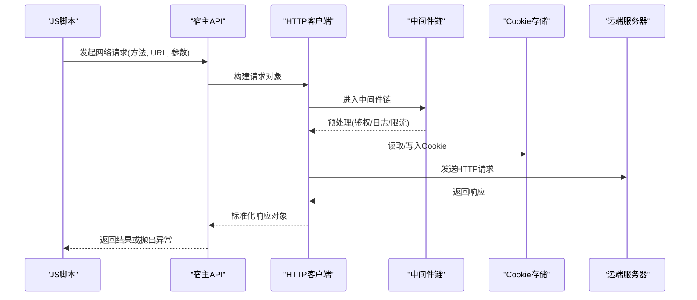
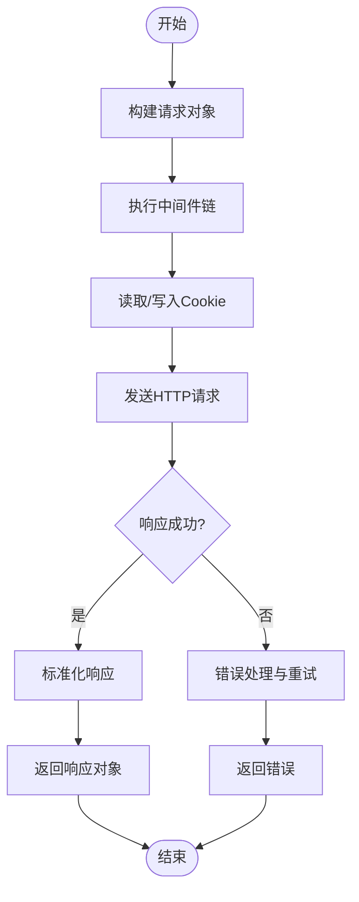
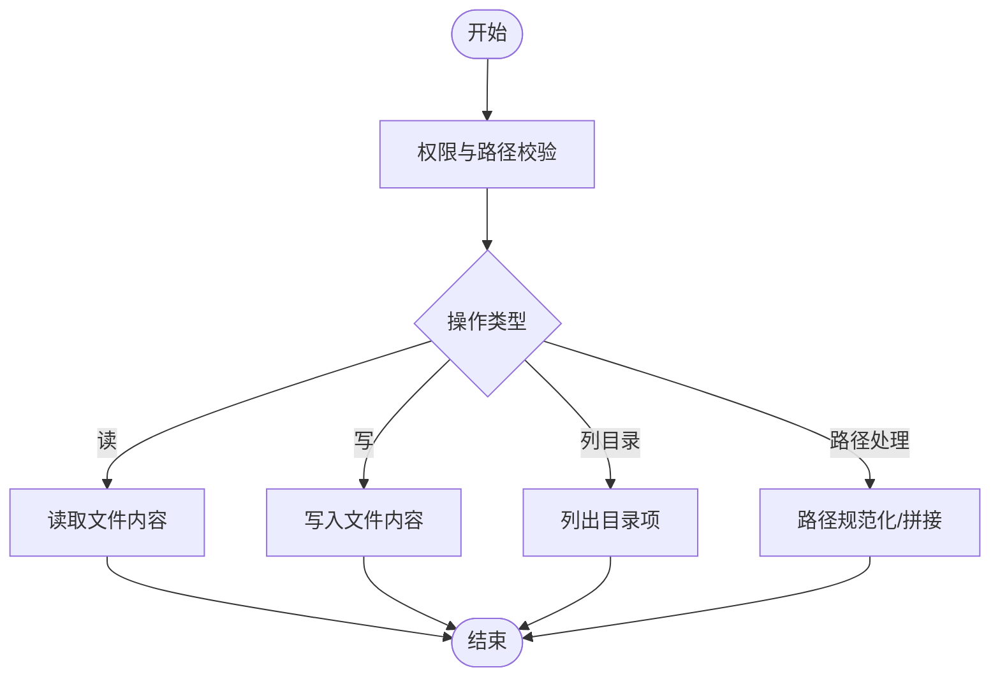
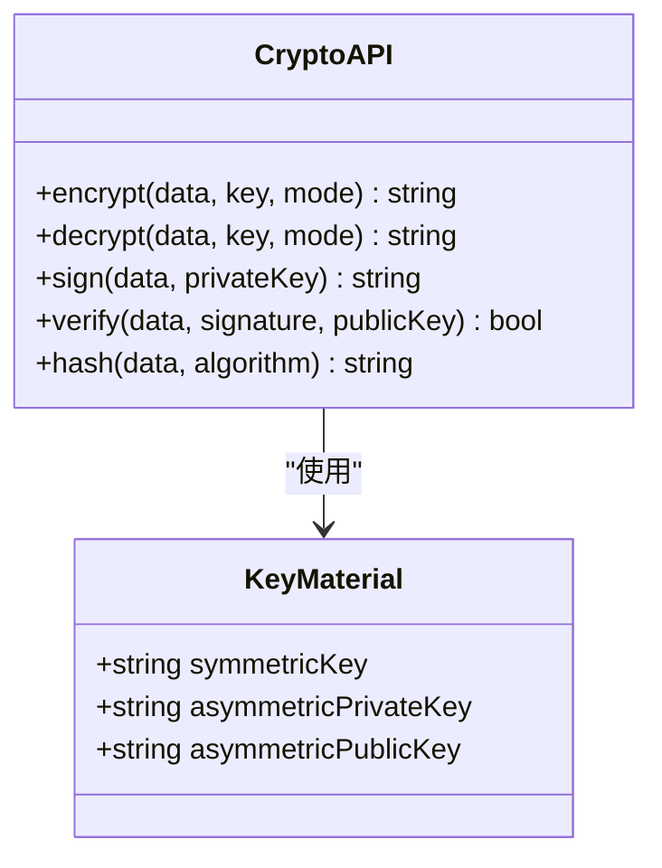
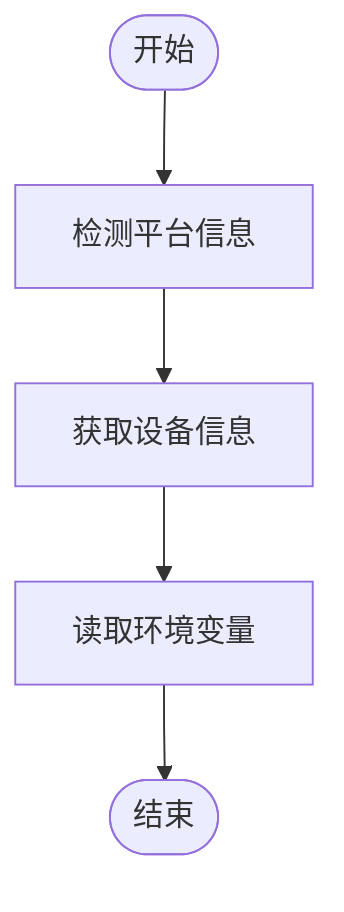
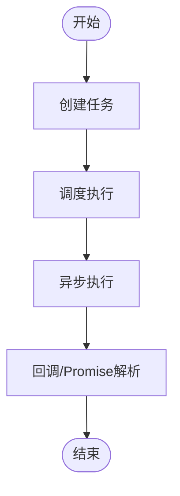
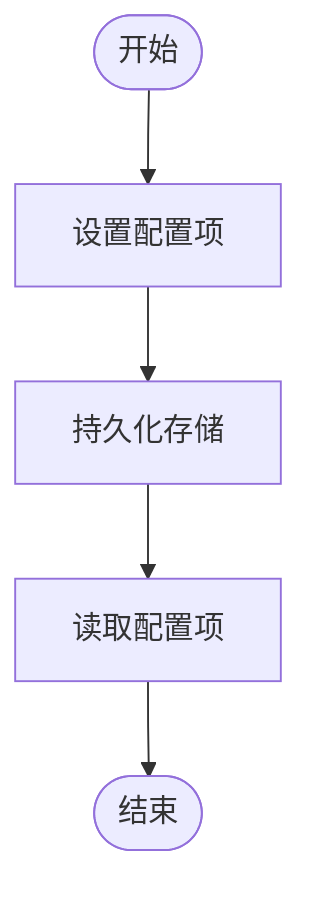
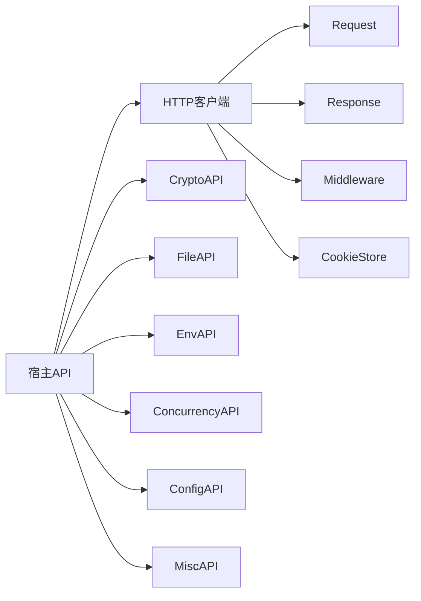

# 宿主API绑定

<cite>
**本文档引用的文件**   
- [legado-js/src/host_api/mod.rs](file://rust/legado-js/src/host_api/mod.rs)
- [legado-js/src/host_api/crypto_api.rs](file://rust/legado-js/src/host_api/crypto_api.rs)
- [legado-js/src/host_api/file_utils.rs](file://rust/legado-js/src/host_api/file_utils.rs)
- [legado-js/src/host_api/env.rs](file://rust/legado-js/src/host_api/env.rs)
- [legado-js/src/host_api/concurrency_api.rs](file://rust/legado-js/src/host_api/concurrency_api.rs)
- [legado-js/src/host_api/config_api.rs](file://rust/legado-js/src/host_api/config_api.rs)
- [legado-js/src/host_api/misc_api.rs](file://rust/legado-js/src/host_api/misc_api.rs)
- [legado-js/src/host_api/json_utils.rs](file://rust/legado-js/src/host_api/json_utils.rs)
- [legado-js/src/host_api/html_format.rs](file://rust/legado-js/src/host_api/html_format.rs)
- [legado-js/src/host_api/chinese_utils.rs](file://rust/legado-js/src/host_api/chinese_utils.rs)
- [legado-js/src/host_api/archive_utils.rs](file://rust/legado-js/src/host_api/archive_utils.rs)
- [legado-js/src/host_api/cookie_store.rs](file://rust/legado-js/src/host_api/cookie_store.rs)
- [legado-js/src/host_api/encoding.rs](file://rust/legado-js/src/host_api/encoding.rs)
- [legado-js/src/engine.rs](file://rust/legado-js/src/engine.rs)
- [legado-js/src/context.rs](file://rust/legado-js/src/context.rs)
- [legado-js/src/sandbox.rs](file://rust/legado-js/src/sandbox.rs)
- [legado-js/src/source_engine.rs](file://rust/legado-js/src/source_engine.rs)
- [legado-net/src/client.rs](file://rust/legado-net/src/client.rs)
- [legado-net/src/request.rs](file://rust/legado-net/src/request.rs)
- [legado-net/src/response.rs](file://legado-net/src/response.rs)
- [legado-net/src/middleware.rs](file://legado-net/src/middleware.rs)
- [legado-net/src/cookie_store.rs](file://legado-net/src/cookie_store.rs)
</cite>

## 目录
1. [简介](#简介)
2. [项目结构](#项目结构)
3. [核心组件](#核心组件)
4. [架构总览](#架构总览)
5. [详细组件分析](#详细组件分析)
6. [依赖关系分析](#依赖关系分析)
7. [性能考量](#性能考量)
8. [故障排查指南](#故障排查指南)
9. [结论](#结论)
10. [附录：API参考与示例](#附录api参考与示例)

## 简介
本文件面向在Legado中通过JavaScript脚本调用宿主能力的开发者，系统性梳理并文档化“宿主API绑定”的能力边界、数据流与使用方式。重点覆盖以下能力域：
- 网络请求API：HTTP客户端封装、请求拦截器与响应处理
- 文件操作API：文件读写、目录遍历与路径处理
- 加密解密API：对称加密、非对称加密与哈希算法支持
- 系统信息API：平台检测、设备信息与环境变量访问
- 配套工具：并发控制、配置存取、JSON与HTML处理、编码转换等

文档同时提供架构图、时序图、流程图以及最佳实践建议，帮助读者快速上手并安全高效地使用宿主API。

## 项目结构
Legado的JavaScript宿主能力由Rust侧模块暴露给Rhino JS引擎，并通过上下文与沙箱机制进行隔离与安全控制。关键目录与职责如下：
- rust/legado-js：JS引擎集成、上下文管理、沙箱隔离、宿主API注册
- rust/legado-net：网络层（HTTP客户端、中间件、Cookie存储、请求/响应模型）
- rust/legado-core：通用能力（如加密、类型定义等）
- app：Android应用层（包含测试与资源）

**图示来源** 
- [engine.rs:1-200](file://rust/legado-js/src/engine.rs#L1-200)
- [context.rs:1-200](file://rust/legado-js/src/context.rs#L1-200)
- [sandbox.rs:1-200](file://rust/legado-js/src/sandbox.rs#L1-200)
- [mod.rs:1-200](file://rust/legado-js/src/host_api/mod.rs#L1-200)
- [client.rs:1-200](file://rust/legado-net/src/client.rs#L1-200)
- [request.rs:1-200](file://rust/legado-net/src/request.rs#L1-200)
- [response.rs:1-200](file://rust/legado-net/src/response.rs#L1-200)
- [middleware.rs:1-200](file://rust/legado-net/src/middleware.rs#L1-200)
- [cookie_store.rs:1-200](file://rust/legado-net/src/cookie_store.rs#L1-200)

**章节来源**
- [engine.rs:1-200](file://rust/legado-js/src/engine.rs#L1-200)
- [context.rs:1-200](file://rust/legado-js/src/context.rs#L1-200)
- [sandbox.rs:1-200](file://rust/legado-js/src/sandbox.rs#L1-200)
- [mod.rs:1-200](file://rust/legado-js/src/host_api/mod.rs#L1-200)

## 核心组件
- 引擎与上下文
  - 引擎负责创建与管理JS执行环境，注入宿主API对象与方法
  - 上下文维护运行期状态（如线程池、配置、日志、时间源等），供各API共享
  - 沙箱限制脚本权限，确保仅暴露必要能力
- 网络层
  - HTTP客户端统一封装，支持超时、重试、代理、SSL配置
  - 中间件链用于请求拦截、鉴权、日志、限流等横切关注点
  - Cookie存储跨请求持久化会话
- 宿主API模块
  - 加密解密：对称/非对称加密、哈希摘要
  - 文件操作：读/写/删、目录遍历、路径规范化
  - 环境信息：平台、设备、环境变量
  - 并发控制：任务调度、协程桥接
  - 配置存取：键值对持久化
  - JSON/HTML/编码/中文工具：数据处理与格式转换
  - Cookie存储API：脚本侧Cookie读写

**章节来源**
- [engine.rs:1-200](file://rust/legado-js/src/engine.rs#L1-200)
- [context.rs:1-200](file://rust/legado-js/src/context.rs#L1-200)
- [sandbox.rs:1-200](file://rust/legado-js/src/sandbox.rs#L1-200)
- [mod.rs:1-200](file://rust/legado-js/src/host_api/mod.rs#L1-200)

## 架构总览
下图展示从JS脚本到宿主能力的调用链路，包括网络请求的拦截与响应处理流程。

**图示来源** 
- [client.rs:1-200](file://rust/legado-net/src/client.rs#L1-200)
- [middleware.rs:1-200](file://rust/legado-net/src/middleware.rs#L1-200)
- [cookie_store.rs:1-200](file://rust/legado-net/src/cookie_store.rs#L1-200)
- [request.rs:1-200](file://rust/legado-net/src/request.rs#L1-200)
- [response.rs:1-200](file://rust/legado-net/src/response.rs#L1-200)

## 详细组件分析

### 网络请求API
- 能力概述
  - 统一的HTTP客户端封装，支持GET/POST/PUT/DELETE等方法
  - 请求拦截器：鉴权、签名、日志、重试、限流
  - 响应处理：状态码校验、错误映射、内容解码、Cookie同步
- 关键数据结构
  - 请求对象：URL、方法、头部、体、超时、重试策略
  - 响应对象：状态码、头部、体、Cookie、错误信息
- 典型流程
  - 构建请求 -> 中间件链处理 -> Cookie存取 -> 网络IO -> 响应标准化 -> 返回JS

**图示来源** 
- [client.rs:1-200](file://rust/legado-net/src/client.rs#L1-200)
- [middleware.rs:1-200](file://rust/legado-net/src/middleware.rs#L1-200)
- [request.rs:1-200](file://rust/legado-net/src/request.rs#L1-200)
- [response.rs:1-200](file://rust/legado-net/src/response.rs#L1-200)

**章节来源**
- [client.rs:1-200](file://rust/legado-net/src/client.rs#L1-200)
- [middleware.rs:1-200](file://rust/legado-net/src/middleware.rs#L1-200)
- [cookie_store.rs:1-200](file://rust/legado-net/src/cookie_store.rs#L1-200)
- [request.rs:1-200](file://rust/legado-net/src/request.rs#L1-200)
- [response.rs:1-200](file://rust/legado-net/src/response.rs#L1-200)

### 文件操作API
- 能力概述
  - 文件读写：按字节或文本模式读写，支持追加与覆盖
  - 目录遍历：列出子项、递归遍历、过滤条件
  - 路径处理：规范化、拼接、相对/绝对路径转换
- 注意事项
  - 权限检查与路径白名单
  - 大文件分块读取与内存占用控制
  - 跨平台路径分隔符处理

**图示来源** 
- [file_utils.rs:1-200](file://rust/legado-js/src/host_api/file_utils.rs#L1-200)

**章节来源**
- [file_utils.rs:1-200](file://rust/legado-js/src/host_api/file_utils.rs#L1-200)

### 加密解密API
- 能力概述
  - 对称加密：AES等算法，支持CBC/ECB/GCM等模式
  - 非对称加密：RSA等算法，支持加解密与签名验签
  - 哈希算法：MD5、SHA系列等摘要计算
- 输入输出
  - 明文/密文以字节或Base64字符串表示
  - 密钥材料可通过外部传入或从配置获取
- 安全建议
  - 避免硬编码密钥，优先使用配置或安全存储
  - 合理选择IV/盐值，确保随机性与唯一性

**图示来源** 
- [crypto_api.rs:1-200](file://rust/legado-js/src/host_api/crypto_api.rs#L1-200)

**章节来源**
- [crypto_api.rs:1-200](file://rust/legado-js/src/host_api/crypto_api.rs#L1-200)

### 系统信息API
- 能力概述
  - 平台检测：操作系统类型、版本、架构
  - 设备信息：设备型号、厂商、屏幕密度、内存
  - 环境变量：进程环境变量读取
- 使用场景
  - 根据平台调整行为（如路径分隔符、编码默认值）
  - 适配不同设备的显示与性能特性

**图示来源** 
- [env.rs:1-200](file://rust/legado-js/src/host_api/env.rs#L1-200)

**章节来源**
- [env.rs:1-200](file://rust/legado-js/src/host_api/env.rs#L1-200)

### 并发控制API
- 能力概述
  - 任务调度：延迟执行、周期执行、一次性任务
  - 协程桥接：将异步操作桥接到JS回调或Promise
  - 线程池：限制并发度，避免阻塞主线程
- 最佳实践
  - 避免长时间阻塞操作
  - 合理设置超时与重试策略

**图示来源** 
- [concurrency_api.rs:1-200](file://rust/legado-js/src/host_api/concurrency_api.rs#L1-200)

**章节来源**
- [concurrency_api.rs:1-200](file://rust/legado-js/src/host_api/concurrency_api.rs#L1-200)

### 配置存取API
- 能力概述
  - 键值对存储：字符串、数字、布尔、JSON序列化
  - 作用域：全局/用户/应用级配置
  - 热更新：运行时修改即时生效
- 使用建议
  - 敏感信息加密存储
  - 合理命名空间避免冲突

**图示来源** 
- [config_api.rs:1-200](file://rust/legado-js/src/host_api/config_api.rs#L1-200)

**章节来源**
- [config_api.rs:1-200](file://rust/legado-js/src/host_api/config_api.rs#L1-200)

### 其他工具API
- JSON工具：解析、序列化、路径提取
- HTML格式化：清理、转义、富文本处理
- 中文工具：繁简转换、拼音、分词
- 归档工具：压缩/解压常见格式
- 编码转换：UTF-8、GBK、Base64等
- Cookie存储API：脚本侧Cookie读写与同步

**章节来源**
- [json_utils.rs:1-200](file://rust/legado-js/src/host_api/json_utils.rs#L1-200)
- [html_format.rs:1-200](file://rust/legado-js/src/host_api/html_format.rs#L1-200)
- [chinese_utils.rs:1-200](file://rust/legado-js/src/host_api/chinese_utils.rs#L1-200)
- [archive_utils.rs:1-200](file://rust/legado-js/src/host_api/archive_utils.rs#L1-200)
- [encoding.rs:1-200](file://rust/legado-js/src/host_api/encoding.rs#L1-200)
- [cookie_store.rs:1-200](file://rust/legado-js/src/host_api/cookie_store.rs#L1-200)

## 依赖关系分析
宿主API模块之间的耦合度较低，主要通过上下文共享状态；网络层与宿主API解耦，通过标准接口交互。

**图示来源** 
- [mod.rs:1-200](file://rust/legado-js/src/host_api/mod.rs#L1-200)
- [client.rs:1-200](file://rust/legado-net/src/client.rs#L1-200)
- [request.rs:1-200](file://rust/legado-net/src/request.rs#L1-200)
- [response.rs:1-200](file://rust/legado-net/src/response.rs#L1-200)
- [middleware.rs:1-200](file://rust/legado-net/src/middleware.rs#L1-200)
- [cookie_store.rs:1-200](file://rust/legado-net/src/cookie_store.rs#L1-200)

**章节来源**
- [mod.rs:1-200](file://rust/legado-js/src/host_api/mod.rs#L1-200)
- [client.rs:1-200](file://rust/legado-net/src/client.rs#L1-200)

## 性能考量
- 网络请求
  - 启用连接池与复用，减少握手开销
  - 合理设置超时与重试次数，避免雪崩
  - 使用GZIP/Deflate压缩传输
- 文件操作
  - 大文件采用流式读写，避免一次性加载到内存
  - 批量操作合并I/O，减少系统调用
- 加密解密
  - 选择合适的算法与密钥长度，平衡安全与性能
  - 避免频繁重复计算相同哈希
- 并发控制
  - 限制并发度，防止资源争用
  - 使用背压与队列管理任务负载

[本节为通用指导，不直接分析具体文件]

## 故障排查指南
- 常见问题
  - 网络请求失败：检查超时、代理、SSL证书、Cookie同步
  - 文件操作权限：确认路径白名单与文件系统权限
  - 加密解密错误：核对算法、模式、密钥格式与填充
  - 环境信息缺失：检查平台兼容性与环境变量注入
- 调试建议
  - 开启详细日志，定位中间件与错误堆栈
  - 使用沙箱隔离验证脚本权限
  - 逐步缩小问题范围，最小化复现用例

**章节来源**
- [middleware.rs:1-200](file://rust/legado-net/src/middleware.rs#L1-200)
- [sandbox.rs:1-200](file://rust/legado-js/src/sandbox.rs#L1-200)

## 结论
Legado的JavaScript宿主API绑定提供了完善的网络、文件、加密、系统与工具能力，通过清晰的架构与严格的沙箱隔离，既保证了扩展性又确保了安全性。开发者可基于此快速构建脚本功能，遵循最佳实践可获得稳定高效的运行体验。

[本节为总结，不直接分析具体文件]

## 附录：API参考与示例
以下为常用API的方法签名、参数说明与返回值格式的概览。实际实现细节请参考对应源码文件。

- 网络请求
  - 方法：请求(URL, 方法, 参数)
  - 参数：URL字符串、HTTP方法、头部、体、超时、重试策略
  - 返回：响应对象（状态码、头部、体、Cookie）
  - 示例：发起GET请求并打印状态码
    - 参考路径：[client.rs:1-200](file://rust/legado-net/src/client.rs#L1-200)

- 文件操作
  - 方法：读取文件(路径, 模式)
  - 参数：文件路径、读取模式（文本/二进制）
  - 返回：文件内容（字符串或字节数组）
  - 示例：读取配置文件并解析JSON
    - 参考路径：[file_utils.rs:1-200](file://rust/legado-js/src/host_api/file_utils.rs#L1-200)

- 加密解密
  - 方法：加密(数据, 密钥, 模式)
  - 参数：明文数据、密钥、加密模式
  - 返回：密文字符串（Base64或十六进制）
  - 示例：使用AES-CBC加密并输出Base64
    - 参考路径：[crypto_api.rs:1-200](file://rust/legado-js/src/host_api/crypto_api.rs#L1-200)

- 系统信息
  - 方法：获取平台信息()
  - 参数：无
  - 返回：平台对象（操作系统、版本、架构）
  - 示例：判断当前平台并调整行为
    - 参考路径：[env.rs:1-200](file://rust/legado-js/src/host_api/env.rs#L1-200)

- 并发控制
  - 方法：延迟执行(回调, 毫秒)
  - 参数：回调函数、延迟毫秒数
  - 返回：任务ID（可用于取消）
  - 示例：定时刷新缓存
    - 参考路径：[concurrency_api.rs:1-200](file://rust/legado-js/src/host_api/concurrency_api.rs#L1-200)

- 配置存取
  - 方法：设置配置(键, 值)
  - 参数：配置键、配置值（支持基本类型与JSON）
  - 返回：是否成功
  - 示例：保存用户偏好设置
    - 参考路径：[config_api.rs:1-200](file://rust/legado-js/src/host_api/config_api.rs#L1-200)

- 工具类
  - JSON解析：解析字符串为对象
    - 参考路径：[json_utils.rs:1-200](file://rust/legado-js/src/host_api/json_utils.rs#L1-200)
  - HTML清理：去除危险标签与属性
    - 参考路径：[html_format.rs:1-200](file://rust/legado-js/src/host_api/html_format.rs#L1-200)
  - 编码转换：UTF-8与GBK互转
    - 参考路径：[encoding.rs:1-200](file://rust/legado-js/src/host_api/encoding.rs#L1-200)

[本节为参考概览，具体实现请查阅对应源码文件]