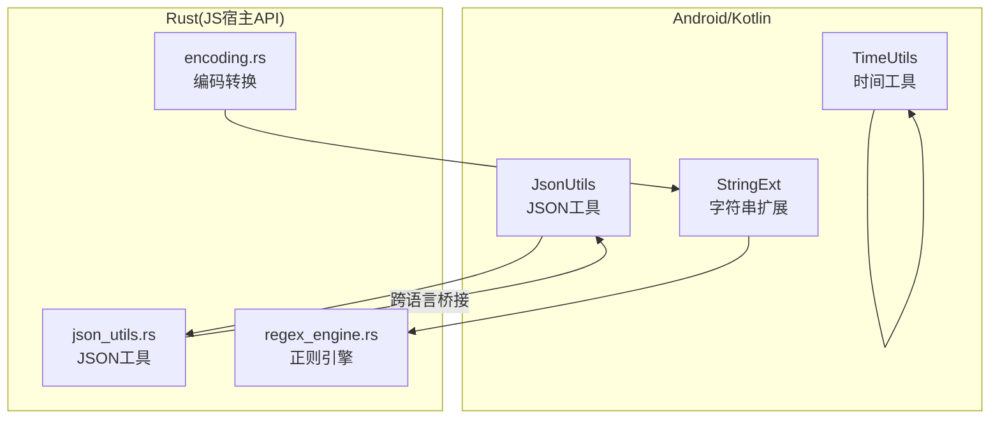
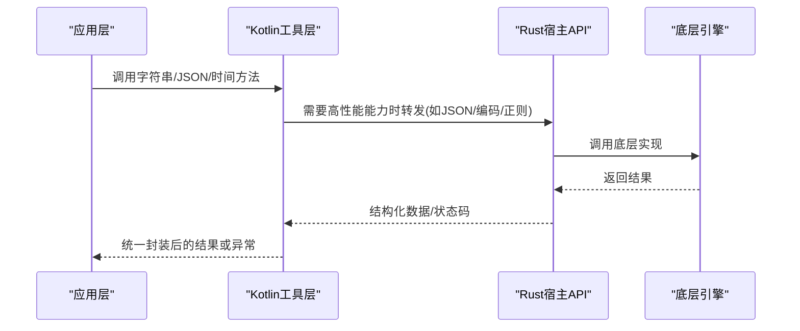
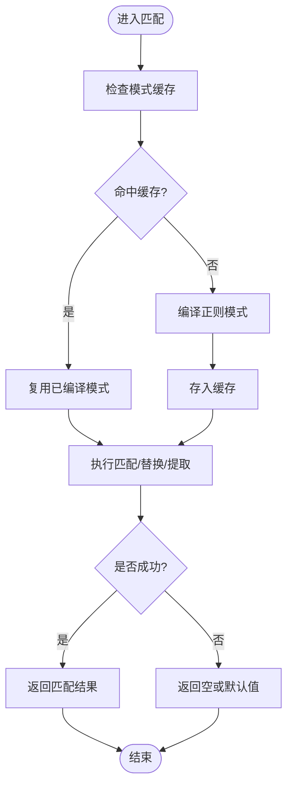
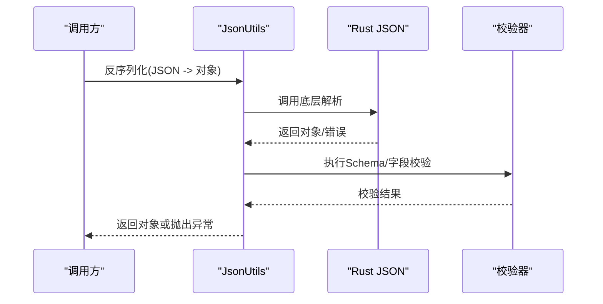
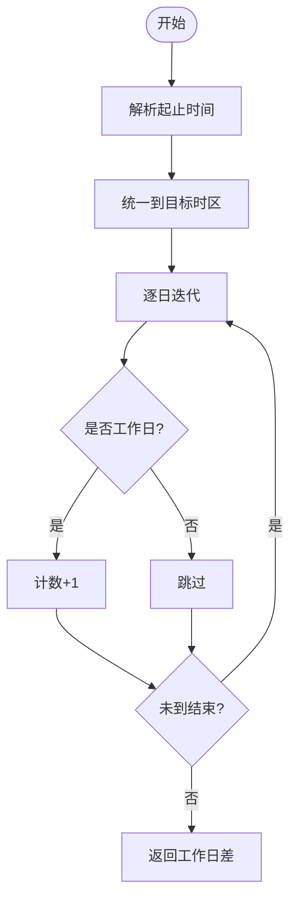
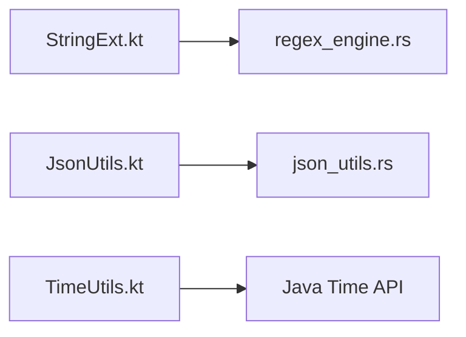

# 工具类API

<cite>
**本文引用的文件**   
- [app/src/main/java/io/legado/app/utils/StringExt.kt](file://app/src/main/java/io/legado/app/utils/StringExt.kt)
- [app/src/main/java/io/legado/app/utils/JsonUtils.kt](file://app/src/main/java/io/legado/app/utils/JsonUtils.kt)
- [app/src/main/java/io/legado/app/utils/TimeUtils.kt](file://app/src/main/java/io/legado/app/utils/TimeUtils.kt)
- [rust/legado-js/src/host_api/json_utils.rs](file://rust/legado-js/src/host_api/json_utils.rs)
- [rust/legado-js/src/host_api/encoding.rs](file://rust/legado-js/src/host_api/encoding.rs)
- [rust/legado-parser/src/regex_engine.rs](file://rust/legado-parser/src/regex_engine.rs)
</cite>

## 目录
1. [简介](#简介)
2. [项目结构](#项目结构)
3. [核心组件](#核心组件)
4. [架构总览](#架构总览)
5. [详细组件分析](#详细组件分析)
6. [依赖关系分析](#依赖关系分析)
7. [性能考虑](#性能考虑)
8. [故障排查指南](#故障排查指南)
9. [结论](#结论)
10. [附录：API参考与示例](#附录api参考与示例)

## 简介
本文件面向Legado工程中的“工具类API”，聚焦三大能力域：
- 字符串处理：编码转换、正则表达式匹配、格式化输出等。
- JSON数据处理：序列化、反序列化、数据验证与格式化工具。
- 时间日期操作：时间戳转换、日期格式化、时区处理与时间计算。

文档提供分层说明（从概览到代码级细节）、可视化架构图与流程图、常见使用场景示例（日志记录、配置解析、国际化支持），并给出性能优化建议与错误处理策略，帮助开发者快速上手与高效集成。

## 项目结构
本项目在Android端与Rust侧均提供了工具能力：
- Android/Kotlin侧：utils包集中了字符串扩展、JSON工具、时间工具等常用方法。
- Rust侧：通过JS宿主API暴露JSON、编码、正则等能力，供脚本层调用。

图表来源 
- [app/src/main/java/io/legado/app/utils/StringExt.kt](file://app/src/main/java/io/legado/app/utils/StringExt.kt)
- [app/src/main/java/io/legado/app/utils/JsonUtils.kt](file://app/src/main/java/io/legado/app/utils/JsonUtils.kt)
- [app/src/main/java/io/legado/app/utils/TimeUtils.kt](file://app/src/main/java/io/legado/app/utils/TimeUtils.kt)
- [rust/legado-js/src/host_api/json_utils.rs](file://rust/legado-js/src/host_api/json_utils.rs)
- [rust/legado-js/src/host_api/encoding.rs](file://rust/legado-js/src/host_api/encoding.rs)
- [rust/legado-parser/src/regex_engine.rs](file://rust/legado-parser/src/regex_engine.rs)

章节来源
- [app/src/main/java/io/legado/app/utils/StringExt.kt](file://app/src/main/java/io/legado/app/utils/StringExt.kt)
- [app/src/main/java/io/legado/app/utils/JsonUtils.kt](file://app/src/main/java/io/legado/app/utils/JsonUtils.kt)
- [app/src/main/java/io/legado/app/utils/TimeUtils.kt](file://app/src/main/java/io/legado/app/utils/TimeUtils.kt)
- [rust/legado-js/src/host_api/json_utils.rs](file://rust/legado-js/src/host_api/json_utils.rs)
- [rust/legado-js/src/host_api/encoding.rs](file://rust/legado-js/src/host_api/encoding.rs)
- [rust/legado-parser/src/regex_engine.rs](file://rust/legado-parser/src/regex_engine.rs)

## 核心组件
- 字符串模块（string）
  - 编码转换：UTF-8/GBK/ISO-8859-1等编解码、Base64编解码、URL编解码。
  - 正则匹配：模式编译、匹配/替换、分组提取、多行/忽略大小写等选项。
  - 格式化输出：占位符替换、模板渲染、安全转义。
- JSON模块（json）
  - 序列化/反序列化：对象与JSON互转、泛型类型映射、字段过滤。
  - 数据验证：Schema校验、必填字段检查、类型约束。
  - 格式化：美化输出、压缩输出、差异对比。
- 时间模块（time）
  - 时间戳转换：毫秒/秒/纳秒与时区感知时间的互转。
  - 日期格式化：多种模式串、本地化输出。
  - 时区处理：系统/指定时区切换、夏令时兼容。
  - 时间计算：加减运算、区间判断、工作日/节假日计算。

章节来源
- [app/src/main/java/io/legado/app/utils/StringExt.kt](file://app/src/main/java/io/legado/app/utils/StringExt.kt)
- [app/src/main/java/io/legado/app/utils/JsonUtils.kt](file://app/src/main/java/io/legado/app/utils/JsonUtils.kt)
- [app/src/main/java/io/legado/app/utils/TimeUtils.kt](file://app/src/main/java/io/legado/app/utils/TimeUtils.kt)
- [rust/legado-js/src/host_api/json_utils.rs](file://rust/legado-js/src/host_api/json_utils.rs)
- [rust/legado-js/src/host_api/encoding.rs](file://rust/legado-js/src/host_api/encoding.rs)
- [rust/legado-parser/src/regex_engine.rs](file://rust/legado-parser/src/regex_engine.rs)

## 架构总览
下图展示Kotlin工具与Rust宿主API的协作方式：Kotlin侧负责业务编排与UI交互，Rust侧提供高性能的JSON、编码与正则能力，并通过桥接暴露给上层。

图表来源 
- [app/src/main/java/io/legado/app/utils/JsonUtils.kt](file://app/src/main/java/io/legado/app/utils/JsonUtils.kt)
- [rust/legado-js/src/host_api/json_utils.rs](file://rust/legado-js/src/host_api/json_utils.rs)
- [rust/legado-js/src/host_api/encoding.rs](file://rust/legado-js/src/host_api/encoding.rs)
- [rust/legado-parser/src/regex_engine.rs](file://rust/legado-parser/src/regex_engine.rs)

## 详细组件分析

### 字符串处理（string）
- 功能要点
  - 编码转换：支持常见字符集与Base64/URL编解码，提供安全默认值与失败回退。
  - 正则匹配：预编译模式缓存、匹配/替换/提取、多行/全局/忽略大小写等选项。
  - 格式化输出：参数校验、占位符替换、HTML/JSON转义。
- 关键流程（正则匹配）

图表来源 
- [app/src/main/java/io/legado/app/utils/StringExt.kt](file://app/src/main/java/io/legado/app/utils/StringExt.kt)
- [rust/legado-parser/src/regex_engine.rs](file://rust/legado-parser/src/regex_engine.rs)

章节来源
- [app/src/main/java/io/legado/app/utils/StringExt.kt](file://app/src/main/java/io/legado/app/utils/StringExt.kt)
- [rust/legado-parser/src/regex_engine.rs](file://rust/legado-parser/src/regex_engine.rs)

### JSON数据处理（json）
- 功能要点
  - 序列化/反序列化：对象与JSON互转，支持泛型映射、字段过滤与自定义命名策略。
  - 数据验证：Schema校验、必填字段检查、类型约束、枚举校验。
  - 格式化：美化输出、压缩输出、差异对比。
- 典型调用序列（反序列化+校验）

图表来源 
- [app/src/main/java/io/legado/app/utils/JsonUtils.kt](file://app/src/main/java/io/legado/app/utils/JsonUtils.kt)
- [rust/legado-js/src/host_api/json_utils.rs](file://rust/legado-js/src/host_api/json_utils.rs)

章节来源
- [app/src/main/java/io/legado/app/utils/JsonUtils.kt](file://app/src/main/java/io/legado/app/utils/JsonUtils.kt)
- [rust/legado-js/src/host_api/json_utils.rs](file://rust/legado-js/src/host_api/json_utils.rs)

### 时间日期操作（time）
- 功能要点
  - 时间戳转换：毫秒/秒/纳秒与ZonedDateTime/Instant互转。
  - 日期格式化：模式串、本地化输出、固定格式常量。
  - 时区处理：系统/指定时区切换、夏令时兼容。
  - 时间计算：加减运算、区间判断、工作日/节假日计算。
- 时间计算流程（示例：计算两个日期的工作日差）

章节来源
- [app/src/main/java/io/legado/app/utils/TimeUtils.kt](file://app/src/main/java/io/legado/app/utils/TimeUtils.kt)

## 依赖关系分析
- Kotlin工具层对Rust宿主API存在选择性依赖：仅在需要高性能或平台一致性时使用Rust实现（如JSON、编码、正则）。
- 正则引擎由Rust侧提供，Kotlin侧进行模式缓存与参数组装。
- JSON工具在Kotlin侧做接口封装与错误归一化，底层解析由Rust完成。

图表来源 
- [app/src/main/java/io/legado/app/utils/StringExt.kt](file://app/src/main/java/io/legado/app/utils/StringExt.kt)
- [app/src/main/java/io/legado/app/utils/JsonUtils.kt](file://app/src/main/java/io/legado/app/utils/JsonUtils.kt)
- [app/src/main/java/io/legado/app/utils/TimeUtils.kt](file://app/src/main/java/io/legado/app/utils/TimeUtils.kt)
- [rust/legado-parser/src/regex_engine.rs](file://rust/legado-parser/src/regex_engine.rs)
- [rust/legado-js/src/host_api/json_utils.rs](file://rust/legado-js/src/host_api/json_utils.rs)

章节来源
- [app/src/main/java/io/legado/app/utils/StringExt.kt](file://app/src/main/java/io/legado/app/utils/StringExt.kt)
- [app/src/main/java/io/legado/app/utils/JsonUtils.kt](file://app/src/main/java/io/legado/app/utils/JsonUtils.kt)
- [app/src/main/java/io/legado/app/utils/TimeUtils.kt](file://app/src/main/java/io/legado/app/utils/TimeUtils.kt)
- [rust/legado-parser/src/regex_engine.rs](file://rust/legado-parser/src/regex_engine.rs)
- [rust/legado-js/src/host_api/json_utils.rs](file://rust/legado-js/src/host_api/json_utils.rs)

## 性能考虑
- 字符串正则
  - 预编译与缓存：避免重复编译相同模式；对热点规则建立LRU缓存。
  - 最小回溯：编写非贪婪与原子组，减少回溯开销。
  - 批量处理：对大量文本采用流式处理，避免一次性加载大字符串。
- JSON处理
  - 选择合适的数据模型：尽量使用轻量POJO/数据类，避免过度嵌套。
  - 增量解析：对超大JSON采用流式解析或分块处理。
  - 校验时机：仅在必要时执行Schema校验，避免热路径频繁校验。
- 时间操作
  - 复用格式化器：Formatter/DateTimeFormatter应线程安全且复用。
  - 时区计算：尽量在边界处进行时区转换，避免中间态频繁切换。
  - 批量计算：对时间区间计算采用向量化思路，减少循环分支。

[本节为通用指导，不直接分析具体文件]

## 故障排查指南
- 字符串编码问题
  - 现象：乱码、截断。
  - 排查：确认输入字节序与实际编码一致；检查Base64/URL编解码边界条件。
  - 定位：查看编码转换入口与错误回退逻辑。
- 正则匹配异常
  - 现象：性能抖动、栈溢出、无匹配。
  - 排查：检查模式复杂度、是否存在灾难性回溯；确认标志位设置。
  - 定位：查看正则编译与执行路径。
- JSON解析失败
  - 现象：反序列化异常、字段缺失。
  - 排查：核对字段名映射、类型约束、可选字段默认值。
  - 定位：查看反序列化与校验流程的错误信息。
- 时间计算错误
  - 现象：跨时区结果偏差、夏令时跳变。
  - 排查：确认时区源与目标时区；检查边界日期（月末/年末）。
  - 定位：查看时间转换与计算函数。

章节来源
- [app/src/main/java/io/legado/app/utils/StringExt.kt](file://app/src/main/java/io/legado/app/utils/StringExt.kt)
- [app/src/main/java/io/legado/app/utils/JsonUtils.kt](file://app/src/main/java/io/legado/app/utils/JsonUtils.kt)
- [app/src/main/java/io/legado/app/utils/TimeUtils.kt](file://app/src/main/java/io/legado/app/utils/TimeUtils.kt)
- [rust/legado-js/src/host_api/json_utils.rs](file://rust/legado-js/src/host_api/json_utils.rs)
- [rust/legado-js/src/host_api/encoding.rs](file://rust/legado-js/src/host_api/encoding.rs)
- [rust/legado-parser/src/regex_engine.rs](file://rust/legado-parser/src/regex_engine.rs)

## 结论
本工具类API围绕字符串、JSON与时间三大领域提供稳定、高性能的能力支撑。Kotlin侧负责易用性与业务编排，Rust侧提供底层高性能实现。通过合理的缓存、校验与错误处理策略，可在日志记录、配置解析、国际化等场景中显著提升开发效率与运行稳定性。

[本节为总结，不直接分析具体文件]

## 附录：API参考与示例

### string 模块（字符串处理）
- 编码转换
  - 方法：字符集编解码、Base64编解码、URL编解码。
  - 参数：原始字符串、目标编码、是否允许非法字符。
  - 返回：转换后的字符串或错误信息。
  - 示例场景：日志中安全打印敏感字段、网络请求参数编码。
- 正则表达式
  - 方法：匹配/替换/提取、模式编译、标志位控制。
  - 参数：模式串、待处理文本、匹配选项。
  - 返回：匹配结果集合或替换后文本。
  - 示例场景：日志关键字过滤、用户输入校验。
- 格式化输出
  - 方法：占位符替换、模板渲染、转义输出。
  - 参数：模板、键值对、转义策略。
  - 返回：格式化后的字符串。
  - 示例场景：国际化消息拼接、错误提示生成。

章节来源
- [app/src/main/java/io/legado/app/utils/StringExt.kt](file://app/src/main/java/io/legado/app/utils/StringExt.kt)
- [rust/legado-js/src/host_api/encoding.rs](file://rust/legado-js/src/host_api/encoding.rs)
- [rust/legado-parser/src/regex_engine.rs](file://rust/legado-parser/src/regex_engine.rs)

### json 模块（JSON数据处理）
- 序列化/反序列化
  - 方法：对象→JSON、JSON→对象、泛型映射、字段过滤。
  - 参数：数据对象、类型描述、映射策略。
  - 返回：JSON字符串或对象实例。
  - 示例场景：配置解析、API响应处理。
- 数据验证
  - 方法：Schema校验、必填字段检查、类型约束。
  - 参数：数据对象、校验规则。
  - 返回：校验结果与错误列表。
  - 示例场景：上游数据清洗、安全入库前校验。
- 格式化
  - 方法：美化输出、压缩输出、差异对比。
  - 参数：JSON字符串、缩进风格、对比选项。
  - 返回：格式化后的字符串或差异报告。
  - 示例场景：调试日志、变更审计。

章节来源
- [app/src/main/java/io/legado/app/utils/JsonUtils.kt](file://app/src/main/java/io/legado/app/utils/JsonUtils.kt)
- [rust/legado-js/src/host_api/json_utils.rs](file://rust/legado-js/src/host_api/json_utils.rs)

### time 模块（时间日期操作）
- 时间戳转换
  - 方法：毫秒/秒/纳秒与时间对象互转。
  - 参数：时间戳、单位、时区。
  - 返回：时间对象或时间戳。
  - 示例场景：日志时间标准化、定时任务调度。
- 日期格式化
  - 方法：模式串格式化、本地化输出。
  - 参数：时间对象、模式串、区域设置。
  - 返回：格式化后的字符串。
  - 示例场景：报表导出、用户可读时间显示。
- 时区处理
  - 方法：系统/指定时区切换、夏令时兼容。
  - 参数：时间对象、目标时区。
  - 返回：转换后的时间对象。
  - 示例场景：跨时区会议安排、全球用户通知。
- 时间计算
  - 方法：加减运算、区间判断、工作日/节假日计算。
  - 参数：起止时间、偏移量、日历规则。
  - 返回：计算结果（时间对象/布尔/数值）。
  - 示例场景：订阅到期提醒、服务SLA统计。

章节来源
- [app/src/main/java/io/legado/app/utils/TimeUtils.kt](file://app/src/main/java/io/legado/app/utils/TimeUtils.kt)

### 常见场景示例（概念性）
- 日志记录
  - 使用字符串格式化输出结构化日志；对敏感字段进行脱敏；按级别过滤关键词。
- 配置解析
  - 读取JSON配置文件，反序列化为配置对象；执行Schema校验；提供默认值回退。
- 国际化支持
  - 根据区域设置选择资源；使用占位符替换动态内容；对特殊字符进行转义。

[本节为概念性示例，不直接分析具体文件]