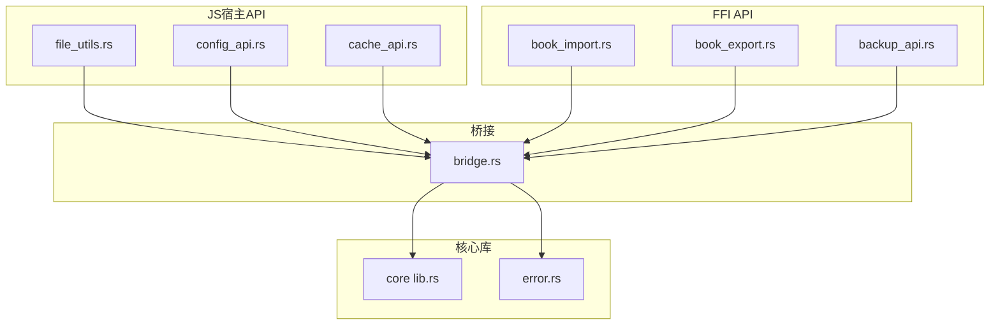
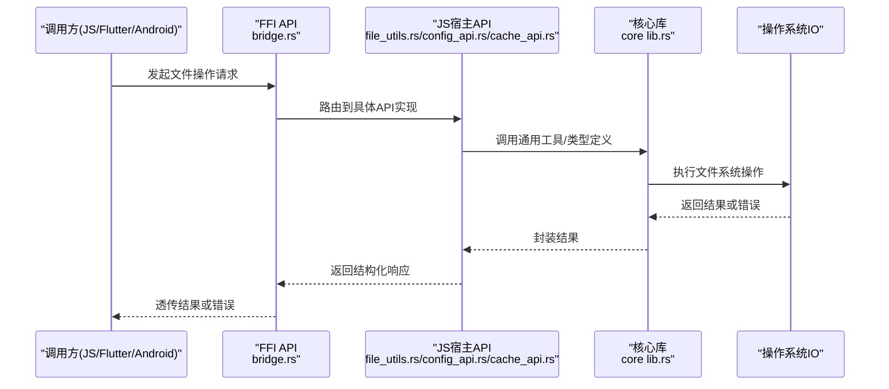
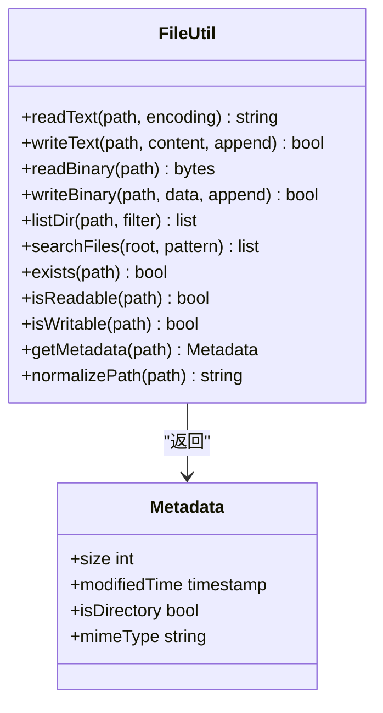
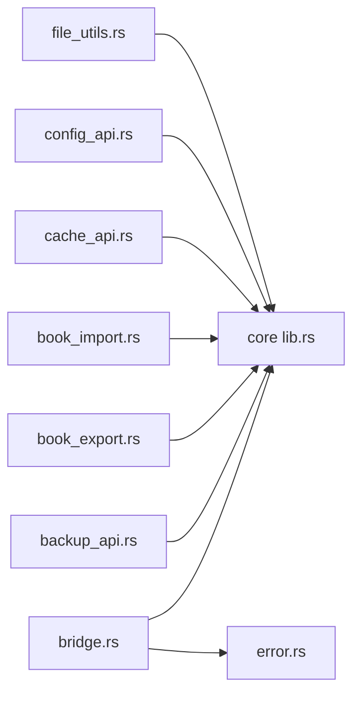
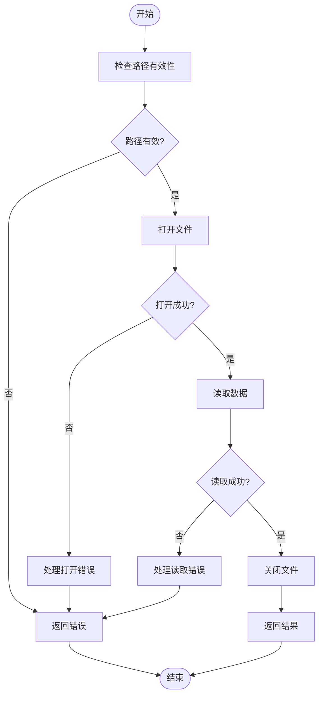

# 文件操作API

<cite>
**本文引用的文件**   
- [file_utils.rs](file://rust/legado-js/src/host_api/file_utils.rs)
- [config_api.rs](file://rust/legado-js/src/host_api/config_api.rs)
- [cache_api.rs](file://rust/legado-js/src/host_api/cache_api.rs)
- [book_import.rs](file://rust/legado-ffi/src/api/book_import.rs)
- [book_export.rs](file://rust/legado-ffi/src/api/book_export.rs)
- [backup_api.rs](file://rust/legado-ffi/src/api/backup_api.rs)
- [lib.rs](file://rust/legado-core/src/lib.rs)
- [error.rs](file://rust/legado-ffi/src/error.rs)
- [bridge.rs](file://rust/legado-ffi/src/bridge.rs)
</cite>

## 目录
1. [简介](#简介)
2. [项目结构](#项目结构)
3. [核心组件](#核心组件)
4. [架构总览](#架构总览)
5. [详细组件分析](#详细组件分析)
6. [依赖关系分析](#依赖关系分析)
7. [性能考虑](#性能考虑)
8. [故障排查指南](#故障排查指南)
9. [结论](#结论)
10. [附录：API参考与示例](#附录api参考与示例)

## 简介
本文件操作API文档面向Legado项目的文件读写、目录操作、元数据获取以及跨平台兼容性与错误处理策略。内容覆盖文本与二进制文件的读取/写入、目录遍历与搜索、权限检查与路径解析，并提供常用场景（书籍导入导出、缓存管理、配置文件读写）的完整API参考与使用示例说明。

## 项目结构
本项目在Rust侧提供底层能力，并通过FFI桥接暴露给上层调用方（如Flutter或Android）。与文件操作相关的核心代码主要分布在以下模块：
- JS宿主API层：封装文件、配置、缓存等能力，供脚本/JS环境调用
- FFI API层：对外暴露统一接口，包括书籍导入/导出、备份等
- 核心库：通用工具、错误类型、类型定义等

图表来源 
- [file_utils.rs](file://rust/legado-js/src/host_api/file_utils.rs)
- [config_api.rs](file://rust/legado-js/src/host_api/config_api.rs)
- [cache_api.rs](file://rust/legado-js/src/host_api/cache_api.rs)
- [book_import.rs](file://rust/legado-ffi/src/api/book_import.rs)
- [book_export.rs](file://rust/legado-ffi/src/api/book_export.rs)
- [backup_api.rs](file://rust/legado-ffi/src/api/backup_api.rs)
- [lib.rs](file://rust/legado-core/src/lib.rs)
- [error.rs](file://rust/legado-ffi/src/error.rs)
- [bridge.rs](file://rust/legado-ffi/src/bridge.rs)

章节来源
- [file_utils.rs](file://rust/legado-js/src/host_api/file_utils.rs)
- [config_api.rs](file://rust/legado-js/src/host_api/config_api.rs)
- [cache_api.rs](file://rust/legado-js/src/host_api/cache_api.rs)
- [book_import.rs](file://rust/legado-ffi/src/api/book_import.rs)
- [book_export.rs](file://rust/legado-ffi/src/api/book_export.rs)
- [backup_api.rs](file://rust/legado-ffi/src/api/backup_api.rs)
- [lib.rs](file://rust/legado-core/src/lib.rs)
- [error.rs](file://rust/legado-ffi/src/error.rs)
- [bridge.rs](file://rust/legado-ffi/src/bridge.rs)

## 核心组件
- 文件工具（file_utils.rs）：提供文件读写的通用能力，支持文本与二进制流，包含路径解析、编码处理、IO异常封装等。
- 配置API（config_api.rs）：用于应用配置的持久化读写，通常以JSON或键值形式存储于指定目录。
- 缓存API（cache_api.rs）：提供临时数据的快速存取，常用于音频缓存、图片缓存等。
- 书籍导入/导出（book_import.rs / book_export.rs）：批量导入/导出书籍资源，涉及多格式解析与IO流水线。
- 备份API（backup_api.rs）：对应用数据进行打包备份与恢复，保证一致性。
- 错误与桥接（error.rs / bridge.rs）：统一的错误类型定义与FFI桥接方法，确保跨语言调用的稳定性。

章节来源
- [file_utils.rs](file://rust/legado-js/src/host_api/file_utils.rs)
- [config_api.rs](file://rust/legado-js/src/host_api/config_api.rs)
- [cache_api.rs](file://rust/legado-js/src/host_api/cache_api.rs)
- [book_import.rs](file://rust/legado-ffi/src/api/book_import.rs)
- [book_export.rs](file://rust/legado-ffi/src/api/book_export.rs)
- [backup_api.rs](file://rust/legado-ffi/src/api/backup_api.rs)
- [error.rs](file://rust/legado-ffi/src/error.rs)
- [bridge.rs](file://rust/legado-ffi/src/bridge.rs)

## 架构总览
文件操作的调用链路从上层（JS/Flutter/Android）进入FFI层，再落到JS宿主API与核心库，最终通过系统IO完成实际的文件访问。

图表来源 
- [bridge.rs](file://rust/legado-ffi/src/bridge.rs)
- [file_utils.rs](file://rust/legado-js/src/host_api/file_utils.rs)
- [config_api.rs](file://rust/legado-js/src/host_api/config_api.rs)
- [cache_api.rs](file://rust/legado-js/src/host_api/cache_api.rs)
- [lib.rs](file://rust/legado-core/src/lib.rs)

## 详细组件分析

### 文件工具（file_utils.rs）
- 功能要点
  - 文本文件读取/写入：支持按行或整体读取，写入时可选追加模式与编码设置。
  - 二进制文件读取/写入：支持流式读写，适合大文件或媒体资源。
  - 目录操作：列出目录内容、递归遍历、按名称/扩展名过滤搜索。
  - 权限检查：判断文件是否存在、是否可读/可写、是否为目录。
  - 路径解析：规范化路径、拼接安全路径、避免越界访问。
  - 元数据获取：文件大小、修改时间、文件类型（基于扩展名或MIME推断）。
- 设计模式
  - 将IO异常统一封装为可识别的错误类型，便于上层处理。
  - 提供同步与异步两种调用风格（视宿主环境而定），保证非阻塞体验。
- 复杂度与优化
  - 大文件采用分块读取/写入，降低内存占用。
  - 目录遍历使用惰性迭代，按需加载子项。
- 错误处理
  - 区分“不存在”、“无权限”、“IO失败”等错误类别，返回明确状态码与消息。

章节来源
- [file_utils.rs](file://rust/legado-js/src/host_api/file_utils.rs)

#### 类图（概念映射）

图表来源 
- [file_utils.rs](file://rust/legado-js/src/host_api/file_utils.rs)

### 配置API（config_api.rs）
- 功能要点
  - 读取/写入应用配置，支持JSON序列化与反序列化。
  - 默认配置合并与增量更新。
  - 热重载机制（可选），在不重启的情况下生效。
- 使用建议
  - 配置变更需进行校验，失败时回滚。
  - 敏感字段加密存储。

章节来源
- [config_api.rs](file://rust/legado-js/src/host_api/config_api.rs)

### 缓存API（cache_api.rs）
- 功能要点
  - 提供键值缓存，支持TTL过期策略。
  - 自动清理策略：按大小上限或时间阈值清理。
  - 并发安全：多线程/协程环境下安全访问。
- 典型场景
  - 音频片段缓存、图片缩略图缓存、网络响应缓存。

章节来源
- [cache_api.rs](file://rust/legado-js/src/host_api/cache_api.rs)

### 书籍导入/导出（book_import.rs / book_export.rs）
- 导入流程
  - 扫描目标目录，识别支持的书籍格式。
  - 解析元数据（标题、作者、封面、章节列表）。
  - 批量入库并生成索引。
- 导出流程
  - 根据选择条件筛选书籍。
  - 打包为压缩包或逐个导出至目标目录。
- 错误处理
  - 部分失败不影响整体任务，记录失败条目并继续。

章节来源
- [book_import.rs](file://rust/legado-ffi/src/api/book_import.rs)
- [book_export.rs](file://rust/legado-ffi/src/api/book_export.rs)

### 备份API（backup_api.rs）
- 功能要点
  - 全量/增量备份，支持压缩与校验。
  - 恢复时校验完整性，失败则回滚。
- 使用建议
  - 备份前锁定数据库，保证一致性。

章节来源
- [backup_api.rs](file://rust/legado-ffi/src/api/backup_api.rs)

### 错误与桥接（error.rs / bridge.rs）
- 错误类型
  - 统一错误枚举，包含IO、权限、格式、网络等分类。
- 桥接方法
  - 参数校验、返回值转换、异常捕获与上报。

章节来源
- [error.rs](file://rust/legado-ffi/src/error.rs)
- [bridge.rs](file://rust/legado-ffi/src/bridge.rs)

## 依赖关系分析
文件操作API的依赖关系如下：
- JS宿主API依赖核心库的类型与工具函数。
- FFI API依赖JS宿主API与核心库，负责对外暴露接口。
- 错误类型被各层共享，确保一致的错误语义。

图表来源 
- [file_utils.rs](file://rust/legado-js/src/host_api/file_utils.rs)
- [config_api.rs](file://rust/legado-js/src/host_api/config_api.rs)
- [cache_api.rs](file://rust/legado-js/src/host_api/cache_api.rs)
- [book_import.rs](file://rust/legado-ffi/src/api/book_import.rs)
- [book_export.rs](file://rust/legado-ffi/src/api/book_export.rs)
- [backup_api.rs](file://rust/legado-ffi/src/api/backup_api.rs)
- [lib.rs](file://rust/legado-core/src/lib.rs)
- [error.rs](file://rust/legado-ffi/src/error.rs)
- [bridge.rs](file://rust/legado-ffi/src/bridge.rs)

章节来源
- [file_utils.rs](file://rust/legado-js/src/host_api/file_utils.rs)
- [config_api.rs](file://rust/legado-js/src/host_api/config_api.rs)
- [cache_api.rs](file://rust/legado-js/src/host_api/cache_api.rs)
- [book_import.rs](file://rust/legado-ffi/src/api/book_import.rs)
- [book_export.rs](file://rust/legado-ffi/src/api/book_export.rs)
- [backup_api.rs](file://rust/legado-ffi/src/api/backup_api.rs)
- [lib.rs](file://rust/legado-core/src/lib.rs)
- [error.rs](file://rust/legado-ffi/src/error.rs)
- [bridge.rs](file://rust/legado-ffi/src/bridge.rs)

## 性能考虑
- 大文件处理：采用流式读写与分块缓冲，避免一次性加载导致内存峰值过高。
- 目录遍历：使用惰性迭代与过滤条件前置，减少不必要的IO。
- 缓存策略：合理设置TTL与容量上限，定期清理无效条目。
- 并发控制：限制并发IO数量，避免磁盘瓶颈；对热点数据加锁保护。
- 编码与序列化：选择合适的字符编码与序列化格式，减少CPU与IO开销。

[本节为通用指导，不直接分析具体文件]

## 故障排查指南
- 常见问题
  - 路径不存在：检查路径是否正确、是否已创建父目录。
  - 权限不足：确认应用具备读写权限，必要时提示用户授权。
  - IO失败：检查磁盘空间、文件被占用、网络路径不可达等。
  - 编码错误：确认文本编码与解码一致，避免乱码。
- 定位方法
  - 查看错误类型与消息，区分“不存在”、“无权限”、“IO失败”。
  - 启用调试日志，记录关键步骤与参数。
  - 复现最小用例，逐步缩小问题范围。

章节来源
- [error.rs](file://rust/legado-ffi/src/error.rs)
- [bridge.rs](file://rust/legado-ffi/src/bridge.rs)

## 结论
Legado的文件操作API通过分层设计与统一错误模型，提供了稳定、高效且易于使用的文件管理能力。结合目录操作、元数据获取与缓存策略，可满足书籍导入导出、配置管理、缓存管理等常见场景。建议在开发中遵循最佳实践，关注性能与错误处理，确保跨平台兼容性。

[本节为总结性内容，不直接分析具体文件]

## 附录：API参考与示例

### API参考
- readFile(path, options)
  - 描述：读取文件内容，支持文本与二进制模式。
  - 参数：path（字符串）、options（编码、模式等）。
  - 返回：字符串或字节数组。
- writeFile(path, data, options)
  - 描述：写入文件内容，支持覆盖与追加模式。
  - 参数：path（字符串）、data（字符串或字节数组）、options（编码、模式等）。
  - 返回：布尔值表示成功与否。
- listDir(path, filter)
  - 描述：列出目录内容，支持过滤器（名称、扩展名）。
  - 参数：path（字符串）、filter（对象）。
  - 返回：文件/目录列表。
- searchFiles(root, pattern)
  - 描述：递归搜索匹配的文件。
  - 参数：root（字符串）、pattern（正则或通配符）。
  - 返回：匹配路径列表。
- getMetadata(path)
  - 描述：获取文件元数据。
  - 参数：path（字符串）。
  - 返回：元数据对象（大小、修改时间、类型等）。
- exists(path), isReadable(path), isWritable(path)
  - 描述：检查文件存在性与权限。
  - 参数：path（字符串）。
  - 返回：布尔值。

章节来源
- [file_utils.rs](file://rust/legado-js/src/host_api/file_utils.rs)

### 使用示例（场景说明）
- 书籍导入
  - 步骤：扫描目录 -> 识别格式 -> 解析元数据 -> 批量入库。
  - 关键点：错误隔离、进度回调、索引重建。
- 书籍导出
  - 步骤：筛选书籍 -> 打包资源 -> 输出到目标路径。
  - 关键点：压缩率、校验完整性、断点续传。
- 缓存管理
  - 步骤：计算键值 -> 写入缓存 -> 设置TTL -> 定期清理。
  - 关键点：并发安全、容量上限、命中率监控。
- 配置文件读写
  - 步骤：读取默认配置 -> 合并用户配置 -> 校验并保存。
  - 关键点：版本兼容、字段迁移、敏感信息加密。

章节来源
- [book_import.rs](file://rust/legado-ffi/src/api/book_import.rs)
- [book_export.rs](file://rust/legado-ffi/src/api/book_export.rs)
- [cache_api.rs](file://rust/legado-js/src/host_api/cache_api.rs)
- [config_api.rs](file://rust/legado-js/src/host_api/config_api.rs)

### 流程图（文件读取算法）

图表来源 
- [file_utils.rs](file://rust/legado-js/src/host_api/file_utils.rs)