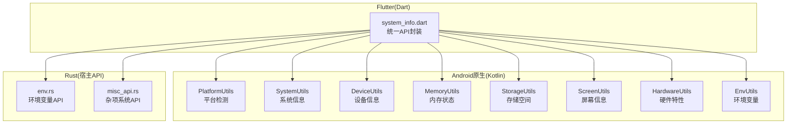
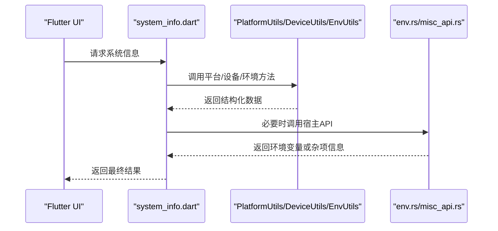
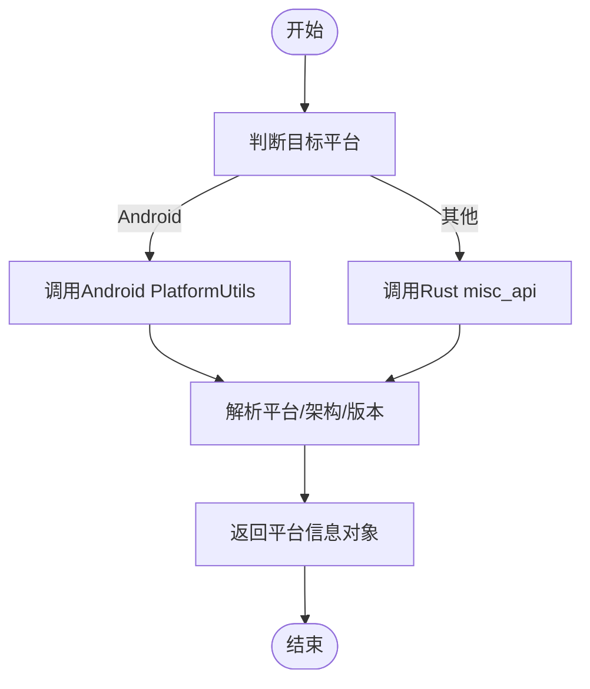
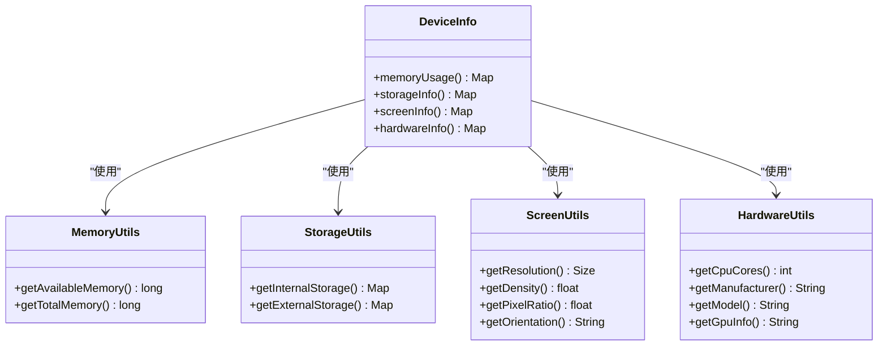
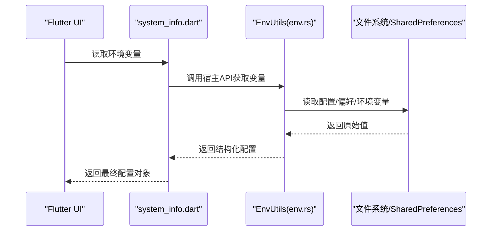
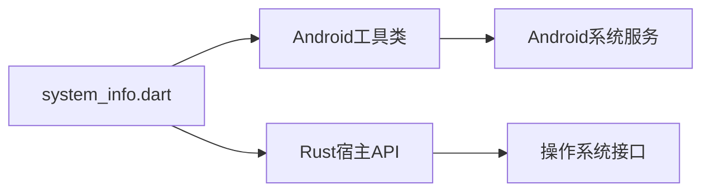

# 系统信息API

<cite>
**本文档引用的文件**   
- [app/src/main/java/io/legado/app/utils/SystemUtils.kt](file://app/src/main/java/io/legado/app/utils/SystemUtils.kt)
- [app/src/main/java/io/legado/app/utils/DeviceUtils.kt](file://app/src/main/java/io/legado/app/utils/DeviceUtils.kt)
- [app/src/main/java/io/legado/app/utils/EnvUtils.kt](file://app/src/main/java/io/legado/app/utils/EnvUtils.kt)
- [app/src/main/java/io/legado/app/utils/PlatformUtils.kt](file://app/src/main/java/io/legado/app/utils/PlatformUtils.kt)
- [app/src/main/java/io/legado/app/utils/ScreenUtils.kt](file://app/src/main/java/io/legado/app/utils/ScreenUtils.kt)
- [app/src/main/java/io/legado/app/utils/MemoryUtils.kt](file://app/src/main/java/io/legado/app/utils/MemoryUtils.kt)
- [app/src/main/java/io/legado/app/utils/StorageUtils.kt](file://app/src/main/java/io/legado/app/utils/StorageUtils.kt)
- [app/src/main/java/io/legado/app/utils/HardwareUtils.kt](file://app/src/main/java/io/legado/app/utils/HardwareUtils.kt)
- [flutter_legado/lib/src/system_info.dart](file://flutter_legado/lib/src/system_info.dart)
- [rust/legado-js/src/host_api/env.rs](file://rust/legado-js/src/host_api/env.rs)
- [rust/legado-js/src/host_api/misc_api.rs](file://rust/legado-js/src/host_api/misc_api.rs)
</cite>

## 目录
1. [简介](#简介)
2. [项目结构](#项目结构)
3. [核心组件](#核心组件)
4. [架构总览](#架构总览)
5. [详细组件分析](#详细组件分析)
6. [依赖关系分析](#依赖关系分析)
7. [性能考量](#性能考量)
8. [故障排查指南](#故障排查指南)
9. [结论](#结论)
10. [附录：API参考与示例](#附录api参考与示例)

## 简介
本文件面向Legado项目的“系统信息API”，聚焦以下能力：
- 平台检测：操作系统识别、CPU架构检测、版本信息获取
- 设备信息：内存状态、存储空间、屏幕信息与硬件特性查询
- 环境变量访问：应用配置、用户偏好与运行时参数的读取
- API参考：platform、env、device等模块的方法说明
- 实战示例：条件渲染、性能优化、兼容性处理等常见场景
- 跨平台差异：Android、Flutter、Rust桥接层的行为差异与注意事项

## 项目结构
系统信息相关代码主要分布在三个层次：
- Android原生工具层（Kotlin）：提供平台、设备、环境、屏幕、存储、内存、硬件等能力
- Flutter桥接层（Dart）：对外暴露统一的系统信息接口，供Flutter UI使用
- Rust宿主API（Rust）：为JS引擎提供系统与环境能力的宿主函数

图表来源
- [app/src/main/java/io/legado/app/utils/PlatformUtils.kt](file://app/src/main/java/io/legado/app/utils/PlatformUtils.kt)
- [app/src/main/java/io/legado/app/utils/SystemUtils.kt](file://app/src/main/java/io/legado/app/utils/SystemUtils.kt)
- [app/src/main/java/io/legado/app/utils/DeviceUtils.kt](file://app/src/main/java/io/legado/app/utils/DeviceUtils.kt)
- [app/src/main/java/io/legado/app/utils/MemoryUtils.kt](file://app/src/main/java/io/legado/app/utils/MemoryUtils.kt)
- [app/src/main/java/io/legado/app/utils/StorageUtils.kt](file://app/src/main/java/io/legado/app/utils/StorageUtils.kt)
- [app/src/main/java/io/legado/app/utils/ScreenUtils.kt](file://app/src/main/java/io/legado/app/utils/ScreenUtils.kt)
- [app/src/main/java/io/legado/app/utils/HardwareUtils.kt](file://app/src/main/java/io/legado/app/utils/HardwareUtils.kt)
- [app/src/main/java/io/legado/app/utils/EnvUtils.kt](file://app/src/main/java/io/legado/app/utils/EnvUtils.kt)
- [flutter_legado/lib/src/system_info.dart](file://flutter_legado/lib/src/system_info.dart)
- [rust/legado-js/src/host_api/env.rs](file://rust/legado-js/src/host_api/env.rs)
- [rust/legado-js/src/host_api/misc_api.rs](file://rust/legado-js/src/host_api/misc_api.rs)

章节来源
- [app/src/main/java/io/legado/app/utils/PlatformUtils.kt](file://app/src/main/java/io/legado/app/utils/PlatformUtils.kt)
- [app/src/main/java/io/legado/app/utils/SystemUtils.kt](file://app/src/main/java/io/legado/app/utils/SystemUtils.kt)
- [app/src/main/java/io/legado/app/utils/DeviceUtils.kt](file://app/src/main/java/io/legado/app/utils/DeviceUtils.kt)
- [app/src/main/java/io/legado/app/utils/MemoryUtils.kt](file://app/src/main/java/io/legado/app/utils/MemoryUtils.kt)
- [app/src/main/java/io/legado/app/utils/StorageUtils.kt](file://app/src/main/java/io/legado/app/utils/StorageUtils.kt)
- [app/src/main/java/io/legado/app/utils/ScreenUtils.kt](file://app/src/main/java/io/legado/app/utils/ScreenUtils.kt)
- [app/src/main/java/io/legado/app/utils/HardwareUtils.kt](file://app/src/main/java/io/legado/app/utils/HardwareUtils.kt)
- [app/src/main/java/io/legado/app/utils/EnvUtils.kt](file://app/src/main/java/io/legado/app/utils/EnvUtils.kt)
- [flutter_legado/lib/src/system_info.dart](file://flutter_legado/lib/src/system_info.dart)
- [rust/legado-js/src/host_api/env.rs](file://rust/legado-js/src/host_api/env.rs)
- [rust/legado-js/src/host_api/misc_api.rs](file://rust/legado-js/src/host_api/misc_api.rs)

## 核心组件
- platform模块：负责操作系统识别、架构检测、版本信息获取
- device模块：负责内存状态、存储空间、屏幕信息与硬件特性查询
- env模块：负责应用配置、用户偏好和运行时参数的读取

这些模块在Android层以Kotlin工具类实现，在Flutter层通过Dart封装统一调用，在Rust层通过宿主API暴露给JS引擎。

章节来源
- [app/src/main/java/io/legado/app/utils/PlatformUtils.kt](file://app/src/main/java/io/legado/app/utils/PlatformUtils.kt)
- [app/src/main/java/io/legado/app/utils/DeviceUtils.kt](file://app/src/main/java/io/legado/app/utils/DeviceUtils.kt)
- [app/src/main/java/io/legado/app/utils/EnvUtils.kt](file://app/src/main/java/io/legado/app/utils/EnvUtils.kt)
- [flutter_legado/lib/src/system_info.dart](file://flutter_legado/lib/src/system_info.dart)
- [rust/legado-js/src/host_api/env.rs](file://rust/legado-js/src/host_api/env.rs)
- [rust/legado-js/src/host_api/misc_api.rs](file://rust/legado-js/src/host_api/misc_api.rs)

## 架构总览
下图展示了从Flutter到Android/Rust的调用路径，以及各模块的职责边界。

图表来源
- [flutter_legado/lib/src/system_info.dart](file://flutter_legado/lib/src/system_info.dart)
- [app/src/main/java/io/legado/app/utils/PlatformUtils.kt](file://app/src/main/java/io/legado/app/utils/PlatformUtils.kt)
- [app/src/main/java/io/legado/app/utils/DeviceUtils.kt](file://app/src/main/java/io/legado/app/utils/DeviceUtils.kt)
- [app/src/main/java/io/legado/app/utils/EnvUtils.kt](file://app/src/main/java/io/legado/app/utils/EnvUtils.kt)
- [rust/legado-js/src/host_api/env.rs](file://rust/legado-js/src/host_api/env.rs)
- [rust/legado-js/src/host_api/misc_api.rs](file://rust/legado-js/src/host_api/misc_api.rs)

## 详细组件分析

### platform模块（平台检测）
职责：
- 操作系统识别：区分Android、iOS、Windows、macOS、Linux等
- CPU架构检测：如arm64、x86_64等
- 版本信息获取：系统版本号、发行版信息等

典型流程：
- Flutter侧发起调用
- 根据目标平台选择Android或Rust实现
- 返回平台标识、架构字符串与版本信息

图表来源
- [app/src/main/java/io/legado/app/utils/PlatformUtils.kt](file://app/src/main/java/io/legado/app/utils/PlatformUtils.kt)
- [rust/legado-js/src/host_api/misc_api.rs](file://rust/legado-js/src/host_api/misc_api.rs)

章节来源
- [app/src/main/java/io/legado/app/utils/PlatformUtils.kt](file://app/src/main/java/io/legado/app/utils/PlatformUtils.kt)
- [flutter_legado/lib/src/system_info.dart](file://flutter_legado/lib/src/system_info.dart)

### device模块（设备信息）
职责：
- 内存状态：可用内存、已用内存、内存上限
- 存储空间：内部/外部存储总量与可用量
- 屏幕信息：分辨率、密度、像素比例、方向
- 硬件特性：CPU核心数、厂商、型号、GPU信息等

关键要点：
- 内存与存储查询可能受权限限制，需做好降级处理
- 屏幕信息在不同显示模式下存在差异，应缓存并监听变化
- 硬件特性查询需兼容不同Android版本与厂商定制ROM

图表来源
- [app/src/main/java/io/legado/app/utils/DeviceUtils.kt](file://app/src/main/java/io/legado/app/utils/DeviceUtils.kt)
- [app/src/main/java/io/legado/app/utils/MemoryUtils.kt](file://app/src/main/java/io/legado/app/utils/MemoryUtils.kt)
- [app/src/main/java/io/legado/app/utils/StorageUtils.kt](file://app/src/main/java/io/legado/app/utils/StorageUtils.kt)
- [app/src/main/java/io/legado/app/utils/ScreenUtils.kt](file://app/src/main/java/io/legado/app/utils/ScreenUtils.kt)
- [app/src/main/java/io/legado/app/utils/HardwareUtils.kt](file://app/src/main/java/io/legado/app/utils/HardwareUtils.kt)

章节来源
- [app/src/main/java/io/legado/app/utils/DeviceUtils.kt](file://app/src/main/java/io/legado/app/utils/DeviceUtils.kt)
- [app/src/main/java/io/legado/app/utils/MemoryUtils.kt](file://app/src/main/java/io/legado/app/utils/MemoryUtils.kt)
- [app/src/main/java/io/legado/app/utils/StorageUtils.kt](file://app/src/main/java/io/legado/app/utils/StorageUtils.kt)
- [app/src/main/java/io/legado/app/utils/ScreenUtils.kt](file://app/src/main/java/io/legado/app/utils/ScreenUtils.kt)
- [app/src/main/java/io/legado/app/utils/HardwareUtils.kt](file://app/src/main/java/io/legado/app/utils/HardwareUtils.kt)

### env模块（环境变量）
职责：
- 应用配置：读取应用内配置文件或默认值
- 用户偏好：读取用户设置（如主题、语言、字体大小）
- 运行时参数：读取进程启动参数或系统环境变量

调用流程：
- Flutter/Dart层调用系统信息API
- 若需要底层环境变量，则通过Rust env.rs暴露的宿主函数读取
- 返回键值对形式的配置对象

图表来源
- [app/src/main/java/io/legado/app/utils/EnvUtils.kt](file://app/src/main/java/io/legado/app/utils/EnvUtils.kt)
- [rust/legado-js/src/host_api/env.rs](file://rust/legado-js/src/host_api/env.rs)
- [flutter_legado/lib/src/system_info.dart](file://flutter_legado/lib/src/system_info.dart)

章节来源
- [app/src/main/java/io/legado/app/utils/EnvUtils.kt](file://app/src/main/java/io/legado/app/utils/EnvUtils.kt)
- [rust/legado-js/src/host_api/env.rs](file://rust/legado-js/src/host_api/env.rs)
- [flutter_legado/lib/src/system_info.dart](file://flutter_legado/lib/src/system_info.dart)

### system_info.dart（Flutter统一封装）
职责：
- 统一对外暴露platform、device、env等模块的API
- 屏蔽底层Android/Rust差异，提供一致的Dart接口
- 提供错误处理与默认值回退机制

章节来源
- [flutter_legado/lib/src/system_info.dart](file://flutter_legado/lib/src/system_info.dart)

## 依赖关系分析
- Flutter层依赖Android原生工具类与Rust宿主API
- Android层依赖系统服务（如ActivityManager、StorageManager、DisplayManager等）
- Rust层通过FFI暴露给上层，避免直接耦合Android SDK

图表来源
- [flutter_legado/lib/src/system_info.dart](file://flutter_legado/lib/src/system_info.dart)
- [app/src/main/java/io/legado/app/utils/PlatformUtils.kt](file://app/src/main/java/io/legado/app/utils/PlatformUtils.kt)
- [app/src/main/java/io/legado/app/utils/DeviceUtils.kt](file://app/src/main/java/io/legado/app/utils/DeviceUtils.kt)
- [app/src/main/java/io/legado/app/utils/EnvUtils.kt](file://app/src/main/java/io/legado/app/utils/EnvUtils.kt)
- [rust/legado-js/src/host_api/env.rs](file://rust/legado-js/src/host_api/env.rs)
- [rust/legado-js/src/host_api/misc_api.rs](file://rust/legado-js/src/host_api/misc_api.rs)

章节来源
- [flutter_legado/lib/src/system_info.dart](file://flutter_legado/lib/src/system_info.dart)
- [app/src/main/java/io/legado/app/utils/PlatformUtils.kt](file://app/src/main/java/io/legado/app/utils/PlatformUtils.kt)
- [app/src/main/java/io/legado/app/utils/DeviceUtils.kt](file://app/src/main/java/io/legado/app/utils/DeviceUtils.kt)
- [app/src/main/java/io/legado/app/utils/EnvUtils.kt](file://app/src/main/java/io/legado/app/utils/EnvUtils.kt)
- [rust/legado-js/src/host_api/env.rs](file://rust/legado-js/src/host_api/env.rs)
- [rust/legado-js/src/host_api/misc_api.rs](file://rust/legado-js/src/host_api/misc_api.rs)

## 性能考量
- 缓存策略：屏幕尺寸、密度、硬件信息等静态数据应缓存，避免重复查询
- 异步调用：内存与存储查询可能耗时，建议异步执行并支持取消
- 权限检查：存储与内存信息可能需要权限，提前检查并降级处理
- 资源释放：避免长时间持有系统服务引用，防止内存泄漏
- 批量查询：将多个系统信息查询合并，减少跨层调用开销

[本节为通用指导，不直接分析具体文件]

## 故障排查指南
常见问题与解决思路：
- 权限不足导致存储/内存信息为空：检查并申请相应权限，提供默认值
- 屏幕信息异常：确认是否在主线程调用，监听屏幕旋转事件更新缓存
- 环境变量读取失败：检查配置文件是否存在，提供默认值与日志记录
- 平台识别错误：确认目标平台分支逻辑，增加调试输出
- Rust调用失败：检查FFI绑定是否正确，验证输入参数格式

章节来源
- [app/src/main/java/io/legado/app/utils/EnvUtils.kt](file://app/src/main/java/io/legado/app/utils/EnvUtils.kt)
- [app/src/main/java/io/legado/app/utils/DeviceUtils.kt](file://app/src/main/java/io/legado/app/utils/DeviceUtils.kt)
- [app/src/main/java/io/legado/app/utils/PlatformUtils.kt](file://app/src/main/java/io/legado/app/utils/PlatformUtils.kt)
- [rust/legado-js/src/host_api/env.rs](file://rust/legado-js/src/host_api/env.rs)

## 结论
Legado的系统信息API通过分层设计实现了跨平台的系统能力抽象。Android原生层提供基础能力，Flutter层统一封装，Rust层补充底层环境访问。开发者可基于此实现条件渲染、性能优化与兼容性处理，同时注意权限、缓存与错误处理等关键点。

[本节为总结性内容，不直接分析具体文件]

## 附录：API参考与示例

### platform模块API参考
- getPlatform(): 返回当前运行平台标识（如android、ios、windows等）
- getArchitecture(): 返回CPU架构字符串（如arm64、x86_64等）
- getSystemVersion(): 返回操作系统版本号
- getBuildInfo(): 返回构建相关信息（如SDK版本、编译类型等）

章节来源
- [app/src/main/java/io/legado/app/utils/PlatformUtils.kt](file://app/src/main/java/io/legado/app/utils/PlatformUtils.kt)
- [flutter_legado/lib/src/system_info.dart](file://flutter_legado/lib/src/system_info.dart)

### device模块API参考
- getMemoryInfo(): 返回内存使用情况（已用、可用、总量）
- getStorageInfo(): 返回存储空间信息（内部/外部存储）
- getScreenInfo(): 返回屏幕信息（分辨率、密度、像素比、方向）
- getHardwareInfo(): 返回硬件特性（CPU核心数、厂商、型号、GPU等）

章节来源
- [app/src/main/java/io/legado/app/utils/DeviceUtils.kt](file://app/src/main/java/io/legado/app/utils/DeviceUtils.kt)
- [app/src/main/java/io/legado/app/utils/MemoryUtils.kt](file://app/src/main/java/io/legado/app/utils/MemoryUtils.kt)
- [app/src/main/java/io/legado/app/utils/StorageUtils.kt](file://app/src/main/java/io/legado/app/utils/StorageUtils.kt)
- [app/src/main/java/io/legado/app/utils/ScreenUtils.kt](file://app/src/main/java/io/legado/app/utils/ScreenUtils.kt)
- [app/src/main/java/io/legado/app/utils/HardwareUtils.kt](file://app/src/main/java/io/legado/app/utils/HardwareUtils.kt)
- [flutter_legado/lib/src/system_info.dart](file://flutter_legado/lib/src/system_info.dart)

### env模块API参考
- getEnv(key): 读取指定环境变量的值
- getAllEnv(): 读取所有环境变量
- setDefaultConfig(defaults): 设置默认配置值
- getUserPreference(key): 读取用户偏好设置

章节来源
- [app/src/main/java/io/legado/app/utils/EnvUtils.kt](file://app/src/main/java/io/legado/app/utils/EnvUtils.kt)
- [rust/legado-js/src/host_api/env.rs](file://rust/legado-js/src/host_api/env.rs)
- [flutter_legado/lib/src/system_info.dart](file://flutter_legado/lib/src/system_info.dart)

### 实际代码示例（概念性描述）
- 条件渲染：根据platform.getPlatform()返回的值，动态加载不同平台的UI组件
- 性能优化：根据device.getMemoryInfo().availableMemory决定图片加载质量
- 兼容性处理：根据platform.getSystemVersion()判断是否启用新特性
- 环境变量读取：使用env.getEnv("theme")获取主题配置，无值时回退到默认值

[本节为概念性示例，不直接展示代码内容]

### 不同平台差异与注意事项
- Android：部分API需要运行时权限，低版本系统可能存在行为差异
- iOS：沙盒机制限制文件访问，环境变量读取方式与Android不同
- Windows/macOS/Linux：通过Rust宿主API访问，需注意路径分隔符与编码问题
- Flutter：跨平台调用有延迟，应避免频繁调用系统信息API

章节来源
- [app/src/main/java/io/legado/app/utils/PlatformUtils.kt](file://app/src/main/java/io/legado/app/utils/PlatformUtils.kt)
- [rust/legado-js/src/host_api/misc_api.rs](file://rust/legado-js/src/host_api/misc_api.rs)
- [flutter_legado/lib/src/system_info.dart](file://flutter_legado/lib/src/system_info.dart)