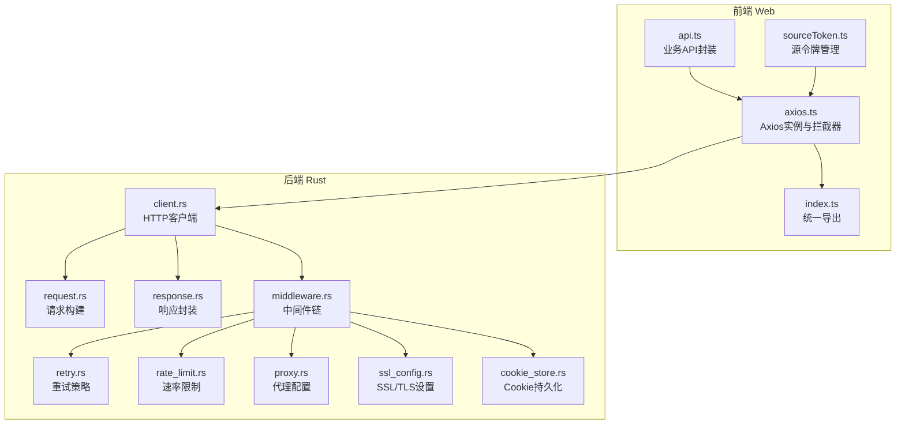
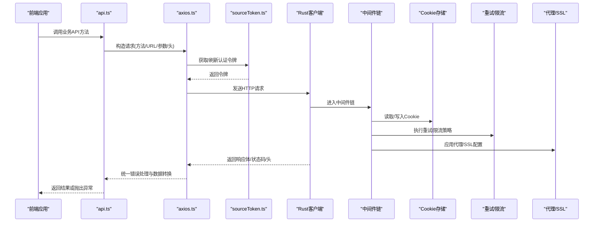
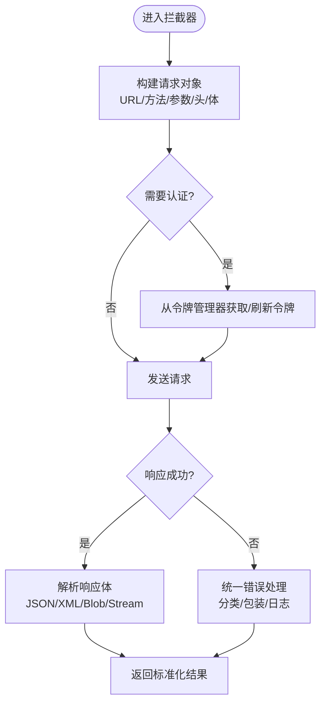
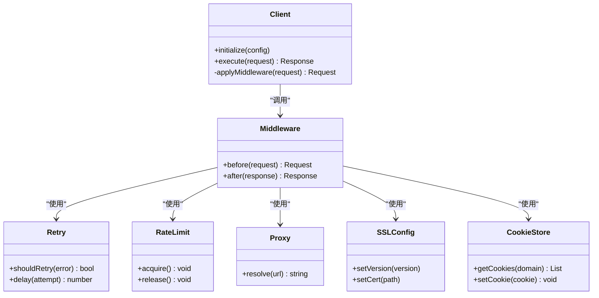
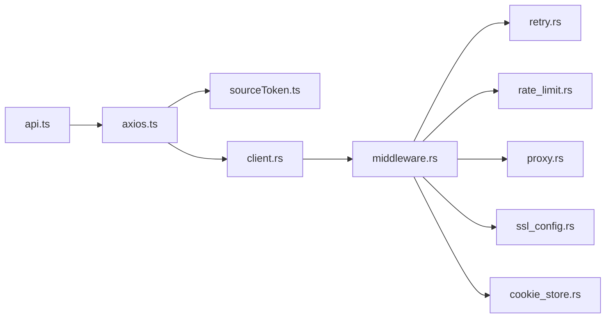

# 网络请求API

<cite>
**本文引用的文件**   
- [modules/web/src/api/axios.ts](file://modules/web/src/api/axios.ts)
- [modules/web/src/api/index.ts](file://modules/web/src/api/index.ts)
- [modules/web/src/api/api.ts](file://modules/web/src/api/api.ts)
- [modules/web/src/api/sourceToken.ts](file://modules/web/src/api/sourceToken.ts)
- [app/src/main/java/io/legado/app/help/http/OkHttpUtils.kt](file://app/src/main/java/io/legado/app/help/http/OkHttpUtils.kt)
- [rust/legado-net/src/client.rs](file://rust/legado-net/src/client.rs)
- [rust/legado-net/src/request.rs](file://rust/legado-net/src/request.rs)
- [rust/legado-net/src/response.rs](file://rust/legado-net/src/response.rs)
- [rust/legado-net/src/middleware.rs](file://rust/legado-net/src/middleware.rs)
- [rust/legado-net/src/cookie_store.rs](file://rust/legado-net/src/cookie_store.rs)
- [rust/legado-net/src/retry.rs](file://rust/legado-net/src/retry.rs)
- [rust/legado-net/src/rate_limit.rs](file://rust/legado-net/src/rate_limit.rs)
- [rust/legado-net/src/proxy.rs](file://rust/legado-net/src/proxy.rs)
- [rust/legado-net/src/ssl_config.rs](file://rust/legado-net/src/ssl_config.rs)
</cite>

## 目录
1. [简介](#简介)
2. [项目结构](#项目结构)
3. [核心组件](#核心组件)
4. [架构总览](#架构总览)
5. [详细组件分析](#详细组件分析)
6. [依赖关系分析](#依赖关系分析)
7. [性能考虑](#性能考虑)
8. [故障排查指南](#故障排查指南)
9. [结论](#结论)
10. [附录：API参考与示例](#附录api参考与示例)

## 简介
本文件面向Legado项目的网络请求API，覆盖前端Web端（TypeScript）与后端（Rust）两端的HTTP客户端封装、拦截器机制、Cookie与认证令牌管理、异步调用方式（Promise与回调）、错误处理策略以及常见场景（文件下载、表单提交、流式传输）的用法。同时提供性能优化建议与最佳实践，帮助开发者快速上手并稳定集成。

## 项目结构
本项目在网络层采用“前端轻量封装 + 后端高性能实现”的分层设计：
- 前端（Web模块）：基于Axios进行请求构建、响应解析、拦截器配置与统一错误处理，暴露简洁的get/post/put/delete等接口。
- 后端（Rust模块）：提供高性能HTTP客户端、中间件链、重试与限流、代理与SSL配置、Cookie存储等能力，供上层业务或FFI调用。

**图表来源** 
- [modules/web/src/api/axios.ts](file://modules/web/src/api/axios.ts)
- [modules/web/src/api/index.ts](file://modules/web/src/api/index.ts)
- [modules/web/src/api/api.ts](file://modules/web/src/api/api.ts)
- [modules/web/src/api/sourceToken.ts](file://modules/web/src/api/sourceToken.ts)
- [rust/legado-net/src/client.rs](file://rust/legado-net/src/client.rs)
- [rust/legado-net/src/request.rs](file://rust/legado-net/src/request.rs)
- [rust/legado-net/src/response.rs](file://rust/legado-net/src/response.rs)
- [rust/legado-net/src/middleware.rs](file://rust/legado-net/src/middleware.rs)
- [rust/legado-net/src/retry.rs](file://rust/legado-net/src/retry.rs)
- [rust/legado-net/src/rate_limit.rs](file://rust/legado-net/src/rate_limit.rs)
- [rust/legado-net/src/proxy.rs](file://rust/legado-net/src/proxy.rs)
- [rust/legado-net/src/ssl_config.rs](file://rust/legado-net/src/ssl_config.rs)
- [rust/legado-net/src/cookie_store.rs](file://rust/legado-net/src/cookie_store.rs)

**章节来源**
- [modules/web/src/api/axios.ts](file://modules/web/src/api/axios.ts)
- [modules/web/src/api/index.ts](file://modules/web/src/api/index.ts)
- [modules/web/src/api/api.ts](file://modules/web/src/api/api.ts)
- [modules/web/src/api/sourceToken.ts](file://modules/web/src/api/sourceToken.ts)
- [rust/legado-net/src/client.rs](file://rust/legado-net/src/client.rs)
- [rust/legado-net/src/request.rs](file://rust/legado-net/src/request.rs)
- [rust/legado-net/src/response.rs](file://rust/legado-net/src/response.rs)
- [rust/legado-net/src/middleware.rs](file://rust/legado-net/src/middleware.rs)
- [rust/legado-net/src/retry.rs](file://rust/legado-net/src/retry.rs)
- [rust/legado-net/src/rate_limit.rs](file://rust/legado-net/src/rate_limit.rs)
- [rust/legado-net/src/proxy.rs](file://rust/legado-net/src/proxy.rs)
- [rust/legado-net/src/ssl_config.rs](file://rust/legado-net/src/ssl_config.rs)
- [rust/legado-net/src/cookie_store.rs](file://rust/legado-net/src/cookie_store.rs)

## 核心组件
- Axios实例与拦截器：负责请求头注入、Cookie同步、认证令牌自动附加、统一错误处理与日志记录。
- 统一导出：对外暴露简洁的HTTP方法（get/post/put/delete等），屏蔽底层细节。
- 源令牌管理：集中维护不同源的认证令牌，支持刷新与失效处理。
- Rust HTTP客户端：高性能网络栈，支持中间件链、重试、限流、代理、SSL配置与Cookie持久化。

**章节来源**
- [modules/web/src/api/axios.ts](file://modules/web/src/api/axios.ts)
- [modules/web/src/api/index.ts](file://modules/web/src/api/index.ts)
- [modules/web/src/api/sourceToken.ts](file://modules/web/src/api/sourceToken.ts)
- [rust/legado-net/src/client.rs](file://rust/legado-net/src/client.rs)
- [rust/legado-net/src/middleware.rs](file://rust/legado-net/src/middleware.rs)
- [rust/legado-net/src/retry.rs](file://rust/legado-net/src/retry.rs)
- [rust/legado-net/src/rate_limit.rs](file://rust/legado-net/src/rate_limit.rs)
- [rust/legado-net/src/proxy.rs](file://rust/legado-net/src/proxy.rs)
- [rust/legado-net/src/ssl_config.rs](file://rust/legado-net/src/ssl_config.rs)
- [rust/legado-net/src/cookie_store.rs](file://rust/legado-net/src/cookie_store.rs)

## 架构总览
前端通过Axios发起请求，拦截器完成头部与令牌注入；后端Rust客户端在中间件链中执行重试、限流、代理、SSL校验与Cookie管理等横切逻辑，最终返回标准化响应对象。

**图表来源** 
- [modules/web/src/api/api.ts](file://modules/web/src/api/api.ts)
- [modules/web/src/api/axios.ts](file://modules/web/src/api/axios.ts)
- [modules/web/src/api/sourceToken.ts](file://modules/web/src/api/sourceToken.ts)
- [rust/legado-net/src/client.rs](file://rust/legado-net/src/client.rs)
- [rust/legado-net/src/middleware.rs](file://rust/legado-net/src/middleware.rs)
- [rust/legado-net/src/cookie_store.rs](file://rust/legado-net/src/cookie_store.rs)
- [rust/legado-net/src/retry.rs](file://rust/legado-net/src/retry.rs)
- [rust/legado-net/src/rate_limit.rs](file://rust/legado-net/src/rate_limit.rs)
- [rust/legado-net/src/proxy.rs](file://rust/legado-net/src/proxy.rs)
- [rust/legado-net/src/ssl_config.rs](file://rust/legado-net/src/ssl_config.rs)

## 详细组件分析

### Axios实例与拦截器（请求构建、响应处理、错误处理）
- 请求构建：统一基础URL、超时、Content-Type、Accept等默认头；支持动态追加自定义头与查询参数。
- 响应处理：对JSON/XML/Blob/Stream进行类型识别与转换；提取状态码、消息与数据体。
- 错误处理：网络错误、超时、HTTP状态码错误、业务错误码的统一捕获与包装；支持重试触发条件。

**图表来源** 
- [modules/web/src/api/axios.ts](file://modules/web/src/api/axios.ts)
- [modules/web/src/api/sourceToken.ts](file://modules/web/src/api/sourceToken.ts)

**章节来源**
- [modules/web/src/api/axios.ts](file://modules/web/src/api/axios.ts)
- [modules/web/src/api/sourceToken.ts](file://modules/web/src/api/sourceToken.ts)

### 统一导出（对外API）
- 暴露get/post/put/delete等方法，简化调用方使用。
- 支持可选参数：headers、params、data、timeout、responseType等。
- 返回值格式统一为包含状态码、数据体、消息的对象。

**章节来源**
- [modules/web/src/api/index.ts](file://modules/web/src/api/index.ts)
- [modules/web/src/api/api.ts](file://modules/web/src/api/api.ts)

### 源令牌管理（认证令牌处理）
- 按源维度管理令牌，支持过期检测与自动刷新。
- 与拦截器协作，在请求前注入Authorization头。
- 失败时回退到本地缓存或提示重新登录。

**章节来源**
- [modules/web/src/api/sourceToken.ts](file://modules/web/src/api/sourceToken.ts)

### Rust HTTP客户端（中间件链、重试、限流、代理、SSL、Cookie）
- 客户端初始化：合并全局配置（超时、连接池、UA、TLS版本）。
- 中间件链：顺序执行Cookie读写、鉴权、重试、限流、代理、SSL校验等。
- 重试策略：指数退避、抖动、最大次数与条件判断（如429/5xx）。
- 限流：令牌桶或滑动窗口，避免突发流量。
- 代理：支持HTTP/SOCKS代理与直连切换。
- SSL：自定义证书、忽略验证（调试用）、协议版本控制。
- Cookie：跨请求持久化与域名隔离。

**图表来源** 
- [rust/legado-net/src/client.rs](file://rust/legado-net/src/client.rs)
- [rust/legado-net/src/middleware.rs](file://rust/legado-net/src/middleware.rs)
- [rust/legado-net/src/retry.rs](file://rust/legado-net/src/retry.rs)
- [rust/legado-net/src/rate_limit.rs](file://rust/legado-net/src/rate_limit.rs)
- [rust/legado-net/src/proxy.rs](file://rust/legado-net/src/proxy.rs)
- [rust/legado-net/src/ssl_config.rs](file://rust/legado-net/src/ssl_config.rs)
- [rust/legado-net/src/cookie_store.rs](file://rust/legado-net/src/cookie_store.rs)

**章节来源**
- [rust/legado-net/src/client.rs](file://rust/legado-net/src/client.rs)
- [rust/legado-net/src/middleware.rs](file://rust/legado-net/src/middleware.rs)
- [rust/legado-net/src/retry.rs](file://rust/legado-net/src/retry.rs)
- [rust/legado-net/src/rate_limit.rs](file://rust/legado-net/src/rate_limit.rs)
- [rust/legado-net/src/proxy.rs](file://rust/legado-net/src/proxy.rs)
- [rust/legado-net/src/ssl_config.rs](file://rust/legado-net/src/ssl_config.rs)
- [rust/legado-net/src/cookie_store.rs](file://rust/legado-net/src/cookie_store.rs)

### Android OkHttp工具（原生侧补充）
- 用于Android环境下的HTTP请求，提供连接池、缓存、拦截器扩展能力。
- 与前端/后端形成互补，满足平台特定需求。

**章节来源**
- [app/src/main/java/io/legado/app/help/http/OkHttpUtils.kt](file://app/src/main/java/io/legado/app/help/http/OkHttpUtils.kt)

## 依赖关系分析
- 前端依赖：Axios库、令牌管理器、业务API封装。
- 后端依赖：中间件链、重试/限流、代理/SSL、Cookie存储。
- 耦合点：请求头与Cookie同步、认证令牌生命周期、错误码映射。

**图表来源** 
- [modules/web/src/api/api.ts](file://modules/web/src/api/api.ts)
- [modules/web/src/api/axios.ts](file://modules/web/src/api/axios.ts)
- [modules/web/src/api/sourceToken.ts](file://modules/web/src/api/sourceToken.ts)
- [rust/legado-net/src/client.rs](file://rust/legado-net/src/client.rs)
- [rust/legado-net/src/middleware.rs](file://rust/legado-net/src/middleware.rs)
- [rust/legado-net/src/retry.rs](file://rust/legado-net/src/retry.rs)
- [rust/legado-net/src/rate_limit.rs](file://rust/legado-net/src/rate_limit.rs)
- [rust/legado-net/src/proxy.rs](file://rust/legado-net/src/proxy.rs)
- [rust/legado-net/src/ssl_config.rs](file://rust/legado-net/src/ssl_config.rs)
- [rust/legado-net/src/cookie_store.rs](file://rust/legado-net/src/cookie_store.rs)

**章节来源**
- [modules/web/src/api/api.ts](file://modules/web/src/api/api.ts)
- [modules/web/src/api/axios.ts](file://modules/web/src/api/axios.ts)
- [modules/web/src/api/sourceToken.ts](file://modules/web/src/api/sourceToken.ts)
- [rust/legado-net/src/client.rs](file://rust/legado-net/src/client.rs)
- [rust/legado-net/src/middleware.rs](file://rust/legado-net/src/middleware.rs)
- [rust/legado-net/src/retry.rs](file://rust/legado-net/src/retry.rs)
- [rust/legado-net/src/rate_limit.rs](file://rust/legado-net/src/rate_limit.rs)
- [rust/legado-net/src/proxy.rs](file://rust/legado-net/src/proxy.rs)
- [rust/legado-net/src/ssl_config.rs](file://rust/legado-net/src/ssl_config.rs)
- [rust/legado-net/src/cookie_store.rs](file://rust/legado-net/src/cookie_store.rs)

## 性能考虑
- 连接复用与连接池：合理设置最大连接数与空闲超时，减少握手开销。
- 压缩与编码：启用Gzip/Brotli，降低带宽占用。
- 缓存策略：对静态资源与可缓存响应设置合适的Cache-Control与ETag。
- 重试与退避：针对瞬态错误（网络抖动、服务端过载）启用指数退避与抖动。
- 限流与背压：防止突发流量导致服务端拒绝或客户端阻塞。
- 流式处理：大文件下载与上传使用流式IO，避免内存峰值过高。
- 超时与取消：设置合理的请求超时与取消机制，提升用户体验。

[本节为通用指导，不直接分析具体文件]

## 故障排查指南
- 常见问题定位：
  - 网络错误：检查代理、DNS、SSL证书与防火墙规则。
  - 认证失败：确认令牌是否过期、刷新流程是否正常。
  - 限流/重试：查看限流计数与重试次数，调整阈值。
  - Cookie丢失：确认域名一致性与第三方Cookie策略。
- 日志与诊断：
  - 开启请求/响应日志，记录状态码、耗时与错误堆栈。
  - 使用抓包工具验证实际报文与预期一致。
- 恢复策略：
  - 降级与熔断：在连续失败时切换到备用服务或返回缓存数据。
  - 用户提示：明确错误原因与操作指引（如重新登录、切换网络）。

**章节来源**
- [rust/legado-net/src/retry.rs](file://rust/legado-net/src/retry.rs)
- [rust/legado-net/src/rate_limit.rs](file://rust/legado-net/src/rate_limit.rs)
- [rust/legado-net/src/proxy.rs](file://rust/legado-net/src/proxy.rs)
- [rust/legado-net/src/ssl_config.rs](file://rust/legado-net/src/ssl_config.rs)
- [rust/legado-net/src/cookie_store.rs](file://rust/legado-net/src/cookie_store.rs)
- [modules/web/src/api/axios.ts](file://modules/web/src/api/axios.ts)

## 结论
Legado的网络请求API在前端与后端形成了清晰的分层与职责划分：前端以Axios为核心提供简洁易用的接口与拦截器，后端以Rust客户端实现高性能与可扩展的中间件链。通过统一的错误处理、令牌管理与Cookie持久化，系统具备良好的稳定性与可维护性。结合性能优化与故障排查策略，可在复杂网络环境下保持高效可靠的通信。

[本节为总结，不直接分析具体文件]

## 附录：API参考与示例

### HTTP方法参考
- get(url, params?, headers?, timeout?)
  - 用途：获取资源
  - 参数：url（必填）、params（查询参数）、headers（请求头）、timeout（超时毫秒）
  - 返回：{ status, data, message }
- post(url, data?, headers?, timeout?)
  - 用途：提交数据
  - 参数：url（必填）、data（请求体）、headers（请求头）、timeout（超时毫秒）
  - 返回：{ status, data, message }
- put(url, data?, headers?, timeout?)
  - 用途：更新资源
  - 参数：同上
  - 返回：同上
- delete(url, params?, headers?, timeout?)
  - 用途：删除资源
  - 参数：同上
  - 返回：同上

**章节来源**
- [modules/web/src/api/index.ts](file://modules/web/src/api/index.ts)
- [modules/web/src/api/api.ts](file://modules/web/src/api/api.ts)

### 请求拦截器使用
- 请求头设置：在拦截器中统一注入Content-Type、Accept、User-Agent等。
- Cookie管理：自动读取与写入Cookie，支持域名隔离与过期清理。
- 认证令牌：在Authorization头中注入Bearer Token，支持自动刷新。

**章节来源**
- [modules/web/src/api/axios.ts](file://modules/web/src/api/axios.ts)
- [modules/web/src/api/sourceToken.ts](file://modules/web/src/api/sourceToken.ts)
- [rust/legado-net/src/cookie_store.rs](file://rust/legado-net/src/cookie_store.rs)

### 异步调用方式
- Promise：所有方法返回Promise，支持async/await语法。
- 回调函数：可通过then/catch或error回调处理成功与失败分支。
- 取消请求：支持AbortController或自定义取消信号。

**章节来源**
- [modules/web/src/api/axios.ts](file://modules/web/src/api/axios.ts)
- [modules/web/src/api/api.ts](file://modules/web/src/api/api.ts)

### 常见场景示例（路径引用）
- 文件下载：使用Blob或流式响应，设置responseType为blob/stream。
- 表单提交：使用FormData或application/x-www-form-urlencoded。
- 流式传输：分块上传/下载，监听进度事件。
- 多文件上传：组合FormData与文件列表，设置并发限制。

**章节来源**
- [modules/web/src/api/axios.ts](file://modules/web/src/api/axios.ts)
- [modules/web/src/api/api.ts](file://modules/web/src/api/api.ts)

### 性能优化技巧与最佳实践
- 合理设置超时与重试策略，避免长时间阻塞。
- 启用压缩与缓存，减少带宽与重复请求。
- 使用连接池与Keep-Alive，提高复用率。
- 对大文件使用流式IO，避免内存溢出。
- 监控与告警：记录关键指标（成功率、延迟、错误率）。

[本节为通用指导，不直接分析具体文件]