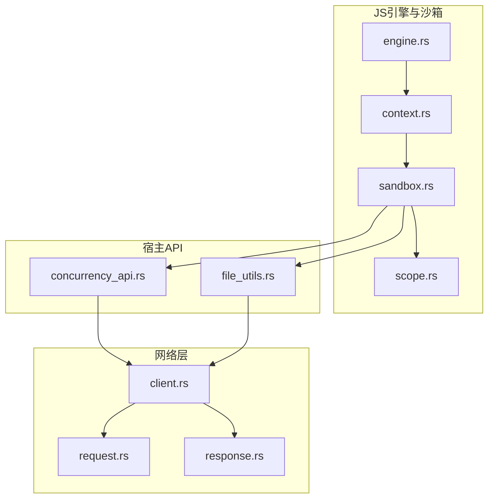
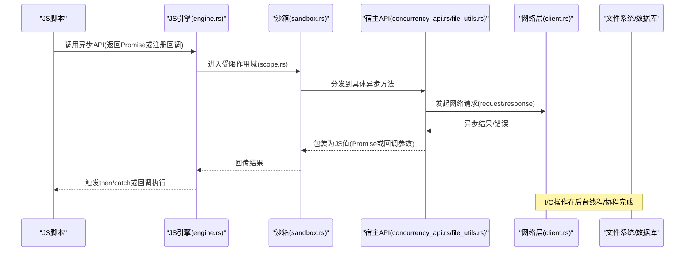
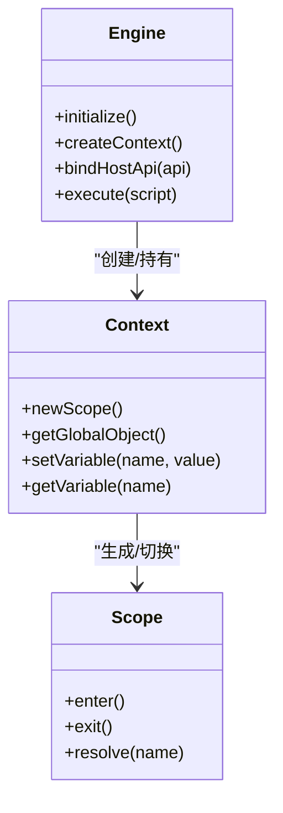
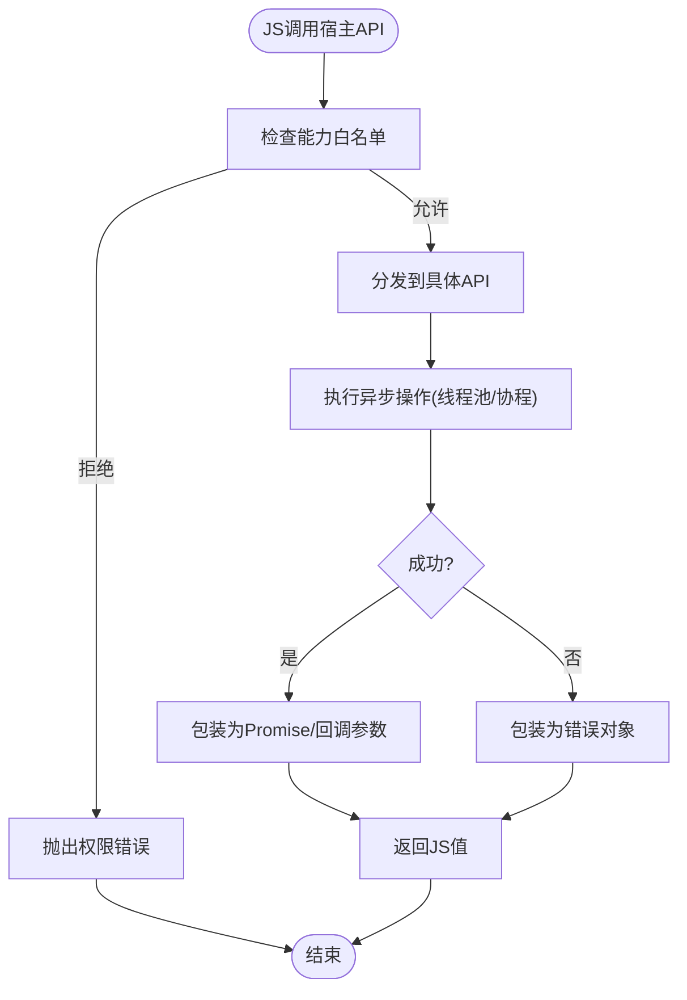
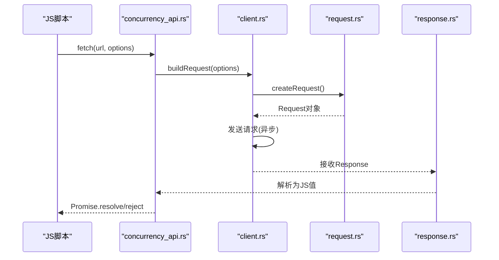
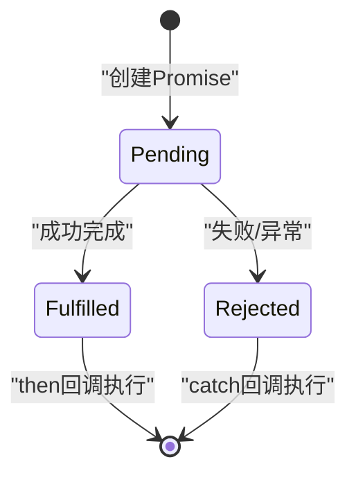
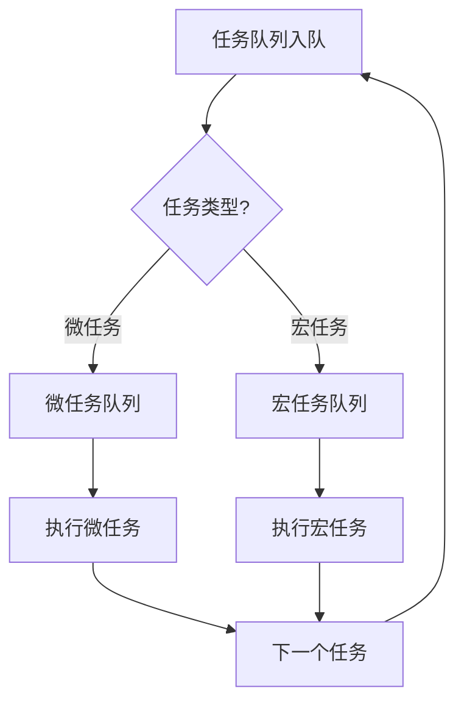
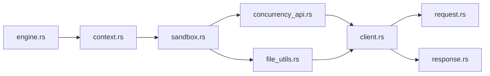

# 异步编程支持

<cite>
**本文引用的文件**   
- [engine.rs](file://rust/legado-js/src/engine.rs)
- [context.rs](file://rust/legado-js/src/context.rs)
- [sandbox.rs](file://rust/legado-js/src/sandbox.rs)
- [scope.rs](file://rust/legado-js/src/scope.rs)
- [concurrency_api.rs](file://rust/legado-js/src/host_api/concurrency_api.rs)
- [file_utils.rs](file://rust/legado-js/src/host_api/file_utils.rs)
- [client.rs](file://rust/legado-net/src/client.rs)
- [request.rs](file://rust/legado-net/src/request.rs)
- [response.rs](file://rust/legado-net/src/response.rs)
- [lib.rs](file://rust/legado-js/src/lib.rs)
</cite>

## 目录
1. [简介](#简介)
2. [项目结构](#项目结构)
3. [核心组件](#核心组件)
4. [架构总览](#架构总览)
5. [详细组件分析](#详细组件分析)
6. [依赖关系分析](#依赖关系分析)
7. [性能考量](#性能考量)
8. [故障排查指南](#故障排查指南)
9. [结论](#结论)
10. [附录](#附录)

## 简介
本文件面向Legado项目中JavaScript异步编程支持的实现与使用，重点覆盖：
- Promise机制的实现要点：创建、状态转换与错误处理
- 回调函数支持：异步回调注册、执行顺序保证与异常传播
- 异步I/O封装：网络请求、文件读写、数据库操作的异步化
- 事件循环机制：任务调度、优先级管理与性能优化
- 异步编程模式与最佳实践：async/await语法支持与错误处理策略
- 调试技巧与性能分析方法

## 项目结构
本项目在Rust侧通过Rhino引擎暴露JS运行时能力，并在legado-js模块中提供宿主API（如并发、文件、加密等），在网络层legado-net中提供异步HTTP客户端。整体分层如下：
- JS引擎与沙箱：engine.rs、context.rs、sandbox.rs、scope.rs
- 宿主API：host_api/*（并发、文件、配置、加密等）
- 网络层：legado-net（client、request、response、中间件、重试等）
- 入口与导出：lib.rs

**图表来源** 
- [engine.rs](file://rust/legado-js/src/engine.rs)
- [context.rs](file://rust/legado-js/src/context.rs)
- [sandbox.rs](file://rust/legado-js/src/sandbox.rs)
- [scope.rs](file://rust/legado-js/src/scope.rs)
- [concurrency_api.rs](file://rust/legado-js/src/host_api/concurrency_api.rs)
- [file_utils.rs](file://rust/legado-js/src/host_api/file_utils.rs)
- [client.rs](file://rust/legado-net/src/client.rs)
- [request.rs](file://rust/legado-net/src/request.rs)
- [response.rs](file://rust/legado-net/src/response.rs)

**章节来源**
- [lib.rs](file://rust/legado-js/src/lib.rs)

## 核心组件
- JS引擎与上下文管理：负责初始化Rhino引擎、创建上下文与作用域、绑定宿主API到JS世界
- 沙箱隔离：为脚本运行提供受限环境，限制危险能力并注入安全API
- 并发与任务调度：将JS异步调用映射到Rust线程池或协程，确保非阻塞执行与结果回传
- 网络I/O：基于异步HTTP客户端发起请求，统一封装为Promise或回调形式供JS使用
- 文件I/O：提供异步文件读取/写入接口，避免阻塞主线程

**章节来源**
- [engine.rs](file://rust/legado-js/src/engine.rs)
- [context.rs](file://rust/legado-js/src/context.rs)
- [sandbox.rs](file://rust/legado-js/src/sandbox.rs)
- [scope.rs](file://rust/legado-js/src/scope.rs)
- [concurrency_api.rs](file://rust/legado-js/src/host_api/concurrency_api.rs)
- [file_utils.rs](file://rust/legado-js/src/host_api/file_utils.rs)
- [client.rs](file://rust/legado-net/src/client.rs)

## 架构总览
下图展示了从JS脚本发起异步操作到网络/文件I/O的完整流程，以及Promise/回调的桥接方式。

**图表来源** 
- [engine.rs](file://rust/legado-js/src/engine.rs)
- [sandbox.rs](file://rust/legado-js/src/sandbox.rs)
- [scope.rs](file://rust/legado-js/src/scope.rs)
- [concurrency_api.rs](file://rust/legado-js/src/host_api/concurrency_api.rs)
- [file_utils.rs](file://rust/legado-js/src/host_api/file_utils.rs)
- [client.rs](file://rust/legado-net/src/client.rs)
- [request.rs](file://rust/legado-net/src/request.rs)
- [response.rs](file://rust/legado-net/src/response.rs)

## 详细组件分析

### 组件A：JS引擎与作用域（engine.rs、context.rs、scope.rs）
- 职责：初始化引擎、创建上下文与作用域、绑定全局对象与方法
- 关键点：
  - 作用域隔离：每个脚本运行在独立作用域内，避免全局污染
  - 上下文复用：合理复用Context以减少开销
  - 生命周期管理：确保引擎与上下文正确释放，防止内存泄漏

**图表来源** 
- [engine.rs](file://rust/legado-js/src/engine.rs)
- [context.rs](file://rust/legado-js/src/context.rs)
- [scope.rs](file://rust/legado-js/src/scope.rs)

**章节来源**
- [engine.rs](file://rust/legado-js/src/engine.rs)
- [context.rs](file://rust/legado-js/src/context.rs)
- [scope.rs](file://rust/legado-js/src/scope.rs)

### 组件B：沙箱与宿主API（sandbox.rs、concurrency_api.rs、file_utils.rs）
- 职责：为脚本提供受限环境，注入并发与文件API
- 关键点：
  - 能力白名单：仅暴露必要API，降低安全风险
  - 异步桥接：将Rust异步调用转换为JS Promise或回调
  - 错误传播：统一错误类型，确保JS侧catch能捕获

**图表来源** 
- [sandbox.rs](file://rust/legado-js/src/sandbox.rs)
- [concurrency_api.rs](file://rust/legado-js/src/host_api/concurrency_api.rs)
- [file_utils.rs](file://rust/legado-js/src/host_api/file_utils.rs)

**章节来源**
- [sandbox.rs](file://rust/legado-js/src/sandbox.rs)
- [concurrency_api.rs](file://rust/legado-js/src/host_api/concurrency_api.rs)
- [file_utils.rs](file://rust/legado-js/src/host_api/file_utils.rs)

### 组件C：网络异步I/O（client.rs、request.rs、response.rs）
- 职责：封装HTTP请求，提供超时、重试、中间件等能力
- 关键点：
  - 非阻塞：基于异步客户端，避免阻塞JS线程
  - 统一响应：标准化响应体、状态码、头部
  - 错误分类：区分网络错误、解析错误、业务错误

**图表来源** 
- [client.rs](file://rust/legado-net/src/client.rs)
- [request.rs](file://rust/legado-net/src/request.rs)
- [response.rs](file://rust/legado-net/src/response.rs)
- [concurrency_api.rs](file://rust/legado-js/src/host_api/concurrency_api.rs)

**章节来源**
- [client.rs](file://rust/legado-net/src/client.rs)
- [request.rs](file://rust/legado-net/src/request.rs)
- [response.rs](file://rust/legado-net/src/response.rs)

### 组件D：Promise机制与回调桥接
- Promise创建：宿主API返回Promise实例，内部封装Rust Future
- 状态转换：pending -> fulfilled/rejected，由异步操作完成时触发
- 错误处理：所有异常统一包装为Error对象，可通过catch捕获
- 回调支持：对于不支持Promise的环境，降级为回调形式

**图表来源** 
- [concurrency_api.rs](file://rust/legado-js/src/host_api/concurrency_api.rs)
- [sandbox.rs](file://rust/legado-js/src/sandbox.rs)

**章节来源**
- [concurrency_api.rs](file://rust/legado-js/src/host_api/concurrency_api.rs)
- [sandbox.rs](file://rust/legado-js/src/sandbox.rs)

### 组件E：事件循环与任务调度
- 任务队列：JS微任务与宏任务分离，确保then/catch优先执行
- 优先级管理：高优先级任务（如UI更新）插队执行
- 性能优化：批量处理任务，减少上下文切换开销

[此图为概念性流程图，不直接映射到具体源码文件]

## 依赖关系分析
- 松耦合设计：JS引擎与宿主API通过接口解耦，便于替换实现
- 外部依赖：Rhino引擎、异步HTTP客户端、文件系统库
- 潜在循环依赖：通过模块化与接口抽象避免

**图表来源** 
- [engine.rs](file://rust/legado-js/src/engine.rs)
- [context.rs](file://rust/legado-js/src/context.rs)
- [sandbox.rs](file://rust/legado-js/src/sandbox.rs)
- [concurrency_api.rs](file://rust/legado-js/src/host_api/concurrency_api.rs)
- [file_utils.rs](file://rust/legado-js/src/host_api/file_utils.rs)
- [client.rs](file://rust/legado-net/src/client.rs)
- [request.rs](file://rust/legado-net/src/request.rs)
- [response.rs](file://rust/legado-net/src/response.rs)

**章节来源**
- [lib.rs](file://rust/legado-js/src/lib.rs)

## 性能考量
- 线程池大小：根据设备CPU核数动态调整，避免过多上下文切换
- 内存管理：及时释放不再使用的Promise与回调引用
- I/O合并：批量文件读写，减少系统调用次数
- 缓存策略：对频繁访问的数据进行缓存，提升响应速度

## 故障排查指南
- 常见问题：
  - Promise未解决：检查异步操作是否被正确触发
  - 回调未执行：确认作用域是否正确切换
  - 内存泄漏：监控引擎与上下文的生命周期
- 调试技巧：
  - 启用详细日志：记录关键步骤与错误堆栈
  - 使用性能分析工具：定位热点函数与阻塞点
  - 单元测试：覆盖边界条件与异常路径

**章节来源**
- [concurrency_api.rs](file://rust/legado-js/src/host_api/concurrency_api.rs)
- [sandbox.rs](file://rust/legado-js/src/sandbox.rs)

## 结论
Legado项目的JavaScript异步编程支持通过Rust侧的高效实现，为JS脚本提供了强大的异步能力。通过Promise机制、回调桥接、事件循环优化与严格的沙箱隔离，确保了安全性与性能的平衡。建议开发者遵循最佳实践，合理使用异步API，以获得更好的用户体验。

## 附录
- async/await支持：通过Promise链式调用模拟，保持语法一致性
- 错误处理策略：统一错误类型，提供丰富的错误信息
- 扩展点：新增宿主API时，遵循现有模式，确保向后兼容