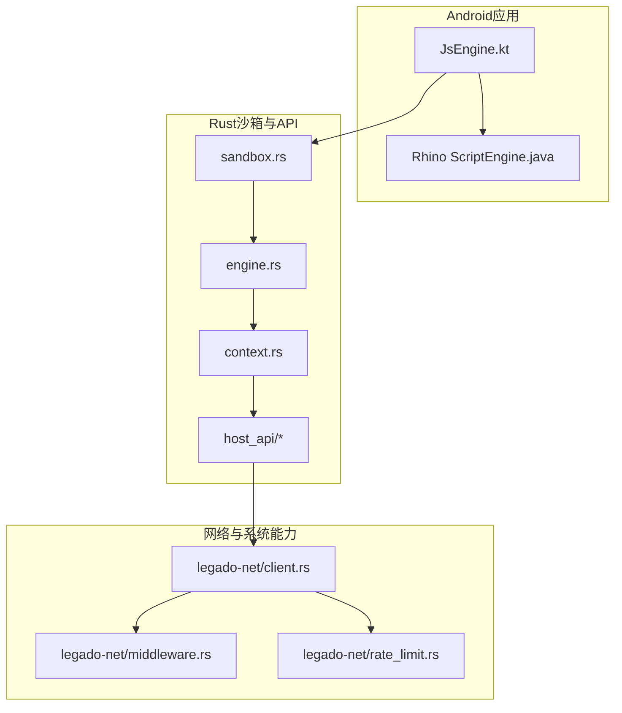
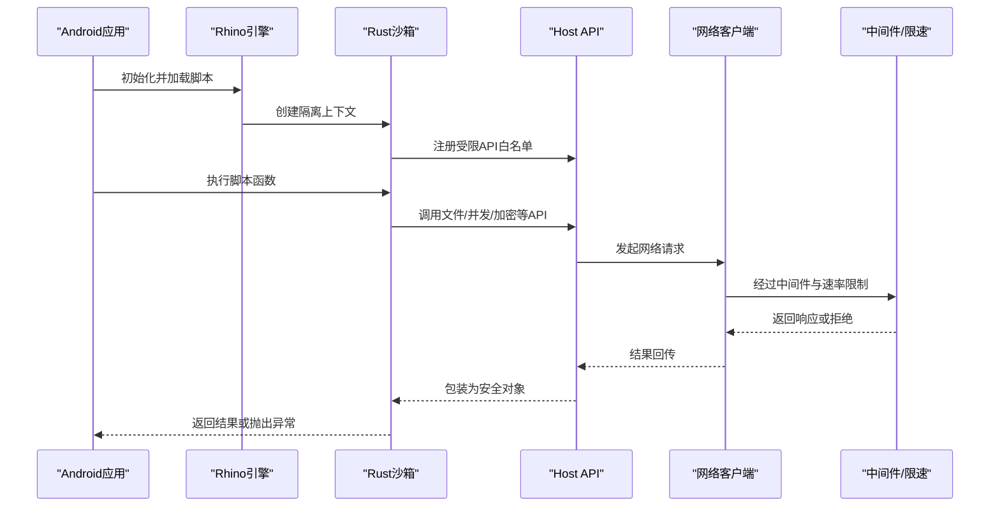
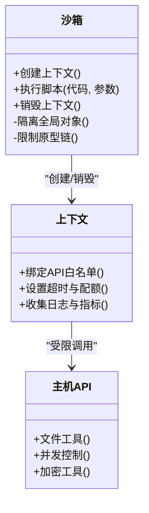
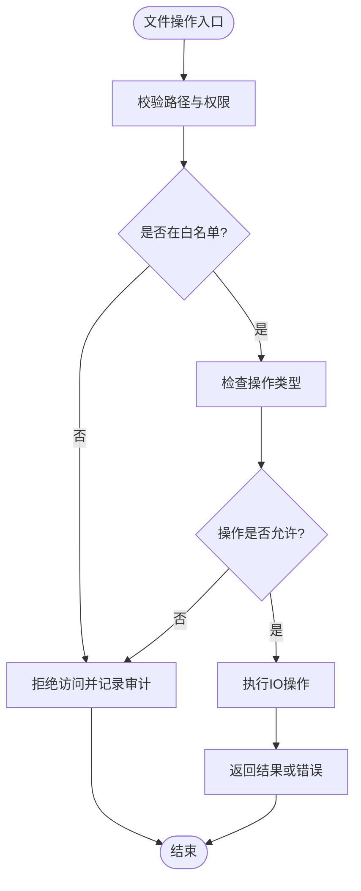
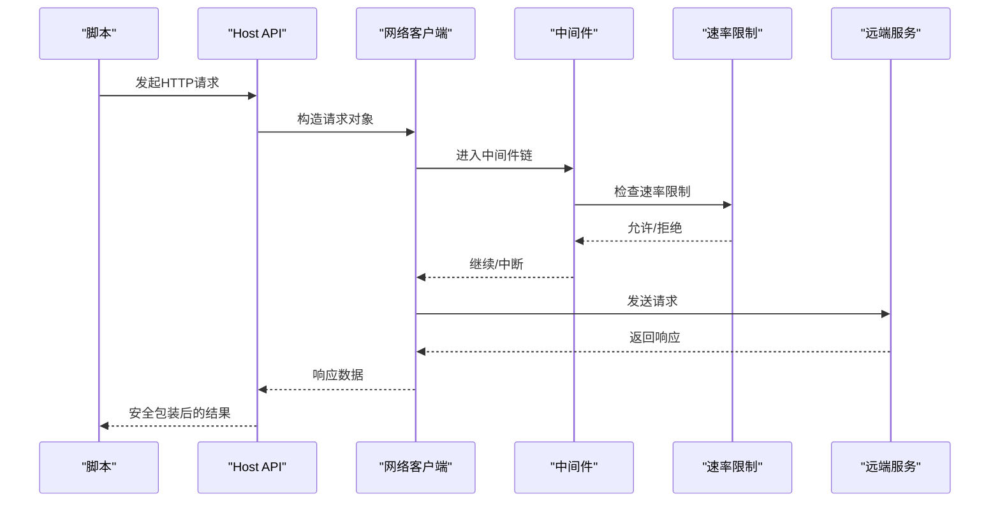
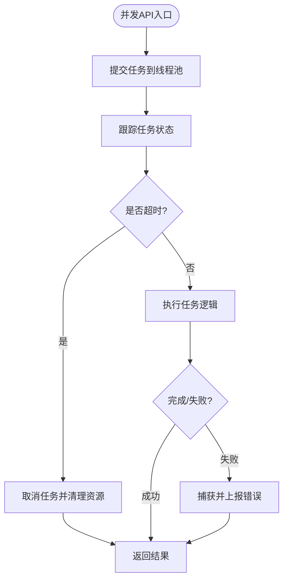
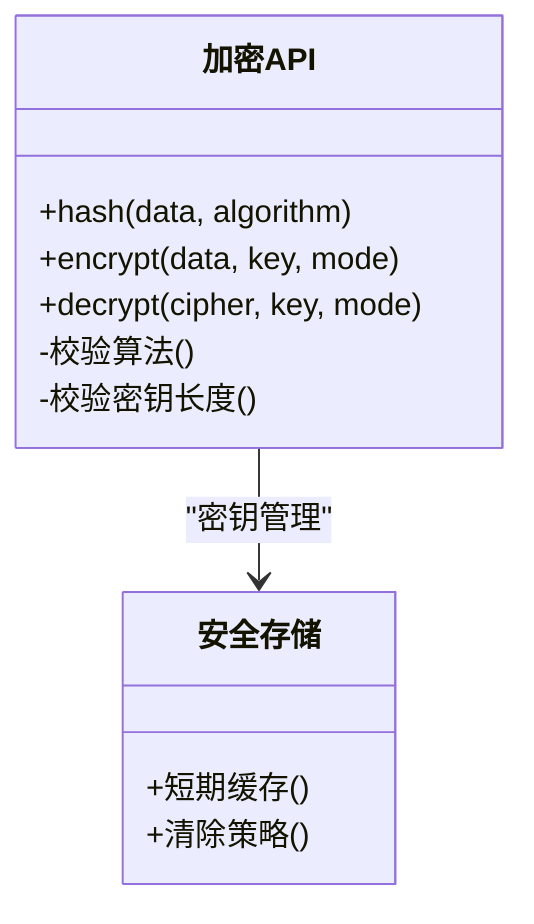
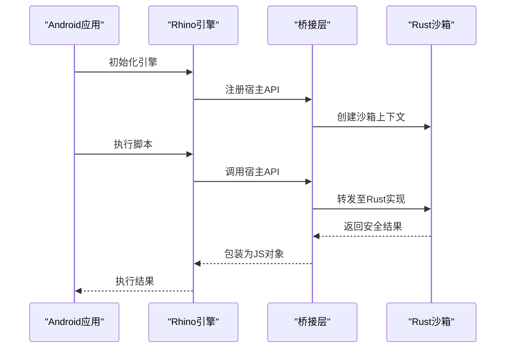
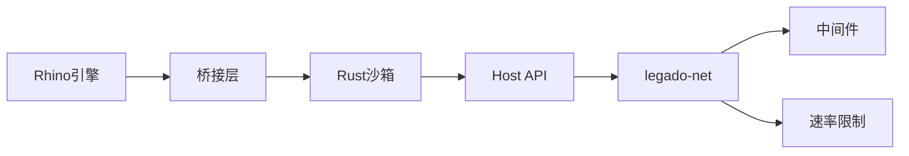
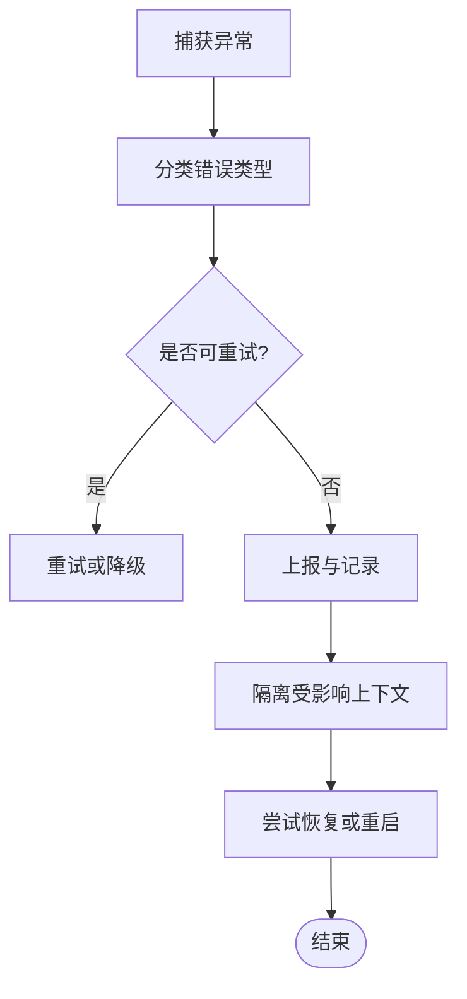

# 沙箱安全机制

<cite>
**本文引用的文件**   
- [modules/rhino/src/main/java/com/script/ScriptEngine.java](file://modules/rhino/src/main/java/com/script/ScriptEngine.java)
- [app/src/main/java/io/legado/app/lib/js/JsEngine.kt](file://app/src/main/java/io/legado/app/lib/js/JsEngine.kt)
- [rust/legado-js/src/sandbox.rs](file://rust/legado-js/src/sandbox.rs)
- [rust/legado-js/src/engine.rs](file://rust/legado-js/src/engine.rs)
- [rust/legado-js/src/context.rs](file://rust/legado-js/src/context.rs)
- [rust/legado-js/src/host_api/mod.rs](file://rust/legado-js/src/host_api/mod.rs)
- [rust/legado-js/src/host_api/file_utils.rs](file://rust/legado-js/src/host_api/file_utils.rs)
- [rust/legado-js/src/host_api/concurrency_api.rs](file://rust/legado-js/src/host_api/concurrency_api.rs)
- [rust/legado-js/src/host_api/crypto_api.rs](file://rust/legado-js/src/host_api/crypto_api.rs)
- [rust/legado-net/src/client.rs](file://rust/legado-net/src/client.rs)
- [rust/legado-net/src/middleware.rs](file://rust/legado-net/src/middleware.rs)
- [rust/legado-net/src/rate_limit.rs](file://rust/legado-net/src/rate_limit.rs)
- [rust/legado-core/src/error.rs](file://rust/legado-core/src/error.rs)
- [rust/legado-core/src/debug_session.rs](file://rust/legado-core/src/debug_session.rs)
</cite>

## 目录
1. [简介](#简介)
2. [项目结构](#项目结构)
3. [核心组件](#核心组件)
4. [架构总览](#架构总览)
5. [详细组件分析](#详细组件分析)
6. [依赖关系分析](#依赖关系分析)
7. [性能考量](#性能考量)
8. [故障排查指南](#故障排查指南)
9. [结论](#结论)
10. [附录](#附录)

## 简介
本文件面向Legado项目中JavaScript脚本执行的安全机制，系统性阐述沙箱隔离、权限管理、资源限制与安全边界等关键能力。内容覆盖：
- 内存与上下文隔离原理
- 文件系统访问限制与网络请求控制
- API白名单与操作权限验证
- CPU时间、内存使用监控与垃圾回收策略
- 原生代码保护、异常处理与错误隔离
- 安全配置与最佳实践
- 漏洞防护与审计方法

## 项目结构
本项目在Android端通过Rhino引擎提供JS执行环境，同时在Rust侧构建了更严格的legado-js沙箱层，并通过host_api暴露受控API给脚本。网络能力由legado-net统一封装，具备中间件、速率限制与代理等能力。

图表来源
- [app/src/main/java/io/legado/app/lib/js/JsEngine.kt](file://app/src/main/java/io/legado/app/lib/js/JsEngine.kt)
- [modules/rhino/src/main/java/com/script/ScriptEngine.java](file://modules/rhino/src/main/java/com/script/ScriptEngine.java)
- [rust/legado-js/src/sandbox.rs](file://rust/legado-js/src/sandbox.rs)
- [rust/legado-js/src/engine.rs](file://rust/legado-js/src/engine.rs)
- [rust/legado-js/src/context.rs](file://rust/legado-js/src/context.rs)
- [rust/legado-js/src/host_api/mod.rs](file://rust/legado-js/src/host_api/mod.rs)
- [rust/legado-net/src/client.rs](file://rust/legado-net/src/client.rs)
- [rust/legado-net/src/middleware.rs](file://rust/legado-net/src/middleware.rs)
- [rust/legado-net/src/rate_limit.rs](file://rust/legado-net/src/rate_limit.rs)

章节来源
- [app/src/main/java/io/legado/app/lib/js/JsEngine.kt](file://app/src/main/java/io/legado/app/lib/js/JsEngine.kt)
- [modules/rhino/src/main/java/com/script/ScriptEngine.java](file://modules/rhino/src/main/java/com/script/ScriptEngine.java)
- [rust/legado-js/src/sandbox.rs](file://rust/legado-js/src/sandbox.rs)
- [rust/legado-js/src/engine.rs](file://rust/legado-js/src/engine.rs)
- [rust/legado-js/src/context.rs](file://rust/legado-js/src/context.rs)
- [rust/legado-js/src/host_api/mod.rs](file://rust/legado-js/src/host_api/mod.rs)
- [rust/legado-net/src/client.rs](file://rust/legado-net/src/client.rs)
- [rust/legado-net/src/middleware.rs](file://rust/legado-net/src/middleware.rs)
- [rust/legado-net/src/rate_limit.rs](file://rust/legado-net/src/rate_limit.rs)

## 核心组件
- Rhino脚本引擎（Android）：提供JS运行时基础能力，作为上层桥接入口。
- Rust沙箱（legado-js）：构建强隔离的执行上下文，严格管控宿主API暴露面。
- Host API层：以模块化的方式暴露受限的API（如文件、并发、加密等）。
- 网络客户端（legado-net）：集中化网络请求，内置中间件、速率限制与代理支持。
- 错误与调试：统一的错误模型与调试会话，便于定位问题与审计。

章节来源
- [modules/rhino/src/main/java/com/script/ScriptEngine.java](file://modules/rhino/src/main/java/com/script/ScriptEngine.java)
- [rust/legado-js/src/sandbox.rs](file://rust/legado-js/src/sandbox.rs)
- [rust/legado-js/src/host_api/mod.rs](file://rust/legado-js/src/host_api/mod.rs)
- [rust/legado-net/src/client.rs](file://rust/legado-net/src/client.rs)
- [rust/legado-core/src/error.rs](file://rust/legado-core/src/error.rs)
- [rust/legado-core/src/debug_session.rs](file://rust/legado-core/src/debug_session.rs)

## 架构总览
下图展示了从Android到Rust沙箱再到网络层的调用链，以及权限校验与资源限制的介入点。

图表来源
- [modules/rhino/src/main/java/com/script/ScriptEngine.java](file://modules/rhino/src/main/java/com/script/ScriptEngine.java)
- [rust/legado-js/src/sandbox.rs](file://rust/legado-js/src/sandbox.rs)
- [rust/legado-js/src/host_api/mod.rs](file://rust/legado-js/src/host_api/mod.rs)
- [rust/legado-net/src/client.rs](file://rust/legado-net/src/client.rs)
- [rust/legado-net/src/middleware.rs](file://rust/legado-net/src/middleware.rs)
- [rust/legado-net/src/rate_limit.rs](file://rust/legado-net/src/rate_limit.rs)

## 详细组件分析

### 沙箱隔离与上下文管理
- 隔离目标：确保脚本无法直接访问宿主敏感对象与全局状态，所有能力必须通过白名单API暴露。
- 上下文设计：每个脚本拥有独立上下文，生命周期内资源可被回收；跨上下文通信需经显式接口。
- 内存隔离：避免共享可变状态，必要时通过不可变数据或序列化传输。

图表来源
- [rust/legado-js/src/sandbox.rs](file://rust/legado-js/src/sandbox.rs)
- [rust/legado-js/src/context.rs](file://rust/legado-js/src/context.rs)
- [rust/legado-js/src/host_api/mod.rs](file://rust/legado-js/src/host_api/mod.rs)

章节来源
- [rust/legado-js/src/sandbox.rs](file://rust/legado-js/src/sandbox.rs)
- [rust/legado-js/src/context.rs](file://rust/legado-js/src/context.rs)

### 文件系统访问限制
- 路径白名单：仅允许访问预定义目录，禁止越权读取系统文件或用户隐私数据。
- 读写控制：按操作类型（读/写/删/列目录）进行细粒度授权。
- 输入校验：对文件名、路径长度、特殊字符进行严格校验，防止注入与遍历攻击。

图表来源
- [rust/legado-js/src/host_api/file_utils.rs](file://rust/legado-js/src/host_api/file_utils.rs)

章节来源
- [rust/legado-js/src/host_api/file_utils.rs](file://rust/legado-js/src/host_api/file_utils.rs)

### 网络请求控制
- 统一客户端：所有网络请求经由legado-net客户端，便于集中治理。
- 中间件链：支持鉴权、日志、重试、限流、代理等横切关注点。
- 速率限制：基于域名/IP/用户维度限制并发与QPS，防止滥用。

图表来源
- [rust/legado-js/src/host_api/mod.rs](file://rust/legado-js/src/host_api/mod.rs)
- [rust/legado-net/src/client.rs](file://rust/legado-net/src/client.rs)
- [rust/legado-net/src/middleware.rs](file://rust/legado-net/src/middleware.rs)
- [rust/legado-net/src/rate_limit.rs](file://rust/legado-net/src/rate_limit.rs)

章节来源
- [rust/legado-net/src/client.rs](file://rust/legado-net/src/client.rs)
- [rust/legado-net/src/middleware.rs](file://rust/legado-net/src/middleware.rs)
- [rust/legado-net/src/rate_limit.rs](file://rust/legado-net/src/rate_limit.rs)

### 并发与线程安全
- 任务调度：通过并发API将耗时操作放入线程池，避免阻塞UI或主循环。
- 同步原语：提供安全的锁与信号量，防止竞态条件与死锁。
- 取消与超时：支持任务级取消与超时控制，保障资源释放。

图表来源
- [rust/legado-js/src/host_api/concurrency_api.rs](file://rust/legado-js/src/host_api/concurrency_api.rs)

章节来源
- [rust/legado-js/src/host_api/concurrency_api.rs](file://rust/legado-js/src/host_api/concurrency_api.rs)

### 加密与敏感数据处理
- 算法白名单：仅暴露必要的加密哈希与对称算法，禁用不安全模式。
- 密钥管理：密钥不落地或采用短期缓存，避免明文泄露。
- 输入输出校验：对密文格式、长度、填充进行校验，防止解析错误导致崩溃。

图表来源
- [rust/legado-js/src/host_api/crypto_api.rs](file://rust/legado-js/src/host_api/crypto_api.rs)

章节来源
- [rust/legado-js/src/host_api/crypto_api.rs](file://rust/legado-js/src/host_api/crypto_api.rs)

### Android与Rhino集成
- 引擎初始化：在Android层初始化Rhino引擎，并建立与Rust沙箱的桥接。
- 能力映射：将Rust侧受控API映射为Rhino可用的对象与方法。
- 生命周期管理：随页面/任务生命周期创建与销毁上下文，避免内存泄漏。

图表来源
- [modules/rhino/src/main/java/com/script/ScriptEngine.java](file://modules/rhino/src/main/java/com/script/ScriptEngine.java)
- [app/src/main/java/io/legado/app/lib/js/JsEngine.kt](file://app/src/main/java/io/legado/app/lib/js/JsEngine.kt)
- [rust/legado-js/src/engine.rs](file://rust/legado-js/src/engine.rs)

章节来源
- [modules/rhino/src/main/java/com/script/ScriptEngine.java](file://modules/rhino/src/main/java/com/script/ScriptEngine.java)
- [app/src/main/java/io/legado/app/lib/js/JsEngine.kt](file://app/src/main/java/io/legado/app/lib/js/JsEngine.kt)
- [rust/legado-js/src/engine.rs](file://rust/legado-js/src/engine.rs)

## 依赖关系分析
- 低耦合高内聚：沙箱与Host API解耦，网络能力集中在legado-net，便于扩展与维护。
- 明确边界：Android/Rhino仅负责桥接与展示，核心安全逻辑下沉至Rust。
- 外部依赖最小化：通过中间件与插件化扩展能力，降低直接依赖风险。

图表来源
- [modules/rhino/src/main/java/com/script/ScriptEngine.java](file://modules/rhino/src/main/java/com/script/ScriptEngine.java)
- [app/src/main/java/io/legado/app/lib/js/JsEngine.kt](file://app/src/main/java/io/legado/app/lib/js/JsEngine.kt)
- [rust/legado-js/src/sandbox.rs](file://rust/legado-js/src/sandbox.rs)
- [rust/legado-js/src/host_api/mod.rs](file://rust/legado-js/src/host_api/mod.rs)
- [rust/legado-net/src/client.rs](file://rust/legado-net/src/client.rs)
- [rust/legado-net/src/middleware.rs](file://rust/legado-net/src/middleware.rs)
- [rust/legado-net/src/rate_limit.rs](file://rust/legado-net/src/rate_limit.rs)

章节来源
- [rust/legado-js/src/sandbox.rs](file://rust/legado-js/src/sandbox.rs)
- [rust/legado-js/src/host_api/mod.rs](file://rust/legado-js/src/host_api/mod.rs)
- [rust/legado-net/src/client.rs](file://rust/legado-net/src/client.rs)
- [rust/legado-net/src/middleware.rs](file://rust/legado-net/src/middleware.rs)
- [rust/legado-net/src/rate_limit.rs](file://rust/legado-net/src/rate_limit.rs)

## 性能考量
- CPU时间限制：为脚本执行设置最大运行时长，超限自动终止，避免CPU饥饿。
- 内存使用监控：统计脚本内存峰值，触发告警或强制回收，防止OOM。
- 垃圾回收控制：在合适时机触发GC，平衡延迟与吞吐；避免频繁GC影响用户体验。
- 并发与I/O：合理配置线程池大小，结合异步I/O提升吞吐。

章节来源
- [rust/legado-js/src/engine.rs](file://rust/legado-js/src/engine.rs)
- [rust/legado-js/src/context.rs](file://rust/legado-js/src/context.rs)

## 故障排查指南
- 常见错误分类：区分脚本错误、API权限不足、网络异常与系统资源不足。
- 日志与审计：开启详细日志，记录关键操作与异常堆栈，便于回溯。
- 调试会话：利用调试会话功能断点与单步执行，快速定位问题。
- 恢复策略：对可恢复错误进行重试或降级，对不可恢复错误进行熔断与告警。

图表来源
- [rust/legado-core/src/error.rs](file://rust/legado-core/src/error.rs)
- [rust/legado-core/src/debug_session.rs](file://rust/legado-core/src/debug_session.rs)

章节来源
- [rust/legado-core/src/error.rs](file://rust/legado-core/src/error.rs)
- [rust/legado-core/src/debug_session.rs](file://rust/legado-core/src/debug_session.rs)

## 结论
Legado通过“Android/Rhino桥接 + Rust沙箱 + 统一网络客户端”的分层架构，实现了严格的JS执行隔离与可控能力暴露。借助API白名单、路径与权限校验、中间件与速率限制，有效降低了安全风险。配合完善的错误处理、调试与审计能力，可在保证功能灵活性的同时，维持系统稳定性与安全性。

## 附录
- 安全配置建议
  - 启用最小权限原则，按需开放API与文件路径。
  - 配置合理的超时与速率限制阈值，避免资源耗尽。
  - 定期更新依赖与规则，修复已知漏洞。
- 最佳实践
  - 避免在脚本中持有长生命周期引用，及时释放资源。
  - 对输入数据进行严格校验与清洗，防止注入与越权。
  - 使用不可变数据结构传递敏感信息，减少泄露面。
- 漏洞防护与审计
  - 实施静态扫描与动态测试，发现潜在安全问题。
  - 建立变更评审流程，确保新增API符合安全规范。
  - 定期审计日志与指标，识别异常行为与潜在攻击。