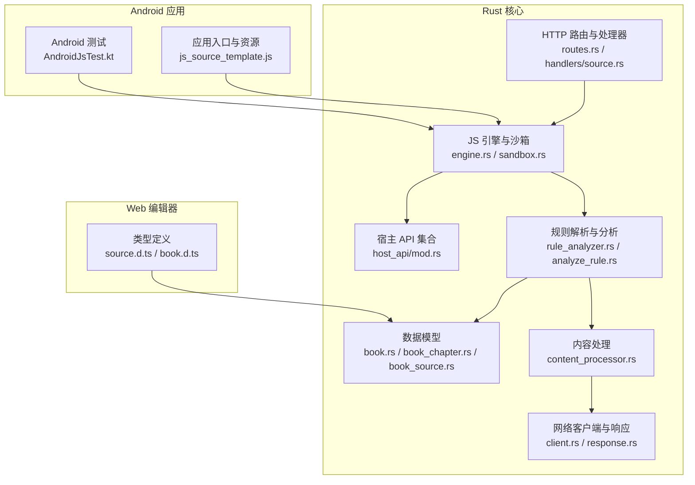
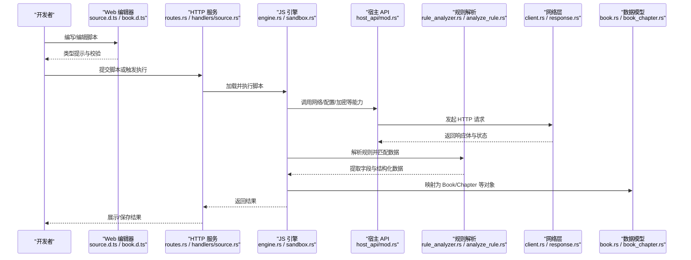
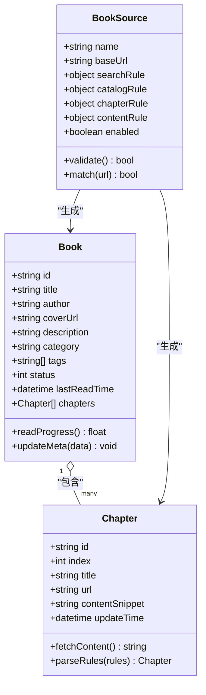
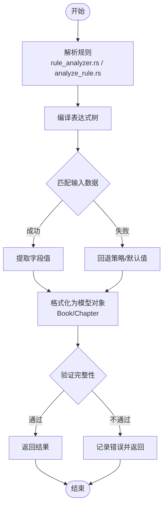
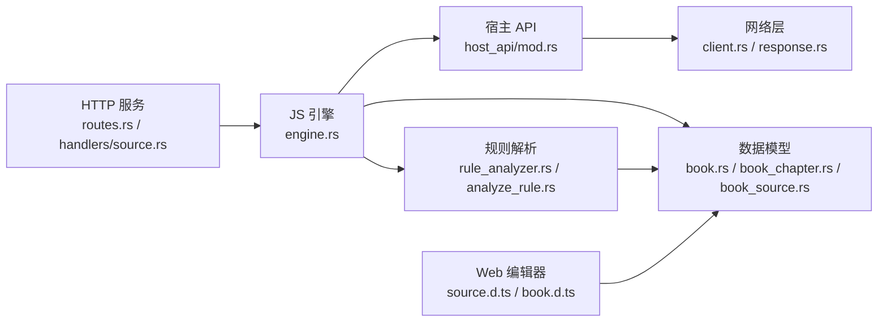

# 脚本开发指南

<cite>
**本文引用的文件**   
- [README.md](file://README.md)
- [app/src/main/assets/js_source_template.js](file://app/src/main/assets/js_source_template.js)
- [modules/web/src/source.d.ts](file://modules/web/src/source.d.ts)
- [modules/web/src/book.d.ts](file://modules/web/src/book.d.ts)
- [rust/legado-js/src/lib.rs](file://rust/legado-js/src/lib.rs)
- [rust/legado-js/src/engine.rs](file://rust/legado-js/src/engine.rs)
- [rust/legado-js/src/sandbox.rs](file://rust/legado-js/src/sandbox.rs)
- [rust/legado-js/src/host_api/mod.rs](file://rust/legado-js/src/host_api/mod.rs)
- [rust/legado-parser/src/rule_analyzer.rs](file://rust/legado-parser/src/rule_analyzer.rs)
- [rust/legado-parser/src/analyze_rule.rs](file://rust/legado-parser/src/analyze_rule.rs)
- [rust/legado-core/src/models/book.rs](file://rust/legado-core/src/models/book.rs)
- [rust/legado-core/src/models/book_chapter.rs](file://rust/legado-core/src/models/book_chapter.rs)
- [rust/legado-core/src/models/book_source.rs](file://rust/legado-core/src/models/book_source.rs)
- [rust/legado-core/src/content_processor.rs](file://rust/legado-core/src/content_processor.rs)
- [rust/legado-net/src/client.rs](file://rust/legado-net/src/client.rs)
- [rust/legado-net/src/response.rs](file://rust/legado-net/src/response.rs)
- [rust/legado-server/src/routes.rs](file://rust/legado-server/src/routes.rs)
- [rust/legado-server/src/handlers/source.rs](file://rust/legado-server/src/handlers/source.rs)
- [app/src/androidTest/java/io.legado.app.AndroidJsTest.kt](file://app/src/androidTest/java/io.legado.app.AndroidJsTest.kt)
- [app/src/test/java/io.legado.app.JsEngineCapabilitiesTest.kt](file://app/src/test/java/io.legado.app.JsEngineCapabilitiesTest.kt)
</cite>

## 目录
1. [简介](#简介)
2. [项目结构](#项目结构)
3. [核心组件](#核心组件)
4. [架构总览](#架构总览)
5. [详细组件分析](#详细组件分析)
6. [依赖关系分析](#依赖关系分析)
7. [性能考量](#性能考量)
8. [故障排除指南](#故障排除指南)
9. [结论](#结论)
10. [附录](#附录)

## 简介
本指南面向在 Legado 项目中开发与集成 JavaScript 脚本的工程师，覆盖脚本编写规范、数据模型定义（Book、Chapter 等）、规则引擎集成（解析规则、匹配逻辑与结果格式化）、调试工具使用（日志、错误追踪、性能分析），以及完整的开发工作流程（编写、测试、发布）。文档同时提供常见开发模式、最佳实践与故障排除方法，帮助读者快速上手并高效迭代。

## 项目结构
Legado 采用多模块架构：Android 应用层、Flutter 前端、Rust 核心库（JS 引擎、网络、解析器、数据库、服务器）以及 Web 编辑器。JavaScript 脚本通过 Rust 侧的 JS 引擎暴露给 Android/Flutter/Web 调用，并通过宿主 API 访问网络、配置、加密、文件系统等能力。

图表来源
- [app/src/androidTest/java/io.legado.app.AndroidJsTest.kt](file://app/src/androidTest/java/io.legado.app.AndroidJsTest.kt)
- [app/src/main/assets/js_source_template.js](file://app/src/main/assets/js_source_template.js)
- [modules/web/src/source.d.ts](file://modules/web/src/source.d.ts)
- [modules/web/src/book.d.ts](file://modules/web/src/book.d.ts)
- [rust/legado-js/src/engine.rs](file://rust/legado-js/src/engine.rs)
- [rust/legado-js/src/sandbox.rs](file://rust/legado-js/src/sandbox.rs)
- [rust/legado-js/src/host_api/mod.rs](file://rust/legado-js/src/host_api/mod.rs)
- [rust/legado-parser/src/rule_analyzer.rs](file://rust/legado-parser/src/rule_analyzer.rs)
- [rust/legado-parser/src/analyze_rule.rs](file://rust/legado-parser/src/analyze_rule.rs)
- [rust/legado-core/src/models/book.rs](file://rust/legado-core/src/models/book.rs)
- [rust/legado-core/src/models/book_chapter.rs](file://rust/legado-core/src/models/book_chapter.rs)
- [rust/legado-core/src/models/book_source.rs](file://rust/legado-core/src/models/book_source.rs)
- [rust/legado-core/src/content_processor.rs](file://rust/legado-core/src/content_processor.rs)
- [rust/legado-net/src/client.rs](file://rust/legado-net/src/client.rs)
- [rust/legado-net/src/response.rs](file://rust/legado-net/src/response.rs)
- [rust/legado-server/src/routes.rs](file://rust/legado-server/src/routes.rs)
- [rust/legado-server/src/handlers/source.rs](file://rust/legado-server/src/handlers/source.rs)

章节来源
- [README.md](file://README.md)

## 核心组件
- JS 引擎与沙箱：负责加载、执行用户脚本，隔离运行环境，限制危险操作，并提供宿主 API 桥接。
- 宿主 API：为脚本提供网络请求、配置读写、加密解密、编码转换、JSON 处理、HTML 格式化、并发控制等能力。
- 规则引擎：解析与编译规则表达式，支持 XPath、正则、JSONPath 等，用于从网页或 JSON 中抽取字段。
- 数据模型：Book、Chapter、BookSource 等实体定义，贯穿解析、存储与展示流程。
- 内容处理：对抓取到的原始内容进行清洗、格式化、分页、去重等处理。
- 网络层：统一 HTTP 客户端、重试、代理、SSL 配置、速率限制与 Cookie 管理。
- Web 编辑器与类型定义：提供在线编辑、校验与提示，确保脚本与后端模型一致。

章节来源
- [rust/legado-js/src/lib.rs](file://rust/legado-js/src/lib.rs)
- [rust/legado-js/src/engine.rs](file://rust/legado-js/src/engine.rs)
- [rust/legado-js/src/sandbox.rs](file://rust/legado-js/src/sandbox.rs)
- [rust/legado-js/src/host_api/mod.rs](file://rust/legado-js/src/host_api/mod.rs)
- [rust/legado-parser/src/rule_analyzer.rs](file://rust/legado-parser/src/rule_analyzer.rs)
- [rust/legado-parser/src/analyze_rule.rs](file://rust/legado-parser/src/analyze_rule.rs)
- [rust/legado-core/src/models/book.rs](file://rust/legado-core/src/models/book.rs)
- [rust/legado-core/src/models/book_chapter.rs](file://rust/legado-core/src/models/book_chapter.rs)
- [rust/legado-core/src/models/book_source.rs](file://rust/legado-core/src/models/book_source.rs)
- [rust/legado-core/src/content_processor.rs](file://rust/legado-core/src/content_processor.rs)
- [rust/legado-net/src/client.rs](file://rust/legado-net/src/client.rs)
- [rust/legado-net/src/response.rs](file://rust/legado-net/src/response.rs)
- [modules/web/src/source.d.ts](file://modules/web/src/source.d.ts)
- [modules/web/src/book.d.ts](file://modules/web/src/book.d.ts)

## 架构总览
下图展示了从 Web 编辑器到 Rust 引擎、规则解析、网络抓取、内容处理再到返回结果的完整链路。

图表来源
- [modules/web/src/source.d.ts](file://modules/web/src/source.d.ts)
- [modules/web/src/book.d.ts](file://modules/web/src/book.d.ts)
- [rust/legado-server/src/routes.rs](file://rust/legado-server/src/routes.rs)
- [rust/legado-server/src/handlers/source.rs](file://rust/legado-server/src/handlers/source.rs)
- [rust/legado-js/src/engine.rs](file://rust/legado-js/src/engine.rs)
- [rust/legado-js/src/sandbox.rs](file://rust/legado-js/src/sandbox.rs)
- [rust/legado-js/src/host_api/mod.rs](file://rust/legado-js/src/host_api/mod.rs)
- [rust/legado-parser/src/rule_analyzer.rs](file://rust/legado-parser/src/rule_analyzer.rs)
- [rust/legado-parser/src/analyze_rule.rs](file://rust/legado-parser/src/analyze_rule.rs)
- [rust/legado-net/src/client.rs](file://rust/legado-net/src/client.rs)
- [rust/legado-net/src/response.rs](file://rust/legado-net/src/response.rs)
- [rust/legado-core/src/models/book.rs](file://rust/legado-core/src/models/book.rs)
- [rust/legado-core/src/models/book_chapter.rs](file://rust/legado-core/src/models/book_chapter.rs)

## 详细组件分析

### 数据模型：Book、Chapter、BookSource
- Book：书籍元数据（标题、作者、封面、分类、标签、描述、状态等），包含章节列表与阅读进度信息。
- Chapter：章节条目（序号、标题、URL、正文片段、更新时间等），支持分页与缓存。
- BookSource：源定义（名称、URL、规则集、鉴权信息、更新策略等），用于动态加载与匹配。

图表来源
- [rust/legado-core/src/models/book.rs](file://rust/legado-core/src/models/book.rs)
- [rust/legado-core/src/models/book_chapter.rs](file://rust/legado-core/src/models/book_chapter.rs)
- [rust/legado-core/src/models/book_source.rs](file://rust/legado-core/src/models/book_source.rs)

章节来源
- [rust/legado-core/src/models/book.rs](file://rust/legado-core/src/models/book.rs)
- [rust/legado-core/src/models/book_chapter.rs](file://rust/legado-core/src/models/book_chapter.rs)
- [rust/legado-core/src/models/book_source.rs](file://rust/legado-core/src/models/book_source.rs)

### 规则引擎：解析规则、匹配逻辑与结果格式化
- 规则解析：将用户编写的规则（XPath、正则、JSONPath）编译为可执行表达式树，支持变量替换与上下文注入。
- 匹配逻辑：基于解析后的表达式对 HTML/JSON 进行节点选择与文本提取，支持多级嵌套与条件过滤。
- 结果格式化：将提取结果转换为标准数据结构（如 Book/Chapter），并进行清洗、去重、分页合并。

图表来源
- [rust/legado-parser/src/rule_analyzer.rs](file://rust/legado-parser/src/rule_analyzer.rs)
- [rust/legado-parser/src/analyze_rule.rs](file://rust/legado-parser/src/analyze_rule.rs)
- [rust/legado-core/src/models/book.rs](file://rust/legado-core/src/models/book.rs)
- [rust/legado-core/src/models/book_chapter.rs](file://rust/legado-core/src/models/book_chapter.rs)

章节来源
- [rust/legado-parser/src/rule_analyzer.rs](file://rust/legado-parser/src/rule_analyzer.rs)
- [rust/legado-parser/src/analyze_rule.rs](file://rust/legado-parser/src/analyze_rule.rs)

### 脚本模板与模块化组织
- 脚本模板：提供基础结构与常用函数封装，便于快速搭建源脚本。
- 模块化组织：按功能拆分模块（网络、解析、格式化、鉴权），通过统一的导出接口供主脚本调用。
- 命名约定：函数与方法采用驼峰命名，常量全大写，私有成员以下划线前缀标识。

章节来源
- [app/src/main/assets/js_source_template.js](file://app/src/main/assets/js_source_template.js)
- [modules/web/src/source.d.ts](file://modules/web/src/source.d.ts)
- [modules/web/src/book.d.ts](file://modules/web/src/book.d.ts)

### 调试工具：日志输出、错误追踪与性能分析
- 日志输出：在关键路径打印结构化日志，包含时间戳、级别、模块名与上下文。
- 错误追踪：捕获异常堆栈，关联请求 ID，便于定位问题。
- 性能分析：统计耗时、内存占用与网络延迟，识别瓶颈。

章节来源
- [rust/legado-js/src/engine.rs](file://rust/legado-js/src/engine.rs)
- [rust/legado-js/src/sandbox.rs](file://rust/legado-js/src/sandbox.rs)
- [rust/legado-net/src/client.rs](file://rust/legado-net/src/client.rs)
- [rust/legado-net/src/response.rs](file://rust/legado-net/src/response.rs)

### 网络层与响应处理
- 客户端：统一配置超时、重试、代理、SSL、UA、Cookie 存储。
- 响应处理：解析状态码、头部、体，支持压缩、编码检测与错误映射。

章节来源
- [rust/legado-net/src/client.rs](file://rust/legado-net/src/client.rs)
- [rust/legado-net/src/response.rs](file://rust/legado-net/src/response.rs)

### Web 编辑器与类型系统
- 类型定义：为脚本提供强类型约束与自动补全，减少运行时错误。
- 编辑器集成：在线编辑、实时校验、预览与调试面板。

章节来源
- [modules/web/src/source.d.ts](file://modules/web/src/source.d.ts)
- [modules/web/src/book.d.ts](file://modules/web/src/book.d.ts)

## 依赖关系分析
JS 引擎依赖宿主 API、规则解析器、网络层与数据模型；Web 编辑器依赖类型定义以确保前后端一致性；服务器路由将外部请求调度至引擎执行。

图表来源
- [rust/legado-js/src/engine.rs](file://rust/legado-js/src/engine.rs)
- [rust/legado-js/src/host_api/mod.rs](file://rust/legado-js/src/host_api/mod.rs)
- [rust/legado-parser/src/rule_analyzer.rs](file://rust/legado-parser/src/rule_analyzer.rs)
- [rust/legado-parser/src/analyze_rule.rs](file://rust/legado-parser/src/analyze_rule.rs)
- [rust/legado-core/src/models/book.rs](file://rust/legado-core/src/models/book.rs)
- [rust/legado-core/src/models/book_chapter.rs](file://rust/legado-core/src/models/book_chapter.rs)
- [rust/legado-core/src/models/book_source.rs](file://rust/legado-core/src/models/book_source.rs)
- [rust/legado-net/src/client.rs](file://rust/legado-net/src/client.rs)
- [rust/legado-net/src/response.rs](file://rust/legado-net/src/response.rs)
- [rust/legado-server/src/routes.rs](file://rust/legado-server/src/routes.rs)
- [rust/legado-server/src/handlers/source.rs](file://rust/legado-server/src/handlers/source.rs)
- [modules/web/src/source.d.ts](file://modules/web/src/source.d.ts)
- [modules/web/src/book.d.ts](file://modules/web/src/book.d.ts)

章节来源
- [rust/legado-js/src/lib.rs](file://rust/legado-js/src/lib.rs)
- [rust/legado-server/src/routes.rs](file://rust/legado-server/src/routes.rs)

## 性能考量
- 规则编译缓存：避免重复解析相同规则，提升匹配速度。
- 网络批处理：合并请求、复用连接、启用压缩与缓存。
- 内存管理：及时释放大对象，避免泄漏；使用流式处理长文本。
- 异步执行：非阻塞 I/O，合理设置线程池大小与超时。
- 监控指标：收集 QPS、延迟分布、错误率与资源使用率。

[本节为通用指导，不直接分析具体文件]

## 故障排除指南
- 常见问题：
  - 规则匹配失败：检查 XPath/正则语法与目标页面结构变化。
  - 网络请求超时：确认代理、SSL 配置与服务器可达性。
  - 数据模型不一致：核对类型定义与脚本返回值结构。
  - 内存溢出：优化大对象处理与循环引用。
- 排查步骤：
  - 启用详细日志与错误堆栈。
  - 使用 Web 编辑器进行断点与单步调试。
  - 通过单元测试与集成测试复现问题。
  - 分析网络抓包与响应体。

章节来源
- [app/src/androidTest/java/io.legado.app.AndroidJsTest.kt](file://app/src/androidTest/java/io.legado.app.AndroidJsTest.kt)
- [app/src/test/java/io.legado.app.JsEngineCapabilitiesTest.kt](file://app/src/test/java/io.legado.app.JsEngineCapabilitiesTest.kt)

## 结论
通过清晰的模块化设计、严格的类型系统与强大的规则引擎，Legado 为 JavaScript 脚本开发提供了稳定高效的平台。遵循本文的规范与实践，可显著提升脚本质量与可维护性，加速迭代与交付。

## 附录
- 开发工作流建议：
  - 编写：基于模板创建脚本，使用 Web 编辑器进行类型校验与预览。
  - 测试：编写单元与集成测试，覆盖规则匹配、网络交互与边界情况。
  - 调试：开启日志与性能分析，定位问题并优化。
  - 发布：版本化脚本，提供变更说明与兼容性矩阵。
- 最佳实践：
  - 单一职责：每个模块只负责一个功能域。
  - 防御性编程：输入校验、异常捕获与降级策略。
  - 可观测性：结构化日志、指标采集与告警。
  - 安全优先：最小权限原则与敏感信息保护。

[本节为通用指导，不直接分析具体文件]