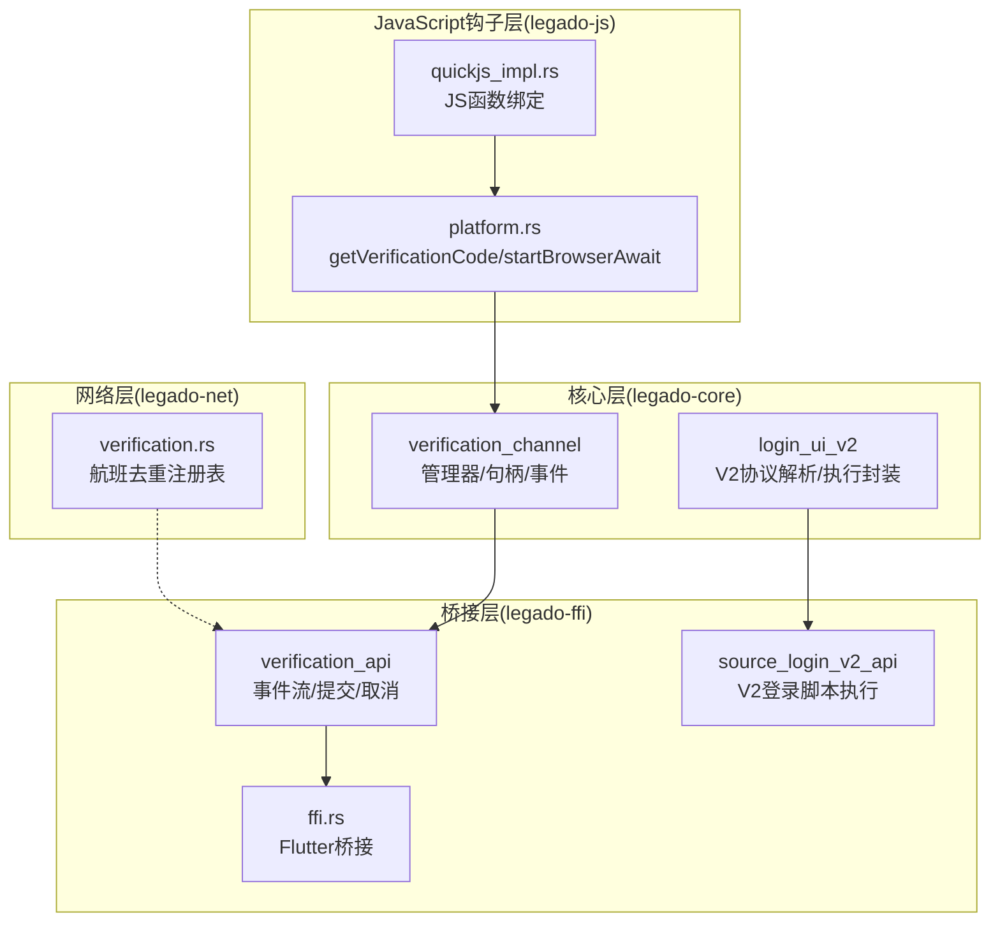
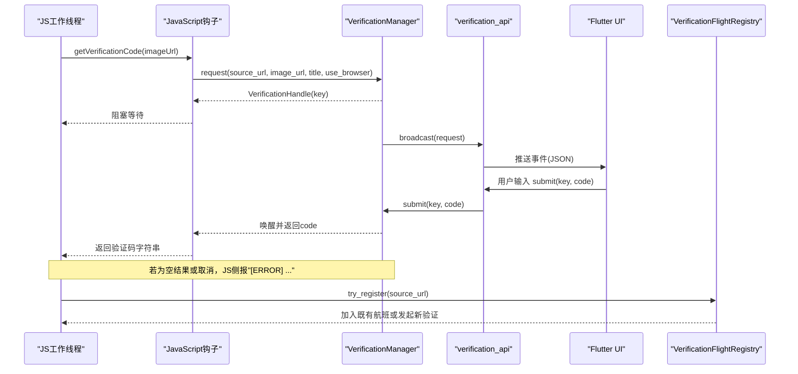
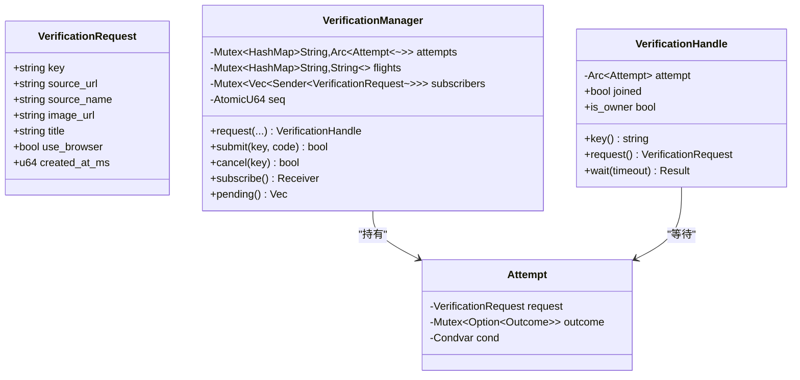
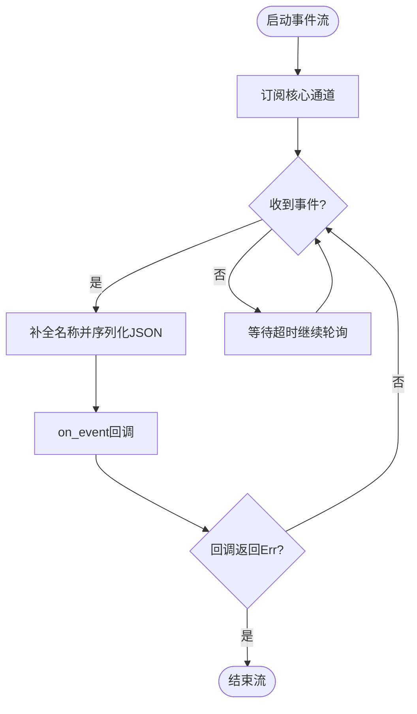
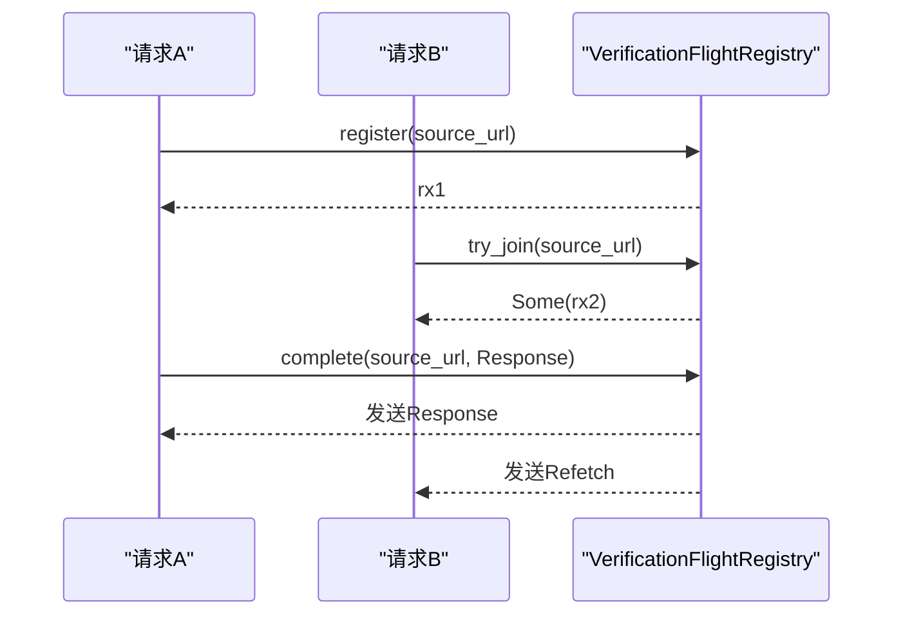
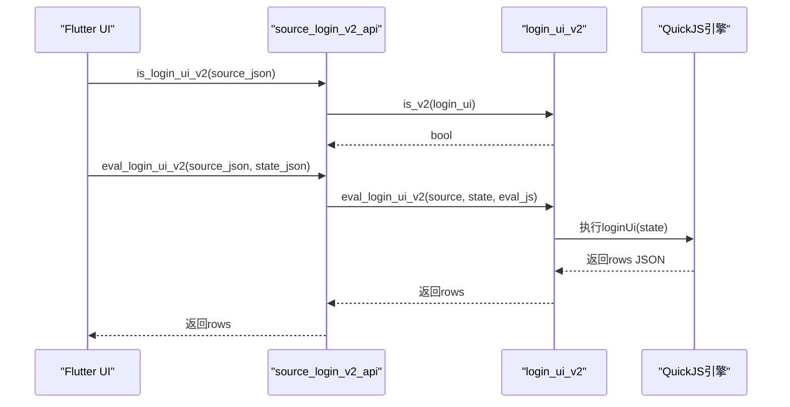
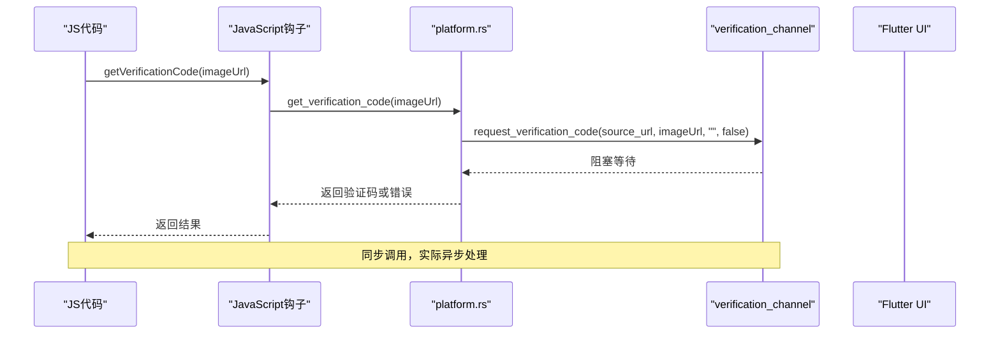
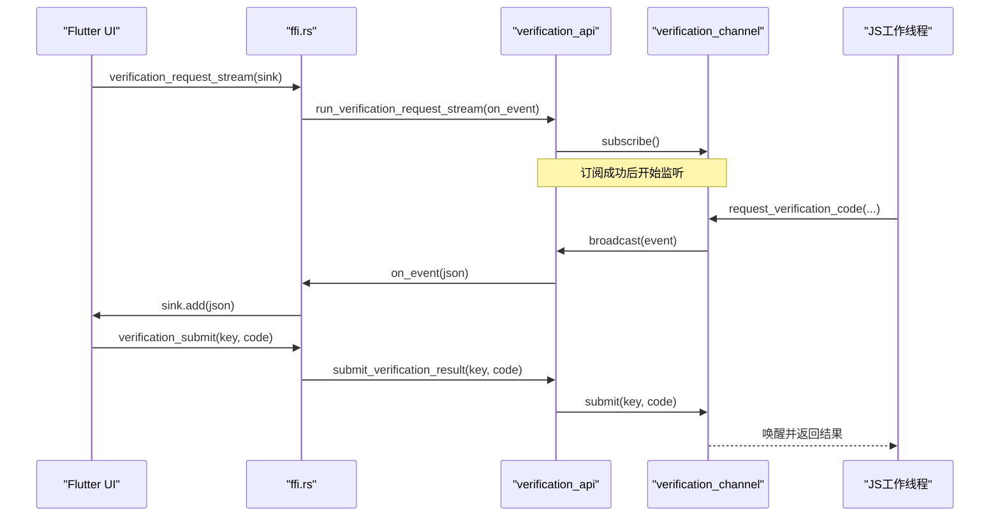
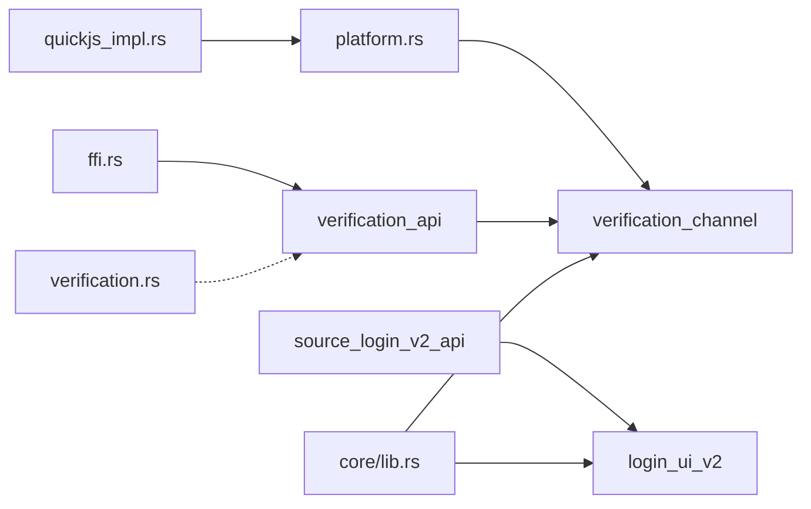

# 验证码交互通道系统

<cite>
**本文引用的文件**
- [verification_channel.rs](file://rust/legado-core/src/verification_channel.rs)
- [verification_api.rs](file://rust/legado-ffi/src/api/verification_api.rs)
- [verification.rs](file://rust/legado-net/src/verification.rs)
- [login_ui_v2.rs](file://rust/legado-core/src/login_ui_v2.rs)
- [source_login_v2_api.rs](file://rust/legado-ffi/src/api/source_login_v2_api.rs)
- [lib.rs](file://rust/legado-core/src/lib.rs)
- [platform.rs](file://rust/legado-js\src\host_api\platform.rs)
- [quickjs_impl.rs](file://rust/legado-js\src\host_api\quickjs_impl.rs)
- [ffi.rs](file://rust/legado-ffi\src\ffi.rs)
</cite>

## 更新摘要
**变更内容**   
- 新增JavaScript钩子集成章节，详细说明getVerificationCode和startBrowserAwait的实现
- 更新FFI事件流架构，展示完整的异步验证流程
- 添加浏览器验证降级机制说明
- 完善同步与异步验证流程的对比分析
- 增强故障排查指南，包含JavaScript钩子相关的问题诊断

## 目录
1. [简介](#简介)
2. [项目结构](#项目结构)
3. [核心组件](#核心组件)
4. [架构总览](#架构总览)
5. [详细组件分析](#详细组件分析)
6. [JavaScript钩子系统](#javascript钩子系统)
7. [FFI事件流集成](#ffi事件流集成)
8. [依赖关系分析](#依赖关系分析)
9. [性能与并发特性](#性能与并发特性)
10. [故障排查指南](#故障排查指南)
11. [结论](#结论)
12. [附录：数据模型与字段契约](#附录数据模型与字段契约)

## 简介
本文件系统化梳理 Legado 中的"验证码交互通道系统"，覆盖 Rust 核心实现、FFI 桥接层、网络侧并发去重注册表，以及与登录 UI V2 动态协议的协作。该系统通过完整的 JavaScript 钩子（getVerificationCode 和 startBrowserAwait）与 FFI 事件流的深度集成，实现了无缝的 CAPTCHA 和浏览器认证流程，支持同步和异步验证过程的事件驱动架构。

## 项目结构
验证码交互通道由四层组成：
- JavaScript 钩子层（legado-js）：提供 getVerificationCode 和 startBrowserAwait 接口，处理 JS 工作线程的阻塞等待
- 核心通道（legado-core）：定义事件载荷、管理器、句柄与等待语义，提供全局单例与便捷入口
- FFI 桥接（legado-ffi）：将核心通道暴露给 Flutter/Dart 侧，提供事件流订阅、结果提交与取消接口
- 网络并发去重（legado-net）：对浏览器/WebView 验证流程进行航班式去重，避免重复弹窗

**图表来源**
- [platform.rs:129-174](file://rust/legado-js/src/host_api/platform.rs#L129-L174)
- [quickjs_impl.rs:1384-1414](file://rust/legado-js/src/host_api/quickjs_impl.rs#L1384-L1414)
- [verification_channel.rs:1-120](file://rust/legado-core/src/verification_channel.rs#L1-L120)
- [verification_api.rs:1-100](file://rust/legado-ffi/src/api/verification_api.rs#L1-L100)
- [ffi.rs:245-283](file://rust/legado-ffi/src/ffi.rs#L245-L283)

## 核心组件
- 验证码请求事件 VerificationRequest：包含 key、source_url、source_name、image_url、title、use_browser、created_at_ms 等字段，用于 UI 渲染对话框
- 验证管理器 VerificationManager：维护请求表、航班索引、事件订阅者列表；支持请求创建、广播、结果提交、取消、进行中列表回放
- 验证句柄 VerificationHandle：供 JS 工作线程阻塞等待结果，内部使用 condvar 与超时控制，空结果视为错误
- FFI 事件流 run_verification_request_stream：长期存活的事件推送，先回放进行中请求，再实时推送新事件
- 网络验证航班注册表 VerificationFlightRegistry：按 source_url 去重，首个完成者返回完整结果，其余返回 Refetch
- JavaScript 钩子接口：getVerificationCode 和 startBrowserAwait，提供同步阻塞调用体验

**章节来源**
- [verification_channel.rs:1-354](file://rust/legado-core/src/verification_channel.rs#L1-L354)
- [verification_api.rs:1-106](file://rust/legado-ffi/src/api/verification_api.rs#L1-L106)
- [verification.rs:1-97](file://rust/legado-net/src/verification.rs#L1-L97)
- [platform.rs:129-174](file://rust/legado-js/src/host_api/platform.rs#L129-L174)

## 架构总览
验证码交互通道采用"JS 挂起 ↔ UI 弹窗 ↔ 结果回传"的异步协作模式，并通过"航班去重"避免同书源并发重复弹窗。JavaScript 钩子提供同步调用接口，底层通过事件流实现真正的异步处理。

**图表来源**
- [platform.rs:140-152](file://rust/legado-js/src/host_api/platform.rs#L140-L152)
- [verification_channel.rs:126-212](file://rust/legado-core/src/verification_channel.rs#L126-L212)
- [verification_api.rs:42-106](file://rust/legado-ffi/src/api/verification_api.rs#L42-L106)
- [verification.rs:30-79](file://rust/legado-net/src/verification.rs#L30-L79)

## 详细组件分析

### 验证码通道核心（verification_channel.rs）
- 数据结构
  - VerificationRequest：事件载荷，snake_case 字段，便于 JSON 序列化
  - Attempt：单次尝试，包含请求、结局槽位与条件变量
  - VerificationManager：全局单例，管理 attempts/flights/subscribers/seq
  - VerificationHandle：等待方句柄，提供 wait(timeout) 阻塞等待
- 关键流程
  - request：生成唯一 key，创建 Attempt，写入 attempts 与 flights（同 source_url 去重），广播事件
  - submit/cancel：幂等设置结局，通知所有等待方；owner 超时以空结果收尾
  - subscribe/pending：回放进行中请求，确保晚订阅不丢失
- 线程模型
  - 等待侧使用 std::sync::Condvar，不依赖 tokio runtime，可在任意线程安全阻塞
  - 提交侧无阻塞，仅 notify_all

**图表来源**
- [verification_channel.rs:45-94](file://rust/legado-core/src/verification_channel.rs#L45-L94)
- [verification_channel.rs:284-353](file://rust/legado-core/src/verification_channel.rs#L284-L353)

**章节来源**
- [verification_channel.rs:1-354](file://rust/legado-core/src/verification_channel.rs#L1-L354)

### FFI 事件流与回调（verification_api.rs）
- 事件序列化 serialize_event：补全书源名称后序列化为 JSON
- 事件流 run_verification_request_stream：长期轮询 mpsc，阻塞接收放入 blocking 池，避免占用工作者线程
- 提交/取消接口：直接委托 core 层，保持语义一致
- pending_requests_json：调试用，返回进行中请求 JSON 数组

**图表来源**
- [verification_api.rs:31-84](file://rust/legado-ffi/src/api/verification_api.rs#L31-L84)

**章节来源**
- [verification_api.rs:1-106](file://rust/legado-ffi/src/api/verification_api.rs#L1-L106)

### 网络并发去重注册表（verification.rs）
- 目标：对相同 source_url 的验证请求进行去重，避免重复 WebView 弹窗
- 行为：
  - register：注册新航班，返回 oneshot receiver
  - try_join：若已有航班则加入，否则返回 None
  - complete：第一个完成者得到 Response，其余得到 Refetch

**图表来源**
- [verification.rs:30-79](file://rust/legado-net/src/verification.rs#L30-L79)

**章节来源**
- [verification.rs:1-97](file://rust/legado-net/src/verification.rs#L1-L97)

### 登录 UI V2 动态协议（login_ui_v2.rs 与 source_login_v2_api.rs）
- login_ui_v2.rs：判定 V2 标记、解析渲染 rows、解析动作命令、提取内联 JS、构建执行脚本、规范化返回值
- source_login_v2_api.rs：接入 QuickJS 引擎池，注入 baseUrl/source 绑定，执行 loginUi/loginAction 并返回命令 JSON

**图表来源**
- [login_ui_v2.rs:273-318](file://rust/legado-core/src/login_ui_v2.rs#L273-L318)
- [source_login_v2_api.rs:32-39](file://rust/legado-ffi/src/api/source_login_v2_api.rs#L32-L39)

**章节来源**
- [login_ui_v2.rs:1-348](file://rust/legado-core/src/login_ui_v2.rs#L1-L348)
- [source_login_v2_api.rs:1-152](file://rust/legado-ffi/src/api/source_login_v2_api.rs#L1-L152)

## JavaScript钩子系统

### getVerificationCode 实现
`getVerificationCode(imageUrl)` 是主要的验证码交互钩子，提供同步阻塞调用体验：

- **功能**：图片验证码交互，阻塞等待用户输入
- **参数**：imageUrl - 验证码图片地址
- **返回值**：验证码字符串或 "[ERROR] ..." 错误信息
- **实现原理**：
  1. 从当前线程上下文获取书源 URL
  2. 调用 verification_channel::request_verification_code 发起请求
  3. 阻塞等待 UI 侧提交结果
  4. 成功时返回验证码，失败时返回错误格式字符串

### startBrowserAwait 降级实现
`startBrowserAwait(url, title)` 是浏览器验证的降级实现：

- **功能**：浏览器验证降级为图片验证码流程
- **参数**：url - 验证资源地址，title - 对话框标题
- **返回值**：验证码字符串或 "[ERROR] ..." 错误信息
- **降级策略**：桌面端无内置浏览器，将 url 作为验证资源地址经验证码通道处理

**图表来源**
- [platform.rs:140-152](file://rust/legado-js/src/host_api/platform.rs#L140-L152)
- [platform.rs:162-174](file://rust/legado-js/src/host_api/platform.rs#L162-L174)

**章节来源**
- [platform.rs:129-174](file://rust/legado-js/src/host_api/platform.rs#L129-L174)
- [quickjs_impl.rs:1384-1414](file://rust/legado-js/src/host_api/quickjs_impl.rs#L1384-L1414)

## FFI事件流集成

### 事件流架构
FFI 层提供了完整的事件流集成，支持 Flutter 侧订阅和处理验证码请求：

- **verification_request_stream**：长期存活的 Flutter 桥接接口
- **verification_submit**：提交验证码结果
- **verification_cancel**：取消验证码请求
- **verification_pending**：查询进行中的请求列表

### 事件流生命周期
1. **订阅阶段**：Flutter 调用 verification_request_stream 开始订阅
2. **事件推送**：当 JS 钩子被调用时，事件通过 StreamSink 推送到 Flutter
3. **用户交互**：Flutter UI 显示验证码对话框，用户输入结果
4. **结果回传**：通过 verification_submit 提交结果，唤醒 JS 等待方
5. **流结束**：当 sink 关闭时，事件流自然结束

**图表来源**
- [ffi.rs:255-263](file://rust/legado-ffi/src/ffi.rs#L255-L263)
- [verification_api.rs:52-84](file://rust/legado-ffi/src/api/verification_api.rs#L52-L84)

**章节来源**
- [ffi.rs:245-283](file://rust/legado-ffi/src/ffi.rs#L245-L283)
- [verification_api.rs:42-106](file://rust/legado-ffi/src/api/verification_api.rs#L42-L106)

## 依赖关系分析
- 模块导出：core 层通过 lib.rs 统一导出 verification_channel 与 login_ui_v2
- FFI 依赖：verification_api 依赖 core 的 verification_channel；source_login_v2_api 依赖 core 的 login_ui_v2 与 js_executor
- JavaScript 钩子依赖：platform.rs 依赖 current_source 获取书源上下文，依赖 verification_channel 进行验证码交互
- 网络层独立：verification.rs 提供并发去重能力，可被上层按需集成

**图表来源**
- [lib.rs:43-60](file://rust/legado-core/src/lib.rs#L43-L60)
- [verification_api.rs:1-20](file://rust/legado-ffi/src/api/verification_api.rs#L1-L20)
- [source_login_v2_api.rs:1-20](file://rust/legado-ffi/src/api/source_login_v2_api.rs#L1-L20)
- [platform.rs:22-24](file://rust/legado-js/src/host_api/platform.rs#L22-L24)

**章节来源**
- [lib.rs:1-68](file://rust/legado-core/src/lib.rs#L1-L68)

## 性能与并发特性
- 等待侧使用 std::sync::Condvar，零额外运行时开销，适合在 spawn_blocking 或任意线程调用
- 事件流使用 std::sync::mpsc 与 tokio::task::spawn_blocking 轮询，避免阻塞工作者线程
- 航班去重减少重复弹窗与网络开销，提升用户体验
- 超时清理由 owner 负责，避免悬挂状态与资源泄漏
- JavaScript 钩子提供同步调用体验，但底层完全异步处理，不会阻塞主线程

## 故障排查指南
- 常见问题
  - 未收到事件：检查订阅是否早于请求；verify subscribe 会回放进行中请求
  - 提交无效：确认 key 正确且请求仍在进行中；重复提交返回 false
  - 空结果报错：UI 关闭对话框或未输入即提交，等待侧报"验证结果为空"
  - 超时：默认 5 分钟，可通过 handle.wait(timeout) 调整；owner 超时自动清理
  - JavaScript 钩子无响应：检查 JS 工作线程是否正确阻塞，确认 Flutter 侧事件流正常
  - 浏览器降级异常：确认 startBrowserAwait 的参数传递正确，URL 格式有效
- 定位手段
  - pending_requests_json：查看当前进行中请求列表
  - 日志：关注 FFI 事件序列化与回调返回 Err 的情况
  - JavaScript 测试：使用 quickjs_impl.rs 中的测试用例验证钩子功能
  - 事件流监控：检查 Flutter 侧 StreamSink 是否正常接收事件

**章节来源**
- [verification_channel.rs:214-276](file://rust/legado-core/src/verification_channel.rs#L214-L276)
- [verification_api.rs:101-106](file://rust/legado-ffi/src/api/verification_api.rs#L101-L106)
- [platform.rs:265-321](file://rust/legado-js/src/host_api/platform.rs#L265-L321)

## 结论
验证码交互通道通过清晰的职责分层与严格的语义对齐（Kotlin SourceVerificationHelp），实现了跨线程、跨语言的安全交互。新增的 JavaScript 钩子系统提供了直观的同步调用接口，而底层的 FFI 事件流确保了真正的异步处理能力。核心层提供可靠的状态机与等待语义，FFI 层打通事件流与回调，网络层保障并发去重。整体设计兼顾性能、可测试性与可维护性，适用于多端一致的验证码交互场景。

## 附录：数据模型与字段契约
- VerificationRequest 字段（snake_case）
  - key：请求唯一标识（resultKey）
  - source_url：书源 URL
  - source_name：书源名称（可为空，FFI 层补全）
  - image_url：验证码图片地址
  - title：对话框标题
  - use_browser：是否需要浏览器（桌面端恒 false）
  - created_at_ms：创建时间戳（毫秒）

**章节来源**
- [verification_channel.rs:35-61](file://rust/legado-core/src/verification_channel.rs#L35-L61)
- [verification_api.rs:10-14](file://rust/legado-ffi/src/api/verification_api.rs#L10-L14)