# Rust核心库

<cite>
**本文引用的文件**   
- [Cargo.toml](file://rust/Cargo.toml)
- [legado-core/lib.rs](file://rust/legado-core/src/lib.rs)
- [legado-core/models/mod.rs](file://rust/legado-core/src/models/mod.rs)
- [legado-core/models/book.rs](file://rust/legado-core/src/models/book.rs)
- [legado-core/models/book_chapter.rs](file://rust/legado-core/src/models/book_chapter.rs)
- [legado-core/models/book_source.rs](file://rust/legado-core/src/models/book_source.rs)
- [legado-core/search_engine.rs](file://rust/legado-core/src/search_engine.rs)
- [legado-core/content_processor.rs](file://rust/legado-core/src/content_processor.rs)
- [legado-core/cache_book.rs](file://rust/legado-core/src/cache_book.rs)
- [legado-db/lib.rs](file://rust/legado-db/src/lib.rs)
- [legado-db/connection.rs](file://rust/legado-db/src/connection.rs)
- [legado-db/schema.rs](file://rust/legado-db/src/schema.rs)
- [legado-db/migration.rs](file://rust/legado-db/src/migration.rs)
- [legado-db/repository/book_repository.rs](file://rust/legado-db/src/repository/book_repository.rs)
- [legado-db/repository/book_chapter_repository.rs](file://rust/legado-db/src/repository/book_chapter_repository.rs)
- [legado-db/repository/book_source_repository.rs](file://rust/legado-db/src/repository/book_source_repository.rs)
- [legado-net/lib.rs](file://rust/legado-net/src/lib.rs)
- [legado-net/client.rs](file://rust/legado-net/src/client.rs)
- [legado-net/request.rs](file://rust/legado-net/src/request.rs)
- [legado-net/response.rs](file://rust/legado-net/src/response.rs)
- [legado-net/middleware.rs](file://rust/legado-net/src/middleware.rs)
- [legado-parser/lib.rs](file://rust/legado-parser/src/lib.rs)
- [legado-parser/html.rs](file://rust/legado-parser/src/html.rs)
- [legado-parser/xpath.rs](file://rust/legado-parser/src/xpath.rs)
- [legado-parser/jsonpath.rs](file://rust/legado-parser/src/jsonpath.rs)
- [legado-js/lib.rs](file://rust/legado-js/src/lib.rs)
- [legado-js/engine.rs](file://rust/legado-js/src/engine.rs)
- [legado-js/source_engine.rs](file://rust/legado-js/src/source_engine.rs)
- [legado-ffi/lib.rs](file://rust/legado-ffi/src/lib.rs)
- [legado-ffi/bridge.rs](file://rust/legado-ffi/src/bridge.rs)
- [legado-ffi/frb_generated.rs](file://rust/legado-ffi/src/frb_generated.rs)
- [legado-book/lib.rs](file://rust/legado-book/src/lib.rs)
- [legado-book/txt.rs](file://rust/legado-book/src/txt.rs)
- [legado-book/epub.rs](file://rust/legado-book/src/epub.rs)
- [legado-server/lib.rs](file://rust/legado-server/src/lib.rs)
- [flutter_rust_bridge.yaml](file://flutter_legado/flutter_rust_bridge.yaml)
</cite>

## 更新摘要
**所做更改**
- 更新了数据库架构迁移部分，反映schema.rs版本升级到v96
- 新增了Migration95To96迁移的详细说明
- 完善了数据库迁移机制的文档描述

## 目录
1. [简介](#简介)
2. [项目结构](#项目结构)
3. [核心组件](#核心组件)
4. [架构总览](#架构总览)
5. [详细组件分析](#详细组件分析)
6. [依赖关系分析](#依赖关系分析)
7. [性能考量](#性能考量)
8. [故障排查指南](#故障排查指南)
9. [结论](#结论)
10. [附录](#附录)

## 简介
本文件面向Rust核心库的全面文档，覆盖legado-core（核心业务逻辑）、legado-db（数据库操作）、legado-net（网络请求）、legado-parser（网页解析）、legado-js（JavaScript执行环境）等模块的职责、数据模型设计、算法与优化、FFI接口规范以及基于Tokio的异步编程模型。同时提供API使用示例与扩展开发指南，帮助开发者快速理解并扩展新的书籍格式支持与网络源规则。

## 项目结构
Rust核心库采用多crate模块化组织，顶层Cargo配置管理依赖与工作区，各子crate按职责划分：
- legado-core：领域模型、搜索引擎、内容处理、缓存策略、阅读状态等核心业务逻辑
- legado-db：SQLite持久化、迁移、仓库层封装
- legado-net：HTTP客户端、中间件、重试、代理、Cookie存储、速率限制等
- legado-parser：HTML/XPath/JSONPath解析、规则分析器、URL分析
- legado-js：Rhino/JS引擎封装、沙箱、Source脚本执行环境
- legado-ffi：Flutter/Rust桥接（FRB生成代码）、统一对外API入口
- legado-book：电子书格式支持（TXT/EPUB/MOBI/PDF等）
- legado-server：Web服务与WebSocket通信

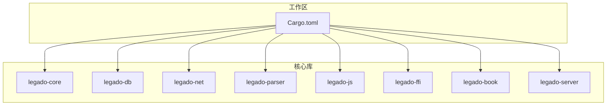

**图表来源** 
- [Cargo.toml](file://rust/Cargo.toml)

**章节来源**
- [Cargo.toml](file://rust/Cargo.toml)

## 核心组件
- legado-core
  - 领域模型：Book、Chapter、BookSource等实体定义与关系
  - 搜索引擎：构建索引、关键词匹配、结果排序
  - 内容处理：文本清洗、格式化、渲染预处理
  - 缓存策略：书籍缓存、章节缓存、音频缓存
- legado-db
  - 连接管理、Schema定义、迁移策略
  - 仓库层：BookRepository、ChapterRepository、BookSourceRepository等
- legado-net
  - 异步HTTP客户端、请求构造、响应处理
  - 中间件链：UA、Cookie、重试、限速、代理
- legado-parser
  - HTML解析、XPath/JSONPath查询、规则分析与补全
- legado-js
  - JS引擎初始化、上下文隔离、Source脚本执行
- legado-ffi
  - FRB桥接、错误映射、运行时管理
- legado-book
  - 多格式解析与导出（TXT/EPUB/MOBI/PDF）
- legado-server
  - HTTP路由、WS事件、调试与工具接口

**章节来源**
- [legado-core/lib.rs](file://rust/legado-core/src/lib.rs)
- [legado-db/lib.rs](file://rust/legado-db/src/lib.rs)
- [legado-net/lib.rs](file://rust/legado-net/src/lib.rs)
- [legado-parser/lib.rs](file://rust/legado-parser/src/lib.rs)
- [legado-js/lib.rs](file://rust/legado-js/src/lib.rs)
- [legado-ffi/lib.rs](file://rust/legado-ffi/src/lib.rs)
- [legado-book/lib.rs](file://rust/legado-book/src/lib.rs)
- [legado-server/lib.rs](file://rust/legado-server/src/lib.rs)

## 架构总览
整体架构遵循分层与职责分离原则：
- 表现层（Flutter/Android）通过FRB调用legado-ffi暴露的API
- 业务层（legado-core）编排搜索、解析、缓存、阅读流程
- 数据层（legado-db）负责持久化与迁移
- 网络层（legado-net）提供高可用、可配置的HTTP能力
- 解析层（legado-parser）实现规则驱动的网页解析
- 脚本层（legado-js）为Source提供可扩展的JS执行环境
- 格式层（legado-book）支持多种电子书格式
- 服务层（legado-server）提供Web与WS接口用于调试与集成

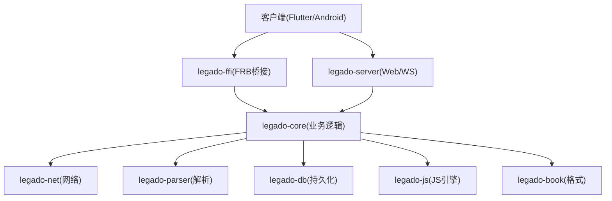

**图表来源** 
- [legado-ffi/lib.rs](file://rust/legado-ffi/src/lib.rs)
- [legado-core/lib.rs](file://rust/legado-core/src/lib.rs)
- [legado-net/lib.rs](file://rust/legado-net/src/lib.rs)
- [legado-parser/lib.rs](file://rust/legado-parser/src/lib.rs)
- [legado-db/lib.rs](file://rust/legado-db/src/lib.rs)
- [legado-js/lib.rs](file://rust/legado-js/src/lib.rs)
- [legado-book/lib.rs](file://rust/legado-book/src/lib.rs)
- [legado-server/lib.rs](file://rust/legado-server/src/lib.rs)

## 详细组件分析

### 数据模型设计（Book、Chapter、BookSource）
- Book：书籍元信息（标题、作者、封面、分类、状态、更新时间等）
- Chapter：章节信息（序号、标题、链接、大小、时间戳等）
- BookSource：网络源规则（名称、URL模板、规则字段、启用状态等）

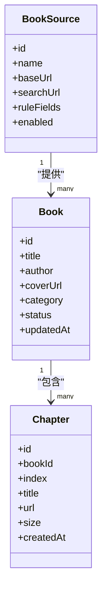

**图表来源** 
- [legado-core/models/book.rs](file://rust/legado-core/src/models/book.rs)
- [legado-core/models/book_chapter.rs](file://rust/legado-core/src/models/book_chapter.rs)
- [legado-core/models/book_source.rs](file://rust/legado-core/src/models/book_source.rs)
- [legado-core/models/mod.rs](file://rust/legado-core/src/models/mod.rs)

**章节来源**
- [legado-core/models/book.rs](file://rust/legado-core/src/models/book.rs)
- [legado-core/models/book_chapter.rs](file://rust/legado-core/src/models/book_chapter.rs)
- [legado-core/models/book_source.rs](file://rust/legado-core/src/models/book_source.rs)
- [legado-core/models/mod.rs](file://rust/legado-core/src/models/mod.rs)

### 搜索引擎与索引构建
- 搜索引擎负责构建倒排索引、关键词分词、相关性评分与分页
- 支持本地缓存与增量更新，提升大规模书籍检索性能

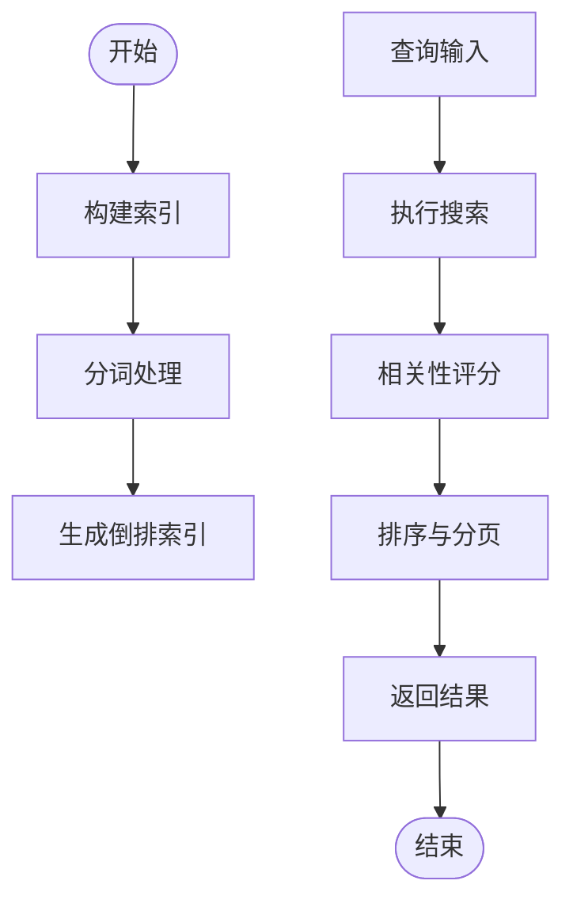

**图表来源** 
- [legado-core/search_engine.rs](file://rust/legado-core/src/search_engine.rs)

**章节来源**
- [legado-core/search_engine.rs](file://rust/legado-core/src/search_engine.rs)

### 内容处理与缓存策略
- 内容处理器负责文本清洗、HTML转义、样式清理、段落拆分
- 缓存策略包括书籍元数据缓存、章节内容缓存、音频片段缓存，支持TTL与LRU

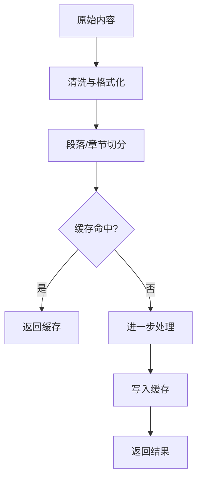

**图表来源** 
- [legado-core/content_processor.rs](file://rust/legado-core/src/content_processor.rs)
- [legado-core/cache_book.rs](file://rust/legado-core/src/cache_book.rs)

**章节来源**
- [legado-core/content_processor.rs](file://rust/legado-core/src/content_processor.rs)
- [legado-core/cache_book.rs](file://rust/legado-core/src/cache_book.rs)

### 数据库操作与仓库层

**已更新** 数据库架构迁移系统已升级到v96版本，新增Migration95To96迁移以修复架构问题

- 连接管理：单例或池化连接，事务支持
- Schema定义：表结构、索引、约束，当前版本v96
- 迁移：版本化管理与自动升级，支持从v95到v96的无缝迁移
- 仓库层：对CRUD操作的封装，支持批量与条件查询

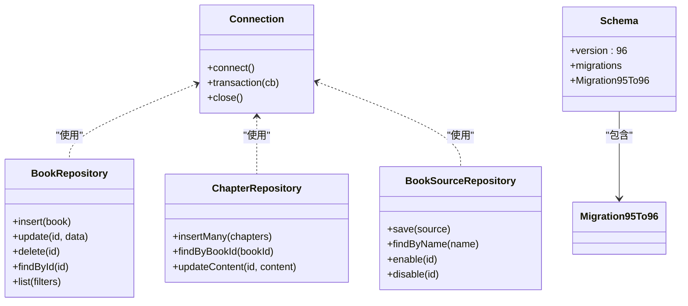

**图表来源** 
- [legado-db/connection.rs](file://rust/legado-db/src/connection.rs)
- [legado-db/schema.rs](file://rust/legado-db/src/schema.rs)
- [legado-db/migration.rs](file://rust/legado-db/src/migration.rs)
- [legado-db/repository/book_repository.rs](file://rust/legado-db/src/repository/book_repository.rs)
- [legado-db/repository/book_chapter_repository.rs](file://rust/legado-db/src/repository/book_chapter_repository.rs)
- [legado-db/repository/book_source_repository.rs](file://rust/legado-db/src/repository/book_source_repository.rs)

**章节来源**
- [legado-db/lib.rs](file://rust/legado-db/src/lib.rs)
- [legado-db/connection.rs](file://rust/legado-db/src/connection.rs)
- [legado-db/schema.rs](file://rust/legado-db/src/schema.rs)
- [legado-db/migration.rs](file://rust/legado-db/src/migration.rs)
- [legado-db/repository/book_repository.rs](file://rust/legado-db/src/repository/book_repository.rs)
- [legado-db/repository/book_chapter_repository.rs](file://rust/legado-db/src/repository/book_chapter_repository.rs)
- [legado-db/repository/book_source_repository.rs](file://rust/legado-db/src/repository/book_source_repository.rs)

### 网络请求与中间件
- 客户端：异步HTTP请求，支持超时、重定向、SSL配置
- 中间件：UA注入、Cookie管理、重试、限速、代理、验证
- 响应处理：解码、压缩、错误映射

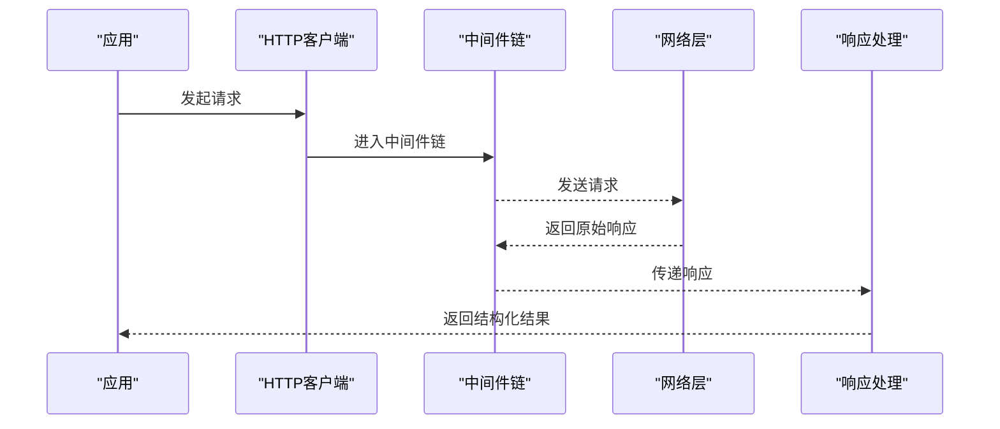

**图表来源** 
- [legado-net/client.rs](file://rust/legado-net/src/client.rs)
- [legado-net/request.rs](file://rust/legado-net/src/request.rs)
- [legado-net/response.rs](file://rust/legado-net/src/response.rs)
- [legado-net/middleware.rs](file://rust/legado-net/src/middleware.rs)

**章节来源**
- [legado-net/lib.rs](file://rust/legado-net/src/lib.rs)
- [legado-net/client.rs](file://rust/legado-net/src/client.rs)
- [legado-net/request.rs](file://rust/legado-net/src/request.rs)
- [legado-net/response.rs](file://rust/legado-net/src/response.rs)
- [legado-net/middleware.rs](file://rust/legado-net/src/middleware.rs)

### 网页解析与规则引擎
- HTML解析：DOM树构建、节点选择
- XPath/JSONPath：表达式查询与数据提取
- 规则分析：规则完整性检查、默认值填充、兼容性校验

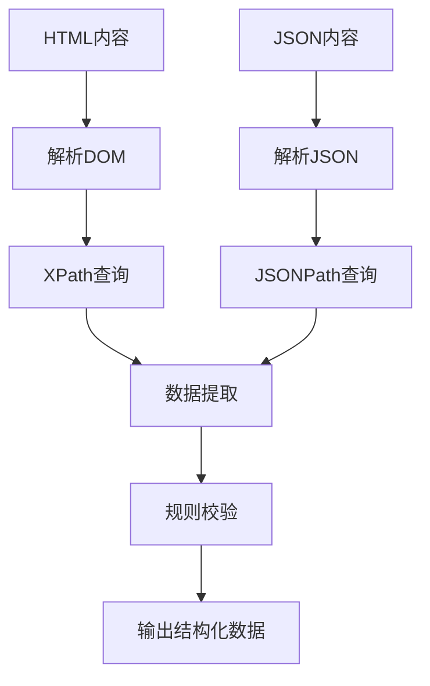

**图表来源** 
- [legado-parser/html.rs](file://rust/legado-parser/src/html.rs)
- [legado-parser/xpath.rs](file://rust/legado-parser/src/xpath.rs)
- [legado-parser/jsonpath.rs](file://rust/legado-parser/src/jsonpath.rs)

**章节来源**
- [legado-parser/lib.rs](file://rust/legado-parser/src/lib.rs)
- [legado-parser/html.rs](file://rust/legado-parser/src/html.rs)
- [legado-parser/xpath.rs](file://rust/legado-parser/src/xpath.rs)
- [legado-parser/jsonpath.rs](file://rust/legado-parser/src/jsonpath.rs)

### JavaScript执行环境与Source脚本
- 引擎初始化：创建隔离上下文，加载宿主API
- Source执行：运行用户脚本，获取搜索结果、章节列表、内容
- 沙箱安全：限制系统访问，提供受控API

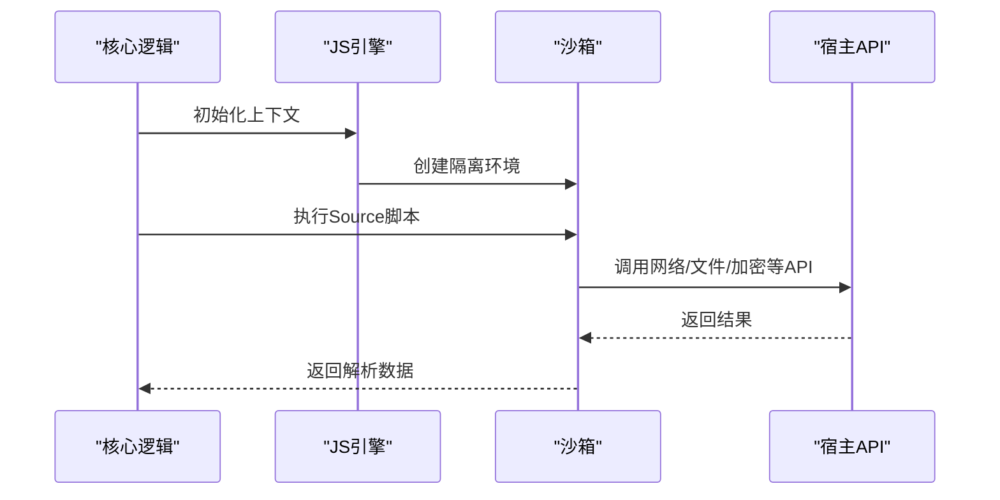

**图表来源** 
- [legado-js/engine.rs](file://rust/legado-js/src/engine.rs)
- [legado-js/source_engine.rs](file://rust/legado-js/src/source_engine.rs)
- [legado-js/lib.rs](file://rust/legado-js/src/lib.rs)

**章节来源**
- [legado-js/lib.rs](file://rust/legado-js/src/lib.rs)
- [legado-js/engine.rs](file://rust/legado-js/src/engine.rs)
- [legado-js/source_engine.rs](file://rust/legado-js/src/source_engine.rs)

### FFI接口规范与Flutter桥接
- FRB配置：定义数据类型、函数签名、异步回调
- 错误映射：统一错误类型与消息
- 运行时管理：生命周期、线程模型、资源释放

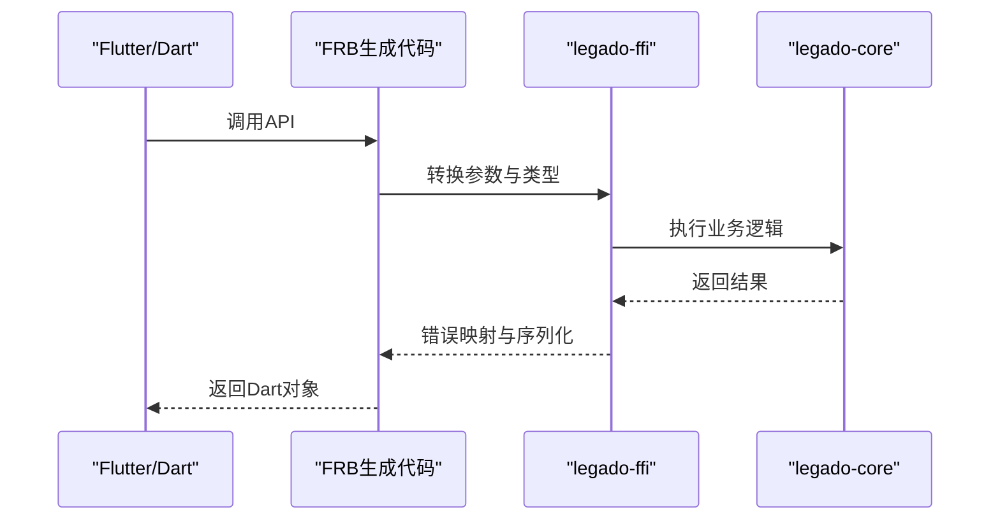

**图表来源** 
- [legado-ffi/bridge.rs](file://rust/legado-ffi/src/bridge.rs)
- [legado-ffi/frb_generated.rs](file://rust/legado-ffi/src/frb_generated.rs)
- [flutter_rust_bridge.yaml](file://flutter_legado/flutter_rust_bridge.yaml)

**章节来源**
- [legado-ffi/lib.rs](file://rust/legado-ffi/src/lib.rs)
- [legado-ffi/bridge.rs](file://rust/legado-ffi/src/bridge.rs)
- [legado-ffi/frb_generated.rs](file://rust/legado-ffi/src/frb_generated.rs)
- [flutter_rust_bridge.yaml](file://flutter_legado/flutter_rust_bridge.yaml)

### 电子书格式支持（TXT/EPUB/MOBI/PDF）
- TXT：简单文本解析、目录识别、搜索优化
- EPUB：标准解析、元数据提取、章节导航
- MOBI/PDF：兼容性与性能优化

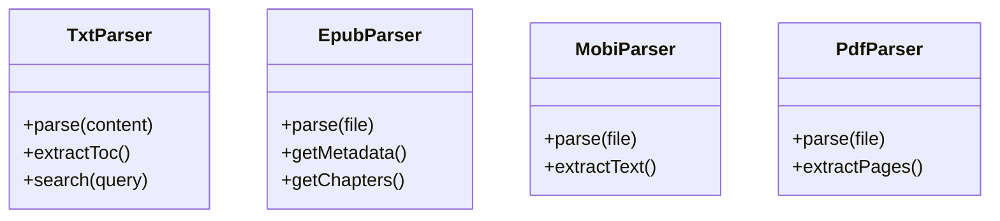

**图表来源** 
- [legado-book/txt.rs](file://rust/legado-book/src/txt.rs)
- [legado-book/epub.rs](file://rust/legado-book/src/epub.rs)
- [legado-book/lib.rs](file://rust/legado-book/src/lib.rs)

**章节来源**
- [legado-book/lib.rs](file://rust/legado-book/src/lib.rs)
- [legado-book/txt.rs](file://rust/legado-book/src/txt.rs)
- [legado-book/epub.rs](file://rust/legado-book/src/epub.rs)

## 依赖关系分析
- 模块耦合：core依赖net/parser/db/js/book，ffi作为统一入口
- 外部依赖：SQLite、HTTP客户端、JS引擎、解析库
- 循环依赖：通过接口抽象避免直接循环引用

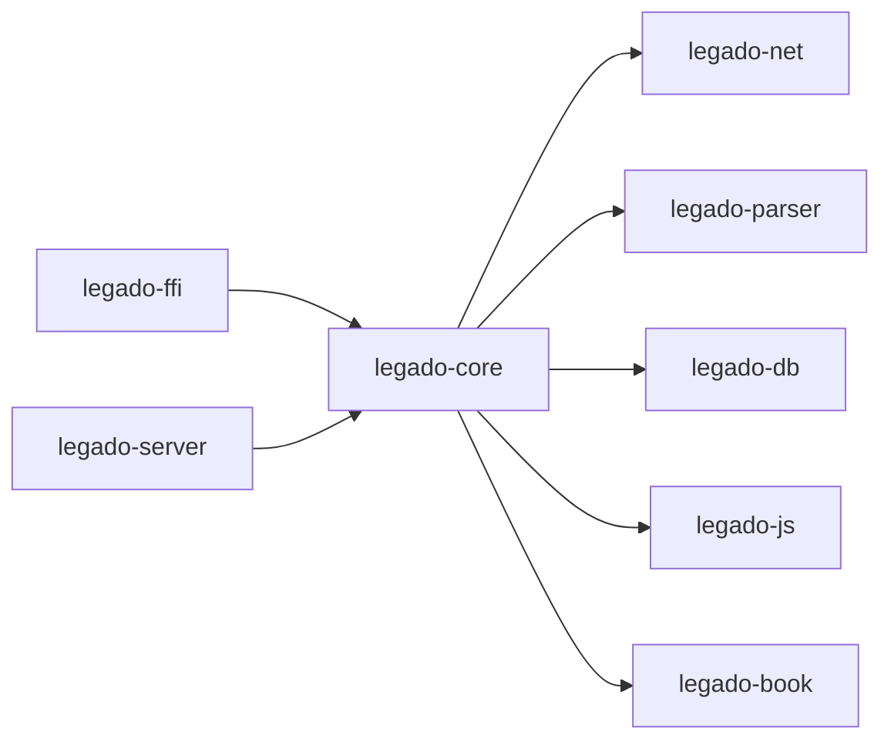

**图表来源** 
- [Cargo.toml](file://rust/Cargo.toml)

**章节来源**
- [Cargo.toml](file://rust/Cargo.toml)

## 性能考量
- 异步模型：基于Tokio的事件驱动，非阻塞I/O，高并发处理
- 缓存策略：多级缓存（内存/磁盘），TTL与LRU结合，减少重复计算
- 索引优化：倒排索引、分词优化、增量更新
- 网络优化：连接池、重试退避、压缩传输、代理支持
- 解析优化：流式解析、懒加载、内存复用
- 数据库优化：迁移效率提升，v96版本优化了架构一致性检查

## 故障排查指南
- 网络连接失败：检查代理、SSL配置、超时设置
- 解析异常：验证XPath/JSONPath表达式、HTML结构变化
- 数据库错误：确认Schema版本v96、Migration95To96迁移脚本、事务一致性
- JS脚本错误：查看沙箱日志、API调用限制、内存泄漏
- FFI桥接问题：检查类型映射、错误码、异步回调

**章节来源**
- [legado-net/middleware.rs](file://rust/legado-net/src/middleware.rs)
- [legado-parser/xpath.rs](file://rust/legado-parser/src/xpath.rs)
- [legado-db/connection.rs](file://rust/legado-db/src/connection.rs)
- [legado-db/migration.rs](file://rust/legado-db/src/migration.rs)
- [legado-js/source_engine.rs](file://rust/legado-js/src/source_engine.rs)
- [legado-ffi/bridge.rs](file://rust/legado-ffi/src/bridge.rs)

## 结论
Rust核心库通过清晰的模块划分与异步架构，提供了高性能、可扩展的阅读解决方案。最新的数据库架构迁移修复确保了v96版本的稳定性和向后兼容性。开发者可基于现有接口快速扩展新书籍格式与网络源规则，同时利用FFI桥接与Flutter/Android平台无缝集成。

## 附录
- API使用示例：参考FRB生成的接口定义与Flutter调用方式
- 扩展开发指南：
  - 添加新书籍格式：实现解析器接口，注册到格式层
  - 新增网络源规则：编写JS脚本，定义规则字段与查询逻辑
  - 自定义中间件：实现网络中间件接口，注入请求处理逻辑
  - 数据库迁移：遵循版本控制，确保迁移脚本的正确性