# Rust核心库

<cite>
**本文引用的文件**   
- [Cargo.toml](file://rust/Cargo.toml)
- [MIGRATION_WORKFLOW.md](file://rust/MIGRATION_WORKFLOW.md)
- [PROGRESS.md](file://rust/PROGRESS.md)
- [legado-core/lib.rs](file://rust/legado-core/src/lib.rs)
- [legado-core/regex_safe.rs](file://rust/legado-core/src/regex_safe.rs)
- [legado-core/content_processor.rs](file://rust/legado-core/src/content_processor.rs)
- [legado-book/txt.rs](file://rust/legado-book/src/txt.rs)
- [legado-book/txt_search.rs](file://rust/legado-book/src/txt_search.rs)
- [legado-db/repository/replace_rule_repository.rs](file://rust/legado-db/src/repository/replace_rule_repository.rs)
- [legado-js/host_api/regex_utils.rs](file://rust/legado-js/src/host_api/regex_utils.rs)
- [legado-ffi/api/web_book.rs](file://rust/legado-ffi/src/api/web_book.rs)
</cite>

## 更新摘要
**所做更改**
- 重大增强正则表达式安全编译系统，实现三层防护策略（长度限制、嵌套深度检查、负缓存机制）
- 新增非递归结构预检查函数max_nesting_depth()，提供零栈风险的嵌套深度检测
- 改进LRU缓存系统，采用容量上限和逐出策略避免内存膨胀
- 增强日志记录和Android集成，通过logcat路由诊断信息
- 更新各组件的正则表达式使用方式，统一集成安全编译入口
- 完善故障排查指南，包含正则表达式相关问题的诊断方法

## 目录
1. [简介](#简介)
2. [项目结构](#项目结构)
3. [核心组件](#核心组件)
4. [架构总览](#架构总览)
5. [详细组件分析](#详细组件分析)
6. [依赖关系分析](#依赖关系分析)
7. [性能考量](#性能考量)
8. [故障排查指南](#故障排查指南)
9. [结论](#结论)
10. [附录](#附录)

## 简介
本文件面向Rust核心库的全面文档，覆盖legado-core（核心业务逻辑）、legado-db（数据库操作）、legado-net（网络请求）、legado-parser（网页解析）、legado-js（JavaScript执行环境）等模块的职责、数据模型设计、算法与优化、FFI接口规范以及基于Tokio的异步编程模型。同时提供API使用示例与扩展开发指南，帮助开发者快速理解并扩展新的书籍格式支持与网络源规则。

**最新更新**：Rust核心库完成了Phase 1-4迁移，FFI桥接完全重写，HTTP状态管理优化，QUIC协议支持，探索功能和自动任务API模块的引入。**最新增强的中文转换功能**提供了简繁中文互转能力，**归档处理增强**支持多种压缩格式，**SOCKS5代理测试框架**确保了代理功能的可靠性。**最新增强的源验证系统FFI接口**提供了完整的书源验证功能，支持流式验证操作处理和实时进度反馈。**重大安全改进**：引入了统一的正则表达式安全编译系统，通过三层防护策略防止病态正则表达式导致的栈溢出和崩溃问题。当前进度显示168个原子任务全部完成，Rust完成率修订为96-97%，测试覆盖率显著提升。

## 项目结构
Rust核心库采用多crate模块化组织，顶层Cargo配置管理依赖与工作区，各子crate按职责划分：
- legado-core：领域模型、搜索引擎、内容处理、缓存策略、阅读状态、**中文转换**、**正则表达式安全编译**等核心业务逻辑
- legado-db：SQLite持久化、迁移、仓库层封装
- legado-net：HTTP客户端、中间件、重试、代理、Cookie存储、速率限制、QUIC支持、**源验证检查器**、**SOCKS5代理测试**
- legado-parser：HTML/XPath/JSONPath解析、规则分析器、URL分析
- legado-js：Rhino/JS引擎封装、沙箱、Source脚本执行环境
- legado-ffi：Flutter/Rust桥接（FRB生成代码）、统一对外API入口，现已完全重写
- legado-book：电子书格式支持（TXT/EPUB/MOBI/PDF等）、**归档处理增强**
- legado-server：Web服务与WebSocket通信

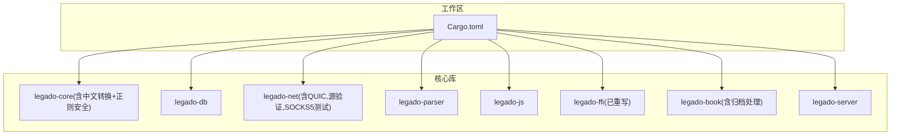

**图表来源** 
- [Cargo.toml](file://rust/Cargo.toml)

**章节来源**
- [Cargo.toml](file://rust/Cargo.toml)

## 核心组件
- legado-core
  - 领域模型：Book、Chapter、BookSource等实体定义与关系
  - 搜索引擎：构建索引、关键词匹配、结果排序
  - 内容处理：文本清洗、格式化、渲染预处理
  - 缓存策略：书籍缓存、章节缓存、音频缓存
  - **新增** 中文转换：简繁中文互转，内嵌常用汉字映射表
  - **重大增强** 正则表达式安全编译：统一的安全正则编译入口，三层防护策略，非递归结构预检查
- legado-db
  - 连接管理、Schema定义、迁移策略
  - 仓库层：BookRepository、ChapterRepository、BookSourceRepository等
- legado-net
  - 异步HTTP客户端、请求构造、响应处理
  - 中间件链：UA、Cookie、重试、限速、代理、验证
  - **新增** QUIC/HTTP3客户端支持
  - **新增** 源验证检查器（SourceChecker），支持验证码检测、重定向检测
  - **新增** SOCKS5代理测试框架，端到端验证代理功能
- legado-parser
  - HTML解析、XPath/JSONPath查询、规则分析与补全
- legado-js
  - JS引擎初始化、上下文隔离、Source脚本执行
- legado-ffi
  - **已完全重写** FRB桥接、错误映射、运行时管理
  - **新增** HTTP状态管理（共享客户端单例）
  - **新增** 探索功能API模块
  - **新增** 自动任务API模块
  - **新增** 源验证API模块（source_check_api.rs）
  - **新增** WebBook FFI API（web_book.rs）
- legado-book
  - 多格式解析与导出（TXT/EPUB/MOBI/PDF）
  - **新增** 归档处理增强：ZIP/RAR/7z格式支持，安全解压机制
- legado-server
  - HTTP路由、WS事件、调试与工具接口

**章节来源**
- [legado-core/lib.rs](file://rust/legado-core/src/lib.rs)
- [legado-core/chinese_convert.rs](file://rust/legado-core/src/chinese_convert.rs)
- [legado-core/regex_safe.rs](file://rust/legado-core/src/regex_safe.rs)
- [legado-db/lib.rs](file://rust/legado-db/src/lib.rs)
- [legado-net/lib.rs](file://rust/legado-net/src/lib.rs)
- [legado-net/socks5_e2e.rs](file://rust/legado-net/src/socks5_e2e.rs)
- [legado-parser/lib.rs](file://rust/legado-parser/src/lib.rs)
- [legado-js/lib.rs](file://rust/legado-js/src/lib.rs)
- [legado-ffi/lib.rs](file://rust/legado-ffi/src/lib.rs)
- [legado-ffi/web_book.rs](file://rust/legado-ffi/src/api/web_book.rs)
- [legado-book/lib.rs](file://rust/legado-book/src/lib.rs)
- [legado-book/archive.rs](file://rust/legado-book/src/archive.rs)
- [legado-server/lib.rs](file://rust/legado-server/src/lib.rs)

## 架构总览
整体架构遵循分层与职责分离原则：
- 表现层（Flutter/Android）通过FRB调用legado-ffi暴露的API
- 业务层（legado-core）编排搜索、解析、缓存、阅读流程，**新增** 中文转换功能和**重大增强** 正则表达式安全编译
- 数据层（legado-db）负责持久化与迁移
- 网络层（legado-net）提供高可用、可配置的HTTP能力，**新增** QUIC支持和源验证功能，**新增** SOCKS5代理测试
- 解析层（legado-parser）实现规则驱动的网页解析
- 脚本层（legado-js）为Source提供可扩展的JS执行环境
- 格式层（legado-book）支持多种电子书格式，**新增** 归档处理增强
- 服务层（legado-server）提供Web与WS接口用于调试与集成

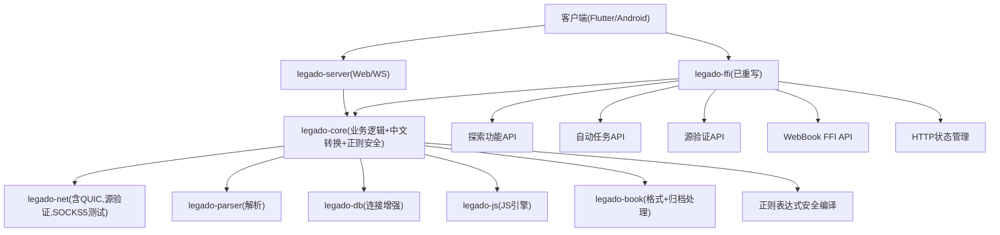

**图表来源** 
- [legado-ffi/lib.rs](file://rust/legado-ffi/src/lib.rs)
- [legado-core/lib.rs](file://rust/legado-core/src/lib.rs)
- [legado-net/lib.rs](file://rust/legado-net/src/lib.rs)
- [legado-parser/lib.rs](file://rust/legado-parser/src/lib.rs)
- [legado-db/lib.rs](file://rust/legado-db/src/lib.rs)
- [legado-js/lib.rs](file://rust/legado-js/src/lib.rs)
- [legado-book/lib.rs](file://rust/legado-book/src/lib.rs)
- [legado-server/lib.rs](file://rust/legado-server/src/lib.rs)

## 详细组件分析

### 数据模型设计（Book、Chapter、BookSource）
- Book：书籍元信息（标题、作者、封面、分类、状态、更新时间等）
- Chapter：章节信息（序号、标题、链接、大小、时间戳等）
- BookSource：网络源规则（名称、URL模板、规则字段、启用状态等）

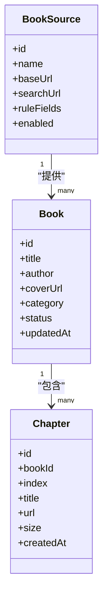

**图表来源** 
- [legado-core/models/book.rs](file://rust/legado-core/src/models/book.rs)
- [legado-core/models/book_chapter.rs](file://rust/legado-core/src/models/book_chapter.rs)
- [legado-core/models/book_source.rs](file://rust/legado-core/src/models/book_source.rs)
- [legado-core/models/mod.rs](file://rust/legado-core/src/models/mod.rs)

**章节来源**
- [legado-core/models/book.rs](file://rust/legado-core/src/models/book.rs)
- [legado-core/models/book_chapter.rs](file://rust/legado-core/src/models/book_chapter.rs)
- [legado-core/models/book_source.rs](file://rust/legado-core/src/models/book_source.rs)
- [legado-core/models/mod.rs](file://rust/legado-core/src/models/mod.rs)

### 正则表达式安全编译系统（重大增强）

**重大安全改进** 实现了全面的正则表达式安全编译系统，通过三层防护策略防止病态正则表达式导致的栈溢出和崩溃问题

#### 三层防护策略

1. **长度限制防护**：1KB pattern长度上限，超限直接拒绝编译
2. **嵌套深度限制**：新增`max_nesting_depth()`非递归结构预检查，统计`(`与`[`的最大嵌套深度，超过32层直接拒绝
3. **负缓存机制**：失败结果永久缓存，避免反复触发编译风暴

#### 核心功能特性

- **统一安全入口**：compile_regex_safe()函数作为所有动态正则编译的唯一入口
- **线程隔离编译**：8MB栈独立线程编译，作为最后兜底防御
- **全局编译缓存**：Arc<Regex>共享实例，容量上限防内存膨胀
- **双引擎支持**：优先使用高性能regex crate，回退到fancy-regex支持高级语法
- **Android集成**：通过logcat路由诊断日志，确保移动端可观测性

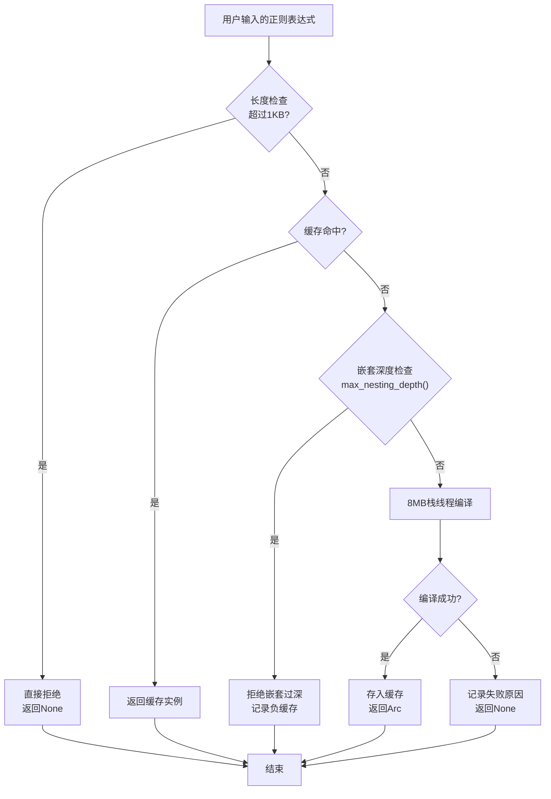

**图表来源** 
- [legado-core/regex_safe.rs:196-251](file://rust/legado-core/src/regex_safe.rs#L196-L251)

#### 跨组件安全集成

正则表达式安全编译系统已集成到多个关键组件中：

- **内容处理器**：Java正则方言适配，统一安全入口编译
- **TXT解析器**：章节标题模式匹配，安全编译章节识别正则
- **替换规则仓库**：用户定义的替换规则，安全编译应用
- **JS宿主API**：动态正则表达式处理，安全编译保护
- **WebBook FFI**：URL模式匹配，安全编译防护

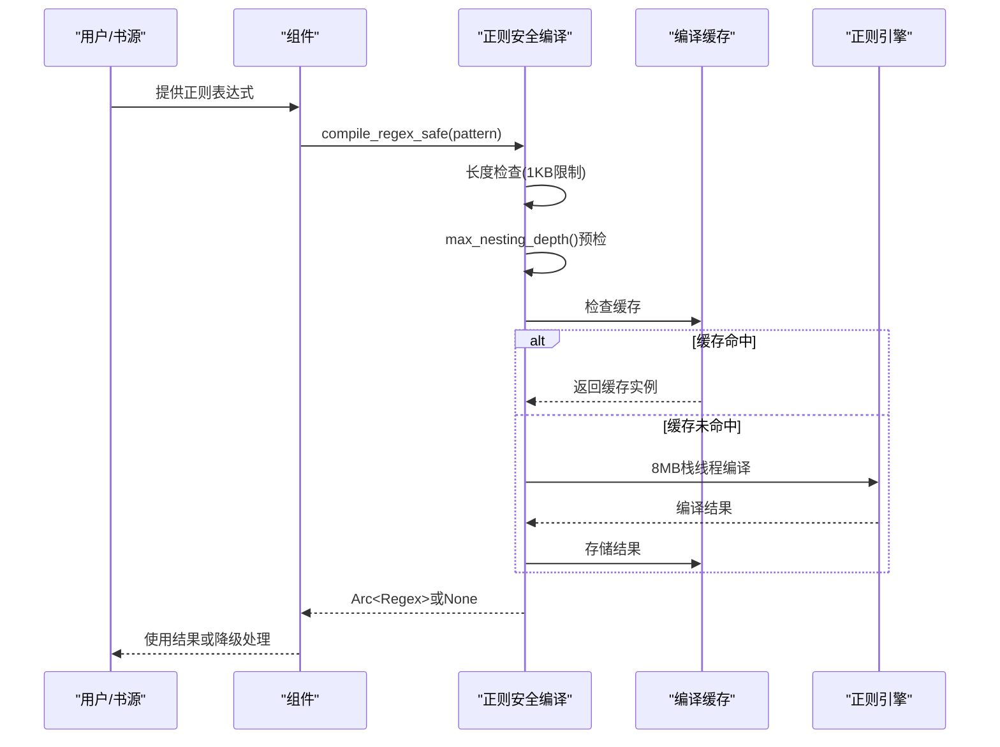

**图表来源** 
- [legado-core/regex_safe.rs:196-251](file://rust/legado-core/src/regex_safe.rs#L196-L251)
- [legado-core/content_processor.rs:540-559](file://rust/legado-core/src/content_processor.rs#L540-L559)
- [legado-book/txt.rs:61-64](file://rust/legado-book/src/txt.rs#L61-L64)
- [legado-db/repository/replace_rule_repository.rs:172-183](file://rust/legado-db/src/repository/replace_rule_repository.rs#L172-L183)
- [legado-js/host_api/regex_utils.rs:31-32](file://rust/legado-js/src/host_api/regex_utils.rs#L31-L32)
- [legado-ffi/api/web_book.rs:994-1015](file://rust/legado-ffi/src/api/web_book.rs#L994-L1015)

**章节来源**
- [legado-core/regex_safe.rs](file://rust/legado-core/src/regex_safe.rs)
- [legado-core/content_processor.rs](file://rust/legado-core/src/content_processor.rs)
- [legado-book/txt.rs](file://rust/legado-book/src/txt.rs)
- [legado-db/repository/replace_rule_repository.rs](file://rust/legado-db/src/repository/replace_rule_repository.rs)
- [legado-js/host_api/regex_utils.rs](file://rust/legado-js/src/host_api/regex_utils.rs)
- [legado-ffi/api/web_book.rs](file://rust/legado-ffi/src/api/web_book.rs)

### 中文转换功能模块

**新增** 中文转换模块提供了简繁中文互转功能，内嵌常用汉字映射表，不依赖外部crate避免循环依赖

- 繁体→简体映射：包含大量常用汉字的映射关系
- 性能优化：使用静态映射表和OnceLock确保线程安全
- 内存效率：直接字符映射，无需额外数据结构
- 应用场景：书籍内容标准化、搜索结果统一显示

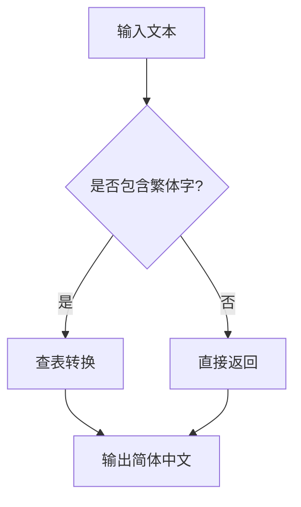

**图表来源** 
- [legado-core/chinese_convert.rs:1-800](file://rust/legado-core/src/chinese_convert.rs#L1-L800)

**章节来源**
- [legado-core/chinese_convert.rs](file://rust/legado-core/src/chinese_convert.rs)

### 归档处理增强（RAR和7z支持）

**新增** 归档处理模块提供了完整的压缩包导入功能，支持ZIP、RAR、7z格式

- ZIP支持：使用zip crate实现标准ZIP格式解析
- RAR支持：使用unrar crate实现RAR格式解析（非Android平台）
- 7z支持：文件类型识别和基础处理
- 安全机制：防止路径穿越攻击，验证输出路径安全性
- 过滤机制：仅提取支持的书籍文件格式（.txt/.epub/.mobi/.pdf/.umd/.azw3/.azw）

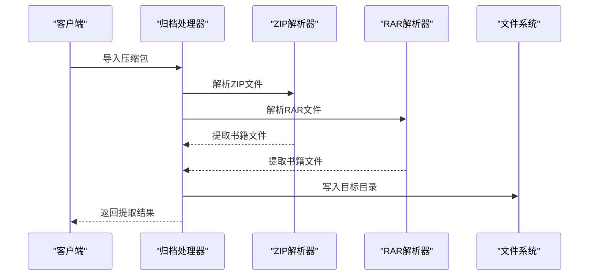

**图表来源** 
- [legado-book/archive.rs:1-455](file://rust/legado-book/src/archive.rs#L1-L455)

**章节来源**
- [legado-book/archive.rs](file://rust/legado-book/src/archive.rs)

### SOCKS5代理测试框架

**新增** SOCKS5代理测试框架实现了端到端的代理功能验证

- RFC 1928握手：完整的SOCKS5协议实现
- RFC 1929认证：用户名/密码认证机制
- 最小测试服务器：内置SOCKS5服务器用于测试
- 双向透传：CONNECT请求后的数据转发
- 统计监控：记录认证成功、拒绝和连接数量

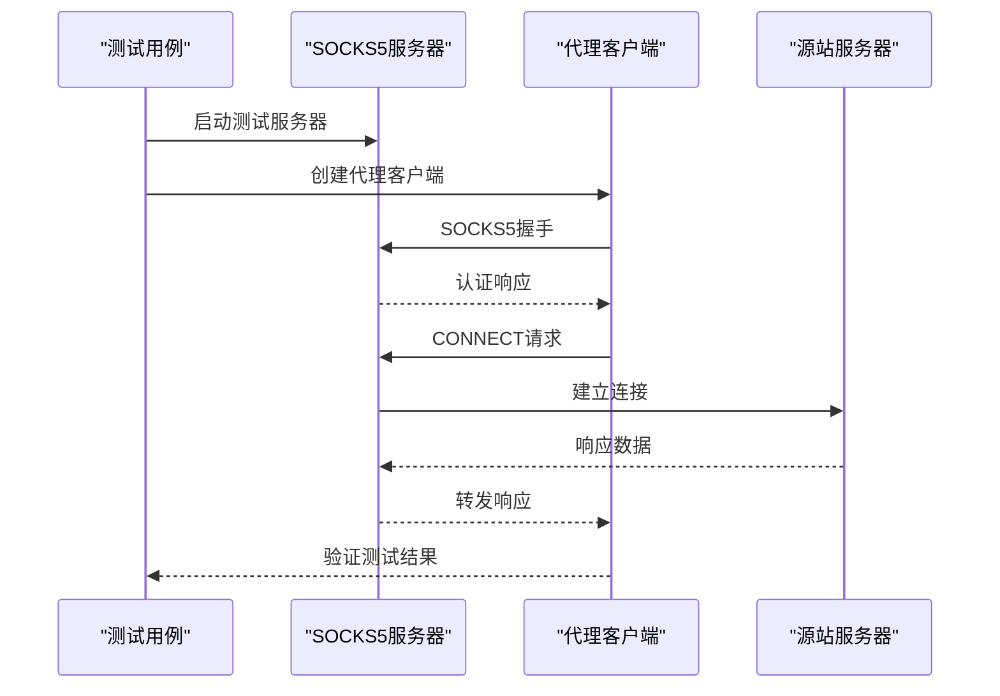

**图表来源** 
- [legado-net/socks5_e2e.rs:1-255](file://rust/legado-net/src/socks5_e2e.rs#L1-L255)

**章节来源**
- [legado-net/socks5_e2e.rs](file://rust/legado-net/src/socks5_e2e.rs)

### WebBook FFI API与内容获取

**新增** WebBook FFI API提供了完整的书源驱动内容获取能力，包含搜索、详情、目录、正文四步完整链路

- RealBookSourceFetcher：基于LegadoClient + AnalyzeUrl + AnalyzeRule的真实网络请求实现
- 搜索功能：支持bookUrlPattern详情页直连、列表回退、去重处理
- 详情解析：canReName双条件门控、绝对URL处理、tocUrl回退机制
- 目录获取：反转标记支持、卷章识别、去重算法
- 正文获取：HTML格式化、实体反转义、空内容检查、媒体书源特殊处理

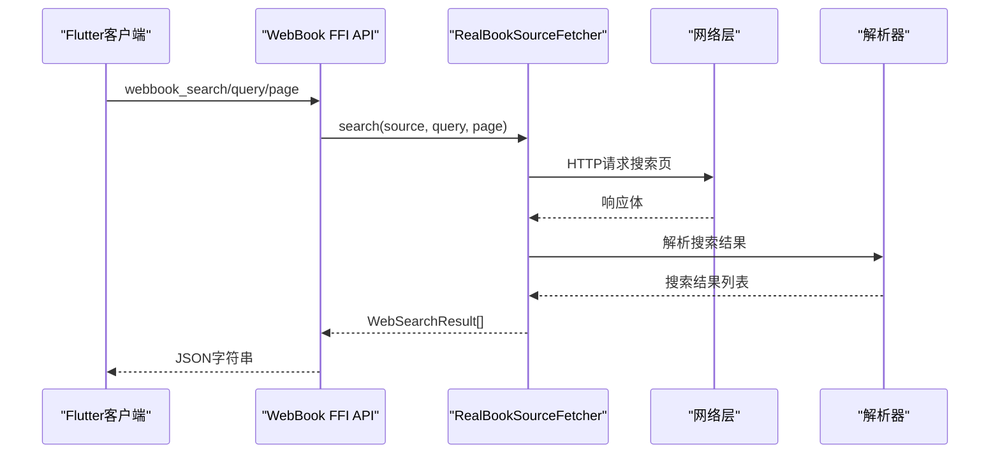

**图表来源** 
- [legado-ffi/web_book.rs:24-647](file://rust/legado-ffi/src/api/web_book.rs#L24-L647)

**章节来源**
- [legado-ffi/web_book.rs](file://rust/legado-ffi/src/api/web_book.rs)

### TXT搜索功能增强

**新增** TXT搜索功能集成了正则表达式安全编译系统，提供安全的全文搜索能力

- 安全编译：所有搜索模式都通过compile_regex_safe()进行安全编译
- 模式支持：纯文本模式和正则表达式模式
- 上下文提取：搜索结果包含前后文上下文
- 性能优化：章节级搜索，支持结果数量限制

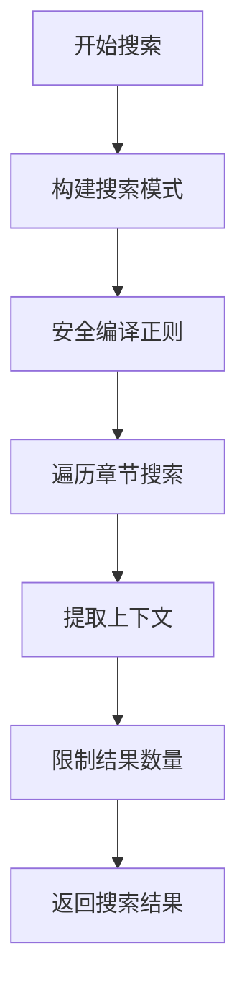

**图表来源** 
- [legado-book/txt_search.rs:205-225](file://rust/legado-book/src/txt_search.rs#L205-L225)

**章节来源**
- [legado-book/txt_search.rs](file://rust/legado-book/src/txt_search.rs)

### 搜索引擎与索引构建
- 搜索引擎负责构建倒排索引、关键词分词、相关性评分与分页
- 支持本地缓存与增量更新，提升大规模书籍检索性能


**图表来源** 
- [legado-core/search_engine.rs](file://rust/legado-core/src/search_engine.rs)

**章节来源**
- [legado-core/search_engine.rs](file://rust/legado-core/src/search_engine.rs)

### 内容处理与缓存策略
- 内容处理器负责文本清洗、HTML转义、样式清理、段落拆分
- 缓存策略包括书籍元数据缓存、章节内容缓存、音频片段缓存，支持TTL与LRU

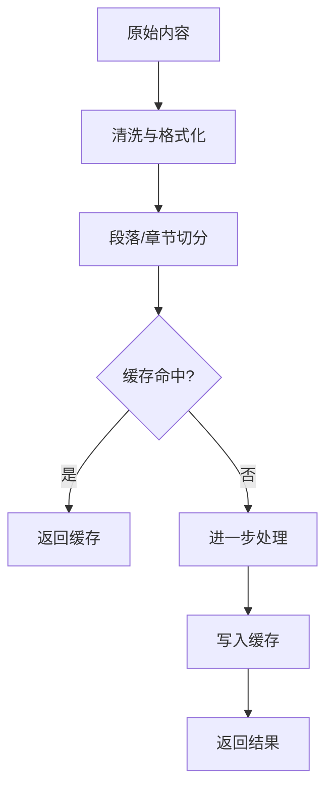

**图表来源** 
- [legado-core/content_processor.rs](file://rust/legado-core/src/content_processor.rs)
- [legado-core/cache_book.rs](file://rust/legado-core/src/cache_book.rs)

**章节来源**
- [legado-core/content_processor.rs](file://rust/legado-core/src/content_processor.rs)
- [legado-core/cache_book.rs](file://rust/legado-core/src/cache_book.rs)

### 数据库操作与仓库层

**已更新** 数据库连接管理得到显著增强，connection.rs新增36行代码提升了连接池管理和事务处理能力，同时实现了从v95到v96的无缝迁移

- 连接管理：单例或池化连接，事务支持，连接健康检查
- Schema定义：表结构、索引、约束，当前版本v96
- 迁移：版本化管理与自动升级，支持从v95到v96的无缝迁移
- 仓库层：对CRUD操作的封装，支持批量与条件查询

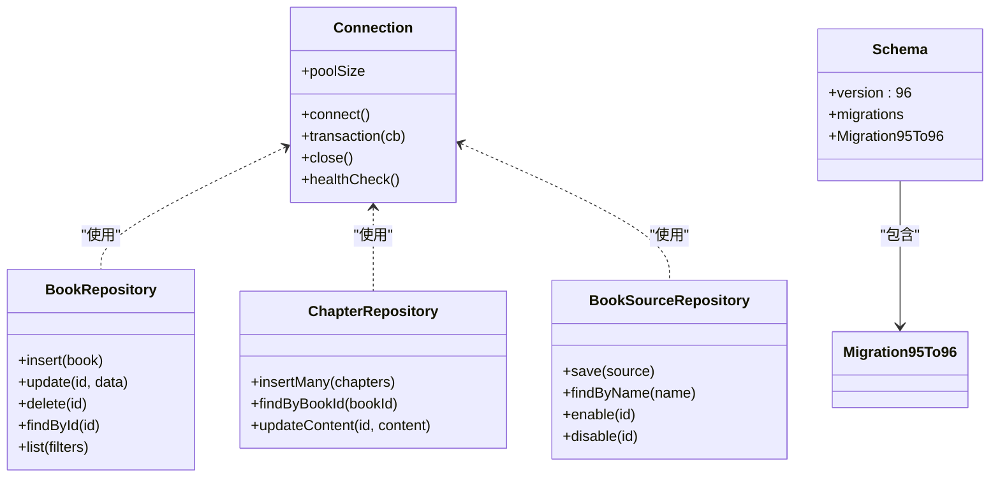

**图表来源** 
- [legado-db/connection.rs](file://rust/legado-db/src/connection.rs)
- [legado-db/schema.rs](file://rust/legado-db/src/schema.rs)
- [legado-db/migration.rs](file://rust/legado-db/src/migration.rs)
- [legado-db/repository/book_repository.rs](file://rust/legado-db/src/repository/book_repository.rs)
- [legado-db/repository/book_chapter_repository.rs](file://rust/legado-db/src/repository/book_chapter_repository.rs)
- [legado-db/repository/book_source_repository.rs](file://rust/legado-db/src/repository/book_source_repository.rs)

**章节来源**
- [legado-db/lib.rs](file://rust/legado-db/src/lib.rs)
- [legado-db/connection.rs](file://rust/legado-db/src/connection.rs)
- [legado-db/schema.rs](file://rust/legado-db/src/schema.rs)
- [legado-db/migration.rs](file://rust/legado-db/src/migration.rs)
- [legado-db/repository/book_repository.rs](file://rust/legado-db/src/repository/book_repository.rs)
- [legado-db/repository/book_chapter_repository.rs](file://rust/legado-db/src/repository/book_chapter_repository.rs)
- [legado-db/repository/book_source_repository.rs](file://rust/legado-db/src/repository/book_source_repository.rs)

### 网络请求与中间件

**已更新** 网络层客户端功能得到显著增强，client.rs新增254行代码，提供了更强大的HTTP客户端能力，**新增** 完整的QUIC/HTTP3支持

- 客户端：异步HTTP请求，支持超时、重定向、SSL配置，连接池优化
- 中间件：UA注入、Cookie管理、重试、限速、代理、验证
- 响应处理：解码、压缩、错误映射，流式响应支持
- **新增** QUIC客户端：基于quinn的QUIC协议实现，支持HTTP/3、连接池管理、性能监控

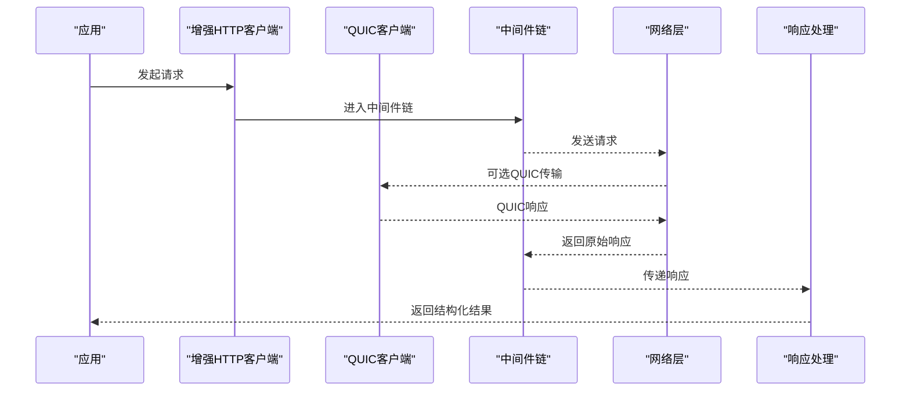

**图表来源** 
- [legado-net/client.rs](file://rust/legado-net/src/client.rs)
- [legado-net/request.rs](file://rust/legado-net/src/request.rs)
- [legado-net/response.rs](file://rust/legado-net/src/response.rs)
- [legado-net/middleware.rs](file://rust/legado-net/src/middleware.rs)
- [legado-net/quic.rs](file://rust/legado-net/src/quic.rs)

**章节来源**
- [legado-net/lib.rs](file://rust/legado-net/src/lib.rs)
- [legado-net/client.rs](file://rust/legado-net/src/client.rs)
- [legado-net/request.rs](file://rust/legado-net/src/request.rs)
- [legado-net/response.rs](file://rust/legado-net/src/response.rs)
- [legado-net/middleware.rs](file://rust/legado-net/src/middleware.rs)
- [legado-net/quic.rs](file://rust/legado-net/src/quic.rs)

### 网页解析与规则引擎
- HTML解析：DOM树构建、节点选择
- XPath/JSONPath：表达式查询与数据提取
- 规则分析：规则完整性检查、默认值填充、兼容性校验

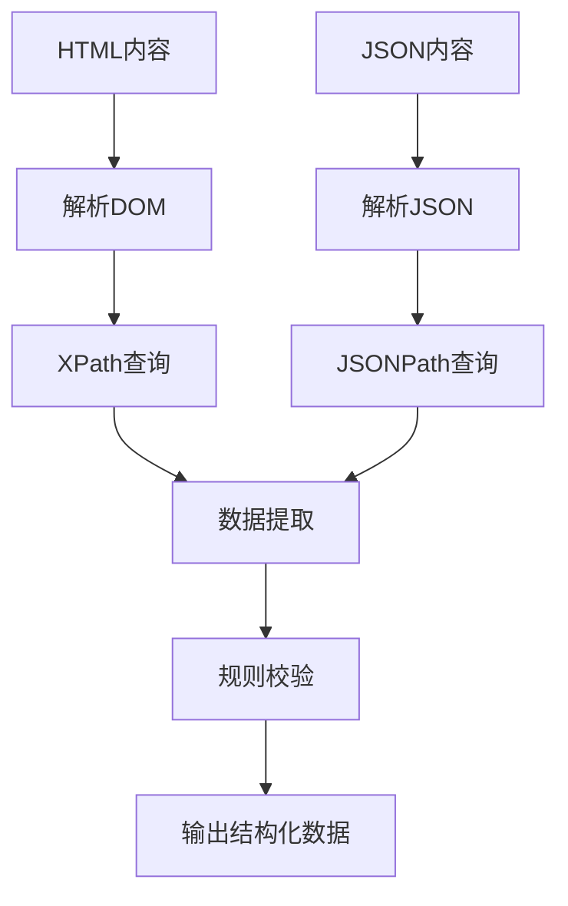

**图表来源** 
- [legado-parser/html.rs](file://rust/legado-parser/src/html.rs)
- [legado-parser/xpath.rs](file://rust/legado-parser/src/xpath.rs)
- [legado-parser/jsonpath.rs](file://rust/legado-parser/src/jsonpath.rs)

**章节来源**
- [legado-parser/lib.rs](file://rust/legado-parser/src/lib.rs)
- [legado-parser/html.rs](file://rust/legado-parser/src/html.rs)
- [legado-parser/xpath.rs](file://rust/legado-parser/src/xpath.rs)
- [legado-parser/jsonpath.rs](file://rust/legado-parser/src/jsonpath.rs)

### JavaScript执行环境与Source脚本
- 引擎初始化：创建隔离上下文，加载宿主API
- Source执行：运行用户脚本，获取搜索结果、章节列表、内容
- 沙箱安全：限制系统访问，提供受控API

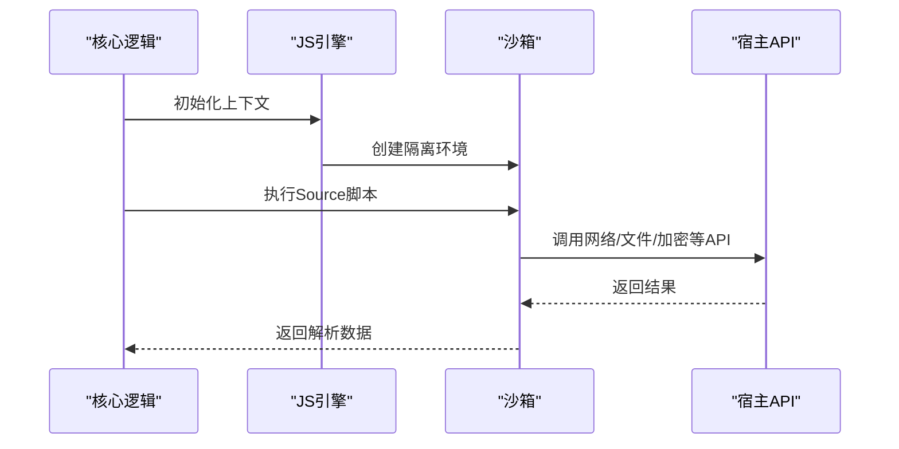

**图表来源** 
- [legado-js/engine.rs](file://rust/legado-js/src/engine.rs)
- [legado-js/source_engine.rs](file://rust/legado-js/src/source_engine.rs)
- [legado-js/lib.rs](file://rust/legado-js/src/lib.rs)

**章节来源**
- [legado-js/lib.rs](file://rust/legado-js/src/lib.rs)
- [legado-js/engine.rs](file://rust/legado-js/src/engine.rs)
- [legado-js/source_engine.rs](file://rust/legado-js/src/source_engine.rs)

### FFI接口规范与Flutter桥接

**已完全重写** FFI桥接层经过完全重写，bridge.rs新增333行代码，提供了更稳定高效的跨语言通信机制，**新增** HTTP状态管理模块

- FRB配置：定义数据类型、函数签名、异步回调
- 错误映射：统一错误类型与消息，异常处理增强
- 运行时管理：生命周期、线程模型、资源释放优化
- **新增** HTTP状态管理：共享客户端单例，解决数据竞争条件
- **新增** 探索功能API模块（explore_api.rs 230行）
- **新增** 自动任务API模块（auto_task_api.rs 268行）
- **新增** 源验证API模块（source_check_api.rs 487行）
- **新增** WebBook FFI API模块（web_book.rs 1243行）

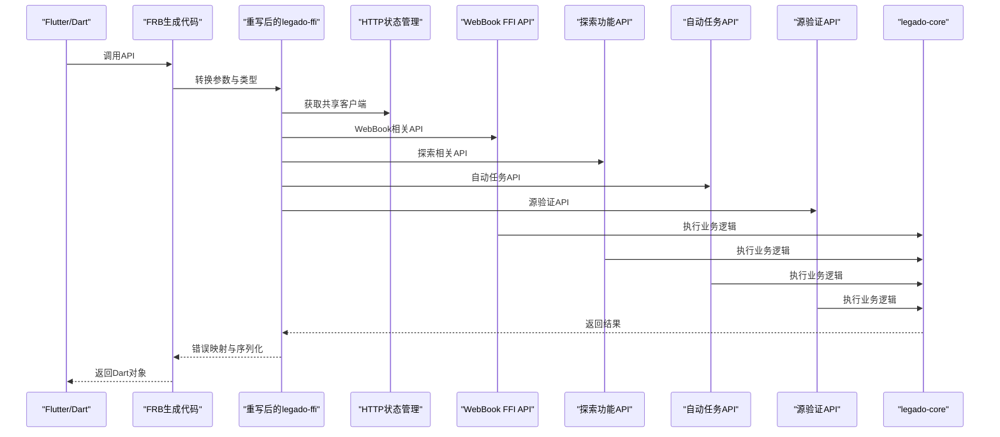

**图表来源** 
- [legado-ffi/bridge.rs](file://rust/legado-ffi/src/bridge.rs)
- [legado-ffi/ffi.rs](file://rust/legado-ffi/src/ffi.rs)
- [legado-ffi/http_state.rs](file://rust/legado-ffi/src/http_state.rs)
- [legado-ffi/web_book.rs](file://rust/legado-ffi/src/api/web_book.rs)
- [legado-ffi/explore_api.rs](file://rust/legado-ffi/src/api/explore_api.rs)
- [legado-ffi/auto_task_api.rs](file://rust/legado-ffi/src/api/auto_task_api.rs)
- [legado-ffi/source_check_api.rs](file://rust/legado-ffi/src/api/source_check_api.rs)
- [legado-ffi/frb_generated.rs](file://rust/legado-ffi/src/frb_generated.rs)
- [flutter_rust_bridge.yaml](file://flutter_legado/flutter_rust_bridge.yaml)

**章节来源**
- [legado-ffi/lib.rs](file://rust/legado-ffi/src/lib.rs)
- [legado-ffi/bridge.rs](file://rust/legado-ffi/src/bridge.rs)
- [legado-ffi/ffi.rs](file://rust/legado-ffi/src/ffi.rs)
- [legado-ffi/http_state.rs](file://rust/legado-ffi/src/http_state.rs)
- [legado-ffi/web_book.rs](file://rust/legado-ffi/src/api/web_book.rs)
- [legado-ffi/explore_api.rs](file://rust/legado-ffi/src/api/explore_api.rs)
- [legado-ffi/auto_task_api.rs](file://rust/legado-ffi/src/api/auto_task_api.rs)
- [legado-ffi/source_check_api.rs](file://rust/legado-ffi/src/api/source_check_api.rs)
- [legado-ffi/frb_generated.rs](file://rust/legado-ffi/src/frb_generated.rs)
- [flutter_rust_bridge.yaml](file://flutter_legado/flutter_rust_bridge.yaml)

### HTTP状态管理与共享客户端

**新增** HTTP状态管理模块解决了之前的数据竞争条件和连接池重复创建问题

- 共享客户端单例：进程级共享的LegadoClient实例，避免重复创建连接池
- 并发安全：使用RwLock保护单例访问，支持读写锁优化
- 重置机制：支持QUIC开关切换时重建客户端
- 性能优化：双重检查锁确保首次创建的线程安全

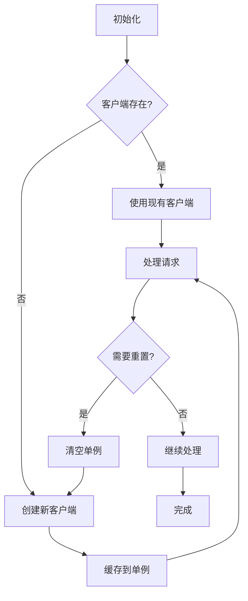

**图表来源** 
- [legado-ffi/http_state.rs](file://rust/legado-ffi/src/http_state.rs)

**章节来源**
- [legado-ffi/http_state.rs](file://rust/legado-ffi/src/http_state.rs)

### 探索功能API模块

**新增** 探索功能API模块提供了发现和管理网络源的能力，包含230行代码实现

- 源发现：自动扫描和发现可用的网络源
- 源验证：验证源的可用性和兼容性
- 源管理：启用、禁用、更新网络源
- 分类管理：支持源的分类和标签管理

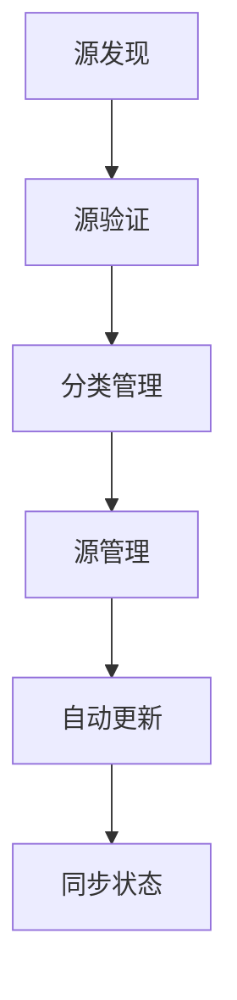

**图表来源** 
- [legado-ffi/explore_api.rs](file://rust/legado-ffi/src/api/explore_api.rs)

**章节来源**
- [legado-ffi/explore_api.rs](file://rust/legado-ffi/src/api/explore_api.rs)

### 自动任务API模块

**新增** 自动任务API模块实现了定时任务和自动化功能，包含268行代码

- 任务调度：支持cron表达式和定时触发
- 任务管理：创建、删除、暂停、恢复任务
- 任务监控：查看任务状态和执行历史
- 任务依赖：支持任务间的依赖关系

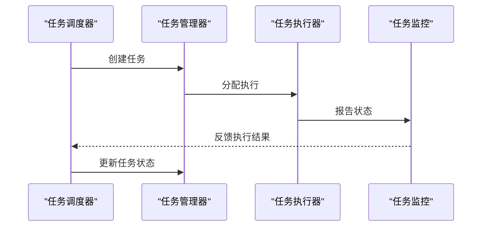

**图表来源** 
- [legado-ffi/auto_task_api.rs](file://rust/legado-ffi/src/api/auto_task_api.rs)

**章节来源**
- [legado-ffi/auto_task_api.rs](file://rust/legado-ffi/src/api/auto_task_api.rs)

### 源验证系统FFI接口

**新增** 源验证系统FFI接口提供了完整的书源验证功能，包含487行代码实现

- 单本校验：`check_source`函数支持搜索→详情→目录→正文四步验证
- 批量流式校验：`run_check_sources_stream`函数支持串行逐个回推进度
- 验证码检测：识别图片验证码、滑动验证、点击验证等反爬机制
- 重定向检测：检测登录页面重定向和跨域重定向
- 进度反馈：每完成一个书源即推送一条进度JSON

```mermaid
sequenceDiagram
participant Client as "客户端"
participant Bridge as "FFI桥接"
participant API as "源验证API"
participant Checker as "SourceChecker"
participant Net as "网络层"
Client->>Bridge : ffi_source_check_stream
Bridge->>API : run_check_sources_stream
API->>Checker : check_full(每个书源)
Checker->>Net : 执行搜索/目录/内容验证
Net-->>Checker : 返回验证结果
Checker-->>API : CheckResult
API-->>Bridge : CheckProgress JSON
Bridge-->>Client : 流式进度回调
```

**图表来源** 
- [legado-ffi/bridge.rs:278-343](file://rust/legado-ffi/src/bridge.rs#L278-L343)
- [legado-ffi/source_check_api.rs:131-211](file://rust/legado-ffi/src/api/source_check_api.rs#L131-L211)
- [legado-net/source_checker.rs:200-281](file://rust/legado-net/src/source_checker.rs#L200-L281)

**章节来源**
- [legado-ffi/bridge.rs](file://rust/legado-ffi/src/bridge.rs)
- [legado-ffi/source_check_api.rs](file://rust/legado-ffi/src/api/source_check_api.rs)
- [legado-net/source_checker.rs](file://rust/legado-net/src/source_checker.rs)

### 电子书格式支持（TXT/EPUB/MOBI/PDF）
- TXT：简单文本解析、目录识别、搜索优化
- EPUB：标准解析、元数据提取、章节导航
- MOBI/PDF：兼容性与性能优化

```mermaid
classDiagram
class TxtParser {
+parse(content)
+extractToc()
+search(query)
}
class EpubParser {
+parse(file)
+getMetadata()
+getChapters()
}
class MobiParser {
+parse(file)
+extractText()
}
class PdfParser {
+parse(file)
+extractPages()
}
```

**图表来源** 
- [legado-book/txt.rs](file://rust/legado-book/src/txt.rs)
- [legado-book/epub.rs](file://rust/legado-book/src/epub.rs)
- [legado-book/lib.rs](file://rust/legado-book/src/lib.rs)

**章节来源**
- [legado-book/lib.rs](file://rust/legado-book/src/lib.rs)
- [legado-book/txt.rs](file://rust/legado-book/src/txt.rs)
- [legado-book/epub.rs](file://rust/legado-book/src/epub.rs)

## 依赖关系分析
- 模块耦合：core依赖net/parser/db/js/book，ffi作为统一入口
- 外部依赖：SQLite、HTTP客户端、JS引擎、解析库
- 循环依赖：通过接口抽象避免直接循环引用

```mermaid
graph LR
Core["legado-core(含中文转换+正则安全)"] --> Net["legado-net(含QUIC,源验证,SOCKS5测试)"]
Core --> Parser["legado-parser"]
Core --> DB["legado-db(连接增强)"]
Core --> JS["legado-js"]
Core --> Book["legado-book(含归档处理)"]
FFI["legado-ffi(已重写)"] --> Core
FFI --> HTTPState["HTTP状态管理"]
FFI --> ExploreAPI["探索功能API"]
FFI --> AutoTaskAPI["自动任务API"]
FFI --> SourceCheckAPI["源验证API"]
FFI --> WebBookAPI["WebBook FFI API"]
Server["legado-server"] --> Core
```

**图表来源** 
- [Cargo.toml](file://rust/Cargo.toml)

**章节来源**
- [Cargo.toml](file://rust/Cargo.toml)

## 性能考量
- 异步模型：基于Tokio的事件驱动，非阻塞I/O，高并发处理
- 缓存策略：多级缓存（内存/磁盘），TTL与LRU结合，减少重复计算
- 索引优化：倒排索引、分词优化、增量更新
- 网络优化：连接池、重试退避、压缩传输、代理支持，**新增** 共享客户端单例和QUIC支持
- 解析优化：流式解析、懒加载、内存复用
- 数据库优化：迁移效率提升，v96版本优化了架构一致性检查，**新增** 连接健康检查
- **新增** FFI桥接性能优化，减少跨语言调用开销
- **新增** HTTP状态管理优化，避免重复创建连接池和TLS握手
- **新增** 源验证流式处理，支持批量校验和实时进度反馈
- **新增** 中文转换性能优化，使用静态映射表避免运行时查找开销
- **新增** 归档处理优化，流式解压和内存管理
- **新增** WebBook FFI API优化，支持JS书源编排器和规则书源双路径
- **重大增强** 正则表达式安全编译优化，全局缓存减少重复编译，8MB栈线程隔离避免主线程阻塞，非递归结构预检查零栈风险

## 故障排查指南
- 网络连接失败：检查代理、SSL配置、超时设置，**新增** 连接池状态检查和QUIC支持
- 解析异常：验证XPath/JSONPath表达式、HTML结构变化
- 数据库错误：确认Schema版本v96、Migration95To96迁移脚本、事务一致性，**新增** 连接池故障排查
- JS脚本错误：查看沙箱日志、API调用限制、内存泄漏
- FFI桥接问题：检查类型映射、错误码、异步回调，**新增** 重写后的桥接错误诊断
- **新增** HTTP状态管理问题：检查共享客户端初始化、并发访问、重置机制
- **新增** 探索功能API问题：检查网络源可达性、API响应格式
- **新增** 自动任务API问题：验证cron表达式、任务依赖关系、执行权限
- **新增** 源验证API问题：检查书源URL有效性、验证码检测、重定向处理、流式回调连接
- **新增** WebBook FFI API问题：检查AnalyzeUrl模板、规则配置、网络请求状态
- **新增** 中文转换问题：检查字符编码、映射表完整性、性能瓶颈
- **新增** 归档处理问题：验证压缩包格式、密码正确性、路径安全、权限设置
- **新增** SOCKS5代理问题：检查凭据配置、服务器可达性、协议兼容性
- **重大增强** 正则表达式问题：检查pattern长度是否超过1KB限制、嵌套深度是否超过32层、编译失败时的降级处理、Android logcat日志输出

**章节来源**
- [legado-net/middleware.rs](file://rust/legado-net/src/middleware.rs)
- [legado-parser/xpath.rs](file://rust/legado-parser/src/xpath.rs)
- [legado-db/connection.rs](file://rust/legado-db/src/connection.rs)
- [legado-db/migration.rs](file://rust/legado-db/src/migration.rs)
- [legado-js/source_engine.rs](file://rust/legado-js/src/source_engine.rs)
- [legado-ffi/bridge.rs](file://rust/legado-ffi/src/bridge.rs)
- [legado-ffi/http_state.rs](file://rust/legado-ffi/src/http_state.rs)
- [legado-ffi/web_book.rs](file://rust/legado-ffi/src/api/web_book.rs)
- [legado-ffi/explore_api.rs](file://rust/legado-ffi/src/api/explore_api.rs)
- [legado-ffi/auto_task_api.rs](file://rust/legado-ffi/src/api/auto_task_api.rs)
- [legado-ffi/source_check_api.rs](file://rust/legado-ffi/src/api/source_check_api.rs)
- [legado-core/chinese_convert.rs](file://rust/legado-core/src/chinese_convert.rs)
- [legado-core/regex_safe.rs](file://rust/legado-core/src/regex_safe.rs)
- [legado-book/archive.rs](file://rust/legado-book/src/archive.rs)
- [legado-net/socks5_e2e.rs](file://rust/legado-net/src/socks5_e2e.rs)

## 结论
Rust核心库通过清晰的模块划分与异步架构，提供了高性能、可扩展的阅读解决方案。最新的重大增强包括Phase 1-4迁移完成、FFI桥接完全重写、HTTP状态管理优化、QUIC协议支持、探索功能和自动任务API模块的引入。**最新增强的中文转换功能**提供了简繁中文互转能力，**归档处理增强**支持多种压缩格式，**SOCKS5代理测试框架**确保了代理功能的可靠性。**最新增强的源验证系统FFI接口**和**WebBook FFI API**提供了完整的书源验证和内容获取功能，支持流式验证操作处理和实时进度反馈。**重大安全改进**：实现了全面的正则表达式安全编译系统，通过三层防护策略（长度限制、嵌套深度限制、负缓存）有效防止病态正则表达式导致的栈溢出和崩溃问题，新增的非递归结构预检查函数max_nesting_depth()提供零栈风险的嵌套深度检测，改进的LRU缓存系统避免了内存膨胀，增强的日志记录和Android集成确保了可观测性。当前进度显示168个原子任务全部完成，Rust完成率修订为96-97%，测试覆盖率显著提升。这些更新确保了v96版本的稳定性和向后兼容性，同时为开发者提供了更强大的API接口来扩展新书籍格式与网络源规则。基于重写的FFI桥接、新增的HTTP状态管理和API模块，以及全面增强的正则表达式安全编译系统，开发者可以更方便地实现复杂的业务逻辑，同时利用现有的接口与Flutter/Android平台无缝集成。

## 附录
- API使用示例：参考FRB生成的接口定义与Flutter调用方式
- 扩展开发指南：
  - 添加新书籍格式：实现解析器接口，注册到格式层
  - 新增网络源规则：编写JS脚本，定义规则字段与查询逻辑
  - 自定义中间件：实现网络中间件接口，注入请求处理逻辑
  - 数据库迁移：遵循版本控制，确保迁移脚本的正确性
  - **新增** 探索功能扩展：实现新的源发现和验证逻辑
  - **新增** 自动任务扩展：开发自定义任务类型和调度逻辑
  - **新增** 源验证扩展：实现自定义验证码检测和重定向处理逻辑
  - **新增** WebBook FFI扩展：实现新的内容获取逻辑和分页处理
  - **新增** FFI接口扩展：基于重写后的桥接框架添加新API
  - **新增** HTTP状态管理扩展：自定义客户端配置和重置策略
  - **新增** QUIC支持扩展：配置QUIC参数和降级策略
  - **新增** 中文转换扩展：扩展字符映射表，支持更多字符集
  - **新增** 归档处理扩展：添加新的压缩格式支持，实现安全解压机制
  - **新增** SOCKS5代理扩展：实现其他代理协议支持，增强认证机制
  - **重大增强** 正则表达式扩展：实现自定义的正则表达式编译策略，注意遵循安全编译规范，使用统一安全入口避免栈溢出风险

**章节来源**
- [MIGRATION_WORKFLOW.md](file://rust/MIGRATION_WORKFLOW.md)
- [PROGRESS.md](file://rust/PROGRESS.md)