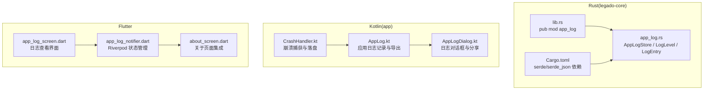
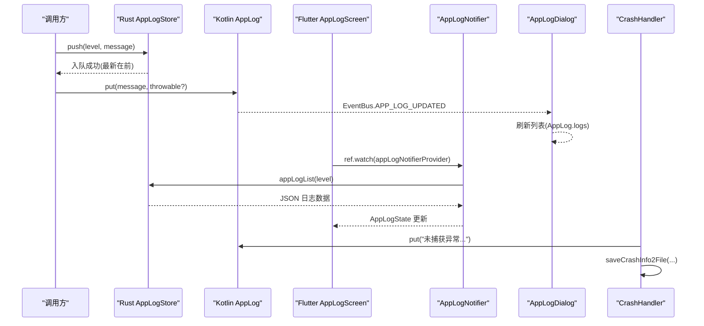
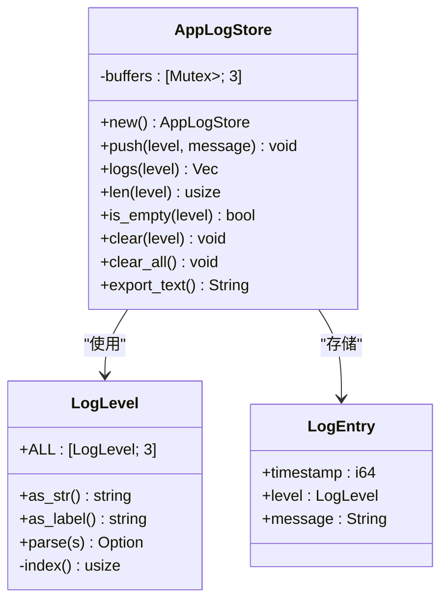
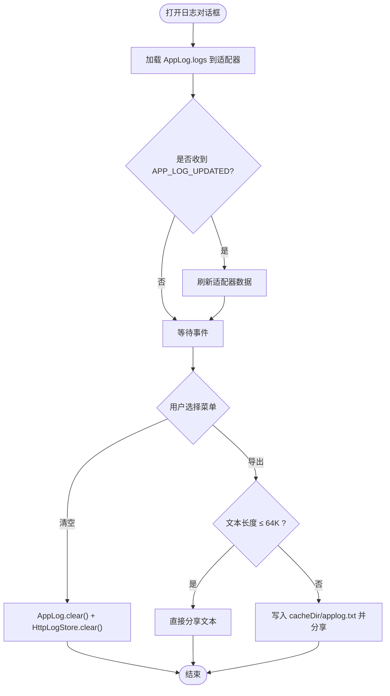
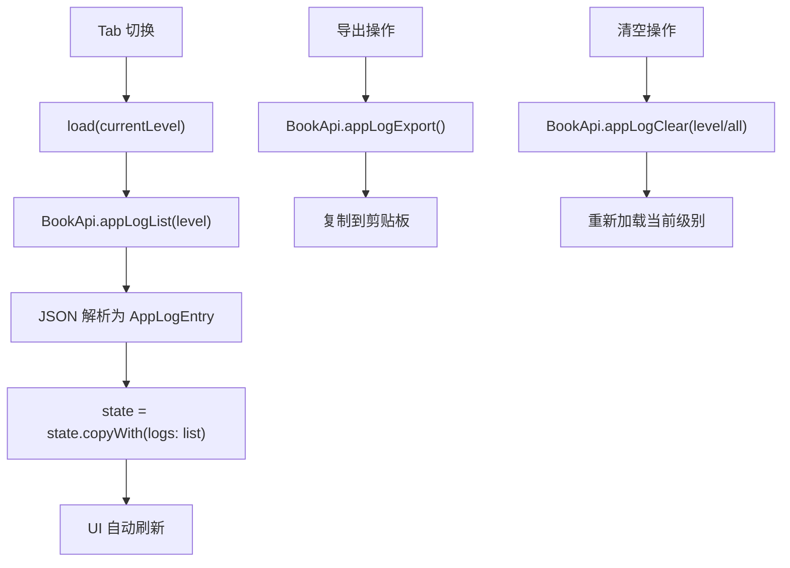
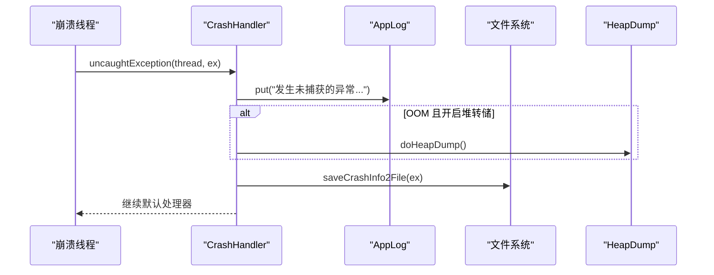
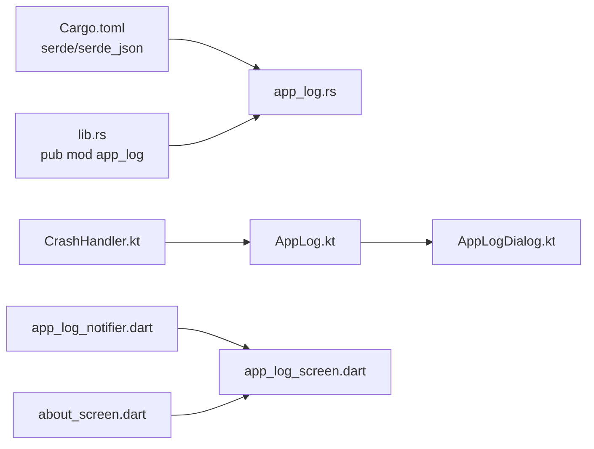

# 应用日志系统

<cite>
**本文引用的文件**   
- [app_log.rs](file://rust/legado-core/src/app_log.rs)
- [lib.rs](file://rust/legado-core/src/lib.rs)
- [AppLog.kt](file://app/src/main/java/io/legado/app/constant/AppLog.kt)
- [CrashHandler.kt](file://app/src/main/java/io/legado/app/help/CrashHandler.kt)
- [AppLogDialog.kt](file://app/src/main/java/io/legado/app/ui/about/AppLogDialog.kt)
- [Cargo.toml](file://rust/legado-core/Cargo.toml)
- [app_log_screen.dart](file://flutter_legado\lib\src\screens\app_log_screen.dart)
- [app_log_notifier.dart](file://flutter_legado\lib\src\providers\app_log\app_log_notifier.dart)
- [about_screen.dart](file://flutter_legado\lib\src\screens\about_screen.dart)
</cite>

## 更新摘要
**所做更改**   
- 新增 Flutter 端日志系统集成 Riverpod 状态管理
- 新增 app_log_screen.dart UI 实现，支持三级日志查看
- 增强 About 屏幕集成，添加应用日志入口
- 更新架构图以反映 Flutter 层与 Rust/Kotlin 层的交互

## 目录
1. [简介](#简介)
2. [项目结构](#项目结构)
3. [核心组件](#核心组件)
4. [架构总览](#架构总览)
5. [详细组件分析](#详细组件分析)
6. [依赖分析](#依赖分析)
7. [性能考量](#性能考量)
8. [故障排查指南](#故障排查指南)
9. [结论](#结论)
10. [附录](#附录)

## 简介
本文件系统性梳理 Legado 项目的"应用日志系统"，覆盖 Kotlin 侧、Rust 侧与 Flutter 端的实现、数据流、导出机制以及与崩溃捕获的集成。Rust 侧提供进程级三级日志缓冲（消息/崩溃/HTTP），线程安全环形缓冲，统一时间戳格式与文本导出；Kotlin 侧负责 UI 展示、事件驱动刷新、导出分享以及崩溃日志落盘；Flutter 端通过 Riverpod 状态管理与 FFI 桥接，提供现代化的跨平台日志查看界面。三者在语义上对齐：最新条目在前、容量上限、导出截断策略等保持一致。

## 项目结构
- Rust 层位于 legado-core crate，暴露 app_log 模块，提供 AppLogStore、LogLevel、LogEntry 及全局单例访问。
- Kotlin 层包含应用日志记录、UI 展示、HTTP 日志存储与崩溃处理。
- Flutter 层通过 Riverpod 状态管理和 FFI 桥接，提供跨平台的日志查看界面。

**图示来源** 
- [lib.rs:24-28](file://rust/legado-core/src/lib.rs#L24-L28)
- [Cargo.toml:6-8](file://rust/legado-core/Cargo.toml#L6-L8)
- [AppLog.kt:14-86](file://app/src/main/java/io/legado/app/constant/AppLog.kt#L14-L86)
- [AppLogDialog.kt:34-139](file://app/src/main/java/io/legado/app/ui/about/AppLogDialog.kt#L34-L139)
- [CrashHandler.kt:35-191](file://app/src/main/java/io/legado/app/help/CrashHandler.kt#L35-L191)
- [app_log_screen.dart:12-221](file://flutter_legado\lib\src\screens\app_log_screen.dart#L12-L221)
- [app_log_notifier.dart:20-101](file://flutter_legado\lib\src\providers\app_log\app_log_notifier.dart#L20-L101)
- [about_screen.dart:291-298](file://flutter_legado\lib\src\screens\about_screen.dart#L291-L298)

**章节来源**
- [lib.rs:24-28](file://rust/legado-core/src/lib.rs#L24-L28)
- [Cargo.toml:6-8](file://rust/legado-core/Cargo.toml#L6-L8)

## 核心组件
- Rust 端
  - LogLevel：定义 message/crash/http 三个级别，支持解析与标签输出。
  - LogEntry：包含 timestamp、level、message，用于 JSON 序列化与导出。
  - AppLogStore：三级独立环形缓冲，push/logs/clear/export_text 等方法，线程安全。
  - 全局单例：OnceLock<AppLogStore>，通过 app_log_store() 获取便捷函数 push_log/get_logs/export_logs。
- Kotlin 端
  - AppLog：内存日志列表（最新在前）、put/putNotSave/clear/exportText、EventBus 事件推送。
  - AppLogDialog：监听 APP_LOG_UPDATED 事件刷新 UI，支持清空与导出（超过 64K 字符时写文件分享）。
  - CrashHandler：未捕获异常处理，写入崩溃日志到备份路径与外部缓存，并可选堆转储。
- Flutter 端
  - AppLogScreen：基于 ConsumerStatefulWidget 的日志查看界面，支持 TabBar 切换三级日志。
  - AppLogNotifier：Riverpod Notifier，封装 BookApi.appLog* 方法调用，管理 AppLogState。
  - AboutScreen：集成应用日志入口，导航至 AppLogScreen。

**章节来源**
- [app_log.rs:34-101](file://rust/legado-core/src/app_log.rs#L34-L101)
- [app_log.rs:107-230](file://rust/legado-core/src/app_log.rs#L107-L230)
- [AppLog.kt:14-86](file://app/src/main/java/io/legado/app/constant/AppLog.kt#L14-L86)
- [AppLogDialog.kt:34-139](file://app/src/main/java/io/legado/app/ui/about/AppLogDialog.kt#L34-L139)
- [CrashHandler.kt:35-191](file://app/src/main/java/io/legado/app/help/CrashHandler.kt#L35-L191)
- [app_log_screen.dart:12-221](file://flutter_legado\lib\src\screens\app_log_screen.dart#L12-L221)
- [app_log_notifier.dart:20-101](file://flutter_legado\lib\src\providers\app_log\app_log_notifier.dart#L20-L101)
- [about_screen.dart:291-298](file://flutter_legado\lib\src\screens\about_screen.dart#L291-L298)

## 架构总览
Rust 侧作为底层日志缓冲与导出引擎，Kotlin 侧负责上层记录、UI 展示与崩溃处理，Flutter 侧通过 FFI 桥接提供跨平台日志查看界面。三者通过一致的语义（级别、顺序、容量、导出格式）保持对齐。

**图示来源** 
- [app_log.rs:127-139](file://rust/legado-core/src/app_log.rs#L127-L139)
- [AppLog.kt:22-41](file://app/src/main/java/io/legado/app/constant/AppLog.kt#L22-L41)
- [AppLogDialog.kt:61-63](file://app/src/main/java/io/legado/app/ui/about/AppLogDialog.kt#L61-L63)
- [CrashHandler.kt:50-86](file://app/src/main/java/io/legado/app/help/CrashHandler.kt#L50-L86)
- [app_log_screen.dart:107-108](file://flutter_legado\lib\src\screens\app_log_screen.dart#L107-L108)
- [app_log_notifier.dart:28-45](file://flutter_legado\lib\src\providers\app_log\app_log_notifier.dart#L28-L45)

## 详细组件分析

### Rust 应用日志子系统（AppLogStore）
- 数据结构
  - LogLevel：枚举，含 ALL 常量与 as_str/as_label/parse/index 方法。
  - LogEntry：timestamp(i64)、level(LogLevel)、message(String)，支持 serde。
  - AppLogStore：[Mutex<VecDeque<LogEntry>>; 3]，每级独立缓冲，队首为最新。
- 关键行为
  - push：构造 LogEntry，按容量环形淘汰最旧条目，插入队首。
  - logs/clear/clear_all：读取、清空指定或全部级别。
  - export_text：合并三级日志，按时间升序格式化，超过 64_000 字符按边界截断并追加标记。
  - 全局单例：OnceLock<AppLogStore>，便捷函数 push_log/get_logs/export_logs。
- 时间戳与格式化
  - now_millis：Unix 毫秒。
  - format_timestamp_ms：UTC 格式 yyyy-MM-dd HH:mm:ss.SSS，无外部依赖。
  - truncate_chars：按字符边界截断，保证不超限。

**图示来源** 
- [app_log.rs:34-101](file://rust/legado-core/src/app_log.rs#L34-L101)
- [app_log.rs:107-196](file://rust/legado-core/src/app_log.rs#L107-L196)

**章节来源**
- [app_log.rs:23-230](file://rust/legado-core/src/app_log.rs#L23-L230)

### Kotlin 应用日志与 UI（AppLog 与 AppLogDialog）
- AppLog
  - 内存列表 mLogs：Triple<Long, String, Throwable?>，最新在前，上限 100 条。
  - put/putNotSave：记录日志、可选 toast、EventBus 推送 APP_LOG_UPDATED。
  - clear/exportText：清空与导出文本（时间格式 yyyy-MM-dd HH:mm:ss.SSS）。
- AppLogDialog
  - 监听 APP_LOG_UPDATED 刷新 RecyclerView。
  - 菜单操作：清空（同时清空 HttpLogStore）、导出（≤64K 直接分享，>64K 写文件分享）。
  - 点击条目：若包含 HTTP ID 则显示 HTTP 详情，否则显示异常堆栈。

**图示来源** 
- [AppLog.kt:14-86](file://app/src/main/java/io/legado/app/constant/AppLog.kt#L14-L86)
- [AppLogDialog.kt:61-99](file://app/src/main/java/io/legado/app/ui/about/AppLogDialog.kt#L61-L99)

**章节来源**
- [AppLog.kt:14-86](file://app/src/main/java/io/legado/app/constant/AppLog.kt#L14-L86)
- [AppLogDialog.kt:34-139](file://app/src/main/java/io/legado/app/ui/about/AppLogDialog.kt#L34-L139)

### Flutter 应用日志界面（AppLogScreen 与 AppLogNotifier）
- AppLogScreen
  - ConsumerStatefulWidget，使用 TabBar 展示 message/crash/http 三级日志。
  - 支持刷新、清空当前级别、清空全部、导出到剪贴板等操作。
  - 响应式 UI，通过 ref.watch 订阅 AppLogState 变化。
- AppLogNotifier
  - Riverpod Notifier，管理 AppLogState（isLoading、error、logs、currentLevel）。
  - 封装 BookApi.appLogList/clear/clearAll/export 方法调用。
  - JSON 解析与错误处理，返回类型化的 AppLogEntry 列表。
- AboutScreen 集成
  - 在"更多"区域添加"应用日志"入口，导航至 AppLogScreen。
  - 与 Android 原版 AppLogDialog 功能对齐。

**图示来源** 
- [app_log_screen.dart:40-45](file://flutter_legado\lib\src\screens\app_log_screen.dart#L40-L45)
- [app_log_notifier.dart:28-45](file://flutter_legado\lib\src\providers\app_log\app_log_notifier.dart#L28-L45)
- [about_screen.dart:291-298](file://flutter_legado\lib\src\screens\about_screen.dart#L291-L298)

**章节来源**
- [app_log_screen.dart:12-221](file://flutter_legado\lib\src\screens\app_log_screen.dart#L12-L221)
- [app_log_notifier.dart:20-101](file://flutter_legado\lib\src\providers\app_log\app_log_notifier.dart#L20-L101)
- [about_screen.dart:291-298](file://flutter_legado\lib\src\screens\about_screen.dart#L291-L298)

### 崩溃处理（CrashHandler）
- 设置默认 UncaughtExceptionHandler。
- uncaughtException：记录到 AppLog，必要时进行堆转储，保存崩溃日志到备份路径与外部缓存，清理过期文件。
- 参数收集：设备信息、WebView UA、包名、版本、堆大小等。

**图示来源** 
- [CrashHandler.kt:50-86](file://app/src/main/java/io/legado/app/help/CrashHandler.kt#L50-86)
- [CrashHandler.kt:126-168](file://app/src/main/java/io/legado/app/help/CrashHandler.kt#L126-L168)

**章节来源**
- [CrashHandler.kt:35-191](file://app/src/main/java/io/legado/app/help/CrashHandler.kt#L35-L191)

## 依赖分析
- Rust 依赖
  - serde/serde_json：LogEntry 的序列化/反序列化。
  - tokio/tokio-util：同步与运行时能力（当前日志模块主要用 sync/time）。
  - Cargo.toml 声明了必要的依赖项。
- Kotlin 依赖
  - Android SDK、EventBus、LogUtils、FileUtils 等用于日志记录、事件分发与文件操作。
- Flutter 依赖
  - flutter_riverpod：状态管理。
  - flutter/services：剪贴板操作。
  - FFI 桥接：与 Rust 层通信。

**图示来源** 
- [Cargo.toml:6-8](file://rust/legado-core/Cargo.toml#L6-L8)
- [lib.rs:24-28](file://rust/legado-core/src/lib.rs#L24-L28)
- [AppLog.kt:14-86](file://app/src/main/java/io/legado/app/constant/AppLog.kt#L14-L86)
- [AppLogDialog.kt:34-139](file://app/src/main/java/io/legado/app/ui/about/AppLogDialog.kt#L34-L139)
- [CrashHandler.kt:35-191](file://app/src/main/java/io/legado/app/help/CrashHandler.kt#L35-L191)
- [app_log_notifier.dart:20-101](file://flutter_legado\lib\src\providers\app_log\app_log_notifier.dart#L20-L101)
- [app_log_screen.dart:12-221](file://flutter_legado\lib\src\screens\app_log_screen.dart#L12-L221)
- [about_screen.dart:291-298](file://flutter_legado\lib\src\screens\about_screen.dart#L291-L298)

**章节来源**
- [Cargo.toml:6-8](file://rust/legado-core/Cargo.toml#L6-L8)
- [lib.rs:24-28](file://rust/legado-core/src/lib.rs#L24-L28)

## 性能考量
- Rust 端
  - 每级容量 MAX_LOGS_PER_LEVEL=500，环形缓冲避免频繁扩容与拷贝。
  - 导出前合并排序，时间复杂度 O(N log N)，N 为总条目数；实际受限于 64K 字符截断。
  - 并发安全：Mutex 保护每个级别的 VecDeque，测试覆盖多生产者场景。
- Kotlin 端
  - 内存上限 100 条，适合短时调试与 UI 展示。
  - 导出文本超过 64K 时写文件再分享，避免内存峰值。
  - 崩溃日志落盘与过期清理，控制磁盘占用。
- Flutter 端
  - Riverpod 状态管理，响应式 UI 更新，避免不必要的重建。
  - JSON 解析在本层完成，UI 层仅消费类型化的 AppLogEntry。
  - 剪贴板操作异步执行，避免阻塞主线程。

## 故障排查指南
- 日志未显示
  - 检查是否触发 APP_LOG_UPDATED 事件（Kotlin 侧 postEvent）。
  - 确认 AppLogDialog 已订阅该事件并刷新适配器。
  - 检查 Flutter 端 AppLogNotifier 是否正确调用 BookApi.appLogList。
- 导出为空或过短
  - 确认是否有有效日志条目；超过 64K 会截断并追加标记。
  - 检查 Flutter 端导出逻辑是否正确复制剪贴板。
- 崩溃日志未生成
  - 检查备份路径配置是否正确；查看外部缓存 crash 目录是否存在与权限。
  - 若 OOM 且开启堆转储，确认 heapDump 目录可写。
- Flutter 界面问题
  - 检查 Riverpod Provider 是否正确注册。
  - 确认 FFI 桥接是否正常连接 Rust 层。

**章节来源**
- [AppLog.kt:22-41](file://app/src/main/java/io/legado/app/constant/AppLog.kt#L22-L41)
- [AppLogDialog.kt:61-99](file://app/src/main/java/io/legado/app/ui/about/AppLogDialog.kt#L61-L99)
- [CrashHandler.kt:126-168](file://app/src/main/java/io/legado/app/help/CrashHandler.kt#L126-L168)
- [app_log_notifier.dart:28-45](file://flutter_legado\lib\src\providers\app_log\app_log_notifier.dart#L28-L45)

## 结论
Legado 的应用日志系统在 Kotlin、Rust 与 Flutter 三侧实现了语义一致、性能可控、易于扩展的日志记录与导出机制。Rust 侧提供稳定的进程级缓冲与导出能力，Kotlin 侧负责交互与崩溃处理，Flutter 侧通过 Riverpod 状态管理提供现代化的跨平台日志查看界面。通过统一的级别、顺序与导出策略，开发者可在不同平台间无缝协作，提升问题定位效率。

## 附录
- 术语说明
  - 环形缓冲：固定容量的队列，超出容量时淘汰最旧元素。
  - 事件总线：跨组件通信机制，此处用于日志更新通知。
  - Riverpod：Flutter 状态管理库，提供响应式状态管理。
  - FFI：Foreign Function Interface，用于跨语言调用。
- 相关常量
  - MAX_LOGS_PER_LEVEL=500（Rust 每级容量）
  - MAX_EXPORT_CHARS=64_000（导出文本上限）
  - Kotlin 内存上限 100 条
  - Flutter 日志级别：message/crash/http