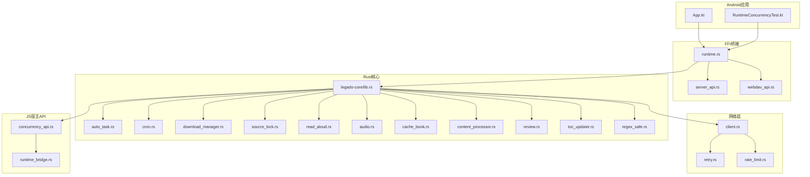
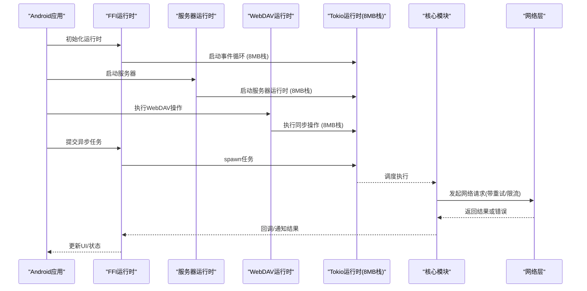
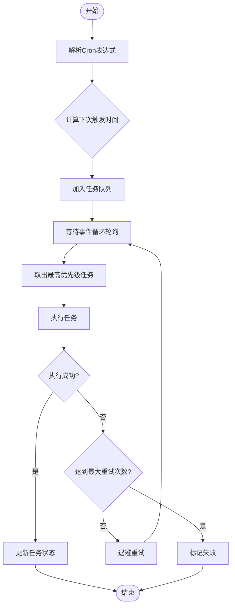
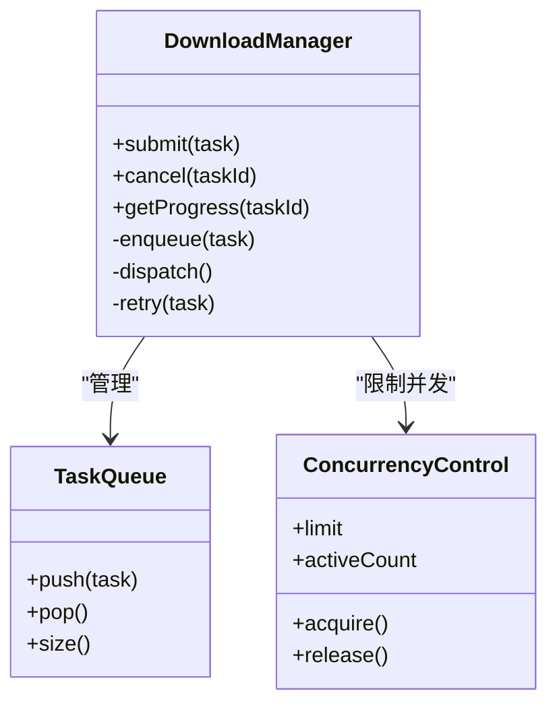
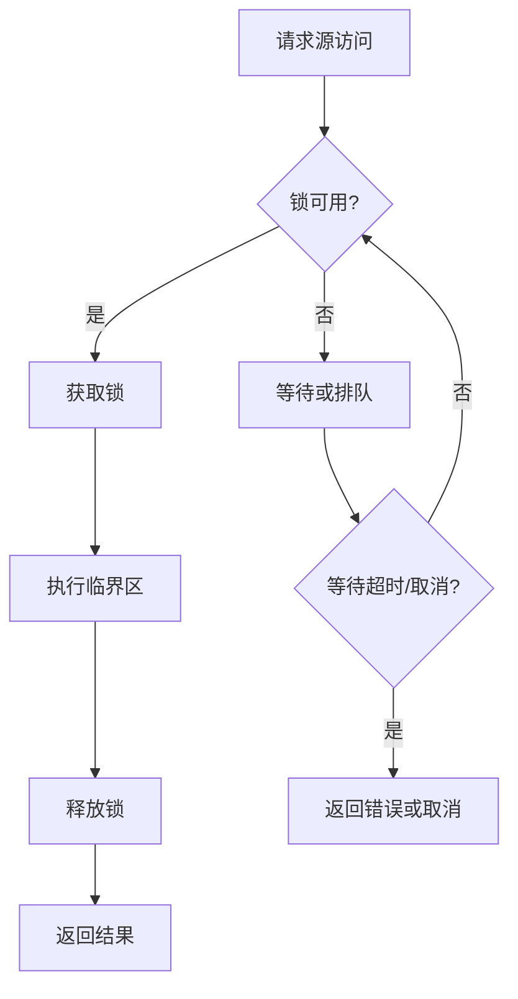
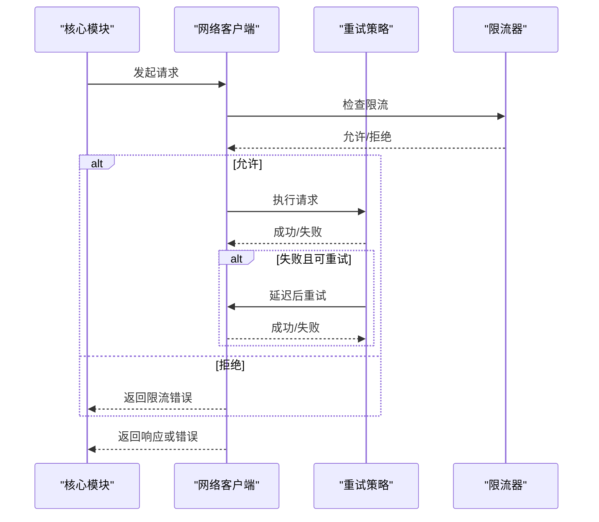
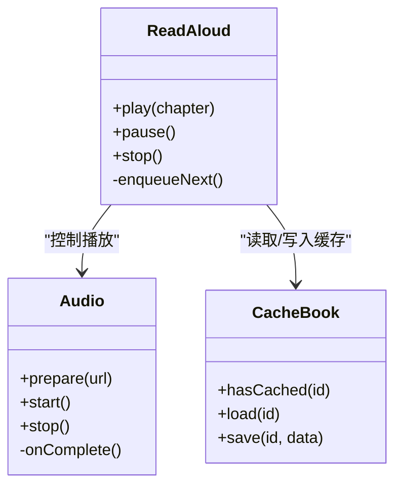
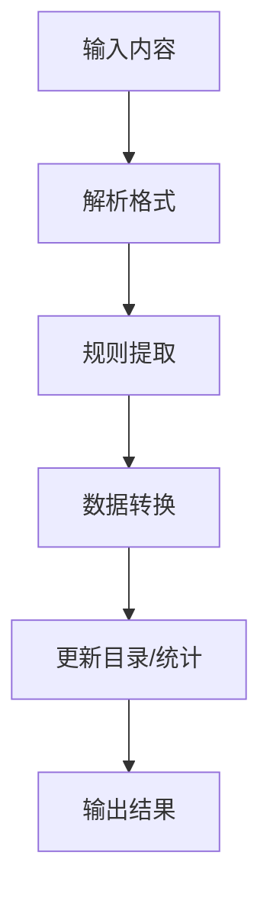
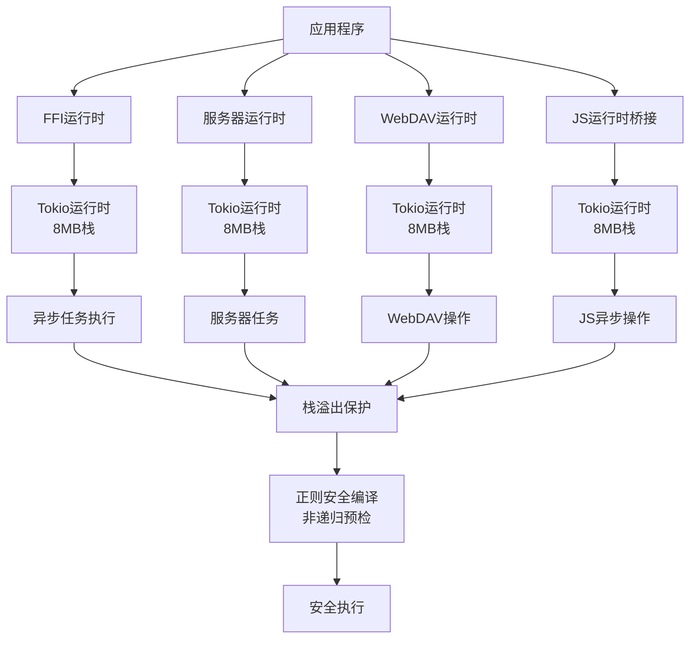
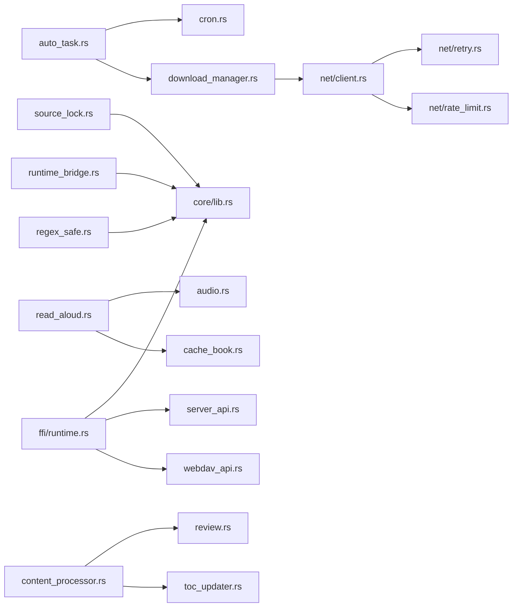

# 异步并发

<cite>
**本文引用的文件**   
- [rust/legado-core/src/lib.rs](file://rust/legado-core/src/lib.rs)
- [rust/legado-core/src/auto_task.rs](file://rust/legado-core/src/auto_task.rs)
- [rust/legado-core/src/cron.rs](file://rust/legado-core/src/cron.rs)
- [rust/legado-core/src/download_manager.rs](file://rust/legado-core/src/download_manager.rs)
- [rust/legado-core/src/source_lock.rs](file://rust/legado-core/src/source_lock.rs)
- [rust/legado-core/src/read_aloud.rs](file://rust/legado-core/src/read_aloud.rs)
- [rust/legado-core/src/audio.rs](file://rust/legado-core/src/audio.rs)
- [rust/legado-core/src/cache_book.rs](file://rust/legado-core/src/cache_book.rs)
- [rust/legado-core/src/content_processor.rs](file://rust/legado-core/src/content_processor.rs)
- [rust/legado-core/src/review.rs](file://rust/legado-core/src/review.rs)
- [rust/legado-core/src/toc_updater.rs](file://rust/legado-core/src/toc_updater.rs)
- [rust/legado-core/src/regex_safe.rs](file://rust/legado-core/src/regex_safe.rs)
- [rust/legado-net/src/client.rs](file://rust/legado-net/src/client.rs)
- [rust/legado-net/src/retry.rs](file://rust/legado-net/src/retry.rs)
- [rust/legado-net/src/rate_limit.rs](file://rust/legado-net/src/rate_limit.rs)
- [rust/legado-js/src/host_api/concurrency_api.rs](file://rust/legado-js/src/host_api/concurrency_api.rs)
- [rust/legado-js/src/host_api/runtime_bridge.rs](file://rust/legado-js/src/host_api/runtime_bridge.rs)
- [rust/legado-ffi/src/runtime.rs](file://rust/legado-ffi/src/runtime.rs)
- [rust/legado-ffi/src/api/server_api.rs](file://rust/legado-ffi/src/api/server_api.rs)
- [rust/legado-ffi/src/api/webdav_api.rs](file://rust/legado-ffi/src/api/webdav_api.rs)
- [app/src/main/java/io/legado/app/App.kt](file://app/src/main/java/io/legado/app/App.kt)
- [app/src/test/java/io/legado/app/RuntimeConcurrencyTest.kt](file://app/src/test/java/io/legado/app/RuntimeConcurrencyTest.kt)
</cite>

## 更新摘要
**所做更改**
- 更新了Tokio运行时配置部分，反映全局工作线程栈大小从默认~2MB增加到8MB的变更
- 新增运行时配置优化章节，详细说明栈大小调整的原因和效果
- 更新了内存管理和性能考量部分，包含新的栈溢出保护机制
- 增强了故障排查指南，包含栈溢出相关的调试方法

## 目录
1. [简介](#简介)
2. [项目结构](#项目结构)
3. [核心组件](#核心组件)
4. [架构总览](#架构总览)
5. [详细组件分析](#详细组件分析)
6. [依赖关系分析](#依赖关系分析)
7. [性能考量](#性能考量)
8. [故障排查指南](#故障排查指南)
9. [结论](#结论)
10. [附录](#附录)

## 简介
本文件面向Legado项目中与"异步并发处理"相关的实现，重点围绕以下主题展开：
- Tokio异步运行时的工作原理（任务调度、事件循环、资源共享）
- 并发控制机制（互斥锁、原子操作、条件变量）
- 异步任务管理（任务创建、取消机制、优先级调度）
- 定时任务与调度器（Cron表达式解析、任务队列、重试策略）
- 并发编程最佳实践（死锁避免、内存泄漏防护、性能监控）
- 具体代码示例路径与调试方法

本项目采用Rust作为核心后端语言，结合Kotlin/Android前端。异步并发主要由Rust侧的Tokio运行时驱动，并通过FFI暴露给上层应用使用。

**最新更新**：Tokio运行时已进行重要配置优化，将全局工作线程栈大小从默认的约2MB增加到8MB，与JVM线程栈水位对齐，提供更好的栈溢出保护，同时保持了非递归预检查系统作为主要防御机制。

## 项目结构
从仓库结构看，与异步并发相关的关键代码集中在Rust模块中：
- legado-core：核心业务逻辑与并发原语（自动任务、下载管理、音频播放、缓存、内容处理等）
- legado-net：网络客户端、重试、限流等并发相关能力
- legado-js：JS引擎宿主API中的并发接口
- legado-ffi：FFI桥接层，负责将Rust运行时暴露给Kotlin/Android
- app：Android应用入口与测试用例，验证运行时并发行为

**图表来源**
- [rust/legado-core/src/lib.rs](file://rust/legado-core/src/lib.rs)
- [rust/legado-core/src/auto_task.rs](file://rust/legado-core/src/auto_task.rs)
- [rust/legado-core/src/cron.rs](file://rust/legado-core/src/cron.rs)
- [rust/legado-core/src/download_manager.rs](file://rust/legado-core/src/download_manager.rs)
- [rust/legado-core/src/source_lock.rs](file://rust/legado-core/src/source_lock.rs)
- [rust/legado-core/src/read_aloud.rs](file://rust/legado-core/src/read_aloud.rs)
- [rust/legado-core/src/audio.rs](file://rust/legado-core/src/audio.rs)
- [rust/legado-core/src/cache_book.rs](file://rust/legado-core/src/cache_book.rs)
- [rust/legado-core/src/content_processor.rs](file://rust/legado-core/src/content_processor.rs)
- [rust/legado-core/src/review.rs](file://rust/legado-core/src/review.rs)
- [rust/legado-core/src/toc_updater.rs](file://rust/legado-core/src/toc_updater.rs)
- [rust/legado-core/src/regex_safe.rs](file://rust/legado-core/src/regex_safe.rs)
- [rust/legado-net/src/client.rs](file://rust/legado-net/src/client.rs)
- [rust/legado-net/src/retry.rs](file://rust/legado-net/src/retry.rs)
- [rust/legado-net/src/rate_limit.rs](file://rust/legado-net/src/rate_limit.rs)
- [rust/legado-js/src/host_api/concurrency_api.rs](file://rust/legado-js/src/host_api/concurrency_api.rs)
- [rust/legado-js/src/host_api/runtime_bridge.rs](file://rust/legado-js/src/host_api/runtime_bridge.rs)
- [rust/legado-ffi/src/runtime.rs](file://rust/legado-ffi/src/runtime.rs)
- [rust/legado-ffi/src/api/server_api.rs](file://rust/legado-ffi/src/api/server_api.rs)
- [rust/legado-ffi/src/api/webdav_api.rs](file://rust/legado-ffi/src/api/webdav_api.rs)
- [app/src/main/java/io/legado/app/App.kt](file://app/src/main/java/io/legado/app/App.kt)
- [app/src/test/java/io/legado/app/RuntimeConcurrencyTest.kt](file://app/src/test/java/io/legado/app/RuntimeConcurrencyTest.kt)

**章节来源**
- [app/src/main/java/io/legado/app/App.kt](file://app/src/main/java/io/legado/app/App.kt)
- [rust/legado-ffi/src/runtime.rs](file://rust/legado-ffi/src/runtime.rs)
- [rust/legado-core/src/lib.rs](file://rust/legado-core/src/lib.rs)

## 核心组件
- 异步运行时与任务调度：由FFI层初始化并暴露Tokio运行时，供上层调用；核心模块通过Tokio执行异步任务，利用事件循环进行IO多路复用与任务切换。
- 并发控制：在源访问、资源竞争场景中使用互斥锁保护共享状态；在网络请求与计数场景中采用原子操作；在需要等待外部信号的场景使用条件变量或类似机制。
- 异步任务管理：自动任务与下载管理器负责任务的创建、生命周期管理与取消；支持基于优先级的调度策略。
- 定时任务与调度器：Cron表达式解析用于周期性任务触发；任务队列承载待执行任务；重试策略保障网络与IO操作的健壮性。
- 资源共享：音频播放、缓存、内容处理等模块以共享状态形式存在，需配合并发原语保证一致性。

**最新更新**：所有Tokio运行时实例现已统一配置为8MB工作线程栈大小，与JVM线程栈水位对齐，提供增强的栈溢出保护。

**章节来源**
- [rust/legado-core/src/auto_task.rs](file://rust/legado-core/src/auto_task.rs)
- [rust/legado-core/src/download_manager.rs](file://rust/legado-core/src/download_manager.rs)
- [rust/legado-core/src/source_lock.rs](file://rust/legado-core/src/source_lock.rs)
- [rust/legado-core/src/cron.rs](file://rust/legado-core/src/cron.rs)
- [rust/legado-net/src/retry.rs](file://rust/legado-net/src/retry.rs)
- [rust/legado-net/src/rate_limit.rs](file://rust/legado-net/src/rate_limit.rs)

## 架构总览
下图展示了从Android应用到Rust异步运行时的整体流程，包括任务调度、事件循环与资源共享的关键交互点。

**图表来源**
- [rust/legado-ffi/src/runtime.rs](file://rust/legado-ffi/src/runtime.rs)
- [rust/legado-ffi/src/api/server_api.rs](file://rust/legado-ffi/src/api/server_api.rs)
- [rust/legado-ffi/src/api/webdav_api.rs](file://rust/legado-ffi/src/api/webdav_api.rs)
- [rust/legado-core/src/lib.rs](file://rust/legado-core/src/lib.rs)
- [rust/legado-net/src/client.rs](file://rust/legado-net/src/client.rs)
- [rust/legado-net/src/retry.rs](file://rust/legado-net/src/retry.rs)
- [rust/legado-net/src/rate_limit.rs](file://rust/legado-net/src/rate_limit.rs)

## 详细组件分析

### 组件A：自动任务与调度器（AutoTask + Cron）
- 功能概述：定义可配置的任务规则，解析Cron表达式生成触发时间，维护任务队列与执行状态，支持重试与取消。
- 关键流程：
  - 解析Cron表达式，计算下一次触发时间
  - 将任务加入调度队列
  - 事件循环按优先级取出任务执行
  - 失败时按策略重试，成功则更新状态
- 并发要点：
  - 任务队列需线程安全访问（互斥锁）
  - 触发时间与状态更新使用原子操作
  - 取消信号通过通道或标志位传递

**图表来源**
- [rust/legado-core/src/auto_task.rs](file://rust/legado-core/src/auto_task.rs)
- [rust/legado-core/src/cron.rs](file://rust/legado-core/src/cron.rs)

**章节来源**
- [rust/legado-core/src/auto_task.rs](file://rust/legado-core/src/auto_task.rs)
- [rust/legado-core/src/cron.rs](file://rust/legado-core/src/cron.rs)

### 组件B：下载管理器（DownloadManager）
- 功能概述：管理并发下载任务，限制并发度，处理断点续传、重试与取消。
- 关键流程：
  - 接收下载请求，分配任务ID
  - 根据并发策略入队
  - 事件循环调度执行，支持暂停/恢复
  - 失败重试与最终状态上报
- 并发要点：
  - 使用互斥锁保护下载列表与进度
  - 原子计数器跟踪活跃任务数
  - 取消通过任务句柄或通道信号

**图表来源**
- [rust/legado-core/src/download_manager.rs](file://rust/legado-core/src/download_manager.rs)

**章节来源**
- [rust/legado-core/src/download_manager.rs](file://rust/legado-core/src/download_manager.rs)

### 组件C：源访问锁（SourceLock）
- 功能概述：对源访问进行互斥保护，避免并发读写导致的数据不一致。
- 关键流程：
  - 获取锁前检查是否已被占用
  - 持有锁期间执行临界区代码
  - 释放锁并允许其他任务继续
- 并发要点：
  - 使用互斥锁确保串行化访问
  - 避免嵌套锁导致的死锁
  - 超时与取消机制防止长时间阻塞

**图表来源**
- [rust/legado-core/src/source_lock.rs](file://rust/legado-core/src/source_lock.rs)

**章节来源**
- [rust/legado-core/src/source_lock.rs](file://rust/legado-core/src/source_lock.rs)

### 组件D：网络层（Client + Retry + RateLimit）
- 功能概述：封装HTTP客户端，提供重试、限流、代理、SSL配置等能力。
- 关键流程：
  - 构建请求上下文
  - 应用中间件（如UA、Cookie、签名）
  - 执行请求，失败时按策略重试
  - 限流器控制并发速率
- 并发要点：
  - 原子计数器统计请求数
  - 令牌桶或漏桶算法实现限流
  - 超时与取消传播到底层IO

**图表来源**
- [rust/legado-net/src/client.rs](file://rust/legado-net/src/client.rs)
- [rust/legado-net/src/retry.rs](file://rust/legado-net/src/retry.rs)
- [rust/legado-net/src/rate_limit.rs](file://rust/legado-net/src/rate_limit.rs)

**章节来源**
- [rust/legado-net/src/client.rs](file://rust/legado-net/src/client.rs)
- [rust/legado-net/src/retry.rs](file://rust/legado-net/src/retry.rs)
- [rust/legado-net/src/rate_limit.rs](file://rust/legado-net/src/rate_limit.rs)

### 组件E：音频播放与缓存（ReadAloud + Audio + CacheBook）
- 功能概述：管理音频播放队列、预加载与缓存，确保流畅播放体验。
- 关键流程：
  - 播放队列按优先级排序
  - 预加载下一章节音频
  - 缓存命中则直接播放，否则异步下载
- 并发要点：
  - 播放状态使用原子操作更新
  - 缓存访问加锁保护
  - 取消播放时清理资源

**图表来源**
- [rust/legado-core/src/read_aloud.rs](file://rust/legado-core/src/read_aloud.rs)
- [rust/legado-core/src/audio.rs](file://rust/legado-core/src/audio.rs)
- [rust/legado-core/src/cache_book.rs](file://rust/legado-core/src/cache_book.rs)

**章节来源**
- [rust/legado-core/src/read_aloud.rs](file://rust/legado-core/src/read_aloud.rs)
- [rust/legado-core/src/audio.rs](file://rust/legado-core/src/audio.rs)
- [rust/legado-core/src/cache_book.rs](file://rust/legado-core/src/cache_book.rs)

### 组件F：内容处理与审查（ContentProcessor + Review + TocUpdater）
- 功能概述：处理文本内容、执行规则匹配、更新目录与审阅记录。
- 关键流程：
  - 解析HTML/JSON内容
  - 应用规则提取字段
  - 更新目录结构与阅读统计
- 并发要点：
  - 大文本处理分块并行
  - 规则匹配使用线程池
  - 状态更新原子化

**图表来源**
- [rust/legado-core/src/content_processor.rs](file://rust/legado-core/src/content_processor.rs)
- [rust/legado-core/src/review.rs](file://rust/legado-core/src/review.rs)
- [rust/legado-core/src/toc_updater.rs](file://rust/legado-core/src/toc_updater.rs)

**章节来源**
- [rust/legado-core/src/content_processor.rs](file://rust/legado-core/src/content_processor.rs)
- [rust/legado-core/src/review.rs](file://rust/legado-core/src/review.rs)
- [rust/legado-core/src/toc_updater.rs](file://rust/legado-core/src/toc_updater.rs)

### 组件G：JS宿主并发API（Concurrency API）
- 功能概述：为JavaScript脚本提供并发原语，如异步任务、锁、原子操作等。
- 关键流程：
  - JS调用并发API
  - FFI桥接到Rust实现
  - 在Tokio上下文中执行
- 并发要点：
  - 隔离JS上下文
  - 同步/异步混合调用安全
  - 错误回传到JS引擎

**章节来源**
- [rust/legado-js/src/host_api/concurrency_api.rs](file://rust/legado-js/src/host_api/concurrency_api.rs)

### 组件H：Tokio运行时配置优化（新增）
- 功能概述：统一的Tokio运行时配置，确保所有异步操作都在8MB栈大小的工作线程上执行。
- 关键配置：
  - 全局工作线程栈大小：8MB（从默认~2MB增加）
  - 与JVM线程栈水位对齐，提供更好的栈溢出保护
  - 保持非递归预检查系统作为主要防御机制
- 实施位置：
  - FFI主运行时：`rust/legado-ffi/src/runtime.rs`
  - 服务器运行时：`rust/legado-ffi/src/api/server_api.rs`
  - WebDAV运行时：`rust/legado-ffi/src/api/webdav_api.rs`
  - JS运行时桥接：`rust/legado-js/src/host_api/runtime_bridge.rs`

**更新后的运行时配置流程图**

**图表来源**
- [rust/legado-ffi/src/runtime.rs:18-32](file://rust/legado-ffi/src/runtime.rs#L18-L32)
- [rust/legado-ffi/src/api/server_api.rs:35-49](file://rust/legado-ffi/src/api/server_api.rs#L35-L49)
- [rust/legado-ffi/src/api/webdav_api.rs:56-68](file://rust/legado-ffi/src/api/webdav_api.rs#L56-L68)
- [rust/legado-js/src/host_api/runtime_bridge.rs:19-27](file://rust/legado-js/src/host_api/runtime_bridge.rs#L19-L27)

**章节来源**
- [rust/legado-ffi/src/runtime.rs:18-32](file://rust/legado-ffi/src/runtime.rs#L18-L32)
- [rust/legado-ffi/src/api/server_api.rs:35-49](file://rust/legado-ffi/src/api/server_api.rs#L35-L49)
- [rust/legado-ffi/src/api/webdav_api.rs:56-68](file://rust/legado-ffi/src/api/webdav_api.rs#L56-L68)
- [rust/legado-js/src/host_api/runtime_bridge.rs:19-27](file://rust/legado-js/src/host_api/runtime_bridge.rs#L19-L27)

## 依赖关系分析
下图展示核心模块之间的依赖关系，突出并发相关的耦合点。

**图表来源**
- [rust/legado-core/src/auto_task.rs](file://rust/legado-core/src/auto_task.rs)
- [rust/legado-core/src/cron.rs](file://rust/legado-core/src/cron.rs)
- [rust/legado-core/src/download_manager.rs](file://rust/legado-core/src/download_manager.rs)
- [rust/legado-net/src/client.rs](file://rust/legado-net/src/client.rs)
- [rust/legado-net/src/retry.rs](file://rust/legado-net/src/retry.rs)
- [rust/legado-net/src/rate_limit.rs](file://rust/legado-net/src/rate_limit.rs)
- [rust/legado-core/src/source_lock.rs](file://rust/legado-core/src/source_lock.rs)
- [rust/legado-core/src/read_aloud.rs](file://rust/legado-core/src/read_aloud.rs)
- [rust/legado-core/src/audio.rs](file://rust/legado-core/src/audio.rs)
- [rust/legado-core/src/cache_book.rs](file://rust/legado-core/src/cache_book.rs)
- [rust/legado-core/src/content_processor.rs](file://rust/legado-core/src/content_processor.rs)
- [rust/legado-core/src/review.rs](file://rust/legado-core/src/review.rs)
- [rust/legado-core/src/toc_updater.rs](file://rust/legado-core/src/toc_updater.rs)
- [rust/legado-ffi/src/runtime.rs](file://rust/legado-ffi/src/runtime.rs)
- [rust/legado-ffi/src/api/server_api.rs](file://rust/legado-ffi/src/api/server_api.rs)
- [rust/legado-ffi/src/api/webdav_api.rs](file://rust/legado-ffi/src/api/webdav_api.rs)
- [rust/legado-js/src/host_api/runtime_bridge.rs](file://rust/legado-js/src/host_api/runtime_bridge.rs)
- [rust/legado-core/src/regex_safe.rs](file://rust/legado-core/src/regex_safe.rs)

**章节来源**
- [rust/legado-core/src/lib.rs](file://rust/legado-core/src/lib.rs)
- [rust/legado-ffi/src/runtime.rs](file://rust/legado-ffi/src/runtime.rs)

## 性能考量
- 任务调度优化：合理设置Tokio工作线程数，避免过多上下文切换；使用批量处理减少系统调用开销。
- 内存管理：避免长生命周期引用共享可变状态；及时释放不再使用的资源，防止内存泄漏。
- IO瓶颈：使用连接池与缓存减少重复IO；合理设置超时与重试策略。
- 监控指标：收集任务队列长度、活跃任务数、平均延迟、错误率等指标，便于定位性能问题。
- **栈溢出保护**：所有Tokio运行时实例现已配置为8MB工作线程栈，与JVM线程栈水位对齐，有效防止深递归操作导致的栈溢出崩溃。
- **正则编译优化**：通过非递归预检查系统和8MB栈隔离线程编译，确保病态正则表达式不会导致栈溢出。

## 故障排查指南
- 常见问题：
  - 任务卡住：检查是否有未释放的锁或无限等待
  - 内存增长：排查是否存在循环引用或未释放的缓冲区
  - 网络失败：查看重试策略与限流配置是否合理
  - **栈溢出**：检查是否存在深递归操作，确认Tokio运行时已正确配置8MB栈大小
- 调试方法：
  - 启用Tokio追踪与日志
  - 使用性能分析工具（如perf、flamegraph）
  - 编写单元测试覆盖并发场景
  - **栈溢出调试**：使用`thread::Builder::stack_size()`验证线程栈大小，检查正则表达式复杂度

**更新后的栈溢出防护检查清单**：
1. 确认所有Tokio运行时实例都配置了8MB栈大小
2. 验证正则表达式长度不超过1KB限制
3. 检查正则表达式嵌套深度不超过32层
4. 使用非递归预检查系统拦截病态模式
5. 在独立线程中执行正则编译操作

**章节来源**
- [app/src/test/java/io/legado/app/RuntimeConcurrencyTest.kt](file://app/src/test/java/io/legado/app/RuntimeConcurrencyTest.kt)
- [rust/legado-core/src/regex_safe.rs:18-22](file://rust/legado-core/src/regex_safe.rs#L18-L22)

## 结论
Legado项目的异步并发处理基于Tokio运行时，通过FFI桥接至Android应用。核心模块围绕任务调度、并发控制、资源共享与定时任务展开，形成高内聚、低耦合的架构。

**最新优化成果**：通过将全局工作线程栈大小从默认约2MB增加到8MB，并与JVM线程栈水位对齐，显著提升了系统的稳定性。这一变更配合原有的非递归预检查系统，形成了双重防护机制，有效防止了栈溢出导致的进程崩溃。

遵循最佳实践可有效避免死锁、内存泄漏等问题，提升系统稳定性与性能。特别是在处理用户可控的正则表达式时，新的栈大小配置提供了更强的安全保障。

## 附录
- 参考实现路径：
  - 自动任务：[rust/legado-core/src/auto_task.rs](file://rust/legado-core/src/auto_task.rs)
  - Cron解析：[rust/legado-core/src/cron.rs](file://rust/legado-core/src/cron.rs)
  - 下载管理：[rust/legado-core/src/download_manager.rs](file://rust/legado-core/src/download_manager.rs)
  - 源访问锁：[rust/legado-core/src/source_lock.rs](file://rust/legado-core/src/source_lock.rs)
  - 网络重试：[rust/legado-net/src/retry.rs](file://rust/legado-net/src/retry.rs)
  - 限流控制：[rust/legado-net/src/rate_limit.rs](file://rust/legado-net/src/rate_limit.rs)
  - FFI运行时：[rust/legado-ffi/src/runtime.rs](file://rust/legado-ffi/src/runtime.rs)
  - 服务器运行时：[rust/legado-ffi/src/api/server_api.rs](file://rust/legado-ffi/src/api/server_api.rs)
  - WebDAV运行时：[rust/legado-ffi/src/api/webdav_api.rs](file://rust/legado-ffi/src/api/webdav_api.rs)
  - JS运行时桥接：[rust/legado-js/src/host_api/runtime_bridge.rs](file://rust/legado-js/src/host_api/runtime_bridge.rs)
  - 正则安全编译：[rust/legado-core/src/regex_safe.rs](file://rust/legado-core/src/regex_safe.rs)
  - Android入口：[app/src/main/java/io/legado/app/App.kt](file://app/src/main/java/io/legado/app/App.kt)