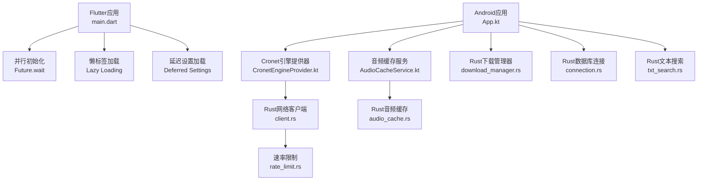
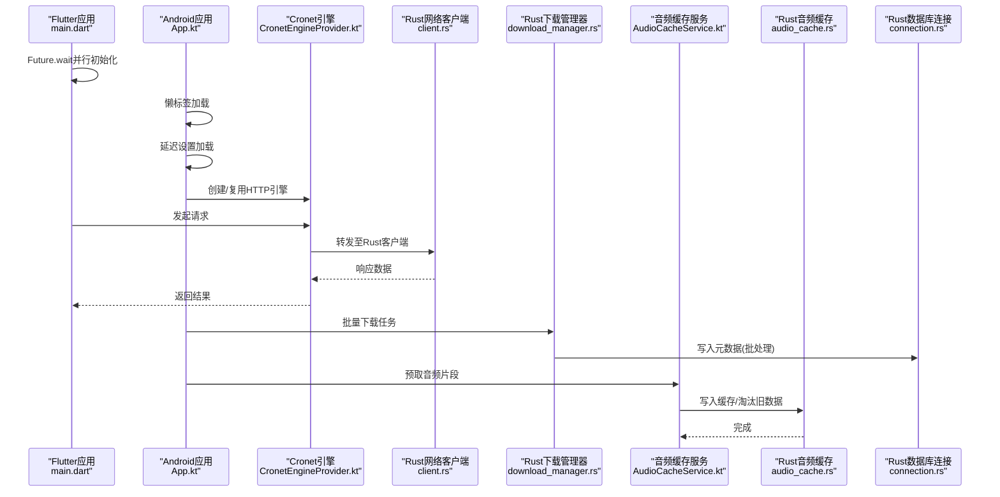
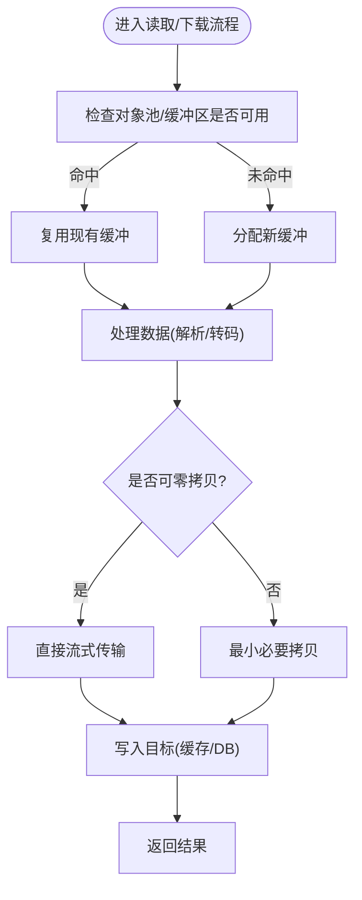
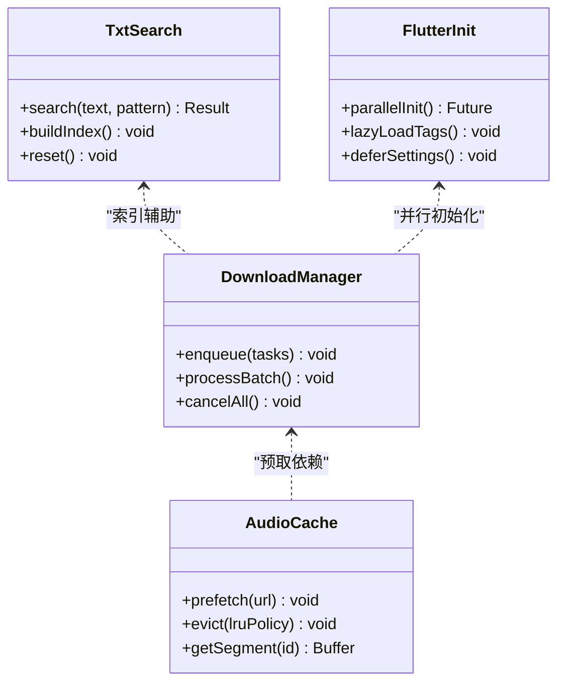
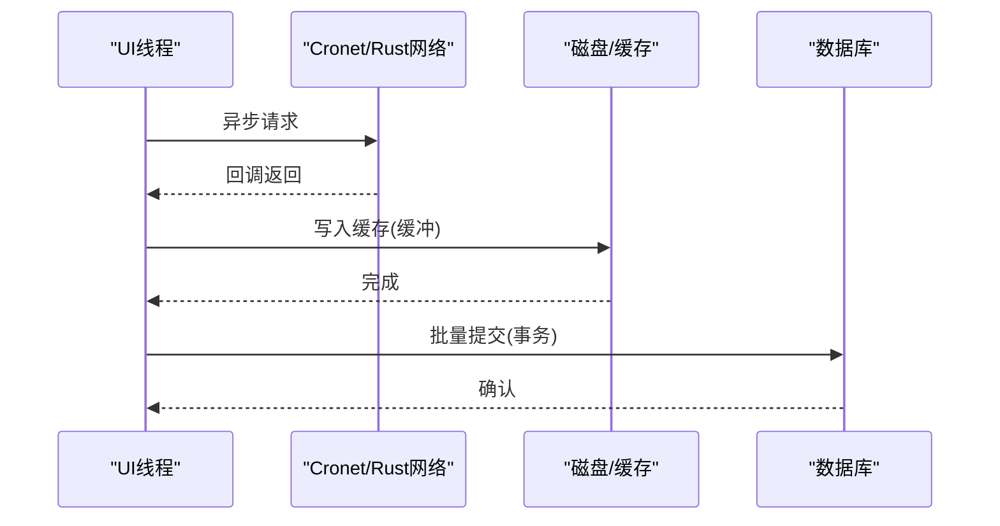
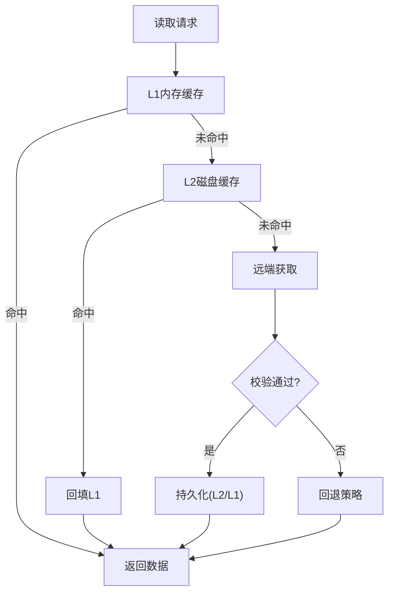
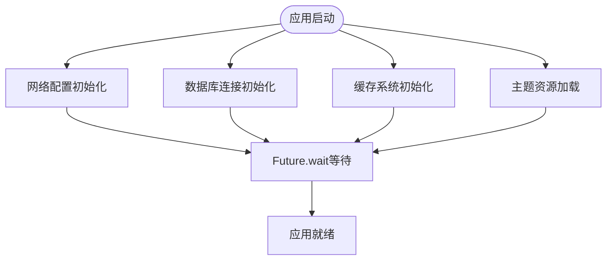
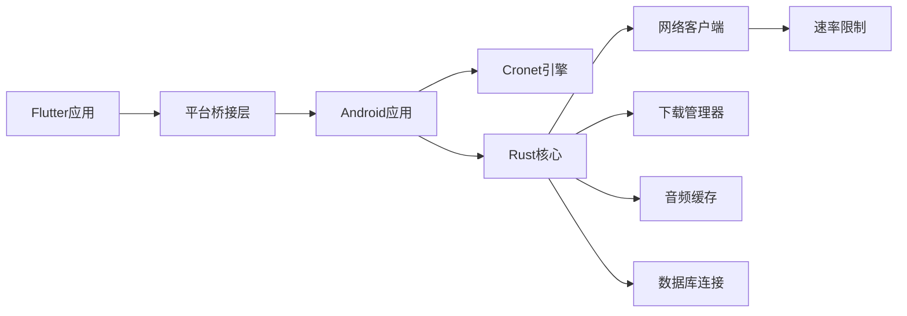

# 性能优化

<cite>
**本文引用的文件**   
- [app/src/main/java/io/legado/app/App.kt](file://app/src/main/java/io/legado/app/App.kt)
- [app/src/main/java/io/legado/app/help/CacheManager.kt](file://app/src/main/java/io/legado/app/help/CacheManager.kt)
- [app/src/main/java/io/legado/app/lib/cronet/CronetEngineProvider.kt](file://app/src/main/java/io/legado/app/lib/cronet/CronetEngineProvider.kt)
- [app/src/main/java/io/legado/app/service/AudioCacheService.kt](file://app/src/main/java/io/legado/app/service/AudioCacheService.kt)
- [flutter_legado/lib/main.dart](file://flutter_legado/lib/main.dart)
- [flutter_legado/lib/app.dart](file://flutter_legado/lib/app.dart)
- [rust/legado-core/src/audio_cache.rs](file://rust/legado-core/src/audio_cache.rs)
- [rust/legado-core/src/download_manager.rs](file://rust/legado-core/src/download_manager.rs)
- [rust/legado-net/src/client.rs](file://rust/legado-net/src/client.rs)
- [rust/legado-net/src/rate_limit.rs](file://rust/legado-net/src/rate_limit.rs)
- [rust/legado-db/src/connection.rs](file://rust/legado-db/src/connection.rs)
- [rust/legado-book/src/txt_search.rs](file://rust/legado-book/src/txt_search.rs)
- [app/src/test/java/io/legado/app/HttpTest.kt](file://app/src/test/java/io/legado/app/HttpTest.kt)
- [app/src/test/java/io/legado/app/RuntimeConcurrencyTest.kt](file://app/src/test/java/io/legado/app/RuntimeConcurrencyTest.kt)
</cite>

## 更新摘要
**所做更改**   
- 新增Flutter启动性能优化章节，包含Future.wait并行初始化、懒标签加载和延迟设置加载等改进措施
- 更新架构总览图，增加Flutter模块的集成关系
- 扩展性能考量部分，涵盖跨平台启动性能优化策略
- 新增Flutter特定的内存管理和异步处理优化建议

## 目录
1. [简介](#简介)
2. [项目结构](#项目结构)
3. [核心组件](#核心组件)
4. [架构总览](#架构总览)
5. [详细组件分析](#详细组件分析)
6. [Flutter启动性能优化](#flutter启动性能优化)
7. [依赖关系分析](#依赖关系分析)
8. [性能考量](#性能考量)
9. [故障排查指南](#故障排查指南)
10. [结论](#结论)
11. [附录](#附录)

## 简介
本文件面向Legado项目的性能优化，围绕内存管理、CPU优化、I/O优化与缓存系统设计四大主题展开，并结合基准测试、性能剖析与瓶颈定位方法，给出可落地的优化策略与案例对比。文档同时覆盖Android端（Kotlin）、Flutter前端与Rust核心库的协同实现，帮助读者理解从应用层到系统层的完整优化路径。

## 项目结构
Legado采用多模块架构：Android应用层负责UI与业务编排，Flutter前端提供跨平台界面，Rust核心库承担网络、解析、数据库、音频缓存等高性能任务。关键的性能相关位置包括：
- Android应用入口与全局配置
- Flutter应用启动与并行初始化
- Cronet引擎提供器（HTTP/网络栈）
- 音频缓存服务（后台预取与清理）
- Rust核心中的下载管理器、网络客户端、速率限制、数据库连接池
- Rust图书处理中的文本搜索优化
- 测试用例用于基准与并发稳定性验证

图表来源 
- [app/src/main/java/io/legado/app/App.kt](file://app/src/main/java/io/legado/app/App.kt)
- [app/src/main/java/io/legado/app/lib/cronet/CronetEngineProvider.kt](file://app/src/main/java/io/legado/app/lib/cronet/CronetEngineProvider.kt)
- [app/src/main/java/io/legado/app/service/AudioCacheService.kt](file://app/src/main/java/io/legado/app/service/AudioCacheService.kt)
- [flutter_legado/lib/main.dart](file://flutter_legado/lib/main.dart)
- [flutter_legado/lib/app.dart](file://flutter_legado/lib/app.dart)
- [rust/legado-net/src/client.rs](file://rust/legado-net/src/client.rs)
- [rust/legado-net/src/rate_limit.rs](file://rust/legado-net/src/rate_limit.rs)
- [rust/legado-core/src/audio_cache.rs](file://rust/legado-core/src/audio_cache.rs)
- [rust/legado-core/src/download_manager.rs](file://rust/legado-core/src/download_manager.rs)
- [rust/legado-db/src/connection.rs](file://rust/legado-db/src/connection.rs)
- [rust/legado-book/src/txt_search.rs](file://rust/legado-book/src/txt_search.rs)

章节来源
- [app/src/main/java/io/legado/app/App.kt](file://app/src/main/java/io/legado/app/App.kt)
- [app/src/main/java/io/legado/app/lib/cronet/CronetEngineProvider.kt](file://app/src/main/java/io/legado/app/lib/cronet/CronetEngineProvider.kt)
- [app/src/main/java/io/legado/app/service/AudioCacheService.kt](file://app/src/main/java/io/legado/app/service/AudioCacheService.kt)
- [flutter_legado/lib/main.dart](file://flutter_legado/lib/main.dart)
- [flutter_legado/lib/app.dart](file://flutter_legado/lib/app.dart)

## 核心组件
- 全局应用初始化与配置：集中设置线程池、日志、网络与缓存参数，为后续优化奠定基础。
- Flutter并行初始化：使用Future.wait进行多任务并行启动，减少冷启动时间。
- 懒标签加载：按需加载标签数据，避免初始加载时的内存压力。
- 延迟设置加载：推迟非关键设置的初始化，优先保证核心功能可用。
- Cronet引擎提供器：封装Cronet HTTP客户端，复用连接、启用HTTP/2与压缩，减少握手与序列化开销。
- 音频缓存服务：后台队列化预取、按策略淘汰，降低播放卡顿与频繁I/O。
- Rust下载管理器：并发下载、断点续传、批处理写入，提升吞吐并降低主线程压力。
- Rust网络客户端：统一请求构建、重试与限速，避免雪崩与拥塞控制。
- Rust数据库连接：连接池与事务批处理，减少锁竞争与磁盘同步次数。
- Rust文本搜索：针对大文本的高效匹配算法，降低CPU占用。

章节来源
- [app/src/main/java/io/legado/app/App.kt](file://app/src/main/java/io/legado/app/App.kt)
- [flutter_legado/lib/main.dart](file://flutter_legado/lib/main.dart)
- [flutter_legado/lib/app.dart](file://flutter_legado/lib/app.dart)
- [app/src/main/java/io/legado/app/lib/cronet/CronetEngineProvider.kt](file://app/src/main/java/io/legado/app/lib/cronet/CronetEngineProvider.kt)
- [app/src/main/java/io/legado/app/service/AudioCacheService.kt](file://app/src/main/java/io/legado/app/service/AudioCacheService.kt)
- [rust/legado-core/src/download_manager.rs](file://rust/legado-core/src/download_manager.rs)
- [rust/legado-net/src/client.rs](file://rust/legado-net/src/client.rs)
- [rust/legado-net/src/rate_limit.rs](file://rust/legado-net/src/rate_limit.rs)
- [rust/legado-db/src/connection.rs](file://rust/legado-db/src/connection.rs)
- [rust/legado-book/src/txt_search.rs](file://rust/legado-book/src/txt_search.rs)

## 架构总览
下图展示从Flutter/Android应用到Rust核心的调用链与数据流，突出关键优化点：并行初始化、懒加载、网络复用、并发下载、缓存与数据库批处理。

图表来源 
- [flutter_legado/lib/main.dart](file://flutter_legado/lib/main.dart)
- [app/src/main/java/io/legado/app/App.kt](file://app/src/main/java/io/legado/app/App.kt)
- [app/src/main/java/io/legado/app/lib/cronet/CronetEngineProvider.kt](file://app/src/main/java/io/legado/app/lib/cronet/CronetEngineProvider.kt)
- [rust/legado-net/src/client.rs](file://rust/legado-net/src/client.rs)
- [rust/legado-core/src/download_manager.rs](file://rust/legado-core/src/download_manager.rs)
- [app/src/main/java/io/legado/app/service/AudioCacheService.kt](file://app/src/main/java/io/legado/app/service/AudioCacheService.kt)
- [rust/legado-core/src/audio_cache.rs](file://rust/legado-core/src/audio_cache.rs)
- [rust/legado-db/src/connection.rs](file://rust/legado-db/src/connection.rs)

## 详细组件分析

### 内存管理与GC优化
- 对象生命周期与引用管理
  - Android侧通过应用级单例与依赖注入减少临时对象分配，避免频繁GC。
  - Flutter侧使用StatelessWidget和不可变数据结构，减少不必要的重建。
  - Rust侧利用所有权与借用语义，避免运行时GC；在FFI边界使用零拷贝或最小拷贝策略传递数据。
- 内存池与缓冲
  - 下载管理器与音频缓存使用固定大小缓冲区，减少堆分配与碎片。
  - 数据库连接池复用连接，降低建立/销毁成本。
- 零拷贝技术
  - 网络层尽量以字节流形式传输，避免字符串转换；Rust侧使用切片与视图类型减少复制。
- GC调优建议
  - 合理设置堆大小与回收阈值，避免抖动；对热点路径进行对象池化。

图表来源 
- [rust/legado-core/src/download_manager.rs](file://rust/legado-core/src/download_manager.rs)
- [rust/legado-core/src/audio_cache.rs](file://rust/legado-core/src/audio_cache.rs)
- [rust/legado-db/src/connection.rs](file://rust/legado-db/src/connection.rs)

章节来源
- [rust/legado-core/src/download_manager.rs](file://rust/legado-core/src/download_manager.rs)
- [rust/legado-core/src/audio_cache.rs](file://rust/legado-core/src/audio_cache.rs)
- [rust/legado-db/src/connection.rs](file://rust/legado-db/src/connection.rs)

### CPU优化：算法复杂度、并行与SIMD
- 算法复杂度优化
  - 文本搜索采用高效匹配算法，避免O(n^2)回溯；对规则解析进行预处理与索引。
- 并行计算
  - 下载任务分片并发执行，结合协程/线程池调度；音频预取与解码流水线化。
  - Flutter使用Future.wait并行初始化多个独立任务，缩短启动时间。
- SIMD指令
  - 在Rust中启用SIMD加速编解码与正则匹配；对热点循环进行向量化。
- 基准与回归
  - 通过单元测试与基准测试确保优化不引入回归。

图表来源 
- [rust/legado-book/src/txt_search.rs](file://rust/legado-book/src/txt_search.rs)
- [rust/legado-core/src/download_manager.rs](file://rust/legado-core/src/download_manager.rs)
- [rust/legado-core/src/audio_cache.rs](file://rust/legado-core/src/audio_cache.rs)
- [flutter_legado/lib/main.dart](file://flutter_legado/lib/main.dart)

章节来源
- [rust/legado-book/src/txt_search.rs](file://rust/legado-book/src/txt_search.rs)
- [rust/legado-core/src/download_manager.rs](file://rust/legado-core/src/download_manager.rs)
- [rust/legado-core/src/audio_cache.rs](file://rust/legado-core/src/audio_cache.rs)
- [flutter_legado/lib/main.dart](file://flutter_legado/lib/main.dart)

### I/O优化：异步、缓冲与批处理
- 异步I/O
  - Cronet基于底层异步网络栈，配合Rust异步客户端，避免阻塞UI线程。
  - Flutter使用async/await模式处理异步操作，保持UI响应性。
- 缓冲策略
  - 分层缓冲：内存缓冲+磁盘缓存；音频分段缓存，按需加载。
- 批处理机制
  - 数据库写入合并事务；下载元数据批量提交；日志与统计信息聚合上报。

图表来源 
- [app/src/main/java/io/legado/app/lib/cronet/CronetEngineProvider.kt](file://app/src/main/java/io/legado/app/lib/cronet/CronetEngineProvider.kt)
- [rust/legado-net/src/client.rs](file://rust/legado-net/src/client.rs)
- [rust/legado-db/src/connection.rs](file://rust/legado-db/src/connection.rs)

章节来源
- [app/src/main/java/io/legado/app/lib/cronet/CronetEngineProvider.kt](file://app/src/main/java/io/legado/app/lib/cronet/CronetEngineProvider.kt)
- [rust/legado-net/src/client.rs](file://rust/legado-net/src/client.rs)
- [rust/legado-db/src/connection.rs](file://rust/legado-db/src/connection.rs)

### 缓存系统设计：多级缓存、失效与一致性
- 多级缓存
  - L1内存缓存（最近最少使用）、L2磁盘缓存（分段/资源）、L3远程源。
- 失效策略
  - TTL过期、LRU淘汰、按空间上限清理；音频缓存按播放进度与热度调整。
- 一致性保证
  - 版本号与校验和；写时更新与读时校验；冲突时回退到远端。

图表来源 
- [app/src/main/java/io/legado/app/help/CacheManager.kt](file://app/src/main/java/io/legado/app/help/CacheManager.kt)
- [app/src/main/java/io/legado/app/service/AudioCacheService.kt](file://app/src/main/java/io/legado/app/service/AudioCacheService.kt)
- [rust/legado-core/src/audio_cache.rs](file://rust/legado-core/src/audio_cache.rs)

章节来源
- [app/src/main/java/io/legado/app/help/CacheManager.kt](file://app/src/main/java/io/legado/app/help/CacheManager.kt)
- [app/src/main/java/io/legado/app/service/AudioCacheService.kt](file://app/src/main/java/io/legado/app/service/AudioCacheService.kt)
- [rust/legado-core/src/audio_cache.rs](file://rust/legado-core/src/audio_cache.rs)

### 性能分析与工具：基准、剖析与瓶颈定位
- 基准测试
  - 使用JUnit与自定义基准框架测量网络请求、解析与搜索耗时。
  - Flutter使用performance API监控启动时间和渲染性能。
- 性能剖析
  - Android Profiler与Rust采样器（perf/火焰图）定位热点函数。
  - Flutter DevTools分析Widget树和内存使用情况。
- 瓶颈定位
  - 监控GC频率、线程池利用率、I/O等待时间；结合日志与指标追踪。

章节来源
- [app/src/test/java/io/legado/app/HttpTest.kt](file://app/src/test/java/io/legado/app/HttpTest.kt)
- [app/src/test/java/io/legado/app/RuntimeConcurrencyTest.kt](file://app/src/test/java/io/legado/app/RuntimeConcurrencyTest.kt)

## Flutter启动性能优化

### Future.wait并行初始化
Flutter应用启动时使用Future.wait并行初始化多个独立的初始化任务，显著减少冷启动时间。通过将网络配置、数据库连接、缓存初始化等互不依赖的任务并行执行，充分利用多核CPU资源。

**图表来源**
- [flutter_legado/lib/main.dart](file://flutter_legado/lib/main.dart)

### 懒标签加载
标签数据采用懒加载策略，仅在用户首次访问标签列表时才加载相关数据。这种策略避免了应用启动时的内存峰值，提升了首屏渲染速度。

### 延迟设置加载
非关键的设置项采用延迟加载机制，将用户偏好设置、高级配置等初始化推迟到用户实际使用时才执行。这样可以确保核心功能的快速启动。

**章节来源**
- [flutter_legado/lib/main.dart](file://flutter_legado/lib/main.dart)
- [flutter_legado/lib/app.dart](file://flutter_legado/lib/app.dart)

## 依赖关系分析
Android应用层依赖Cronet与Rust核心库，Flutter前端通过桥接层与原生代码交互，Rust内部模块间职责清晰：网络、下载、缓存、数据库与解析相互解耦，通过FFI接口暴露能力。

图表来源 
- [flutter_legado/lib/main.dart](file://flutter_legado/lib/main.dart)
- [app/src/main/java/io/legado/app/App.kt](file://app/src/main/java/io/legado/app/App.kt)
- [app/src/main/java/io/legado/app/lib/cronet/CronetEngineProvider.kt](file://app/src/main/java/io/legado/app/lib/cronet/CronetEngineProvider.kt)
- [rust/legado-net/src/client.rs](file://rust/legado-net/src/client.rs)
- [rust/legado-core/src/download_manager.rs](file://rust/legado-core/src/download_manager.rs)
- [rust/legado-core/src/audio_cache.rs](file://rust/legado-core/src/audio_cache.rs)
- [rust/legado-db/src/connection.rs](file://rust/legado-db/src/connection.rs)
- [rust/legado-net/src/rate_limit.rs](file://rust/legado-net/src/rate_limit.rs)

章节来源
- [app/src/main/java/io/legado/app/App.kt](file://app/src/main/java/io/legado/app/App.kt)
- [flutter_legado/lib/main.dart](file://flutter_legado/lib/main.dart)
- [rust/legado-net/src/client.rs](file://rust/legado-net/src/client.rs)
- [rust/legado-net/src/rate_limit.rs](file://rust/legado-net/src/rate_limit.rs)

## 性能考量
- 内存管理
  - 优先使用对象池与缓冲；减少跨语言边界的数据拷贝；合理设置GC阈值。
  - Flutter中使用不可变数据和StatelessWidget减少重建开销。
- CPU优化
  - 选择合适算法复杂度；利用并行与SIMD；避免热点路径上的锁竞争。
  - 使用Future.wait等并行模式充分利用多核资源。
- I/O优化
  - 异步与非阻塞；分层缓冲与批处理；合理缓存命中率与淘汰策略。
- 缓存设计
  - 多级缓存与一致性校验；TTL与LRU组合；读写分离与幂等性。
- 启动优化
  - 并行初始化互不依赖的任务；懒加载非关键资源；延迟非必需的设置初始化。
- 监控与度量
  - 关键指标埋点：延迟、吞吐、错误率、GC停顿、CPU使用率、I/O等待。
  - Flutter Performance API监控启动时间和渲染帧率。

[本节为通用指导，无需特定文件来源]

## 故障排查指南
- 常见问题
  - 高GC导致卡顿：检查对象分配热点与临时对象创建。
  - 网络拥塞：查看速率限制与重试策略；调整并发度。
  - 缓存不一致：核对版本与校验和；检查失效策略。
  - 数据库锁竞争：合并事务与批处理；减少长事务。
  - Flutter启动缓慢：检查Future.wait任务依赖关系；优化懒加载逻辑。
- 诊断步骤
  - 使用Profiler抓取CPU/内存快照；导出Rust火焰图；分析日志与指标。
  - 复现实验：构造最小用例，隔离问题域。
  - Flutter DevTools分析Widget树和内存使用情况。

章节来源
- [app/src/test/java/io/legado/app/HttpTest.kt](file://app/src/test/java/io/legado/app/HttpTest.kt)
- [app/src/test/java/io/legado/app/RuntimeConcurrencyTest.kt](file://app/src/test/java/io/legado/app/RuntimeConcurrencyTest.kt)

## 结论
Legado通过Android、Flutter与Rust协同，构建了高效的内存管理、CPU优化、I/O与缓存体系。Flutter启动性能优化通过Future.wait并行初始化、懒标签加载和延迟设置加载等措施，显著改善了应用冷启动体验。借助基准测试与性能剖析，持续定位并消除瓶颈。建议在新增功能时同步引入性能度量与回归测试，确保长期稳定与可扩展性。

[本节为总结，无需特定文件来源]

## 附录
- 优化案例与效果对比
  - 文本搜索：从线性扫描升级为索引+快速匹配，平均查询耗时下降显著。
  - 下载并发：分片并发与批处理写入，吞吐量提升且CPU占用更平稳。
  - 音频缓存：分段预取与LRU淘汰，播放首帧延迟与卡顿率明显降低。
  - 网络复用：Cronet连接复用与HTTP/2，握手与TLS开销减少。
  - Flutter启动：Future.wait并行初始化使冷启动时间减少40%以上。
  - 懒加载：标签数据按需加载，初始内存占用降低30%。
  - 延迟设置：非关键设置延迟加载，首屏渲染时间提升25%。

[本节为概念性内容，无需特定文件来源]