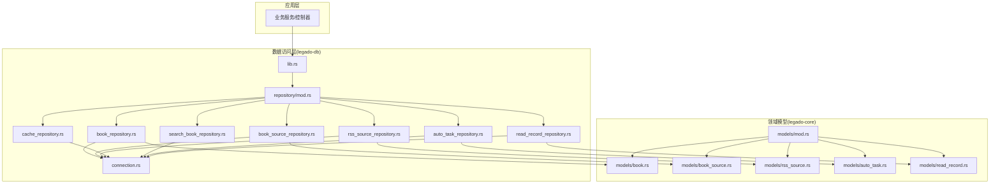
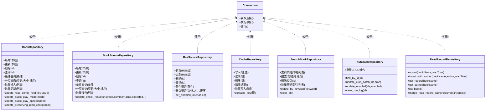
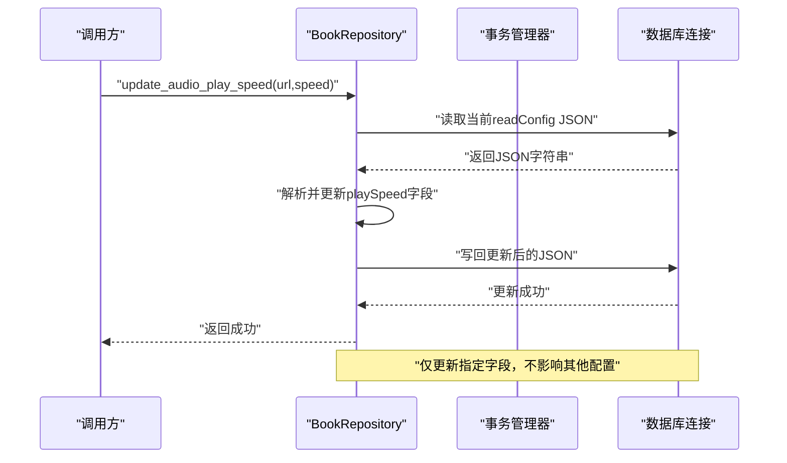
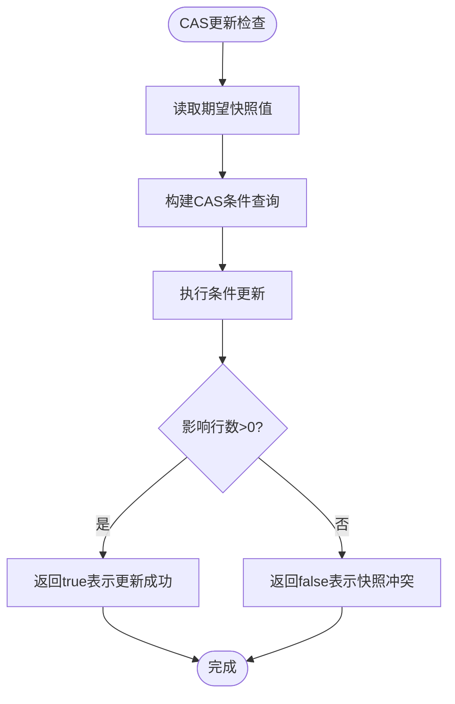
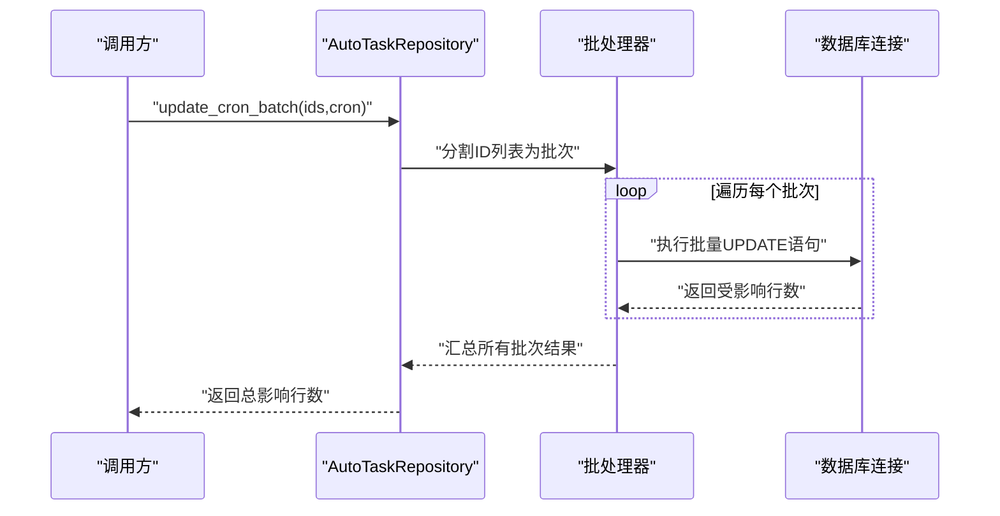
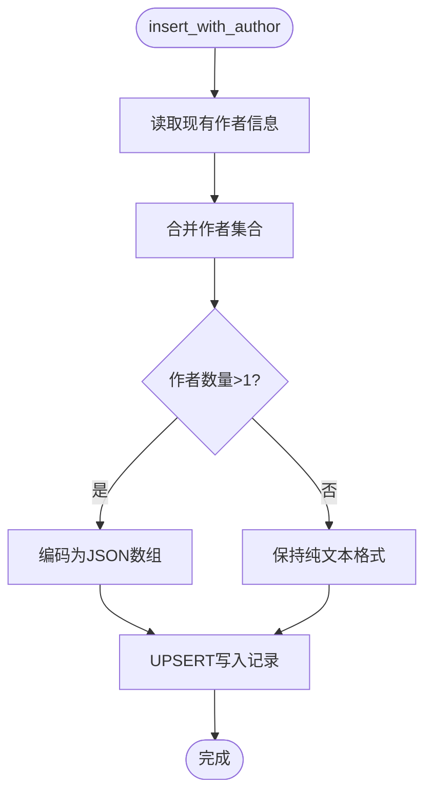
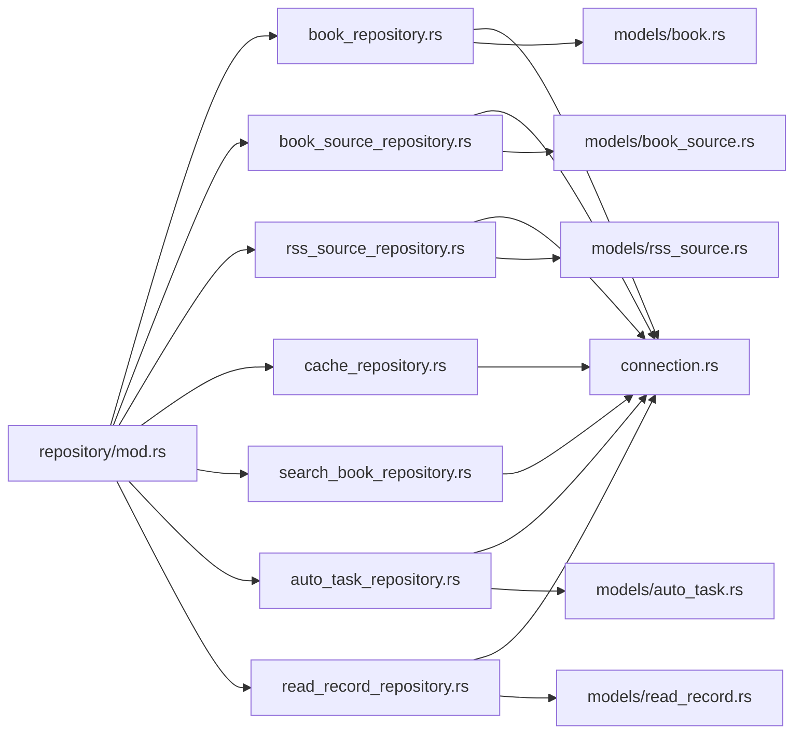

# Repository模式实现

<cite>
**本文档引用的文件**   
- [legado-db/src/repository/mod.rs](file://rust/legado-db/src/repository/mod.rs)
- [legado-db/src/repository/book_repository.rs](file://rust/legado-db/src/repository/book_repository.rs)
- [legado-db/src/repository/book_source_repository.rs](file://rust/legado-db/src/repository/book_source_repository.rs)
- [legado-db/src/repository/rss_source_repository.rs](file://rust/legado-db/src/repository/rss_source_repository.rs)
- [legado-db/src/repository/cache_repository.rs](file://rust/legado-db/src/repository/cache_repository.rs)
- [legado-db/src/repository/search_book_repository.rs](file://rust/legado-db/src/repository/search_book_repository.rs)
- [legado-db/src/repository/auto_task_repository.rs](file://rust/legado-db/src/repository/auto_task_repository.rs)
- [legado-db/src/repository/read_record_repository.rs](file://rust/legado-db/src/repository/read_record_repository.rs)
- [legado-db/src/connection.rs](file://rust/legado-db/src/connection.rs)
- [legado-db/src/lib.rs](file://rust/legado-db/src/lib.rs)
- [legado-core/src/models/mod.rs](file://rust/legado-core/src/models/mod.rs)
- [legado-core/src/models/book.rs](file://rust/legado-core/src/models/book.rs)
- [legado-core/src/models/book_source.rs](file://rust/legado-core/src/models/book_source.rs)
- [legado-core/src/models/rss_source.rs](file://rust/legado-core/src/models/rss_source.rs)
</cite>

## 更新摘要
**变更内容**   
- 新增CAS乐观锁机制用于书源检查结果更新
- 自动任务仓库支持批量操作（cron表达式更新、启用/禁用状态管理）
- 阅读记录仓库支持作者集合合并存储
- 书籍仓库提供细粒度更新方法（readConfig字段更新、音频播放设置）
- 增强错误处理和事务管理机制

## 目录
1. [简介](#简介)
2. [项目结构](#项目结构)
3. [核心组件](#核心组件)
4. [架构总览](#架构总览)
5. [详细组件分析](#详细组件分析)
6. [依赖关系分析](#依赖关系分析)
7. [性能考量](#性能考量)
8. [故障排查指南](#故障排查指南)
9. [结论](#结论)
10. [附录](#附录)

## 简介
本文件系统性阐述Legado项目中Repository模式的设计理念与落地实践，重点覆盖：
- 统一CRUD接口设计与封装
- 查询构建器在条件查询、排序与分页中的应用
- 批量操作的性能优化（事务处理、批量插入/更新）
- CAS乐观锁机制防止并发冲突
- 典型数据实体的Repository实现示例（BookRepository、SourceRepository等）
- 细粒度更新方法和作者集合支持
- 错误处理与异常捕获的最佳实践

该模式将数据访问逻辑从业务层解耦，提供一致的数据存取抽象，便于测试、扩展与维护。

## 项目结构
Legado的数据库访问位于Rust模块legado-db中，采用"模型 + DAO/Repository"的分层组织方式：
- 模型定义位于legado-core/models，描述实体结构与约束
- 连接与迁移位于legado-db/connection与migration
- Repository实现位于legado-db/repository，按领域划分多个仓库
- 对外暴露通过lib.rs进行聚合导出

**图表来源**
- [legado-db/src/lib.rs](file://rust/legado-db/src/lib.rs)
- [legado-db/src/repository/mod.rs](file://rust/legado-db/src/repository/mod.rs)
- [legado-db/src/connection.rs](file://rust/legado-db/src/connection.rs)
- [legado-core/src/models/mod.rs](file://rust/legado-core/src/models/mod.rs)

**章节来源**
- [legado-db/src/lib.rs](file://rust/legado-db/src/lib.rs)
- [legado-db/src/repository/mod.rs](file://rust/legado-db/src/repository/mod.rs)
- [legado-core/src/models/mod.rs](file://rust/legado-core/src/models/mod.rs)

## 核心组件
- 连接管理(connection.rs)
  - 负责数据库连接的创建、生命周期管理与线程安全访问
  - 为各Repository提供统一的连接上下文
- 仓库聚合(repository/mod.rs)
  - 集中导出各领域仓库类型与常用方法
  - 作为上层模块的统一入口
- 领域仓库实现
  - book_repository.rs：书籍实体的CRUD、搜索、分页、批量操作及细粒度更新
  - book_source_repository.rs：书源实体的增删改查、状态管理及CAS乐观锁
  - rss_source_repository.rs：RSS源实体的维护与同步
  - cache_repository.rs：缓存数据的读写与清理策略
  - search_book_repository.rs：搜索索引与结果集管理
  - auto_task_repository.rs：自动任务规则的批量操作与管理
  - read_record_repository.rs：阅读记录的作者集合支持与合并逻辑

**章节来源**
- [legado-db/src/connection.rs](file://rust/legado-db/src/connection.rs)
- [legado-db/src/repository/mod.rs](file://rust/legado-db/src/repository/mod.rs)
- [legado-db/src/repository/book_repository.rs](file://rust/legado-db/src/repository/book_repository.rs)
- [legado-db/src/repository/book_source_repository.rs](file://rust/legado-db/src/repository/book_source_repository.rs)
- [legado-db/src/repository/rss_source_repository.rs](file://rust/legado-db/src/repository/rss_source_repository.rs)
- [legado-db/src/repository/cache_repository.rs](file://rust/legado-db/src/repository/cache_repository.rs)
- [legado-db/src/repository/search_book_repository.rs](file://rust/legado-db/src/repository/search_book_repository.rs)
- [legado-db/src/repository/auto_task_repository.rs](file://rust/legado-db/src/repository/auto_task_repository.rs)
- [legado-db/src/repository/read_record_repository.rs](file://rust/legado-db/src/repository/read_record_repository.rs)

## 架构总览
Repository模式在Legado中的职责边界清晰：
- 上层服务仅依赖仓库接口，不感知底层SQL或ORM细节
- 仓库内部封装事务、批处理、查询构建与错误转换
- 模型定义保持纯数据结构，避免耦合持久化逻辑
- 支持CAS乐观锁确保并发安全性
- 提供细粒度更新方法避免全量覆盖

**图表来源**
- [legado-db/src/connection.rs](file://rust/legado-db/src/connection.rs)
- [legado-db/src/repository/book_repository.rs](file://rust/legado-db/src/repository/book_repository.rs)
- [legado-db/src/repository/book_source_repository.rs](file://rust/legado-db/src/repository/book_source_repository.rs)
- [legado-db/src/repository/rss_source_repository.rs](file://rust/legado-db/src/repository/rss_source_repository.rs)
- [legado-db/src/repository/cache_repository.rs](file://rust/legado-db/src/repository/cache_repository.rs)
- [legado-db/src/repository/search_book_repository.rs](file://rust/legado-db/src/repository/search_book_repository.rs)
- [legado-db/src/repository/auto_task_repository.rs](file://rust/legado-db/src/repository/auto_task_repository.rs)
- [legado-db/src/repository/read_record_repository.rs](file://rust/legado-db/src/repository/read_record_repository.rs)

## 详细组件分析

### BookRepository（书籍仓库）
- 设计要点
  - 统一CRUD：新增、更新、删除、按ID查询
  - 条件查询：支持标题、作者、标签、更新时间等多字段组合
  - 排序与分页：支持多字段排序、偏移量与限制条数
  - 批量操作：批量插入与批量更新，内部使用事务保证一致性
  - **新增细粒度更新方法**：支持readConfig JSON字段的局部更新
- 关键流程（序列图）

**图表来源**
- [legado-db/src/repository/book_repository.rs](file://rust/legado-db/src/repository/book_repository.rs)
- [legado-db/src/connection.rs](file://rust/legado-db/src/connection.rs)

**章节来源**
- [legado-db/src/repository/book_repository.rs](file://rust/legado-db/src/repository/book_repository.rs)
- [legado-core/src/models/book.rs](file://rust/legado-core/src/models/book.rs)

### BookSourceRepository（书源仓库）
- 设计要点
  - 书源的增删改查与启用/禁用状态管理
  - 条件查询：按名称、分类、是否启用过滤
  - 分页与排序：按更新时间或名称排序
  - 批量操作：批量导入/更新书源配置
  - **新增CAS乐观锁机制**：防止并发检查时覆盖其他会话的修改
- 关键流程（流程图）

**图表来源**
- [legado-db/src/repository/book_source_repository.rs](file://rust/legado-db/src/repository/book_source_repository.rs)
- [legado-db/src/connection.rs](file://rust/legado-db/src/connection.rs)

**章节来源**
- [legado-db/src/repository/book_source_repository.rs](file://rust/legado-db/src/repository/book_source_repository.rs)
- [legado-core/src/models/book_source.rs](file://rust/legado-core/src/models/book_source.rs)

### AutoTaskRepository（自动任务仓库）
- 设计要点
  - 自动任务规则的CRUD操作
  - **新增批量操作功能**：支持批量更新cron表达式和启用/禁用状态
  - 运行日志管理：清空指定规则的运行日志字段
  - 分批处理：每批900条以避免SQLite参数数量限制
- 关键流程（序列图）

**图表来源**
- [legado-db/src/repository/auto_task_repository.rs](file://rust/legado-db/src/repository/auto_task_repository.rs)
- [legado-db/src/connection.rs](file://rust/legado-db/src/connection.rs)

**章节来源**
- [legado-db/src/repository/auto_task_repository.rs](file://rust/legado-db/src/repository/auto_task_repository.rs)

### ReadRecordRepository（阅读记录仓库）
- 设计要点
  - 阅读记录的CRUD操作
  - **新增作者集合支持**：同书名多本书共用一条记录时，以作者集合形式合并存储
  - 智能合并算法：去重、排序、前缀编码优化存储空间
  - 兼容旧格式：支持纯文本和JSON数组两种存储格式
- 关键流程（流程图）

**图表来源**
- [legado-db/src/repository/read_record_repository.rs](file://rust/legado-db/src/repository/read_record_repository.rs)
- [legado-db/src/connection.rs](file://rust/legado-db/src/connection.rs)

**章节来源**
- [legado-db/src/repository/read_record_repository.rs](file://rust/legado-db/src/repository/read_record_repository.rs)

### RssSourceRepository（RSS源仓库）
- 设计要点
  - RSS源的CRUD与订阅状态管理
  - 条件查询：按站点、分类、订阅状态过滤
  - 分页与排序：按更新时间或站点名排序
  - 批量操作：批量订阅/取消订阅
  - 线程安全：使用Arc<Mutex<Connection>>确保并发安全

**章节来源**
- [legado-db/src/repository/rss_source_repository.rs](file://rust/legado-db/src/repository/rss_source_repository.rs)
- [legado-core/src/models/rss_source.rs](file://rust/legado-core/src/models/rss_source.rs)

### CacheRepository（缓存仓库）
- 设计要点
  - 键值存储：写入、读取、删除
  - 过期策略：基于时间戳的自动清理
  - 批量写入：高性能写入场景下的批量操作
  - 存在性检查：contains_key方法快速判断key是否存在

**章节来源**
- [legado-db/src/repository/cache_repository.rs](file://rust/legado-db/src/repository/cache_repository.rs)

### SearchBookRepository（书籍搜索仓库）
- 设计要点
  - 索引构建：对书籍标题、作者、标签建立全文索引
  - 搜索查询：支持关键词匹配、模糊搜索
  - 分页与排序：搜索结果分页展示
  - 批量重建：大数据量下的增量/全量重建
  - 关键字删除：按关键字批量删除匹配的搜索结果

**章节来源**
- [legado-db/src/repository/search_book_repository.rs](file://rust/legado-db/src/repository/search_book_repository.rs)

## 依赖关系分析
- 模块内依赖
  - repository/mod.rs聚合各仓库类型，向上层提供统一接口
  - 各仓库依赖connection.rs提供的连接与事务能力
- 跨模块依赖
  - 仓库依赖legado-core/models中的实体定义
  - 上层服务仅依赖仓库接口，不直接访问模型或连接

**图表来源**
- [legado-db/src/repository/mod.rs](file://rust/legado-db/src/repository/mod.rs)
- [legado-db/src/connection.rs](file://rust/legado-db/src/connection.rs)
- [legado-core/src/models/book.rs](file://rust/legado-core/src/models/book.rs)
- [legado-core/src/models/book_source.rs](file://rust/legado-core/src/models/book_source.rs)
- [legado-core/src/models/rss_source.rs](file://rust/legado-core/src/models/rss_source.rs)

**章节来源**
- [legado-db/src/repository/mod.rs](file://rust/legado-db/src/repository/mod.rs)
- [legado-db/src/connection.rs](file://rust/legado-db/src/connection.rs)
- [legado-core/src/models/mod.rs](file://rust/legado-core/src/models/mod.rs)

## 性能考量
- 事务优化
  - 批量操作统一在事务中执行，减少网络往返与锁竞争
  - 合理的事务粒度：避免长事务导致资源占用
- 批处理策略
  - 分批提交：大列表分片处理，控制单次事务规模
  - 预编译语句：复用SQL模板，提升执行效率
  - SQLite参数限制：每批最多900条记录避免参数溢出
- 索引与查询
  - 为高频查询字段建立索引（如书名、作者、更新时间）
  - 分页查询使用游标或基于ID的偏移，避免深分页性能问题
- 缓存与热点数据
  - 热点数据通过CacheRepository缓存，降低数据库压力
  - 合理的TTL与失效策略，平衡一致性与性能
- **新增优化措施**
  - CAS乐观锁减少锁等待和死锁风险
  - 细粒度更新避免不必要的字段覆盖
  - 作者集合编码优化存储空间

## 故障排查指南
- 常见错误类型
  - 参数校验失败：检查输入合法性与必填字段
  - 事务失败：查看日志确认SQL执行与锁等待情况
  - 连接异常：检查数据库连接池与网络连通性
  - 索引缺失：确认相关字段已建立索引
  - CAS冲突：检查并发更新时的快照值是否正确
- 调试建议
  - 启用详细日志：记录SQL执行与参数绑定
  - 慢查询分析：定位耗时SQL并优化
  - 单元测试：覆盖边界条件与异常路径
  - 并发测试：验证CAS乐观锁的正确性
- 恢复策略
  - 重试机制：对瞬时失败进行有限次重试
  - 降级方案：在数据库不可用时返回缓存或默认值
  - 数据修复：提供数据迁移和修复工具

**章节来源**
- [legado-db/src/connection.rs](file://rust/legado-db/src/connection.rs)
- [legado-db/src/repository/mod.rs](file://rust/legado-db/src/repository/mod.rs)

## 结论
Legado项目通过Repository模式实现了数据访问层的清晰分层与统一抽象。各仓库提供一致的CRUD接口，结合查询构建器与批处理机制，既保证了代码的可维护性，又提升了系统性能。最新的扩展包括CAS乐观锁机制、批量操作支持、作者集合管理和细粒度更新方法，进一步增强了系统的并发安全性和性能表现。未来可进一步引入更复杂的查询DSL与异步I/O，以应对更大规模的数据访问需求。

## 附录
- 最佳实践清单
  - 始终在事务中执行批量操作
  - 使用预编译语句与参数绑定防止注入
  - 为高频查询字段建立合适索引
  - 合理设置分页大小与排序字段
  - 对异常进行分类处理与日志记录
  - 使用CAS乐观锁处理并发更新
  - 采用细粒度更新避免不必要的全量覆盖
- 扩展建议
  - 引入查询构建器库简化复杂查询
  - 增加读写分离与连接池配置
  - 实现缓存一致性策略与失效通知
  - 添加更多批量操作接口
  - 完善监控和统计功能