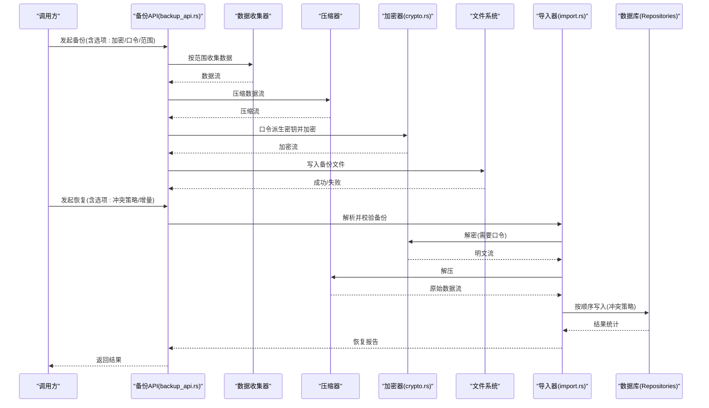
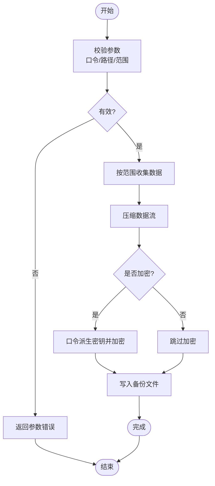
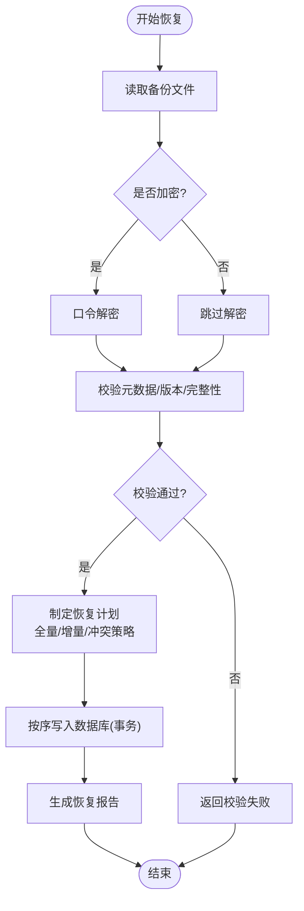
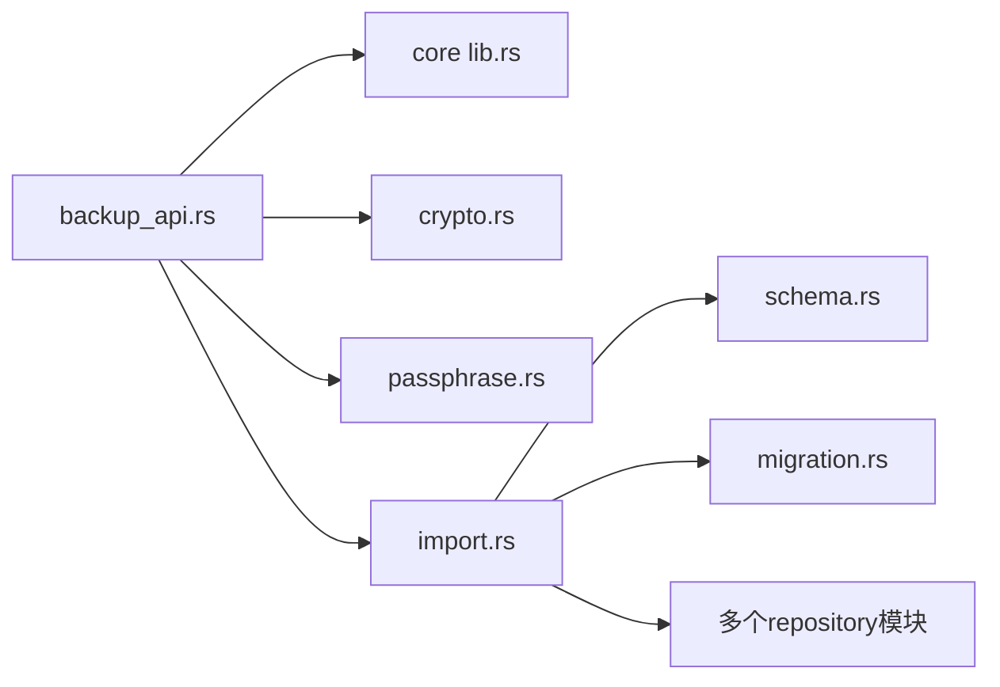

# 备份恢复功能

<cite>
**本文引用的文件**   
- [backup_api.rs](file://rust/legado-ffi/src/api/backup_api.rs)
- [lib.rs](file://rust/legado-core/src/lib.rs)
- [crypto.rs](file://rust/legado-core/src/crypto.rs)
- [passphrase.rs](file://rust/legado-core/src/passphrase.rs)
- [import.rs](file://rust/legado-db/src/import.rs)
- [schema.rs](file://rust/legado-db/src/schema.rs)
- [migration.rs](file://rust/legado-db/src/migration.rs)
- [auto_task_repository.rs](file://rust/legado-db/src/repository/auto_task_repository.rs)
- [book_repository.rs](file://rust/legado-db/src/repository/book_repository.rs)
- [book_chapter_repository.rs](file://rust/legado-db/src/repository/book_chapter_repository.rs)
- [bookmark_repository.rs](file://rust/legado-db/src/repository/bookmark_repository.rs)
- [read_record_repository.rs](file://rust/legado-db/src/repository/read_record_repository.rs)
- [reading_stats_repository.rs](file://rust/legado-db/src/repository/reading_stats_repository.rs)
- [replace_rule_repository.rs](file://rust/legado-db/src/repository/replace_rule_repository.rs)
- [user_repository.rs](file://rust/legado-db/src/repository/user_repository.rs)
- [cache_repository.rs](file://rust/legado-db/src/repository/cache_repository.rs)
- [cookie_repository.rs](file://rust/legado-db/src/repository/cookie_repository.rs)
- [rss_article_repository.rs](file://rust/legado-db/src/repository/rss_article_repository.rs)
- [rss_star_repository.rs](file://rust/legado-db/src/repository/rss_star_repository.rs)
- [rss_source_repository.rs](file://rust/legado-db/src/repository/rss_source_repository.rs)
- [rule_sub_repository.rs](file://rust/legado-db/src/repository/rule_sub_repository.rs)
- [search_book_repository.rs](file://rust/legado-db/src/repository/search_book_repository.rs)
- [search_keyword_repository.rs](file://rust/legado-db/src/repository/search_keyword_repository.rs)
- [txt_toc_rule_repository.rs](file://rust/legado-db/src/repository/txt_toc_rule_repository.rs)
- [book_group_repository.rs](file://rust/legado-db/src/repository/book_group_repository.rs)
- [http_tts_repository.rs](file://rust/legado-db/src/repository/http_tts_repository.rs)
- [keyboard_assist_repository.rs](file://rust/legado-db/src/repository/keyboard_assist_repository.rs)
- [review_repository.rs](file://rust/legado-db/src/repository/review_repository.rs)
- [book_export.rs](file://rust/legado-ffi/src/api/book_export.rs)
- [book_import.rs](file://rust/legado-ffi/src/api/book_import.rs)
</cite>

## 目录
1. [简介](#简介)
2. [项目结构](#项目结构)
3. [核心组件](#核心组件)
4. [架构总览](#架构总览)
5. [详细组件分析](#详细组件分析)
6. [依赖关系分析](#依赖关系分析)
7. [性能考量](#性能考量)
8. [故障排查指南](#故障排查指南)
9. [结论](#结论)
10. [附录](#附录)

## 简介
本文件面向Legado项目的“备份与恢复”能力，系统性说明数据备份的完整流程（数据收集、压缩加密、文件生成）、恢复机制（数据验证、冲突解决、增量恢复）、支持的备份格式与兼容性处理、选择性备份与恢复、自动化任务配置与使用，以及备份文件的存储管理与清理策略。文档以代码仓库为依据，结合Rust层实现与数据库模块进行阐述，帮助开发者与高级用户理解并正确使用该功能。

## 项目结构
备份恢复相关能力主要分布在以下模块：
- FFI API层：对外暴露备份/导入导出接口，协调上层调用与底层实现
- Core层：提供加密、口令、通用工具等基础能力
- DB层：负责数据读取、导入、迁移与Schema管理
- Repository层：按领域划分的数据访问封装，支撑选择性备份/恢复

```mermaid
graph TB
subgraph "FFI API"
BAPI["backup_api.rs"]
BE["book_export.rs"]
BI["book_import.rs"]
end
subgraph "Core"
CRYPTO["crypto.rs"]
PASS["passphrase.rs"]
CORELIB["lib.rs"]
end
subgraph "DB"
IMPORT["import.rs"]
SCHEMA["schema.rs"]
MIGRATION["migration.rs"]
end
subgraph "Repositories"
RBOOK["book_repository.rs"]
RCHAP["book_chapter_repository.rs"]
RBMK["bookmark_repository.rs"]
RREAD["read_record_repository.rs"]
RSTATS["reading_stats_repository.rs"]
RREPL["replace_rule_repository.rs"]
RUSER["user_repository.rs"]
RCACHE["cache_repository.rs"]
RCOOKIE["cookie_repository.rs"]
RRSSA["rss_article_repository.rs"]
RRSSS["rss_source_repository.rs"]
RRSSSTAR["rss_star_repository.rs"]
RRULESUB["rule_sub_repository.rs"]
RSEARCHB["search_book_repository.rs"]
RSEARCHK["search_keyword_repository.rs"]
RTXTTOC["txt_toc_rule_repository.rs"]
RGROUP["book_group_repository.rs"]
RHTTSTTS["http_tts_repository.rs"]
RKB["keyboard_assist_repository.rs"]
RREVIEW["review_repository.rs"]
end
BAPI --> CORELIB
BAPI --> CRYPTO
BAPI --> PASS
BAPI --> IMPORT
BAPI --> SCHEMA
BAPI --> MIGRATION
BE --> RBOOK
BI --> RBOOK
BI --> RCHAP
BI --> RBMK
BI --> RREAD
BI --> RSTATS
BI --> RREPL
BI --> RUSER
BI --> RCACHE
BI --> RCOOKIE
BI --> RRSSA
BI --> RRSSS
BI --> RRSSSTAR
BI --> RRULESUB
BI --> RSEARCHB
BI --> RSEARCHK
BI --> RTXTTOC
BI --> RGROUP
BI --> RHTTSTTS
BI --> RKB
BI --> RREVIEW
```

图表来源
- [backup_api.rs:1-200](file://rust/legado-ffi/src/api/backup_api.rs#L1-L200)
- [book_export.rs:1-200](file://rust/legado-ffi/src/api/book_export.rs#L1-L200)
- [book_import.rs:1-200](file://rust/legado-ffi/src/api/book_import.rs#L1-L200)
- [crypto.rs:1-200](file://rust/legado-core/src/crypto.rs#L1-L200)
- [passphrase.rs:1-200](file://rust/legado-core/src/passphrase.rs#L1-L200)
- [import.rs:1-200](file://rust/legado-db/src/import.rs#L1-L200)
- [schema.rs:1-200](file://rust/legado-db/src/schema.rs#L1-L200)
- [migration.rs:1-200](file://rust/legado-db/src/migration.rs#L1-L200)

章节来源
- [backup_api.rs:1-200](file://rust/legado-ffi/src/api/backup_api.rs#L1-L200)
- [book_export.rs:1-200](file://rust/legado-ffi/src/api/book_export.rs#L1-L200)
- [book_import.rs:1-200](file://rust/legado-ffi/src/api/book_import.rs#L1-L200)
- [crypto.rs:1-200](file://rust/legado-core/src/crypto.rs#L1-L200)
- [passphrase.rs:1-200](file://rust/legado-core/src/passphrase.rs#L1-L200)
- [import.rs:1-200](file://rust/legado-db/src/import.rs#L1-L200)
- [schema.rs:1-200](file://rust/legado-db/src/schema.rs#L1-L200)
- [migration.rs:1-200](file://rust/legado-db/src/migration.rs#L1-L200)

## 核心组件
- 备份API（FFI）：统一入口，接收参数（是否加密、口令、目标路径、选择范围），协调数据收集、压缩、加密与落盘
- 加密与口令：基于口令派生密钥，对备份流进行加密；支持校验口令强度与长度
- 导入/恢复：解析备份文件，校验完整性与版本，执行增量或全量写入，处理冲突策略
- 数据仓库：按领域提供查询接口，用于选择性备份与恢复
- Schema与迁移：确保备份/恢复过程中的数据结构兼容性与升级路径

章节来源
- [backup_api.rs:1-200](file://rust/legado-ffi/src/api/backup_api.rs#L1-L200)
- [crypto.rs:1-200](file://rust/legado-core/src/crypto.rs#L1-L200)
- [passphrase.rs:1-200](file://rust/legado-core/src/passphrase.rs#L1-L200)
- [import.rs:1-200](file://rust/legado-db/src/import.rs#L1-L200)
- [schema.rs:1-200](file://rust/legado-db/src/schema.rs#L1-L200)
- [migration.rs:1-200](file://rust/legado-db/src/migration.rs#L1-L200)

## 架构总览
备份恢复的整体流程如下：
- 备份：从各Repository收集数据 → 序列化 → 可选压缩 → 可选加密 → 写入目标文件
- 恢复：读取备份文件 → 解密/解压 → 校验元数据与版本 → 按顺序写入数据库 → 冲突处理 → 完成报告

图表来源
- [backup_api.rs:1-200](file://rust/legado-ffi/src/api/backup_api.rs#L1-L200)
- [crypto.rs:1-200](file://rust/legado-core/src/crypto.rs#L1-L200)
- [import.rs:1-200](file://rust/legado-db/src/import.rs#L1-L200)

## 详细组件分析

### 备份API（数据收集、压缩、加密、文件生成）
- 职责：接收备份请求，根据选项决定数据范围、是否压缩与加密，组织流水线并输出文件
- 关键流程：
  - 参数校验（口令强度、目标路径合法性）
  - 数据收集（按类型过滤，如书籍、书签、阅读记录、规则等）
  - 压缩（流式压缩，降低体积）
  - 加密（基于口令派生密钥，流式加密）
  - 落盘（原子写入，失败回滚）
- 错误处理：网络/IO异常、加密失败、压缩失败、权限不足等均有明确分支

图表来源
- [backup_api.rs:1-200](file://rust/legado-ffi/src/api/backup_api.rs#L1-L200)
- [crypto.rs:1-200](file://rust/legado-core/src/crypto.rs#L1-L200)
- [passphrase.rs:1-200](file://rust/legado-core/src/passphrase.rs#L1-L200)

章节来源
- [backup_api.rs:1-200](file://rust/legado-ffi/src/api/backup_api.rs#L1-L200)
- [crypto.rs:1-200](file://rust/legado-core/src/crypto.rs#L1-L200)
- [passphrase.rs:1-200](file://rust/legado-core/src/passphrase.rs#L1-L200)

### 恢复机制（数据验证、冲突解决、增量恢复）
- 数据验证：检查文件格式、元数据、版本号、完整性校验和
- 冲突解决：支持覆盖、跳过、合并等策略，针对重复条目（如书签、阅读记录）进行处理
- 增量恢复：对比源端与目标端差异，仅写入变更部分，减少耗时与锁竞争
- 事务性写入：批量写入时使用事务，保证一致性

图表来源
- [import.rs:1-200](file://rust/legado-db/src/import.rs#L1-L200)
- [schema.rs:1-200](file://rust/legado-db/src/schema.rs#L1-L200)
- [migration.rs:1-200](file://rust/legado-db/src/migration.rs#L1-L200)

章节来源
- [import.rs:1-200](file://rust/legado-db/src/import.rs#L1-L200)
- [schema.rs:1-200](file://rust/legado-db/src/schema.rs#L1-L200)
- [migration.rs:1-200](file://rust/legado-db/src/migration.rs#L1-L200)

### 选择性备份与恢复
- 支持按数据类型筛选：书籍、章节、书签、阅读记录、阅读统计、替换规则、用户信息、缓存、Cookie、RSS文章/订阅/收藏、搜索历史/关键词、TXT目录规则、分组、HTTP TTS规则、键盘辅助、书评等
- 通过Repository层聚合数据，避免直接耦合SQL细节
- 恢复时可按相同粒度选择性写入，便于局部修复或增量更新

章节来源
- [book_repository.rs:1-200](file://rust/legado-db/src/repository/book_repository.rs#L1-L200)
- [book_chapter_repository.rs:1-200](file://rust/legado-db/src/repository/book_chapter_repository.rs#L1-L200)
- [bookmark_repository.rs:1-200](file://rust/legado-db/src/repository/bookmark_repository.rs#L1-L200)
- [read_record_repository.rs:1-200](file://rust/legado-db/src/repository/read_record_repository.rs#L1-L200)
- [reading_stats_repository.rs:1-200](file://rust/legado-db/src/repository/reading_stats_repository.rs#L1-L200)
- [replace_rule_repository.rs:1-200](file://rust/legado-db/src/repository/replace_rule_repository.rs#L1-L200)
- [user_repository.rs:1-200](file://rust/legado-db/src/repository/user_repository.rs#L1-L200)
- [cache_repository.rs:1-200](file://rust/legado-db/src/repository/cache_repository.rs#L1-L200)
- [cookie_repository.rs:1-200](file://rust/legado-db/src/repository/cookie_repository.rs#L1-L200)
- [rss_article_repository.rs:1-200](file://rust/legado-db/src/repository/rss_article_repository.rs#L1-L200)
- [rss_star_repository.rs:1-200](file://rust/legado-db/src/repository/rss_star_repository.rs#L1-L200)
- [rss_source_repository.rs:1-200](file://rust/legado-db/src/repository/rss_source_repository.rs#L1-L200)
- [rule_sub_repository.rs:1-200](file://rust/legado-db/src/repository/rule_sub_repository.rs#L1-L200)
- [search_book_repository.rs:1-200](file://rust/legado-db/src/repository/search_book_repository.rs#L1-L200)
- [search_keyword_repository.rs:1-200](file://rust/legado-db/src/repository/search_keyword_repository.rs#L1-L200)
- [txt_toc_rule_repository.rs:1-200](file://rust/legado-db/src/repository/txt_toc_rule_repository.rs#L1-L200)
- [book_group_repository.rs:1-200](file://rust/legado-db/src/repository/book_group_repository.rs#L1-L200)
- [http_tts_repository.rs:1-200](file://rust/legado-db/src/repository/http_tts_repository.rs#L1-L200)
- [keyboard_assist_repository.rs:1-200](file://rust/legado-db/src/repository/keyboard_assist_repository.rs#L1-L200)
- [review_repository.rs:1-200](file://rust/legado-db/src/repository/review_repository.rs#L1-L200)

### 备份格式与兼容性处理
- 备份格式：内部采用可序列化的结构化数据，支持压缩与加密包装；不同版本间通过元数据标识版本
- 兼容性：
  - 读取备份时校验版本，若低于当前最低支持版本则拒绝恢复
  - 若高于当前最高支持版本，提示升级后再尝试
  - 字段级兼容：新增字段忽略，缺失字段使用默认值
- 迁移：在恢复过程中触发必要的Schema迁移，确保目标库结构与备份一致

章节来源
- [import.rs:1-200](file://rust/legado-db/src/import.rs#L1-L200)
- [schema.rs:1-200](file://rust/legado-db/src/schema.rs#L1-L200)
- [migration.rs:1-200](file://rust/legado-db/src/migration.rs#L1-L200)

### 自动化备份任务
- 任务定义：支持定时任务配置（周期、时间窗口、条件触发）
- 执行引擎：后台调度器按配置执行备份任务，支持失败重试与告警
- 配置持久化：任务配置存储在数据库，可通过Repository访问与管理

章节来源
- [auto_task_repository.rs:1-200](file://rust/legado-db/src/repository/auto_task_repository.rs#L1-L200)

### 书籍导出与导入（扩展能力）
- 书籍导出：将书籍内容导出为外部可读格式，便于跨平台共享
- 书籍导入：从外部文件导入书籍到本地库，支持去重与冲突处理

章节来源
- [book_export.rs:1-200](file://rust/legado-ffi/src/api/book_export.rs#L1-L200)
- [book_import.rs:1-200](file://rust/legado-ffi/src/api/book_import.rs#L1-L200)

## 依赖关系分析
备份恢复涉及多层依赖：
- FFI API依赖Core加密与口令模块
- 导入器依赖Schema与迁移模块
- 数据收集与写入依赖各Repository
- 自动化任务依赖任务Repository

图表来源
- [backup_api.rs:1-200](file://rust/legado-ffi/src/api/backup_api.rs#L1-L200)
- [lib.rs:1-200](file://rust/legado-core/src/lib.rs#L1-L200)
- [crypto.rs:1-200](file://rust/legado-core/src/crypto.rs#L1-L200)
- [passphrase.rs:1-200](file://rust/legado-core/src/passphrase.rs#L1-L200)
- [import.rs:1-200](file://rust/legado-db/src/import.rs#L1-L200)
- [schema.rs:1-200](file://rust/legado-db/src/schema.rs#L1-L200)
- [migration.rs:1-200](file://rust/legado-db/src/migration.rs#L1-L200)

章节来源
- [backup_api.rs:1-200](file://rust/legado-ffi/src/api/backup_api.rs#L1-L200)
- [lib.rs:1-200](file://rust/legado-core/src/lib.rs#L1-L200)
- [crypto.rs:1-200](file://rust/legado-core/src/crypto.rs#L1-L200)
- [passphrase.rs:1-200](file://rust/legado-core/src/passphrase.rs#L1-L200)
- [import.rs:1-200](file://rust/legado-db/src/import.rs#L1-L200)
- [schema.rs:1-200](file://rust/legado-db/src/schema.rs#L1-L200)
- [migration.rs:1-200](file://rust/legado-db/src/migration.rs#L1-L200)

## 性能考量
- 流式处理：数据收集、压缩、加密与写入均采用流式管道，降低内存峰值
- 并发控制：批量写入使用事务与批大小限制，避免锁竞争与长事务
- 增量优化：对比差异后仅写入变更，减少IO与CPU开销
- 压缩算法选择：根据设备性能与目标体积权衡压缩级别
- I/O优化：目标路径预检查、原子写入与失败回滚，提升可靠性

[本节为通用指导，不直接分析具体文件]

## 故障排查指南
- 口令错误：恢复时提示口令无效，需确认备份时使用的口令是否正确
- 版本不兼容：备份版本过低或过高导致恢复失败，需升级或降级应用版本
- IO异常：目标路径无写权限或磁盘空间不足，检查路径与权限
- 压缩/加密失败：检查中间状态日志，确认算法与参数正确
- 数据冲突：调整冲突策略（覆盖/跳过/合并），重新执行恢复

章节来源
- [import.rs:1-200](file://rust/legado-db/src/import.rs#L1-L200)
- [crypto.rs:1-200](file://rust/legado-core/src/crypto.rs#L1-L200)
- [passphrase.rs:1-200](file://rust/legado-core/src/passphrase.rs#L1-L200)

## 结论
Legado的备份恢复功能以模块化设计为基础，通过FFI API统一入口，结合Core加密与DB导入/迁移能力，实现了安全、可靠、可扩展的数据保护方案。选择性备份与恢复、自动化任务与兼容性处理进一步提升了用户体验与运维效率。建议在生产环境中启用加密与自动化备份，并定期验证恢复流程以确保数据可用性。

[本节为总结，不直接分析具体文件]

## 附录
- 备份文件命名规范：建议包含时间戳与版本信息，便于追溯
- 存储位置：优先选择稳定可靠的存储介质，避免移动设备频繁插拔
- 清理策略：保留最近N份备份，过期自动删除，释放存储空间
- 审计与日志：记录备份/恢复操作的关键事件，便于问题定位

[本节为补充信息，不直接分析具体文件]