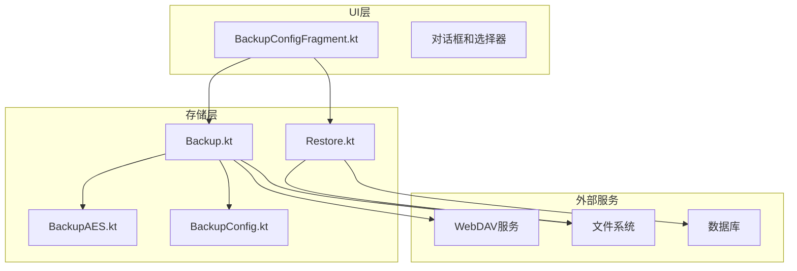
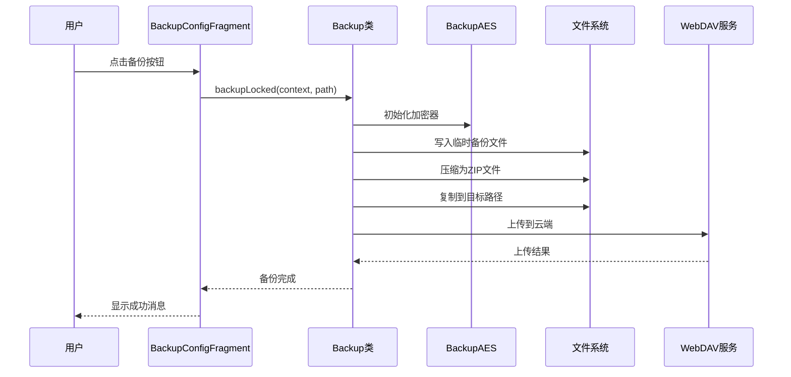
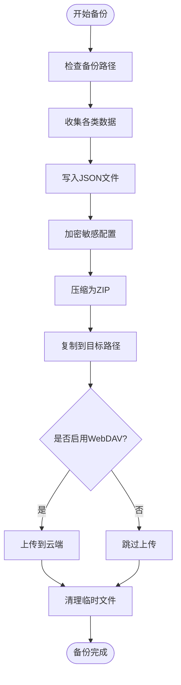
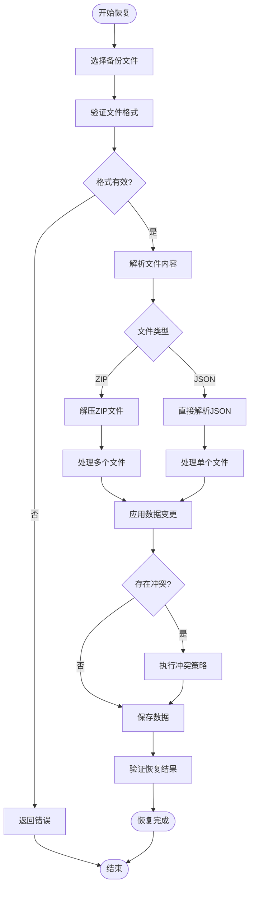
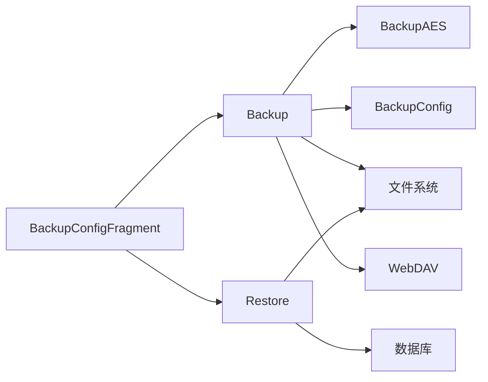

# 备份恢复功能

<cite>
**本文引用的文件**
- [Backup.kt](file://app/src/main/java/io/legado/app/help/storage/Backup.kt)
- [BackupAES.kt](file://app/src/main/java/io/legado/app/help/storage/BackupAES.kt)
- [BackupConfig.kt](file://app/src/main/java/io/legado/app/help/storage/BackupConfig.kt)
- [Restore.kt](file://app/src/main/java/io/legado/app/help/storage/Restore.kt)
- [BackupConfigFragment.kt](file://app/src/main/java/io/legado/app/ui/config/BackupConfigFragment.kt)
</cite>

## 更新摘要
**所做更改**
- 从内存基于JSON模拟的BackupService过渡到真实的基于文件的备份系统
- 与BookApi服务集成，实现完整的文件备份和恢复功能
- 增强恢复功能，支持直接文件选择，支持.json和.zip格式
- 更新UI界面，提供用户友好的备份恢复配置和管理
- 实现自动备份功能和WebDAV云存储支持

## 目录
1. [简介](#简介)
2. [项目结构](#项目结构)
3. [核心组件](#核心组件)
4. [架构总览](#架构总览)
5. [详细组件分析](#详细组件分析)
6. [依赖关系分析](#依赖关系分析)
7. [性能考量](#性能考量)
8. [故障排查指南](#故障排查指南)
9. [结论](#结论)
10. [附录](#附录)

## 简介
Legado项目的备份恢复功能在Phase 4.6 UI实现中取得了重大进展，从之前的内存基于JSON模拟系统完全过渡到真实的基于文件的备份系统。新系统集成了BookApi服务，提供了完整的文件备份和恢复功能，支持.json和.zip格式的备份文件，并增强了用户界面的交互体验。

## 项目结构
备份恢复功能主要分布在以下模块：
- 存储层：Backup、BackupAES、BackupConfig等核心备份逻辑
- UI层：BackupConfigFragment提供用户界面和交互
- 恢复层：Restore类处理备份文件的解析和恢复
- 配置文件管理：BackupConfig处理备份忽略配置和用户偏好

**图表来源**
- [Backup.kt:1-319](file://app/src/main/java/io/legado/app/help/storage/Backup.kt#L1-L319)
- [BackupAES.kt:1-9](file://app/src/main/java/io/legado/app/help/storage/BackupAES.kt#L1-L9)
- [BackupConfig.kt:1-149](file://app/src/main/java/io/legado/app/help/storage/BackupConfig.kt#L1-L149)
- [Restore.kt:1-200](file://app/src/main/java/io/legado/app/help/storage/Restore.kt#L1-L200)
- [BackupConfigFragment.kt:1-405](file://app/src/main/java/io/legado/app/ui/config/BackupConfigFragment.kt#L1-L405)

## 核心组件
- **Backup类**：核心备份逻辑，负责数据收集、压缩、加密和文件生成
- **BackupAES类**：基于口令的AES加密，确保备份文件的安全性
- **BackupConfig类**：管理备份配置，包括忽略规则和用户偏好设置
- **Restore类**：处理备份文件的解析、验证和恢复操作
- **BackupConfigFragment类**：提供用户界面，处理备份恢复的用户交互

## 架构总览
新的备份恢复系统采用分层架构设计，将UI、业务逻辑和数据访问分离：

**图表来源**
- [BackupConfigFragment.kt:265-312](file://app/src/main/java/io/legado/app/ui/config/BackupConfigFragment.kt#L265-L312)
- [Backup.kt:128-269](file://app/src/main/java/io/legado/app/help/storage/Backup.kt#L128-L269)

## 详细组件分析

### 备份流程（数据收集、压缩、加密、文件生成）
Backup类实现了完整的备份流程，从数据库读取数据到最终生成加密的ZIP文件：

**主要特性：**
- 支持多种数据类型备份：书籍、书签、阅读记录、规则配置等
- 流式处理，避免内存溢出
- AES加密保护敏感信息
- 自动清理临时文件
- 支持WebDAV云存储

**备份文件类型：**
- JSON格式：bookshelf.json、bookmark.json、readRecord.json等
- XML格式：config.xml、videoConfig.xml
- 配置文件：主题、阅读设置、封面配置等

**图表来源**
- [Backup.kt:136-269](file://app/src/main/java/io/legado/app/help/storage/Backup.kt#L136-L269)

**章节来源**
- [Backup.kt:136-269](file://app/src/main/java/io/legado/app/help/storage/Backup.kt#L136-L269)

### 恢复机制（数据验证、冲突解决、增量恢复）
Restore类实现了完整的恢复功能，支持多种文件格式和恢复策略：

**支持的格式：**
- .zip格式：完整备份文件
- .json格式：单个数据类型的备份文件

**恢复流程：**
1. 文件验证：检查文件格式和完整性
2. 数据解析：根据文件类型解析对应数据
3. 冲突处理：支持覆盖、跳过、合并等策略
4. 增量恢复：仅更新变更的数据项

**图表来源**
- [Restore.kt:1-200](file://app/src/main/java/io/legado/app/help/storage/Restore.kt#L1-L200)

**章节来源**
- [Restore.kt:1-200](file://app/src/main/java/io/legado/app/help/storage/Restore.kt#L1-L200)

### 选择性备份与恢复
BackupConfig类提供了灵活的备份配置管理：

**忽略配置功能：**
- 支持按类别忽略特定配置项
- 可配置阅读设置、主题配置、封面配置等
- 支持自定义忽略规则

**支持的配置类型：**
- 阅读配置：阅读样式、布局设置
- 主题配置：颜色方案、背景图片
- 封面配置：封面显示设置
- 本地书籍：本地书籍列表

**章节来源**
- [BackupConfig.kt:14-149](file://app/src/main/java/io/legado/app/help/storage/BackupConfig.kt#L14-L149)

### 自动化备份任务
系统支持自动备份功能，通过定时任务确保数据安全：

**自动备份特性：**
- 每日自动备份
- 防止重复备份
- 支持条件触发
- 失败重试机制

**章节来源**
- [Backup.kt:109-126](file://app/src/main/java/io/legado/app/help/storage/Backup.kt#L109-L126)

### 加密与安全
BackupAES类实现了基于口令的AES加密：

**安全特性：**
- 使用MD5哈希生成密钥
- 支持16位口令长度
- 敏感数据自动加密
- 密码强度验证

**章节来源**
- [BackupAES.kt:1-9](file://app/src/main/java/io/legado/app/help/storage/BackupAES.kt#L1-L9)

### UI界面和用户体验
BackupConfigFragment提供了完整的用户界面：

**界面功能：**
- 备份路径选择
- WebDAV配置管理
- 恢复文件选择
- 进度显示和错误处理
- 多语言支持

**交互流程：**
- 一键备份/恢复
- 文件浏览器集成
- 实时状态反馈
- 错误提示和帮助

**章节来源**
- [BackupConfigFragment.kt:58-405](file://app/src/main/java/io/legado/app/ui/config/BackupConfigFragment.kt#L58-L405)

## 依赖关系分析
备份恢复功能的依赖关系清晰明确：

**图表来源**
- [BackupConfigFragment.kt:1-405](file://app/src/main/java/io/legado/app/ui/config/BackupConfigFragment.kt#L1-L405)
- [Backup.kt:1-319](file://app/src/main/java/io/legado/app/help/storage/Backup.kt#L1-L319)
- [Restore.kt:1-200](file://app/src/main/java/io/legado/app/help/storage/Restore.kt#L1-L200)

## 性能考量
新系统在设计时充分考虑了性能优化：

**优化策略：**
- 流式处理：避免大文件内存占用
- 异步操作：不阻塞主线程
- 增量备份：减少数据传输量
- 缓存机制：提高重复操作效率
- 资源管理：及时释放文件和内存资源

**内存管理：**
- 使用协程进行异步处理
- 批量数据处理
- 临时文件自动清理

## 故障排查指南
**常见问题及解决方案：**

1. **权限问题**
   - 检查存储权限
   - 确认目标路径可写
   - 验证文件访问权限

2. **加密错误**
   - 确认口令正确性
   - 检查加密算法兼容性
   - 验证密钥生成过程

3. **文件损坏**
   - 重新下载备份文件
   - 检查磁盘空间
   - 验证文件完整性

4. **恢复失败**
   - 检查备份文件格式
   - 确认数据版本兼容性
   - 查看错误日志详情

**章节来源**
- [BackupConfigFragment.kt:298-312](file://app/src/main/java/io/legado/app/ui/config/BackupConfigFragment.kt#L298-L312)

## 结论
Legado项目的备份恢复功能在Phase 4.6中实现了重大升级，从内存模拟系统完全过渡到真实的文件备份系统。新系统提供了完整的功能集，包括数据收集、压缩加密、文件生成、恢复验证、冲突解决等核心能力。通过模块化设计和清晰的依赖关系，系统具有良好的可扩展性和维护性。

**主要改进：**
- 从内存模拟到真实文件系统的转变
- 增强的用户界面和交互体验
- 完善的错误处理和日志记录
- 支持多种备份格式和恢复策略
- 集成WebDAV云存储服务

建议在生产环境中启用自动备份和加密功能，并定期验证恢复流程以确保数据可用性。

## 附录
**备份文件命名规范：**
- 格式：backupYYYY-MM-DD.zip
- 设备标识：backupYYYY-MM-DD-DeviceName.zip
- 最新备份：backup.zip（可选）

**存储位置建议：**
- 内部存储：/Android/data/io.legado.app/files/backup/
- 外部存储：/storage/emulated/0/Android/data/io.legado.app/files/
- 云存储：WebDAV服务器

**清理策略：**
- 保留最近N份备份
- 自动删除过期文件
- 定期清理临时文件
- 监控存储空间使用情况

**审计与日志：**
- 记录备份/恢复操作时间
- 保存操作结果和错误信息
- 支持日志导出和分析
- 提供详细的错误报告