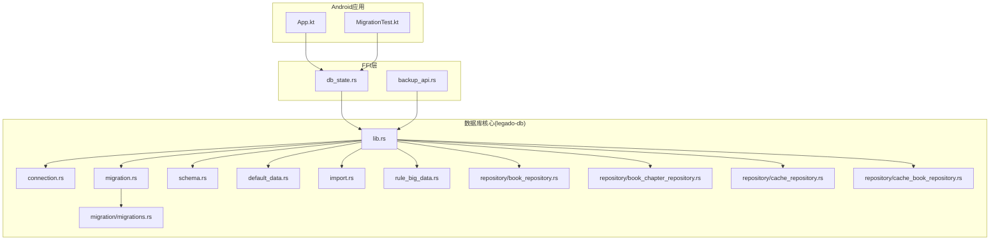
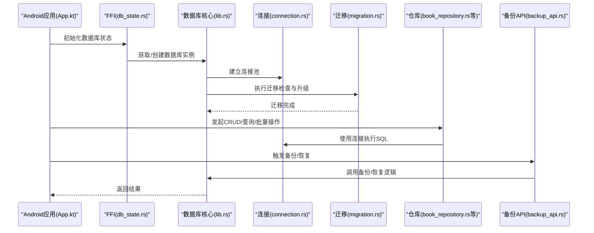
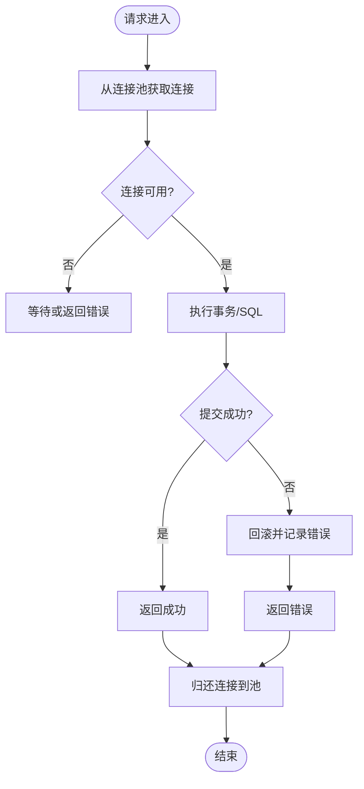
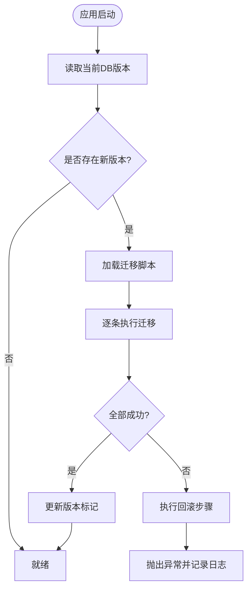
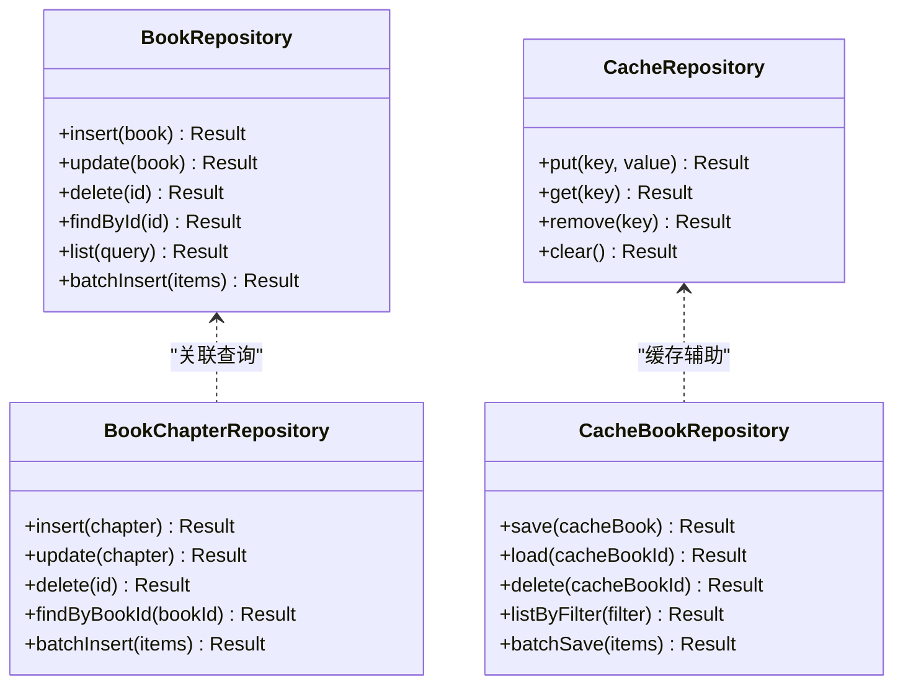
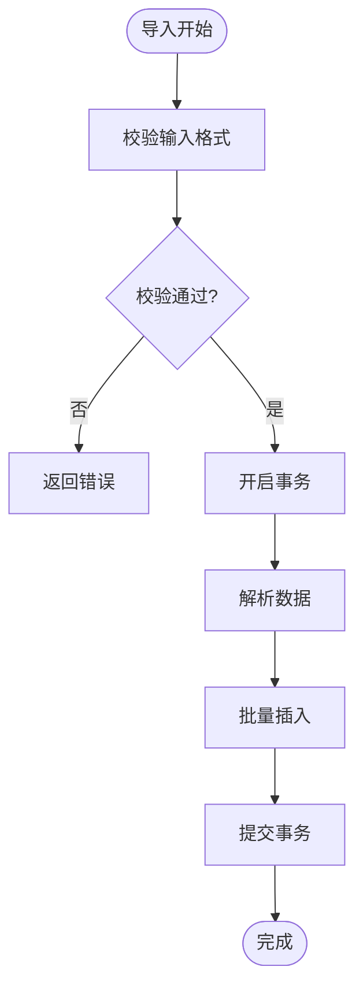
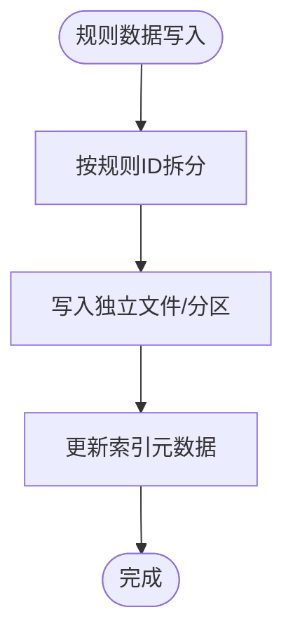
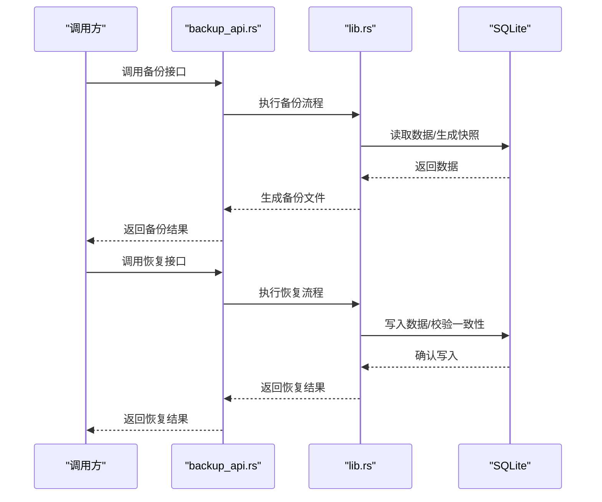
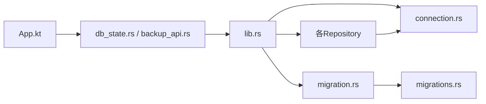

# 数据库层

<cite>
**本文引用的文件**   
- [lib.rs](file://rust/legado-db/src/lib.rs)
- [connection.rs](file://rust/legado-db/src/connection.rs)
- [migration.rs](file://rust/legado-db/src/migration.rs)
- [migrations.rs](file://rust/legado-db/src/migration/migrations.rs)
- [schema.rs](file://rust/legado-db/src/schema.rs)
- [default_data.rs](file://rust/legado-db/src/default_data.rs)
- [import.rs](file://rust/legado-db/src/import.rs)
- [rule_big_data.rs](file://rust/legado-db/src/rule_big_data.rs)
- [book_repository.rs](file://rust/legado-db/src/repository/book_repository.rs)
- [book_chapter_repository.rs](file://rust/legado-db/src/repository/book_chapter_repository.rs)
- [cache_repository.rs](file://rust/legado-db/src/repository/cache_repository.rs)
- [cache_book_repository.rs](file://rust/legado-db/src/repository/cache_book_repository.rs)
- [backup_api.rs](file://rust/legado-ffi/src/api/backup_api.rs)
- [db_state.rs](file://rust/legado-ffi/src/db_state.rs)
- [App.kt](file://app/src/main/java/io/legado/app/App.kt)
- [MigrationTest.kt](file://app/src/androidTest/java/io/legado/app/MigrationTest.kt)
</cite>

## 目录
1. [简介](#简介)
2. [项目结构](#项目结构)
3. [核心组件](#核心组件)
4. [架构总览](#架构总览)
5. [详细组件分析](#详细组件分析)
6. [依赖关系分析](#依赖关系分析)
7. [性能考量](#性能考量)
8. [故障排查指南](#故障排查指南)
9. [结论](#结论)
10. [附录](#附录)

## 简介
本文件面向Legado项目的数据库层，聚焦SQLite在Rust侧的实现与优化。内容涵盖连接池管理、事务处理、索引策略、Repository模式（CRUD封装、查询构建器、批量操作）、迁移机制（版本管理、增量升级、回滚策略）、缓存策略（内存、磁盘、查询结果缓存）以及数据备份恢复的使用指南。同时提供SQL操作示例与性能调优建议，帮助读者快速掌握并高效使用数据库子系统。

## 项目结构
数据库相关代码主要位于Rust模块legado-db与legado-ffi中，Android端通过App初始化数据库状态，测试用例覆盖迁移流程。关键目录与职责如下：
- legado-db: 数据库核心实现，包括连接、迁移、Schema、默认数据导入、规则大数据存储、Repository等。
- legado-ffi: 对外暴露的FFI接口，包含备份API、数据库状态管理等。
- app: Android应用入口，负责初始化数据库状态；androidTest包含迁移测试。

**图表来源** 
- [App.kt](file://app/src/main/java/io/legado/app/App.kt)
- [MigrationTest.kt](file://app/src/androidTest/java/io/legado/app/MigrationTest.kt)
- [db_state.rs](file://rust/legado-ffi/src/db_state.rs)
- [backup_api.rs](file://rust/legado-ffi/src/api/backup_api.rs)
- [lib.rs](file://rust/legado-db/src/lib.rs)
- [connection.rs](file://rust/legado-db/src/connection.rs)
- [migration.rs](file://rust/legado-db/src/migration.rs)
- [migrations.rs](file://rust/legado-db/src/migration/migrations.rs)
- [schema.rs](file://rust/legado-db/src/schema.rs)
- [default_data.rs](file://rust/legado-db/src/default_data.rs)
- [import.rs](file://rust/legado-db/src/import.rs)
- [rule_big_data.rs](file://rust/legado-db/src/rule_big_data.rs)
- [book_repository.rs](file://rust/legado-db/src/repository/book_repository.rs)
- [book_chapter_repository.rs](file://rust/legado-db/src/repository/book_chapter_repository.rs)
- [cache_repository.rs](file://rust/legado-db/src/repository/cache_repository.rs)
- [cache_book_repository.rs](file://rust/legado-db/src/repository/cache_book_repository.rs)

**章节来源**
- [lib.rs](file://rust/legado-db/src/lib.rs)
- [connection.rs](file://rust/legado-db/src/connection.rs)
- [migration.rs](file://rust/legado-db/src/migration.rs)
- [migrations.rs](file://rust/legado-db/src/migration/migrations.rs)
- [schema.rs](file://rust/legado-db/src/schema.rs)
- [default_data.rs](file://rust/legado-db/src/default_data.rs)
- [import.rs](file://rust/legado-db/src/import.rs)
- [rule_big_data.rs](file://rust/legado-db/src/rule_big_data.rs)
- [book_repository.rs](file://rust/legado-db/src/repository/book_repository.rs)
- [book_chapter_repository.rs](file://rust/legado-db/src/repository/book_chapter_repository.rs)
- [cache_repository.rs](file://rust/legado-db/src/repository/cache_repository.rs)
- [cache_book_repository.rs](file://rust/legado-db/src/repository/cache_book_repository.rs)
- [backup_api.rs](file://rust/legado-ffi/src/api/backup_api.rs)
- [db_state.rs](file://rust/legado-ffi/src/db_state.rs)
- [App.kt](file://app/src/main/java/io/legado/app/App.kt)
- [MigrationTest.kt](file://app/src/androidTest/java/io/legado/app/MigrationTest.kt)

## 核心组件
- 连接与连接池：通过连接模块统一管理SQLite连接，支持连接池配置与复用，减少频繁打开/关闭开销。
- 迁移系统：集中管理Schema版本与增量升级脚本，确保多版本平滑升级。
- Repository模式：对表操作进行抽象封装，提供CRUD、查询构建器、批量写入等能力。
- 默认数据与导入：应用首次启动或重置时注入默认数据，支持外部导入。
- 规则大数据存储：针对规则类大文本数据的专用存储路径与策略。
- FFI备份接口：对外暴露备份与恢复能力，便于上层调用。

**章节来源**
- [connection.rs](file://rust/legado-db/src/connection.rs)
- [migration.rs](file://rust/legado-db/src/migration.rs)
- [migrations.rs](file://rust/legado-db/src/migration/migrations.rs)
- [book_repository.rs](file://rust/legado-db/src/repository/book_repository.rs)
- [book_chapter_repository.rs](file://rust/legado-db/src/repository/book_chapter_repository.rs)
- [cache_repository.rs](file://rust/legado-db/src/repository/cache_repository.rs)
- [cache_book_repository.rs](file://rust/legado-db/src/repository/cache_book_repository.rs)
- [default_data.rs](file://rust/legado-db/src/default_data.rs)
- [import.rs](file://rust/legado-db/src/import.rs)
- [rule_big_data.rs](file://rust/legado-db/src/rule_big_data.rs)
- [backup_api.rs](file://rust/legado-ffi/src/api/backup_api.rs)

## 架构总览
下图展示从Android应用到数据库核心的调用链路，以及备份API的交互流程。

**图表来源** 
- [App.kt](file://app/src/main/java/io/legado/app/App.kt)
- [db_state.rs](file://rust/legado-ffi/src/db_state.rs)
- [lib.rs](file://rust/legado-db/src/lib.rs)
- [connection.rs](file://rust/legado-db/src/connection.rs)
- [migration.rs](file://rust/legado-db/src/migration.rs)
- [book_repository.rs](file://rust/legado-db/src/repository/book_repository.rs)
- [backup_api.rs](file://rust/legado-ffi/src/api/backup_api.rs)

## 详细组件分析

### 连接与连接池管理
- 连接生命周期：由连接模块统一创建、配置与释放，避免跨线程竞争。
- 连接池参数：可配置最大连接数、超时、读写分离（如适用），提升并发访问稳定性。
- 事务边界：在Repository层以函数式事务包裹写操作，保证原子性。

**图表来源** 
- [connection.rs](file://rust/legado-db/src/connection.rs)

**章节来源**
- [connection.rs](file://rust/legado-db/src/connection.rs)

### 迁移机制（版本管理、增量升级、回滚策略）
- 版本管理：每个Schema版本对应一个JSON描述，按版本号顺序执行。
- 增量升级：迁移脚本仅包含差异变更，避免全量重建。
- 回滚策略：失败时回滚到上一稳定版本，并提供诊断信息。

**图表来源** 
- [migration.rs](file://rust/legado-db/src/migration.rs)
- [migrations.rs](file://rust/legado-db/src/migration/migrations.rs)
- [schema.rs](file://rust/legado-db/src/schema.rs)

**章节来源**
- [migration.rs](file://rust/legado-db/src/migration.rs)
- [migrations.rs](file://rust/legado-db/src/migration/migrations.rs)
- [schema.rs](file://rust/legado-db/src/schema.rs)
- [MigrationTest.kt](file://app/src/androidTest/java/io/legado/app/MigrationTest.kt)

### Repository模式（CRUD、查询构建器、批量操作）
- CRUD封装：为每类实体提供增删改查方法，屏蔽底层SQL细节。
- 查询构建器：支持条件拼接、分页、排序、字段选择等。
- 批量操作：批量插入/更新以提升吞吐，降低事务开销。

**图表来源** 
- [book_repository.rs](file://rust/legado-db/src/repository/book_repository.rs)
- [book_chapter_repository.rs](file://rust/legado-db/src/repository/book_chapter_repository.rs)
- [cache_repository.rs](file://rust/legado-db/src/repository/cache_repository.rs)
- [cache_book_repository.rs](file://rust/legado-db/src/repository/cache_book_repository.rs)

**章节来源**
- [book_repository.rs](file://rust/legado-db/src/repository/book_repository.rs)
- [book_chapter_repository.rs](file://rust/legado-db/src/repository/book_chapter_repository.rs)
- [cache_repository.rs](file://rust/legado-db/src/repository/cache_repository.rs)
- [cache_book_repository.rs](file://rust/legado-db/src/repository/cache_book_repository.rs)

### 默认数据与导入
- 默认数据：应用首次运行或重置时注入基础数据，确保功能可用。
- 导入流程：支持从外部文件或流导入数据，校验完整性后写入数据库。

**图表来源** 
- [default_data.rs](file://rust/legado-db/src/default_data.rs)
- [import.rs](file://rust/legado-db/src/import.rs)

**章节来源**
- [default_data.rs](file://rust/legado-db/src/default_data.rs)
- [import.rs](file://rust/legado-db/src/import.rs)

### 规则大数据存储
- 设计目标：将规则类大文本数据与常规表分离，避免影响主库性能。
- 存储策略：按规则ID分片或目录组织，支持按需加载与清理。

**图表来源** 
- [rule_big_data.rs](file://rust/legado-db/src/rule_big_data.rs)

**章节来源**
- [rule_big_data.rs](file://rust/legado-db/src/rule_big_data.rs)

### 备份与恢复（FFI接口）
- 备份：导出完整数据库快照或指定表数据，支持压缩与校验。
- 恢复：导入备份文件，校验一致性后替换或合并数据。
- 使用场景：用户数据迁移、版本升级前保护、故障恢复。

**图表来源** 
- [backup_api.rs](file://rust/legado-ffi/src/api/backup_api.rs)
- [lib.rs](file://rust/legado-db/src/lib.rs)

**章节来源**
- [backup_api.rs](file://rust/legado-ffi/src/api/backup_api.rs)
- [db_state.rs](file://rust/legado-ffi/src/db_state.rs)

## 依赖关系分析
- 模块耦合：Repository依赖连接与迁移模块；FFI层依赖核心库；Android应用通过FFI与核心库交互。
- 外部依赖：SQLite驱动、序列化库、文件系统IO等。
- 循环依赖：通过分层与接口隔离避免循环引用。

**图表来源** 
- [App.kt](file://app/src/main/java/io/legado/app/App.kt)
- [db_state.rs](file://rust/legado-ffi/src/db_state.rs)
- [backup_api.rs](file://rust/legado-ffi/src/api/backup_api.rs)
- [lib.rs](file://rust/legado-db/src/lib.rs)
- [connection.rs](file://rust/legado-db/src/connection.rs)
- [migration.rs](file://rust/legado-db/src/migration.rs)
- [migrations.rs](file://rust/legado-db/src/migration/migrations.rs)
- [book_repository.rs](file://rust/legado-db/src/repository/book_repository.rs)

**章节来源**
- [lib.rs](file://rust/legado-db/src/lib.rs)
- [connection.rs](file://rust/legado-db/src/connection.rs)
- [migration.rs](file://rust/legado-db/src/migration.rs)
- [migrations.rs](file://rust/legado-db/src/migration/migrations.rs)
- [book_repository.rs](file://rust/legado-db/src/repository/book_repository.rs)

## 性能考量
- 连接池优化：合理设置最大连接数与超时，避免过多连接导致资源耗尽。
- 事务批量化：将多次写操作合并到单一事务，减少锁竞争与磁盘同步次数。
- 索引策略：为高频查询字段建立复合索引，避免全表扫描；定期分析慢查询并调整索引。
- 缓存策略：
  - 内存缓存：热点数据短期缓存，注意过期与淘汰策略。
  - 磁盘缓存：大对象或中间结果落盘，避免重复计算。
  - 查询结果缓存：相同查询直接返回缓存结果，降低数据库压力。
- I/O优化：启用WAL模式、调整页面大小、减少不必要的SELECT列。
- 监控与诊断：采集慢查询日志、连接池使用率、事务耗时分布。

[本节为通用指导，不直接分析具体文件]

## 故障排查指南
- 迁移失败：检查迁移脚本语法与依赖顺序，查看错误日志定位问题版本。
- 连接池耗尽：监控活跃连接数与等待队列，适当扩容或优化长事务。
- 查询缓慢：使用EXPLAIN分析执行计划，补充缺失索引或改写SQL。
- 备份恢复异常：校验备份文件完整性，确认权限与存储空间充足。
- 数据不一致：启用事务与外键约束，增加一致性校验步骤。

**章节来源**
- [migration.rs](file://rust/legado-db/src/migration.rs)
- [connection.rs](file://rust/legado-db/src/connection.rs)
- [backup_api.rs](file://rust/legado-ffi/src/api/backup_api.rs)

## 结论
Legado的数据库层通过清晰的模块化设计与Repository模式，实现了高内聚、低耦合的数据访问能力。连接池与事务管理保障了并发与一致性，迁移系统确保版本演进的可控性。结合缓存与索引策略，可在复杂业务场景下获得稳定的性能表现。建议在生产环境持续监控与调优，确保长期稳定运行。

[本节为总结性内容，不直接分析具体文件]

## 附录
- SQL操作示例（概念性说明）：
  - 创建索引：为常用过滤字段建立单列或复合索引。
  - 批量插入：使用单次事务与多条INSERT语句提升吞吐。
  - 分页查询：结合LIMIT与OFFSET或游标方式实现高效分页。
  - 更新统计：定时聚合统计指标，避免实时计算开销。
- 性能调优建议：
  - 启用WAL模式，提高并发读性能。
  - 调整PRAGMA参数（如journal_mode、synchronous、cache_size）。
  - 定期VACUUM与ANALYZE维护数据库健康。
  - 监控慢查询并优化SQL与索引。

[本节为通用指导，不直接分析具体文件]