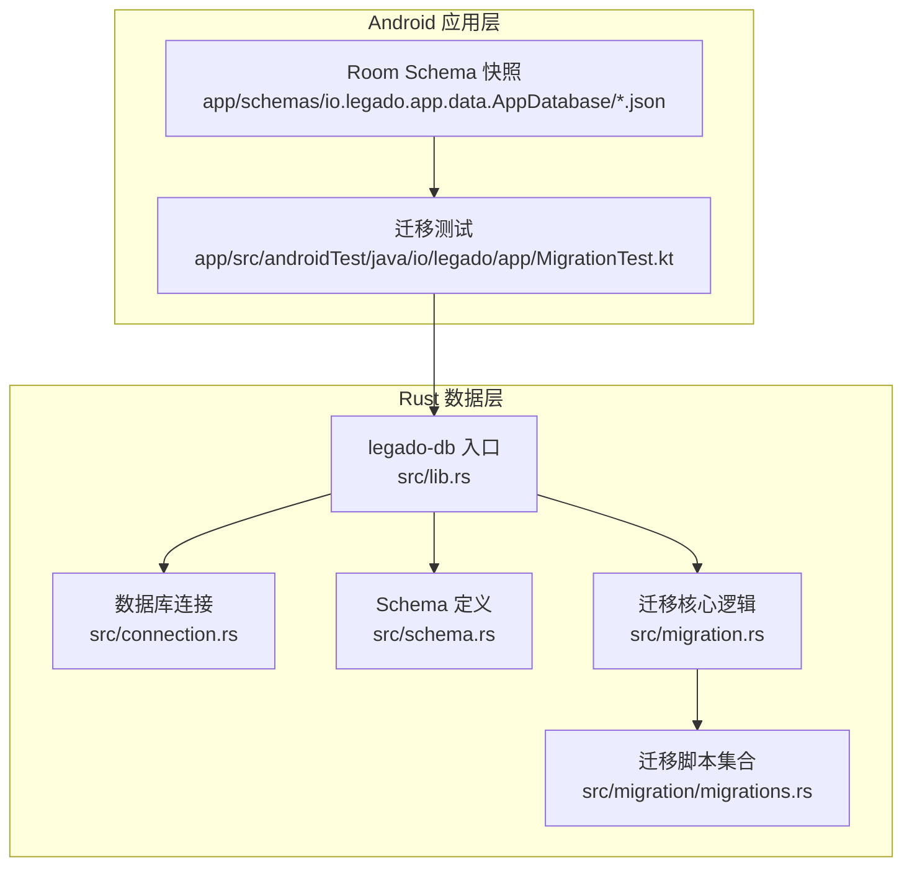
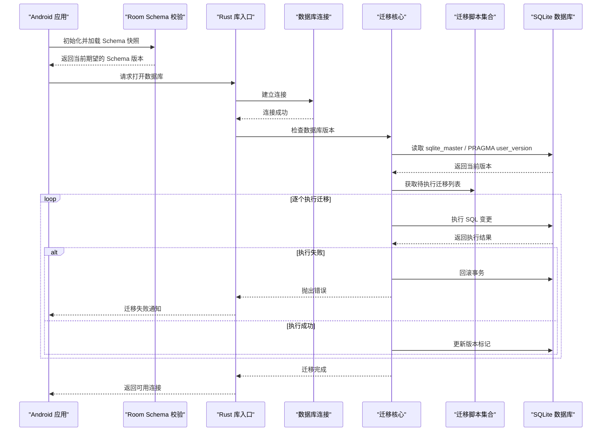
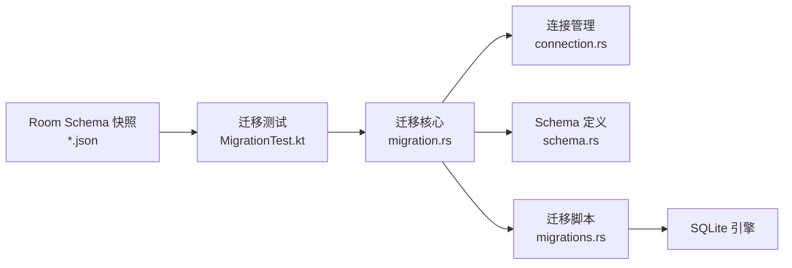

# 数据库迁移机制

<cite>
**本文引用的文件**   
- [migration.rs](file://rust/legado-db/src/migration.rs)
- [migrations.rs](file://rust/legado-db/src/migration/migrations.rs)
- [schema.rs](file://rust/legado-db/src/schema.rs)
- [connection.rs](file://rust/legado-db/src/connection.rs)
- [lib.rs](file://rust/legado-db/src/lib.rs)
- [AppDatabase 1.json](file://app/schemas/io.legado.app.data.AppDatabase/1.json)
- [AppDatabase 95.json](file://app/schemas/io.legado.app.data.AppDatabase/95.json)
- [MigrationTest.kt](file://app/src/androidTest/java/io/legado/app/MigrationTest.kt)
</cite>

## 目录
1. [简介](#简介)
2. [项目结构](#项目结构)
3. [核心组件](#核心组件)
4. [架构总览](#架构总览)
5. [详细组件分析](#详细组件分析)
6. [依赖关系分析](#依赖关系分析)
7. [性能考量](#性能考量)
8. [故障排查指南](#故障排查指南)
9. [结论](#结论)
10. [附录](#附录)

## 简介
本文件系统性阐述 Legado 项目的 SQLite 数据库版本管理与迁移机制，覆盖以下方面：
- 增量升级与 schema 变更检测原理
- 自动迁移执行流程
- 迁移脚本编写规范（SQL 格式、回滚策略）
- 向后兼容性与数据完整性验证
- 迁移失败处理与恢复策略
- 具体迁移示例与最佳实践

本项目在 Android 端使用 Room 生成并维护 JSON 格式的 schema 快照；在 Rust 层通过自定义迁移模块管理 SQLite 数据库的增量升级。两者协同确保跨版本平滑升级与数据一致性。

## 项目结构
与数据库迁移相关的代码主要分布在两个层面：
- Android 应用层：Room 生成的 schema 快照文件位于 app/schemas/io.legado.app.data.AppDatabase 目录下，按版本号命名（如 1.json、95.json）。这些文件用于校验 App 侧实体与数据库结构的兼容性。
- Rust 数据层：legado-db 模块提供连接、schema 定义与迁移逻辑，核心文件包括 connection.rs、schema.rs、migration.rs 以及 migration/migrations.rs。

图表来源 
- [lib.rs](file://rust/legado-db/src/lib.rs)
- [connection.rs](file://rust/legado-db/src/connection.rs)
- [schema.rs](file://rust/legado-db/src/schema.rs)
- [migration.rs](file://rust/legado-db/src/migration.rs)
- [migrations.rs](file://rust/legado-db/src/migration/migrations.rs)
- [AppDatabase 1.json](file://app/schemas/io.legado.app.data.AppDatabase/1.json)
- [AppDatabase 95.json](file://app/schemas/io.legado.app.data.AppDatabase/95.json)
- [MigrationTest.kt](file://app/src/androidTest/java/io/legado/app/MigrationTest.kt)

章节来源
- [lib.rs](file://rust/legado-db/src/lib.rs)
- [connection.rs](file://rust/legado-db/src/connection.rs)
- [schema.rs](file://rust/legado-db/src/schema.rs)
- [migration.rs](file://rust/legado-db/src/migration.rs)
- [migrations.rs](file://rust/legado-db/src/migration/migrations.rs)
- [AppDatabase 1.json](file://app/schemas/io.legado.app.data.AppDatabase/1.json)
- [AppDatabase 95.json](file://app/schemas/io.legado.app.data.AppDatabase/95.json)
- [MigrationTest.kt](file://app/src/androidTest/java/io/legado/app/MigrationTest.kt)

## 核心组件
- 数据库连接管理：负责建立与 SQLite 的连接、事务边界控制、错误传播。
- Schema 定义：集中声明表结构、索引、约束等，作为迁移目标状态。
- 迁移核心：实现版本比对、增量 SQL 生成与执行、回滚与重试。
- 迁移脚本集合：按版本顺序组织的具体 SQL 变更语句，支持条件化与幂等性。
- Android 侧 Schema 快照：Room 生成的 JSON 文件，用于校验 App 层实体与数据库结构的一致性。
- 迁移测试：对关键迁移路径进行端到端验证，确保升级过程稳定可靠。

章节来源
- [connection.rs](file://rust/legado-db/src/connection.rs)
- [schema.rs](file://rust/legado-db/src/schema.rs)
- [migration.rs](file://rust/legado-db/src/migration.rs)
- [migrations.rs](file://rust/legado-db/src/migration/migrations.rs)
- [AppDatabase 1.json](file://app/schemas/io.legado.app.data.AppDatabase/1.json)
- [AppDatabase 95.json](file://app/schemas/io.legado.app.data.AppDatabase/95.json)
- [MigrationTest.kt](file://app/src/androidTest/java/io/legado/app/MigrationTest.kt)

## 架构总览
下图展示了从应用启动到数据库迁移执行的总体流程，涵盖 Android 侧与 Rust 侧的协作关系。

图表来源 
- [connection.rs](file://rust/legado-db/src/connection.rs)
- [migration.rs](file://rust/legado-db/src/migration.rs)
- [migrations.rs](file://rust/legado-db/src/migration/migrations.rs)
- [AppDatabase 1.json](file://app/schemas/io.legado.app.data.AppDatabase/1.json)
- [AppDatabase 95.json](file://app/schemas/io.legado.app.data.AppDatabase/95.json)

## 详细组件分析

### 数据库连接管理（connection.rs）
- 职责：封装 SQLite 连接生命周期、事务开启/提交/回滚、错误码映射。
- 关键点：
  - 连接池或单例模式的选择影响并发与资源占用。
  - 事务边界需严格包裹迁移步骤，保证原子性。
  - 错误信息应包含 SQL 语句、参数与上下文，便于定位问题。

章节来源
- [connection.rs](file://rust/legado-db/src/connection.rs)

### Schema 定义（schema.rs）
- 职责：集中定义所有表、字段、索引、外键与约束，作为迁移的目标状态。
- 关键点：
  - 新增字段应设置默认值，避免破坏旧数据。
  - 删除列或表前必须评估历史数据影响，必要时保留过渡期。
  - 索引与约束变更需考虑性能与锁竞争。

章节来源
- [schema.rs](file://rust/legado-db/src/schema.rs)

### 迁移核心逻辑（migration.rs）
- 职责：比较当前数据库版本与目标版本，生成并执行增量迁移。
- 关键点：
  - 版本检测：读取 sqlite_master 或 PRAGMA user_version。
  - 增量生成：基于 schema 差异计算最小变更集。
  - 执行策略：逐条执行 SQL，失败即回滚并记录日志。
  - 幂等性：迁移脚本应具备可重复执行能力，避免重复变更。

章节来源
- [migration.rs](file://rust/legado-db/src/migration.rs)

### 迁移脚本集合（migrations.rs）
- 职责：按版本顺序组织 SQL 变更语句，支持条件分支与数据修复。
- 关键点：
  - 每个版本对应一个迁移块，包含 CREATE/ALTER/DROP/INSERT/UPDATE/DELETE。
  - 复杂变更应拆分为多个小步骤，降低单次事务风险。
  - 数据迁移需验证约束，避免引入脏数据。

章节来源
- [migrations.rs](file://rust/legado-db/src/migration/migrations.rs)

### Android 侧 Schema 快照（Room）
- 职责：Room 编译时生成 JSON 快照，用于运行时校验实体与数据库结构一致性。
- 关键点：
  - 每次实体变更需重新生成快照，确保版本对齐。
  - 快照文件按版本号递增，便于追踪历史结构。
  - 测试中可使用快照验证迁移路径的正确性。

章节来源
- [AppDatabase 1.json](file://app/schemas/io.legado.app.data.AppDatabase/1.json)
- [AppDatabase 95.json](file://app/schemas/io.legado.app.data.AppDatabase/95.json)
- [MigrationTest.kt](file://app/src/androidTest/java/io/legado/app/MigrationTest.kt)

### 迁移测试（MigrationTest.kt）
- 职责：对关键迁移路径进行端到端测试，确保升级过程稳定。
- 关键点：
  - 模拟从任意旧版本升级到最新版本。
  - 验证数据完整性与业务逻辑正确性。
  - 捕获异常并输出详细诊断信息。

章节来源
- [MigrationTest.kt](file://app/src/androidTest/java/io/legado/app/MigrationTest.kt)

## 依赖关系分析
迁移系统内部依赖清晰，外部耦合度低，便于独立演进与维护。

图表来源 
- [migration.rs](file://rust/legado-db/src/migration.rs)
- [connection.rs](file://rust/legado-db/src/connection.rs)
- [schema.rs](file://rust/legado-db/src/schema.rs)
- [migrations.rs](file://rust/legado-db/src/migration/migrations.rs)
- [AppDatabase 1.json](file://app/schemas/io.legado.app.data.AppDatabase/1.json)
- [AppDatabase 95.json](file://app/schemas/io.legado.app.data.AppDatabase/95.json)
- [MigrationTest.kt](file://app/src/androidTest/java/io/legado/app/MigrationTest.kt)

章节来源
- [migration.rs](file://rust/legado-db/src/migration.rs)
- [connection.rs](file://rust/legado-db/src/connection.rs)
- [schema.rs](file://rust/legado-db/src/schema.rs)
- [migrations.rs](file://rust/legado-db/src/migration/migrations.rs)
- [AppDatabase 1.json](file://app/schemas/io.legado.app.data.AppDatabase/1.json)
- [AppDatabase 95.json](file://app/schemas/io.legado.app.data.AppDatabase/95.json)
- [MigrationTest.kt](file://app/src/androidTest/java/io/legado/app/MigrationTest.kt)

## 性能考量
- 批量操作：将多条 SQL 合并为单个事务，减少磁盘 I/O 与锁竞争。
- 索引优化：在大批量插入前禁用非必要索引，完成后重建。
- 内存管理：避免一次性加载大量数据到内存，采用流式处理。
- 监控指标：记录迁移耗时、失败率、回滚次数，用于性能调优。

[本节为通用指导，不直接分析具体文件]

## 故障排查指南
- 常见错误：
  - 语法错误：检查 SQL 语句是否符合 SQLite 方言。
  - 约束冲突：验证数据是否满足唯一性、非空等约束。
  - 权限不足：确认数据库文件读写权限。
  - 版本不一致：确保 Room 快照与 Rust 迁移版本同步。
- 诊断步骤：
  - 启用详细日志，捕获完整 SQL 与错误堆栈。
  - 使用 PRAGMA 命令检查数据库状态。
  - 回滚到上一版本，逐步缩小问题范围。
- 恢复策略：
  - 备份数据库文件，防止数据丢失。
  - 使用回滚脚本恢复到稳定状态。
  - 修正迁移脚本后重新执行。

章节来源
- [migration.rs](file://rust/legado-db/src/migration.rs)
- [connection.rs](file://rust/legado-db/src/connection.rs)

## 结论
Legado 的数据库迁移机制通过 Android 侧 Room Schema 快照与 Rust 侧增量迁移相结合，实现了安全、可靠、可追溯的版本管理。遵循本文档的编写规范与实践建议，可有效降低迁移风险，保障数据完整性与系统稳定性。

[本节为总结性内容，不直接分析具体文件]

## 附录

### 迁移脚本编写规范
- SQL 格式：
  - 使用标准 SQL 语法，避免方言特性。
  - 每条语句以分号结尾，注释清晰说明变更目的。
- 幂等性：
  - 使用 IF NOT EXISTS、ON CONFLICT DO NOTHING 等机制。
  - 避免重复创建对象或插入重复数据。
- 回滚机制：
  - 每个迁移块包裹在事务中，失败自动回滚。
  - 提供反向操作脚本，便于手动恢复。
- 数据完整性：
  - 变更前验证数据质量，清理无效记录。
  - 变更后执行完整性检查，确保约束满足。

[本节为通用规范，不直接分析具体文件]

### 向后兼容性保证
- 新增字段：设置默认值，允许为空。
- 删除字段：先标记废弃，再在后续版本移除。
- 重命名列：通过中间表或视图过渡。
- 数据类型变更：保持隐式转换兼容，必要时显式转换。

[本节为通用原则，不直接分析具体文件]

### 数据完整性验证
- 约束检查：运行 PRAGMA foreign_keys=ON 验证外键。
- 统计校验：对比迁移前后记录数、聚合值。
- 业务验证：执行关键查询，确保结果符合预期。

[本节为通用方法，不直接分析具体文件]

### 迁移失败处理与恢复策略
- 自动回滚：事务内任何错误触发回滚。
- 错误分类：区分可重试与不可重试错误。
- 人工干预：提供降级路径与手动修复工具。
- 监控告警：记录失败事件并通知运维人员。

[本节为通用策略，不直接分析具体文件]

### 具体迁移示例
- 添加新表：CREATE TABLE IF NOT EXISTS ...
- 修改表结构：ALTER TABLE ... ADD COLUMN ...
- 数据迁移：UPDATE ... SET ... WHERE ...
- 删除对象：DROP TABLE IF EXISTS ...

[本节为示例说明，不直接分析具体文件]

### 最佳实践指南
- 小步快跑：每次变更尽量小，降低风险。
- 充分测试：覆盖正向与逆向迁移路径。
- 文档齐全：记录变更原因、影响范围、回滚步骤。
- 灰度发布：先在测试环境验证，再逐步推广。

[本节为最佳实践，不直接分析具体文件]