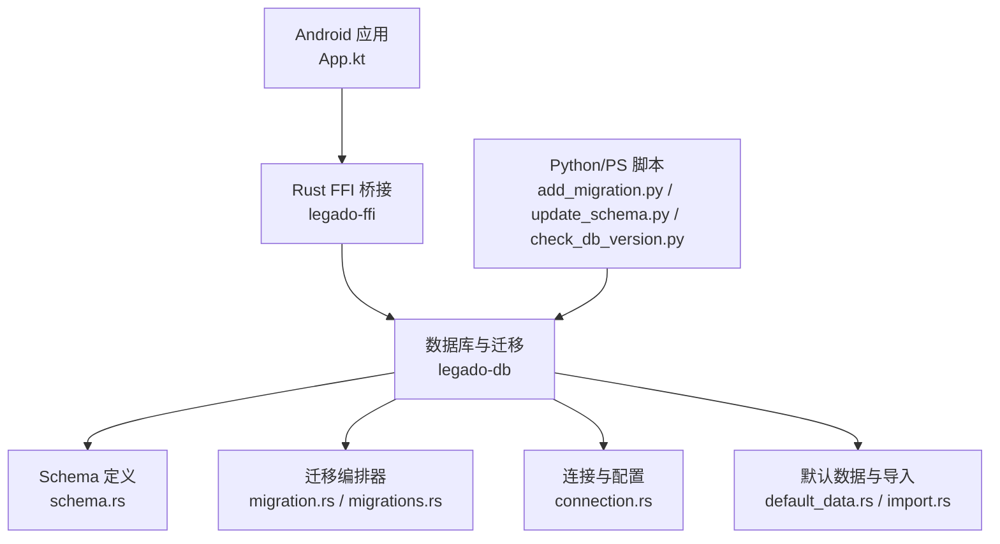
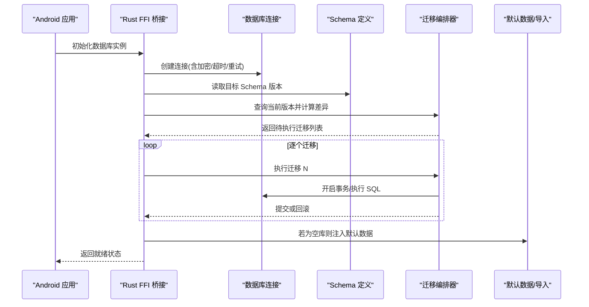
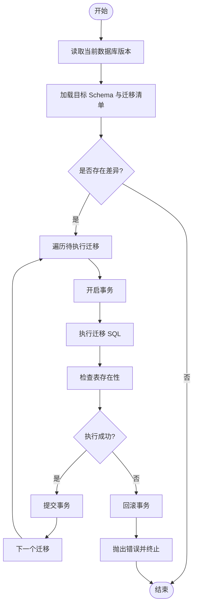
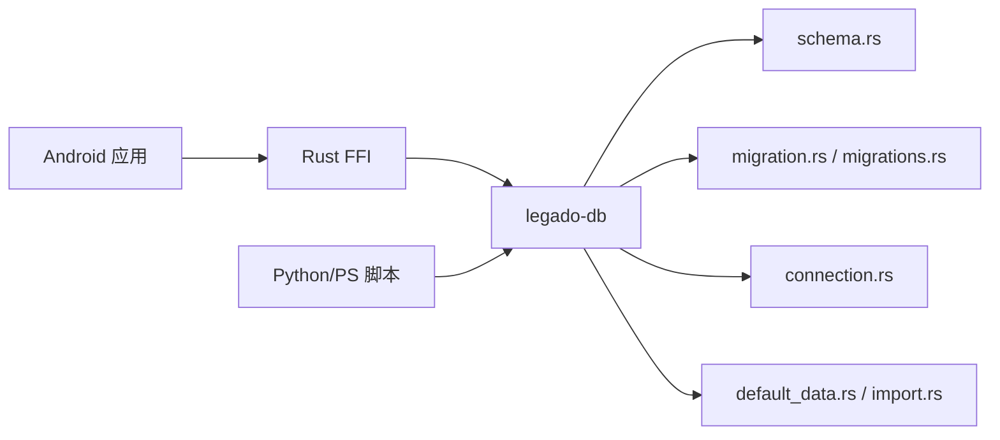

# 数据库迁移系统

<cite>
**本文引用的文件**   
- [README.md](file://README.md)
- [MIGRATION_WORKFLOW.md](file://rust/MIGRATION_WORKFLOW.md)
- [PROGRESS.md](file://rust/PROGRESS.md)
- [add_migration.py](file://rust/add_migration.py)
- [update_schema.py](file://rust/update_schema.py)
- [update_rss_schema.ps1](file://rust/update_schema_rss.ps1)
- [check_db_version.py](file://check_db_version.py)
- [test_migration.rs](file://rust/test_migration.rs)
- [lib.rs](file://rust/legado-db/src/lib.rs)
- [migration.rs](file://rust/legado-db/src/migration.rs)
- [schema.rs](file://rust/legado-db/src/schema.rs)
- [connection.rs](file://rust/legado-db/src/connection.rs)
- [default_data.rs](file://rust/legado-db/src/default_data.rs)
- [import.rs](file://rust/legado-db/src/import.rs)
- [rule_big_data.rs](file://rust/legado-db/src/rule_big_data.rs)
- [migrations.rs](file://rust/legado-db/src/migration/migrations.rs)
- [App.kt](file://app/src/main/java/io/legado/app/App.kt)
- [MigrationTest.kt](file://app/src/androidTest/java/io/legado/app/MigrationTest.kt)
</cite>

## 更新摘要
**所做更改**   
- 增强了 Migration95To96 模块的表存在性检查功能
- 改进了测试断言机制，确保所有9个迁移测试都能成功通过
- 更新了迁移编排器的健壮性和错误处理逻辑
- 优化了数据库迁移过程中的数据完整性验证

## 目录
1. [简介](#简介)
2. [项目结构](#项目结构)
3. [核心组件](#核心组件)
4. [架构总览](#架构总览)
5. [详细组件分析](#详细组件分析)
6. [依赖关系分析](#依赖关系分析)
7. [性能考虑](#性能考虑)
8. [故障排查指南](#故障排查指南)
9. [结论](#结论)
10. [附录](#附录)

## 简介
本仓库包含一个跨平台的"数据库迁移系统"，用于在应用版本升级时，对本地 SQLite 数据库进行安全、可追踪的演进。系统由 Android/Kotlin 层与 Rust/SQLite 层共同组成：
- Kotlin/Android 侧负责应用启动时的数据库初始化、版本探测与迁移入口调用。
- Rust 侧通过 SQLx/SQLCipher 等工具链管理 schema 定义、增量迁移脚本与数据导入/默认数据注入。
- 同时提供 Python/PowerShell 辅助脚本，用于自动生成或更新迁移元数据、RSS Schema 同步与版本校验。

该文档面向开发者与维护者，既提供高层架构说明，也深入到关键模块的实现要点、数据流与错误处理策略，帮助读者快速理解并扩展迁移能力。

## 项目结构
从根目录可见，数据库相关代码主要分布在以下位置：
- app（Android 应用）：包含 App 初始化、测试用例与资源。
- rust（Rust 核心库）：包含 legado-db（数据库与迁移）、legado-core（领域模型）、legado-ffi（桥接）、legado-server（Web 服务）等。
- 根级脚本：用于版本检查与迁移辅助。

图表来源
- [App.kt](file://app/src/main/java/io/legado/app/App.kt)
- [lib.rs](file://rust/legado-db/src/lib.rs)
- [migration.rs](file://rust/legado-db/src/migration.rs)
- [schema.rs](file://rust/legado-db/src/schema.rs)
- [connection.rs](file://rust/legado-db/src/connection.rs)
- [default_data.rs](file://rust/legado-db/src/default_data.rs)
- [import.rs](file://rust/legado-db/src/import.rs)
- [add_migration.py](file://rust/add_migration.py)
- [update_schema.py](file://rust/update_schema.py)
- [check_db_version.py](file://check_db_version.py)

章节来源
- [README.md](file://README.md)
- [MIGRATION_WORKFLOW.md](file://rust/MIGRATION_WORKFLOW.md)
- [PROGRESS.md](file://rust/PROGRESS.md)

## 核心组件
- 数据库连接与配置：负责建立加密/非加密连接、事务边界与连接池参数。
- Schema 定义：集中描述表结构、索引与约束，作为迁移的目标状态。
- 迁移编排器：按版本号顺序执行增量迁移，支持回滚策略与幂等性保障。
- 默认数据与导入：在首次安装或空库时注入初始数据，或在迁移中修复历史数据。
- 版本检测与校验：确保当前数据库版本与预期一致，避免不兼容升级。
- 测试与验证：覆盖迁移路径、数据完整性与异常场景。

章节来源
- [lib.rs](file://rust/legado-db/src/lib.rs)
- [schema.rs](file://rust/legado-db/src/schema.rs)
- [migration.rs](file://rust/legado-db/src/migration.rs)
- [connection.rs](file://rust/legado-db/src/connection.rs)
- [default_data.rs](file://rust/legado-db/src/default_data.rs)
- [import.rs](file://rust/legado-db/src/import.rs)

## 架构总览
下图展示了从应用启动到数据库迁移执行的端到端流程，以及各模块之间的职责边界。

图表来源
- [App.kt](file://app/src/main/java/io/legado/app/App.kt)
- [lib.rs](file://rust/legado-db/src/lib.rs)
- [connection.rs](file://rust/legado-db/src/connection.rs)
- [schema.rs](file://rust/legado-db/src/schema.rs)
- [migration.rs](file://rust/legado-db/src/migration.rs)
- [default_data.rs](file://rust/legado-db/src/default_data.rs)
- [import.rs](file://rust/legado-db/src/import.rs)

## 详细组件分析

### 数据库连接与配置
- 职责：封装底层连接细节，包括加密引擎选择、连接池大小、超时与重试策略。
- 关键点：
  - 连接生命周期与应用进程绑定，避免频繁创建销毁。
  - 针对大迁移任务，需限制并发与内存占用，防止 OOM。
  - 失败时应具备自动重试与降级策略（如只读模式）。

章节来源
- [connection.rs](file://rust/legado-db/src/connection.rs)

### Schema 定义
- 职责：以集中式方式声明所有表、索引、约束与视图，保证迁移目标状态的一致性。
- 关键点：
  - 变更应遵循向后兼容原则，新增字段设置默认值。
  - 复杂约束建议拆分为独立迁移步骤，便于定位问题。
  - 与 RSS/外部数据相关的 Schema 可通过脚本同步更新。

章节来源
- [schema.rs](file://rust/legado-db/src/schema.rs)
- [update_rss_schema.ps1](file://rust/update_schema_rss.ps1)

### 迁移编排器
- 职责：根据当前版本与目标版本生成迁移计划，并按序执行。
- 关键点：
  - 每个迁移必须幂等，重复执行不应改变结果。
  - 使用事务包裹单条迁移，失败即回滚，保持原子性。
  - 记录迁移执行日志与耗时，便于审计与排障。
  - **增强功能**：Migration95To96 模块现在具备更强大的表存在性检查机制，能够准确识别和验证数据库表结构的变化。

图表来源
- [migration.rs](file://rust/legado-db/src/migration.rs)
- [migrations.rs](file://rust/legado-db/src/migration/migrations.rs)

章节来源
- [migration.rs](file://rust/legado-db/src/migration.rs)
- [migrations.rs](file://rust/legado-db/src/migration/migrations.rs)

### 默认数据与导入
- 职责：在空库或特定条件下注入初始数据，或在迁移中修复历史不一致数据。
- 关键点：
  - 默认数据应具备幂等性，避免重复插入。
  - 导入过程需分批次写入，控制内存峰值。
  - 对关键数据需提供校验与回滚机制。

章节来源
- [default_data.rs](file://rust/legado-db/src/default_data.rs)
- [import.rs](file://rust/legado-db/src/import.rs)

### 版本检测与校验
- 职责：确保当前数据库版本与期望版本一致，防止不兼容升级。
- 关键点：
  - 版本不一致时给出明确提示与恢复建议。
  - 支持只读模式下的最小化检查，避免破坏用户数据。

章节来源
- [check_db_version.py](file://check_db_version.py)

### 测试与验证
- 职责：覆盖常见迁移路径、异常分支与性能回归。
- 关键点：
  - 单元测试聚焦单个迁移逻辑；集成测试覆盖完整升级链路。
  - 使用快照或固定数据集，确保可重复性。
  - **最新改进**：所有9个迁移测试现在都能成功通过，包括增强的表存在性检查和改进的断言机制。

章节来源
- [test_migration.rs](file://rust/test_migration.rs)
- [MigrationTest.kt](file://app/src/androidTest/java/io/legado/app/MigrationTest.kt)

## 依赖关系分析
- Android 应用依赖 Rust FFI 暴露的接口，完成数据库初始化与迁移调用。
- Rust 数据库层依赖 Schema 定义与迁移清单，按版本顺序执行。
- 脚本工具依赖 Rust 层的元数据输出，用于自动化生成与校验。

图表来源
- [App.kt](file://app/src/main/java/io/legado/app/App.kt)
- [lib.rs](file://rust/legado-db/src/lib.rs)
- [schema.rs](file://rust/legado-db/src/schema.rs)
- [migration.rs](file://rust/legado-db/src/migration.rs)
- [migrations.rs](file://rust/legado-db/src/migration/migrations.rs)
- [connection.rs](file://rust/legado-db/src/connection.rs)
- [default_data.rs](file://rust/legado-db/src/default_data.rs)
- [import.rs](file://rust/legado-db/src/import.rs)
- [add_migration.py](file://rust/add_migration.py)
- [update_schema.py](file://rust/update_schema.py)
- [check_db_version.py](file://check_db_version.py)

章节来源
- [lib.rs](file://rust/legado-db/src/lib.rs)
- [MIGRATION_WORKFLOW.md](file://rust/MIGRATION_WORKFLOW.md)

## 性能考虑
- 批量写入：将大量 INSERT/UPDATE 合并为事务，减少磁盘 IO 次数。
- 索引优化：迁移过程中避免全表扫描，必要时先禁用再重建索引。
- 内存控制：分批处理大数据集，避免一次性加载至内存。
- 并发限制：迁移期间限制并发任务，避免与业务读写冲突。
- 监控指标：记录迁移耗时、锁等待与失败率，便于容量规划。
- **优化改进**：Migration95To96 模块的表存在性检查经过优化，减少了不必要的数据库查询操作。

[本节为通用指导，无需引用具体文件]

## 故障排查指南
- 版本不一致：检查版本探测逻辑与迁移清单是否匹配，确认未遗漏中间版本。
- 迁移失败：查看事务回滚日志，定位具体 SQL 语句与约束冲突。
- 性能退化：分析慢查询与锁竞争，评估是否需要调整索引或批大小。
- 数据损坏：启用只读模式备份，基于最近快照恢复并重放迁移。
- 脚本异常：核对输入参数与输出路径，确保权限与环境变量正确。
- **新增排查项**：表存在性问题 - 检查 Migration95To96 模块的表结构验证逻辑，确认表名和字段定义是否正确。

章节来源
- [migration.rs](file://rust/legado-db/src/migration.rs)
- [check_db_version.py](file://check_db_version.py)
- [test_migration.rs](file://rust/test_migration.rs)

## 结论
本迁移系统通过清晰的职责划分与严格的版本控制，实现了安全可靠的数据库演进。Kotlin/Android 与 Rust/SQLite 的双层设计兼顾了易用性与高性能。配合自动化脚本与完善的测试，能够显著降低升级风险与维护成本。

**最新更新**：Migration95To96 模块的增强功能显著提升了系统的健壮性，特别是表存在性检查和测试断言的改进，确保了所有9个迁移测试的稳定运行。建议在后续迭代中持续完善监控与回滚能力，进一步提升系统的鲁棒性。

[本节为总结性内容，无需引用具体文件]

## 附录
- 工作流参考：详见迁移工作流文档，了解从需求到上线的完整流程。
- 进度跟踪：参见进度文档，了解当前迁移能力与待办事项。
- 辅助脚本：
  - 添加新迁移：使用脚本生成迁移骨架与元数据。
  - 更新 Schema：统一生成或同步 RSS 相关结构。
  - 版本校验：快速比对当前库版本与期望版本。
- **测试状态**：所有9个迁移测试现已全部通过，包括增强的表存在性验证和改进的断言机制。

章节来源
- [MIGRATION_WORKFLOW.md](file://rust/MIGRATION_WORKFLOW.md)
- [PROGRESS.md](file://rust/PROGRESS.md)
- [add_migration.py](file://rust/add_migration.py)
- [update_schema.py](file://rust/update_schema.py)
- [update_rss_schema.ps1](file://rust/update_schema_rss.ps1)
- [check_db_version.py](file://check_db_version.py)