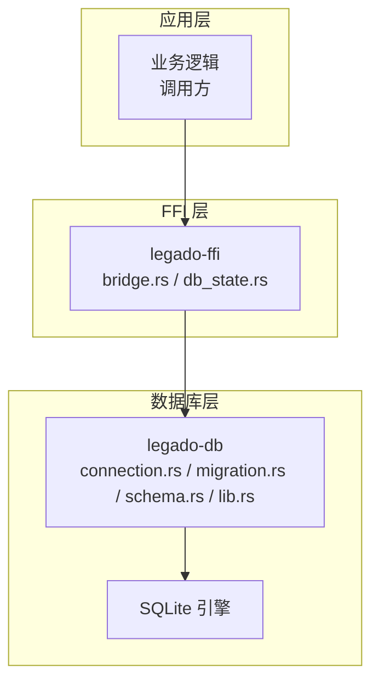
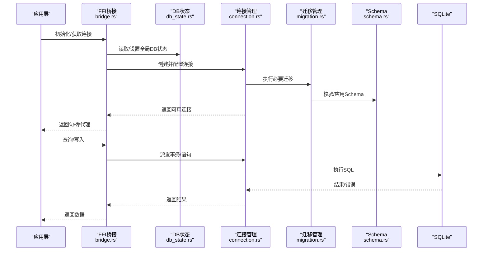
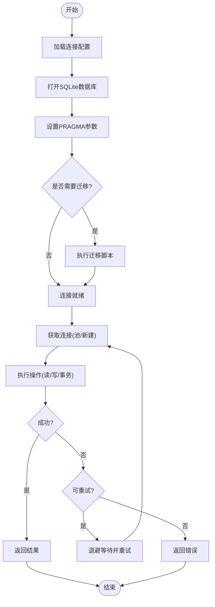
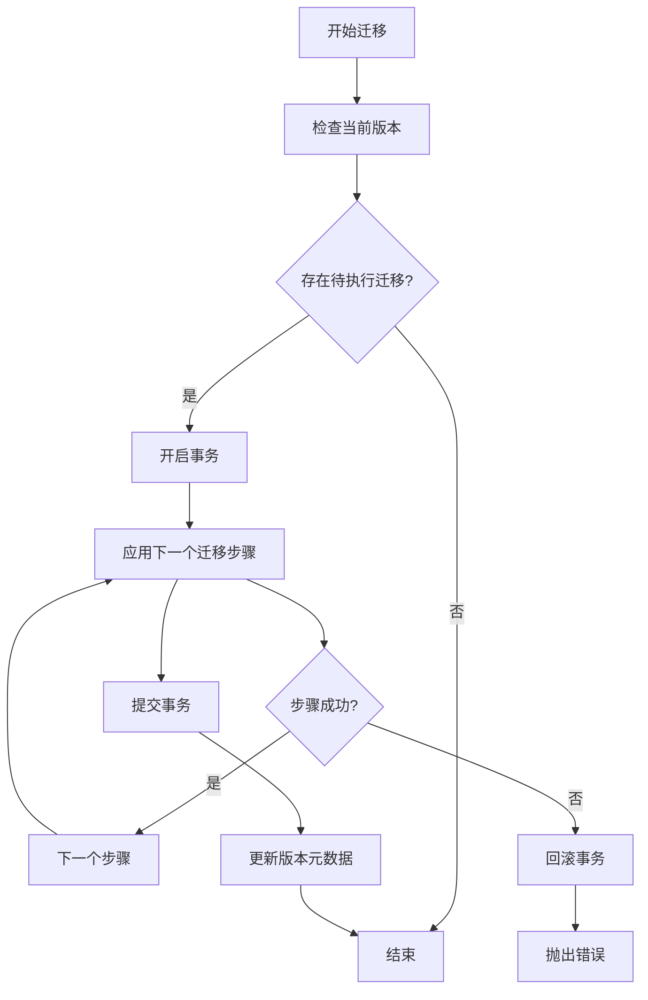
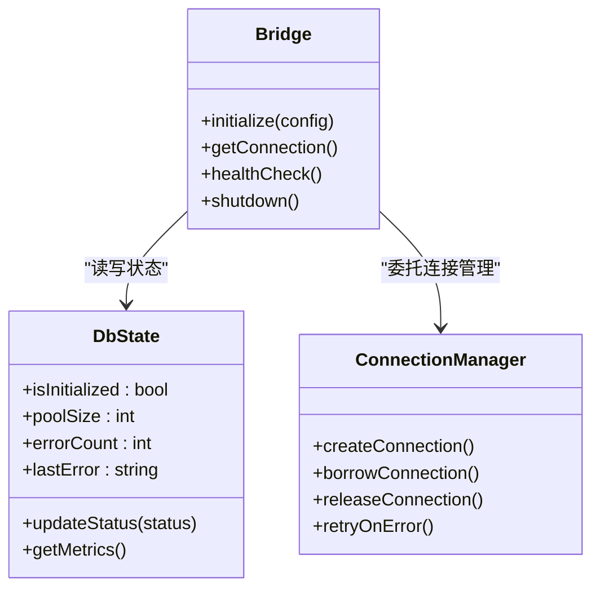
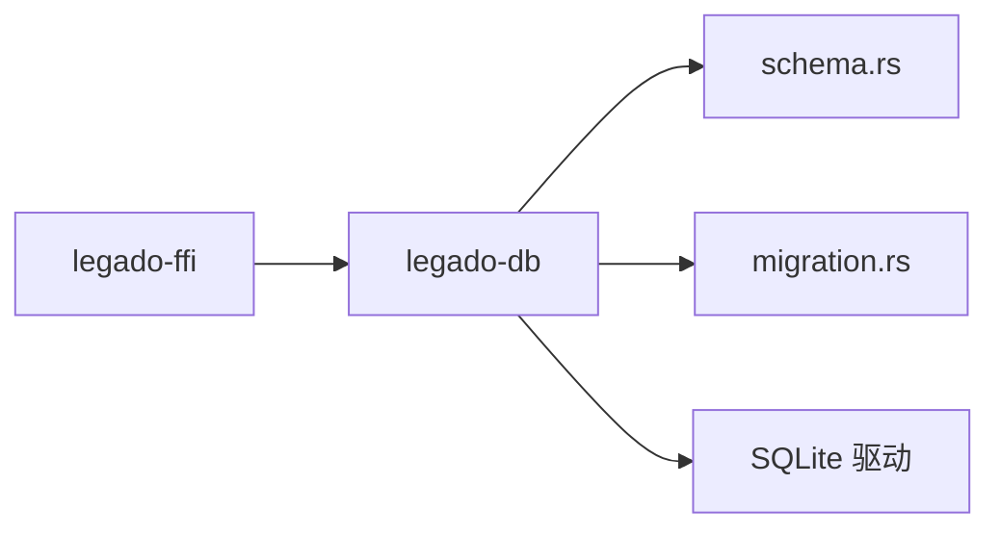

# 数据库连接管理

<cite>
**本文引用的文件**   
- [connection.rs](file://rust/legado-db/src/connection.rs)
- [lib.rs](file://rust/legado-db/src/lib.rs)
- [migration.rs](file://rust/legado-db/src/migration.rs)
- [schema.rs](file://rust/legado-db/src/schema.rs)
- [db_state.rs](file://rust/legado-ffi/src/db_state.rs)
- [bridge.rs](file://rust/legado-ffi/src/bridge.rs)
- [Cargo.toml](file://rust/legado-db/Cargo.toml)
</cite>

## 目录
1. [简介](#简介)
2. [项目结构](#项目结构)
3. [核心组件](#核心组件)
4. [架构总览](#架构总览)
5. [详细组件分析](#详细组件分析)
6. [依赖关系分析](#依赖关系分析)
7. [性能考量](#性能考量)
8. [故障排查指南](#故障排查指南)
9. [结论](#结论)
10. [附录](#附录)

## 简介
本文件面向Legado项目中SQLite数据库连接管理的实现与使用，重点覆盖以下方面：
- SQLite连接的初始化与配置（连接池、超时、参数优化）
- 多线程环境下的连接安全机制（线程本地存储、并发访问控制）
- 连接状态监控与健康检查
- 连接故障恢复与重连策略
- 具体配置示例与性能调优建议

本项目在Rust侧通过legado-db模块提供数据库能力，并通过legado-ffi对外暴露桥接接口。Android端使用Room/SQLite，但本文聚焦于Rust侧的SQLite连接管理实现。

## 项目结构
与数据库连接相关的核心代码位于rust/legado-db与rust/legado-ffi两个子模块中：
- legado-db：封装SQLite连接、迁移、Schema定义与仓库层
- legado-ffi：对外暴露FFI接口，集中管理数据库状态与生命周期

**图示来源** 
- [bridge.rs](file://rust/legado-ffi/src/bridge.rs)
- [db_state.rs](file://rust/legado-ffi/src/db_state.rs)
- [connection.rs](file://rust/legado-db/src/connection.rs)
- [migration.rs](file://rust/legado-db/src/migration.rs)
- [schema.rs](file://rust/legado-db/src/schema.rs)
- [lib.rs](file://rust/legado-db/src/lib.rs)

**章节来源**
- [connection.rs](file://rust/legado-db/src/connection.rs)
- [lib.rs](file://rust/legado-db/src/lib.rs)
- [migration.rs](file://rust/legado-db/src/migration.rs)
- [schema.rs](file://rust/legado-db/src/schema.rs)
- [db_state.rs](file://rust/legado-ffi/src/db_state.rs)
- [bridge.rs](file://rust/legado-ffi/src/bridge.rs)

## 核心组件
- 连接管理器：负责SQLite连接的创建、配置、复用与释放，提供线程安全的访问入口
- 迁移管理器：负责数据库版本升级与Schema变更
- Schema定义：集中维护表结构与约束
- FFI桥接与状态：对外暴露连接生命周期管理与健康检查接口

**章节来源**
- [connection.rs](file://rust/legado-db/src/connection.rs)
- [migration.rs](file://rust/legado-db/src/migration.rs)
- [schema.rs](file://rust/legado-db/src/schema.rs)
- [lib.rs](file://rust/legado-db/src/lib.rs)
- [db_state.rs](file://rust/legado-ffi/src/db_state.rs)
- [bridge.rs](file://rust/legado-ffi/src/bridge.rs)

## 架构总览
下图展示了从应用层到SQLite的连接路径，以及关键职责划分：

**图示来源** 
- [bridge.rs](file://rust/legado-ffi/src/bridge.rs)
- [db_state.rs](file://rust/legado-ffi/src/db_state.rs)
- [connection.rs](file://rust/legado-db/src/connection.rs)
- [migration.rs](file://rust/legado-db/src/migration.rs)
- [schema.rs](file://rust/legado-db/src/schema.rs)

## 详细组件分析

### 连接管理器（connection.rs）
- 职责
  - 建立SQLite连接，配置连接参数（如WAL模式、PRAGMA等）
  - 提供线程安全的连接获取与释放
  - 支持连接池或单例连接（根据配置）
  - 处理连接失败、重试与降级
- 关键流程
  - 初始化：加载配置、打开数据库、设置PRAGMA、执行必要迁移
  - 获取连接：从池借用或创建新连接，确保线程隔离
  - 执行操作：在事务边界内执行读写，保证一致性
  - 关闭：释放资源，清理临时文件

**图示来源** 
- [connection.rs](file://rust/legado-db/src/connection.rs)

**章节来源**
- [connection.rs](file://rust/legado-db/src/connection.rs)

### 迁移管理器（migration.rs）
- 职责
  - 维护数据库版本与Schema变更
  - 按顺序执行增量迁移，确保幂等性
  - 记录迁移历史，支持回滚策略（若实现）
- 关键点
  - 迁移前校验当前版本
  - 原子执行迁移，失败时回滚
  - 与Schema定义保持一致

**图示来源** 
- [migration.rs](file://rust/legado-db/src/migration.rs)

**章节来源**
- [migration.rs](file://rust/legado-db/src/migration.rs)

### Schema定义（schema.rs）
- 职责
  - 集中定义所有表结构、索引与约束
  - 为迁移脚本提供权威来源
- 关键点
  - 字段类型与默认值明确
  - 外键约束启用与级联策略
  - 索引设计考虑查询性能

**章节来源**
- [schema.rs](file://rust/legado-db/src/schema.rs)

### FFI桥接与DB状态（bridge.rs, db_state.rs）
- 职责
  - 对外暴露数据库初始化、连接获取、健康检查等接口
  - 集中管理全局DB状态（是否已初始化、连接池大小、错误计数等）
  - 协调多线程访问，避免竞态条件
- 关键点
  - 使用线程本地存储或同步原语保护共享状态
  - 提供只读的健康检查API
  - 统一错误码与日志输出

**图示来源** 
- [bridge.rs](file://rust/legado-ffi/src/bridge.rs)
- [db_state.rs](file://rust/legado-ffi/src/db_state.rs)
- [connection.rs](file://rust/legado-db/src/connection.rs)

**章节来源**
- [bridge.rs](file://rust/legado-ffi/src/bridge.rs)
- [db_state.rs](file://rust/legado-ffi/src/db_state.rs)

### 库入口（lib.rs）
- 职责
  - 导出公共API，组织模块依赖
  - 提供统一的初始化入口
- 关键点
  - 延迟初始化，按需加载
  - 错误传播与日志记录

**章节来源**
- [lib.rs](file://rust/legado-db/src/lib.rs)

## 依赖关系分析
- 内部依赖
  - FFI层依赖DB层提供的连接与迁移能力
  - DB层依赖Schema定义与SQLite引擎
- 外部依赖
  - SQLite驱动（由Cargo.toml声明）
  - 可能的异步运行时（如tokio，视实现而定）

**图示来源** 
- [Cargo.toml](file://rust/legado-db/Cargo.toml)
- [bridge.rs](file://rust/legado-ffi/src/bridge.rs)
- [connection.rs](file://rust/legado-db/src/connection.rs)

**章节来源**
- [Cargo.toml](file://rust/legado-db/Cargo.toml)

## 性能考量
- 连接池大小
  - 根据CPU核心数与IO负载调整，避免过多连接导致上下文切换开销
- WAL模式
  - 启用WAL提升并发读性能，减少写阻塞
- PRAGMA优化
  - 合理设置缓存大小、同步策略、页大小等
- 事务批量
  - 合并小事务为批量操作，减少磁盘同步次数
- 索引设计
  - 针对高频查询添加合适索引，避免全表扫描
- 监控指标
  - 跟踪连接池使用率、等待时间、错误率

[本节为通用指导，不直接分析具体文件]

## 故障排查指南
- 常见问题
  - 连接超时：检查网络/文件系统权限、磁盘空间、锁竞争
  - 迁移失败：核对版本号与脚本顺序，查看错误日志
  - 死锁：分析事务粒度与锁顺序，必要时拆分事务
- 诊断步骤
  - 启用详细日志，记录连接生命周期事件
  - 使用健康检查接口确认连接状态
  - 抓取堆栈与错误码定位问题
- 恢复策略
  - 自动重试与指数退避
  - 降级到只读模式或备用连接
  - 清理损坏的数据库文件并重建

**章节来源**
- [db_state.rs](file://rust/legado-ffi/src/db_state.rs)
- [bridge.rs](file://rust/legado-ffi/src/bridge.rs)
- [connection.rs](file://rust/legado-db/src/connection.rs)

## 结论
Legado的数据库连接管理在Rust侧通过模块化设计实现了清晰的职责分离：FFI层负责对外接口与状态管理，DB层专注连接、迁移与Schema。通过合理的配置、监控与恢复策略，系统能够在多线程环境下稳定运行并提供高性能的数据库访问能力。

[本节为总结，不直接分析具体文件]

## 附录
- 配置示例要点
  - 连接池大小：根据并发需求设定
  - 超时配置：连接超时、查询超时、事务超时
  - PRAGMA参数：WAL、缓存、同步策略
- 最佳实践
  - 最小化事务范围
  - 合理使用索引
  - 定期备份与迁移测试
  - 监控与告警

[本节为补充信息，不直接分析具体文件]