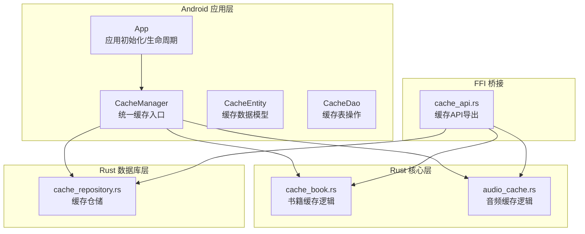
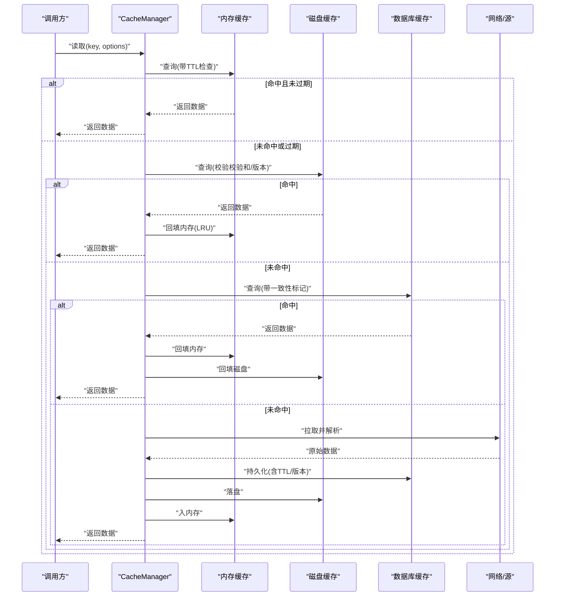
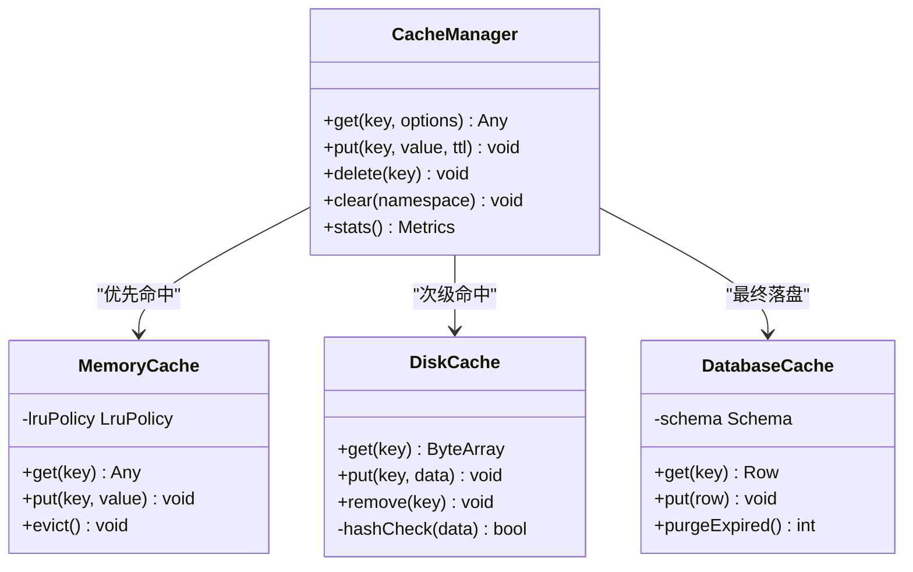
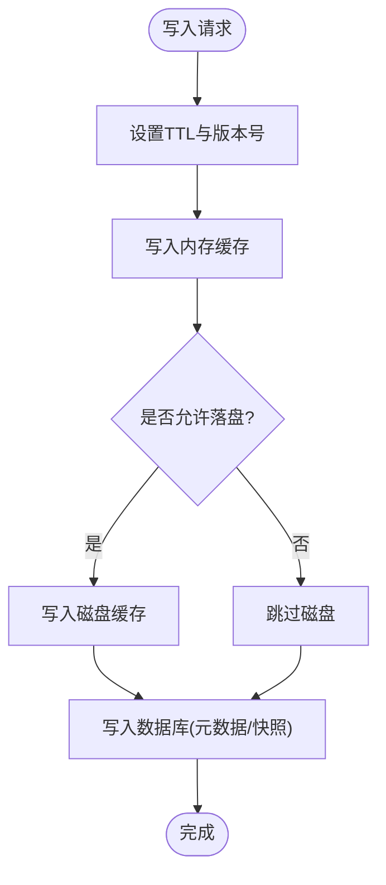
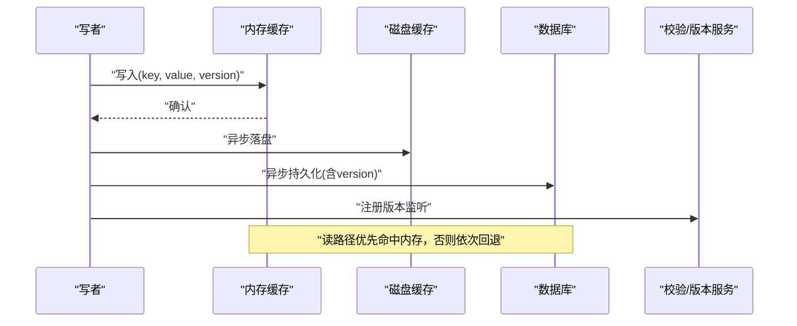
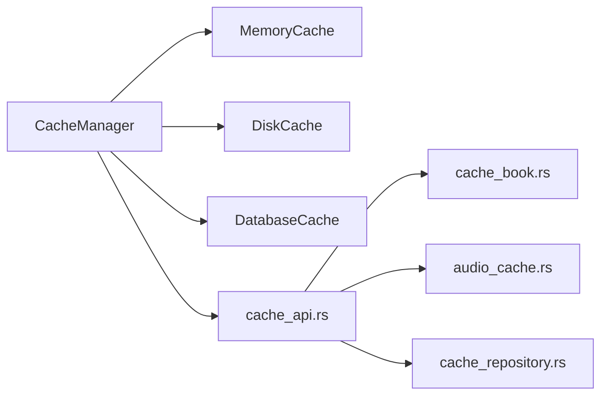

# 数据缓存策略

<cite>
**本文引用的文件**   
- [app/src/main/java/io/legado/app/help/CacheManager.kt](file://app/src/main/java/io/legado/app/help/CacheManager.kt)
- [app/src/main/java/io/legado/app/data/entity/CacheEntity.kt](file://app/src/main/java/io/legado/app/data/entity/CacheEntity.kt)
- [app/src/main/java/io/legado/app/data/dao/CacheDao.kt](file://app/src/main/java/io/legado/app/data/dao/CacheDao.kt)
- [app/src/main/java/io/legado/app/App.kt](file://app/src/main/java/io/legado/app/App.kt)
- [rust/legado-core/src/cache_book.rs](file://rust/legado-core/src/cache_book.rs)
- [rust/legado-core/src/audio_cache.rs](file://rust/legado-core/src/audio_cache.rs)
- [rust/legado-db/src/repository/cache_repository.rs](file://rust/legado-db/src/repository/cache_repository.rs)
- [rust/legado-ffi/src/api/cache_api.rs](file://rust/legado-ffi/src/api/cache_api.rs)
- [app/src/test/java/io/legado/app/help/CacheManagerTtlContractTest.kt](file://app/src/test/java/io/legado/app/help/CacheManagerTtlContractTest.kt)
</cite>

## 目录
1. [引言](#引言)
2. [项目结构](#项目结构)
3. [核心组件](#核心组件)
4. [架构总览](#架构总览)
5. [详细组件分析](#详细组件分析)
6. [依赖关系分析](#依赖关系分析)
7. [性能考量](#性能考量)
8. [故障排查指南](#故障排查指南)
9. [结论](#结论)
10. [附录](#附录)

## 引言
本文件面向Legado项目的数据缓存策略，系统性阐述多级缓存架构设计（内存、磁盘、数据库）、失效与一致性机制（TTL、LRU、手动清理、读写同步与脏数据检测）、性能监控与优化技巧，以及针对书籍内容、用户设置和网络数据的配置示例。同时给出缓存故障恢复与降级策略，帮助读者在复杂场景下稳定高效地使用缓存能力。

## 项目结构
Legado的缓存能力横跨Android应用层与Rust核心层：
- Android应用层提供统一的缓存管理器接口、持久化实体与DAO，负责上层业务调用与生命周期管理。
- Rust核心层实现高性能的内存与磁盘缓存（如音频缓存、书籍缓存），并通过FFI暴露给上层。
- Rust数据库层提供缓存相关表的仓储访问，用于持久化元数据或大对象落盘。

**图示来源** 
- [app/src/main/java/io/legado/app/help/CacheManager.kt](file://app/src/main/java/io/legado/app/help/CacheManager.kt)
- [app/src/main/java/io/legado/app/data/entity/CacheEntity.kt](file://app/src/main/java/io/legado/app/data/entity/CacheEntity.kt)
- [app/src/main/java/io/legado/app/data/dao/CacheDao.kt](file://app/src/main/java/io/legado/app/data/dao/CacheDao.kt)
- [app/src/main/java/io/legado/app/App.kt](file://app/src/main/java/io/legado/app/App.kt)
- [rust/legado-core/src/cache_book.rs](file://rust/legado-core/src/cache_book.rs)
- [rust/legado-core/src/audio_cache.rs](file://rust/legado-core/src/audio_cache.rs)
- [rust/legado-db/src/repository/cache_repository.rs](file://rust/legado-db/src/repository/cache_repository.rs)
- [rust/legado-ffi/src/api/cache_api.rs](file://rust/legado-ffi/src/api/cache_api.rs)

**章节来源**
- [app/src/main/java/io/legado/app/help/CacheManager.kt](file://app/src/main/java/io/legado/app/help/CacheManager.kt)
- [app/src/main/java/io/legado/app/data/entity/CacheEntity.kt](file://app/src/main/java/io/legado/app/data/entity/CacheEntity.kt)
- [app/src/main/java/io/legado/app/data/dao/CacheDao.kt](file://app/src/main/java/io/legado/app/data/dao/CacheDao.kt)
- [app/src/main/java/io/legado/app/App.kt](file://app/src/main/java/io/legado/app/App.kt)
- [rust/legado-core/src/cache_book.rs](file://rust/legado-core/src/cache_book.rs)
- [rust/legado-core/src/audio_cache.rs](file://rust/legado-core/src/audio_cache.rs)
- [rust/legado-db/src/repository/cache_repository.rs](file://rust/legado-db/src/repository/cache_repository.rs)
- [rust/legado-ffi/src/api/cache_api.rs](file://rust/legado-ffi/src/api/cache_api.rs)

## 核心组件
- 统一缓存管理器（CacheManager）
  - 职责：对外暴露读/写/删除/清理等接口；协调内存、磁盘、数据库三级缓存；处理TTL与LRU淘汰；聚合监控指标。
  - 关键点：线程安全、幂等写入、失败回退、可观测性。
- 缓存实体（CacheEntity）
  - 职责：定义缓存键、值、过期时间、版本/校验字段、创建/更新时间等元数据。
  - 关键点：序列化友好、支持快速比较与哈希。
- 缓存DAO（CacheDao）
  - 职责：对缓存表进行增删改查、批量清理、按条件扫描。
  - 关键点：事务边界、索引设计、分页与游标。
- Rust侧缓存模块
  - 书籍缓存（cache_book.rs）：面向章节/片段级内容的内存+磁盘混合缓存，支持按需加载与预取。
  - 音频缓存（audio_cache.rs）：面向流式播放的环形缓冲与分片缓存，兼顾低延迟与稳定性。
- 缓存仓储（cache_repository.rs）
  - 职责：封装SQLite/Room等持久化操作，提供跨平台一致的CRUD与迁移能力。
- FFI缓存API（cache_api.rs）
  - 职责：将Rust缓存能力以稳定ABI暴露给Android/Kotlin层，便于上层统一调度。

**章节来源**
- [app/src/main/java/io/legado/app/help/CacheManager.kt](file://app/src/main/java/io/legado/app/help/CacheManager.kt)
- [app/src/main/java/io/legado/app/data/entity/CacheEntity.kt](file://app/src/main/java/io/legado/app/data/entity/CacheEntity.kt)
- [app/src/main/java/io/legado/app/data/dao/CacheDao.kt](file://app/src/main/java/io/legado/app/data/dao/CacheDao.kt)
- [rust/legado-core/src/cache_book.rs](file://rust/legado-core/src/cache_book.rs)
- [rust/legado-core/src/audio_cache.rs](file://rust/legado-core/src/audio_cache.rs)
- [rust/legado-db/src/repository/cache_repository.rs](file://rust/legado-db/src/repository/cache_repository.rs)
- [rust/legado-ffi/src/api/cache_api.rs](file://rust/legado-ffi/src/api/cache_api.rs)

## 架构总览
下图展示一次典型读取流程的多级缓存命中路径与回退策略。

**图示来源** 
- [app/src/main/java/io/legado/app/help/CacheManager.kt](file://app/src/main/java/io/legado/app/help/CacheManager.kt)
- [app/src/main/java/io/legado/app/data/dao/CacheDao.kt](file://app/src/main/java/io/legado/app/data/dao/CacheDao.kt)
- [rust/legado-core/src/cache_book.rs](file://rust/legado-core/src/cache_book.rs)
- [rust/legado-core/src/audio_cache.rs](file://rust/legado-core/src/audio_cache.rs)
- [rust/legado-db/src/repository/cache_repository.rs](file://rust/legado-db/src/repository/cache_repository.rs)
- [rust/legado-ffi/src/api/cache_api.rs](file://rust/legado-ffi/src/api/cache_api.rs)

## 详细组件分析

### 多级缓存层次与数据结构
- 内存缓存
  - 特点：极低延迟、容量受限、进程内共享。
  - 数据结构：基于LruMap/ConcurrentHashMap + 原子时间戳；支持按命名空间隔离。
  - 复杂度：插入/查找O(1)，淘汰O(log n)或O(1)取决于实现。
- 磁盘缓存
  - 特点：容量较大、IO开销中等、跨进程可用。
  - 数据结构：分块文件/SQLite BLOB；附带元数据（大小、哈希、TTL）。
  - 复杂度：顺序读写接近线性，随机IO需索引辅助。
- 数据库缓存
  - 特点：强一致、可查询、可迁移。
  - 数据结构：标准化表结构（键、值、TTL、版本、状态位）。
  - 复杂度：受索引与事务影响，建议热点键走内存/磁盘，冷数据走DB。

**图示来源** 
- [app/src/main/java/io/legado/app/help/CacheManager.kt](file://app/src/main/java/io/legado/app/help/CacheManager.kt)
- [app/src/main/java/io/legado/app/data/entity/CacheEntity.kt](file://app/src/main/java/io/legado/app/data/entity/CacheEntity.kt)
- [app/src/main/java/io/legado/app/data/dao/CacheDao.kt](file://app/src/main/java/io/legado/app/data/dao/CacheDao.kt)

**章节来源**
- [app/src/main/java/io/legado/app/help/CacheManager.kt](file://app/src/main/java/io/legado/app/help/CacheManager.kt)
- [app/src/main/java/io/legado/app/data/entity/CacheEntity.kt](file://app/src/main/java/io/legado/app/data/entity/CacheEntity.kt)
- [app/src/main/java/io/legado/app/data/dao/CacheDao.kt](file://app/src/main/java/io/legado/app/data/dao/CacheDao.kt)

### 失效策略：TTL、LRU与手动清理
- TTL（Time-To-Live）
  - 写入时记录过期时间；读取时先判空再判过期；后台定时任务清理过期条目。
  - 适用：网络响应、临时计算结果、会话态数据。
- LRU（Least Recently Used）
  - 内存缓存采用最近最少使用淘汰；阈值触发异步压缩与合并。
  - 适用：高频访问的小对象（章节片段、缩略图、UI状态）。
- 手动清理
  - 提供按命名空间/前缀/标签的批量删除；支持“软删除”标记以便延迟回收。
  - 适用：用户主动清理、版本升级后的数据迁移。

**图示来源** 
- [app/src/main/java/io/legado/app/help/CacheManager.kt](file://app/src/main/java/io/legado/app/help/CacheManager.kt)
- [app/src/test/java/io/legado/app/help/CacheManagerTtlContractTest.kt](file://app/src/test/java/io/legado/app/help/CacheManagerTtlContractTest.kt)

**章节来源**
- [app/src/test/java/io/legado/app/help/CacheManagerTtlContractTest.kt](file://app/src/test/java/io/legado/app/help/CacheManagerTtlContractTest.kt)
- [app/src/main/java/io/legado/app/help/CacheManager.kt](file://app/src/main/java/io/legado/app/help/CacheManager.kt)

### 一致性保证：读写同步与脏数据检测
- 读写同步
  - 写路径：先更新内存，再异步落盘与入库；读路径：先内存后磁盘再数据库，避免锁竞争。
  - 并发控制：读写分离锁或无锁队列，保证高吞吐下的正确性。
- 脏数据检测
  - 版本字段/校验和：每次更新递增版本或重算校验和；读取时比对不一致则刷新。
  - 外部变更监听：文件系统监听或数据库触发器通知失效。
- 回滚与补偿
  - 写入失败重试与幂等键；部分成功时的补偿任务。

**图示来源** 
- [rust/legado-core/src/cache_book.rs](file://rust/legado-core/src/cache_book.rs)
- [rust/legado-core/src/audio_cache.rs](file://rust/legado-core/src/audio_cache.rs)
- [rust/legado-db/src/repository/cache_repository.rs](file://rust/legado-db/src/repository/cache_repository.rs)
- [rust/legado-ffi/src/api/cache_api.rs](file://rust/legado-ffi/src/api/cache_api.rs)

**章节来源**
- [rust/legado-core/src/cache_book.rs](file://rust/legado-core/src/cache_book.rs)
- [rust/legado-core/src/audio_cache.rs](file://rust/legado-core/src/audio_cache.rs)
- [rust/legado-db/src/repository/cache_repository.rs](file://rust/legado-db/src/repository/cache_repository.rs)
- [rust/legado-ffi/src/api/cache_api.rs](file://rust/legado-ffi/src/api/cache_api.rs)

### 性能监控与优化技巧
- 关键指标
  - 命中率（内存/磁盘/总体）、平均延迟、P95/P99延迟、淘汰率、存储空间占用、错误率。
- 采集方式
  - 埋点统计：计数器与直方图；定期上报到日志/监控系统。
- 优化手段
  - 合理设置TTL与容量阈值；热点数据预热；批量写入合并；压缩存储；冷热分层。
  - 避免热点键竞争：分片缓存、本地副本。

[本节为通用指导，不直接分析具体文件]

### 不同类型数据的缓存配置示例
- 书籍内容
  - 策略：章节片段优先内存，整章落盘，目录与元数据入库；TTL短（分钟级），LRU严格。
  - 理由：阅读频繁、局部性强、体积适中。
- 用户设置
  - 策略：小对象常驻内存，持久化入库；TTL长（小时/天级），变更即写。
  - 理由：读取极频、写入低频、一致性要求高。
- 网络数据
  - 策略：响应体短期内存+磁盘，元数据入库；TTL中短（秒/分钟级），配合ETag/Last-Modified。
  - 理由：波动性大、带宽敏感、易过期。

[本节为通用指导，不直接分析具体文件]

### 缓存故障恢复与降级策略
- 内存不足
  - 触发紧急淘汰；释放非热点数据；必要时清空冷命名空间。
- IO异常
  - 磁盘不可用：降级为纯内存模式；记录告警；恢复后增量回填。
- 数据库异常
  - 连接失败：只读模式；写入排队；重试与熔断。
- 数据损坏
  - 校验失败：丢弃坏块，重新拉取；保留备份快照。

[本节为通用指导，不直接分析具体文件]

## 依赖关系分析
- 组件耦合
  - CacheManager依赖内存/磁盘/数据库三层实现；Rust模块通过FFI暴露API。
- 外部依赖
  - 网络库、压缩库、加密库（可选）、系统存储与数据库引擎。
- 循环依赖
  - 通过接口抽象与事件总线解耦，避免直接循环引用。

**图示来源** 
- [app/src/main/java/io/legado/app/help/CacheManager.kt](file://app/src/main/java/io/legado/app/help/CacheManager.kt)
- [rust/legado-ffi/src/api/cache_api.rs](file://rust/legado-ffi/src/api/cache_api.rs)
- [rust/legado-core/src/cache_book.rs](file://rust/legado-core/src/cache_book.rs)
- [rust/legado-core/src/audio_cache.rs](file://rust/legado-core/src/audio_cache.rs)
- [rust/legado-db/src/repository/cache_repository.rs](file://rust/legado-db/src/repository/cache_repository.rs)

**章节来源**
- [app/src/main/java/io/legado/app/help/CacheManager.kt](file://app/src/main/java/io/legado/app/help/CacheManager.kt)
- [rust/legado-ffi/src/api/cache_api.rs](file://rust/legado-ffi/src/api/cache_api.rs)
- [rust/legado-core/src/cache_book.rs](file://rust/legado-core/src/cache_book.rs)
- [rust/legado-core/src/audio_cache.rs](file://rust/legado-core/src/audio_cache.rs)
- [rust/legado-db/src/repository/cache_repository.rs](file://rust/legado-db/src/repository/cache_repository.rs)

## 性能考量
- 命中率优先：通过热点识别与预热提升整体命中率。
- 延迟控制：读路径尽量单跳命中，避免跨层串行阻塞。
- 资源限制：内存上限、磁盘配额、并发度限制，防止OOM与IO风暴。
- 批量化：合并写入、批量清理，降低系统调用次数。
- 压缩与编码：根据数据类型选择合适压缩算法，平衡CPU与IO。

[本节为通用指导，不直接分析具体文件]

## 故障排查指南
- 常见问题定位
  - 命中率低：检查TTL过短、容量过小、热点未预热。
  - 数据不一致：核对版本/校验和、监听失效、写路径幂等。
  - 内存泄漏：关注缓存键生命周期、弱引用使用、清理任务执行。
  - IO瓶颈：监控磁盘延迟、并发队列长度、压缩开销。
- 诊断工具
  - 启用详细日志与指标上报；导出缓存快照与统计报表。
  - 使用单元测试覆盖TTL契约与边界条件。

**章节来源**
- [app/src/test/java/io/legado/app/help/CacheManagerTtlContractTest.kt](file://app/src/test/java/io/legado/app/help/CacheManagerTtlContractTest.kt)

## 结论
Legado的缓存体系通过多层级设计与严格的失效/一致性策略，在保证性能的同时兼顾可靠性。结合监控与优化手段，可在不同数据形态与负载特征下取得良好表现。建议在新增数据域时遵循本文的配置范式与最佳实践，确保可扩展性与可维护性。

[本节为总结性内容，不直接分析具体文件]

## 附录
- 术语
  - TTL：存活时间；LRU：最近最少使用；FFI：外部函数接口。
- 参考
  - 测试用例中的TTL契约验证可作为行为基线。

[本节为补充信息，不直接分析具体文件]