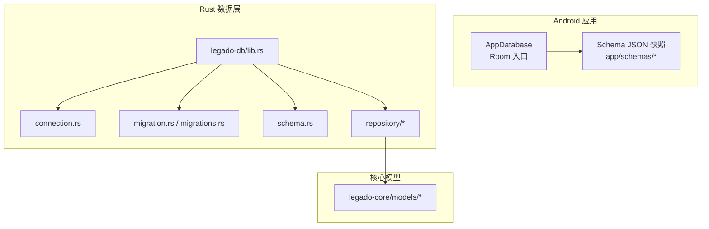
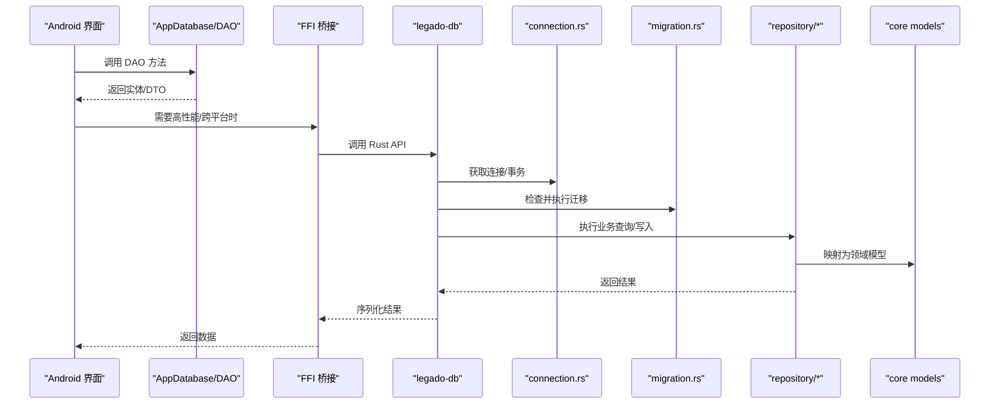
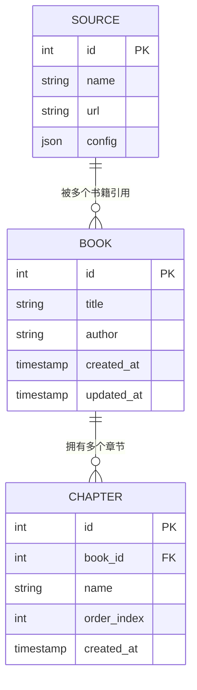
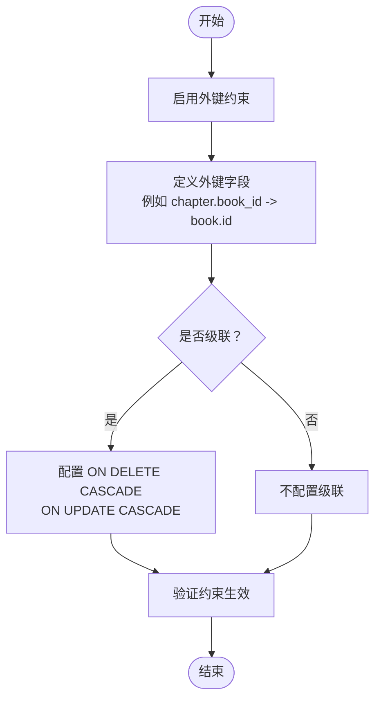
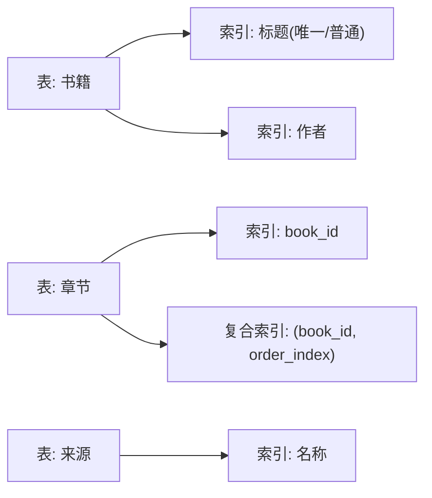
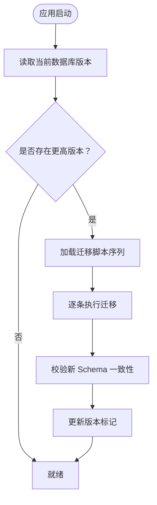
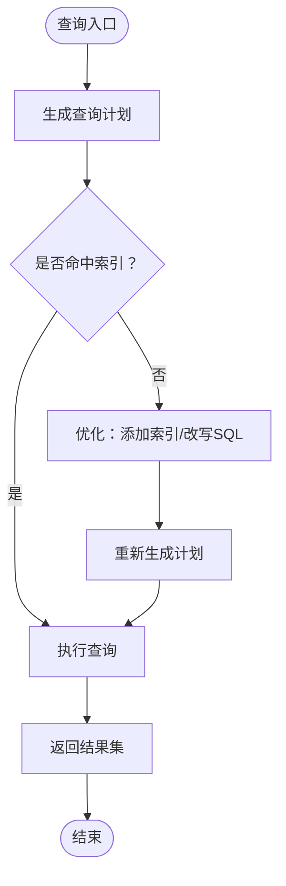
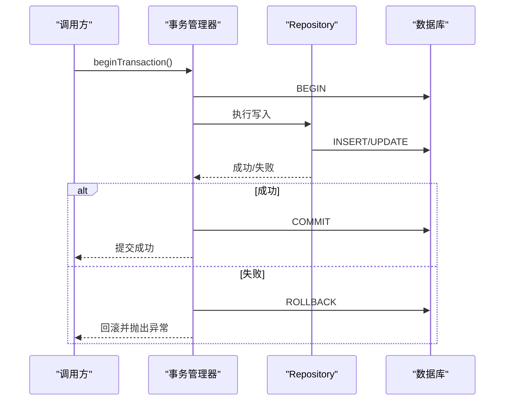
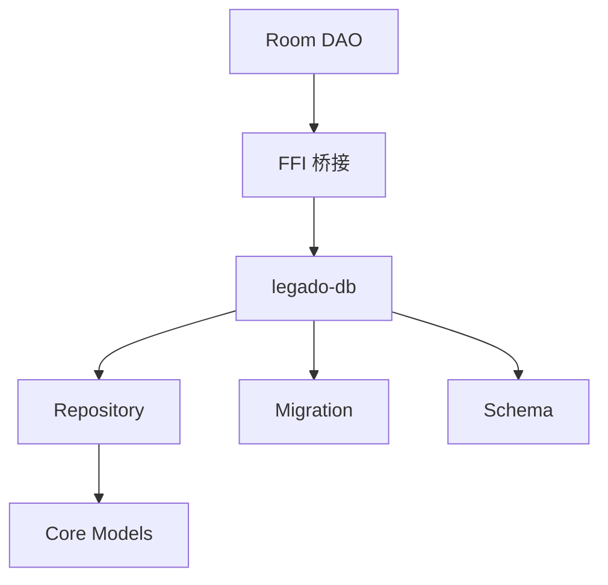

# 数据关系映射

<cite>
**本文引用的文件**   
- [app/src/main/java/io/legado/app/data/AppDatabase.kt](file://app/src/main/java/io/legado/app/data/AppDatabase.kt)
- [app/schemas/io.legado.app.data.AppDatabase/1.json](file://app/schemas/io.legado.app.data.AppDatabase/1.json)
- [app/schemas/io.legado.app.data.AppDatabase/95.json](file://app/schemas/io.legado.app.data.AppDatabase/95.json)
- [rust/legado-db/src/lib.rs](file://rust/legado-db/src/lib.rs)
- [rust/legado-db/src/connection.rs](file://rust/legado-db/src/connection.rs)
- [rust/legado-db/src/migration.rs](file://rust/legado-db/src/migration.rs)
- [rust/legado-db/src/migration/migrations.rs](file://rust/legado-db/src/migration/migrations.rs)
- [rust/legado-db/src/schema.rs](file://rust/legado-db/src/schema.rs)
- [rust/legado-db/src/repository/mod.rs](file://rust/legado-db/src/repository/mod.rs)
- [rust/legado-db/src/repository/book_repository.rs](file://rust/legado-db/src/repository/book_repository.rs)
- [rust/legado-db/src/repository/book_chapter_repository.rs](file://rust/legado-db/src/repository/book_chapter_repository.rs)
- [rust/legado-db/src/repository/book_source_repository.rs](file://rust/legado-db/src/repository/book_source_repository.rs)
- [rust/legado-core/src/models/mod.rs](file://rust/legado-core/src/models/mod.rs)
- [rust/legado-core/src/models/book.rs](file://rust/legado-core/src/models/book.rs)
- [rust/legado-core/src/models/book_chapter.rs](file://rust/legado-core/src/models/book_chapter.rs)
- [rust/legado-core/src/models/book_source.rs](file://rust/legado-core/src/models/book_source.rs)
</cite>

## 目录
1. [简介](#简介)
2. [项目结构](#项目结构)
3. [核心组件](#核心组件)
4. [架构总览](#架构总览)
5. [详细组件分析](#详细组件分析)
6. [依赖分析](#依赖分析)
7. [性能考虑](#性能考虑)
8. [故障排查指南](#故障排查指南)
9. [结论](#结论)
10. [附录](#附录)

## 简介
本文件聚焦于 Legado 项目的数据关系映射设计，系统性阐述实体间的一对一、一对多、多对多关系实现方式；外键约束与级联策略的配置；数据库 Schema 设计与索引优化；数据迁移机制（版本管理、向后兼容与升级路径）；以及关系查询的最佳实践与性能优化建议。文档同时覆盖数据一致性与事务处理机制，帮助读者从概念到代码层面全面理解本项目的数据层设计与演进。

## 项目结构
Legado 采用 Android + Rust 双栈架构：Android 端使用 Room 进行 SQLite 持久化，Rust 端通过 rusqlite/sqlx 等库提供高性能数据访问与迁移能力。Schema 快照以 JSON 形式保存在 app/schemas 目录下，便于版本对比与回滚。Rust 侧的数据库模块集中在 legado-db，包含连接管理、迁移、Schema 定义与各领域 Repository。

图表来源
- [app/src/main/java/io/legado/app/data/AppDatabase.kt](file://app/src/main/java/io/legado/app/data/AppDatabase.kt)
- [app/schemas/io.legado.app.data.AppDatabase/1.json](file://app/schemas/io.legado.app.data.AppDatabase/1.json)
- [app/schemas/io.legado.app.data.AppDatabase/95.json](file://app/schemas/io.legado.app.data.AppDatabase/95.json)
- [rust/legado-db/src/lib.rs](file://rust/legado-db/src/lib.rs)
- [rust/legado-db/src/connection.rs](file://rust/legado-db/src/connection.rs)
- [rust/legado-db/src/migration.rs](file://rust/legado-db/src/migration.rs)
- [rust/legado-db/src/migration/migrations.rs](file://rust/legado-db/src/migration/migrations.rs)
- [rust/legado-db/src/schema.rs](file://rust/legado-db/src/schema.rs)
- [rust/legado-db/src/repository/mod.rs](file://rust/legado-db/src/repository/mod.rs)
- [rust/legado-core/src/models/mod.rs](file://rust/legado-core/src/models/mod.rs)

章节来源
- [app/src/main/java/io/legado/app/data/AppDatabase.kt](file://app/src/main/java/io/legado/app/data/AppDatabase.kt)
- [rust/legado-db/src/lib.rs](file://rust/legado-db/src/lib.rs)

## 核心组件
- AppDatabase（Room 入口）：集中声明数据库版本、DAO 集合与实体类，生成并维护 SQLite Schema 快照。
- Rust 数据库库（legado-db）：封装连接池、迁移编排、Schema 校验与领域 Repository，向上暴露统一 API。
- 核心模型（legado-core/models）：定义 Book、BookChapter、BookSource 等实体结构与关系注解，驱动 ORM 映射。
- 迁移系统（migration.rs + migrations.rs）：按版本号顺序执行 SQL 变更脚本，确保跨版本平滑升级。
- Schema 快照（app/schemas/*.json）：记录每个版本的表结构，用于增量对比与兼容性检查。

章节来源
- [app/src/main/java/io/legado/app/data/AppDatabase.kt](file://app/src/main/java/io/legado/app/data/AppDatabase.kt)
- [rust/legado-db/src/lib.rs](file://rust/legado-db/src/lib.rs)
- [rust/legado-db/src/migration.rs](file://rust/legado-db/src/migration.rs)
- [rust/legado-db/src/migration/migrations.rs](file://rust/legado-db/src/migration/migrations.rs)
- [rust/legado-core/src/models/mod.rs](file://rust/legado-core/src/models/mod.rs)

## 架构总览
下图展示从 Android 到 Rust 的数据访问链路，包括 Room 生成的 DAO、Rust 层的 Repository 与底层 rusqlite/sqlx 操作，以及迁移流程。

图表来源
- [app/src/main/java/io/legado/app/data/AppDatabase.kt](file://app/src/main/java/io/legado/app/data/AppDatabase.kt)
- [rust/legado-db/src/lib.rs](file://rust/legado-db/src/lib.rs)
- [rust/legado-db/src/connection.rs](file://rust/legado-db/src/connection.rs)
- [rust/legado-db/src/migration.rs](file://rust/legado-db/src/migration.rs)
- [rust/legado-db/src/repository/mod.rs](file://rust/legado-db/src/repository/mod.rs)
- [rust/legado-core/src/models/mod.rs](file://rust/legado-core/src/models/mod.rs)

## 详细组件分析

### 实体关系设计（一对一、一对多、多对多）
- 一对多：书籍与章节（Book → Chapters）。典型实现为在章节表中保存书籍外键，ORM 通过关联注解建立双向导航。
- 一对一：如用户与设置、缓存条目与元数据等，通常通过唯一外键或共享主键实现。
- 多对多：如标签与书籍、规则与源等，需引入中间表承载两个实体的外键组合，并在两端配置关联集合。

图表来源
- [rust/legado-core/src/models/book.rs](file://rust/legado-core/src/models/book.rs)
- [rust/legado-core/src/models/book_chapter.rs](file://rust/legado-core/src/models/book_chapter.rs)
- [rust/legado-core/src/models/book_source.rs](file://rust/legado-core/src/models/book_source.rs)

章节来源
- [rust/legado-core/src/models/book.rs](file://rust/legado-core/src/models/book.rs)
- [rust/legado-core/src/models/book_chapter.rs](file://rust/legado-core/src/models/book_chapter.rs)
- [rust/legado-core/src/models/book_source.rs](file://rust/legado-core/src/models/book_source.rs)

### 外键约束与级联策略
- 外键约束：在章节表上对 book_id 建立外键，保证引用完整性；在多对多中间表上对两端 ID 分别建立外键。
- 级联删除：当书籍被删除时，自动级联删除其章节，避免孤儿记录。
- 级联更新：主键变更时（如有），子表外键同步更新，保持一致性。
- 启用策略：在数据库初始化时开启外键支持，并在 ORM/DDL 中声明 ON DELETE CASCADE / ON UPDATE CASCADE。

章节来源
- [rust/legado-db/src/schema.rs](file://rust/legado-db/src/schema.rs)
- [rust/legado-core/src/models/book_chapter.rs](file://rust/legado-core/src/models/book_chapter.rs)

### 数据库 Schema 设计与索引策略
- 表结构：书籍表、章节表、来源表等，明确主键、非空字段与默认值。
- 索引策略：
  - 高频查询列建索引，如书籍标题、作者、来源名称。
  - 复合索引用于排序与过滤，如 (book_id, order_index)。
  - 全文检索列可考虑 FTS 扩展（若适用）。
- 查询优化：
  - 使用覆盖索引减少回表。
  - 避免 SELECT *，仅选择必要列。
  - 分页查询使用 LIMIT/OFFSET 或游标式分页。

章节来源
- [app/schemas/io.legado.app.data.AppDatabase/95.json](file://app/schemas/io.legado.app.data.AppDatabase/95.json)
- [rust/legado-db/src/schema.rs](file://rust/legado-db/src/schema.rs)

### 数据迁移机制（版本管理、向后兼容与升级路径）
- 版本管理：每个 Schema 快照对应一个版本号（如 1.json、95.json），迁移脚本按序执行。
- 向后兼容：新增字段默认值、保留旧字段一段时间，避免破坏性变更。
- 升级路径：迁移脚本包含 CREATE/ALTER/DROP 等操作，必要时进行数据回填与清理。
- 校验：启动时比对当前数据库版本与期望版本，自动执行缺失迁移。

章节来源
- [rust/legado-db/src/migration.rs](file://rust/legado-db/src/migration.rs)
- [rust/legado-db/src/migration/migrations.rs](file://rust/legado-db/src/migration/migrations.rs)
- [app/schemas/io.legado.app.data.AppDatabase/1.json](file://app/schemas/io.legado.app.data.AppDatabase/1.json)
- [app/schemas/io.legado.app.data.AppDatabase/95.json](file://app/schemas/io.legado.app.data.AppDatabase/95.json)

### 关系查询最佳实践与性能优化
- 预加载与延迟加载：按需加载关联数据，避免 N+1 问题。
- 批量操作：使用事务包裹多条插入/更新，降低 IO 开销。
- 查询计划：使用 EXPLAIN 分析执行计划，调整索引与查询语句。
- 分页与限制：对大结果集使用分页，避免一次性加载过多数据。
- 读写分离：读多写少场景考虑只读副本或缓存层。

章节来源
- [rust/legado-db/src/repository/book_repository.rs](file://rust/legado-db/src/repository/book_repository.rs)
- [rust/legado-db/src/repository/book_chapter_repository.rs](file://rust/legado-db/src/repository/book_chapter_repository.rs)

### 数据一致性与事务处理
- 事务边界：将相关写入操作放入同一事务，确保原子性。
- 隔离级别：根据业务需求选择合适的隔离级别（如 READ COMMITTED）。
- 异常回滚：发生错误时自动回滚，避免部分提交导致的不一致。
- 幂等性：对重复操作进行幂等设计，防止副作用。

章节来源
- [rust/legado-db/src/connection.rs](file://rust/legado-db/src/connection.rs)
- [rust/legado-db/src/repository/mod.rs](file://rust/legado-db/src/repository/mod.rs)

## 依赖分析
- Android Room 与 Rust 数据层解耦：通过 FFI 或 API 调用，避免强耦合。
- Repository 层抽象：屏蔽底层存储细节，向上提供稳定接口。
- 模型与 Schema 同步：核心模型变更需同步更新迁移脚本与 Schema 快照。

图表来源
- [rust/legado-db/src/lib.rs](file://rust/legado-db/src/lib.rs)
- [rust/legado-db/src/repository/mod.rs](file://rust/legado-db/src/repository/mod.rs)
- [rust/legado-core/src/models/mod.rs](file://rust/legado-core/src/models/mod.rs)

章节来源
- [rust/legado-db/src/lib.rs](file://rust/legado-db/src/lib.rs)
- [rust/legado-db/src/repository/mod.rs](file://rust/legado-db/src/repository/mod.rs)

## 性能考虑
- 索引设计：针对热点查询构建合适索引，避免过度索引影响写入性能。
- 查询优化：减少 JOIN 深度，使用子查询或临时表优化复杂逻辑。
- 批量写入：合并小事务为大事务，减少锁竞争与日志开销。
- 缓存策略：对频繁读取且变化不频繁的数据引入内存或磁盘缓存。
- 监控与诊断：定期收集慢查询日志，持续优化。

## 故障排查指南
- 迁移失败：检查迁移脚本语法与数据兼容性，确认版本顺序正确。
- 外键冲突：定位违反外键约束的记录，修复或删除后重试。
- 查询缓慢：使用 EXPLAIN 分析执行计划，补充或调整索引。
- 事务异常：查看事务边界与异常分支，确保回滚逻辑正确。

章节来源
- [rust/legado-db/src/migration.rs](file://rust/legado-db/src/migration.rs)
- [rust/legado-db/src/connection.rs](file://rust/legado-db/src/connection.rs)

## 结论
Legado 的数据关系映射设计以清晰的实体关系、严格的约束与完善的迁移机制为核心，结合 Android Room 与 Rust 高性能数据层，实现了可扩展、可维护且性能优良的数据访问方案。通过合理的索引策略、事务管理与查询优化，能够有效支撑大规模数据场景下的稳定性与效率。

## 附录
- 术语说明：
  - 外键约束：保证表间引用完整性的机制。
  - 级联删除/更新：父记录变更时自动同步子记录。
  - 迁移：数据库结构随版本演进的变更过程。
  - 事务：一组操作的原子执行单元。
- 参考路径：
  - Android Schema 快照：app/schemas/io.legado.app.data.AppDatabase/*.json
  - Rust 迁移脚本：rust/legado-db/src/migration/migrations.rs
  - 核心模型：rust/legado-core/src/models/*.rs