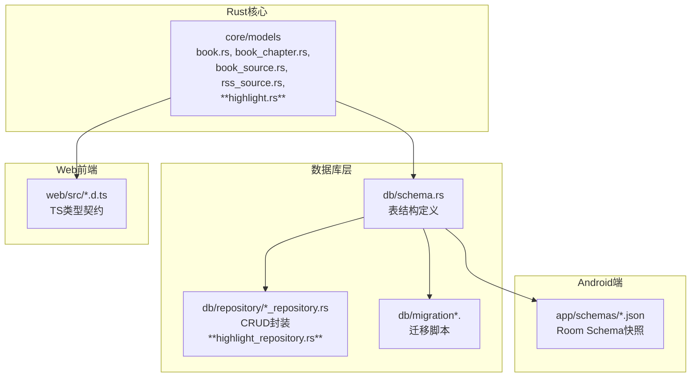
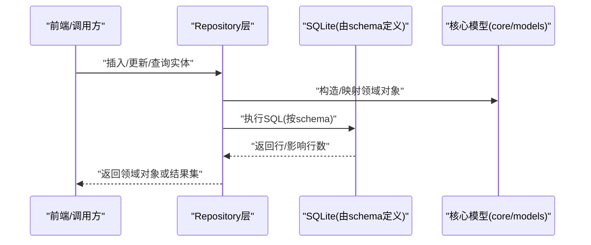
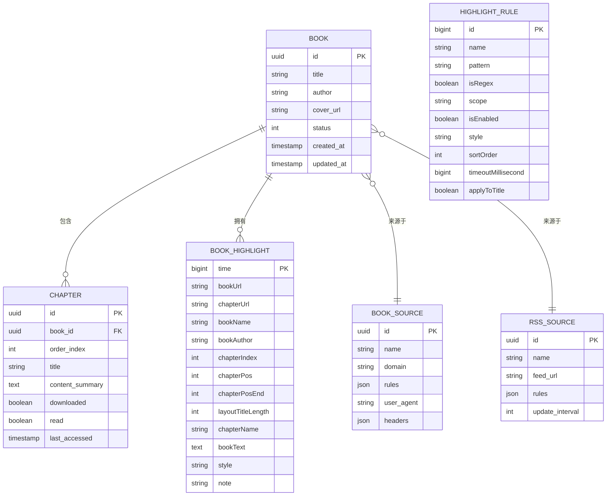
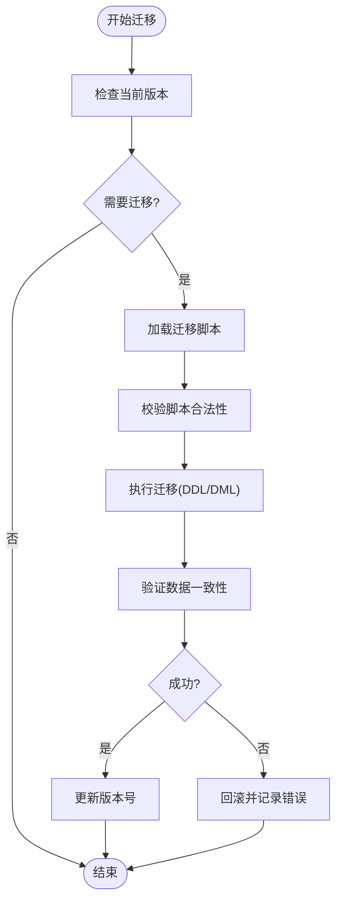
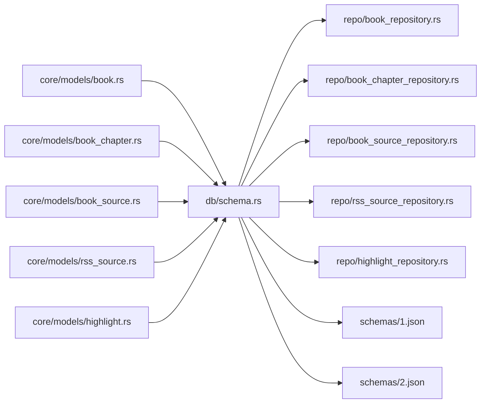

# 数据模型设计

<cite>
**本文档引用的文件**   
- [book.rs](file://rust/legado-core/src/models/book.rs)
- [book_chapter.rs](file://rust/legado-core/src/models/book_chapter.rs)
- [book_source.rs](file://rust/legado-core/src/models/book_source.rs)
- [rss_source.rs](file://rust/legado-core/src/models/rss_source.rs)
- [highlight.rs](file://rust/legado-core/src/models/highlight.rs)
- [schema.rs](file://rust/legado-db/src/schema.rs)
- [migration.rs](file://rust/legado-db/src/migration.rs)
- [migrations.rs](file://rust/legado-db/src/migration/migrations.rs)
- [default_data.rs](file://rust/legado-db/src/default_data.rs)
- [lib.rs](file://rust/legado-db/src/lib.rs)
- [book_repository.rs](file://rust/legado-db/src/repository/book_repository.rs)
- [book_chapter_repository.rs](file://rust/legado-db/src/repository/book_chapter_repository.rs)
- [book_source_repository.rs](file://rust/legado-db/src/repository/book_source_repository.rs)
- [rss_source_repository.rs](file://rust/legado-db/src/repository/rss_source_repository.rs)
- [highlight_repository.rs](file://rust/legado-db/src/repository/highlight_repository.rs)
- [1.json](file://app/cronetlib/schemas/io.legado.app.data.AppDatabase/1.json)
- [2.json](file://app/cronetlib/schemas/io.legado.app.data.AppDatabase/2.json)
- [3.json](file://app/cronetlib/schemas/io.legado.app.data.AppDatabase/3.json)
- [4.json](file://app/cronetlib/schemas/io.legado.app.data.AppDatabase/4.json)
- [5.json](file://app/cronetlib/schemas/io.legado.app.data.AppDatabase/5.json)
</cite>

## 更新摘要
**变更内容**   
- 新增 BookHighlight 和 HighlightRule 数据模型，支持手动高亮和自动规则高亮功能
- 添加 highlights 表和 highlightRules 表的数据库访问层实现
- 扩展实体关系映射，包含高亮记录与书籍、章节的关联关系
- 更新序列化/反序列化处理，确保 camelCase JSON 字段名与 Android Room 兼容
- **增强书源反序列化兼容性，引入宽松解析函数（lenient_i64, lenient_i32, lenient_bool, lenient_opt_bool）以支持第三方书源的非标准JSON格式**

## 目录
1. [简介](#简介)
2. [项目结构](#项目结构)
3. [核心组件](#核心组件)
4. [架构总览](#架构总览)
5. [详细组件分析](#详细组件分析)
6. [依赖关系分析](#依赖关系分析)
7. [性能考虑](#性能考虑)
8. [故障排查指南](#故障排查指南)
9. [结论](#结论)
10. [附录](#附录)

## 简介
本文件面向Legado项目的数据模型设计，聚焦以下目标：
- 全面梳理核心实体定义与字段语义，包括Book、Chapter、BookSource、RssSource等。
- **新增** 详细说明BookHighlight和HighlightRule高亮相关实体的定义与用途。
- 说明实体间关系映射（一对一、一对多、多对多）在代码与数据库中的实现方式。
- 总结数据验证规则与业务约束（必填、格式、逻辑校验）。
- 描述序列化/反序列化处理，覆盖JSON与SQLite存储。
- **重点介绍增强的书源反序列化兼容性机制，支持非标准JSON格式的第三方书源。**
- 提供数据迁移策略与版本兼容性方案。
- 给出具体代码示例路径与最佳实践建议。

## 项目结构
本项目采用多模块架构，数据模型主要分布在Rust核心库与Android端数据库Schema中：
- Rust核心层（legado-core）：定义领域模型（Book、Chapter、BookSource、RssSource、**BookHighlight、HighlightRule**等），承载业务语义与类型约束。
- 数据库层（legado-db）：通过schema与repository抽象持久化细节，管理SQLite表结构与迁移。
- Android端（app）：使用Room生成各版本的数据库Schema快照，用于升级兼容。
- Web前端（modules/web）：提供源编辑与调试界面，与后端API交互时遵循一致的模型契约。

图表来源
- [book.rs](file://rust/legado-core/src/models/book.rs)
- [book_chapter.rs](file://rust/legado-core/src/models/book_chapter.rs)
- [book_source.rs](file://rust/legado-core/src/models/book_source.rs)
- [rss_source.rs](file://rust/legado-core/src/models/rss_source.rs)
- [highlight.rs](file://rust/legado-core/src/models/highlight.rs)
- [schema.rs](file://rust/legado-db/src/schema.rs)
- [lib.rs](file://rust/legado-db/src/lib.rs)
- [1.json](file://app/cronetlib/schemas/io.legado.app.data.AppDatabase/1.json)

章节来源
- [schema.rs](file://rust/legado-db/src/schema.rs)
- [lib.rs](file://rust/legado-db/src/lib.rs)

## 核心组件
本节概述五大核心实体的职责与关键字段含义（以领域语义为主，不展示具体代码片段）：
- Book（书籍）
  - 标识与元信息：唯一ID、书名、作者、封面、分类标签、状态、创建/更新时间等。
  - 阅读进度：当前章节索引、页码、阅读时长、上次阅读时间。
  - 来源关联：所属BookSource或RSS Source的引用。
  - 内容统计：章节总数、已读章节数、缓存大小等。
- Chapter（章节）
  - 归属与顺序：所属Book ID、章节序号、标题、URL/内容摘要。
  - 内容标记：是否已下载、是否已读、字数、最后访问时间。
  - 扩展字段：自定义标签、备注、解析结果缓存等。
- BookSource（书源）
  - 基本信息：名称、域名、规则集、请求头、代理配置、登录态。
  - 抓取规则：列表页、详情页、章节列表、章节内容的选择器或表达式。
  - 行为控制：并发限制、重试策略、超时、UA、Cookie策略。
  - **增强兼容性：支持宽松的反序列化解析，兼容非标准JSON格式。**
- RssSource（RSS源）
  - 基本信息：名称、Feed地址、更新频率、分类标签。
  - 解析规则：条目列表、标题、链接、发布时间、摘要、正文选择器。
  - 订阅管理：收藏、已读状态、同步状态、错误计数。
- **BookHighlight（高亮记录）**
  - **标识信息：time（Unix毫秒主键）、bookUrl、chapterUrl定位高亮所属书籍与章节。**
  - **位置信息：chapterPos/chapterPosEnd为高亮在章节排版布局中的起止位置，layoutTitleLength为标题长度偏移。**
  - **内容信息：bookText为高亮的正文文本，note为笔记内容，style为高亮样式JSON。**
  - **元数据：bookName/bookAuthor为冗余存储用于分组展示，chapterIndex为章节索引。**
- **HighlightRule（高亮规则）**
  - **规则配置：name为规则名称，pattern为匹配模式（正则或普通文本），isRegex标识是否为正则。**
  - **作用域：scope为生效范围（书名或书源名，空表示全局），isEnabled为是否启用。**
  - **样式与排序：style为高亮样式JSON，sortOrder为排序值（Room列名对应Kotlin的order字段）。**
  - **高级选项：timeoutMillisecond为匹配超时毫秒数，applyToTitle为是否应用到标题。**

章节来源
- [book.rs](file://rust/legado-core/src/models/book.rs)
- [book_chapter.rs](file://rust/legado-core/src/models/book_chapter.rs)
- [book_source.rs](file://rust/legado-core/src/models/book_source.rs)
- [rss_source.rs](file://rust/legado-core/src/models/rss_source.rs)
- [highlight.rs](file://rust/legado-core/src/models/highlight.rs)

## 架构总览
数据模型在系统中的流转路径如下：
- 领域模型（Rust core）定义数据结构与约束。
- 数据库层（schema + repository）负责持久化、查询与事务。
- Android Room Schema快照确保跨版本兼容。
- Web前端通过API与后端交互，遵循一致的模型契约。

图表来源
- [schema.rs](file://rust/legado-db/src/schema.rs)
- [book_repository.rs](file://rust/legado-db/src/repository/book_repository.rs)
- [book_chapter_repository.rs](file://rust/legado-db/src/repository/book_chapter_repository.rs)
- [book_source_repository.rs](file://rust/legado-db/src/repository/book_source_repository.rs)
- [rss_source_repository.rs](file://rust/legado-db/src/repository/rss_source_repository.rs)
- [highlight_repository.rs](file://rust/legado-db/src/repository/highlight_repository.rs)

## 详细组件分析

### 实体关系与映射
- Book 与 Chapter：一对多关系
  - Book拥有多个Chapter；Chapter通过外键指向Book。
  - 典型操作：获取某书的全部章节、批量更新章节状态、删除书时级联处理章节。
- Book 与 BookSource：多对一关系
  - 一本书来源于一个BookSource；BookSource可被多本书引用。
  - 典型操作：按源筛选书籍、更新源后刷新相关书籍。
- Book 与 RssSource：多对一关系
  - 通过RSS订阅的文章归入Book（或独立文章实体），通常以BookSource或RssSource作为来源标识。
- **Book 与 BookHighlight：一对多关系**
  - **一本书拥有多个高亮记录；BookHighlight通过bookUrl和chapterUrl定位到具体的书籍和章节。**
  - **典型操作：按书籍获取所有高亮、按章节获取高亮、搜索高亮内容。**
- **其他关系**
  - Bookmark、ReadRecord、CacheBook等实体与Book存在一对一或多对一关系（如书签、阅读记录、缓存）。

图表来源
- [schema.rs](file://rust/legado-db/src/schema.rs)
- [book.rs](file://rust/legado-core/src/models/book.rs)
- [book_chapter.rs](file://rust/legado-core/src/models/book_chapter.rs)
- [book_source.rs](file://rust/legado-core/src/models/book_source.rs)
- [rss_source.rs](file://rust/legado-core/src/models/rss_source.rs)
- [highlight.rs](file://rust/legado-core/src/models/highlight.rs)

章节来源
- [schema.rs](file://rust/legado-db/src/schema.rs)

### 数据验证规则与业务约束
- 必填字段
  - Book：title、author、source_id（来源标识）为必填。
  - Chapter：book_id、order_index、title为必填。
  - BookSource：name、domain、rules为必填。
  - RssSource：name、feed_url、rules为必填。
  - **BookHighlight：time（主键）为必填，其他字段有默认值处理。**
  - **HighlightRule：id为自增主键，其他字段有合理的默认值。**
- 格式校验
  - URL类字段需符合HTTP(S)规范；正则表达式字段需可编译；JSON字段需合法。
  - 数值范围：order_index≥0；update_interval>0；layoutTitleLength≥-1。
  - **时间戳：time为Unix毫秒时间戳；timeoutMillisecond为正整数。**
- 逻辑检查
  - 章节顺序连续性校验；重复章节去重；
  - 源有效性检查（域名可达、规则可用）；
  - 阅读进度一致性（当前章节≤总章节数）。
  - **高亮位置合理性：chapterPos ≤ chapterPosEnd；layoutTitleLength为-1时表示未知。**

章节来源
- [book.rs](file://rust/legado-core/src/models/book.rs)
- [book_chapter.rs](file://rust/legado-core/src/models/book_chapter.rs)
- [book_source.rs](file://rust/legado-core/src/models/book_source.rs)
- [rss_source.rs](file://rust/legado-core/src/models/rss_source.rs)
- [highlight.rs](file://rust/legado-core/src/models/highlight.rs)

### 序列化/反序列化处理
- JSON序列化
  - 领域模型支持JSON编解码，便于API传输与规则配置存储。
  - 字段命名策略统一（驼峰/下划线转换），缺失字段兼容默认值。
  - **BookHighlight和HighlightRule使用camelCase字段名，与Android Room列名严格一致。**
- SQLite持久化
  - schema定义表结构、主键、外键、索引；repository封装CRUD。
  - 读写时使用ORM映射，保证类型安全与性能。
  - **highlights表使用time作为主键，highlightRules表使用id作为自增主键。**
- 兼容性
  - 新增字段时保持向后兼容（默认值）；废弃字段保留空值读取。
  - **UNKNOWN_TITLE_LENGTH常量(-1)用于表示未知的标题长度，DEFAULT_TIMEOUT_MILLISECONDS(3000)为默认超时。**
- **增强的书源反序列化兼容性**
  - **引入宽松解析函数：lenient_i64、lenient_i32、lenient_bool、lenient_opt_bool**
  - **支持数字字符串与数字类型的互转（如 "1785432524399" → 1785432524399）**
  - **支持布尔值的多种格式：true/false、0/1、"true"/"false"、""等**
  - **兼容第三方书源的非标准JSON格式，提升导入成功率**

**更新** 书源反序列化现在支持更宽松的格式解析，能够处理第三方书源中常见的非标准JSON格式。

章节来源
- [schema.rs](file://rust/legado-db/src/schema.rs)
- [book_repository.rs](file://rust/legado-db/src/repository/book_repository.rs)
- [book_chapter_repository.rs](file://rust/legado-db/src/repository/book_chapter_repository.rs)
- [book_source_repository.rs](file://rust/legado-db/src/repository/book_source_repository.rs)
- [rss_source_repository.rs](file://rust/legado-db/src/repository/rss_source_repository.rs)
- [highlight_repository.rs](file://rust/legado-db/src/repository/highlight_repository.rs)
- [highlight.rs](file://rust/legado-core/src/models/highlight.rs)
- [book_source.rs](file://rust/legado-core/src/models/book_source.rs)

### 数据迁移策略与版本兼容
- 迁移机制
  - 使用迁移脚本（migrations.rs）与迁移管理器（migration.rs）维护版本演进。
  - Android端Room生成各版本Schema快照（1.json~5.json等），用于增量升级。
- 策略要点
  - 向前兼容：新字段设置默认值，旧客户端可忽略未知字段。
  - 向后兼容：旧字段保留读取逻辑，逐步弃用。
  - 幂等性：迁移脚本可重复执行而不破坏数据。
- 回滚与测试
  - 关键迁移提供回滚脚本；集成测试覆盖常见升级路径。

图表来源
- [migrations.rs](file://rust/legado-db/src/migration/migrations.rs)
- [migration.rs](file://rust/legado-db/src/migration.rs)
- [1.json](file://app/cronetlib/schemas/io.legado.app.data.AppDatabase/1.json)
- [2.json](file://app/cronetlib/schemas/io.legado.app.data.AppDatabase/2.json)
- [3.json](file://app/cronetlib/schemas/io.legado.app.data.AppDatabase/3.json)
- [4.json](file://app/cronetlib/schemas/io.legado.app.data.AppDatabase/4.json)
- [5.json](file://app/cronetlib/schemas/io.legado.app.data.AppDatabase/5.json)

章节来源
- [migrations.rs](file://rust/legado-db/src/migration/migrations.rs)
- [migration.rs](file://rust/legado-db/src/migration.rs)
- [default_data.rs](file://rust/legado-db/src/default_data.rs)

### 代码示例与最佳实践
- 示例路径（不展示代码内容，仅给出定位）
  - Book实体定义与常用方法：[book.rs](file://rust/legado-core/src/models/book.rs)
  - Chapter实体定义与排序逻辑：[book_chapter.rs](file://rust/legado-core/src/models/book_chapter.rs)
  - BookSource规则解析与校验：[book_source.rs](file://rust/legado-core/src/models/book_source.rs)
  - RssSource订阅与更新策略：[rss_source.rs](file://rust/legado-core/src/models/rss_source.rs)
  - **BookHighlight高亮记录模型与序列化测试：[highlight.rs](file://rust/legado-core/src/models/highlight.rs)**
  - **HighlightRule高亮规则模型与默认值处理：[highlight.rs](file://rust/legado-core/src/models/highlight.rs)**
  - **HighlightRepository高亮数据访问层实现：[highlight_repository.rs](file://rust/legado-db/src/repository/highlight_repository.rs)**
  - 表结构定义与索引优化：[schema.rs](file://rust/legado-db/src/schema.rs)
  - Repository CRUD封装与事务：[book_repository.rs](file://rust/legado-db/src/repository/book_repository.rs)
- 最佳实践
  - 使用Repository层进行数据访问，避免直接拼接SQL。
  - 对高频查询建立合适索引（如book_id、order_index、updated_at）。
  - 大字段（content）按需加载，避免一次性载入全文。
  - 迁移脚本保持幂等，并在测试中验证升级路径。
  - **高亮记录使用INSERT OR REPLACE策略处理冲突，确保数据一致性。**
  - **camelCase字段名与Android Room保持严格一致，避免序列化问题。**
  - **利用宽松解析函数处理第三方书源的JSON格式，提升兼容性。**

**更新** 新增了关于宽松解析函数的最佳实践建议。

章节来源
- [book.rs](file://rust/legado-core/src/models/book.rs)
- [book_chapter.rs](file://rust/legado-core/src/models/book_chapter.rs)
- [book_source.rs](file://rust/legado-core/src/models/book_source.rs)
- [rss_source.rs](file://rust/legado-core/src/models/rss_source.rs)
- [highlight.rs](file://rust/legado-core/src/models/highlight.rs)
- [highlight_repository.rs](file://rust/legado-db/src/repository/highlight_repository.rs)
- [schema.rs](file://rust/legado-db/src/schema.rs)
- [book_repository.rs](file://rust/legado-db/src/repository/book_repository.rs)

## 依赖关系分析
- 模块耦合
  - core/models 与 db/schema：强耦合（字段类型与表结构一致）。
  - db/repository 与 core/models：弱耦合（通过接口/DTO解耦）。
  - Android Room Schema 与 db/schema：镜像关系，确保两端一致。
  - **highlight.rs 与 highlight_repository.rs：强耦合（高亮模型的CRUD操作）。**
- 外部依赖
  - SQLite驱动、JSON编解码库、正则引擎、网络库（用于源规则解析）。
- 潜在循环依赖
  - 通过repository与DTO隔离，避免core与db相互引用。

图表来源
- [book.rs](file://rust/legado-core/src/models/book.rs)
- [book_chapter.rs](file://rust/legado-core/src/models/book_chapter.rs)
- [book_source.rs](file://rust/legado-core/src/models/book_source.rs)
- [rss_source.rs](file://rust/legado-core/src/models/rss_source.rs)
- [highlight.rs](file://rust/legado-core/src/models/highlight.rs)
- [schema.rs](file://rust/legado-db/src/schema.rs)
- [book_repository.rs](file://rust/legado-db/src/repository/book_repository.rs)
- [book_chapter_repository.rs](file://rust/legado-db/src/repository/book_chapter_repository.rs)
- [book_source_repository.rs](file://rust/legado-db/src/repository/book_source_repository.rs)
- [rss_source_repository.rs](file://rust/legado-db/src/repository/rss_source_repository.rs)
- [highlight_repository.rs](file://rust/legado-db/src/repository/highlight_repository.rs)
- [1.json](file://app/cronetlib/schemas/io.legado.app.data.AppDatabase/1.json)
- [2.json](file://app/cronetlib/schemas/io.legado.app.data.AppDatabase/2.json)

章节来源
- [schema.rs](file://rust/legado-db/src/schema.rs)
- [book_repository.rs](file://rust/legado-db/src/repository/book_repository.rs)

## 性能考虑
- 索引设计
  - 为book_id、order_index、updated_at建立索引，加速分页与排序。
  - **为highlights表的bookUrl、chapterIndex、chapterPos建立复合索引，优化查询性能。**
- 懒加载
  - 章节内容content采用懒加载，仅在阅读时加载。
  - **高亮记录的bookText字段较大，可按需加载避免内存占用过高。**
- 批处理
  - 批量插入/更新章节，减少事务开销。
  - **高亮记录支持批量绑定章节URL，提升批量更新效率。**
- 缓存
  - 热门书籍元信息与章节列表短期缓存，降低重复解析。
  - **高亮规则缓存以减少正则表达式重复编译开销。**
- 连接池
  - SQLite连接池合理配置，避免锁竞争。

## 故障排查指南
- 常见问题
  - 迁移失败：检查迁移脚本幂等性与版本匹配。
  - 数据不一致：核对外键约束与事务边界。
  - 规则解析异常：验证正则表达式与JSON结构。
  - **高亮记录序列化问题：检查camelCase字段名是否与Room列名一致。**
  - **书源导入失败：检查JSON格式是否符合宽松解析要求。**
- 诊断步骤
  - 查看迁移日志与错误堆栈。
  - 使用SQLite工具检查表结构与索引。
  - 启用详细日志，追踪Repository层SQL执行。
  - **验证高亮记录的JSON序列化输出是否符合预期格式。**
  - **检查第三方书源的JSON格式，必要时调整解析策略。**

**更新** 新增了关于书源导入问题的故障排查指导。

章节来源
- [migration.rs](file://rust/legado-db/src/migration.rs)
- [migrations.rs](file://rust/legado-db/src/migration/migrations.rs)
- [highlight_repository.rs](file://rust/legado-db/src/repository/highlight_repository.rs)
- [highlight.rs](file://rust/legado-core/src/models/highlight.rs)
- [book_source.rs](file://rust/legado-core/src/models/book_source.rs)

## 结论
Legado的数据模型设计以清晰的领域实体为核心，通过schema与repository实现稳定的持久化层，配合Room Schema快照保障跨版本兼容。合理的索引与懒加载策略提升了性能，迁移脚本确保了平滑升级。**新增的高亮体系（BookHighlight和HighlightRule）为用户提供了强大的内容标注功能，支持手动高亮和自动规则高亮两种模式。** **增强的书源反序列化兼容性机制显著提升了第三方书源的导入成功率，解决了非标准JSON格式导致的解析问题。**建议在后续迭代中持续完善验证规则与监控指标，进一步提升数据质量与系统稳定性。

## 附录
- 术语表
  - BookSource：书源，定义网页抓取规则与行为。
  - RssSource：RSS源，定义订阅内容与解析规则。
  - Repository：数据访问层，封装CRUD与事务。
  - Schema：数据库表结构定义。
  - **BookHighlight：高亮记录，存储用户在阅读过程中的重点标注。**
  - **HighlightRule：高亮规则，定义自动匹配和高亮的规则配置。**
  - **宽松解析：支持非标准JSON格式的灵活解析机制。**
- 参考文件
  - 核心模型：[book.rs](file://rust/legado-core/src/models/book.rs)、[book_chapter.rs](file://rust/legado-core/src/models/book_chapter.rs)、[book_source.rs](file://rust/legado-core/src/models/book_source.rs)、[rss_source.rs](file://rust/legado-core/src/models/rss_source.rs)、**[highlight.rs](file://rust/legado-core/src/models/highlight.rs)**
  - 数据库层：[schema.rs](file://rust/legado-db/src/schema.rs)、[lib.rs](file://rust/legado-db/src/lib.rs)
  - 迁移与默认数据：[migration.rs](file://rust/legado-db/src/migration.rs)、[migrations.rs](file://rust/legado-db/src/migration/migrations.rs)、[default_data.rs](file://rust/legado-db/src/default_data.rs)
  - **高亮数据访问层：[highlight_repository.rs](file://rust/legado-db/src/repository/highlight_repository.rs)**
  - Android Schema快照：[1.json](file://app/cronetlib/schemas/io.legado.app.data.AppDatabase/1.json)、[2.json](file://app/cronetlib/schemas/io.legado.app.data.AppDatabase/2.json)、[3.json](file://app/cronetlib/schemas/io.legado.app.data.AppDatabase/3.json)、[4.json](file://app/cronetlib/schemas/io.legado.app.data.AppDatabase/4.json)、[5.json](file://app/cronetlib/schemas/io.legado.app.data.AppDatabase/5.json)