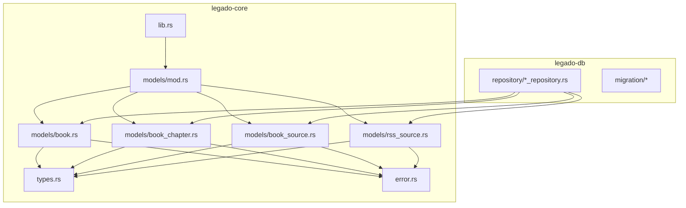
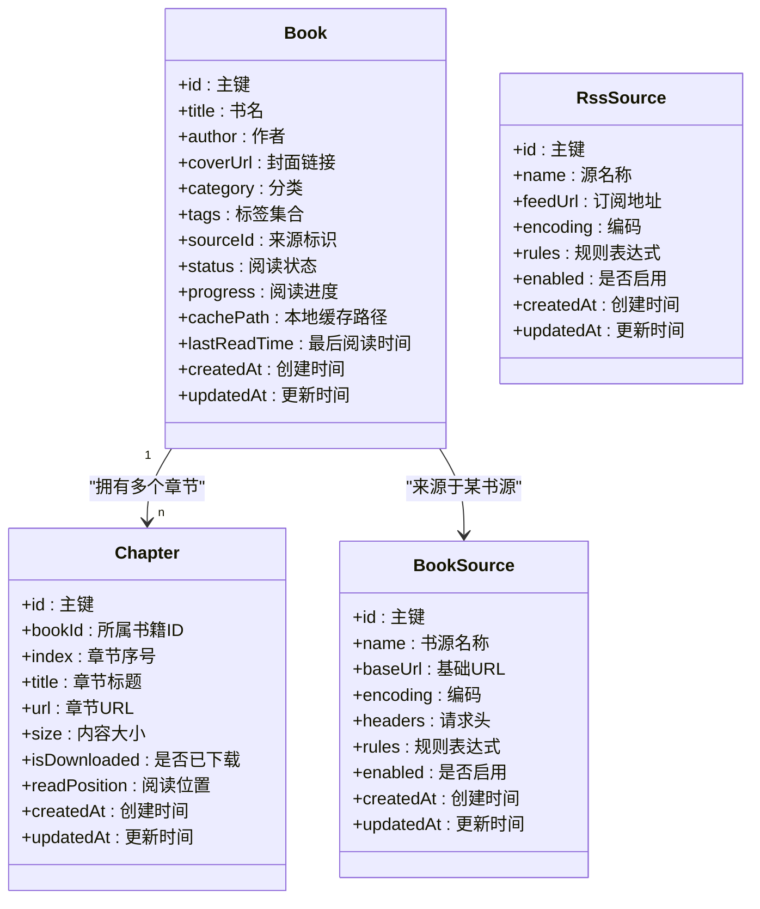
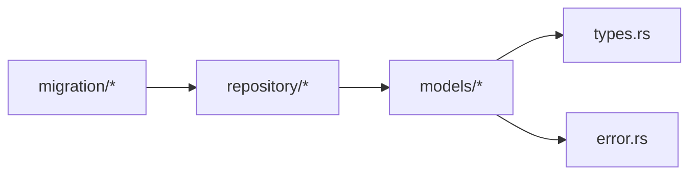

# 核心实体模型

<cite>
**本文引用的文件**   
- [book.rs](file://rust/legado-core/src/models/book.rs)
- [book_chapter.rs](file://rust/legado-core/src/models/book_chapter.rs)
- [book_source.rs](file://rust/legado-core/src/models/book_source.rs)
- [rss_source.rs](file://rust/legado-core/src/models/rss_source.rs)
- [mod.rs](file://rust/legado-core/src/models/mod.rs)
- [types.rs](file://rust/legado-core/src/types.rs)
- [error.rs](file://rust/legado-core/src/error.rs)
- [lib.rs](file://rust/legado-core/src/lib.rs)
</cite>

## 目录
1. [简介](#简介)
2. [项目结构](#项目结构)
3. [核心组件](#核心组件)
4. [架构总览](#架构总览)
5. [详细组件分析](#详细组件分析)
6. [依赖关系分析](#依赖关系分析)
7. [性能考虑](#性能考虑)
8. [故障排查指南](#故障排查指南)
9. [结论](#结论)
10. [附录](#附录)

## 简介
本文件聚焦 Legado 项目的核心数据模型，系统性阐述 Book、Chapter（章节）、BookSource（书源）、RssSource（RSS 源）等实体的字段定义、数据类型与业务含义；明确必填/可选字段与默认值策略；梳理实体间关联关系、外键约束、级联行为与数据完整性保证；给出验证规则、业务约束与错误处理机制；并说明序列化格式支持与跨平台兼容性考量。文档面向开发者与高级用户，力求在保持技术深度的同时易于理解。

## 项目结构
核心实体位于 Rust 模块 legado-core 的 models 子模块中，并通过 types 提供通用类型，error 提供统一错误类型，lib.rs 暴露对外接口。数据库层位于 legado-db，负责持久化与迁移。

图表来源
- [mod.rs](file://rust/legado-core/src/models/mod.rs)
- [book.rs](file://rust/legado-core/src/models/book.rs)
- [book_chapter.rs](file://rust/legado-core/src/models/book_chapter.rs)
- [book_source.rs](file://rust/legado-core/src/models/book_source.rs)
- [rss_source.rs](file://rust/legado-core/src/models/rss_source.rs)
- [types.rs](file://rust/legado-core/src/types.rs)
- [error.rs](file://rust/legado-core/src/error.rs)
- [lib.rs](file://rust/legado-core/src/lib.rs)

章节来源
- [mod.rs](file://rust/legado-core/src/models/mod.rs)
- [lib.rs](file://rust/legado-core/src/lib.rs)

## 核心组件
- Book：书籍元数据与阅读状态的核心实体，包含标题、作者、封面、分类、标签、阅读进度、缓存路径、来源标识等。
- Chapter：章节实体，描述章节序号、标题、URL、内容大小、是否已下载、阅读位置等。
- BookSource：书源配置实体，用于解析网页或 API 获取书籍与章节信息，包含名称、URL、编码、请求头、规则表达式等。
- RssSource：RSS 源配置实体，用于订阅 RSS 源并解析文章列表与内容，包含名称、地址、编码、规则表达式等。

章节来源
- [book.rs](file://rust/legado-core/src/models/book.rs)
- [book_chapter.rs](file://rust/legado-core/src/models/book_chapter.rs)
- [book_source.rs](file://rust/legado-core/src/models/book_source.rs)
- [rss_source.rs](file://rust/legado-core/src/models/rss_source.rs)

## 架构总览
下图展示核心实体之间的关联关系与主要职责边界。Book 与 Chapter 是一对多关系；Book 与 BookSource 通过来源标识建立映射；RssSource 独立于 Book 体系，但可产出文章条目供上层消费。

图表来源
- [book.rs](file://rust/legado-core/src/models/book.rs)
- [book_chapter.rs](file://rust/legado-core/src/models/book_chapter.rs)
- [book_source.rs](file://rust/legado-core/src/models/book_source.rs)
- [rss_source.rs](file://rust/legado-core/src/models/rss_source.rs)

## 详细组件分析

### Book（书籍）
- 字段与业务含义
  - id：唯一标识，通常自增或UUID，作为主键。
  - title：书籍标题，显示与搜索的关键字段。
  - author：作者名，支持模糊匹配与排序。
  - coverUrl：封面图片URL，支持懒加载与本地缓存。
  - category：分类，用于书架分组与筛选。
  - tags：标签集合，便于多维度检索与推荐。
  - sourceId：来源标识，指向 BookSource 的主键或外部来源ID。
  - status：阅读状态（如未开始、在读、已完结等）。
  - progress：阅读进度（百分比或页码），用于恢复阅读位置。
  - cachePath：本地缓存路径，指向已下载的章节或全文缓存。
  - lastReadTime：最后阅读时间，用于排序与最近阅读列表。
  - createdAt/updatedAt：审计时间戳，用于同步与增量更新。
- 必填/可选与默认值
  - 必填：id、title、sourceId、createdAt。
  - 可选：author、coverUrl、category、tags、status、progress、cachePath、lastReadTime、updatedAt。
  - 默认值：status=“未开始”，progress=0，createdAt=当前时间。
- 关联关系
  - 与 Chapter 一对多：一个 Book 对应多个 Chapter，通过 bookId 外键关联。
  - 与 BookSource 多对一：多个 Book 可来自同一 BookSource，通过 sourceId 关联。
- 数据完整性与约束
  - 外键约束：chapter.bookId 引用 book.id；book.sourceId 引用 book_source.id（若使用内部来源）。
  - 唯一性：title+author+sourceId 组合可视为业务唯一键，避免重复入库。
  - 非空校验：title、sourceId 不可为空。
- 验证规则与业务约束
  - title 长度限制与非法字符过滤。
  - progress 范围校验 0~100 或按页码上限。
  - cachePath 必须为有效路径且可写。
  - sourceId 必须存在对应的 BookSource（若为内部来源）。
- 错误处理
  - 无效输入返回统一错误类型，提示具体字段问题。
  - 外键不存在时抛出关联错误，建议先校验再写入。
- 序列化与跨平台
  - JSON 序列化支持，字段命名采用驼峰或下划线约定。
  - 兼容 Android/Flutter/Rust 三端，注意日期时间与枚举值的序列化为字符串。

章节来源
- [book.rs](file://rust/legado-core/src/models/book.rs)
- [types.rs](file://rust/legado-core/src/types.rs)
- [error.rs](file://rust/legado-core/src/error.rs)

### Chapter（章节）
- 字段与业务含义
  - id：章节唯一标识。
  - bookId：所属书籍ID，外键引用 Book。
  - index：章节序号，决定目录顺序。
  - title：章节标题，用于目录展示与搜索。
  - url：章节内容URL，用于按需抓取或缓存。
  - size：内容大小（字节），用于预估下载体积。
  - isDownloaded：是否已下载，控制读取策略。
  - readPosition：阅读位置（偏移或页码），用于恢复阅读。
  - createdAt/updatedAt：审计时间戳。
- 必填/可选与默认值
  - 必填：id、bookId、index、title、url、createdAt。
  - 可选：size、isDownloaded、readPosition、updatedAt。
  - 默认值：size=0，isDownloaded=false，readPosition=0，createdAt=当前时间。
- 关联关系
  - 与 Book 多对一：通过 bookId 外键关联。
- 数据完整性与约束
  - 外键约束：bookId 引用 book.id。
  - 唯一性：(bookId, index) 组合唯一，防止重复章节。
  - 非空校验：bookId、index、title、url 不可为空。
- 验证规则与业务约束
  - index 必须为正整数且递增。
  - url 需符合 URL 规范。
  - size 为非负数。
- 错误处理
  - 插入前校验 bookId 是否存在。
  - 重复 index 时返回冲突错误。
- 序列化与跨平台
  - JSON 序列化布尔与数值类型需一致。
  - 跨端传输时注意时间戳格式统一。

章节来源
- [book_chapter.rs](file://rust/legado-core/src/models/book_chapter.rs)
- [types.rs](file://rust/legado-core/src/types.rs)
- [error.rs](file://rust/legado-core/src/error.rs)

### BookSource（书源）
- 字段与业务含义
  - id：书源唯一标识。
  - name：书源名称，用于界面展示与选择。
  - baseUrl：基础URL，作为请求模板根路径。
  - encoding：编码（如 UTF-8、GBK），用于文本解码。
  - headers：请求头（Cookie、User-Agent 等），以键值对存储。
  - rules：规则表达式（XPath/JSONPath/正则），用于解析书籍与章节。
  - enabled：是否启用，控制是否参与搜索与抓取。
  - createdAt/updatedAt：审计时间戳。
- 必填/可选与默认值
  - 必填：id、name、baseUrl、rules、createdAt。
  - 可选：encoding、headers、enabled、updatedAt。
  - 默认值：encoding="UTF-8"，enabled=true，createdAt=当前时间。
- 关联关系
  - 与 Book 一对多：一个 BookSource 可被多个 Book 引用。
- 数据完整性与约束
  - 唯一性：name 或 baseUrl 可设为业务唯一键，避免重复书源。
  - 非空校验：name、baseUrl、rules 不可为空。
- 验证规则与业务约束
  - baseUrl 需为合法 URL。
  - rules 需通过语法校验（XPath/JSONPath/正则）。
  - headers 键值对需符合 HTTP 规范。
- 错误处理
  - 规则解析失败返回解析错误，附带行号与表达式片段。
  - URL 不合法返回参数错误。
- 序列化与跨平台
  - headers 以对象或数组形式序列化，确保跨端一致。
  - rules 以字符串存储，前端编辑器需支持相应语法高亮。

章节来源
- [book_source.rs](file://rust/legado-core/src/models/book_source.rs)
- [types.rs](file://rust/legado-core/src/types.rs)
- [error.rs](file://rust/legado-core/src/error.rs)

### RssSource（RSS 源）
- 字段与业务含义
  - id：RSS 源唯一标识。
  - name：源名称，用于界面展示。
  - feedUrl：订阅地址，RSS/Atom 标准格式。
  - encoding：编码，用于内容解码。
  - rules：规则表达式，用于解析文章列表与正文。
  - enabled：是否启用。
  - createdAt/updatedAt：审计时间戳。
- 必填/可选与默认值
  - 必填：id、name、feedUrl、rules、createdAt。
  - 可选：encoding、enabled、updatedAt。
  - 默认值：encoding="UTF-8"，enabled=true，createdAt=当前时间。
- 关联关系
  - 独立实体，不直接关联 Book/Chapter，但可产出文章条目供上层消费。
- 数据完整性与约束
  - 唯一性：name 或 feedUrl 可设为业务唯一键。
  - 非空校验：name、feedUrl、rules 不可为空。
- 验证规则与业务约束
  - feedUrl 需为合法 RSS/Atom 地址。
  - rules 需通过语法校验。
- 错误处理
  - 订阅失败返回网络或解析错误，记录重试策略。
- 序列化与跨平台
  - 与 BookSource 类似，rules 与 headers（如有）需跨端一致。

章节来源
- [rss_source.rs](file://rust/legado-core/src/models/rss_source.rs)
- [types.rs](file://rust/legado-core/src/types.rs)
- [error.rs](file://rust/legado-core/src/error.rs)

## 依赖关系分析
- 模块内依赖
  - models 模块通过 mod.rs 聚合各实体，对外暴露类型与接口。
  - types.rs 提供通用类型（如时间戳、枚举、结果类型）。
  - error.rs 定义统一错误类型，贯穿各实体验证与操作。
- 数据库层依赖
  - repository 层对各实体进行 CRUD 操作，遵循外键与唯一性约束。
  - migration 层管理数据库版本演进，确保向后兼容。
- 外部依赖
  - 网络库用于抓取书源与 RSS 内容。
  - 解析库用于 XPath/JSONPath/正则表达式解析。

图表来源
- [mod.rs](file://rust/legado-core/src/models/mod.rs)
- [types.rs](file://rust/legado-core/src/types.rs)
- [error.rs](file://rust/legado-core/src/error.rs)

章节来源
- [mod.rs](file://rust/legado-core/src/models/mod.rs)
- [types.rs](file://rust/legado-core/src/types.rs)
- [error.rs](file://rust/legado-core/src/error.rs)

## 性能考虑
- 索引设计
  - Book.title、Book.author、Book.category 建立索引以加速搜索与筛选。
  - Chapter.bookId、Chapter.index 建立复合索引以提升目录查询效率。
- 缓存策略
  - 封面图片与章节内容采用本地缓存，减少网络请求。
  - 书源规则与解析结果可短期缓存，提升解析速度。
- 批量操作
  - 章节批量插入与更新使用事务，降低锁竞争。
  - 大数据量导入时分批提交，避免内存溢出。
- 序列化优化
  - 大字段（如 rules、headers）按需序列化，避免冗余传输。
  - 时间戳统一为 Unix 毫秒或 ISO 8601，减少解析开销。

[本节为通用指导，不直接分析具体文件]

## 故障排查指南
- 常见错误类型
  - 参数校验失败：字段为空、格式错误、超出范围。
  - 外键约束冲突：关联实体不存在或已被删除。
  - 唯一性冲突：重复的书源名称或章节序号。
  - 解析失败：XPath/JSONPath/正则表达式语法错误或目标节点缺失。
- 定位方法
  - 查看错误类型与消息，定位具体字段与操作。
  - 检查数据库日志与迁移脚本，确认表结构与约束。
  - 使用调试工具验证规则表达式与 URL 模板。
- 修复建议
  - 修正输入数据或规则表达式。
  - 补充缺失的关联实体或清理脏数据。
  - 回滚或执行迁移脚本以修复表结构。

章节来源
- [error.rs](file://rust/legado-core/src/error.rs)

## 结论
Legado 的核心实体模型围绕 Book、Chapter、BookSource、RssSource 构建，形成清晰的领域边界与稳定的数据契约。通过严格的字段校验、外键约束与唯一性保证，确保数据完整性与一致性。序列化与跨平台兼容性设计使 Android、Flutter、Rust 三端能够高效协作。建议在扩展新实体时遵循现有模式，保持命名与语义的一致性，并完善验证与错误处理逻辑。

[本节为总结性内容，不直接分析具体文件]

## 附录
- 字段说明表格（示例）
  - Book：id、title、author、coverUrl、category、tags、sourceId、status、progress、cachePath、lastReadTime、createdAt、updatedAt。
  - Chapter：id、bookId、index、title、url、size、isDownloaded、readPosition、createdAt、updatedAt。
  - BookSource：id、name、baseUrl、encoding、headers、rules、enabled、createdAt、updatedAt。
  - RssSource：id、name、feedUrl、encoding、rules、enabled、createdAt、updatedAt。
- 序列化格式
  - JSON：推荐使用驼峰命名，时间戳为字符串或数字，枚举值为字符串。
  - 协议缓冲：如需高性能场景，可定义 .proto 文件并生成跨端代码。
- 跨平台注意事项
  - 时间与时区：统一使用 UTC 或客户端本地时间并标注时区。
  - 编码：默认 UTF-8，必要时显式声明编码。
  - 枚举值：保持跨端一致，避免歧义。

[本节为补充信息，不直接分析具体文件]