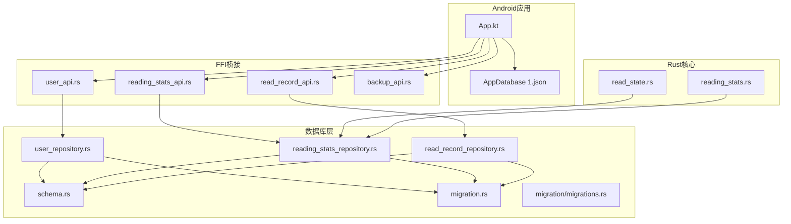
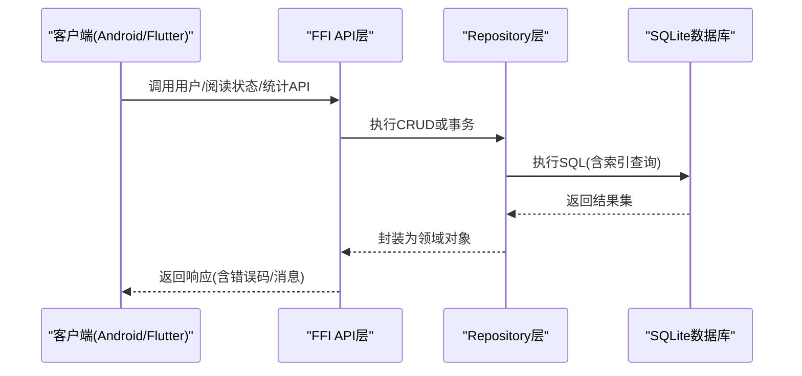
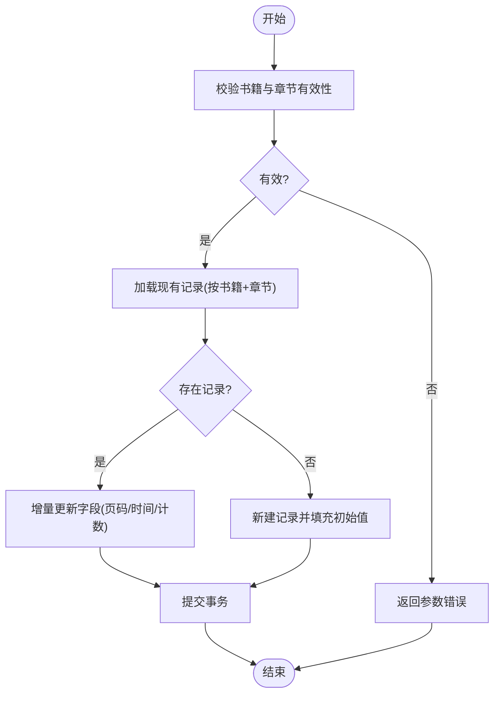
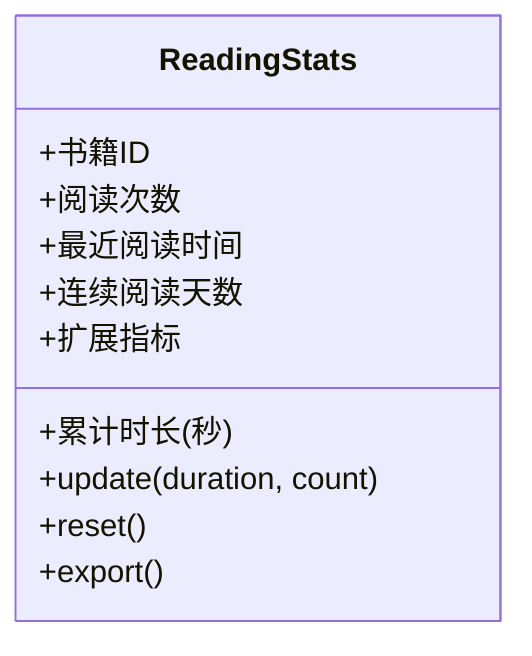
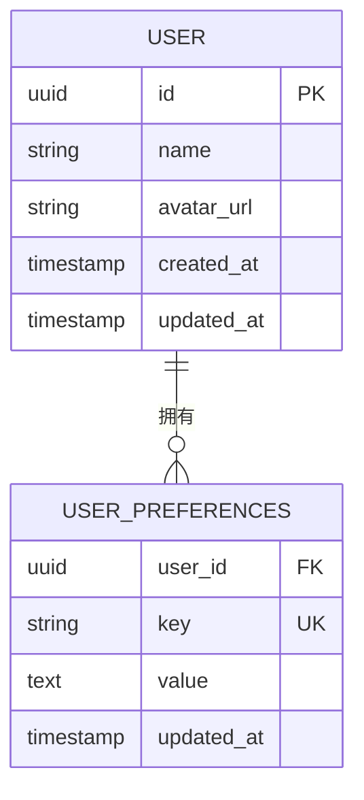
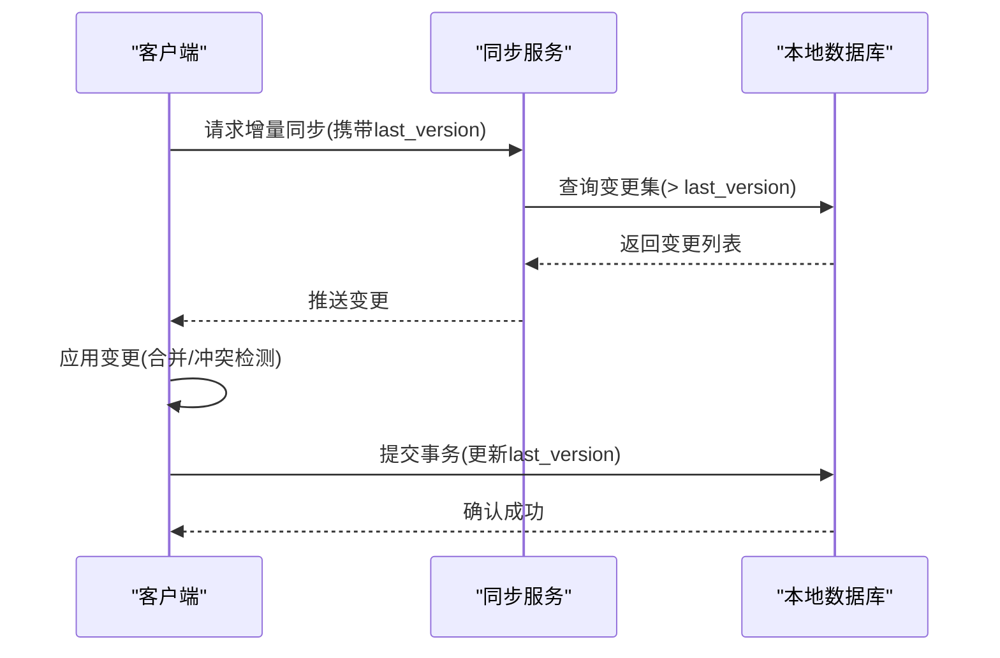
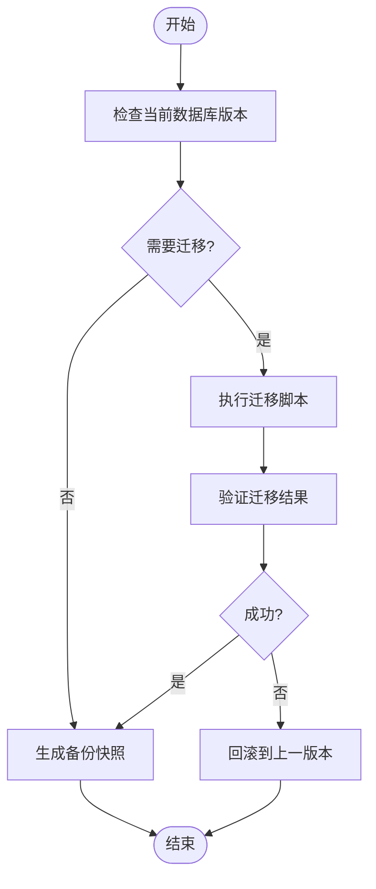
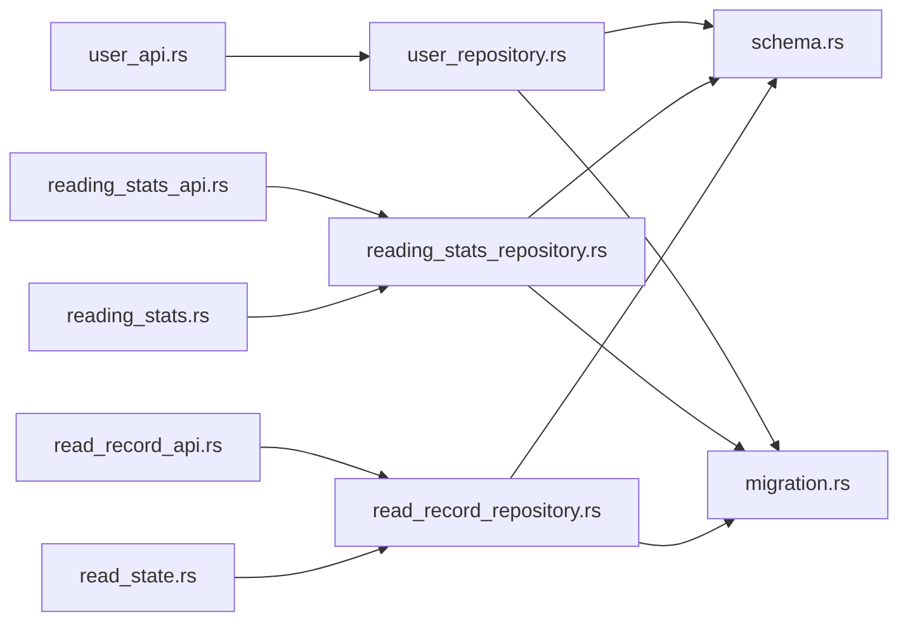

# 用户数据模型

<cite>
**本文引用的文件**   
- [read_state.rs](file://rust/legado-core/src/read_state.rs)
- [reading_stats.rs](file://rust/legado-core/src/reading_stats.rs)
- [user_repository.rs](file://rust/legado-db/src/repository/user_repository.rs)
- [reading_stats_repository.rs](file://rust/legado-db/src/repository/reading_stats_repository.rs)
- [read_record_repository.rs](file://rust/legado-db/src/repository/read_record_repository.rs)
- [schema.rs](file://rust/legado-db/src/schema.rs)
- [migration.rs](file://rust/legado-db/src/migration.rs)
- [migrations.rs](file://rust/legado-db/src/migration/migrations.rs)
- [backup_api.rs](file://rust/legado-ffi/src/api/backup_api.rs)
- [user_api.rs](file://rust/legado-ffi/src/api/user_api.rs)
- [reading_stats_api.rs](file://rust/legado-ffi/src/api/reading_stats_api.rs)
- [read_record_api.rs](file://rust/legado-ffi/src/api/read_record_api.rs)
- [App.kt](file://app/src/main/java/io/legado/app/App.kt)
- [AppDatabase 1.json](file://app/schemas/io.legado.app.data.AppDatabase/1.json)
</cite>

## 目录
1. [简介](#简介)
2. [项目结构](#项目结构)
3. [核心组件](#核心组件)
4. [架构总览](#架构总览)
5. [详细组件分析](#详细组件分析)
6. [依赖关系分析](#依赖关系分析)
7. [性能考虑](#性能考虑)
8. [故障排查指南](#故障排查指南)
9. [结论](#结论)
10. [附录](#附录)

## 简介
本文件聚焦于Legado中的“用户数据模型”，围绕以下目标展开：
- 用户偏好设置、阅读状态与统计数据的数据结构设计
- ReadState、ReadingStats等实体的字段定义与更新机制
- 本地存储策略（SQLite表设计与索引优化）
- 数据同步机制（增量同步、冲突解决、版本兼容）
- 数据迁移方案与备份恢复流程
- 隐私保护与安全考虑（敏感数据加密与访问控制）

## 项目结构
本项目采用多模块架构，用户数据相关能力主要分布在Rust核心层、数据库层、FFI桥接层以及Android应用层。关键路径如下：
- Rust核心层：定义ReadState、ReadingStats等实体与业务逻辑
- 数据库层：通过repository封装CRUD、迁移与默认数据
- FFI层：暴露API供上层调用（如备份、用户、阅读统计、阅读记录）
- Android层：App初始化与SQLite Schema管理

图表来源 
- [App.kt](file://app/src/main/java/io/legado/app/App.kt)
- [AppDatabase 1.json](file://app/schemas/io.legado.app.data.AppDatabase/1.json)
- [read_state.rs](file://rust/legado-core/src/read_state.rs)
- [reading_stats.rs](file://rust/legado-core/src/reading_stats.rs)
- [user_repository.rs](file://rust/legado-db/src/repository/user_repository.rs)
- [reading_stats_repository.rs](file://rust/legado-db/src/repository/reading_stats_repository.rs)
- [read_record_repository.rs](file://rust/legado-db/src/repository/read_record_repository.rs)
- [schema.rs](file://rust/legado-db/src/schema.rs)
- [migration.rs](file://rust/legado-db/src/migration.rs)
- [migrations.rs](file://rust/legado-db/src/migration/migrations.rs)
- [user_api.rs](file://rust/legado-ffi/src/api/user_api.rs)
- [reading_stats_api.rs](file://rust/legado-ffi/src/api/reading_stats_api.rs)
- [read_record_api.rs](file://rust/legado-ffi/src/api/read_record_api.rs)
- [backup_api.rs](file://rust/legado-ffi/src/api/backup_api.rs)

章节来源
- [App.kt](file://app/src/main/java/io/legado/app/App.kt)
- [AppDatabase 1.json](file://app/schemas/io.legado.app.data.AppDatabase/1.json)

## 核心组件
- ReadState：表示用户的阅读进度与状态，包含书籍标识、章节位置、翻页计数、最后阅读时间等关键字段，用于快速恢复阅读体验。
- ReadingStats：聚合阅读统计数据，如累计阅读时长、阅读次数、最近阅读时间、连续阅读天数等，用于分析与展示。
- User：用户基础信息与偏好设置，包括主题、字体、自动任务、网络代理、隐私开关等。
- Repository层：对SQLite进行统一CRUD操作，提供事务、批量写入、并发安全访问。
- FFI API：对外暴露读写接口，便于Flutter/Web/Android侧调用。

章节来源
- [read_state.rs](file://rust/legado-core/src/read_state.rs)
- [reading_stats.rs](file://rust/legado-core/src/reading_stats.rs)
- [user_repository.rs](file://rust/legado-db/src/repository/user_repository.rs)
- [reading_stats_repository.rs](file://rust/legado-db/src/repository/reading_stats_repository.rs)
- [read_record_repository.rs](file://rust/legado-db/src/repository/read_record_repository.rs)

## 架构总览
下图展示了从上层调用到数据库落地的完整链路，涵盖用户偏好、阅读状态与统计数据的读写路径。

图表来源 
- [user_api.rs](file://rust/legado-ffi/src/api/user_api.rs)
- [reading_stats_api.rs](file://rust/legado-ffi/src/api/reading_stats_api.rs)
- [read_record_api.rs](file://rust/legado-ffi/src/api/read_record_api.rs)
- [user_repository.rs](file://rust/legado-db/src/repository/user_repository.rs)
- [reading_stats_repository.rs](file://rust/legado-db/src/repository/reading_stats_repository.rs)
- [read_record_repository.rs](file://rust/legado-db/src/repository/read_record_repository.rs)

## 详细组件分析

### ReadState实体与更新机制
- 字段设计要点
  - 书籍标识：唯一关联一本书
  - 章节索引/标题：定位当前阅读位置
  - 页码/偏移：精确到页面或字符级位置
  - 翻页计数：用于统计阅读行为
  - 最后阅读时间：用于排序与清理策略
  - 扩展字段：支持不同格式（EPUB/TXT/PDF）的差异化存储
- 更新机制
  - 增量更新：每次翻页仅更新必要字段，避免全量覆盖
  - 原子写入：使用事务保证一致性
  - 去重策略：基于书籍+章节主键，防止重复插入
  - 缓存策略：内存中维护最近N条记录，降低频繁IO

图表来源 
- [read_state.rs](file://rust/legado-core/src/read_state.rs)
- [read_record_repository.rs](file://rust/legado-db/src/repository/read_record_repository.rs)

章节来源
- [read_state.rs](file://rust/legado-core/src/read_state.rs)
- [read_record_repository.rs](file://rust/legado-db/src/repository/read_record_repository.rs)

### ReadingStats实体与更新机制
- 字段设计要点
  - 累计阅读时长：秒级精度，支持跨设备汇总
  - 阅读次数：按日/周/月维度聚合
  - 最近阅读时间：用于活跃用户判断
  - 连续阅读天数：用于激励与提醒
  - 扩展指标：可接入自定义统计项
- 更新机制
  - 事件驱动：阅读开始/结束、翻页、暂停/继续触发统计更新
  - 批处理：将多次小更新合并为一次批量写入
  - 幂等性：基于时间戳+版本号避免重复累加
  - 异步计算：后台线程完成复杂聚合，不阻塞UI

图表来源 
- [reading_stats.rs](file://rust/legado-core/src/reading_stats.rs)
- [reading_stats_repository.rs](file://rust/legado-db/src/repository/reading_stats_repository.rs)

章节来源
- [reading_stats.rs](file://rust/legado-core/src/reading_stats.rs)
- [reading_stats_repository.rs](file://rust/legado-db/src/repository/reading_stats_repository.rs)

### 用户偏好设置(User)与本地存储
- 偏好项分类
  - 界面主题、字体大小、行间距
  - 自动任务配置（定时刷新、下载策略）
  - 网络设置（代理、超时、重试）
  - 隐私开关（日志、遥测、广告）
- 存储策略
  - SQLite表设计：用户表+偏好键值表，支持JSON扩展
  - 索引优化：按用户ID、键名建立索引，加速查询
  - 默认值：首次启动注入默认配置
  - 版本兼容：Schema迁移确保旧版本数据可用

图表来源 
- [user_repository.rs](file://rust/legado-db/src/repository/user_repository.rs)
- [schema.rs](file://rust/legado-db/src/schema.rs)

章节来源
- [user_repository.rs](file://rust/legado-db/src/repository/user_repository.rs)
- [schema.rs](file://rust/legado-db/src/schema.rs)

### 数据同步机制（增量、冲突、版本兼容）
- 增量同步
  - 基于时间戳或版本号拉取变更
  - 断点续传：记录已同步的最大版本号
  - 差异合并：按字段粒度合并，避免覆盖
- 冲突解决
  - 策略选择：服务端优先/客户端优先/手动合并
  - 冲突检测：比较版本号与哈希值
  - 回滚机制：失败时恢复到上一个稳定版本
- 版本兼容
  - Schema迁移脚本：确保新旧版本共存
  - 数据清洗：迁移过程中清理废弃字段
  - 降级兼容：老客户端读取新字段时忽略未知项

图表来源 
- [migration.rs](file://rust/legado-db/src/migration.rs)
- [migrations.rs](file://rust/legado-db/src/migration/migrations.rs)

章节来源
- [migration.rs](file://rust/legado-db/src/migration.rs)
- [migrations.rs](file://rust/legado-db/src/migration/migrations.rs)

### 数据迁移方案与备份恢复流程
- 迁移方案
  - 版本化Schema：每个版本对应一个JSON描述
  - 自动迁移：应用启动时检查并执行升级脚本
  - 回滚策略：失败时保留原数据，记录错误日志
- 备份恢复
  - 全量备份：导出SQLite数据库为压缩文件
  - 增量备份：仅备份变更部分，减少体积
  - 恢复验证：导入后校验完整性与一致性

图表来源 
- [backup_api.rs](file://rust/legado-ffi/src/api/backup_api.rs)
- [migration.rs](file://rust/legado-db/src/migration.rs)

章节来源
- [backup_api.rs](file://rust/legado-ffi/src/api/backup_api.rs)
- [migration.rs](file://rust/legado-db/src/migration.rs)

### 隐私保护与安全考虑
- 敏感数据加密
  - 用户密码、令牌等使用AES-GCM加密存储
  - 密钥管理：结合系统KeyStore或硬件安全模块
- 访问控制
  - 权限校验：基于角色的访问控制(RBAC)
  - 最小权限原则：仅授予必要权限
- 审计与日志
  - 敏感操作记录：登录、修改偏好、导出数据
  - 日志脱敏：移除PII信息，避免泄露

章节来源
- [user_api.rs](file://rust/legado-ffi/src/api/user_api.rs)
- [backup_api.rs](file://rust/legado-ffi/src/api/backup_api.rs)

## 依赖关系分析
下图展示了各组件间的依赖关系，突出Repository对Schema和Migration的依赖，以及FFI API对Repository的调用。

图表来源 
- [user_api.rs](file://rust/legado-ffi/src/api/user_api.rs)
- [reading_stats_api.rs](file://rust/legado-ffi/src/api/reading_stats_api.rs)
- [read_record_api.rs](file://rust/legado-ffi/src/api/read_record_api.rs)
- [user_repository.rs](file://rust/legado-db/src/repository/user_repository.rs)
- [reading_stats_repository.rs](file://rust/legado-db/src/repository/reading_stats_repository.rs)
- [read_record_repository.rs](file://rust/legado-db/src/repository/read_record_repository.rs)
- [schema.rs](file://rust/legado-db/src/schema.rs)
- [migration.rs](file://rust/legado-db/src/migration.rs)
- [read_state.rs](file://rust/legado-core/src/read_state.rs)
- [reading_stats.rs](file://rust/legado-core/src/reading_stats.rs)

章节来源
- [user_api.rs](file://rust/legado-ffi/src/api/user_api.rs)
- [reading_stats_api.rs](file://rust/legado-ffi/src/api/reading_stats_api.rs)
- [read_record_api.rs](file://rust/legado-ffi/src/api/read_record_api.rs)
- [user_repository.rs](file://rust/legado-db/src/repository/user_repository.rs)
- [reading_stats_repository.rs](file://rust/legado-db/src/repository/reading_stats_repository.rs)
- [read_record_repository.rs](file://rust/legado-db/src/repository/read_record_repository.rs)
- [schema.rs](file://rust/legado-db/src/schema.rs)
- [migration.rs](file://rust/legado-db/src/migration.rs)
- [read_state.rs](file://rust/legado-core/src/read_state.rs)
- [reading_stats.rs](file://rust/legado-core/src/reading_stats.rs)

## 性能考虑
- 索引优化
  - 为高频查询字段建立复合索引（如书籍ID+章节索引）
  - 避免过度索引，平衡写入性能
- 批量操作
  - 使用事务批量插入/更新，减少IO开销
  - 分页查询，避免一次性加载大量数据
- 缓存策略
  - 内存缓存热点数据（如最近阅读记录）
  - 二级缓存（磁盘缓存）用于离线场景
- 异步处理
  - 耗时操作放入后台线程，避免阻塞UI
  - 使用协程或线程池管理并发

## 故障排查指南
- 常见问题
  - 数据库版本不一致：检查迁移脚本是否完整执行
  - 数据丢失：验证备份快照是否可用，尝试恢复
  - 性能下降：分析慢查询，优化索引或SQL
- 调试工具
  - 启用详细日志：记录关键操作与异常
  - 数据库可视化工具：检查表结构与数据一致性
  - 压力测试：模拟高并发场景，发现瓶颈

章节来源
- [migration.rs](file://rust/legado-db/src/migration.rs)
- [backup_api.rs](file://rust/legado-ffi/src/api/backup_api.rs)

## 结论
Legado的用户数据模型以ReadState、ReadingStats为核心，结合Repository与FFI API，实现了高效、安全、可扩展的用户数据管理。通过增量同步、冲突解决、版本兼容与备份恢复机制，确保了数据的一致性与可用性。未来可进一步优化索引策略与缓存机制，提升整体性能。

## 附录
- 术语表
  - ReadState：阅读状态实体
  - ReadingStats：阅读统计实体
  - Repository：数据访问层
  - FFI：外部函数接口
- 参考链接
  - SQLite官方文档
  - Rust SQLx库文档
  - Android Room框架文档