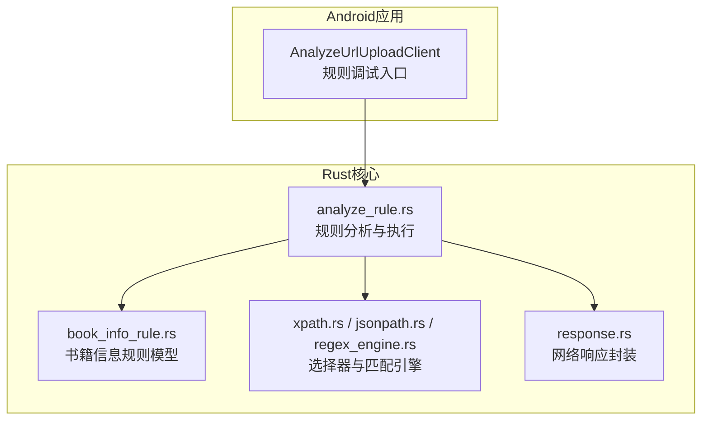
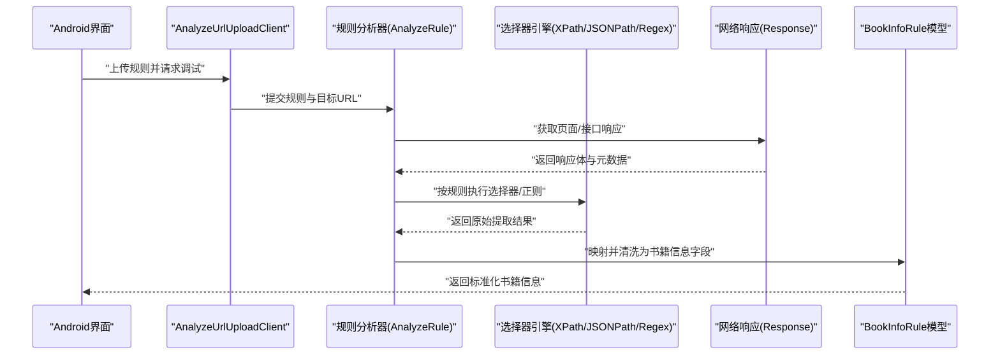
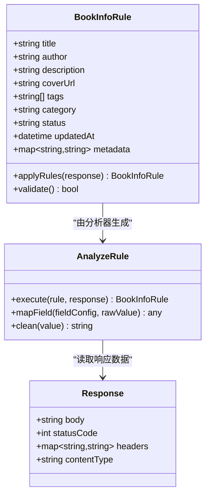
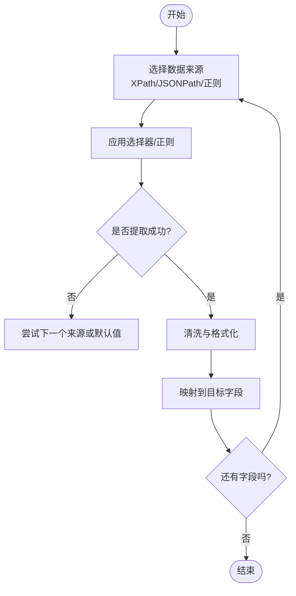
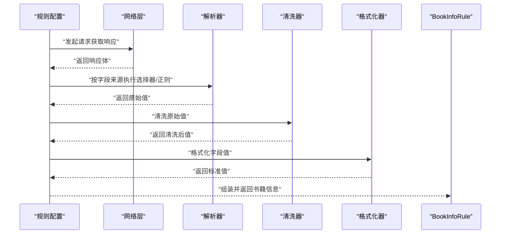
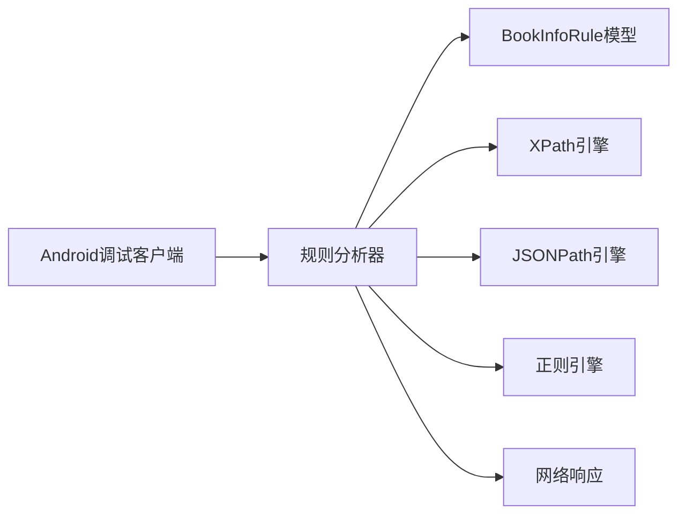

# 书籍信息规则

<cite>
**本文引用的文件**   
- [legado-core/src/models/rule/book_info_rule.rs](file://rust/legado-core/src/models/rule/book_info_rule.rs)
- [legado-parser/src/analyze_rule.rs](file://rust/legado-parser/src/analyze_rule.rs)
- [legado-parser/src/xpath.rs](file://rust/legado-parser/src/xpath.rs)
- [legado-parser/src/jsonpath.rs](file://rust/legado-parser/src/jsonpath.rs)
- [legado-parser/src/regex_engine.rs](file://rust/legado-parser/src/regex_engine.rs)
- [legado-net/src/response.rs](file://rust/legado-net/src/response.rs)
- [app/src/main/java/io/legado/app/model/AnalyzeUrlUploadClient.kt](file://app/src/main/java/io/legado/app/model/AnalyzeUrlUploadClient.kt)
</cite>

## 目录
1. [简介](#简介)
2. [项目结构](#项目结构)
3. [核心组件](#核心组件)
4. [架构总览](#架构总览)
5. [详细组件分析](#详细组件分析)
6. [依赖关系分析](#依赖关系分析)
7. [性能考量](#性能考量)
8. [故障排查指南](#故障排查指南)
9. [结论](#结论)
10. [附录](#附录)

## 简介
本文件面向Legado的“书籍信息规则”（BookInfoRule），系统性阐述其数据结构、字段解析规则定义、选择器语法（XPath、CSS选择器、正则表达式）与字段映射机制，并给出完整的执行流程说明（页面抓取、内容提取、数据清洗与格式化）。文档同时提供规则编写示例、调试技巧与常见问题解决方案，帮助读者快速上手并稳定维护各类网站结构与数据格式。

## 项目结构
与书籍信息规则相关的核心代码主要分布在以下模块：
- Rust核心模型与规则定义：legado-core 中的规则模型
- 解析引擎与选择器支持：legado-parser 中的XPath、JSONPath、正则引擎与规则分析
- 网络响应处理：legado-net 中的响应封装
- Android端调试工具：用于上传与分析规则的客户端

**图表来源** 
- [legado-core/src/models/rule/book_info_rule.rs](file://rust/legado-core/src/models/rule/book_info_rule.rs)
- [legado-parser/src/analyze_rule.rs](file://rust/legado-parser/src/analyze_rule.rs)
- [legado-parser/src/xpath.rs](file://rust/legado-parser/src/xpath.rs)
- [legado-parser/src/jsonpath.rs](file://rust/legado-parser/src/jsonpath.rs)
- [legado-parser/src/regex_engine.rs](file://rust/legado-parser/src/regex_engine.rs)
- [legado-net/src/response.rs](file://rust/legado-net/src/response.rs)
- [app/src/main/java/io/legado/app/model/AnalyzeUrlUploadClient.kt](file://app/src/main/java/io/legado/app/model/AnalyzeUrlUploadClient.kt)

**章节来源**
- [legado-core/src/models/rule/book_info_rule.rs](file://rust/legado-core/src/models/rule/book_info_rule.rs)
- [legado-parser/src/analyze_rule.rs](file://rust/legado-parser/src/analyze_rule.rs)
- [legado-parser/src/xpath.rs](file://rust/legado-parser/src/xpath.rs)
- [legado-parser/src/jsonpath.rs](file://rust/legado-parser/src/jsonpath.rs)
- [legado-parser/src/regex_engine.rs](file://rust/legado-parser/src/regex_engine.rs)
- [legado-net/src/response.rs](file://rust/legado-net/src/response.rs)
- [app/src/main/java/io/legado/app/model/AnalyzeUrlUploadClient.kt](file://app/src/main/java/io/legado/app/model/AnalyzeUrlUploadClient.kt)

## 核心组件
- BookInfoRule：定义书籍信息的结构化字段与解析规则，包括书名、作者、简介、封面URL等字段的取值来源与转换策略。
- 规则分析器（analyze_rule）：负责将规则配置转换为可执行的解析流程，协调选择器与正则引擎完成数据提取。
- 选择器引擎：
  - XPath：用于HTML/XML节点定位与文本/属性提取。
  - JSONPath：用于JSON数据的键路径定位与值提取。
  - 正则表达式：用于复杂文本模式匹配与清洗。
- 网络响应封装：统一HTTP响应体、状态码、头部等信息，供规则执行时读取。
- 调试客户端：提供规则上传与在线调试能力，便于验证选择器与正则效果。

**章节来源**
- [legado-core/src/models/rule/book_info_rule.rs](file://rust/legado-core/src/models/rule/book_info_rule.rs)
- [legado-parser/src/analyze_rule.rs](file://rust/legado-parser/src/analyze_rule.rs)
- [legado-parser/src/xpath.rs](file://rust/legado-parser/src/xpath.rs)
- [legado-parser/src/jsonpath.rs](file://rust/legado-parser/src/jsonpath.rs)
- [legado-parser/src/regex_engine.rs](file://rust/legado-parser/src/regex_engine.rs)
- [legado-net/src/response.rs](file://rust/legado-net/src/response.rs)
- [app/src/main/java/io/legado/app/model/AnalyzeUrlUploadClient.kt](file://app/src/main/java/io/legado/app/model/AnalyzeUrlUploadClient.kt)

## 架构总览
书籍信息规则的执行流程从Android端发起，进入Rust核心进行规则解析与执行，最终输出标准化的书籍信息对象。

**图表来源** 
- [app/src/main/java/io/legado/app/model/AnalyzeUrlUploadClient.kt](file://app/src/main/java/io/legado/app/model/AnalyzeUrlUploadClient.kt)
- [legado-parser/src/analyze_rule.rs](file://rust/legado-parser/src/analyze_rule.rs)
- [legado-parser/src/xpath.rs](file://rust/legado-parser/src/xpath.rs)
- [legado-parser/src/jsonpath.rs](file://rust/legado-parser/src/jsonpath.rs)
- [legado-parser/src/regex_engine.rs](file://rust/legado-parser/src/regex_engine.rs)
- [legado-net/src/response.rs](file://rust/legado-net/src/response.rs)
- [legado-core/src/models/rule/book_info_rule.rs](file://rust/legado-core/src/models/rule/book_info_rule.rs)

## 详细组件分析

### BookInfoRule 数据结构与字段映射
- 字段范围：通常包含书名、作者、简介、封面URL、标签、分类、状态、更新信息等。
- 字段来源：每个字段可配置多种来源（如HTML元素文本、属性、JSON键值、正则匹配片段）。
- 转换策略：支持字符串修剪、编码修正、HTML转义还原、日期/时间格式化、URL规范化等。
- 默认值与回退：当某来源失败时可指定备用来源或默认值，提高鲁棒性。

**图表来源** 
- [legado-core/src/models/rule/book_info_rule.rs](file://rust/legado-core/src/models/rule/book_info_rule.rs)
- [legado-parser/src/analyze_rule.rs](file://rust/legado-parser/src/analyze_rule.rs)
- [legado-net/src/response.rs](file://rust/legado-net/src/response.rs)

**章节来源**
- [legado-core/src/models/rule/book_info_rule.rs](file://rust/legado-core/src/models/rule/book_info_rule.rs)
- [legado-parser/src/analyze_rule.rs](file://rust/legado-parser/src/analyze_rule.rs)
- [legado-net/src/response.rs](file://rust/legado-net/src/response.rs)

### 选择器语法与字段映射机制
- XPath：适用于HTML/XML结构，支持节点选择、属性访问、文本提取、函数调用（如contains、normalize-space）。
- CSS选择器：在部分场景下作为XPath的替代或补充，适合简单DOM定位。
- JSONPath：针对API返回的JSON数据，支持键路径、数组索引、过滤器表达式。
- 正则表达式：用于复杂文本模式匹配、清洗与二次提取，可与XPath/JSONPath组合使用。
- 字段映射：规则中为每个目标字段配置一个或多个来源，按优先级顺序尝试，直至成功；支持转换链（trim、unescape、format等）。

**图表来源** 
- [legado-parser/src/xpath.rs](file://rust/legado-parser/src/xpath.rs)
- [legado-parser/src/jsonpath.rs](file://rust/legado-parser/src/jsonpath.rs)
- [legado-parser/src/regex_engine.rs](file://rust/legado-parser/src/regex_engine.rs)
- [legado-parser/src/analyze_rule.rs](file://rust/legado-parser/src/analyze_rule.rs)

**章节来源**
- [legado-parser/src/xpath.rs](file://rust/legado-parser/src/xpath.rs)
- [legado-parser/src/jsonpath.rs](file://rust/legado-parser/src/jsonpath.rs)
- [legado-parser/src/regex_engine.rs](file://rust/legado-parser/src/regex_engine.rs)
- [legado-parser/src/analyze_rule.rs](file://rust/legado-parser/src/analyze_rule.rs)

### 执行流程：页面抓取、内容提取、数据清洗与格式化
- 页面抓取：根据规则配置的URL模板与请求参数，获取响应体（HTML/JSON等）。
- 内容提取：按字段来源依次应用选择器或正则，得到原始值。
- 数据清洗：去除空白、修复编码、还原HTML实体、过滤无效字符。
- 格式化：对日期、时间、URL等进行标准化处理，确保字段类型一致。
- 结果组装：将各字段映射至BookInfoRule实例，返回给上层使用。

**图表来源** 
- [legado-parser/src/analyze_rule.rs](file://rust/legado-parser/src/analyze_rule.rs)
- [legado-net/src/response.rs](file://rust/legado-net/src/response.rs)
- [legado-core/src/models/rule/book_info_rule.rs](file://rust/legado-core/src/models/rule/book_info_rule.rs)

**章节来源**
- [legado-parser/src/analyze_rule.rs](file://rust/legado-parser/src/analyze_rule.rs)
- [legado-net/src/response.rs](file://rust/legado-net/src/response.rs)
- [legado-core/src/models/rule/book_info_rule.rs](file://rust/legado-core/src/models/rule/book_info_rule.rs)

### 规则编写示例与实践
- HTML站点示例：通过XPath定位标题、作者、简介与封面图片，必要时用正则清洗多余空格或特殊字符。
- JSON API示例：使用JSONPath直接取键值，结合正则处理嵌套或拼接字段。
- 混合场景：先XPath提取大块HTML片段，再用正则精准匹配所需文本。
- 回退策略：为关键字段设置多个来源与默认值，提升容错率。

[本节为概念性指导，不直接分析具体文件]

### 调试技巧与常见问题
- 使用调试客户端上传规则并在线验证选择器与正则效果。
- 逐步缩小选择器范围，确认命中节点是否正确。
- 打印中间结果，检查清洗与格式化步骤是否影响预期。
- 常见错误：
  - 选择器未命中导致空值：检查DOM结构变化或编码问题。
  - 正则过于宽松或严格：调整模式以平衡准确性与覆盖率。
  - 网络超时或反爬限制：增加重试与延迟策略。

**章节来源**
- [app/src/main/java/io/legado/app/model/AnalyzeUrlUploadClient.kt](file://app/src/main/java/io/legado/app/model/AnalyzeUrlUploadClient.kt)
- [legado-parser/src/analyze_rule.rs](file://rust/legado-parser/src/analyze_rule.rs)

## 依赖关系分析
- 规则模型依赖解析器与选择器引擎，解析器依赖网络响应封装。
- Android端通过调试客户端与Rust核心交互，实现规则上传与在线调试。
- 各组件间松耦合，便于替换或扩展选择器与清洗逻辑。

**图表来源** 
- [app/src/main/java/io/legado/app/model/AnalyzeUrlUploadClient.kt](file://app/src/main/java/io/legado/app/model/AnalyzeUrlUploadClient.kt)
- [legado-parser/src/analyze_rule.rs](file://rust/legado-parser/src/analyze_rule.rs)
- [legado-parser/src/xpath.rs](file://rust/legado-parser/src/xpath.rs)
- [legado-parser/src/jsonpath.rs](file://rust/legado-parser/src/jsonpath.rs)
- [legado-parser/src/regex_engine.rs](file://rust/legado-parser/src/regex_engine.rs)
- [legado-net/src/response.rs](file://rust/legado-net/src/response.rs)
- [legado-core/src/models/rule/book_info_rule.rs](file://rust/legado-core/src/models/rule/book_info_rule.rs)

**章节来源**
- [legado-parser/src/analyze_rule.rs](file://rust/legado-parser/src/analyze_rule.rs)
- [legado-net/src/response.rs](file://rust/legado-net/src/response.rs)
- [legado-core/src/models/rule/book_info_rule.rs](file://rust/legado-core/src/models/rule/book_info_rule.rs)

## 性能考量
- 选择器优化：优先使用精确的XPath或JSONPath，避免全表扫描。
- 正则效率：尽量使用非贪婪匹配与预编译模式，减少回溯开销。
- 缓存策略：对重复请求的响应或解析结果进行缓存，降低网络与CPU压力。
- 并发控制：批量抓取时合理设置并发度，避免触发反爬或资源耗尽。

[本节为通用指导，不直接分析具体文件]

## 故障排查指南
- 选择器未命中：检查目标页面的DOM结构是否变更，或使用更通用的选择器。
- 正则匹配异常：简化模式并逐步添加条件，定位问题片段。
- 编码问题：确认响应编码与输入编码一致，必要时进行转码。
- 网络错误：查看状态码与错误信息，调整请求头或重试策略。

**章节来源**
- [legado-parser/src/analyze_rule.rs](file://rust/legado-parser/src/analyze_rule.rs)
- [legado-net/src/response.rs](file://rust/legado-net/src/response.rs)

## 结论
BookInfoRule通过灵活的选择器与正则机制，结合强大的清洗与格式化能力，能够适配多样化的网站结构与数据格式。借助调试客户端与清晰的执行流程，开发者可以快速编写、验证与维护规则，确保书籍信息提取的准确性与稳定性。

[本节为总结性内容，不直接分析具体文件]

## 附录
- 最佳实践：
  - 为关键字段设置多来源与默认值。
  - 使用最小化选择器与高效正则。
  - 定期验证规则与页面结构的兼容性。
- 参考资源：
  - XPath与JSONPath官方文档。
  - 正则表达式基础与高级用法。

[本节为补充信息，不直接分析具体文件]