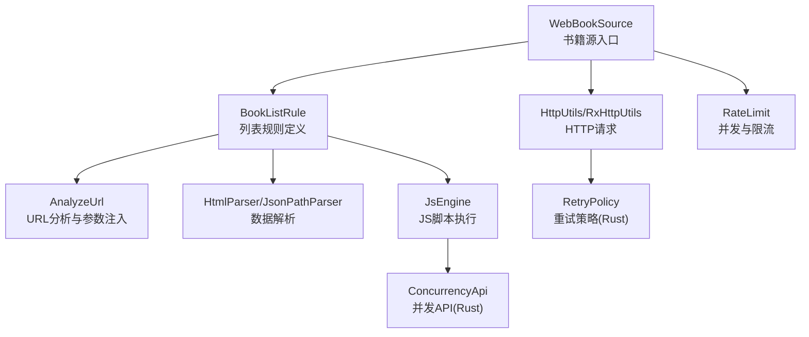
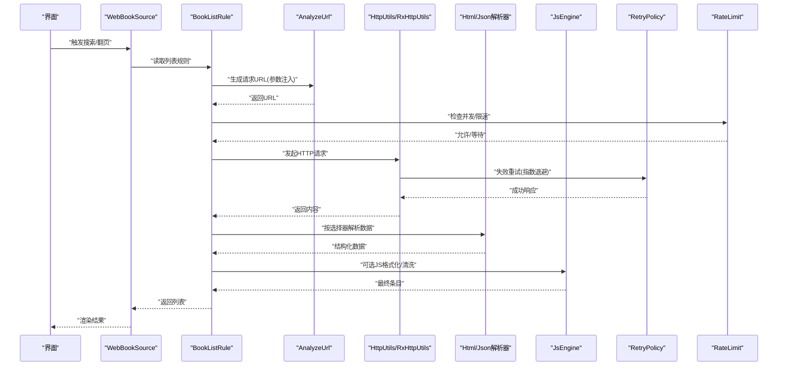
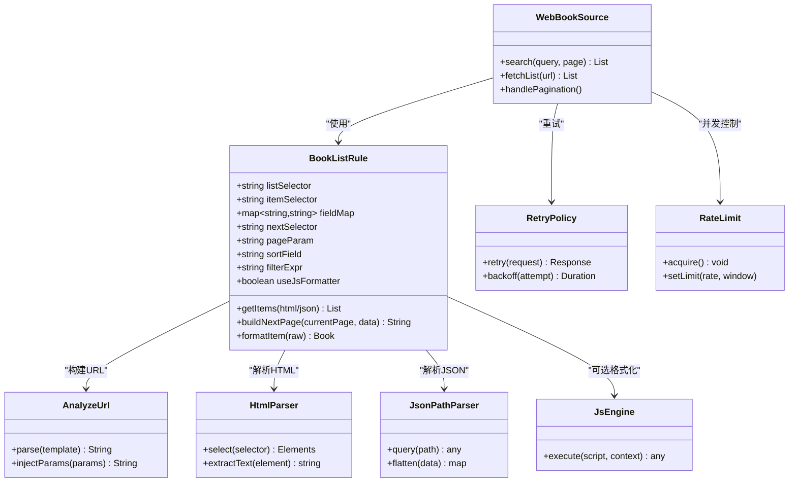
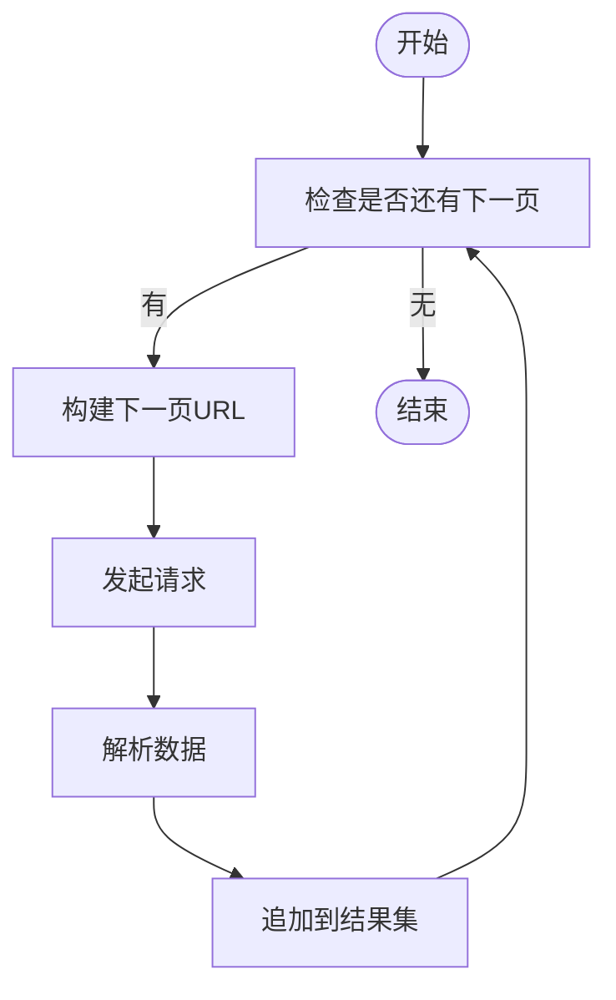
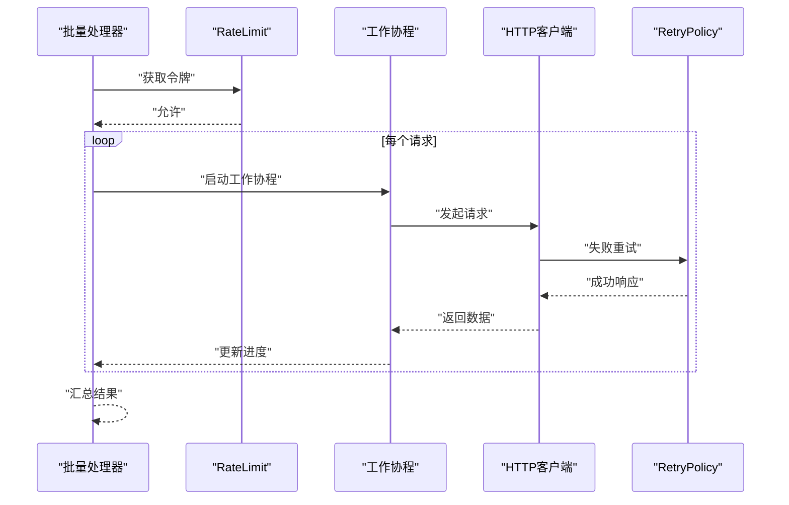
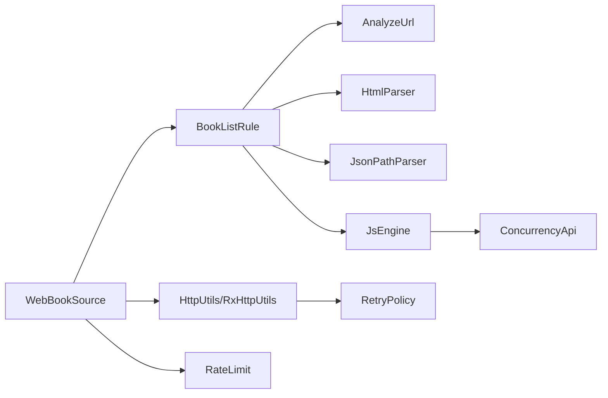

# 书籍列表规则

<cite>
**本文引用的文件**   
- [BookListRule.kt](file://app/src/main/java/io/legado/app/model/webBook/BookListRule.kt)
- [BookSource.kt](file://app/src/main/java/io/legado/app/model/webBook/BookSource.kt)
- [WebBookSource.kt](file://app/src/main/java/io/legado/app/model/webBook/WebBookSource.kt)
- [AnalyzeUrl.kt](file://app/src/main/java/io/legado/app/help/AnalyzeUrl.kt)
- [HttpUtils.kt](file://app/src/main/java/io/legado/app/utils/HttpUtils.kt)
- [RxHttpUtils.kt](file://app/src/main/java/io/legado/app/utils/RxHttpUtils.kt)
- [JsEngine.kt](file://app/src/main/java/io/legado/app/lib/js/JsEngine.kt)
- [RuleAnalyzer.kt](file://rust/legado-parser/src/rule_analyzer.rs)
- [HtmlParser.kt](file://app/src/main/java/io/legado/app/help/HtmlParser.kt)
- [JsonPathParser.kt](file://app/src/main/java/io/legado/app/help/JsonPathParser.kt)
- [RetryPolicy.kt](file://rust/legado-net/src/retry.rs)
- [RateLimit.kt](file://app/src/main/java/io/legado/app/utils/RateLimit.kt)
- [ConcurrencyApi.kt](file://rust/legado-js/src/host_api/concurrency_api.rs)
</cite>

## 目录
1. [简介](#简介)
2. [项目结构](#项目结构)
3. [核心组件](#核心组件)
4. [架构总览](#架构总览)
5. [详细组件分析](#详细组件分析)
6. [依赖关系分析](#依赖关系分析)
7. [性能考虑](#性能考虑)
8. [故障排查指南](#故障排查指南)
9. [结论](#结论)
10. [附录](#附录)

## 简介
本文件面向Legado项目中“书籍列表规则”的完整说明，聚焦 BookListRule 的结构设计、列表项选择器、分页处理、搜索结果格式化等能力；并系统阐述批量获取机制（并发控制、错误重试、进度跟踪）、复杂列表场景（嵌套列表、动态加载、无限滚动）的处理方法。同时提供多类网站类型的规则编写模板与最佳实践，以及性能优化与内存管理建议，帮助开发者快速构建稳定高效的书籍源规则。

## 项目结构
与书籍列表规则相关的代码主要分布在 Android 应用层与 Rust 解析/网络层：
- Android 层负责规则定义、HTTP 请求、HTML/JSON 解析、JS 脚本执行、并发与限流控制。
- Rust 层提供规则分析、网络重试、并发 API 暴露给 JS 引擎等底层能力。

图表来源 
- [WebBookSource.kt](file://app/src/main/java/io/legado/app/model/webBook/WebBookSource.kt)
- [BookListRule.kt](file://app/src/main/java/io/legado/app/model/webBook/BookListRule.kt)
- [AnalyzeUrl.kt](file://app/src/main/java/io/legado/app/help/AnalyzeUrl.kt)
- [HtmlParser.kt](file://app/src/main/java/io/legado/app/help/HtmlParser.kt)
- [JsonPathParser.kt](file://app/src/main/java/io/legado/app/help/JsonPathParser.kt)
- [JsEngine.kt](file://app/src/main/java/io/legado/app/lib/js/JsEngine.kt)
- [HttpUtils.kt](file://app/src/main/java/io/legado/app/utils/HttpUtils.kt)
- [RxHttpUtils.kt](file://app/src/main/java/io/legado/app/utils/RxHttpUtils.kt)
- [RetryPolicy.kt](file://rust/legado-net/src/retry.rs)
- [RateLimit.kt](file://app/src/main/java/io/legado/app/utils/RateLimit.kt)
- [ConcurrencyApi.kt](file://rust/legado-js/src/host_api/concurrency_api.rs)

章节来源
- [BookListRule.kt](file://app/src/main/java/io/legado/app/model/webBook/BookListRule.kt)
- [BookSource.kt](file://app/src/main/java/io/legado/app/model/webBook/BookSource.kt)
- [WebBookSource.kt](file://app/src/main/java/io/legado/app/model/webBook/WebBookSource.kt)

## 核心组件
- BookListRule：描述如何从网页或接口中抽取书籍列表，包含列表项选择器、字段映射、分页参数、排序与过滤、结果格式化等。
- WebBookSource：书籍源实现，协调请求、解析、缓存、搜索与列表展示。
- AnalyzeUrl：统一 URL 模板解析与参数注入，支持变量替换与条件拼接。
- HtmlParser/JsonPathParser：分别用于 HTML 与 JSON 数据的结构化提取。
- JsEngine：执行用户自定义 JS 逻辑，增强规则灵活性。
- HttpUtils/RxHttpUtils：封装 HTTP 请求，支持拦截器、超时、重试等。
- RetryPolicy：基于 Rust 的重试策略，提供指数退避、最大重试次数等。
- RateLimit：并发与速率限制，避免对目标站点造成压力。
- ConcurrencyApi：向 JS 暴露并发工具，便于在脚本中进行异步任务编排。

章节来源
- [BookListRule.kt](file://app/src/main/java/io/legado/app/model/webBook/BookListRule.kt)
- [BookSource.kt](file://app/src/main/java/io/legado/app/model/webBook/BookSource.kt)
- [WebBookSource.kt](file://app/src/main/java/io/legado/app/model/webBook/WebBookSource.kt)
- [AnalyzeUrl.kt](file://app/src/main/java/io/legado/app/help/AnalyzeUrl.kt)
- [HtmlParser.kt](file://app/src/main/java/io/legado/app/help/HtmlParser.kt)
- [JsonPathParser.kt](file://app/src/main/java/io/legado/app/help/JsonPathParser.kt)
- [JsEngine.kt](file://app/src/main/java/io/legado/app/lib/js/JsEngine.kt)
- [HttpUtils.kt](file://app/src/main/java/io/legado/app/utils/HttpUtils.kt)
- [RxHttpUtils.kt](file://app/src/main/java/io/legado/app/utils/RxHttpUtils.kt)
- [RetryPolicy.kt](file://rust/legado-net/src/retry.rs)
- [RateLimit.kt](file://app/src/main/java/io/legado/app/utils/RateLimit.kt)
- [ConcurrencyApi.kt](file://rust/legado-js/src/host_api/concurrency_api.rs)

## 架构总览
下图展示了从发起搜索到返回书籍列表的整体流程，包括 URL 构建、请求、解析、格式化、分页与并发控制。

图表来源 
- [WebBookSource.kt](file://app/src/main/java/io/legado/app/model/webBook/WebBookSource.kt)
- [BookListRule.kt](file://app/src/main/java/io/legado/app/model/webBook/BookListRule.kt)
- [AnalyzeUrl.kt](file://app/src/main/java/io/legado/app/help/AnalyzeUrl.kt)
- [HttpUtils.kt](file://app/src/main/java/io/legado/app/utils/HttpUtils.kt)
- [RxHttpUtils.kt](file://app/src/main/java/io/legado/app/utils/RxHttpUtils.kt)
- [HtmlParser.kt](file://app/src/main/java/io/legado/app/help/HtmlParser.kt)
- [JsonPathParser.kt](file://app/src/main/java/io/legado/app/help/JsonPathParser.kt)
- [JsEngine.kt](file://app/src/main/java/io/legado/app/lib/js/JsEngine.kt)
- [RetryPolicy.kt](file://rust/legado-net/src/retry.rs)
- [RateLimit.kt](file://app/src/main/java/io/legado/app/utils/RateLimit.kt)

## 详细组件分析

### BookListRule 结构设计
BookListRule 是书籍列表规则的核心，定义了如何从不同数据源中提取书籍条目。其关键能力包括：
- 列表项选择器：支持 CSS/XPath 选择器定位列表容器与条目节点。
- 字段映射：将页面字段映射到书籍模型属性（标题、作者、封面、链接、简介等）。
- 分页处理：通过页码参数、下一页选择器或游标进行分页。
- 结果格式化：支持字符串清洗、HTML转义、正则替换、JS脚本扩展。
- 排序与过滤：按评分、更新时间、收藏数等维度排序，支持关键词过滤。

图表来源 
- [BookListRule.kt](file://app/src/main/java/io/legado/app/model/webBook/BookListRule.kt)
- [WebBookSource.kt](file://app/src/main/java/io/legado/app/model/webBook/WebBookSource.kt)
- [AnalyzeUrl.kt](file://app/src/main/java/io/legado/app/help/AnalyzeUrl.kt)
- [HtmlParser.kt](file://app/src/main/java/io/legado/app/help/HtmlParser.kt)
- [JsonPathParser.kt](file://app/src/main/java/io/legado/app/help/JsonPathParser.kt)
- [JsEngine.kt](file://app/src/main/java/io/legado/app/lib/js/JsEngine.kt)
- [RetryPolicy.kt](file://rust/legado-net/src/retry.rs)
- [RateLimit.kt](file://app/src/main/java/io/legado/app/utils/RateLimit.kt)

章节来源
- [BookListRule.kt](file://app/src/main/java/io/legado/app/model/webBook/BookListRule.kt)
- [WebBookSource.kt](file://app/src/main/java/io/legado/app/model/webBook/WebBookSource.kt)

### 列表项选择器与字段映射
- 选择器策略：优先使用稳定的 CSS 选择器，必要时回退到 XPath。
- 字段映射：通过键值对将页面元素映射到书籍模型字段，支持默认值与类型转换。
- 容错处理：当选择器失败时，记录日志并跳过该条目，保证整体列表完整性。

章节来源
- [BookListRule.kt](file://app/src/main/java/io/legado/app/model/webBook/BookListRule.kt)
- [HtmlParser.kt](file://app/src/main/java/io/legado/app/help/HtmlParser.kt)
- [JsonPathParser.kt](file://app/src/main/java/io/legado/app/help/JsonPathParser.kt)

### 分页处理机制
- 页码参数：通过 pageParam 指定页码字段名，支持数字与字符串类型。
- 下一页选择器：通过 nextSelector 定位“下一页”链接，自动拼接 URL。
- 游标分页：对于无页码的接口，支持基于游标的分页策略。
- 边界检测：当无下一页时，停止请求并返回结果。

图表来源 
- [BookListRule.kt](file://app/src/main/java/io/legado/app/model/webBook/BookListRule.kt)
- [AnalyzeUrl.kt](file://app/src/main/java/io/legado/app/help/AnalyzeUrl.kt)

章节来源
- [BookListRule.kt](file://app/src/main/java/io/legado/app/model/webBook/BookListRule.kt)
- [AnalyzeUrl.kt](file://app/src/main/java/io/legado/app/help/AnalyzeUrl.kt)

### 搜索结果格式化
- 文本清洗：去除多余空白、换行符、HTML标签。
- 正则替换：根据规则替换特定模式（如价格、评分格式）。
- JS脚本扩展：通过 JsEngine 执行自定义格式化逻辑，提升灵活性。

章节来源
- [BookListRule.kt](file://app/src/main/java/io/legado/app/model/webBook/BookListRule.kt)
- [JsEngine.kt](file://app/src/main/java/io/legado/app/lib/js/JsEngine.kt)

### 批量获取机制：并发、重试与进度
- 并发控制：通过 RateLimit 限制并发数量与请求速率，避免触发反爬。
- 错误重试：使用 RetryPolicy 实现指数退避与最大重试次数。
- 进度跟踪：在批量请求过程中回调进度，支持取消与中断。

图表来源 
- [RateLimit.kt](file://app/src/main/java/io/legado/app/utils/RateLimit.kt)
- [HttpUtils.kt](file://app/src/main/java/io/legado/app/utils/HttpUtils.kt)
- [RxHttpUtils.kt](file://app/src/main/java/io/legado/app/utils/RxHttpUtils.kt)
- [RetryPolicy.kt](file://rust/legado-net/src/retry.rs)

章节来源
- [RateLimit.kt](file://app/src/main/java/io/legado/app/utils/RateLimit.kt)
- [HttpUtils.kt](file://app/src/main/java/io/legado/app/utils/HttpUtils.kt)
- [RxHttpUtils.kt](file://app/src/main/java/io/legado/app/utils/RxHttpUtils.kt)
- [RetryPolicy.kt](file://rust/legado-net/src/retry.rs)

### 复杂列表结构处理
- 嵌套列表：支持多层级选择器，逐级提取子列表。
- 动态加载：通过模拟滚动或点击事件触发 AJAX 加载，再解析新内容。
- 无限滚动：结合滚动位置与增量加载，持续获取新条目。

章节来源
- [BookListRule.kt](file://app/src/main/java/io/legado/app/model/webBook/BookListRule.kt)
- [JsEngine.kt](file://app/src/main/java/io/legado/app/lib/js/JsEngine.kt)
- [ConcurrencyApi.kt](file://rust/legado-js/src/host_api/concurrency_api.rs)

### 多种网站类型的规则模板与最佳实践
- 静态 HTML 站点：使用 CSS/XPath 选择器直接提取。
- JSON API 站点：使用 JSONPath 表达式解析。
- 混合站点：HTML 为主，部分数据通过 API 补充。
- 动态站点：使用 JS 脚本模拟交互，获取动态内容。

最佳实践：
- 优先使用稳定选择器，避免易变类名。
- 合理设置超时与重试，提升鲁棒性。
- 使用缓存减少重复请求。
- 遵循站点 robots.txt 与访问频率限制。

章节来源
- [BookListRule.kt](file://app/src/main/java/io/legado/app/model/webBook/BookListRule.kt)
- [AnalyzeUrl.kt](file://app/src/main/java/io/legado/app/help/AnalyzeUrl.kt)
- [JsEngine.kt](file://app/src/main/java/io/legado/app/lib/js/JsEngine.kt)

## 依赖关系分析
BookListRule 依赖多个组件完成数据获取与处理，各组件职责清晰，耦合度低。

图表来源 
- [BookListRule.kt](file://app/src/main/java/io/legado/app/model/webBook/BookListRule.kt)
- [WebBookSource.kt](file://app/src/main/java/io/legado/app/model/webBook/WebBookSource.kt)
- [AnalyzeUrl.kt](file://app/src/main/java/io/legado/app/help/AnalyzeUrl.kt)
- [HtmlParser.kt](file://app/src/main/java/io/legado/app/help/HtmlParser.kt)
- [JsonPathParser.kt](file://app/src/main/java/io/legado/app/help/JsonPathParser.kt)
- [JsEngine.kt](file://app/src/main/java/io/legado/app/lib/js/JsEngine.kt)
- [HttpUtils.kt](file://app/src/main/java/io/legado/app/utils/HttpUtils.kt)
- [RxHttpUtils.kt](file://app/src/main/java/io/legado/app/utils/RxHttpUtils.kt)
- [RetryPolicy.kt](file://rust/legado-net/src/retry.rs)
- [RateLimit.kt](file://app/src/main/java/io/legado/app/utils/RateLimit.kt)
- [ConcurrencyApi.kt](file://rust/legado-js/src/host_api/concurrency_api.rs)

章节来源
- [BookListRule.kt](file://app/src/main/java/io/legado/app/model/webBook/BookListRule.kt)
- [WebBookSource.kt](file://app/src/main/java/io/legado/app/model/webBook/WebBookSource.kt)

## 性能考虑
- 选择器优化：避免深层嵌套与复杂正则，提升解析速度。
- 请求合并：对相同参数的请求进行去重与缓存。
- 内存管理：及时释放大对象引用，避免内存泄漏。
- 并发调优：根据目标站点承受能力调整并发数与速率。
- 解析策略：优先使用轻量级解析器，必要时降级到 JS 脚本。

[本节为通用指导，不直接分析具体文件]

## 故障排查指南
- 选择器失效：检查页面结构变化，更新选择器表达式。
- 请求失败：查看网络状态、代理配置、SSL 证书。
- 解析异常：验证 JSONPath 或 XPath 表达式，打印中间结果。
- 并发阻塞：调整 RateLimit 参数，检查死锁与资源竞争。
- 重试风暴：降低重试次数，增加退避间隔。

章节来源
- [BookListRule.kt](file://app/src/main/java/io/legado/app/model/webBook/BookListRule.kt)
- [HttpUtils.kt](file://app/src/main/java/io/legado/app/utils/HttpUtils.kt)
- [RxHttpUtils.kt](file://app/src/main/java/io/legado/app/utils/RxHttpUtils.kt)
- [RetryPolicy.kt](file://rust/legado-net/src/retry.rs)
- [RateLimit.kt](file://app/src/main/java/io/legado/app/utils/RateLimit.kt)

## 结论
BookListRule 作为书籍列表规则的核心，提供了强大的选择器、分页、格式化与扩展能力。结合并发控制、重试策略与进度跟踪，能够高效处理各种网站类型的列表数据。通过遵循最佳实践与性能优化建议，开发者可以构建稳定、高性能的书籍源规则。

[本节为总结，不直接分析具体文件]

## 附录
- 规则调试：使用 WebBookSource 的调试接口，逐步验证 URL 构建、请求与解析过程。
- 性能监控：集成日志与指标收集，监控请求耗时、成功率与内存占用。
- 社区贡献：参考现有规则模板，提交改进建议与测试用例。

[本节为附加信息，不直接分析具体文件]