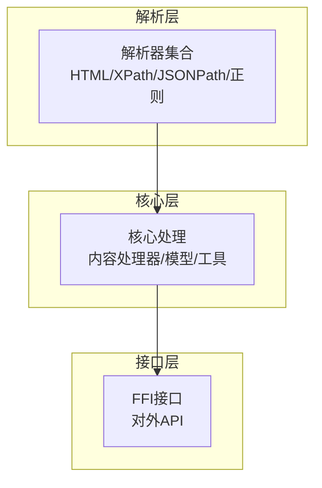
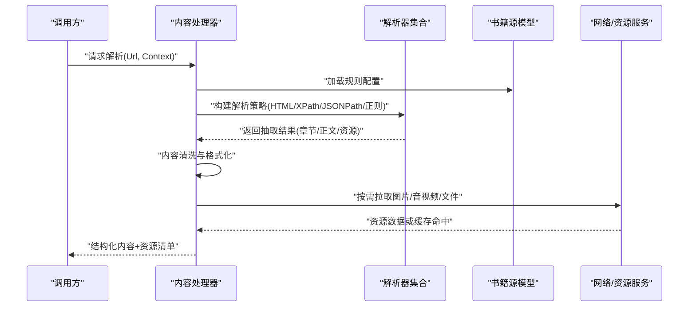
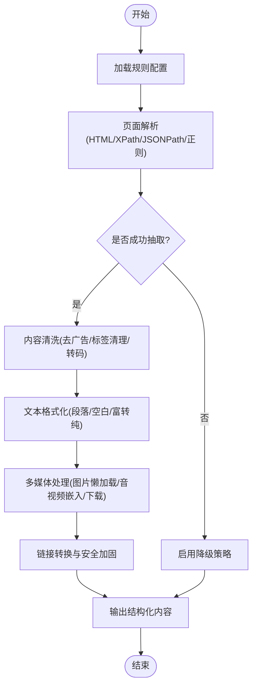
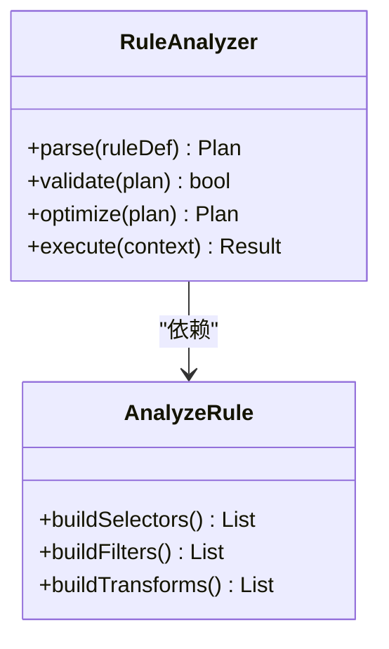
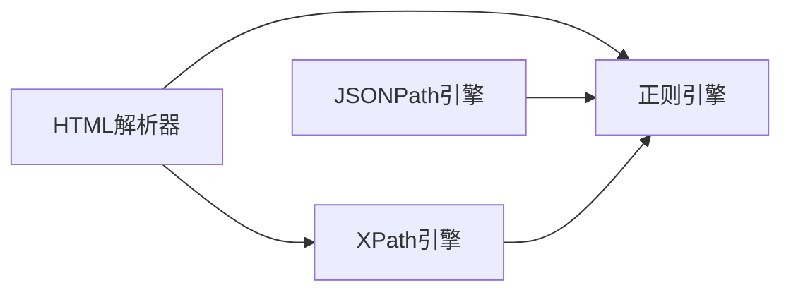
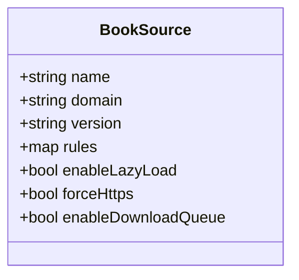
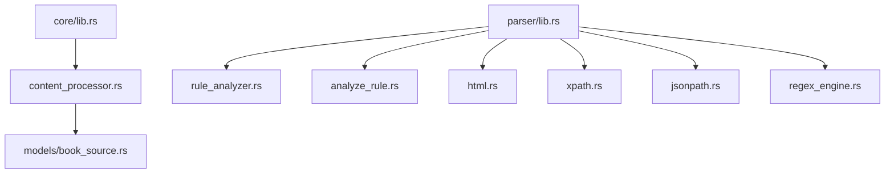

# 内容规则

<cite>
**本文引用的文件**   
- [content_processor.rs](file://rust/legado-core/src/content_processor.rs)
- [rule_analyzer.rs](file://rust/legado-parser/src/rule_analyzer.rs)
- [analyze_rule.rs](file://rust/legado-parser/src/analyze_rule.rs)
- [html.rs](file://rust/legado-parser/src/html.rs)
- [xpath.rs](file://rust/legado-parser/src/xpath.rs)
- [jsonpath.rs](file://rust/legado-parser/src/jsonpath.rs)
- [regex_engine.rs](file://rust/legado-parser/src/regex_engine.rs)
- [book_source.rs](file://rust/legado-core/src/models/book_source.rs)
- [lib.rs](file://rust/legado-core/src/lib.rs)
- [lib.rs](file://rust/legado-parser/src/lib.rs)
</cite>

## 目录
1. [简介](#简介)
2. [项目结构](#项目结构)
3. [核心组件](#核心组件)
4. [架构总览](#架构总览)
5. [详细组件分析](#详细组件分析)
6. [依赖关系分析](#依赖关系分析)
7. [性能考量](#性能考量)
8. [故障排查指南](#故障排查指南)
9. [结论](#结论)
10. [附录](#附录)

## 简介
本文件面向Legado的内容规则系统，围绕ContentRule的设计与实现进行系统化说明。内容涵盖：章节内容提取、图片处理、链接转换、文本格式化；内容清洗算法（广告去除、HTML标签清理、特殊字符处理、编码转换）；多媒体内容处理（图片懒加载、音视频嵌入、文件下载）；复杂页面解析示例与自定义处理逻辑扩展方法。文档以代码级分析为基础，辅以可视化图示，帮助读者从整体到细节全面理解内容规则的运作机制与扩展方式。

## 项目结构
内容规则相关能力主要分布在Rust模块中：
- 解析与规则分析：legado-parser（规则分析、HTML/XPath/JSONPath/正则引擎等）
- 核心处理与模型：legado-core（内容处理器、书籍源模型、通用工具）
- FFI与上层集成：legado-ffi（对外暴露接口，供Android/Kotlin调用）

[本图为概念性结构图，不直接映射具体源码文件]

## 核心组件
- 内容处理器（ContentProcessor）：负责将原始网页内容按规则转换为结构化内容，执行清洗、格式化、资源替换与媒体处理。
- 规则分析器（RuleAnalyzer/AnalyzeRule）：对规则定义进行解析、校验与优化，生成可执行的解析策略。
- HTML/XPath/JSONPath/正则引擎：提供选择器匹配、路径查询与模式匹配能力，支撑多形态数据抽取。
- 书籍源模型（BookSource）：承载站点元信息与规则配置，驱动不同站点的差异化解析流程。

上述组件共同构成“规则驱动”的内容解析管线，确保对不同站点与页面结构的强适配性与可扩展性。

**章节来源**
- [content_processor.rs](file://rust/legado-core/src/content_processor.rs)
- [rule_analyzer.rs](file://rust/legado-parser/src/rule_analyzer.rs)
- [analyze_rule.rs](file://rust/legado-parser/src/analyze_rule.rs)
- [html.rs](file://rust/legado-parser/src/html.rs)
- [xpath.rs](file://rust/legado-parser/src/xpath.rs)
- [jsonpath.rs](file://rust/legado-parser/src/jsonpath.rs)
- [regex_engine.rs](file://rust/legado-parser/src/regex_engine.rs)
- [book_source.rs](file://rust/legado-core/src/models/book_source.rs)

## 架构总览
内容规则的整体工作流如下：
- 输入：站点URL与请求上下文（含Cookie、UA、代理等）
- 规则加载：根据BookSource配置加载并编译规则
- 页面解析：使用HTML/XPath/JSONPath/正则引擎抽取章节列表、正文、图片、链接等
- 内容清洗：去广告、清理标签、转码、规范化文本
- 资源处理：图片懒加载、音视频嵌入、文件下载
- 输出：结构化章节内容与资源清单

**图表来源**
- [content_processor.rs](file://rust/legado-core/src/content_processor.rs)
- [rule_analyzer.rs](file://rust/legado-parser/src/rule_analyzer.rs)
- [analyze_rule.rs](file://rust/legado-parser/src/analyze_rule.rs)
- [html.rs](file://rust/legado-parser/src/html.rs)
- [xpath.rs](file://rust/legado-parser/src/xpath.rs)
- [jsonpath.rs](file://rust/legado-parser/src/jsonpath.rs)
- [regex_engine.rs](file://rust/legado-parser/src/regex_engine.rs)
- [book_source.rs](file://rust/legado-core/src/models/book_source.rs)

## 详细组件分析

### 内容处理器（ContentProcessor）
职责与关键点：
- 章节内容提取：基于规则定位DOM节点或JSON路径，抽取标题、正文、分页信息。
- 图片处理：支持相对/绝对链接归一化、懒加载属性注入、尺寸与格式优化。
- 链接转换：统一为安全协议、添加追踪参数、屏蔽外部跳转。
- 文本格式化：段落拆分、空白规范化、富文本转纯文本、特殊字符转义。
- 内容清洗：广告元素移除、脚本样式清理、敏感标签过滤、编码自动识别与转换。
- 多媒体处理：音频/视频标签注入、播放控件封装、下载任务编排。
- 错误与边界：空内容回退、超时重试、降级策略、日志记录。

**图表来源**
- [content_processor.rs](file://rust/legado-core/src/content_processor.rs)

**章节来源**
- [content_processor.rs](file://rust/legado-core/src/content_processor.rs)

### 规则分析器（RuleAnalyzer/AnalyzeRule）
职责与关键点：
- 规则语法解析：支持XPath、JSONPath、正则表达式及组合条件。
- 规则校验与优化：缺失字段检测、冲突规则合并、重复选择器消除。
- 执行计划生成：将规则转化为可执行的解析步骤序列，提升运行效率。
- 动态扩展点：允许在关键阶段插入自定义处理逻辑（如特定站点清洗）。

**图表来源**
- [rule_analyzer.rs](file://rust/legado-parser/src/rule_analyzer.rs)
- [analyze_rule.rs](file://rust/legado-parser/src/analyze_rule.rs)

**章节来源**
- [rule_analyzer.rs](file://rust/legado-parser/src/rule_analyzer.rs)
- [analyze_rule.rs](file://rust/legado-parser/src/analyze_rule.rs)

### HTML/XPath/JSONPath/正则引擎
职责与关键点：
- HTML解析：稳健的DOM树构建，兼容不规范HTML。
- XPath选择：强大的节点定位与属性提取。
- JSONPath查询：对结构化响应进行路径式抽取。
- 正则匹配：灵活的模式匹配与替换，用于文本清洗与格式化。

**图表来源**
- [html.rs](file://rust/legado-parser/src/html.rs)
- [xpath.rs](file://rust/legado-parser/src/xpath.rs)
- [jsonpath.rs](file://rust/legado-parser/src/jsonpath.rs)
- [regex_engine.rs](file://rust/legado-parser/src/regex_engine.rs)

**章节来源**
- [html.rs](file://rust/legado-parser/src/html.rs)
- [xpath.rs](file://rust/legado-parser/src/xpath.rs)
- [jsonpath.rs](file://rust/legado-parser/src/jsonpath.rs)
- [regex_engine.rs](file://rust/legado-parser/src/regex_engine.rs)

### 书籍源模型（BookSource）
职责与关键点：
- 站点元信息：名称、域名、版本、语言、分类等。
- 规则配置：搜索、目录、正文、图片、链接、清洗等规则集。
- 行为开关：是否启用懒加载、是否强制HTTPS、是否启用下载队列等。
- 调试与日志：请求头、响应体、解析耗时统计。

**图表来源**
- [book_source.rs](file://rust/legado-core/src/models/book_source.rs)

**章节来源**
- [book_source.rs](file://rust/legado-core/src/models/book_source.rs)

## 依赖关系分析
内容规则系统的模块依赖关系如下：

**图表来源**
- [lib.rs](file://rust/legado-core/src/lib.rs)
- [lib.rs](file://rust/legado-parser/src/lib.rs)
- [content_processor.rs](file://rust/legado-core/src/content_processor.rs)
- [rule_analyzer.rs](file://rust/legado-parser/src/rule_analyzer.rs)
- [analyze_rule.rs](file://rust/legado-parser/src/analyze_rule.rs)
- [html.rs](file://rust/legado-parser/src/html.rs)
- [xpath.rs](file://rust/legado-parser/src/xpath.rs)
- [jsonpath.rs](file://rust/legado-parser/src/jsonpath.rs)
- [regex_engine.rs](file://rust/legado-parser/src/regex_engine.rs)
- [book_source.rs](file://rust/legado-core/src/models/book_source.rs)

**章节来源**
- [lib.rs](file://rust/legado-core/src/lib.rs)
- [lib.rs](file://rust/legado-parser/src/lib.rs)

## 性能考量
- 规则预编译：将规则解析为执行计划，避免重复计算。
- 选择性解析：仅抽取必要字段，减少DOM遍历与内存占用。
- 资源延迟加载：图片懒加载与按需下载，降低首屏压力。
- 并发控制：限制并行请求数，避免触发反爬或限流。
- 缓存策略：对静态资源与解析结果进行短期缓存。
- 降级与熔断：当某站点异常时快速回退至备用策略。

[本节为通用指导，不直接分析具体文件]

## 故障排查指南
常见问题与定位建议：
- 规则不生效：检查规则语法与选择器是否正确，查看规则分析与优化日志。
- 内容缺失：确认页面结构与规则匹配，尝试放宽选择器或使用正则兜底。
- 图片无法显示：检查懒加载属性与链接转换逻辑，确认CDN可达性。
- 乱码或编码问题：确认编码识别与转换流程，必要时强制指定编码。
- 性能瓶颈：分析解析耗时与资源拉取时间，优化规则与并发策略。

**章节来源**
- [content_processor.rs](file://rust/legado-core/src/content_processor.rs)
- [rule_analyzer.rs](file://rust/legado-parser/src/rule_analyzer.rs)
- [analyze_rule.rs](file://rust/legado-parser/src/analyze_rule.rs)

## 结论
Legado的内容规则系统以“规则驱动”为核心，通过解析器集合与内容处理器的协同，实现对多样化站点的稳定适配与高效解析。其模块化设计便于扩展与维护，结合性能优化与故障排查手段，可在复杂场景下保持高可用与高性能。未来可进一步引入更智能的规则推荐与自适应解析，提升用户体验与开发效率。

[本节为总结性内容，不直接分析具体文件]

## 附录
- 复杂页面解析示例思路：
  - 使用XPath定位章节容器，结合正则清洗多余标签。
  - 对图片src属性进行懒加载改造，注入占位符与真实地址。
  - 对链接统一转为HTTPS，并追加必要的追踪参数。
  - 对音视频标签注入播放器控件，支持在线播放与离线缓存。
- 自定义处理逻辑实现方法：
  - 在规则分析阶段插入自定义过滤器，针对特定站点做特殊清洗。
  - 在内容处理阶段扩展资源处理器，支持新的媒体类型或下载策略。
  - 通过书籍源模型的开关项，动态启用或禁用某些功能。

[本节为概念性指导，不直接分析具体文件]