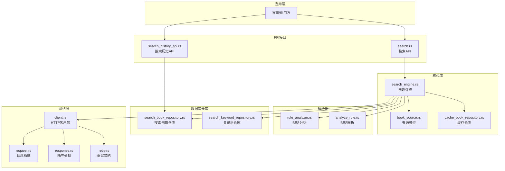
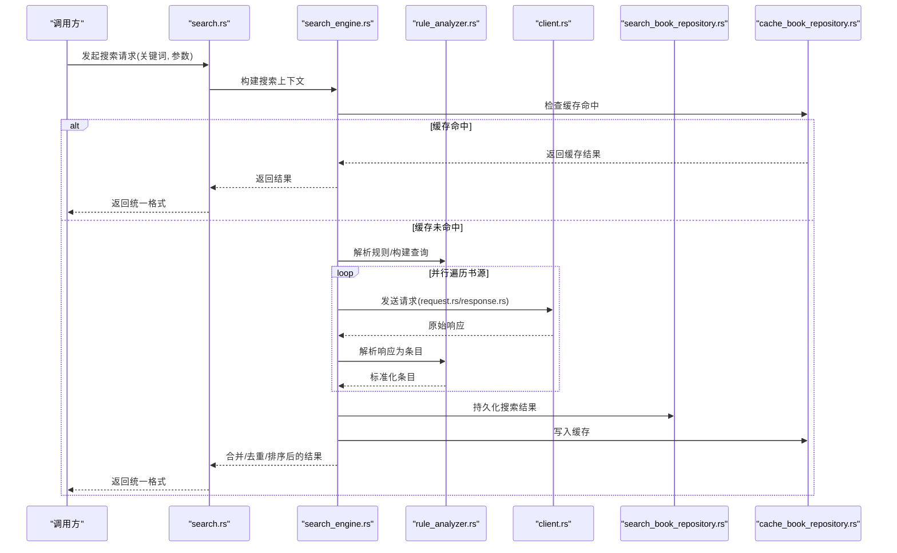
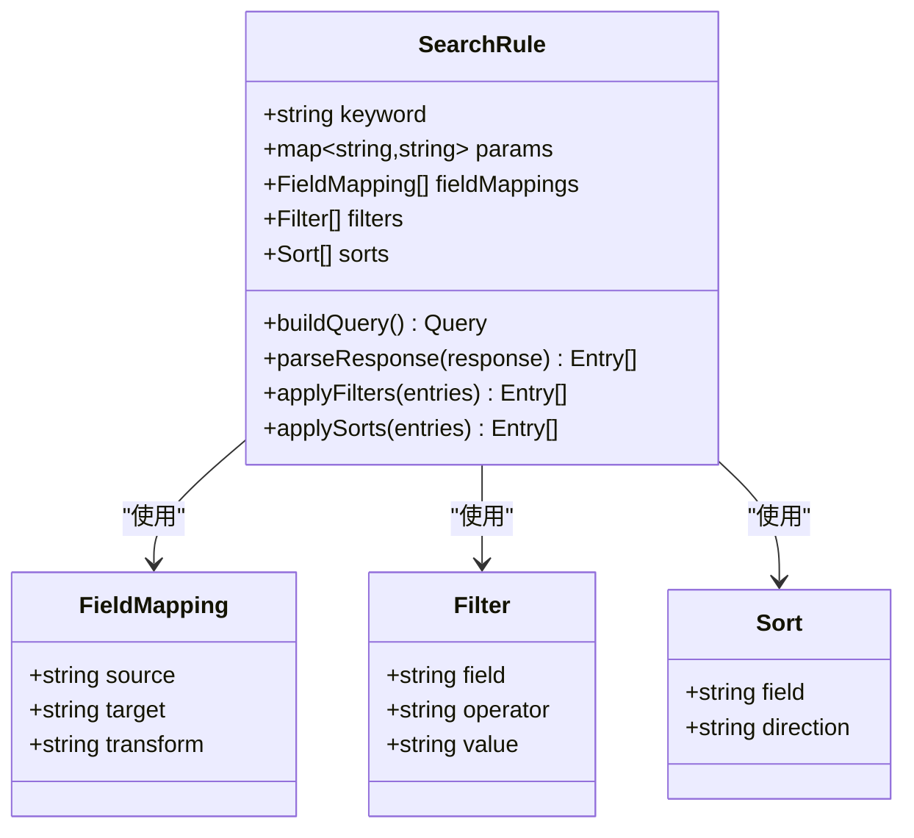
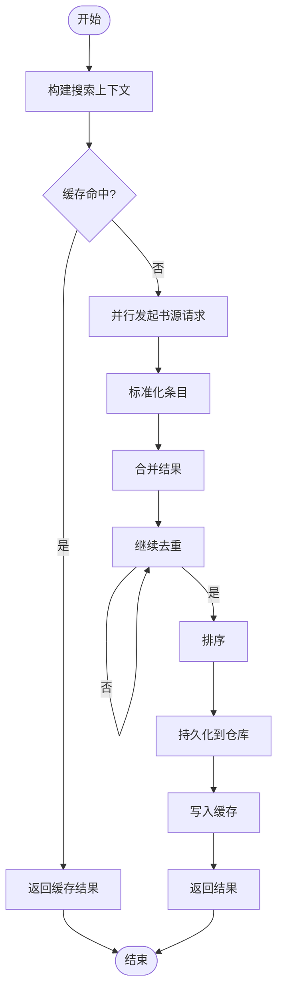
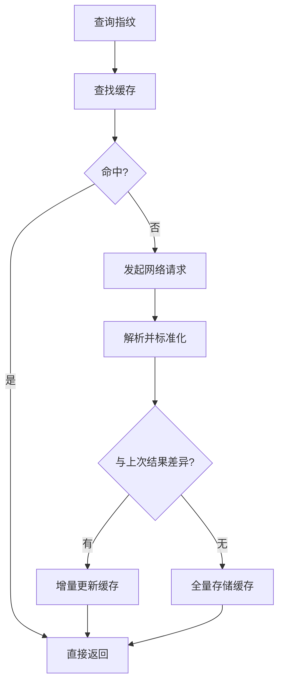
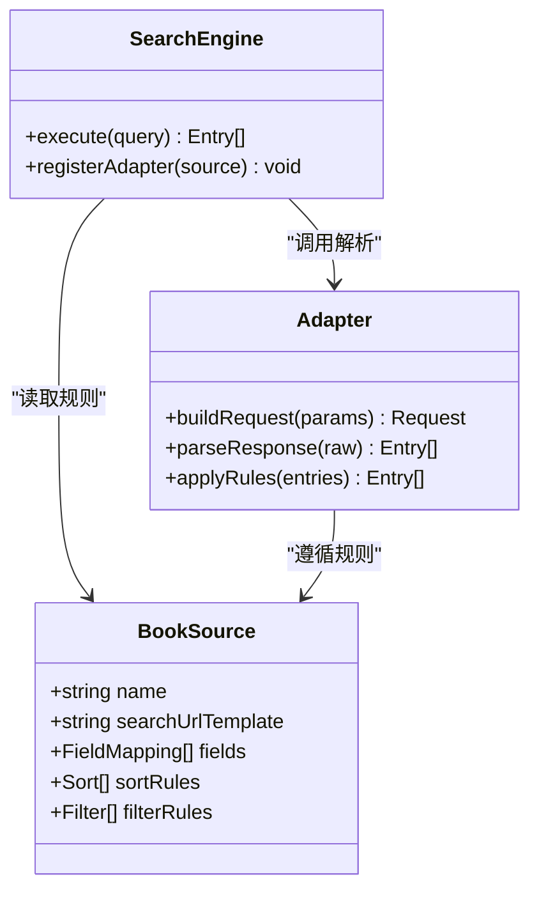
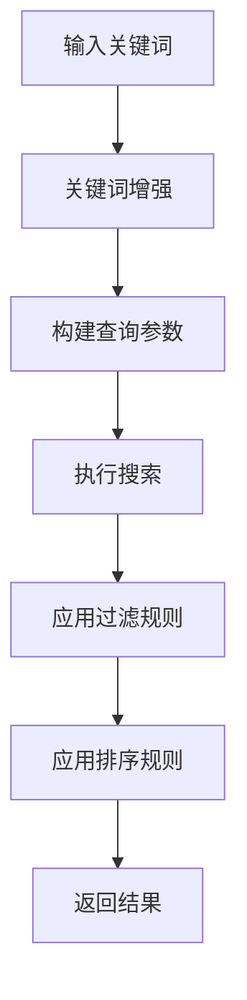
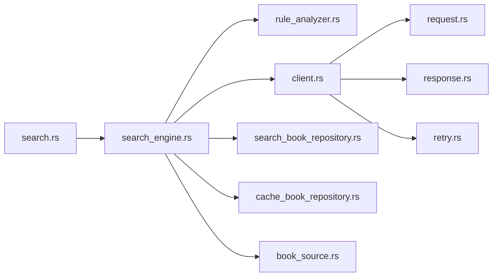

# 搜索规则

<cite>
**本文引用的文件**   
- [search_engine.rs](file://rust/legado-core/src/search_engine.rs)
- [search.rs](file://rust/legado-ffi/src/api/search.rs)
- [search_history_api.rs](file://rust/legado-ffi/src/api/search_history_api.rs)
- [search_book_repository.rs](file://rust/legado-db/src/repository/search_book_repository.rs)
- [search_keyword_repository.rs](file://rust/legado-db/src/repository/search_keyword_repository.rs)
- [rule_analyzer.rs](file://rust/legado-parser/src/rule_analyzer.rs)
- [analyze_rule.rs](file://rust/legado-parser/src/analyze_rule.rs)
- [book_source.rs](file://rust/legado-core/src/models/book_source.rs)
- [cache_book_repository.rs](file://rust/legado-db/src/repository/cache_book_repository.rs)
- [client.rs](file://rust/legado-net/src/client.rs)
- [request.rs](file://rust/legado-net/src/request.rs)
- [response.rs](file://rust/legado-net/src/response.rs)
- [retry.rs](file://rust/legado-net/src/retry.rs)
</cite>

## 目录
1. [简介](#简介)
2. [项目结构](#项目结构)
3. [核心组件](#核心组件)
4. [架构总览](#架构总览)
5. [详细组件分析](#详细组件分析)
6. [依赖关系分析](#依赖关系分析)
7. [性能考量](#性能考量)
8. [故障排查指南](#故障排查指南)
9. [结论](#结论)
10. [附录](#附录)

## 简介
本文件面向Legado项目的“搜索规则”子系统，系统性阐述SearchRule的结构与功能、多站点并行搜索协调策略、结果合并与去重、排序机制、缓存与增量更新、搜索引擎适配器开发指南以及性能优化与用户体验改进建议。文档以代码级分析为基础，辅以可视化图示，帮助开发者快速理解并扩展搜索能力。

## 项目结构
搜索相关能力横跨Rust核心库、FFI接口、数据库仓库与网络层：
- Rust核心：搜索引擎编排、模型定义（如BookSource）、缓存与任务调度
- FFI接口：对外暴露搜索API（含历史）
- 数据库仓库：搜索书籍、关键词、缓存等持久化
- 解析器：规则分析与URL解析
- 网络层：请求构建、响应处理、重试与限流

**图表来源** 
- [search_engine.rs:1-200](file://rust/legado-core/src/search_engine.rs#L1-L200)
- [search.rs:1-200](file://rust/legado-ffi/src/api/search.rs#L1-L200)
- [search_history_api.rs:1-200](file://rust/legado-ffi/src/api/search_history_api.rs#L1-L200)
- [rule_analyzer.rs:1-200](file://rust/legado-parser/src/rule_analyzer.rs#L1-L200)
- [analyze_rule.rs:1-200](file://rust/legado-parser/src/analyze_rule.rs#L1-L200)
- [book_source.rs:1-200](file://rust/legado-core/src/models/book_source.rs#L1-L200)
- [cache_book_repository.rs:1-200](file://rust/legado-db/src/repository/cache_book_repository.rs#L1-L200)
- [search_book_repository.rs:1-200](file://rust/legado-db/src/repository/search_book_repository.rs#L1-L200)
- [search_keyword_repository.rs:1-200](file://rust/legado-db/src/repository/search_keyword_repository.rs#L1-L200)
- [client.rs:1-200](file://rust/legado-net/src/client.rs#L1-L200)
- [request.rs:1-200](file://rust/legado-net/src/request.rs#L1-L200)
- [response.rs:1-200](file://rust/legado-net/src/response.rs#L1-L200)
- [retry.rs:1-200](file://rust/legado-net/src/retry.rs#L1-L200)

**章节来源**
- [search_engine.rs:1-200](file://rust/legado-core/src/search_engine.rs#L1-L200)
- [search.rs:1-200](file://rust/legado-ffi/src/api/search.rs#L1-L200)
- [search_history_api.rs:1-200](file://rust/legado-ffi/src/api/search_history_api.rs#L1-L200)
- [rule_analyzer.rs:1-200](file://rust/legado-parser/src/rule_analyzer.rs#L1-L200)
- [analyze_rule.rs:1-200](file://rust/legado-parser/src/analyze_rule.rs#L1-L200)
- [book_source.rs:1-200](file://rust/legado-core/src/models/book_source.rs#L1-L200)
- [cache_book_repository.rs:1-200](file://rust/legado-db/src/repository/cache_book_repository.rs#L1-L200)
- [search_book_repository.rs:1-200](file://rust/legado-db/src/repository/search_book_repository.rs#L1-L200)
- [search_keyword_repository.rs:1-200](file://rust/legado-db/src/repository/search_keyword_repository.rs#L1-L200)
- [client.rs:1-200](file://rust/legado-net/src/client.rs#L1-L200)
- [request.rs:1-200](file://rust/legado-net/src/request.rs#L1-L200)
- [response.rs:1-200](file://rust/legado-net/src/response.rs#L1-L200)
- [retry.rs:1-200](file://rust/legado-net/src/retry.rs#L1-L200)

## 核心组件
- 搜索引擎（search_engine.rs）：负责搜索任务的编排、并发控制、结果聚合、排序与去重、缓存命中与回写。
- 搜索API（search.rs）：对外暴露搜索接口，接收查询参数，返回统一结果格式。
- 搜索历史API（search_history_api.rs）：管理搜索历史记录的增删改查。
- 规则分析器（rule_analyzer.rs / analyze_rule.rs）：解析并执行搜索规则，生成查询参数、解析响应数据。
- 书源模型（book_source.rs）：描述书源的搜索配置（URL模板、字段映射、排序策略等）。
- 数据库仓库（search_book_repository.rs / search_keyword_repository.rs / cache_book_repository.rs）：持久化搜索结果、关键词与缓存。
- 网络层（client.rs / request.rs / response.rs / retry.rs）：构建请求、发送网络请求、处理响应与重试。

**章节来源**
- [search_engine.rs:1-200](file://rust/legado-core/src/search_engine.rs#L1-L200)
- [search.rs:1-200](file://rust/legado-ffi/src/api/search.rs#L1-L200)
- [search_history_api.rs:1-200](file://rust/legado-ffi/src/api/search_history_api.rs#L1-L200)
- [rule_analyzer.rs:1-200](file://rust/legado-parser/src/rule_analyzer.rs#L1-L200)
- [analyze_rule.rs:1-200](file://rust/legado-parser/src/analyze_rule.rs#L1-L200)
- [book_source.rs:1-200](file://rust/legado-core/src/models/book_source.rs#L1-L200)
- [search_book_repository.rs:1-200](file://rust/legado-db/src/repository/search_book_repository.rs#L1-L200)
- [search_keyword_repository.rs:1-200](file://rust/legado-db/src/repository/search_keyword_repository.rs#L1-L200)
- [cache_book_repository.rs:1-200](file://rust/legado-db/src/repository/cache_book_repository.rs#L1-L200)
- [client.rs:1-200](file://rust/legado-net/src/client.rs#L1-L200)
- [request.rs:1-200](file://rust/legado-net/src/request.rs#L1-L200)
- [response.rs:1-200](file://rust/legado-net/src/response.rs#L1-L200)
- [retry.rs:1-200](file://rust/legado-net/src/retry.rs#L1-L200)

## 架构总览
搜索流程从UI或外部调用进入FFI接口，由搜索引擎协调多个书源并行搜索，通过规则分析器解析响应，最终合并、去重、排序后返回。

**图表来源** 
- [search.rs:1-200](file://rust/legado-ffi/src/api/search.rs#L1-L200)
- [search_engine.rs:1-200](file://rust/legado-core/src/search_engine.rs#L1-L200)
- [rule_analyzer.rs:1-200](file://rust/legado-parser/src/rule_analyzer.rs#L1-L200)
- [client.rs:1-200](file://rust/legado-net/src/client.rs#L1-L200)
- [request.rs:1-200](file://rust/legado-net/src/request.rs#L1-L200)
- [response.rs:1-200](file://rust/legado-net/src/response.rs#L1-L200)
- [search_book_repository.rs:1-200](file://rust/legado-db/src/repository/search_book_repository.rs#L1-L200)
- [cache_book_repository.rs:1-200](file://rust/legado-db/src/repository/cache_book_repository.rs#L1-L200)

## 详细组件分析

### SearchRule 结构与功能
- 关键词处理：对输入关键词进行规范化（去空白、编码、分词），支持多语言与特殊字符。
- 查询参数构建：基于书源的URL模板与字段映射，动态拼接查询字符串与路径参数。
- 结果解析：依据规则将响应体解析为统一的条目结构（标题、作者、链接、封面等）。
- 排序与过滤：按匹配度、评分、更新时间等维度排序；支持按类型、状态等过滤。
- 错误处理：对网络异常、解析失败、超时等进行分类处理与重试。

**图表来源** 
- [rule_analyzer.rs:1-200](file://rust/legado-parser/src/rule_analyzer.rs#L1-L200)
- [analyze_rule.rs:1-200](file://rust/legado-parser/src/analyze_rule.rs#L1-L200)
- [book_source.rs:1-200](file://rust/legado-core/src/models/book_source.rs#L1-L200)

**章节来源**
- [rule_analyzer.rs:1-200](file://rust/legado-parser/src/rule_analyzer.rs#L1-L200)
- [analyze_rule.rs:1-200](file://rust/legado-parser/src/analyze_rule.rs#L1-L200)
- [book_source.rs:1-200](file://rust/legado-core/src/models/book_source.rs#L1-L200)

### 多站点搜索协调策略
- 并行搜索：基于并发池限制并发数，避免资源耗尽。
- 结果合并：将各书源结果归一化为统一结构，便于后续处理。
- 去重算法：基于唯一键（如标题+作者或链接）进行去重，保留优先级更高的条目。
- 优先级排序：结合匹配度、评分、更新时间、用户偏好等综合排序。

**图表来源** 
- [search_engine.rs:1-200](file://rust/legado-core/src/search_engine.rs#L1-L200)
- [client.rs:1-200](file://rust/legado-net/src/client.rs#L1-L200)
- [search_book_repository.rs:1-200](file://rust/legado-db/src/repository/search_book_repository.rs#L1-L200)
- [cache_book_repository.rs:1-200](file://rust/legado-db/src/repository/cache_book_repository.rs#L1-L200)

**章节来源**
- [search_engine.rs:1-200](file://rust/legado-core/src/search_engine.rs#L1-L200)
- [client.rs:1-200](file://rust/legado-net/src/client.rs#L1-L200)
- [search_book_repository.rs:1-200](file://rust/legado-db/src/repository/search_book_repository.rs#L1-L200)
- [cache_book_repository.rs:1-200](file://rust/legado-db/src/repository/cache_book_repository.rs#L1-L200)

### 搜索缓存机制与增量更新策略
- 缓存策略：按查询指纹（关键词+参数）作为键，存储最近搜索结果，设置TTL过期。
- 增量更新：对比上次结果差异，仅更新变化部分，减少重复解析与网络开销。
- 一致性保证：在并发写入时采用锁或版本控制，避免脏读。

**图表来源** 
- [cache_book_repository.rs:1-200](file://rust/legado-db/src/repository/cache_book_repository.rs#L1-L200)
- [search_engine.rs:1-200](file://rust/legado-core/src/search_engine.rs#L1-L200)

**章节来源**
- [cache_book_repository.rs:1-200](file://rust/legado-db/src/repository/cache_book_repository.rs#L1-L200)
- [search_engine.rs:1-200](file://rust/legado-core/src/search_engine.rs#L1-L200)

### 搜索引擎适配器开发指南
- 定义书源规则：在book_source中声明搜索URL模板、字段映射、排序与过滤规则。
- 实现解析逻辑：在rule_analyzer中编写解析函数，将原始响应转换为标准条目。
- 注册适配器：将新规则注册到搜索引擎，确保并发与重试策略生效。
- 测试验证：覆盖正常、异常、边界场景，确保稳定性。

**图表来源** 
- [book_source.rs:1-200](file://rust/legado-core/src/models/book_source.rs#L1-L200)
- [rule_analyzer.rs:1-200](file://rust/legado-parser/src/rule_analyzer.rs#L1-L200)
- [search_engine.rs:1-200](file://rust/legado-core/src/search_engine.rs#L1-L200)

**章节来源**
- [book_source.rs:1-200](file://rust/legado-core/src/models/book_source.rs#L1-L200)
- [rule_analyzer.rs:1-200](file://rust/legado-parser/src/rule_analyzer.rs#L1-L200)
- [search_engine.rs:1-200](file://rust/legado-core/src/search_engine.rs#L1-L200)

### 自定义搜索逻辑实现示例
- 关键词增强：根据用户历史或标签自动扩展关键词。
- 动态过滤：根据设备类型、网络状态调整过滤条件。
- 个性化排序：结合用户阅读偏好与评分进行排序。

**图表来源** 
- [rule_analyzer.rs:1-200](file://rust/legado-parser/src/rule_analyzer.rs#L1-L200)
- [analyze_rule.rs:1-200](file://rust/legado-parser/src/analyze_rule.rs#L1-L200)

**章节来源**
- [rule_analyzer.rs:1-200](file://rust/legado-parser/src/rule_analyzer.rs#L1-L200)
- [analyze_rule.rs:1-200](file://rust/legado-parser/src/analyze_rule.rs#L1-L200)

## 依赖关系分析
搜索子系统依赖解析器、网络层与数据库仓库，形成清晰的层次结构。

**图表来源** 
- [search.rs:1-200](file://rust/legado-ffi/src/api/search.rs#L1-L200)
- [search_engine.rs:1-200](file://rust/legado-core/src/search_engine.rs#L1-L200)
- [rule_analyzer.rs:1-200](file://rust/legado-parser/src/rule_analyzer.rs#L1-L200)
- [client.rs:1-200](file://rust/legado-net/src/client.rs#L1-L200)
- [request.rs:1-200](file://rust/legado-net/src/request.rs#L1-L200)
- [response.rs:1-200](file://rust/legado-net/src/response.rs#L1-L200)
- [retry.rs:1-200](file://rust/legado-net/src/retry.rs#L1-L200)
- [search_book_repository.rs:1-200](file://rust/legado-db/src/repository/search_book_repository.rs#L1-L200)
- [cache_book_repository.rs:1-200](file://rust/legado-db/src/repository/cache_book_repository.rs#L1-L200)
- [book_source.rs:1-200](file://rust/legado-core/src/models/book_source.rs#L1-L200)

**章节来源**
- [search.rs:1-200](file://rust/legado-ffi/src/api/search.rs#L1-L200)
- [search_engine.rs:1-200](file://rust/legado-core/src/search_engine.rs#L1-L200)
- [rule_analyzer.rs:1-200](file://rust/legado-parser/src/rule_analyzer.rs#L1-L200)
- [client.rs:1-200](file://rust/legado-net/src/client.rs#L1-L200)
- [request.rs:1-200](file://rust/legado-net/src/request.rs#L1-L200)
- [response.rs:1-200](file://rust/legado-net/src/response.rs#L1-L200)
- [retry.rs:1-200](file://rust/legado-net/src/retry.rs#L1-L200)
- [search_book_repository.rs:1-200](file://rust/legado-db/src/repository/search_book_repository.rs#L1-L200)
- [cache_book_repository.rs:1-200](file://rust/legado-db/src/repository/cache_book_repository.rs#L1-L200)
- [book_source.rs:1-200](file://rust/legado-core/src/models/book_source.rs#L1-L200)

## 性能考量
- 并发控制：合理设置并发上限，避免CPU与IO瓶颈。
- 缓存命中率：优化缓存键设计，提升命中率，减少重复计算。
- 增量更新：仅更新差异部分，降低网络与解析开销。
- 重试策略：指数退避与熔断机制，提高鲁棒性。
- 内存管理：及时释放大对象，避免内存泄漏。

[本节为通用指导，不直接分析具体文件]

## 故障排查指南
- 网络异常：检查请求构建、响应解析与重试逻辑。
- 解析失败：验证规则定义与响应格式一致性。
- 缓存不一致：检查缓存键与版本控制逻辑。
- 性能问题：监控并发数、缓存命中率与响应时间。

**章节来源**
- [client.rs:1-200](file://rust/legado-net/src/client.rs#L1-L200)
- [request.rs:1-200](file://rust/legado-net/src/request.rs#L1-L200)
- [response.rs:1-200](file://rust/legado-net/src/response.rs#L1-L200)
- [retry.rs:1-200](file://rust/legado-net/src/retry.rs#L1-L200)
- [cache_book_repository.rs:1-200](file://rust/legado-db/src/repository/cache_book_repository.rs#L1-L200)

## 结论
搜索规则系统通过模块化设计与清晰的分层架构，实现了高效、可扩展的多站点搜索能力。通过合理的并发控制、缓存策略与增量更新，显著提升了性能与用户体验。开发者可基于现有框架快速扩展新的搜索引擎适配器，满足多样化需求。

[本节为总结性内容，不直接分析具体文件]

## 附录
- 术语表：SearchRule、书源、条目、缓存指纹等。
- 最佳实践：规则设计、错误处理、性能调优。
- 参考实现：示例适配器与测试用例。

[本节为补充信息，不直接分析具体文件]