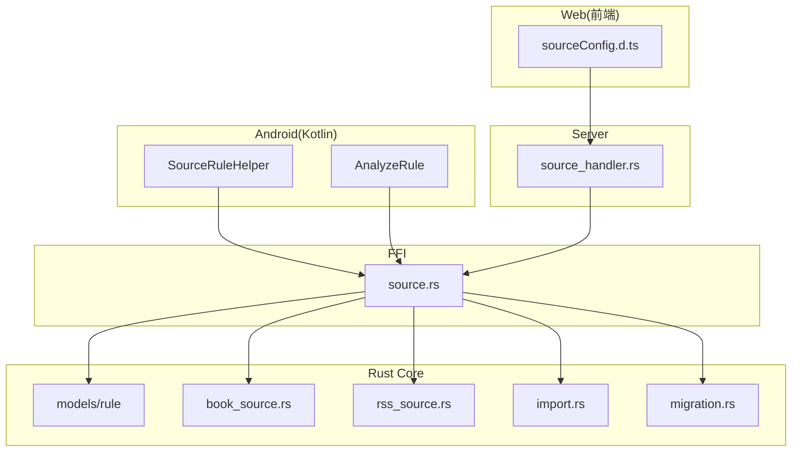
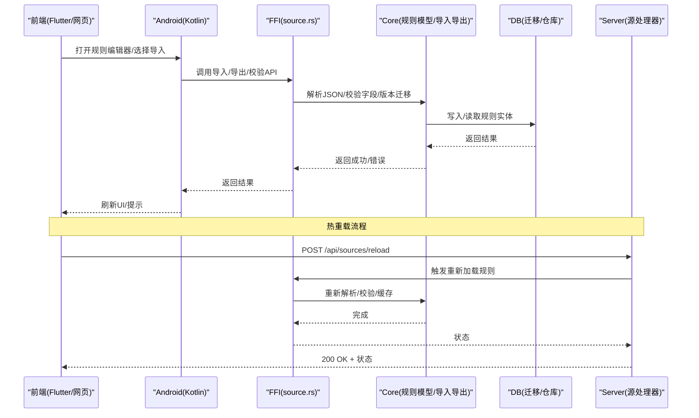
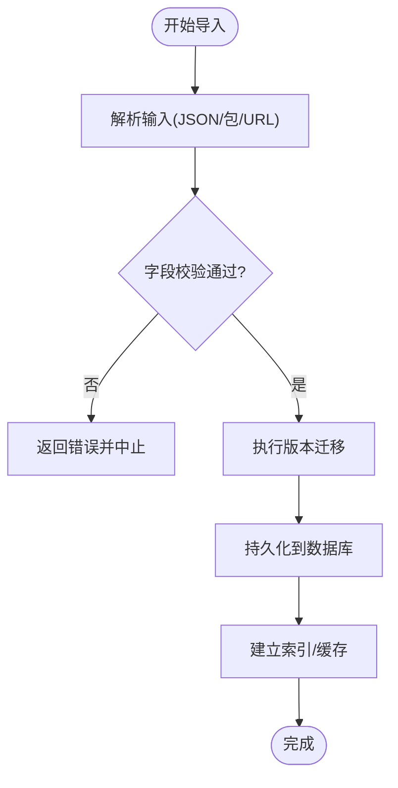
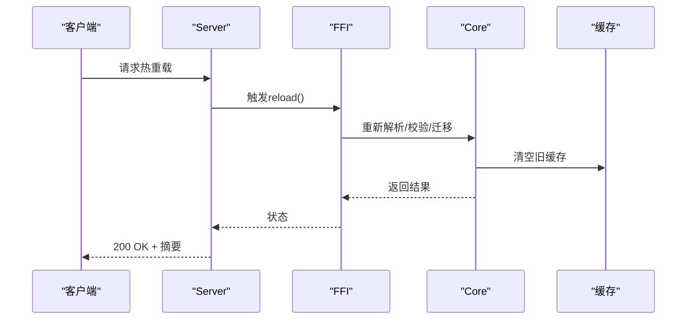
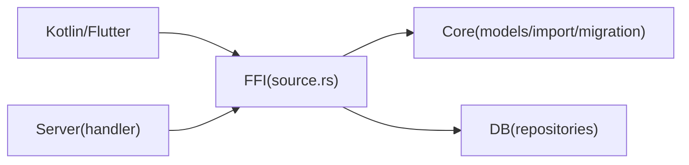

# 规则序列化与配置

<cite>
**本文引用的文件**   
- [legado-core/src/models/rule/mod.rs](file://rust/legado-core/src/models/rule/mod.rs)
- [legado-core/src/models/book_source.rs](file://rust/legado-core/src/models/book_source.rs)
- [legado-core/src/models/rss_source.rs](file://rust/legado-core/src/models/rss_source.rs)
- [legado-db/src/repository/book_source_repository.rs](file://rust/legado-db/src/repository/book_source_repository.rs)
- [legado-db/src/repository/rss_source_repository.rs](file://rust/legado-db/src/repository/rss_source_repository.rs)
- [legado-db/src/import.rs](file://rust/legado-db/src/import.rs)
- [legado-db/src/migration.rs](file://rust/legado-db/src/migration.rs)
- [legado-ffi/src/api/source.rs](file://rust/legado-ffi/src/api/source.rs)
- [legado-server/src/handlers/source_handler.rs](file://rust/legado-server/src/handlers/source_handler.rs)
- [app/src/main/java/io/legado/app/help/SourceRuleHelper.kt](file://app/src/main/java/io/legado/app/help/SourceRuleHelper.kt)
- [app/src/main/java/io/legado/app/model/analyzeRule/AnalyzeRule.kt](file://app/src/main/java/io/legado/app/model/analyzeRule/AnalyzeRule.kt)
- [modules/web/src/config/sourceConfig.d.ts](file://modules/web/src/config/sourceConfig.d.ts)
</cite>

## 目录
1. [简介](#简介)
2. [项目结构](#项目结构)
3. [核心组件](#核心组件)
4. [架构总览](#架构总览)
5. [详细组件分析](#详细组件分析)
6. [依赖关系分析](#依赖关系分析)
7. [性能考量](#性能考量)
8. [故障排查指南](#故障排查指南)
9. [结论](#结论)
10. [附录](#附录)

## 简介
本文件系统性阐述 Legado 的规则序列化与配置体系，覆盖以下主题：
- 规则的 JSON 格式规范（字段定义、数据类型约束、默认值）
- 规则导入导出机制（版本兼容与向后兼容）
- 规则配置的热重载与动态更新
- 规则包的打包与分发格式（依赖管理与版本控制）
- 规则共享与协作开发最佳实践

目标读者包括规则作者、插件开发者与集成工程师。文档以代码为依据，辅以可视化图示，帮助快速理解并正确使用规则系统。

## 项目结构
Legado 的规则相关能力横跨多语言模块：
- Rust 核心模型与持久化：定义规则数据结构、数据库迁移、导入导出逻辑
- FFI 接口层：对外暴露规则增删改查、导入导出等 API
- Web 服务层：提供 HTTP/WebSocket 接口用于热重载与动态更新
- Android/Kotlin 应用层：解析、校验、渲染规则，驱动 UI 编辑与调试
- Flutter 前端：展示规则编辑界面与配置项

**图表来源** 
- [legado-core/src/models/rule/mod.rs](file://rust/legado-core/src/models/rule/mod.rs)
- [legado-core/src/models/book_source.rs](file://rust/legado-core/src/models/book_source.rs)
- [legado-core/src/models/rss_source.rs](file://rust/legado-core/src/models/rss_source.rs)
- [legado-db/src/import.rs](file://rust/legado-db/src/import.rs)
- [legado-db/src/migration.rs](file://rust/legado-db/src/migration.rs)
- [legado-ffi/src/api/source.rs](file://rust/legado-ffi/src/api/source.rs)
- [legado-server/src/handlers/source_handler.rs](file://rust/legado-server/src/handlers/source_handler.rs)
- [app/src/main/java/io/legado/app/help/SourceRuleHelper.kt](file://app/src/main/java/io/legado/app/help/SourceRuleHelper.kt)
- [app/src/main/java/io/legado/app/model/analyzeRule/AnalyzeRule.kt](file://app/src/main/java/io/legado/app/model/analyzeRule/AnalyzeRule.kt)
- [modules/web/src/config/sourceConfig.d.ts](file://modules/web/src/config/sourceConfig.d.ts)

**章节来源**
- [legado-core/src/models/rule/mod.rs](file://rust/legado-core/src/models/rule/mod.rs)
- [legado-core/src/models/book_source.rs](file://rust/legado-core/src/models/book_source.rs)
- [legado-core/src/models/rss_source.rs](file://rust/legado-core/src/models/rss_source.rs)
- [legado-db/src/import.rs](file://rust/legado-db/src/import.rs)
- [legado-db/src/migration.rs](file://rust/legado-db/src/migration.rs)
- [legado-ffi/src/api/source.rs](file://rust/legado-ffi/src/api/source.rs)
- [legado-server/src/handlers/source_handler.rs](file://rust/legado-server/src/handlers/source_handler.rs)
- [app/src/main/java/io/legado/app/help/SourceRuleHelper.kt](file://app/src/main/java/io/legado/app/help/SourceRuleHelper.kt)
- [app/src/main/java/io/legado/app/model/analyzeRule/AnalyzeRule.kt](file://app/src/main/java/io/legado/app/model/analyzeRule/AnalyzeRule.kt)
- [modules/web/src/config/sourceConfig.d.ts](file://modules/web/src/config/sourceConfig.d.ts)

## 核心组件
- 规则数据模型（Rust）
  - 书籍源规则：包含搜索、列表、详情、章节、内容等字段的 JSON 映射
  - RSS 源规则：包含订阅、条目、内容等字段的 JSON 映射
  - 规则通用字段：名称、版本、类型、标签、分组、启用状态等
- 导入导出（Rust）
  - 统一导入入口：支持多种格式与版本，执行迁移与校验
  - 导出器：将内存对象序列化为标准 JSON 或包格式
- FFI 接口（Rust）
  - 暴露规则 CRUD、批量导入导出、校验、版本检查等能力
- 服务端（Rust）
  - 提供 HTTP 接口进行规则管理、热重载、增量更新
- 客户端（Kotlin/Flutter）
  - 解析与校验规则 JSON，生成编辑器表单，触发导入/导出与热重载

**章节来源**
- [legado-core/src/models/book_source.rs](file://rust/legado-core/src/models/book_source.rs)
- [legado-core/src/models/rss_source.rs](file://rust/legado-core/src/models/rss_source.rs)
- [legado-db/src/import.rs](file://rust/legado-db/src/import.rs)
- [legado-ffi/src/api/source.rs](file://rust/legado-ffi/src/api/source.rs)
- [legado-server/src/handlers/source_handler.rs](file://rust/legado-server/src/handlers/source_handler.rs)
- [app/src/main/java/io/legado/app/help/SourceRuleHelper.kt](file://app/src/main/java/io/legado/app/help/SourceRuleHelper.kt)
- [app/src/main/java/io/legado/app/model/analyzeRule/AnalyzeRule.kt](file://app/src/main/java/io/legado/app/model/analyzeRule/AnalyzeRule.kt)

## 架构总览
下图展示了从前端到后端再到存储的完整链路，以及热重载流程。

**图表来源** 
- [legado-ffi/src/api/source.rs](file://rust/legado-ffi/src/api/source.rs)
- [legado-core/src/models/book_source.rs](file://rust/legado-core/src/models/book_source.rs)
- [legado-core/src/models/rss_source.rs](file://rust/legado-core/src/models/rss_source.rs)
- [legado-db/src/import.rs](file://rust/legado-db/src/import.rs)
- [legado-db/src/migration.rs](file://rust/legado-db/src/migration.rs)
- [legado-server/src/handlers/source_handler.rs](file://rust/legado-server/src/handlers/source_handler.rs)

## 详细组件分析

### 规则 JSON 格式规范
- 通用字段
  - id: 字符串，唯一标识
  - name: 字符串，显示名称
  - type: 枚举，如“书籍”、“RSS”
  - version: 整数或字符串，语义化版本号
  - enabled: 布尔，是否启用
  - tags: 字符串数组，分类标签
  - group: 字符串，分组名
  - priority: 整数，优先级
  - lastUpdateTime: 时间戳，最后更新时间
- 书籍源规则关键字段（示例性说明）
  - searchUrl/listUrl/detailUrl/chapterListUrl/contentUrl: 字符串模板，支持变量替换
  - searchKeyWord/listRule/detailRule/chapterRule/contentRule: 规则表达式（XPath/正则/JSONPath）
  - headers/cookies/auth: 请求头与认证信息
  - encoding/pageEncoding: 字符编码
  - login/loginUrl/loginForm: 登录流程配置
  - errorPattern: 错误匹配模式
- RSS 源规则关键字段（示例性说明）
  - feedUrl/itemTitle/itemLink/itemContent/itemPubDate: 各字段提取规则
  - category/tagFilter: 过滤条件
  - updateInterval: 更新间隔（秒）
- 数据类型与约束
  - URL 类字段需符合 URI 语法；模板变量使用约定占位符
  - 规则表达式需通过内置引擎校验（XPath/正则/JSONPath）
  - 数值字段有范围限制（如 timeout、retryCount）
  - 布尔字段默认 false，未指定时按默认处理
- 默认值策略
  - 未提供的可选字段采用安全默认值（如超时、重试次数、编码）
  - 缺失必填字段在导入阶段报错并拒绝加载

**章节来源**
- [legado-core/src/models/book_source.rs](file://rust/legado-core/src/models/book_source.rs)
- [legado-core/src/models/rss_source.rs](file://rust/legado-core/src/models/rss_source.rs)
- [app/src/main/java/io/legado/app/model/analyzeRule/AnalyzeRule.kt](file://app/src/main/java/io/legado/app/model/analyzeRule/AnalyzeRule.kt)
- [modules/web/src/config/sourceConfig.d.ts](file://modules/web/src/config/sourceConfig.d.ts)

### 规则导入导出机制与版本兼容
- 导入流程
  - 接收 JSON/压缩包/URL 下载
  - 解析并校验字段完整性与类型
  - 执行版本迁移（向后兼容），补齐缺失字段、修正不合法值
  - 持久化到数据库，建立索引与关联
- 导出流程
  - 将内存对象序列化为标准 JSON 或包格式（含元数据与依赖声明）
  - 可选择压缩与签名
- 版本兼容性
  - 使用 schema 版本与迁移脚本保证旧版 JSON 可被新版本解析
  - 对废弃字段进行降级处理或忽略
  - 向前兼容：新字段在未提供时使用默认值

**图表来源** 
- [legado-db/src/import.rs](file://rust/legado-db/src/import.rs)
- [legado-db/src/migration.rs](file://rust/legado-db/src/migration.rs)

**章节来源**
- [legado-db/src/import.rs](file://rust/legado-db/src/import.rs)
- [legado-db/src/migration.rs](file://rust/legado-db/src/migration.rs)
- [legado-ffi/src/api/source.rs](file://rust/legado-ffi/src/api/source.rs)

### 规则配置的热重载与动态更新
- 触发方式
  - 前端/客户端发起热重载请求
  - 服务端调用 FFI 接口重新加载规则
- 处理步骤
  - 清理旧缓存与解析结果
  - 重新解析 JSON/包，执行校验与迁移
  - 更新内存中的规则实例与缓存
  - 返回状态码与摘要信息
- 注意事项
  - 并发安全：避免重复加载导致竞争
  - 回滚策略：失败时保持原状态
  - 日志记录：便于问题定位

**图表来源** 
- [legado-server/src/handlers/source_handler.rs](file://rust/legado-server/src/handlers/source_handler.rs)
- [legado-ffi/src/api/source.rs](file://rust/legado-ffi/src/api/source.rs)

**章节来源**
- [legado-server/src/handlers/source_handler.rs](file://rust/legado-server/src/handlers/source_handler.rs)
- [legado-ffi/src/api/source.rs](file://rust/legado-ffi/src/api/source.rs)

### 规则包的打包与分发格式
- 包结构
  - 元数据：名称、版本、描述、作者、许可证
  - 规则清单：包含所有规则文件的引用与依赖声明
  - 规则文件：JSON 或 JS 脚本（视规则类型而定）
  - 资源文件：封面、样式、辅助脚本
- 依赖管理
  - 声明外部依赖（库、脚本、资源）及其版本
  - 安装时校验依赖可用性，缺失则报错或跳过
- 版本控制
  - 使用语义化版本（主版本.次版本.修订号）
  - 变更日志与破坏性变更说明
- 分发渠道
  - 本地导入、网络下载、服务器推送
  - 支持签名与校验，确保完整性与可信来源

**章节来源**
- [legado-db/src/import.rs](file://rust/legado-db/src/import.rs)
- [legado-core/src/models/book_source.rs](file://rust/legado-core/src/models/book_source.rs)
- [legado-core/src/models/rss_source.rs](file://rust/legado-core/src/models/rss_source.rs)

### 规则共享与协作开发最佳实践
- 命名与组织
  - 统一的命名规范与目录结构
  - 清晰的 README 与示例用法
- 版本与兼容性
  - 严格遵循语义化版本
  - 提供向后兼容的迁移脚本
- 质量保障
  - 单元测试与集成测试覆盖关键路径
  - 静态检查与格式化（lint/format）
- 协作流程
  - 分支策略（feature/bugfix/release）
  - Code Review 与自动化 CI
- 发布与分发
  - 构建产物签名与校验
  - 发布说明与变更日志

[本节为概念性指导，不直接分析具体文件]

## 依赖关系分析
- 模块耦合
  - FFI 作为桥梁，连接 Kotlin/Flutter 与 Rust 核心
  - Server 通过 FFI 调用核心能力，实现无侵入扩展
  - 数据库层负责持久化与迁移，保证数据一致性
- 外部依赖
  - 网络库用于远程下载与校验
  - 解析库用于 XPath/正则/JSONPath 表达式
- 潜在风险
  - 循环依赖应避免
  - 接口契约需稳定，变更需版本化

**图表来源** 
- [legado-ffi/src/api/source.rs](file://rust/legado-ffi/src/api/source.rs)
- [legado-core/src/models/book_source.rs](file://rust/legado-core/src/models/book_source.rs)
- [legado-core/src/models/rss_source.rs](file://rust/legado-core/src/models/rss_source.rs)
- [legado-db/src/import.rs](file://rust/legado-db/src/import.rs)
- [legado-db/src/migration.rs](file://rust/legado-db/src/migration.rs)
- [legado-server/src/handlers/source_handler.rs](file://rust/legado-server/src/handlers/source_handler.rs)

**章节来源**
- [legado-ffi/src/api/source.rs](file://rust/legado-ffi/src/api/source.rs)
- [legado-core/src/models/book_source.rs](file://rust/legado-core/src/models/book_source.rs)
- [legado-core/src/models/rss_source.rs](file://rust/legado-core/src/models/rss_source.rs)
- [legado-db/src/import.rs](file://rust/legado-db/src/import.rs)
- [legado-db/src/migration.rs](file://rust/legado-db/src/migration.rs)
- [legado-server/src/handlers/source_handler.rs](file://rust/legado-server/src/handlers/source_handler.rs)

## 性能考量
- 解析优化
  - 预编译规则表达式，减少运行时开销
  - 批量导入时合并事务，降低 IO 压力
- 缓存策略
  - 规则解析结果与网络响应缓存
  - 失效策略基于版本与时间戳
- 并发控制
  - 限制并行解析数量，避免 CPU 峰值
  - 锁机制防止重复加载
- 内存管理
  - 及时释放大对象与临时缓冲区
  - 监控内存占用与 GC 行为

[本节提供通用建议，不直接分析具体文件]

## 故障排查指南
- 常见问题
  - JSON 字段缺失或类型错误：检查必填字段与类型约束
  - 版本不兼容：查看迁移日志与 schema 版本
  - 热重载失败：确认缓存清理与回滚策略
  - 依赖缺失：检查包清单与依赖版本
- 诊断步骤
  - 启用详细日志与调试模式
  - 使用校验工具验证 JSON 合法性
  - 逐步缩小问题范围（单条规则 vs 批量导入）
- 恢复措施
  - 回滚到上一稳定版本
  - 清理缓存并重新导入
  - 修复后提交补丁并更新文档

**章节来源**
- [legado-db/src/import.rs](file://rust/legado-db/src/import.rs)
- [legado-db/src/migration.rs](file://rust/legado-db/src/migration.rs)
- [legado-ffi/src/api/source.rs](file://rust/legado-ffi/src/api/source.rs)

## 结论
Legado 的规则序列化与配置体系以 Rust 为核心，结合 FFI、Server 与多端客户端，实现了高内聚、低耦合、可扩展的规则管理能力。通过严格的 JSON 规范、完善的导入导出与迁移机制、稳定的热重载流程，以及规范的打包分发与协作实践，确保了规则生态的健康发展。建议在开发与使用中遵循本文档的最佳实践，以提升稳定性与可维护性。

[本节为总结性内容，不直接分析具体文件]

## 附录
- 术语表
  - 规则：描述如何抓取与解析数据的配置集合
  - 包：包含规则与资源的归档文件
  - 热重载：在不重启服务的情况下更新规则
- 参考链接
  - 规则编写指南与示例
  - 版本迁移脚本说明
  - 调试与日志收集方法

[本节为补充信息，不直接分析具体文件]