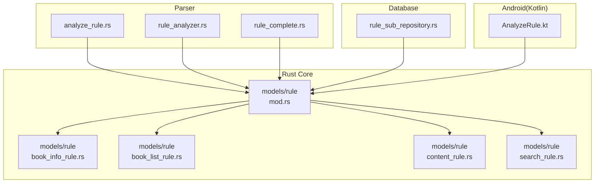
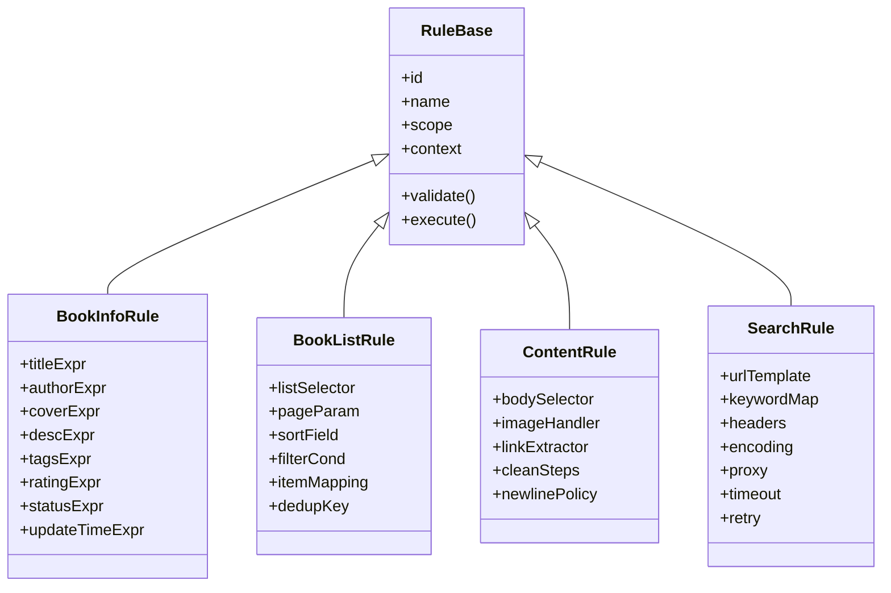
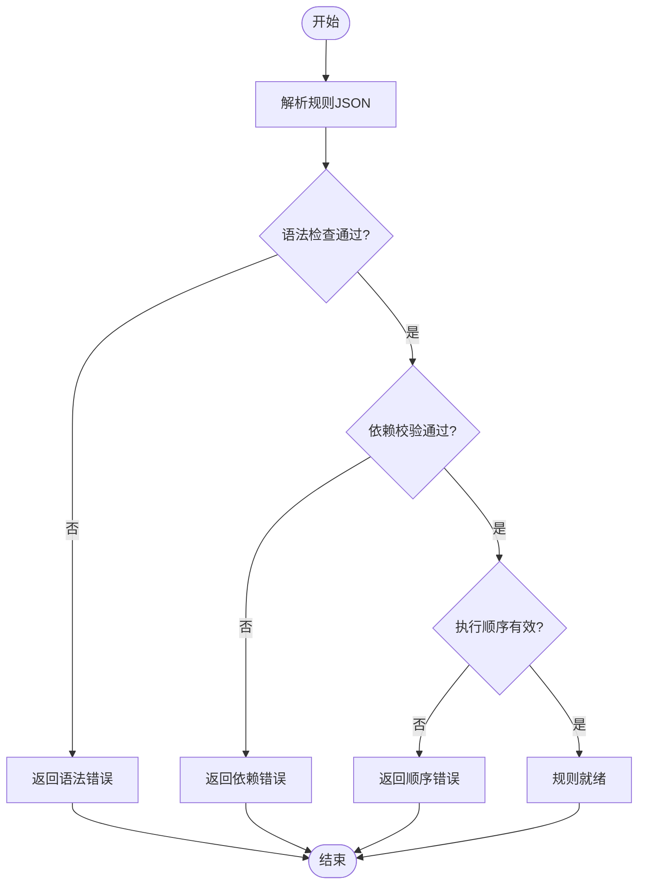
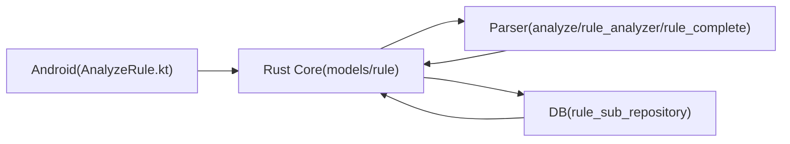

# 规则模型设计

<cite>
**本文引用的文件**   
- [legado-core/src/models/rule/mod.rs](file://rust/legado-core/src/models/rule/mod.rs)
- [legado-core/src/models/rule/book_info_rule.rs](file://rust/legado-core/src/models/rule/book_info_rule.rs)
- [legado-core/src/models/rule/book_list_rule.rs](file://rust/legado-core/src/models/rule/book_list_rule.rs)
- [legado-core/src/models/rule/content_rule.rs](file://rust/legado-core/src/models/rule/content_rule.rs)
- [legado-core/src/models/rule/search_rule.rs](file://rust/legado-core/src/models/rule/search_rule.rs)
- [legado-parser/src/analyze_rule.rs](file://rust/legado-parser/src/analyze_rule.rs)
- [legado-parser/src/rule_analyzer.rs](file://rust/legado-parser/src/rule_analyzer.rs)
- [legado-parser/src/rule_complete.rs](file://rust/legado-parser/src/rule_complete.rs)
- [legado-db/src/repository/rule_sub_repository.rs](file://rust/legado-db/src/repository/rule_sub_repository.rs)
- [app/src/main/java/io/legado/app/model/AnalyzeRule.kt](file://app/src/main/java/io/legado/app/model/AnalyzeRule.kt)
</cite>

## 目录
1. [简介](#简介)
2. [项目结构](#项目结构)
3. [核心组件](#核心组件)
4. [架构总览](#架构总览)
5. [详细组件分析](#详细组件分析)
6. [依赖关系分析](#依赖关系分析)
7. [性能考量](#性能考量)
8. [故障排查指南](#故障排查指南)
9. [结论](#结论)
10. [附录](#附录)

## 简介
本文件系统性梳理 Legado 的规则模型设计与实现，覆盖 BookInfoRule、BookListRule、ContentRule、SearchRule 等规则类型的数据结构、字段语义与使用场景；阐述规则的嵌套结构与继承关系（父规则与子规则关联方式）；说明规则验证机制（语法检查、依赖校验、执行顺序控制）；描述序列化与配置管理（JSON 导入导出）；提供规则编写最佳实践与常见模式示例；并给出性能优化建议与调试技巧。文档面向开发者与高级用户，力求在保持技术深度的同时易于理解。

## 项目结构
规则模型主要位于 Rust 核心模块 lego-core 的 models/rule 目录中，解析与校验逻辑集中在 legado-parser 模块，持久化与子规则管理由 legado-db 提供，Android 端通过 Kotlin 模型进行桥接与展示。



图表来源
- [legado-core/src/models/rule/mod.rs](file://rust/legado-core/src/models/rule/mod.rs)
- [legado-core/src/models/rule/book_info_rule.rs](file://rust/legado-core/src/models/rule/book_info_rule.rs)
- [legado-core/src/models/rule/book_list_rule.rs](file://rust/legado-core/src/models/rule/book_list_rule.rs)
- [legado-core/src/models/rule/content_rule.rs](file://rust/legado-core/src/models/rule/content_rule.rs)
- [legado-core/src/models/rule/search_rule.rs](file://rust/legado-core/src/models/rule/search_rule.rs)
- [legado-parser/src/analyze_rule.rs](file://rust/legado-parser/src/analyze_rule.rs)
- [legado-parser/src/rule_analyzer.rs](file://rust/legado-parser/src/rule_analyzer.rs)
- [legado-parser/src/rule_complete.rs](file://rust/legado-parser/src/rule_complete.rs)
- [legado-db/src/repository/rule_sub_repository.rs](file://rust/legado-db/src/repository/rule_sub_repository.rs)
- [app/src/main/java/io/legado/app/model/AnalyzeRule.kt](file://app/src/main/java/io/legado/app/model/AnalyzeRule.kt)

章节来源
- [legado-core/src/models/rule/mod.rs](file://rust/legado-core/src/models/rule/mod.rs)
- [legado-parser/src/analyze_rule.rs](file://rust/legado-parser/src/analyze_rule.rs)
- [legado-parser/src/rule_analyzer.rs](file://rust/legado-parser/src/rule_analyzer.rs)
- [legado-parser/src/rule_complete.rs](file://rust/legado-parser/src/rule_complete.rs)
- [legado-db/src/repository/rule_sub_repository.rs](file://rust/legado-db/src/repository/rule_sub_repository.rs)
- [app/src/main/java/io/legado/app/model/AnalyzeRule.kt](file://app/src/main/java/io/legado/app/model/AnalyzeRule.kt)

## 核心组件
- 规则基元与枚举：定义规则类型、作用域、匹配策略、取值表达式等基础元素，贯穿所有具体规则。
- BookInfoRule：用于书籍元数据抽取（标题、作者、封面、简介、标签等），通常作用于详情页或列表项详情。
- BookListRule：用于书籍列表抽取（条目集合、分页、排序、过滤等），作用于搜索结果页或分类列表页。
- ContentRule：用于章节正文内容抽取（正文段落、图片、链接、去广告清洗等），作用于章节详情页。
- SearchRule：用于搜索入口与参数构造（关键词映射、URL模板、请求头、编码等），作用于搜索发起阶段。

上述规则均支持 JSON 序列化/反序列化，便于导入导出与在线源配置管理。

章节来源
- [legado-core/src/models/rule/mod.rs](file://rust/legado-core/src/models/rule/mod.rs)
- [legado-core/src/models/rule/book_info_rule.rs](file://rust/legado-core/src/models/rule/book_info_rule.rs)
- [legado-core/src/models/rule/book_list_rule.rs](file://rust/legado-core/src/models/rule/book_list_rule.rs)
- [legado-core/src/models/rule/content_rule.rs](file://rust/legado-core/src/models/rule/content_rule.rs)
- [legado-core/src/models/rule/search_rule.rs](file://rust/legado-core/src/models/rule/search_rule.rs)

## 架构总览
规则从 Android 层以 JSON 形式传入，经 Kotlin 模型桥接到 Rust 层，由解析器完成语法检查与依赖校验，随后进入执行阶段按顺序调用各规则处理器，最终产出结构化数据。

```mermaid
sequenceDiagram
participant UI as "Android界面"
participant KT as "Kotlin模型<br/>AnalyzeRule.kt"
participant RS as "Rust核心<br/>models/rule"
participant PAR as "解析器<br/>analyze_rule/rule_analyzer"
participant DB as "数据库<br/>rule_sub_repository"
UI->>KT : "加载/编辑规则(JSON)"
KT->>RS : "反序列化为规则对象"
RS->>PAR : "语法检查与依赖校验"
PAR-->>RS : "校验结果(成功/错误)"
UI->>DB : "保存/更新规则"
UI->>RS : "执行规则(按类型调用)"
RS-->>UI : "返回解析结果"
```

图表来源
- [app/src/main/java/io/legado/app/model/AnalyzeRule.kt](file://app/src/main/java/io/legado/app/model/AnalyzeRule.kt)
- [legado-core/src/models/rule/mod.rs](file://rust/legado-core/src/models/rule/mod.rs)
- [legado-parser/src/analyze_rule.rs](file://rust/legado-parser/src/analyze_rule.rs)
- [legado-parser/src/rule_analyzer.rs](file://rust/legado-parser/src/rule_analyzer.rs)
- [legado-db/src/repository/rule_sub_repository.rs](file://rust/legado-db/src/repository/rule_sub_repository.rs)

## 详细组件分析

### 规则基元与通用字段
- 规则类型标识：区分 BookInfoRule、BookListRule、ContentRule、SearchRule 等。
- 作用域与上下文：指定规则适用的页面类型、请求上下文、变量注入点。
- 表达式引擎：支持 XPath、JSONPath、正则等表达式，统一封装为可复用取值器。
- 错误与日志：记录解析失败原因、定位表达式位置、输出调试信息。

章节来源
- [legado-core/src/models/rule/mod.rs](file://rust/legado-core/src/models/rule/mod.rs)
- [legado-parser/src/analyze_rule.rs](file://rust/legado-parser/src/analyze_rule.rs)

### BookInfoRule（书籍元数据规则）
- 字段要点：标题、作者、封面、简介、标签、评分、状态、更新时间等字段的取值表达式与转换函数。
- 使用场景：详情页抓取、列表项详情展开、批量元数据补全。
- 嵌套与继承：可引用公共字段模板，支持“父规则+子规则”组合，避免重复定义。
- 验证与顺序：字段级必填校验、表达式有效性检查；多字段抽取顺序影响缓存命中与重试策略。

章节来源
- [legado-core/src/models/rule/book_info_rule.rs](file://rust/legado-core/src/models/rule/book_info_rule.rs)
- [legado-parser/src/rule_analyzer.rs](file://rust/legado-parser/src/rule_analyzer.rs)

### BookListRule（书籍列表规则）
- 字段要点：列表选择器、分页参数、排序字段、过滤条件、条目映射、去重键。
- 使用场景：搜索结果页、分类列表页、推荐列表页。
- 嵌套与继承：列表模板复用、条目子规则继承父级上下文变量。
- 验证与顺序：分页链式校验、URL模板替换合法性、条目映射完整性检查。

章节来源
- [legado-core/src/models/rule/book_list_rule.rs](file://rust/legado-core/src/models/rule/book_list_rule.rs)
- [legado-parser/src/rule_complete.rs](file://rust/legado-parser/src/rule_complete.rs)

### ContentRule（章节内容规则）
- 字段要点：正文选择器、图片处理、链接提取、去广告清洗、换行与转义。
- 使用场景：章节详情页正文抽取、富文本清洗、资源下载预处理。
- 嵌套与继承：段落级子规则、图片/链接子规则继承父级上下文。
- 验证与顺序：清洗步骤顺序敏感，需保证先提取后清洗；异常节点跳过策略。

章节来源
- [legado-core/src/models/rule/content_rule.rs](file://rust/legado-core/src/models/rule/content_rule.rs)
- [legado-parser/src/rule_analyzer.rs](file://rust/legado-parser/src/rule_analyzer.rs)

### SearchRule（搜索规则）
- 字段要点：搜索入口URL模板、关键词映射、请求头、编码、代理、超时、重试。
- 使用场景：构建搜索请求、参数编码、动态域名切换、鉴权注入。
- 嵌套与继承：可复用公共请求模板、鉴权子规则。
- 验证与顺序：URL模板变量完整性、请求头合法性、鉴权前置校验。

章节来源
- [legado-core/src/models/rule/search_rule.rs](file://rust/legado-core/src/models/rule/search_rule.rs)
- [legado-parser/src/rule_complete.rs](file://rust/legado-parser/src/rule_complete.rs)

### 规则嵌套与继承关系
- 父规则与子规则：通过“模板+实例”的方式组织，父规则定义通用上下文与默认值，子规则覆盖特定字段。
- 关联方式：子规则持有父规则ID或名称，解析时合并上下文；支持多级嵌套与循环检测。
- 执行顺序：父规则先执行初始化，子规则按声明顺序执行，确保依赖可用。



图表来源
- [legado-core/src/models/rule/mod.rs](file://rust/legado-core/src/models/rule/mod.rs)
- [legado-core/src/models/rule/book_info_rule.rs](file://rust/legado-core/src/models/rule/book_info_rule.rs)
- [legado-core/src/models/rule/book_list_rule.rs](file://rust/legado-core/src/models/rule/book_list_rule.rs)
- [legado-core/src/models/rule/content_rule.rs](file://rust/legado-core/src/models/rule/content_rule.rs)
- [legado-core/src/models/rule/search_rule.rs](file://rust/legado-core/src/models/rule/search_rule.rs)

### 规则验证机制
- 语法检查：表达式语法（XPath/JSONPath/正则）合法性校验，错误位置提示。
- 依赖验证：父/子规则依赖关系检查，循环引用检测，上下文变量可用性验证。
- 执行顺序控制：基于声明顺序与依赖拓扑排序，确保前置规则先于后置规则执行。



图表来源
- [legado-parser/src/analyze_rule.rs](file://rust/legado-parser/src/analyze_rule.rs)
- [legado-parser/src/rule_analyzer.rs](file://rust/legado-parser/src/rule_analyzer.rs)
- [legado-parser/src/rule_complete.rs](file://rust/legado-parser/src/rule_complete.rs)

### 序列化与配置管理
- JSON 导入导出：规则对象支持 serde 序列化/反序列化，便于在线源分享与本地备份。
- 版本兼容：字段可选与默认值策略，向后兼容旧版规则。
- 配置管理：规则库分组、命名空间隔离、权限控制与审计日志。

章节来源
- [legado-core/src/models/rule/mod.rs](file://rust/legado-core/src/models/rule/mod.rs)
- [legado-db/src/repository/rule_sub_repository.rs](file://rust/legado-db/src/repository/rule_sub_repository.rs)

### 规则编写最佳实践与常见模式
- 字段抽取：优先使用稳定选择器，避免强耦合类名；对易变站点采用多策略回退。
- 列表分页：分页参数标准化，URL模板变量清晰；去重键保证唯一性。
- 内容清洗：分步清洗，先提取后处理；图片与链接统一处理管道。
- 搜索构造：关键词编码规范化，请求头最小化；鉴权前置校验。
- 复用与继承：抽象公共模板，减少重复；子规则仅覆盖差异字段。

章节来源
- [legado-core/src/models/rule/book_list_rule.rs](file://rust/legado-core/src/models/rule/book_list_rule.rs)
- [legado-core/src/models/rule/content_rule.rs](file://rust/legado-core/src/models/rule/content_rule.rs)
- [legado-core/src/models/rule/search_rule.rs](file://rust/legado-core/src/models/rule/search_rule.rs)

## 依赖关系分析
- 模块内依赖：models/rule 内部各规则类型共享基元与工具函数，降低耦合。
- 跨模块依赖：parser 负责校验与补全，db 负责持久化与子规则管理，Android 层负责交互与展示。
- 外部依赖：网络请求、HTML/JSON 解析、正则引擎等。



图表来源
- [legado-core/src/models/rule/mod.rs](file://rust/legado-core/src/models/rule/mod.rs)
- [legado-parser/src/analyze_rule.rs](file://rust/legado-parser/src/analyze_rule.rs)
- [legado-parser/src/rule_analyzer.rs](file://rust/legado-parser/src/rule_analyzer.rs)
- [legado-parser/src/rule_complete.rs](file://rust/legado-parser/src/rule_complete.rs)
- [legado-db/src/repository/rule_sub_repository.rs](file://rust/legado-db/src/repository/rule_sub_repository.rs)
- [app/src/main/java/io/legado/app/model/AnalyzeRule.kt](file://app/src/main/java/io/legado/app/model/AnalyzeRule.kt)

章节来源
- [legado-core/src/models/rule/mod.rs](file://rust/legado-core/src/models/rule/mod.rs)
- [legado-parser/src/analyze_rule.rs](file://rust/legado-parser/src/analyze_rule.rs)
- [legado-db/src/repository/rule_sub_repository.rs](file://rust/legado-db/src/repository/rule_sub_repository.rs)
- [app/src/main/java/io/legado/app/model/AnalyzeRule.kt](file://app/src/main/java/io/legado/app/model/AnalyzeRule.kt)

## 性能考量
- 表达式缓存：对常用 XPath/JSONPath 编译缓存，避免重复解析。
- 并行抽取：列表条目与图片等资源并发抓取，注意限流与重试。
- 内存优化：大文档分块处理，及时释放中间结果。
- 网络优化：连接池复用、超时与重试策略、代理与鉴权前置。
- 存储优化：规则库索引与分区，子规则按需加载。

[本节为通用指导，不直接分析具体文件]

## 故障排查指南
- 语法错误：查看表达式位置与错误消息，逐步简化表达式定位问题。
- 依赖错误：检查父/子规则关联、循环引用、上下文变量缺失。
- 执行顺序：确认依赖拓扑排序，调整声明顺序或使用显式依赖声明。
- 网络异常：检查 URL 模板、请求头、编码、代理与鉴权配置。
- 调试技巧：启用详细日志、输出中间结果、断点表达式求值。

章节来源
- [legado-parser/src/analyze_rule.rs](file://rust/legado-parser/src/analyze_rule.rs)
- [legado-parser/src/rule_analyzer.rs](file://rust/legado-parser/src/rule_analyzer.rs)
- [legado-parser/src/rule_complete.rs](file://rust/legado-parser/src/rule_complete.rs)

## 结论
Legado 的规则模型以清晰的类型划分与统一的基元设计为基础，结合强大的解析与校验能力，实现了灵活、可扩展且高性能的网页数据抽取体系。通过 JSON 序列化与配置管理，规则易于分享与维护；通过嵌套与继承，规则具备良好复用性与可维护性。遵循最佳实践与性能优化建议，可在复杂站点环境下稳定高效地获取所需数据。

[本节为总结性内容，不直接分析具体文件]

## 附录
- 术语表：规则、父规则、子规则、表达式、上下文、依赖、拓扑排序等。
- 参考实现：各规则类型的字段定义与使用方法参见对应源码文件。
- 扩展方向：新增规则类型时，遵循基元设计，完善解析与校验逻辑，补充测试用例。

[本节为补充信息，不直接分析具体文件]