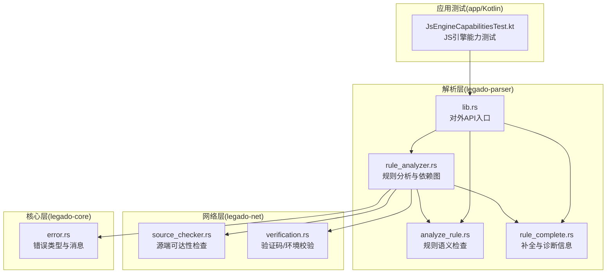
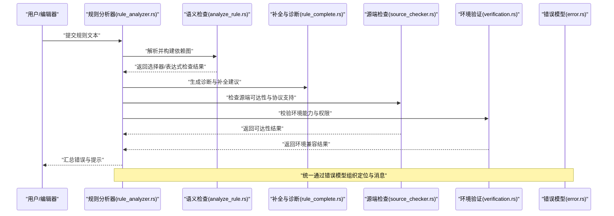
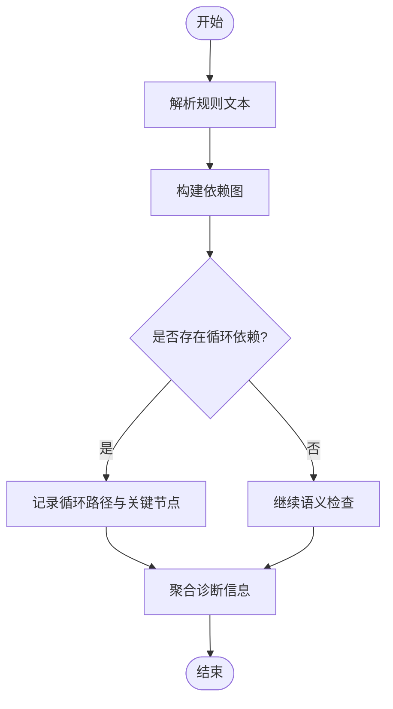
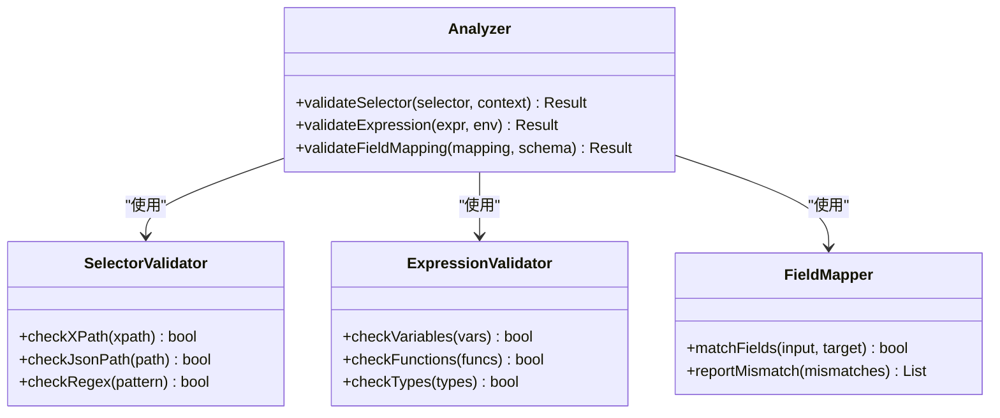
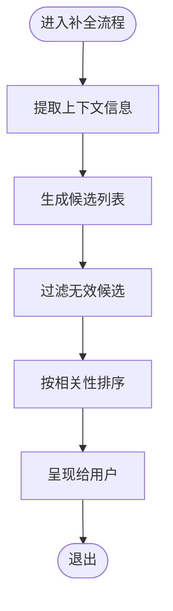
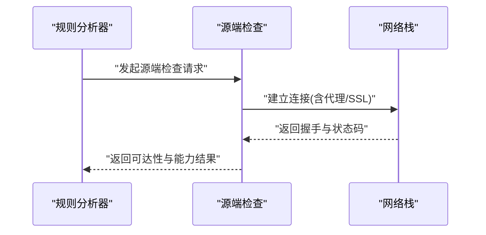
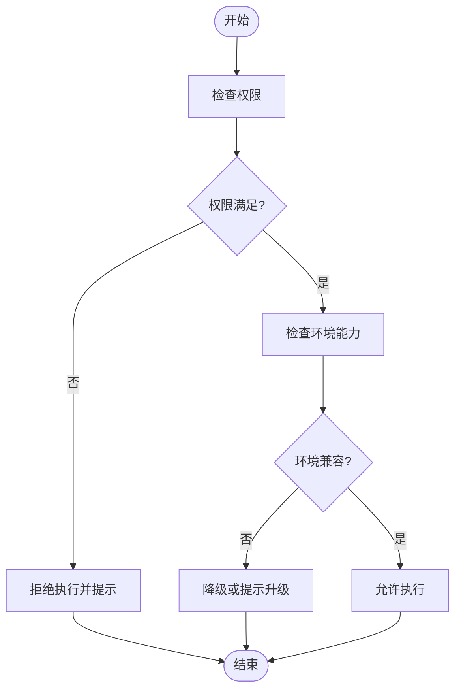
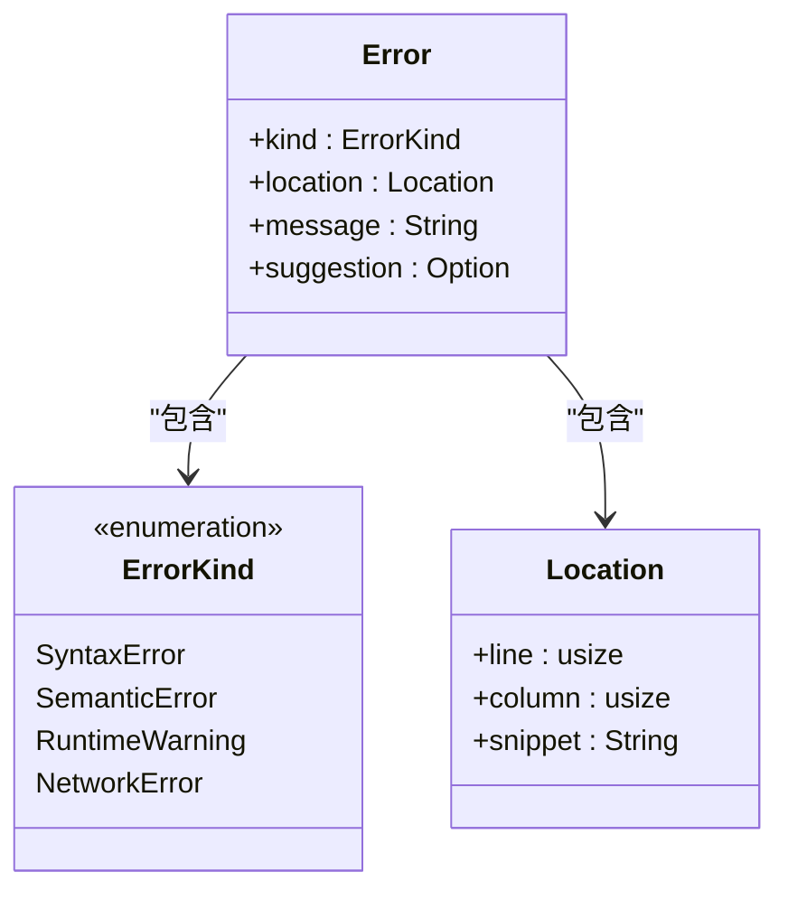
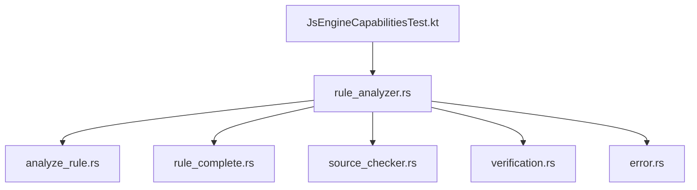

# 规则验证机制

<cite>
**本文引用的文件**   
- [rule_analyzer.rs](file://rust/legado-parser/src/rule_analyzer.rs)
- [analyze_rule.rs](file://rust/legado-parser/src/analyze_rule.rs)
- [rule_complete.rs](file://rust/legado-parser/src/rule_complete.rs)
- [source_checker.rs](file://rust/legado-net/src/source_checker.rs)
- [verification.rs](file://rust/legado-net/src/verification.rs)
- [error.rs](file://rust/legado-core/src/error.rs)
- [lib.rs](file://rust/legado-parser/src/lib.rs)
- [JsEngineCapabilitiesTest.kt](file://app/src/test/java/io/legado/app/JsEngineCapabilitiesTest.kt)
</cite>

## 目录
1. [简介](#简介)
2. [项目结构](#项目结构)
3. [核心组件](#核心组件)
4. [架构总览](#架构总览)
5. [详细组件分析](#详细组件分析)
6. [依赖关系分析](#依赖关系分析)
7. [性能考量](#性能考量)
8. [故障排查指南](#故障排查指南)
9. [结论](#结论)
10. [附录](#附录)

## 简介
本文件系统化阐述 Legado 的规则验证机制，覆盖以下关键主题：
- 规则语法检查系统：选择器有效性验证、依赖关系检查与循环引用检测
- 执行前预检查流程：资源可用性验证、权限检查与环境兼容性测试
- 错误报告机制：错误定位、错误分类与用户友好消息生成
- 规则测试框架：使用方法与自动化测试用例编写指南

该机制主要实现于 Rust 解析层（legado-parser）与网络校验层（legado-net），并通过 Kotlin 测试用例进行能力与兼容性验证。

## 项目结构
与规则验证相关的代码主要集中在以下模块：
- legado-parser：规则解析与分析（语法检查、依赖图构建、循环检测、补全提示）
- legado-net：源端可达性与环境能力校验（连通性、SSL、UA、验证码等）
- legado-core：错误模型与通用错误处理
- app（Kotlin）：能力与兼容性相关测试

**图表来源** 
- [rule_analyzer.rs](file://rust/legado-parser/src/rule_analyzer.rs)
- [analyze_rule.rs](file://rust/legado-parser/src/analyze_rule.rs)
- [rule_complete.rs](file://rust/legado-parser/src/rule_complete.rs)
- [lib.rs](file://rust/legado-parser/src/lib.rs)
- [source_checker.rs](file://rust/legado-net/src/source_checker.rs)
- [verification.rs](file://rust/legado-net/src/verification.rs)
- [error.rs](file://rust/legado-core/src/error.rs)
- [JsEngineCapabilitiesTest.kt](file://app/src/test/java/io/legado/app/JsEngineCapabilitiesTest.kt)

**章节来源**
- [rule_analyzer.rs](file://rust/legado-parser/src/rule_analyzer.rs)
- [analyze_rule.rs](file://rust/legado-parser/src/analyze_rule.rs)
- [rule_complete.rs](file://rust/legado-parser/src/rule_complete.rs)
- [lib.rs](file://rust/legado-parser/src/lib.rs)
- [source_checker.rs](file://rust/legado-net/src/source_checker.rs)
- [verification.rs](file://rust/legado-net/src/verification.rs)
- [error.rs](file://rust/legado-core/src/error.rs)
- [JsEngineCapabilitiesTest.kt](file://app/src/test/java/io/legado/app/JsEngineCapabilitiesTest.kt)

## 核心组件
- 规则分析器（rule_analyzer.rs）：负责解析规则、构建依赖图、检测循环依赖、收集诊断信息
- 规则语义检查（analyze_rule.rs）：对选择器、表达式、字段映射等进行有效性验证
- 补全与诊断（rule_complete.rs）：提供自动补全建议与错误修复提示
- 源端检查（source_checker.rs）：校验目标源的可达性、协议支持、超时与重试策略
- 环境验证（verification.rs）：校验验证码、UA、SSL/TLS、代理等运行环境条件
- 错误模型（error.rs）：统一的错误类型、位置信息与消息模板
- 测试能力（JsEngineCapabilitiesTest.kt）：验证 JS 引擎能力与兼容性，确保规则在运行时可用

**章节来源**
- [rule_analyzer.rs](file://rust/legado-parser/src/rule_analyzer.rs)
- [analyze_rule.rs](file://rust/legado-parser/src/analyze_rule.rs)
- [rule_complete.rs](file://rust/legado-parser/src/rule_complete.rs)
- [source_checker.rs](file://rust/legado-net/src/source_checker.rs)
- [verification.rs](file://rust/legado-net/src/verification.rs)
- [error.rs](file://rust/legado-core/src/error.rs)
- [JsEngineCapabilitiesTest.kt](file://app/src/test/java/io/legado/app/JsEngineCapabilitiesTest.kt)

## 架构总览
规则验证的整体流程分为“静态分析”和“动态预检查”两个阶段：
- 静态分析：解析规则文本，构建依赖图，进行语法与语义检查，检测循环引用，输出诊断与补全建议
- 动态预检查：在规则执行前，检查资源可用性（网络可达、证书、代理）、权限与环境能力（JS 引擎特性、平台限制）

**图表来源** 
- [rule_analyzer.rs](file://rust/legado-parser/src/rule_analyzer.rs)
- [analyze_rule.rs](file://rust/legado-parser/src/analyze_rule.rs)
- [rule_complete.rs](file://rust/legado-parser/src/rule_complete.rs)
- [source_checker.rs](file://rust/legado-net/src/source_checker.rs)
- [verification.rs](file://rust/legado-net/src/verification.rs)
- [error.rs](file://rust/legado-core/src/error.rs)

## 详细组件分析

### 规则分析器（rule_analyzer.rs）
- 职责：解析规则、构建依赖图、检测循环引用、聚合诊断信息
- 关键点：
  - 依赖图构建：将规则中的字段引用、函数调用、外部源依赖抽象为节点与边
  - 循环检测：基于深度优先搜索或拓扑排序判定环，定位环中关键节点
  - 诊断聚合：合并语法错误、语义错误与运行时风险项

**图表来源** 
- [rule_analyzer.rs](file://rust/legado-parser/src/rule_analyzer.rs)

**章节来源**
- [rule_analyzer.rs](file://rust/legado-parser/src/rule_analyzer.rs)

### 规则语义检查（analyze_rule.rs）
- 职责：验证选择器有效性、表达式合法性、字段映射一致性
- 关键点：
  - 选择器有效性：校验 XPath/JSONPath/正则等选择器的语法与上下文匹配
  - 表达式合法性：检查变量引用、函数签名、参数类型与返回值约束
  - 字段映射一致性：确保规则定义的输入/输出字段与目标模型一致

**图表来源** 
- [analyze_rule.rs](file://rust/legado-parser/src/analyze_rule.rs)

**章节来源**
- [analyze_rule.rs](file://rust/legado-parser/src/analyze_rule.rs)

### 补全与诊断（rule_complete.rs）
- 职责：提供自动补全建议、错误修复提示、上下文帮助
- 关键点：
  - 补全建议：根据当前上下文生成字段名、函数名、常量值等候选
  - 错误修复：针对常见错误给出最小修改建议（如修正选择器语法）
  - 上下文帮助：展示字段含义、取值范围、示例用法

**图表来源** 
- [rule_complete.rs](file://rust/legado-parser/src/rule_complete.rs)

**章节来源**
- [rule_complete.rs](file://rust/legado-parser/src/rule_complete.rs)

### 源端检查（source_checker.rs）
- 职责：在规则执行前检查目标源的可达性与协议支持
- 关键点：
  - 可达性：HTTP/HTTPS 连通性、DNS 解析、超时与重试
  - 协议支持：TLS 版本、加密套件、代理配置
  - 状态码与响应体：判断源端是否返回预期结构与内容

**图表来源** 
- [source_checker.rs](file://rust/legado-net/src/source_checker.rs)

**章节来源**
- [source_checker.rs](file://rust/legado-net/src/source_checker.rs)

### 环境验证（verification.rs）
- 职责：校验运行环境能力与权限，确保规则可安全执行
- 关键点：
  - 权限检查：文件系统、网络、存储等权限
  - 环境能力：JS 引擎特性、平台 API 可用性
  - 兼容性：操作系统版本、设备能力差异

**图表来源** 
- [verification.rs](file://rust/legado-net/src/verification.rs)

**章节来源**
- [verification.rs](file://rust/legado-net/src/verification.rs)

### 错误模型（error.rs）
- 职责：定义统一的错误类型、位置信息与消息模板
- 关键点：
  - 错误分类：语法错误、语义错误、运行时错误、网络错误
  - 错误定位：行号、列号、片段上下文
  - 消息生成：多语言、用户友好的提示与建议

**图表来源** 
- [error.rs](file://rust/legado-core/src/error.rs)

**章节来源**
- [error.rs](file://rust/legado-core/src/error.rs)

### 测试能力（JsEngineCapabilitiesTest.kt）
- 职责：验证 JS 引擎能力与兼容性，确保规则在运行时可用
- 关键点：
  - 能力矩阵：测试支持的 API、内置对象、扩展功能
  - 兼容性：不同平台与版本的差异处理
  - 回归测试：捕获引擎升级导致的破坏性变更

**章节来源**
- [JsEngineCapabilitiesTest.kt](file://app/src/test/java/io/legado/app/JsEngineCapabilitiesTest.kt)

## 依赖关系分析
规则验证涉及多层依赖，需关注耦合度与潜在循环：
- 解析层依赖网络层进行可达性检查
- 解析层依赖核心层进行错误建模
- 测试层依赖解析层以验证能力与兼容性

**图表来源** 
- [rule_analyzer.rs](file://rust/legado-parser/src/rule_analyzer.rs)
- [analyze_rule.rs](file://rust/legado-parser/src/analyze_rule.rs)
- [rule_complete.rs](file://rust/legado-parser/src/rule_complete.rs)
- [source_checker.rs](file://rust/legado-net/src/source_checker.rs)
- [verification.rs](file://rust/legado-net/src/verification.rs)
- [error.rs](file://rust/legado-core/src/error.rs)
- [JsEngineCapabilitiesTest.kt](file://app/src/test/java/io/legado/app/JsEngineCapabilitiesTest.kt)

**章节来源**
- [rule_analyzer.rs](file://rust/legado-parser/src/rule_analyzer.rs)
- [analyze_rule.rs](file://rust/legado-parser/src/analyze_rule.rs)
- [rule_complete.rs](file://rust/legado-parser/src/rule_complete.rs)
- [source_checker.rs](file://rust/legado-net/src/source_checker.rs)
- [verification.rs](file://rust/legado-net/src/verification.rs)
- [error.rs](file://rust/legado-core/src/error.rs)
- [JsEngineCapabilitiesTest.kt](file://app/src/test/java/io/legado/app/JsEngineCapabilitiesTest.kt)

## 性能考量
- 依赖图构建与循环检测：采用增量更新与缓存策略，避免重复计算
- 选择器验证：对复杂选择器进行短路评估，减少不必要的解析开销
- 网络检查：并发探测与超时控制，避免阻塞主流程
- 错误聚合：批量收集错误，减少 UI 刷新与日志写入频率

[本节为通用指导，不直接分析具体文件]

## 故障排查指南
- 选择器无效：检查 XPath/JSONPath/正则语法，参考补全建议与错误定位
- 循环依赖：查看依赖图与环路径，调整字段引用顺序或拆分规则
- 源端不可达：检查网络、代理、SSL 证书与域名解析
- 权限不足：确认文件系统、网络、存储等权限已授予
- 环境不兼容：升级系统或更换设备，查看能力测试结果

**章节来源**
- [rule_analyzer.rs](file://rust/legado-parser/src/rule_analyzer.rs)
- [analyze_rule.rs](file://rust/legado-parser/src/analyze_rule.rs)
- [rule_complete.rs](file://rust/legado-parser/src/rule_complete.rs)
- [source_checker.rs](file://rust/legado-net/src/source_checker.rs)
- [verification.rs](file://rust/legado-net/src/verification.rs)
- [error.rs](file://rust/legado-core/src/error.rs)
- [JsEngineCapabilitiesTest.kt](file://app/src/test/java/io/legado/app/JsEngineCapabilitiesTest.kt)

## 结论
Legado 的规则验证机制通过解析层与网络层的协同工作，实现了从静态语法检查到动态预检查的完整闭环。借助统一的错误模型与丰富的诊断信息，开发者能够快速定位问题并获得修复建议。测试框架确保了在不同环境与平台下的稳定性与兼容性。

[本节为总结性内容，不直接分析具体文件]

## 附录
- 最佳实践：
  - 保持选择器简洁明确，避免过度嵌套
  - 合理拆分规则，降低依赖复杂度
  - 在网络检查中设置合理的超时与重试策略
  - 利用补全与诊断工具提升开发效率
- 常见问题：
  - 选择器失效：检查上下文与数据格式变化
  - 循环依赖：重构规则依赖关系
  - 网络失败：检查代理与证书配置
  - 权限缺失：在系统设置中授予必要权限

[本节为补充说明，不直接分析具体文件]