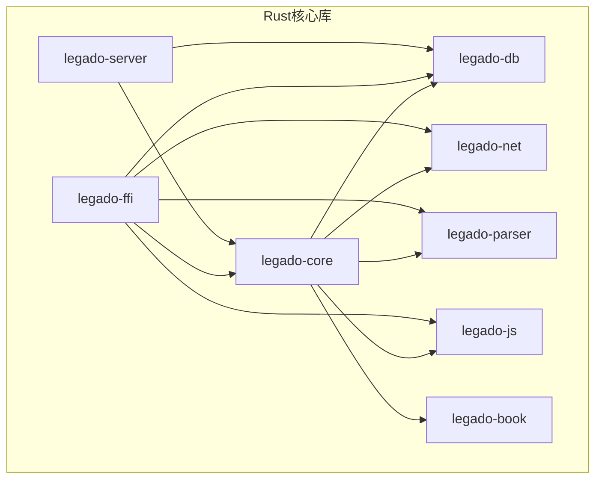
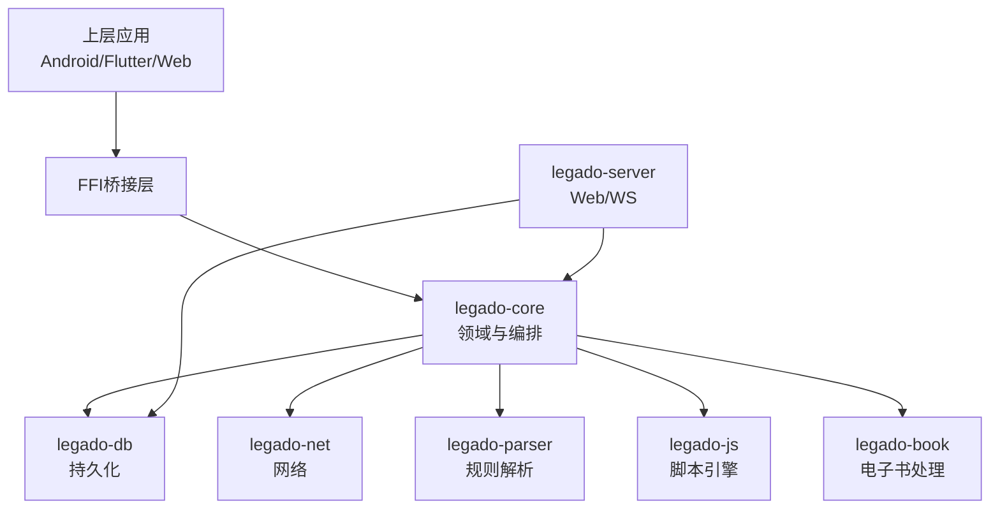
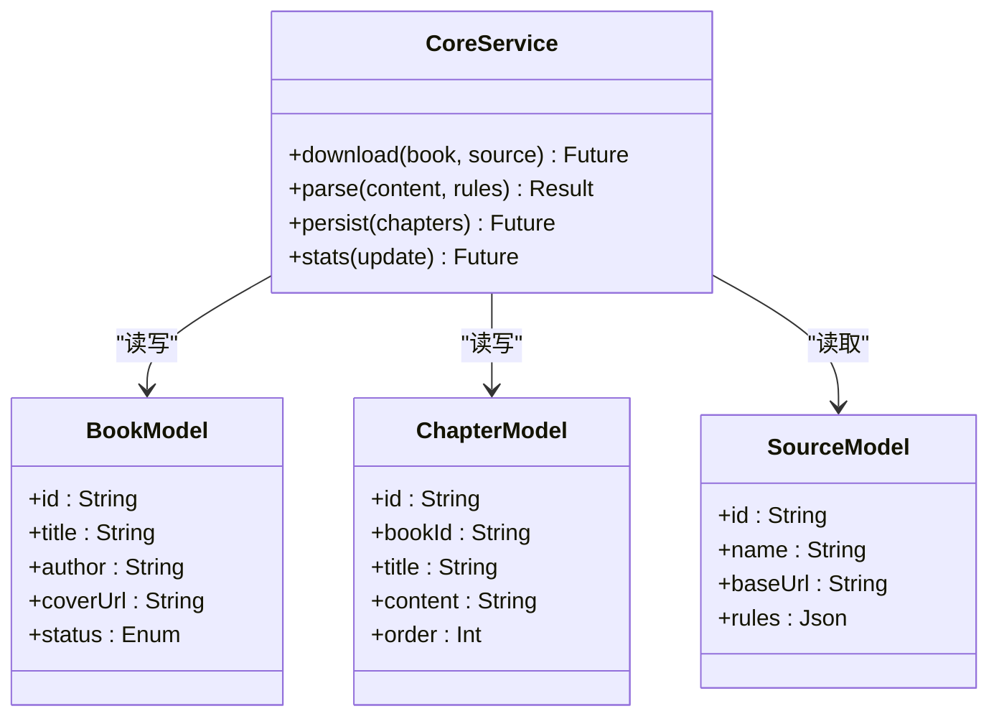
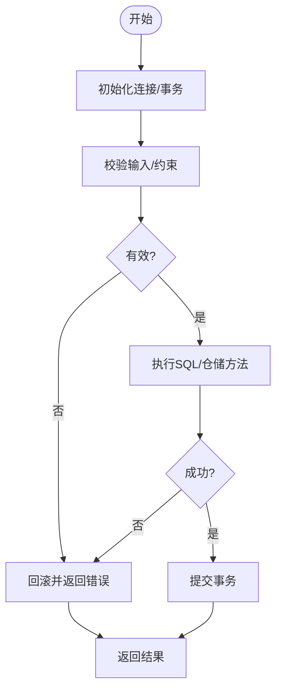
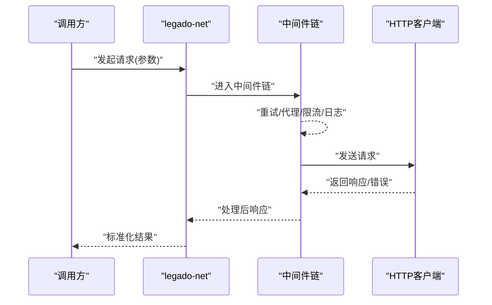
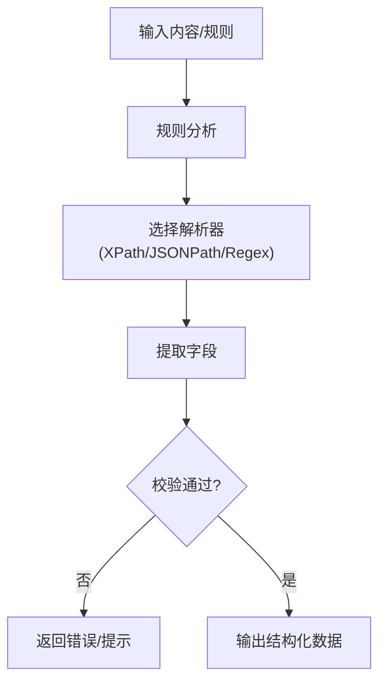
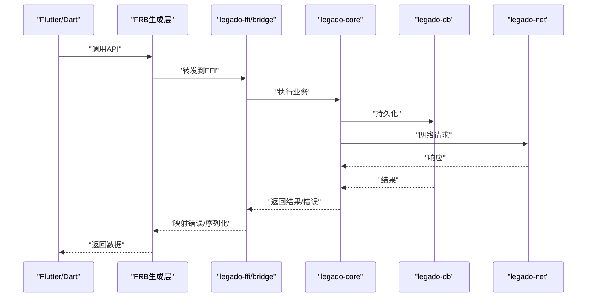
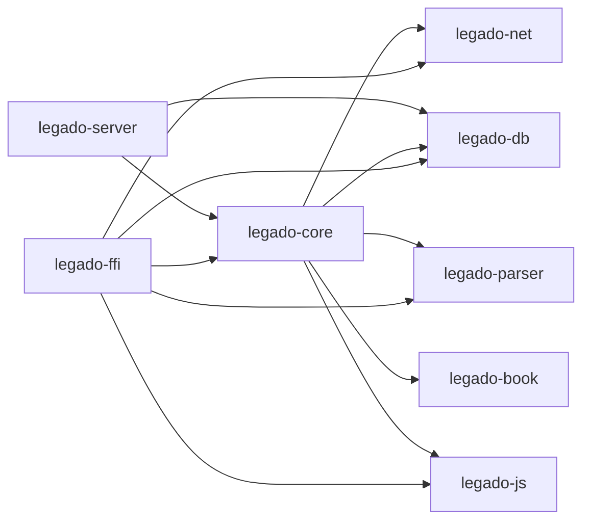

# 核心架构设计

<cite>
**本文引用的文件**   
- [rust/Cargo.toml](file://rust/Cargo.toml)
- [rust/legado-core/src/lib.rs](file://rust/legado-core/src/lib.rs)
- [rust/legado-core/src/models/mod.rs](file://rust/legado-core/src/models/mod.rs)
- [rust/legado-core/src/error.rs](file://rust/legado-core/src/error.rs)
- [rust/legado-db/src/lib.rs](file://rust/legado-db/src/lib.rs)
- [rust/legado-db/src/connection.rs](file://rust/legado-db/src/connection.rs)
- [rust/legado-net/src/lib.rs](file://rust/legado-net/src/lib.rs)
- [rust/legado-parser/src/lib.rs](file://rust/legado-parser/src/lib.rs)
- [rust/legado-ffi/src/lib.rs](file://rust/legado-ffi/src/lib.rs)
- [rust/legado-ffi/src/bridge.rs](file://rust/legado-ffi/src/bridge.rs)
- [rust/legado-js/src/lib.rs](file://rust/legado-js/src/lib.rs)
- [flutter_legado/flutter_rust_bridge.yaml](file://flutter_legado/flutter_rust_bridge.yaml)
</cite>

## 目录
1. [简介](#简介)
2. [项目结构](#项目结构)
3. [核心组件](#核心组件)
4. [架构总览](#架构总览)
5. [详细组件分析](#详细组件分析)
6. [依赖关系分析](#依赖关系分析)
7. [性能考量](#性能考量)
8. [故障排查指南](#故障排查指南)
9. [结论](#结论)
10. [附录](#附录)

## 简介
本文件面向Legado项目的Rust核心库，系统性阐述其模块化设计、分层架构与依赖管理策略。重点覆盖legado-core（领域模型与业务编排）、legado-db（数据持久化与迁移）、legado-net（网络请求与中间件）、legado-parser（规则解析与内容抽取）等模块的职责边界与接口契约；同时说明异步处理模型、错误处理策略、FFI接口设计与Flutter/Android集成方式，并提供架构图与数据流图帮助开发者快速把握整体设计思路。

## 项目结构
Rust核心库位于仓库的rust目录下，采用多crate的Cargo工作区组织，各crate职责清晰、耦合可控：
- legado-core：领域模型、业务编排、通用工具（加密、布局、阅读状态等）
- legado-db：SQLite数据库访问、迁移、仓储层
- legado-net：HTTP客户端、Cookie存储、重试、代理、SSL配置、速率限制等
- legado-parser：HTML/XPath/JSONPath/正则引擎、规则分析与补全
- legado-ffi：对外暴露的C/FFI接口与桥接层（含FRB生成代码）
- legado-js：JS脚本引擎与沙箱、宿主API绑定
- legado-server：Web服务与WebSocket（用于调试/管理界面）
- legado-book：电子书格式处理（EPUB/Mobi/PDF/TXT/UMD）

图表来源
- [rust/Cargo.toml](file://rust/Cargo.toml)

章节来源
- [rust/Cargo.toml](file://rust/Cargo.toml)

## 核心组件
- legado-core：定义领域模型（书籍、章节、源、RSS等），提供业务编排能力（下载、缓存、阅读统计、自动任务、搜索、规则匹配等）。通过统一错误类型和异步API向上层暴露能力。
- legado-db：封装SQLite连接、Schema与迁移、仓储接口（BookRepository、ChapterRepository、SourceRepository等），提供事务与并发安全访问。
- legado-net：基于异步HTTP客户端，实现Cookie持久化、重试、代理、SSL自定义、速率限制、验证与远程书源交互。
- legado-parser：解析HTML/XPath/JSONPath/正则表达式，支持规则分析与补全，为源规则执行提供基础能力。
- legado-ffi：将核心能力以稳定C ABI暴露给上层（Android/Flutter），包含桥接、错误映射、运行时初始化与生命周期管理。
- legado-js：提供JS脚本引擎与沙箱隔离，暴露宿主API（文件、加密、网络、配置等），支撑动态源与扩展逻辑。
- legado-server：提供Web API与WebSocket，便于调试、管理与前端页面交互。
- legado-book：提供电子书格式读写与搜索能力，服务于导出与本地书处理。

章节来源
- [rust/legado-core/src/lib.rs](file://rust/legado-core/src/lib.rs)
- [rust/legado-db/src/lib.rs](file://rust/legado-db/src/lib.rs)
- [rust/legado-net/src/lib.rs](file://rust/legado-net/src/lib.rs)
- [rust/legado-parser/src/lib.rs](file://rust/legado-parser/src/lib.rs)
- [rust/legado-ffi/src/lib.rs](file://rust/legado-ffi/src/lib.rs)
- [rust/legado-js/src/lib.rs](file://rust/legado-js/src/lib.rs)

## 架构总览
整体采用“平台无关的核心库 + FFI桥接 + 上层应用”的分层架构：
- 表现层（Android/Flutter/Web）通过FFI或HTTP调用核心能力
- FFI层负责ABI稳定、错误映射、线程与资源管理
- 核心层按职责拆分为领域、数据、网络、解析、脚本等子模块
- 数据层使用SQLite并通过仓储模式屏蔽细节
- 网络层抽象HTTP客户端，统一中间件与重试策略
- 解析层提供规则驱动的内容抽取与转换

图表来源
- [rust/legado-ffi/src/lib.rs](file://rust/legado-ffi/src/lib.rs)
- [rust/legado-core/src/lib.rs](file://rust/legado-core/src/lib.rs)
- [rust/legado-db/src/lib.rs](file://rust/legado-db/src/lib.rs)
- [rust/legado-net/src/lib.rs](file://rust/legado-net/src/lib.rs)
- [rust/legado-parser/src/lib.rs](file://rust/legado-parser/src/lib.rs)
- [rust/legado-js/src/lib.rs](file://rust/legado-js/src/lib.rs)
- [rust/legado-server/src/lib.rs](file://rust/legado-server/src/lib.rs)

## 详细组件分析

### legado-core：领域模型与业务编排
- 职责：定义书籍、章节、源、RSS等核心模型；编排下载、缓存、阅读统计、自动任务、搜索、规则匹配等业务流程；提供统一的错误类型与异步API。
- 关键设计：
  - 模型集中管理于models目录，确保跨模块一致性
  - 错误类型统一，便于FFI映射与上层处理
  - 异步优先，配合tokio等运行时进行IO密集操作
- 典型交互：
  - 下载流程：core协调net获取内容、parser解析、db持久化、book处理格式
  - 阅读统计：读取/更新read_state与reading_stats，结合cache_book提升体验

图表来源
- [rust/legado-core/src/models/mod.rs](file://rust/legado-core/src/models/mod.rs)
- [rust/legado-core/src/lib.rs](file://rust/legado-core/src/lib.rs)

章节来源
- [rust/legado-core/src/lib.rs](file://rust/legado-core/src/lib.rs)
- [rust/legado-core/src/models/mod.rs](file://rust/legado-core/src/models/mod.rs)
- [rust/legado-core/src/error.rs](file://rust/legado-core/src/error.rs)

### legado-db：持久化与迁移
- 职责：管理SQLite连接、Schema版本与迁移、仓储接口（Book/Chapter/Source/Bookmark/Cache等），保证事务与并发安全。
- 关键设计：
  - connection模块负责连接池与事务边界
  - repository模块按实体划分仓储，提供CRUD与批量操作
  - migration模块集中管理版本演进
- 典型交互：
  - 写入章节时先校验唯一性，再批量插入
  - 查询列表时分页+索引优化

图表来源
- [rust/legado-db/src/connection.rs](file://rust/legado-db/src/connection.rs)
- [rust/legado-db/src/lib.rs](file://rust/legado-db/src/lib.rs)

章节来源
- [rust/legado-db/src/lib.rs](file://rust/legado-db/src/lib.rs)
- [rust/legado-db/src/connection.rs](file://rust/legado-db/src/connection.rs)

### legado-net：网络与中间件
- 职责：封装HTTP客户端，提供Cookie存储、重试、代理、SSL配置、速率限制、验证、远程书源交互等能力。
- 关键设计：
  - client模块统一请求构建与响应处理
  - middleware模块实现横切关注点（重试、日志、限流等）
  - cookie_store与ssl_config提供可插拔配置
- 典型交互：
  - 下载章节：构造请求→中间件链（重试/代理/UA）→发送→解码→返回

图表来源
- [rust/legado-net/src/lib.rs](file://rust/legado-net/src/lib.rs)

章节来源
- [rust/legado-net/src/lib.rs](file://rust/legado-net/src/lib.rs)

### legado-parser：规则解析与内容抽取
- 职责：解析HTML/XPath/JSONPath/正则表达式，支持规则分析与补全，为源规则执行提供基础能力。
- 关键设计：
  - analyze_rule与rule_analyzer负责规则静态分析与完整性检查
  - html/xpath/jsonpath/regex_engine提供具体解析实现
  - rule_complete辅助生成缺失规则片段
- 典型交互：
  - 对网页内容进行XPath提取→转换为结构化数据→供core持久化

图表来源
- [rust/legado-parser/src/lib.rs](file://rust/legado-parser/src/lib.rs)

章节来源
- [rust/legado-parser/src/lib.rs](file://rust/legado-parser/src/lib.rs)

### legado-ffi：FFI接口与桥接
- 职责：将核心能力以稳定C ABI暴露给上层（Android/Flutter），包含桥接、错误映射、运行时初始化与生命周期管理。
- 关键设计：
  - bridge模块定义稳定的函数签名与数据结构
  - error模块统一错误码与消息映射
  - runtime模块管理初始化、线程与资源释放
  - 与Flutter通过flutter_rust_bridge.yaml生成双向绑定
- 典型交互：
  - Flutter调用FFI→bridge路由→core/db/net/parser执行→错误映射→返回结果

图表来源
- [rust/legado-ffi/src/bridge.rs](file://rust/legado-ffi/src/bridge.rs)
- [rust/legado-ffi/src/lib.rs](file://rust/legado-ffi/src/lib.rs)
- [flutter_legado/flutter_rust_bridge.yaml](file://flutter_legado/flutter_rust_bridge.yaml)

章节来源
- [rust/legado-ffi/src/lib.rs](file://rust/legado-ffi/src/lib.rs)
- [rust/legado-ffi/src/bridge.rs](file://rust/legado-ffi/src/bridge.rs)
- [flutter_legado/flutter_rust_bridge.yaml](file://flutter_legado/flutter_rust_bridge.yaml)

### legado-js：脚本引擎与沙箱
- 职责：提供JS脚本引擎与沙箱隔离，暴露宿主API（文件、加密、网络、配置等），支撑动态源与扩展逻辑。
- 关键设计：
  - engine与engine_pool管理脚本上下文与资源
  - sandbox隔离执行环境，防止越权
  - host_api提供安全的宿主能力绑定
- 典型交互：
  - 加载源脚本→创建沙箱→执行规则→返回结果

章节来源
- [rust/legado-js/src/lib.rs](file://rust/legado-js/src/lib.rs)

## 依赖关系分析
- 模块内聚与解耦：
  - core依赖db/net/parser/js/book，但不反向依赖它们，保持领域层纯净
  - ffi仅依赖core/db/net/parser/js，作为稳定边界
  - server依赖core/db，提供Web管理能力
- 外部依赖：
  - SQLite（通过rusqlite或类似库）
  - HTTP客户端（如reqwest/tokio）
  - 解析库（如html5ever、xpath、jsonpath）
  - FRB（Flutter-Rust Bridge）
- 潜在循环依赖：
  - 通过traits与接口抽象避免循环引用
  - 将共享类型集中在models或types模块

图表来源
- [rust/Cargo.toml](file://rust/Cargo.toml)

章节来源
- [rust/Cargo.toml](file://rust/Cargo.toml)

## 性能考量
- 异步优先：所有IO密集型操作（网络、磁盘、解析）均采用异步，避免阻塞主线程
- 连接池与复用：数据库连接池、HTTP客户端连接复用，减少握手开销
- 批处理与分页：批量插入/更新、分页查询降低内存峰值
- 缓存策略：热点数据（封面、章节缓存）短期缓存，提升读取速度
- 解析优化：规则预编译、增量解析、避免重复DOM遍历
- 资源管理：RAII与显式释放，防止内存泄漏

## 故障排查指南
- 常见错误分类：
  - 网络错误：超时、SSL失败、代理不可用、速率限制
  - 解析错误：XPath/JSONPath语法错误、规则不完整
  - 数据库错误：约束冲突、迁移失败、连接丢失
  - 脚本错误：JS语法错误、沙箱权限不足
- 定位步骤：
  - 启用详细日志（网络/解析/数据库）
  - 检查规则完整性（rule_complete）
  - 验证数据库Schema版本与迁移状态
  - 复现最小用例，隔离问题模块
- 恢复策略：
  - 重试与退避（指数退避）
  - 降级与熔断（网络不可用时切换备用源）
  - 回滚与补偿（事务失败回滚）

章节来源
- [rust/legado-core/src/error.rs](file://rust/legado-core/src/error.rs)
- [rust/legado-ffi/src/error.rs](file://rust/legado-ffi/src/error.rs)

## 结论
Legado的Rust核心库通过清晰的模块化与分层架构，实现了高内聚、低耦合的可维护系统。core作为领域中枢，db/net/parser/js/book各司其职，ffi提供稳定边界，server增强可观测性与管理能力。异步模型与错误处理策略保障了性能与稳定性。建议开发者在扩展新功能时遵循现有边界与接口契约，优先使用异步API与统一错误类型，确保系统一致性与可测试性。

## 附录
- 术语表：
  - FFI：外部函数接口，用于跨语言调用
  - FRB：Flutter-Rust Bridge，自动生成双向绑定
  - 仓储模式：抽象数据访问逻辑，提供统一CRUD接口
- 参考路径：
  - 模型定义：[rust/legado-core/src/models/mod.rs](file://rust/legado-core/src/models/mod.rs)
  - 错误类型：[rust/legado-core/src/error.rs](file://rust/legado-core/src/error.rs)
  - 数据库连接：[rust/legado-db/src/connection.rs](file://rust/legado-db/src/connection.rs)
  - 网络客户端：[rust/legado-net/src/lib.rs](file://rust/legado-net/src/lib.rs)
  - 解析入口：[rust/legado-parser/src/lib.rs](file://rust/legado-parser/src/lib.rs)
  - FFI桥接：[rust/legado-ffi/src/bridge.rs](file://rust/legado-ffi/src/bridge.rs)
  - JS引擎：[rust/legado-js/src/lib.rs](file://rust/legado-js/src/lib.rs)
  - FRB配置：[flutter_legado/flutter_rust_bridge.yaml](file://flutter_legado/flutter_rust_bridge.yaml)