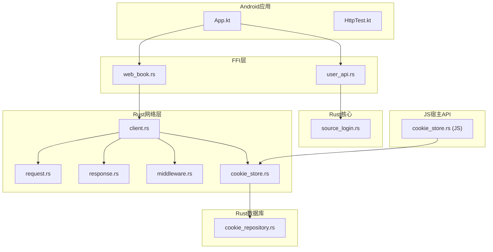
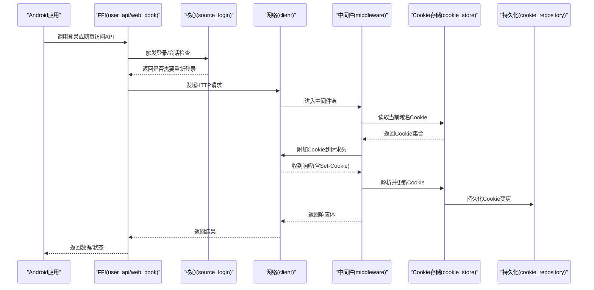
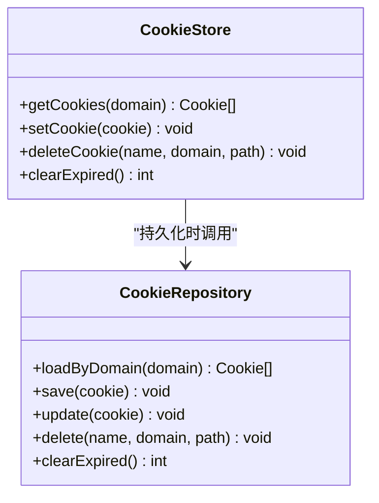
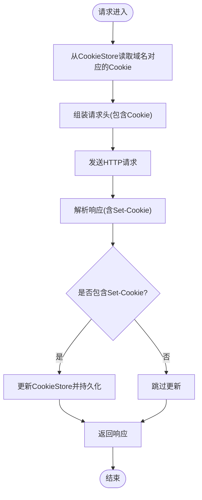
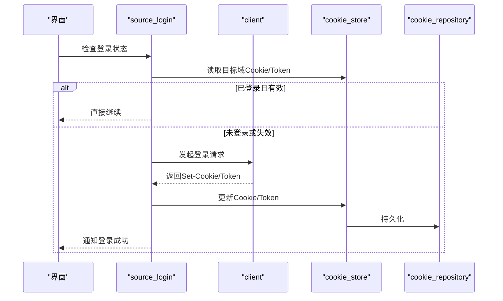
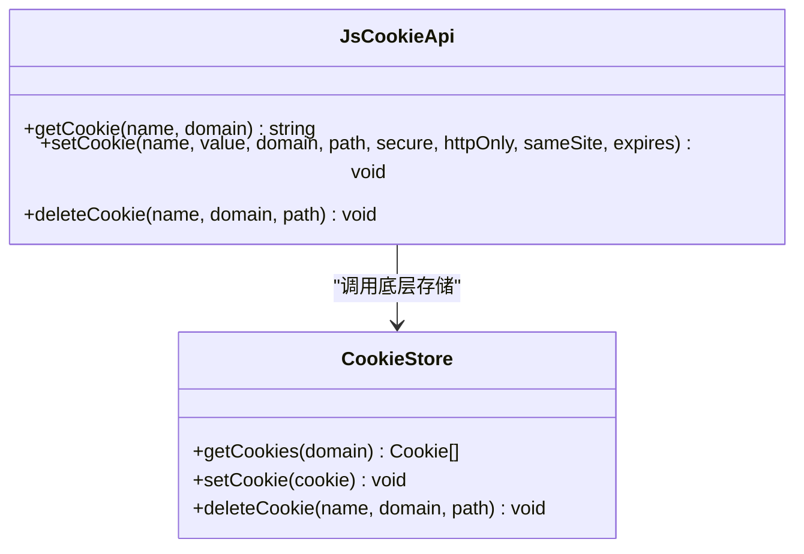
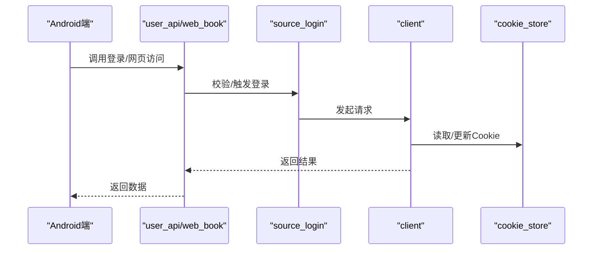
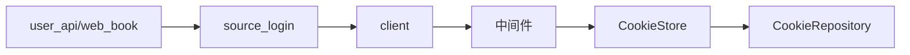

# Cookie和会话管理

<cite>
**本文引用的文件**   
- [cookie_store.rs](file://rust/legado-net/src/cookie_store.rs)
- [cookie_store.rs](file://rust/legado-js/src/host_api/cookie_store.rs)
- [cookie_repository.rs](file://rust/legado-db/src/repository/cookie_repository.rs)
- [client.rs](file://rust/legado-net/src/client.rs)
- [request.rs](file://rust/legado-net/src/request.rs)
- [response.rs](file://rust/legado-net/src/response.rs)
- [middleware.rs](file://rust/legado-net/src/middleware.rs)
- [source_login.rs](file://rust/legado-core/src/source_login.rs)
- [user_api.rs](file://rust/legado-ffi/src/api/user_api.rs)
- [web_book.rs](file://rust/legado-ffi/src/api/web_book.rs)
- [App.kt](file://app/src/main/java/io/legado/app/App.kt)
- [HttpTest.kt](file://app/src/androidTest/java/io/legado/app/HttpTest.kt)
</cite>

## 目录
1. [简介](#简介)
2. [项目结构](#项目结构)
3. [核心组件](#核心组件)
4. [架构总览](#架构总览)
5. [详细组件分析](#详细组件分析)
6. [依赖关系分析](#依赖关系分析)
7. [性能考量](#性能考量)
8. [故障排查指南](#故障排查指南)
9. [结论](#结论)
10. [附录：最佳实践与示例路径](#附录最佳实践与示例路径)

## 简介
本文件系统性梳理Legado项目中Cookie与会话管理的实现，覆盖以下主题：
- Cookie存储机制：内存存储、持久化存储（数据库）、跨域Cookie处理策略
- 会话保持：自动登录、Token管理与状态同步
- 安全特性：HttpOnly、Secure标志与SameSite策略的落地方式
- 最佳实践：过期处理、清理策略、冲突解决
- 代码级示例路径：设置、获取、删除Cookie与维护登录状态的调用位置

## 项目结构
本项目在Rust层实现了统一的Cookie与网络栈，并通过FFI暴露给Android/Kotlin侧使用。关键目录与职责如下：
- Rust网络层（legado-net）：Cookie存储、请求/响应处理、中间件、客户端封装
- Rust核心逻辑（legado-core）：来源登录、会话状态等
- Rust数据库（legado-db）：Cookie持久化仓库
- Rust JS宿主API（legado-js）：为JS脚本提供Cookie操作接口
- FFI层（legado-ffi）：对外暴露用户、WebBook等API
- Android应用（app）：初始化全局配置、测试用例

**图表来源** 
- [App.kt](file://app/src/main/java/io/legado/app/App.kt)
- [HttpTest.kt](file://app/src/androidTest/java/io/legado/app/HttpTest.kt)
- [user_api.rs](file://rust/legado-ffi/src/api/user_api.rs)
- [web_book.rs](file://rust/legado-ffi/src/api/web_book.rs)
- [source_login.rs](file://rust/legado-core/src/source_login.rs)
- [client.rs](file://rust/legado-net/src/client.rs)
- [request.rs](file://rust/legado-net/src/request.rs)
- [response.rs](file://rust/legado-net/src/response.rs)
- [middleware.rs](file://rust/legado-net/src/middleware.rs)
- [cookie_store.rs](file://rust/legado-net/src/cookie_store.rs)
- [cookie_repository.rs](file://rust/legado-db/src/repository/cookie_repository.rs)
- [cookie_store.rs](file://rust/legado-js/src/host_api/cookie_store.rs)

**章节来源**
- [App.kt](file://app/src/main/java/io/legado/app/App.kt)
- [HttpTest.kt](file://app/src/androidTest/java/io/legado/app/HttpTest.kt)

## 核心组件
- Cookie存储（内存+持久化）
  - 内存CookieStore：用于进程内快速读写与会话保持
  - 持久化CookieRepository：将Cookie落库，保证应用重启后仍可恢复
- 网络客户端与中间件
  - 客户端封装统一发起HTTP请求
  - 中间件负责注入Cookie、解析Set-Cookie、更新存储
- 来源登录与会话
  - source_login模块协调登录流程、Token管理与会话状态同步
- JS宿主Cookie API
  - 为JS脚本提供安全的Cookie读写能力
- FFI用户/WebBook API
  - 向Android侧暴露登录、Cookie相关能力

**章节来源**
- [cookie_store.rs](file://rust/legado-net/src/cookie_store.rs)
- [cookie_repository.rs](file://rust/legado-db/src/repository/cookie_repository.rs)
- [client.rs](file://rust/legado-net/src/client.rs)
- [middleware.rs](file://rust/legado-net/src/middleware.rs)
- [source_login.rs](file://rust/legado-core/src/source_login.rs)
- [cookie_store.rs](file://rust/legado-js/src/host_api/cookie_store.rs)
- [user_api.rs](file://rust/legado-ffi/src/api/user_api.rs)
- [web_book.rs](file://rust/legado-ffi/src/api/web_book.rs)

## 架构总览
下图展示一次带Cookie的网络请求从Android到Rust网络层的完整链路，包括中间件对Cookie的注入与更新。

**图表来源** 
- [user_api.rs](file://rust/legado-ffi/src/api/user_api.rs)
- [web_book.rs](file://rust/legado-ffi/src/api/web_book.rs)
- [source_login.rs](file://rust/legado-core/src/source_login.rs)
- [client.rs](file://rust/legado-net/src/client.rs)
- [middleware.rs](file://rust/legado-net/src/middleware.rs)
- [cookie_store.rs](file://rust/legado-net/src/cookie_store.rs)
- [cookie_repository.rs](file://rust/legado-db/src/repository/cookie_repository.rs)

## 详细组件分析

### Cookie存储（内存与持久化）
- 内存CookieStore
  - 提供按域名分组的Cookie集合存取
  - 支持过期判断、路径与域匹配
  - 线程安全访问（并发读/写）
- 持久化CookieRepository
  - 将Cookie序列化为记录并写入SQLite
  - 支持按域名查询、批量更新与清理
  - 与内存CookieStore双向同步（启动加载、变更回写）

**图表来源** 
- [cookie_store.rs](file://rust/legado-net/src/cookie_store.rs)
- [cookie_repository.rs](file://rust/legado-db/src/repository/cookie_repository.rs)

**章节来源**
- [cookie_store.rs](file://rust/legado-net/src/cookie_store.rs)
- [cookie_repository.rs](file://rust/legado-db/src/repository/cookie_repository.rs)

### 网络客户端与中间件（Cookie注入与更新）
- 客户端封装
  - 统一构建请求、执行网络IO、处理错误重试
- 中间件
  - 入站：从CookieStore读取对应域名的Cookie并注入到请求头
  - 出站：解析响应中的Set-Cookie，更新CookieStore并持久化
  - 可插拔扩展点，便于后续增加签名、鉴权等逻辑

**图表来源** 
- [client.rs](file://rust/legado-net/src/client.rs)
- [middleware.rs](file://rust/legado-net/src/middleware.rs)
- [request.rs](file://rust/legado-net/src/request.rs)
- [response.rs](file://rust/legado-net/src/response.rs)
- [cookie_store.rs](file://rust/legado-net/src/cookie_store.rs)

**章节来源**
- [client.rs](file://rust/legado-net/src/client.rs)
- [middleware.rs](file://rust/legado-net/src/middleware.rs)
- [request.rs](file://rust/legado-net/src/request.rs)
- [response.rs](file://rust/legado-net/src/response.rs)

### 来源登录与会话保持（自动登录、Token管理、状态同步）
- 自动登录
  - 在需要鉴权的页面或接口前，检查本地Cookie/Token是否存在且有效
  - 若失效则触发登录流程，成功后刷新Cookie/Token并同步状态
- Token管理
  - 优先使用服务端下发的Cookie进行会话维持
  - 对于需显式Token的场景，采用独立字段存储并与Cookie解耦
- 状态同步
  - 登录成功/失败事件广播，通知UI层刷新
  - 多来源登录时，按域名隔离Cookie避免冲突

**图表来源** 
- [source_login.rs](file://rust/legado-core/src/source_login.rs)
- [cookie_store.rs](file://rust/legado-net/src/cookie_store.rs)
- [cookie_repository.rs](file://rust/legado-db/src/repository/cookie_repository.rs)
- [client.rs](file://rust/legado-net/src/client.rs)

**章节来源**
- [source_login.rs](file://rust/legado-core/src/source_login.rs)

### JS宿主Cookie API（脚本侧安全访问）
- 为JS脚本提供受限的Cookie读写能力
- 限制敏感属性（如HttpOnly）不可被脚本访问
- 支持按域隔离，防止跨域污染

**图表来源** 
- [cookie_store.rs](file://rust/legado-js/src/host_api/cookie_store.rs)
- [cookie_store.rs](file://rust/legado-net/src/cookie_store.rs)

**章节来源**
- [cookie_store.rs](file://rust/legado-js/src/host_api/cookie_store.rs)

### FFI用户与WebBook API（Android侧入口）
- user_api：面向用户的登录、状态查询等能力
- web_book：网页阅读相关的Cookie与状态管理

**图表来源** 
- [user_api.rs](file://rust/legado-ffi/src/api/user_api.rs)
- [web_book.rs](file://rust/legado-ffi/src/api/web_book.rs)
- [source_login.rs](file://rust/legado-core/src/source_login.rs)
- [client.rs](file://rust/legado-net/src/client.rs)
- [cookie_store.rs](file://rust/legado-net/src/cookie_store.rs)

**章节来源**
- [user_api.rs](file://rust/legado-ffi/src/api/user_api.rs)
- [web_book.rs](file://rust/legado-ffi/src/api/web_book.rs)

## 依赖关系分析
- 低耦合高内聚
  - CookieStore专注于Cookie生命周期管理
  - CookieRepository专注持久化
  - 中间件仅关注请求/响应阶段的Cookie装配与更新
- 外部依赖
  - SQLite用于持久化
  - 网络库用于实际HTTP通信
- 潜在循环依赖
  - 通过分层与接口隔离避免循环引用

**图表来源** 
- [cookie_store.rs](file://rust/legado-net/src/cookie_store.rs)
- [cookie_repository.rs](file://rust/legado-db/src/repository/cookie_repository.rs)
- [middleware.rs](file://rust/legado-net/src/middleware.rs)
- [client.rs](file://rust/legado-net/src/client.rs)
- [source_login.rs](file://rust/legado-core/src/source_login.rs)
- [user_api.rs](file://rust/legado-ffi/src/api/user_api.rs)
- [web_book.rs](file://rust/legado-ffi/src/api/web_book.rs)

**章节来源**
- [cookie_store.rs](file://rust/legado-net/src/cookie_store.rs)
- [cookie_repository.rs](file://rust/legado-db/src/repository/cookie_repository.rs)
- [middleware.rs](file://rust/legado-net/src/middleware.rs)
- [client.rs](file://rust/legado-net/src/client.rs)
- [source_login.rs](file://rust/legado-core/src/source_login.rs)
- [user_api.rs](file://rust/legado-ffi/src/api/user_api.rs)
- [web_book.rs](file://rust/legado-ffi/src/api/web_book.rs)

## 性能考量
- 内存CookieStore应使用高效的数据结构（如HashMap按域索引），减少遍历开销
- 持久化写入采用批量更新与事务，降低SQLite锁竞争
- 过期清理采用懒加载+定时任务结合，避免每次请求都扫描全表
- 中间件对Cookie的读写应尽量缓存热点域名的Cookie集合，减少重复IO

[本节为通用指导，不直接分析具体文件]

## 故障排查指南
- 常见问题
  - Cookie未生效：检查域名、路径、Secure/HttpOnly/SameSite设置是否与请求一致
  - 登录后仍被踢出：确认Set-Cookie是否正确返回并被中间件解析
  - 跨域问题：确保域匹配规则正确，必要时调整domain与path
- 定位步骤
  - 开启日志：打印请求头中的Cookie与响应头中的Set-Cookie
  - 检查持久化：查看数据库中对应域的Cookie记录是否更新
  - 复现最小用例：通过测试用例或简化请求验证问题范围

**章节来源**
- [middleware.rs](file://rust/legado-net/src/middleware.rs)
- [cookie_store.rs](file://rust/legado-net/src/cookie_store.rs)
- [cookie_repository.rs](file://rust/legado-db/src/repository/cookie_repository.rs)

## 结论
Legado在Rust层构建了完整的Cookie与会话管理体系：以内存CookieStore为核心，配合持久化CookieRepository保障跨进程稳定性；通过中间件在请求/响应阶段无缝装配与更新Cookie；借助source_login实现自动登录与Token管理；FFI层为Android与JS提供安全可控的接口。整体设计清晰、可扩展性强，满足复杂来源登录与网页浏览场景的需求。

[本节为总结性内容，不直接分析具体文件]

## 附录：最佳实践与示例路径
- 设置Cookie
  - 通过中间件解析Set-Cookie并调用CookieStore.setCookie
  - 参考路径：[middleware.rs](file://rust/legado-net/src/middleware.rs)、[cookie_store.rs](file://rust/legado-net/src/cookie_store.rs)
- 获取Cookie
  - 在请求前由中间件从CookieStore读取并按域匹配注入
  - 参考路径：[middleware.rs](file://rust/legado-net/src/middleware.rs)、[cookie_store.rs](file://rust/legado-net/src/cookie_store.rs)
- 删除Cookie
  - 调用CookieStore.deleteCookie，并持久化到CookieRepository
  - 参考路径：[cookie_store.rs](file://rust/legado-net/src/cookie_store.rs)、[cookie_repository.rs](file://rust/legado-db/src/repository/cookie_repository.rs)
- 维护登录状态
  - 使用source_login检查/触发登录，成功后刷新Cookie/Token
  - 参考路径：[source_login.rs](file://rust/legado-core/src/source_login.rs)
- 安全特性
  - HttpOnly：禁止脚本访问敏感Cookie
  - Secure：仅在HTTPS下传输
  - SameSite：控制跨域携带策略
  - 参考路径：[cookie_store.rs](file://rust/legado-net/src/cookie_store.rs)、[cookie_store.rs](file://rust/legado-js/src/host_api/cookie_store.rs)
- 过期处理与清理
  - 定期清理过期Cookie，避免数据库膨胀
  - 参考路径：[cookie_store.rs](file://rust/legado-net/src/cookie_store.rs)、[cookie_repository.rs](file://rust/legado-db/src/repository/cookie_repository.rs)
- 冲突解决
  - 同域同名Cookie以最新值为准；不同域严格隔离
  - 参考路径：[cookie_store.rs](file://rust/legado-net/src/cookie_store.rs)
- 示例与测试
  - Android端HTTP测试用例可作为参考
  - 参考路径：[HttpTest.kt](file://app/src/androidTest/java/io/legado/app/HttpTest.kt)